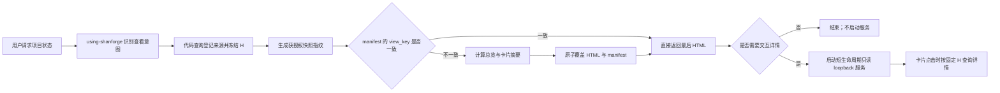

# PM-DASHBOARD-003：按需实时项目看板设计 Brief

- 阶段：`BRAINSTORM / DESIGN`
- 状态：`design_ready_for_human_confirmation`
- 范围：项目状态缓存、项目查看模板、按需详情查询服务
- 不在本轮范围：生产 renderer、生产投影适配器、常驻服务、事实迁移和删除旧文件

## 1. 设计结论

采用“最新静态快照 + 按需临时服务”的混合方案。

- 普通“获取项目状态”：只检查快照指纹。进度未变化时直接返回最后的 HTML；变化时才重算并原子覆盖同一路径。
- “打开项目看板 / 查看详情”：复用同一 HTML 外壳，按需启动只读 loopback 服务。首屏只包含总览和少量卡片摘要；点击卡片再查询需求、任务、证据、关系和活动详情。
- Excel 只保留为这次信息架构和字段设计的参考，不参与任何运行时查询、刷新判断或页面生成。
- `.factory/pm/` 不再作为第二套项目事实库；它只适合作为“最后一版展示缓存”的落点。

## 2. 为什么不选另外两个方案

| 方案 | 优点 | 主要问题 | 结论 |
|---|---|---|---|
| 混合：最新静态快照 + 按需临时服务 | 首屏快、无变化零重算、详情实时、服务无需常驻 | 需要两种查看模式和清晰的快照一致性处理 | **推荐** |
| 纯静态：把十个模块和全部详情写进 HTML | 无服务、可离线 | 首次生成慢、文件大、详情容易过期、权限数据进入 HTML 源码 | 不选 |
| 常驻本地服务：所有内容都实时 API 化 | 交互最完整 | 生命周期、安全、端口和资源成本过高；普通状态查询也被迫依赖服务 | 不选 |

## 3. `.factory/pm/` 收敛方案

当前目录混合了派生汇总、人工作业记录和展示缓存，应拆开治理。

| 当前内容 | 性质 | 目标处置 |
|---|---|---|
| `dashboard.md`、`wbs.md`、`milestones.md`、`status-reports/` | 可由项目索引、正式文档、work item ledger、review/evidence 和 Git 事实派生，且当前内容已经过期 | 停止维护；事实覆盖验证后删除 |
| `project-brief.md`、`team-raci.md`、`communication-plan.md`、`closure-report.md` | 与正式项目文档、角色配置或 work item 产物重叠 | 映射到正式单文件或 work item 后删除 |
| `risk-register.jsonl`、`change-register.jsonl`、`meeting-notes/` | 当前包含不能凭代码地图自动推断的人类决策或管理事件 | 先迁移到正式事件/ledger/evidence；迁移前不能直接删除 |
| `generated/*` | 可丢弃展示缓存 | 只保留最后的 `status-dashboard.html` 和配套 manifest |

目标目录：

```text
.factory/pm/
├── README.md
└── generated/
    ├── status-dashboard.html
    └── status-dashboard.manifest.json
```

`README.md` 只说明缓存边界和回源规则，不承载项目状态。

## 4. 状态请求完整流程



AI 负责识别“状态查看 / 交互查看”的意图、调用已登记能力和解释结果。完成率、状态映射、风险、逾期、权限、快照和 HTML 均由固定代码计算。

## 5. 刷新判断与最新版本缓存

刷新判断不读取 HTML 正文，只读取小型 manifest，并与本次获授权快照绑定比较。

```json
{
  "schema_version": "StatusDashboardCacheManifest/v1",
  "project_id": "shanforge",
  "view_key": "sha256(project+snapshot+auth+template+locale)",
  "snapshot_id": "...",
  "snapshot_sha256": "...",
  "as_of_H": 0,
  "authorization_digest": "...",
  "template_sha256": "...",
  "artifact_path": ".factory/pm/generated/status-dashboard.html",
  "artifact_sha256": "...",
  "generated_at": "...",
  "detail_mode": "on_demand"
}
```

复用条件必须全部成立：

1. `view_key` 与本次查询一致；
2. HTML 文件存在且其摘要等于 `artifact_sha256`；
3. disposition 允许展示；
4. 当前 principal 的授权摘要一致；
5. 模板版本一致。

否则写临时文件并原子替换固定的 HTML 和 manifest。目录中不保留带时间戳的历史页面。

## 6. 模板信息架构

默认页面不复刻 Excel 的十张长表，但必须让使用者一眼确认十要素没有丢失。页面采用“两层信息架构”：先用十要素管理驾驶舱显式呈现每个模块的健康度和摘要，再用五个面向决策的工作视图承载日常查看；点击要素或卡片后才按需查询明细。

Excel 十要素的显式驾驶舱固定为：

1. **项目成员**：角色、责任边界与 RACI；
2. **项目策划**：目标、范围、验收、阶段和 Gate；
3. **WBS**：需求、计划、任务和分解完整度；
4. **进度计划**：里程碑、迭代、时间偏差和下一节点；
5. **风险管理**：风险、等级、责任人和处置状态；
6. **沟通计划**：干系人、频率、渠道和关键节点；
7. **会议与行动**：会议决议、行动项、责任人和期限；
8. **状态报告**：固定 H 的项目快照、验证与发布资格；
9. **变更管理**：变更请求、影响、审批和落实状态；
10. **项目总结**：目标达成、经验、遗留项和关闭资格。

十要素不是另一套事实库，也不是十份预先塞满的详情。每张卡片只显示 `健康度 + 核心指标 + 一句摘要`，点击后从同一固定快照按需加载检查项、事实来源和关系。

五个工作视图为：

1. **总览**：当前阶段、Gate、产品需求进度、执行计划进度、阻塞、风险、下一里程碑和验证健康度。
2. **看板**：任务/需求卡片的当前流动状态，是默认主视图。
3. **路线图**：里程碑、迭代和时间偏差；按需加载。
4. **风险与决策**：风险、变更、待审批和冲突；按需加载。
5. **活动与证据**：最新 ledger、review、verification 和 Git 事实；按需加载。

### 6.1 桌面布局

```text
┌ 项目 / 当前阶段 / H / 快照状态 ───────────── 搜索  筛选  刷新检查 ┐
├ 产品需求 26/123 ─ 执行计划 8/8 ─ 阻塞 1 ─ 风险 2 ─ 下一 Gate ┤
├ 需要关注：精确哈希待人工确认 / 正式发布未授权                 ┤
├ 项目成员｜项目策划｜WBS｜进度计划｜风险管理                    ┤
├ 沟通计划｜会议行动｜状态报告｜变更管理｜项目总结                ┤
├ [看板] [路线图] [需求] [风险与决策] [活动与证据]              ┤
├ 待办 ─────── 就绪 ─────── 进行中 ─────── 待评审/确认 ── 已完成 ┤
│ 卡片摘要       卡片摘要       卡片摘要         卡片摘要       卡片摘要 │
│ ID/类型/标题    优先级/责任人  Gate/阻塞/时间    证据状态       完成时间 │
│ 每列首批 5 条，继续滚动或“加载更多”                              │
└ 快照 H / snapshot / source / auth / template / 缓存处置 ──────┘
                                                    ┌────────────┐
                         点击卡片后按需打开 →       │ 详情抽屉   │
                                                    │概要 需求   │
                                                    │证据 关系   │
                                                    │活动        │
                                                    └────────────┘
```

### 6.2 看板状态模型

固定五列：`待办`、`就绪`、`进行中`、`待评审/确认`、`已完成`。

- “阻塞”不是独立列，而是卡片状态标记；这样不会丢失对象在真实流程中的位置。
- 卡片只展示：ID、类型、标题、优先级、责任人、当前节点、Gate/阻塞、到期或更新时间、证据健康度。
- 完成率分开显示“产品需求实现”和“本轮执行计划”，禁止合成一个误导性的总百分比。
- 看板是只读视图；不提供拖拽改状态，避免项目查看行为产生业务写入。

### 6.3 详情抽屉

卡片点击先用已有摘要立即打开抽屉并显示 skeleton，再请求当前对象详情。抽屉按标签页渐进加载：

- `概要`：状态、目标、责任人、优先级、时间、Gate、阻塞；
- `需求`：验收标准、依赖、追踪关系；
- `证据`：测试、评审、验证、候选/发布资格；
- `关系`：父子任务、相邻阶段、依赖和影响范围；
- `活动`：最新事件；游标分页。

如果详情查询发现快照已经变化，服务返回 `409 snapshot_changed`。页面提示“项目状态已更新”，由用户刷新到新快照；禁止把旧总览和新详情混在同一页面。

### 6.4 响应式与可访问性

- `>= 1024px`：横向五列看板 + 右侧抽屉；
- `768–1023px`：可横向滚动看板 + 覆盖式抽屉；
- `< 768px`：列状态切换器 + 单列卡片流，详情使用底部 sheet；
- 键盘：`/` 聚焦搜索，方向键移动卡片，`Enter` 打开，`Esc` 关闭；
- 可见 focus、WCAG AA 对比度、`prefers-reduced-motion`、状态不只依赖颜色表达；
- 首屏不依赖外部字体、图标 CDN 或网络资源。

## 7. 按需本地服务

### 7.1 启动策略

- 仅“返回当前状态”或复用 HTML：**不启动服务**。
- 用户要求“打开项目 / 交互查看 / 查看需求详情”：**启动一次会话级临时服务**。
- 服务空闲 10 分钟自动退出；同一查看会话复用，不为每次卡片点击重启。

### 7.2 安全和一致性

- 只绑定 `127.0.0.1` 的随机端口；
- 只读 `GET`，不暴露项目写接口；
- 短生命周期 view token，权限过滤发生在响应生成前；
- 每个请求必须带 `project_id + as_of_H + snapshot_sha256 + authorization_digest`；
- 支持 `ETag / If-None-Match`；无变化返回 `304`；
- 服务响应和静态 HTML 都不得包含无权限字段；
- 默认不轮询、不用 WebSocket。只在用户刷新检查或打开详情时查询；后续如确有需要再加 SSE 的“快照已变化”单一事件。

### 7.3 最小只读 API

```text
GET /api/v1/projects/{project_id}/snapshot
GET /api/v1/projects/{project_id}/board?cursor=&status=&type=&owner=&priority=
GET /api/v1/projects/{project_id}/items/{item_id}
GET /api/v1/projects/{project_id}/items/{item_id}/requirements
GET /api/v1/projects/{project_id}/items/{item_id}/evidence
GET /api/v1/projects/{project_id}/items/{item_id}/relations
GET /api/v1/projects/{project_id}/items/{item_id}/activity?cursor=
GET /api/v1/projects/{project_id}/risks?cursor=
GET /api/v1/projects/{project_id}/roadmap
```

所有响应都绑定 `snapshot_id`、`snapshot_sha256`、`as_of_H`、`authorization_digest` 和 `etag`。

## 8. 性能预算

| 场景 | 目标 |
|---|---:|
| manifest 命中并返回既有 HTML | p95 `< 100 ms`，不读完整事实集 |
| 快照变化后的总览和首批看板生成 | p95 `< 1 s` |
| HTML 首屏未压缩体积 | `< 180 KB` |
| 首屏内嵌卡片 | 每列最多 5 条，总计最多 25 条 |
| 已启动服务的详情查询 | p95 `< 300 ms` |
| 服务冷启动 | p95 `< 800 ms` |

## 9. 当前实现边界

仓库当前已经有固定 H、快照绑定、权限过滤、disposition、三入口复用和 15 行 `ProjectStatusResponse/v4`。但默认 composition 明确使用 `as_of_H=5` 的 `InMemoryProjectionStore`、`InMemoryProjectStatusStore` 和固定 `FLOW-CONTRACT-001/T08` 数据。

所以本设计不能被描述为已经交付的实时项目看板。后续实施仍需：

1. 将项目索引、正式文档、work item ledger、review/evidence、Git 和人工事件接入生产投影；
2. 增加 cache manifest 和 latest-only 原子 renderer；
3. 实现精简首屏模板和详情只读 API；
4. 迁移 `.factory/pm/` 中不可推导的人类事实；
5. 完成权限、同 H、缓存命中、浏览器、安全和性能验证。

## 10. 设计验收标准

- Excel 在运行时零读取；
- 无状态变化时不重渲染，直接返回同一 HTML；
- `.factory/pm/generated/` 最多保留一个 HTML 和一个 manifest；
- 首屏不包含完整需求正文、全部证据或全部活动；
- 点击卡片后才请求详情，且详情与页面绑定同一 H；
- 静态查看不需要服务，交互查看才启动临时只读服务；
- 权限过滤先于缓存和渲染；
- 页面是查看器，不因打开、筛选或拖动而修改项目事实。

## 11. 页面原型

- 原型：`design-assets/prototype/status-dashboard-prototype.html`
- 数据：明确标注的示例快照，不作为项目实时事实
- 已实现交互：项目管理十要素驾驶舱、十要素点击详情、看板搜索、类型/关注筛选、移动端列切换、卡片详情抽屉、详情标签页、键盘快捷键、服务未连接提示
- 服务边界：页面通过未来的数据适配器连接本地服务；常驻或按需生命周期的选择不改变当前页面结构
- 验证：见 `evidence/prototype-verification.md`
