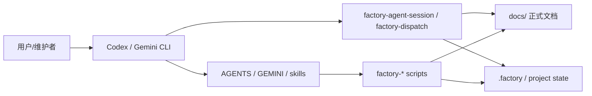

# 系统架构设计

**项目名称：** 山海工枢 / shanforge  
**文档状态：** 已确认基线  
**负责人：** 仓库维护者  
**主要读者：** 架构 | 开发 | 测试 | 运维  
**上游输入：** PRD | `NFR-001` ~ `NFR-003` | 风险登记册  
**下游输出：** 模块边界 | 接口契约 | 实施计划 | 测试计划  
**关联 ID：** `REQ-001` ~ `REQ-006`, `NFR-001` ~ `NFR-003`, `ADR-001` ~ `ADR-003`, `MOD-001` ~ `MOD-004`, `API-001` ~ `API-005`  
**最后更新：** 2026-03-27  

## 1. 架构概览

- 系统目标：把共享 rules、skills、脚本和文档组织成一套可执行的软件工厂体系。
- 总体思路：把“人类文档”“AI 运行时协议”“命令入口”和“项目状态/追踪”拆成分层协作结构。
- 架构风格：CLI-first、本地文件驱动、文档与脚本双轨协同。

## 2. 设计驱动因素

| 类型 | 条目 | 影响 |
|---|---|---|
| 功能需求 | `REQ-001` | 必须提供清晰的人类文档入口 |
| 功能需求 | `REQ-003` | 当前架构必须以 CLI-first 为主 |
| 功能需求 | `REQ-004` | 必须拆分正式文档层与 AI 记忆层 |
| 非功能需求 | `NFR-001` | 需要低成本发现关键文档和入口 |
| 非功能需求 | `NFR-002` | 配置与文档入口必须一致 |
| 风险 | `RISK-002` | 需要防止正式人类文档入口出现双轨或过期路径 |

## 3. 逻辑分层与关键组件

| 组件/模块 | 职责 | 输入 | 输出 | 依赖 |
|---|---|---|---|---|
| `MOD-001` 文档层 | 管理正式需求、设计、使用和追踪文档 | Markdown 文档、项目决策 | 结构化人类文档 | `MOD-002`, `MOD-003` |
| `MOD-002` 规则与技能层 | 定义运行时协议、角色职责和专业能力 | `AGENTS.md`, `GEMINI.md`, `skills/` | 行为约束、阅读顺序、能力边界 | 无 |
| `MOD-003` 命令与工作流层 | 暴露统一脚本入口和阶段动作 | 用户请求、项目路径、配置 | 执行动作、更新文档与状态 | `MOD-002`, `MOD-004` |
| `MOD-004` 状态与追踪层 | 保存项目状态、AI 记忆和工作项 | 配置、执行结果、阶段事实 | `.factory/`、配置、追踪关系 | `MOD-001`, `MOD-003` |

## 4. 关键数据流与时序

### 场景 1：初始化或接手一个软件工厂项目

1. 用户在 `Codex` 或 `Gemini CLI` 中描述目标。
2. 模型先读取项目规则、当前状态和当前阶段文档。
3. 模型优先选择 `factory-agent-session`、`factory-dispatch` 或高层命令入口。
4. 脚本更新 `docs/`、`.factory/`、工作项或项目配置。
5. 用户通过正式文档和结果输出继续推进下一阶段。

### 场景 2：维护这套软件工厂自身文档

1. 维护者识别脚本、规则或使用路径发生变化。
2. 先更新 `docs/` 中对应的需求、设计或用户说明。
3. 再同步调整默认配置和 skill 入口说明。
4. 所有与软件工厂项目本身相关的人类说明文档统一维护在 `docs/`，专项 workflow 文档不再承担正式入口。

## 5. 数据设计摘要

- 关键实体：
  - `config/software-factory.defaults.json`
  - `docs/*`
  - 被管理项目中的 `.factory/project.json`、`.factory/memory/*`、`.factory/workitems/*`
- 数据生命周期：
  - 全局规则与模板常驻当前仓库。
  - 被管理项目的状态数据由脚本按阶段生成和更新。
- 一致性要求：
  - 文档入口、配置入口和运行时协议要保持一致。
  - 正式文档与 AI 记忆职责清晰分层。
- 当前治理状态：
  - `docs/` 已成为唯一正式人类文档入口。
  - 默认人类文档引用已经切换到 `docs/`。
  - 与软件工厂项目本身相关的 `workflows/` 文档副本已经删除。

## 6. 部署与运行拓扑

- 环境：本地开发机 / CLI 宿主环境。
- 运行节点：`Codex` 或 `Gemini CLI` 会话、本地 Python 脚本、本地文件系统。
- 外部依赖：Git、本地 shell、Python 运行环境。
- 高可用/扩展策略：当前不依赖常驻服务；通过清晰文档和确定性脚本降低恢复成本。

## 7. 安全与可靠性设计

- 认证与授权：当前主要依赖本地仓库权限和 CLI 宿主环境，不提供独立鉴权系统。
- 审计与日志：通过 Git 历史、正式文档变更记录和被管理项目中的 `.factory/process/*` 保留审计轨迹。
- 故障隔离：高风险动作尽量通过低自由度脚本执行，减少模型随意修改范围。
- 降级与恢复：即使 AI 记忆层不可用，正式 `docs/` 仍可作为人类理解和恢复工作的事实入口。

## 8. 架构决策记录

| `ADR` | 决策 | 备选方案 | 结论 |
|---|---|---|---|
| `ADR-001` | 当前版本以 CLI-first 为主 | 直接建设 API 编排平台 | 先保持 CLI-first，降低建设成本 |
| `ADR-002` | 正式人类文档使用 `docs/` 管理 | 继续保留 `workflows/` 作为项目说明层 | `docs/` 成为唯一正式入口，相关 `workflows/` 文档被收敛删除 |
| `ADR-003` | 优先通过统一命令入口组织动作 | 让用户直接记忆并调用大量零散脚本 | 使用 `factory-dispatch` 等高层入口降低认知负担 |

## 9. 未决问题

- 未来若引入 API 平台，需要新增哪些契约文件和部署架构说明。
- 是否需要自动化检查 `docs/` 与配置/skill 入口的一致性。

## 10. 变更记录

| 日期 | 变更内容 | 变更人 |
|---|---|---|
| 2026-03-25 | 初始版本，形成软件工厂项目的总体架构基线 | Codex |
| 2026-03-25 | 更新为 docs-only 人类文档架构，移除 workflows 作为正式说明层 | Codex |
