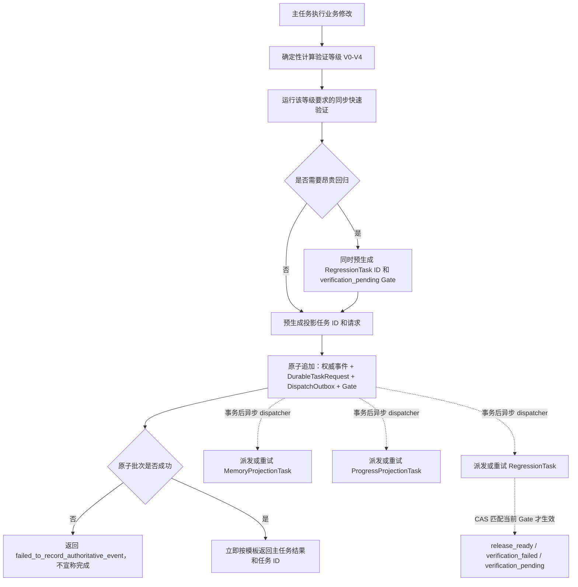

# 产品需求文档（PRD）

## 版本信息

| 项目 | 内容 |
|---|---|
| 项目名称 | 山海工枢 / shanforge |
| 文档编号 | `PRD-SHANFORGE-001` |
| 文档类型 | 产品需求文档 |
| 当前正式版本 | `v4.1.0` |
| 来源候选修订 | `TASK-IMPLEMENT-003-P001` |
| 变更等级 | `MINOR` |
| 当前状态 | 已批准并生效 |
| 负责人 | `uroborus` |
| 变更人 | `uroborus` |
| 审核人 | `uroborus` |
| 批准人 | `uroborus` |
| 主要读者 | 产品、需求、UX、UI、架构、数据、API、前后端、测试、安全、发布、运维、平台与业务 Agent 开发、文档管理员 |
| 上游输入 | Hermes Agent 源码调研、`FLOW-CONTRACT-001`、用户需求澄清 |
| 下游输出 | 完整生命周期 Agent 设计、Workflow Catalog、Action Catalog、路由规则、工具策略、系统与模块设计、实施计划、测试和发布运维方案 |
| 关联 ID | `REQ-001` ~ `REQ-010`、`REQ-AI-WORKFLOW-001` ~ `REQ-AI-WORKFLOW-054`、`REQ-CHANGE-WF-CTL-010-001`、`REQ-CHANGE-AI-EXEC-ASYNC-001`、`REQ-CHANGE-ARTIFACT-RETENTION-001`、`REQ-CHANGE-AI-EXEC-VISIBILITY-001`、`REQ-ASYNC-001` ~ `REQ-ASYNC-018`、`REQ-VIS-001` ~ `REQ-VIS-009`、`NFR-*` |
| 最近更新 | 2026-07-22 |

## 正式版本历史（仅已发布）

| 版本 | 修改内容 | 日期 | 修改人 | 审核 | 批准 |
|---|---|---|---|---|---|
| `v2.0` | 以全新抽象 Agent 平台重写 PRD，移除旧需求继承关系 | 2026-04-13 | 历史记录未登记 | 历史记录未登记 | 历史记录未登记 |
| `v3.0.0` | 扩展为完整软件开发生命周期 Agent，发布四套顶层规范、角色主体分类、Artifact 治理、文档版本规则和 123 条 Workflow 需求映射 | 2026-07-11 | `uroborus` | `uroborus` | `uroborus` |
| `v3.1.0` | 完善 `WF-CTL-010`：发布确定性项目进度快照、代码生成会话摘要/HTML/十表 Excel、事实资格、准确性、权限、性能和跨格式验收要求 | 2026-07-15 | `uroborus` | `uroborus` | `uroborus` |
| `v3.2.0` | 主任务与记忆/进度投影解耦，增加独立派生任务、原子 outbox、准确查询与恢复预算、`V0-V4` 风险分级验证、回归 Gate、证据复用和会话回复合同 | 2026-07-16 | `uroborus` | `uroborus` | `uroborus` |
| `v3.3.0` | 实施 Artifact 最小保留：原始证据关闭后保留 `PT168H`，大型候选发布后或未发布终止后立即清理，可重建完整目录不进入 Git，外部持久存储为受控 N/A | 2026-07-17 | `uroborus` | `uroborus` | `uroborus` |
| `v4.0.0` | 发布统一项目执行位置与停止原因合同：正式生命周期 `N/M`、共享进度快照绑定、七种互斥处置、固定 H、证据恢复、权限过滤和 `REQ-ASYNC-016` 十五行 MAJOR 回复模板 | 2026-07-18 | `uroborus` | `uroborus` | `uroborus` |
| `v4.1.0` | 发布项目知识核心：自适应人类文档、可重建 SQLite 索引与关系图、定向查询、异步同步、有界缓存和只读多页面 HTML 快照 | 2026-07-22 | `uroborus` | `uroborus` | `uroborus` |

> `v3.0.0` 由 `TASK-PRD-001-R006` 发布；`v3.1.0` 由 `TASK-REQ-002-R014` 发布；`v3.2.0` 由 `TASK-REQ-003-R003` 发布；`v3.3.0` 由 `TASK-REQ-004-R002` 发布；`v4.0.0` 由 `TASK-REQ-005-R003` 发布。其他未生效候选只保留在 TaskCard ledger、review、evidence 或受控临时区，不进入正式版本历史。

## 1. 产品定义

shanforge 是一个抽象 Agent 平台，同时是一套覆盖软件项目完整生命周期的可执行开发 Agent。

平台产品能力负责把大模型交互、声明式工作流、工具能力、上下文治理、审批控制、执行沙箱、委派协作和协议适配沉淀为统一内核，使业务只围绕 Agent App、业务流程和输出契约开发。

完整生命周期 Agent 负责从项目资料收集、调研、需求、UX、UI、架构、领域和模块、数据库、API、计划、前后端与多端实现、测试、安全、性能、评审、版本控制、发布、部署、运维、变更到退役。每个项目动作都必须映射到已登记 Workflow、当前 Node 和 ActionSpec；大模型只能提取候选意图和生成受约束内容，不能自行发明流程、选择未授权动作或越过 Gate。

遗留脚本、文件合同和历史流程只作为基础设施适配器或审计事实存在，不再作为产品定义中心。

## 2. 背景与问题

### 2.1 Agent 平台问题

- 业务 Agent 容易直接耦合模型供应商、工具脚本和存储实现。
- 工作流、能力、上下文、审批和证据缺少统一运行时契约。
- 多入口、多模型和多代理协作容易形成重复主循环和不可审计分支。

### 2.2 AI 软件开发协作问题

- 用户难以判断 AI 当前是在咨询、澄清、创建任务、执行任务、写文档还是等待确认。
- 会话讨论可能未经审核直接进入正式 `docs/`。
- 草案、报告、证据、正式文档、memory 摘要和归档边界不清。
- 需求、设计、任务、实现、验证、review、人工确认、提交和 PR 容易跳步。
- UX、UI、架构、数据库、API、前后端、测试、发布和运维常被压缩成几个宽泛流程，AI 仍需临场猜测下一步。
- 同一个软件可能包含 Web、App、小程序、多个管理后台和多个服务，但缺少统一交付拓扑和纵向业务链追踪。
- 数据库列、领域字段、API 字段、页面字段、校验、权限和测试缺少同一业务字段来源，设计看似完整却相互漂移。
- 工具和子代理的选择缺少动作级权限表，导致“能调用工具”被误当成“被授权执行业务动作”。
- 一个交付任务可能被错误拆成“写草案任务”和“正式落档任务”，导致生命周期断裂。
- 文档版本如果不绑定原任务卡、审核和人工批准，会形成不可审计的补丁式更新。
- 记忆、项目进度和索引等派生维护工作如果夹在主任务同步链中，会挤占上下文并让小改动的交付时间不可控。
- 测试范围如果不依据真实影响分级，小范围改动会被无条件全仓回归拖慢，发布阶段还可能重复执行已绑定同一制品的有效证据。

## 3. 产品目标

### 3.1 Agent 平台目标

- 提供统一 Agent Platform Kernel，承载请求接入、会话初始化、上下文编译、workflow 执行、能力调用、响应归一化和状态回写。
- 提供 `Agent App Manifest + Workflow DSL`，让业务开发者声明业务目标、步骤、工具和输出契约。
- 以 `ModelPolicy + LLM Runtime + LLMProviderPort` 统一封装模型能力。
- 以 `Capability Registry` 统一管理工具契约、写集、风险和审批要求。
- 以 `Session / Memory / Context Engine` 提供可恢复会话和最小上下文编译。
- 以 `Approval / Sandbox / Evidence` 保证执行可审计、可恢复、可测试。

### 3.2 AI 协作治理目标

- 每轮项目会话明确类型、目的、AI 动作、用户动作、是否建任务、是否写文件和写入位置。
- 所有影响项目事实的动作绑定 WorkItem；需要跨会话追踪、验收或评审的节点绑定 TaskCard。
- 建立覆盖项目启动到退役的完整 Workflow Catalog；每条 Workflow 定义触发、前置、节点、原子动作、方法、工具权限、输入、产物、路径、证据、异常、停止点和回复模板。
- 建立 Action Catalog；任何读写、设计、生成、修改、验证、评审、提交、部署或回滚动作都必须引用版本化 ActionSpec。
- 建立确定性路由规则；大模型输出只作为候选信号，规则验证器根据当前状态、目标产物、变更类型、风险和授权决定唯一工作流。无法唯一匹配时必须澄清或阻断。
- 建立项目交付拓扑和纵横矩阵：横向维护项目/领域/架构/数据/API/UI baseline，纵向以业务切片贯通需求、UX、UI、API、领域、数据库、测试和发布。
- 建立业务字段追踪链，使字段从需求语义到领域、数据库、API、UI、权限、校验和测试保持一致。
- 一张交付任务卡负责其完整生命周期；草案、review、人工确认、正式落档、版本更新和草案处置是任务内部节点。
- `docs/` 只保存已批准正式事实；`.factory/workitems/` 保存执行事实和活跃草案；memory 只保存恢复摘要和索引。
- 正式方案形成后，能删除的中间草案删除；确需审计时归档，归档默认禁止 AI 读取。
- PR 只能在用户明确确认创建 PR 后执行。
- 主任务只同步完成业务交付、该影响等级需要的快速验证和最小权威事实提交；记忆、进度、索引和昂贵回归使用独立隔离任务。
- 验证按确定性 `V0` 至 `V4` 影响等级选择；只有 `V4` 或人工明确提升时执行全仓回归，异步回归只阻塞发布资格。

## 4. 非目标

- 不要求一次性交付完整远程 SaaS 控制台。
- 不要求一次性实现所有模型供应商或所有业务 Agent App。
- 不把所有咨询对话落盘；不影响项目事实的咨询默认只在会话中回答。
- 不把 reviewer `approved` 等同于用户 `human_approved`。
- 不允许自动 push、merge 或创建 PR。
- 本 PRD 不替某个具体业务项目决定最终数据库表、API 字段或 UI 页面；但必须完整定义产生、检查、变更和验收这些设计产物的工作流与原子动作。
- 不为任务内部的草案、审核、落档、版本更新等步骤重复创建业务任务卡。
- 不允许用“由 AI 结合上下文自行判断”“视情况处理”代替路由规则、ActionSpec、失败分支或 Gate。
- 不为追求速度取消必要验证，也不允许投影滞后时把旧记忆、旧进度或猜测结果标成当前事实。

## 5. 用户与角色

主体类型展示为`人类`、`AI`、`确定性系统`，对应机器值 `human`、`ai_agent`、`deterministic_system`。一个角色实例只能属于一种主体类型；同一职能可由人类或 AI 承担时，必须拆成两个明确角色，不得标成含糊的“人/AI”。

| 角色 | 主体类型 | 主要场景 | 核心诉求 / 职责 |
|---|---|---|---|
| 项目负责人 / 业务用户 | 人类 | 提出目标、审阅结果、批准阶段、接受风险 | 看懂本轮做了什么、当前状态和自己需要确认什么 |
| 人工批准人 | 人类 | 对明确的候选修订、风险和下一动作做批准、退回或暂停决定 | 保留正式批准和风险接受的最终人工决定权 |
| 平台架构维护者 | 人类 | 规划和演进平台核心 | 稳定领域模型、模块边界和接口契约 |
| Agent Runtime 开发者 | 人类 | 实现运行时、适配器和治理能力 | 清晰用例、端口和基础设施边界 |
| 业务 Agent 开发者 | 人类 | 构建编码、写作、分析等业务流 | 只声明业务目标、Workflow、能力和输出 schema |
| Workflow 设计者 | 人类 | 组合和迭代业务工作流 | 低成本装配步骤、模型策略和错误分支 |
| 需求负责人 | 人类 | 澄清和维护需求 | 从用户意图形成可验收、可追踪 PRD |
| 产品与业务分析负责人 | 人类 | 分析业务流程、范围和优先级 | 把问题、角色、业务规则和价值目标转成产品输入 |
| UX 负责人 | 人类 | 用户研究、旅程、信息架构和交互流程 | 证明产品流程对目标用户可理解、可完成 |
| UI 负责人 | 人类 | 视觉方向、设计系统、页面、组件和状态 | 形成可实现、可访问、可响应式验证的界面设计 |
| 架构与领域负责人 | 人类 | 设计系统、领域、模块和服务边界 | 保证职责、依赖、接口 owner 和质量属性成立 |
| 数据库负责人 | 人类 | 设计业务字段、实体、表、约束、索引和迁移 | 以业务不变量和查询场景证明数据模型合理 |
| API 与集成负责人 | 人类 | 设计消费者契约、接口、事件和外部适配 | 保证契约、权限、错误和兼容性满足用例 |
| 设计负责人 | 人类 | 协调 UX、UI、架构、数据和 API baseline | 只基于已批准正式需求自上而下组织设计 |
| 前端与多端开发者 | 人类 | 实现 Web、管理后台、App、小程序和共享组件 | 依照 UX/UI、API 和字段追踪实现各产品表面 |
| 后端与服务开发者 | 人类 | 实现应用、领域、数据、任务和集成 | 依照模块、数据和 API 契约实现服务 |
| 开发执行者 | 人类 | 修改代码、测试和必要文档 | 只执行已批准计划和 TaskCard |
| 人类 Reviewer | 人类 | 独立评审任务产物和专业取舍 | 不继承作者结论，不批准自己的实现，不代替人工批准人 |
| 文档管理员 | 人类 | 维护正式事实源 | 版本、变更历史、索引和草案处置一致 |
| 测试、安全与质量负责人 | 人类 | 设计并执行风险分级测试和质量 Gate | 以可复现证据证明需求、质量和安全要求 |
| 发布与运维负责人 | 人类 | 构建、部署、监控、响应事件和回滚 | 保证交付可恢复、运行可观察、问题可审计 |
| AI 执行者 | AI | 按 Workflow、Node 和 ActionSpec 执行分析、生成、修改、验证和交接 | 获得明确输入、允许写集、工具策略、Gate 和输出契约，不承担人工专有决策 |
| 独立 AI Reviewer | AI | 对文件化变更包执行独立只读评审 | 不继承作者结论，不修改评审对象，评审结论不代替人工批准 |
| 确定性规则系统 | 确定性系统 | 求值 RouteRule、状态机、schema、权限、引用、Gate 和幂等 | 只做确定性校验与裁决，不生成业务结论，不替代人类或 AI 角色 |

## 6. 术语

| 术语 | 定义 |
|---|---|
| WorkItem | 项目里的大事项、大目标或一组相关任务的容器 |
| Task | 一件需要完成的工作，可为临时会话动作或项目交付动作 |
| TaskCard | WorkItem 下可追踪、可验收、可评审的具体任务，负责一个交付目标的完整生命周期 |
| Workflow | 某类 Task 的稳定执行顺序 |
| 主体类型（Actor Type） | 角色实例的执行主体；展示值为`人类` / `AI` / `确定性系统`，机器值为 `human` / `ai_agent` / `deterministic_system`，不允许一个角色同时标记为多种类型 |
| 角色分配（Role Assignment） | 把角色 ID、主体类型、真实人员/AI 实例/系统组件 ID、授权范围和来源绑定的可审计记录 |
| Lifecycle Stage | 软件从项目建立到退役的阶段；用于组织工作流，不直接等同 TaskCard |
| Workflow Node | Workflow 中具有明确进入条件、动作集合、输出和退出条件的节点 |
| ActionSpec | 原子动作的版本化契约，定义前置、输入、方法、工具权限、读写集、输出、证据、失败分支和 Gate |
| ActionRun | 某次 ActionSpec 的真实执行记录，包含 Workflow、Node、输入输出引用、工具事件、结果和证据 |
| RouteRule | 根据会话信号、当前状态、目标产物、变更类型、风险与授权选择 Workflow 的确定性规则 |
| Method | Workflow 内部的分析方法或检查清单，默认不单独建 TaskCard |
| Tool | 执行读取、编辑、命令、浏览器或外部调用的具体能力，不等于任务 |
| Draft | 未批准草案，不能作为正式事实 |
| PRD | 产品需求文档，定义要解决什么、业务规则和验收标准 |
| Gate | 必须停止并等待确认、评审或风险接受的节点 |
| Evidence | 证明任务执行结果的命令、报告、截图、测试或评审结论 |
| Ledger | WorkItem 的状态和事件流水账 |
| Memory | AI 恢复上下文使用的摘要和路径索引 |
| Docs | 已批准、可审计的正式事实源 |
| Archive | 失效或已合并中间产物的归档区，默认禁止 AI 读取 |
| Product Surface | 用户可使用的交付表面，例如 Web、App、小程序、管理后台或 CLI |
| Deliverable Topology | 项目、产品表面、服务、领域、模块、纵向业务切片和任务之间的关系图 |
| Horizontal Baseline | 跨多个需求复用的项目、领域、架构、数据、API、UI、质量或发布基线 |
| Vertical Slice | 从一个用户目标贯通 UX、UI、API、应用、领域、数据库、测试和发布的可验收交付切片 |
| Business Field | 来源于业务语义的规范字段，追踪到领域属性、数据库列、API 字段、UI 控件、校验、权限和测试 |
| PrimaryTask | 用户当前要求产生业务价值的主任务；只承担业务动作、风险等级要求的同步快速验证和最小权威事实提交 |
| SystemSideTask | 记忆、进度、索引等派生维护任务；具有独立 task ID、隔离上下文、封闭写集和证据，不计入产品完成率 |
| RegressionTask | 超出主会话快速预算的受影响域或全仓验证任务；不阻塞主会话返回，但可阻塞当前制品的发布资格 |
| AuthoritativeEvent | 不可变的最小权威事实事件；与必需后台任务请求、outbox 和父 Gate 在同一原子批次持久化 |
| Projection High-water Mark | 派生投影已处理的最后权威事件位置，用于判断投影是否与权威事实头一致 |
| Verification Level | 由确定性影响策略计算的 `V0` 至 `V4` 验证等级；等级决定测试范围，执行时长只决定同步或异步位置 |

## 7. 核心业务流程

### 7.1 Agent 平台运行主流程

```text
外部请求
  -> Request Gateway
  -> Session 初始化
  -> Context Engine 编译最小上下文
  -> Workflow Runtime 执行步骤
  -> Capability / LLM Runtime 调用
  -> Policy / Approval / Sandbox 决策
  -> Evidence 与状态回写
  -> AgentResponse 归一化输出
```

### 7.2 每轮项目会话入口

```text
用户消息
  -> 提取候选信号（不产生执行权限）
  -> RouteRule 校验当前状态、目标产物、变更类型、风险与授权
  -> 输出规则 ID、唯一 Workflow、Node 和允许 ActionSpec
  -> 不影响：直接回答，默认不落盘
  -> 影响：定位或创建 WorkItem
  -> 需要追踪/验收/评审：复用或创建 TaskCard
  -> 仅执行当前 Node 允许的 ActionSpec
  -> 写 ActionRun、产物、证据和状态
  -> 遇到 Gate 停止
  -> 无唯一规则或无 ActionSpec：澄清或阻断，禁止写项目文件
```

### 7.3 需求澄清到正式 PRD

```text
模糊想法 / 变更请求
  -> 会话判定
  -> 定位 WorkItem
  -> 创建或复用 PRD TaskCard
  -> 需求澄清与结构化
  -> PRD 草案
  -> 一致性检查
  -> 用户确认内容
  -> 同一 TaskCard 生成 document-change
  -> 正式文件候选稿与验证证据
  -> 独立 review
  -> 用户查看评审结论并确认生效
  -> 融入正式源文件
  -> 更新版本历史、变更记录、索引和 memory
  -> 删除或归档草案
  -> 关闭 PRD TaskCard
  -> 进入设计
```

PRD 草案、`document-change`、review、人工确认、正式落档、版本更新和草案处置都是同一 PRD TaskCard 的内部节点。只有没有现有交付任务 owner，或确实存在跨 WorkItem、独立负责人和独立验收目标时，才考虑额外任务卡。

### 7.4 正式文档变更

```text
当前 TaskCard
  -> document-change draft
  -> 正式文件候选稿
  -> 验证
  -> 独立 review
  -> 人工确认
  -> 修改原正式源文件
  -> 更新版本与版本历史
  -> 更新集中变更记录、索引和 doc-map
  -> 处置候选稿与上游草案
```

### 7.5 Bug 处理

```text
用户报告 Bug
  -> 创建或复用 Bug 调查 TaskCard
  -> 复现与根因调查
  -> 根因报告
  -> 用户确认根因
  -> 创建或复用修复 TaskCard
  -> 修复、测试、验证、review
  -> 用户人工确认
```

### 7.6 完整软件生命周期主流程

```text
项目资料与章程
  -> 交付拓扑、领域和质量 baseline
  -> 问题发现、用户与业务研究
  -> 需求、业务规则、NFR 和验收标准
  -> UX：旅程、信息架构、交互流、原型和可用性
  -> UI：设计系统、页面、组件、状态、响应式和可访问性
  -> 架构：系统、领域、模块、服务、安全、性能和部署
  -> 数据库：业务字段、实体、表、约束、索引和迁移
  -> API/集成：消费者、契约、错误、权限、事件和兼容性
  -> 纵向业务切片、实施计划、TaskCard 和测试设计
  -> 前端/多端、后端/服务、数据迁移和集成实现
  -> 单元、集成、契约、UI、E2E、安全、性能和验收测试
  -> 独立 review、人工确认、版本控制、构建和发布
  -> 部署、监控、事件响应、维护、变更、迁移和退役
```

每个箭头都必须落到 Workflow Catalog 中的一条 Workflow；每个节点都只能执行 Action Catalog 中的 ActionSpec。阶段可按项目实际裁剪，但裁剪必须由规则判定并记录 `N/A` 原因、影响和批准人，不能由模型静默跳过。

## 8. Agent 平台功能需求

### `REQ-001` 统一 Agent Platform Kernel

- 优先级：P0
- 状态：已批准基线
- 描述：平台必须提供统一运行时内核，负责请求接入、会话初始化、上下文编译、workflow 执行、能力调用、响应归一化和状态回写。
- 用户故事：作为 Agent Runtime 开发者，我希望主循环由统一内核承载，以便能力不会散落在不同业务实现中。
- 业务规则：内核负责编排，不直接承载业务规则和供应商 SDK。

验收标准：

- AC-1: 给定一个用户请求，当进入平台运行时，则能形成可追踪的 session、plan 和 execution events。
- AC-2: 给定同一业务 App 的不同入口，则它们共享同一套运行时主循环。
- AC-3: 给定需要恢复的会话，则平台可根据保存状态继续执行或回放。

### `REQ-002` 业务 Agent App 与平台内核隔离

- 优先级：P0
- 状态：已批准基线
- 描述：平台必须定义 `Agent App Manifest`，使业务开发者仅通过领域模型、intent、workflow、capability 引用、memory policy 和 output schema 声明业务能力。
- 用户故事：作为业务 Agent 开发者，我希望只面向业务抽象开发，而不是直接接触底层执行细节。
- 业务规则：业务 App 不能直接依赖 shell、Git、供应商 SDK 或底层存储实现。

验收标准：

- AC-1: 给定一个新业务域，则开发者可以通过 Agent App manifest 注册业务能力。
- AC-2: 给定底层适配器替换，则业务 App 无需改动业务规则即可复用。
- AC-3: 给定业务 App 试图直接引用基础设施实现，则契约检查会阻断该设计。

### `REQ-003` Workflow DSL 与声明式编排

- 优先级：P0
- 状态：已批准基线
- 描述：平台必须提供 Workflow DSL，用于声明 workflow、step、条件、循环、重试、审批点、输出 schema 和错误分支。
- 用户故事：作为 Workflow 设计者，我希望通过声明式方式快速装配业务流，而不是编写大量运行时代码。
- 业务规则：workflow 既可调用大模型 step，也可调用 capability step；workflow 状态必须可观测。

验收标准：

- AC-1: 给定编码或写作业务流，则 workflow 可声明多个 step、条件与输出契约。
- AC-2: 给定 step 失败，则 workflow 可按照重试或 fallback 规则继续或终止。
- AC-3: 给定 workflow 运行完成，则平台保留 step 结果和证据。

### `REQ-004` 多模型策略与供应商解耦

- 优先级：P0
- 状态：已批准基线
- 描述：平台必须通过 `ModelPolicy`、`LLM Runtime` 和 `LLMProviderPort` 统一封装模型选择、推理强度、预算、fallback、隐私和供应商差异。
- 用户故事：作为业务 Agent 开发者，我希望每个 workflow 或 step 可选择不同模型，而不用直接调用供应商 SDK。
- 业务规则：业务层只引用 `model_policy`，不允许直接绑定具体供应商实现。

验收标准：

- AC-1: 给定两个不同 step，则可为它们配置不同 `model_policy`。
- AC-2: 给定模型不可用或预算超限，则运行时可执行 fallback 或阻断。
- AC-3: 给定新增模型供应商，则只需实现 provider adapter 即可接入平台。

### `REQ-005` Capability Registry 与工具执行契约

- 优先级：P0
- 状态：已批准基线
- 描述：平台必须将工具能力抽象为统一 capability，声明输入 schema、输出 schema、写集、风险级别、审批要求、证据要求和恢复提示。
- 用户故事：作为平台维护者，我希望所有工具能力都能被统一治理和测试。
- 业务规则：业务 workflow 只能引用已注册 capability，不能直接发起任意 shell 或脚本调用。

验收标准：

- AC-1: 给定一个 capability，则平台能读取其 schema、写集和风险信息。
- AC-2: 给定未注册能力调用，则运行时阻断执行。
- AC-3: 给定高风险能力，则平台在执行前进入审批流程。

### `REQ-006` Session、Memory 与 Context Engine

- 优先级：P0
- 状态：已批准基线
- 描述：平台必须提供统一会话模型、短期上下文、长期记忆、摘要、检索和最小上下文编译能力。
- 用户故事：作为协作者，我希望平台能够保留状态、减少重复输入并在需要时恢复任务上下文。
- 业务规则：上下文必须来源可追踪；正式事实、运行时摘要和用户临时输入应分层处理。记忆投影不得在主任务同步链中重写；会话恢复只能使用兼容基础摘要和有界尾部生成紧凑临时上下文，超预算或不兼容时返回结构化未就绪并异步追平。

验收标准：

- AC-1: 给定一次运行，则平台能生成标准 session 和 context package。
- AC-2: 给定上下文过大，则平台优先使用摘要、引用和检索结果，而不是无控制扩张。
- AC-3: 给定运行结束，则系统在权威事件原子批次中持久化独立记忆投影请求；主会话不等待投影 worker，也不直接重写记忆。
- AC-4: 给定基础摘要兼容且尾部不超过 200 条、1 MiB、1,000 ms，则同一版本化 reducer 生成不超过 8 KiB、绑定权威头的 `MemoryRecoveryContext/v1`。
- AC-5: 给定摘要损坏、版本漂移或尾部超预算，则返回结构化 `memory_recovery_not_ready` 并异步追平，不无界读取、不把旧摘要当当前事实。

### `REQ-007` Policy、Approval 与 Execution Sandbox

- 优先级：P0
- 状态：已批准基线
- 描述：平台必须将风险策略、审批规则和执行沙箱纳入统一控制面，保证敏感操作有明确边界。
- 用户故事：作为平台维护者，我希望高风险动作总能在预定边界内运行，而不是由模型自由决定。
- 业务规则：审批规则与执行端口分离；未经批准的高风险能力不得执行。

验收标准：

- AC-1: 给定高风险 capability，则运行时在执行前产生审批决策。
- AC-2: 给定越界写集或未经授权的执行请求，则平台阻断。
- AC-3: 给定执行完成，则输出包含风险决策和证据记录。

### `REQ-008` Delegation、Gateway 与多入口适配

- 优先级：P1
- 状态：已批准基线
- 描述：平台应支持 worker 委派、写集治理、结果合并，以及 CLI、Chat、HTTP、MCP/ACP 等入口的统一接入边界。
- 用户故事：作为架构维护者，我希望平台可以扩展多入口和多代理，而不破坏核心内核。
- 业务规则：所有外部入口都必须经由统一 request gateway；委派结果必须可审计。

验收标准：

- AC-1: 给定一个可并行任务，则平台可生成带写集与验收标准的 worker 指令。
- AC-2: 给定不同入口类型，则它们共享相同的 use cases 和 domain contracts。
- AC-3: 给定写集冲突，则平台能在合并前识别并阻断。

### `REQ-009` 标准化 AgentResponse 与 Evidence

- 优先级：P0
- 状态：已批准基线
- 描述：平台必须把原始模型响应、工具输出和 workflow 结果统一包装为标准 `AgentResponse`，并附带结构化输出、tool calls、evidence 和 next actions。
- 用户故事：作为调用方或上层 UI，我希望所有业务结果都有稳定返回格式。
- 业务规则：原始模型响应必须先经过 normalizer、parser 和 schema validator。

验收标准：

- AC-1: 给定一个模型 step，则输出会被转换为标准 `LLMResponse` 和 `AgentResponse`。
- AC-2: 给定输出不符合 schema，则平台执行修复、fallback 或阻断。
- AC-3: 给定需要审计，则平台能够关联返回结果和原始证据。

### `REQ-010` 快速构建业务工作流

- 优先级：P0
- 状态：已批准基线
- 描述：平台必须提供模板、示例和本地模拟能力，使业务开发者可以快速构建工作流并验证其在不同模型策略下的表现。
- 用户故事：作为业务 Agent 开发者，我希望在不深入平台内核的情况下快速落地一个可运行业务流。
- 业务规则：平台需支持示范 Agent App、mock provider 和本地契约测试。

验收标准：

- AC-1: 给定一个新业务场景，则开发者可以基于示例模板创建 workflow。
- AC-2: 给定不同模型策略，则开发者可在本地模拟环境中验证行为差异。
- AC-3: 给定业务 App 提交，则平台可执行契约测试和最小回归校验。

## 9. AI 协作流程治理需求

### `REQ-AI-WORKFLOW-001` 会话必须先判定类型

- 优先级：P0
- 状态：已批准（v3.0.0）
- 描述：每轮项目相关会话开始时，系统必须从受控枚举提取咨询、轻量分析、项目初始化、调研、需求、UX、UI、架构、数据、API、计划、实现、测试、Bug、验证、review、文档、版本控制、发布、运维、变更、退役、状态和暂停等候选信号，再由确定性规则选择唯一工作流。
- AC-1：给定项目相关消息，当系统准备执行时，则说明本轮类型、命中的路由规则、Workflow、Node、允许 ActionSpec、目的、AI 动作、用户动作、是否建任务、是否写文件和写入位置。
- AC-2：给定用户只询问概念且不影响项目事实，则不创建 TaskCard、不写 ledger。
- AC-3：给定请求会影响后续项目事实，则只能进入 RouteRule 唯一命中的项目化流程。
- AC-4：给定无法唯一匹配、关键字段缺失或没有已登记 ActionSpec，则进入澄清或阻断流程，不得写项目文件。

### `REQ-AI-WORKFLOW-002` 项目化动作必须有明确归属

- 优先级：P0
- 状态：已批准（v3.0.0）
- 描述：所有项目化会话必须追溯到 WorkItem；只有需要跨会话继续、存在依赖、需要验收或评审时，才必须追溯到 TaskCard。
- AC-1：给定要写 PRD、设计、代码或正式文档且无归属，则先定位或创建 WorkItem。
- AC-2：给定工作只是当前 TaskCard 的内部步骤，则记录 event、evidence、draft 或 Gate，不重复创建 TaskCard。
- AC-3：给定 TaskCard 执行，则只能修改允许范围内的文件。
- AC-4：给定任务收口，则回复包含 outputs、evidence、当前状态和 next required action。

### `REQ-AI-WORKFLOW-003` PRD TaskCard 必须覆盖完整生命周期

- 优先级：P0
- 状态：已批准（v3.0.0）
- 描述：PRD TaskCard 从需求澄清开始，直到正式源文件生效、版本更新、索引同步和草案处置完成后才能关闭。
- AC-1：给定 PRD TaskCard 存在，则 PRD 草案、修改、review、人工确认、正式落档和草案处置都归属同一任务。
- AC-2：给定 PRD 草案已完成但未正式落档，则 TaskCard 不得标记完成，下游设计不得越过 Gate。
- AC-3：给定已有 PRD TaskCard，当准备正式落档时，则不得再创建“落档任务卡”。
- AC-4：给定 PRD 候选修订已通过 review 和人工批准，则在同一发布事务中融入正式源、分配正式版本、更新历史/索引/memory 并验证；全部成功后才处置草案和关闭任务。

### `REQ-AI-WORKFLOW-004` 所有工作流必须使用标准结构

- 优先级：P0
- 状态：已批准（v3.0.0）
- 描述：每条 Workflow 必须定义版本、生命周期阶段、目标、触发、前置、RouteRule、节点、允许 ActionSpec、方法、AI 动作、用户动作、工具策略、输入、产物、读写位置、证据、异常、补偿、继续策略、停止点和回复模板。
- AC-1：给定工作流缺少任一标准字段，则不能进入正式文档。
- AC-2：给定需要新增工作流，则先更新统一 Workflow Catalog，不创建孤立流程。
- AC-3：给定正式流程已取代草案，则 AI 优先读取正式事实源。
- AC-4：给定 Workflow 的任一 Node 未绑定 ActionSpec、退出条件或失败分支，则该 Workflow 不可执行。

### `REQ-AI-WORKFLOW-005` 正式 `docs/` 默认锁定

- 优先级：P0
- 状态：已批准（v3.0.0）
- 描述：正式文档只保存已批准事实，会话讨论和未确认方案只能进入当前 WorkItem。
- AC-1：给定方案未经 TaskCard、review 和人工确认，则不得写入正式 `docs/`。
- AC-2：给定现有交付 TaskCard 已拥有文档交付，则 `document-change` 是该任务内部产物，不另建任务卡。
- AC-3：给定候选修订尚未成功发布，则只更新 TaskCard 内的候选、ledger、review 和 evidence；只有发布成功才更新正式版本历史、集中变更记录、索引和必要 `doc-map`。
- AC-4：给定现有正式源可承载变化，则必须融入原文，不创建补丁页或重复文档。

### `REQ-AI-WORKFLOW-006` 中间草案必须删除或归档

- 优先级：P0
- 状态：已批准（v3.0.0）
- 描述：正式方案形成后，中间草案不得继续留在活跃 `drafts/` 中误导 AI。
- AC-1：给定草案内容已完整融入正式源且无需保留正文，则删除草案。
- AC-2：给定确需审计、对比或回滚证据，则归档到 `.factory/workitems/<WORKITEM-ID>/archive/<TASK-ID>/`。
- AC-3：给定 AI 准备读取归档且无当前任务、ledger、review 或用户明确指向，则拒绝读取。
- AC-4：给定草案已被正式文档取代，则正式文档优先。

### `REQ-AI-WORKFLOW-007` Memory 只能保存恢复摘要

- 优先级：P0
- 状态：已批准（v3.0.0）
- 描述：memory 用于恢复上下文，不是正式事实源或正文库。
- AC-1：给定任务状态变化，则 memory 只记录 ID、状态、Gate、下一动作、关键约束和路径索引。
- AC-2：给定 PRD 或正式文档存在，则 memory 不复制正文。
- AC-3：给定 memory 与 docs 或 ledger 冲突，则以 docs 和 ledger 为准。

### `REQ-AI-WORKFLOW-008` 会话回复必须可理解

- 优先级：P0
- 状态：已批准（v3.0.0）
- 描述：AI 不能只返回路径、状态码或内部术语。
- AC-1：给定项目化任务暂停或收口，则回复说明本轮做了什么、写到哪里、当前状态、需要用户确认什么、下一步、未做事项和验证结果。
- AC-2：给定展示内部状态，则同时提供中文含义。
- AC-3：给定本轮修改文件，则说明关键文件用途。
- AC-4：给定项目化任务执行、暂停或收口，则回复必须使用 `REQ-ASYNC-016` 的单一十五行模板，并从同一 `ProjectExecutionPosition/v1` 说明项目总路线、整体 `N/M`、当前节点、停止原因、下一责任人和唯一下一步。

### `REQ-AI-WORKFLOW-009` 正式文档版本分配与人员必须可审计

- 优先级：P0
- 状态：已批准（v3.0.0）
- 描述：候选修订与正式版本是两套标识。未发布内容只有 TaskCard 范围内的候选修订号；正式版本号只在独立评审通过、人工批准且发布事务成功后分配并生效。变更人、审核人、批准人必须来自项目资料。
- AC-1：给定缺少真实人员信息，则正式文档变更停止并要求补充项目资料。
- AC-2：给定内容尚未成功发布，则不得分配、占用、递增或在“当前版本”中显示新的正式版本号。
- AC-3：给定 AI 执行文档工作，则不得使用工具名、模型名或代理名作为正式变更人。
- AC-4：给定人员允许兼任，则项目资料必须记录该政策和确认来源。
- AC-5：候选修订使用 `<TaskCard-ID>-R<number>` 标识，并绑定修订内容 hash；任何内容变化都必须形成新修订号，原 review 和人工批准自动失效。
- AC-6：正式版本历史只保存成功发布并生效的版本；工作中、待评审、评审通过但未批准、已退回或发布失败的修订只记入 ledger/review/evidence，不得写入正式版本历史。
- AC-7：发布事务必须校验人工批准绑定的修订号和 hash，再按 `MAJOR.MINOR.PATCH` 规则计算版本、融入唯一正式源、更新标头/历史/索引并完成验证；任一步失败都不得留下新正式版本。

### `REQ-AI-WORKFLOW-010` PR 创建必须由用户明确确认

- 优先级：P0
- 状态：已批准（v3.0.0）
- 描述：任务完成、本地提交或 review 通过均不等于授权创建 PR。
- AC-1：给定用户只要求完成或提交，则不得创建 PR。
- AC-2：给定用户明确要求创建 PR但缺本地提交、远端目标、权限或 evidence，则阻塞并说明缺口。
- AC-3：给定 PR 创建成功，则回复 PR 地址、分支、草稿状态和验证结果。

### `REQ-AI-WORKFLOW-011` Bug 必须先根因后修复

- 优先级：P0
- 状态：已批准（v3.0.0）
- 描述：Bug 不能猜测式修复。
- AC-1：给定用户报告 Bug，则创建或复用 Bug 调查 TaskCard。
- AC-2：给定根因未确认，则不得修改代码作为正式修复。
- AC-3：给定根因已确认，则创建或复用修复 TaskCard，并补测试和验证证据。

### `REQ-AI-WORKFLOW-012` 设计必须自上而下

- 优先级：P1
- 状态：已批准（v3.0.0）
- 描述：只有正式 PRD 生效后才能进入设计；设计从业务目标、角色、业务流程和业务字段，向 UX、UI、领域、模块、数据、接口、部署与质量属性逐层下钻，再按纵向业务切片校验完整链路。
- AC-1：给定 PRD 仅有草案或内容确认但未正式落档，则设计任务不得批准或进入计划。
- AC-2：给定进入设计阶段，则数据库、接口和 UI 维护字段一致性检查。
- AC-3：给定字段在页面、接口或数据模型任一处变化，则必须做影响分析和一致性验证。
- AC-4：给定某设计层被判定为 N/A，则必须记录业务原因、影响、替代机制和 reviewer 结论，不能静默跳过。

### `REQ-AI-WORKFLOW-013` 必须提供闭合的完整生命周期 Workflow Catalog

- 优先级：P0
- 状态：已批准（v3.0.0）
- 描述：产品必须内置从项目建立到退役的核心 Workflow Catalog，覆盖控制与会话、项目 baseline、调研、需求、UX、UI、架构、数据库、API、计划、实现、测试、评审、版本控制、发布、运维、变更和退役。
- AC-1：给定任一已知软件开发会话行为，则可映射到 Catalog 中唯一 Workflow 或明确的只读咨询 Workflow。
- AC-2：给定某生命周期阶段不适用于项目，则以受控 `N/A` 决策记录原因、影响、替代机制和批准结果。
- AC-3：给定 Catalog 缺少项目所需流程，则在新增流程获批准前只能阻断，不允许模型临时发明执行路径。
- AC-4：给定 Catalog 版本变化，则必须有兼容性、迁移、回归测试和版本历史。
- AC-5：第 11 章 123 条 Workflow 必须逐条具有唯一记录，完整引用四套规范，并明确主体类型、任务追踪策略、输入输出、动作节点、ActionSpec 槽位、Gate、停止和回复契约；缺失记录数为 0。
- AC-6：需求级映射只能把可执行 RouteRule、正式 ActionSpec/Method/ToolPolicy、精确路径和完整流程图标为 `design_required`，不得用占位 ID 冒充已完成设计或实现。

### `REQ-AI-WORKFLOW-014` 每个可执行动作必须有 ActionSpec

- 优先级：P0
- 状态：已批准（v3.0.0）
- 描述：读取、分析、提问、设计、生成、修改、验证、评审、记录、委派、提交、部署和回滚等动作必须引用版本化 ActionSpec。
- AC-1：每个 ActionSpec 至少包含 ID、版本、目标、进入条件、输入 schema、方法、允许工具、读取集、写入集、输出 schema、证据、幂等键、超时、重试、失败分支、补偿和 Gate。
- AC-2：给定动作会改变项目事实，则没有当前 Workflow、Node、TaskCard 条件和 ActionSpec 时不得执行。
- AC-3：给定动作执行，则写入 ActionRun，记录 actor、Workflow、Node、ActionSpec、输入输出引用、工具事件、结果、证据和时间。
- AC-4：工具调用只能是 ActionSpec 的实现手段，不能自动获得业务动作权限。

### `REQ-AI-WORKFLOW-015` 路由必须由确定性规则裁决

- 优先级：P0
- 状态：已批准（v3.0.0）
- 描述：大模型只负责提取候选意图、目标产物和上下文信号，最终路由必须由版本化 RouteRule 决定。
- AC-1：RouteRule 至少使用项目影响、当前状态、目标产物、生命周期阶段、目标范围、变更类型、风险等级和授权状态。
- AC-2：每次路由输出 rule ID、输入信号、选择结果、拒绝的候选和理由。
- AC-3：多条规则命中、零规则命中或输入不完整时，必须进入澄清或未分类阻断 Workflow。
- AC-4：路由表必须具有正向、冲突、缺失和越权黑盒测试，不能只依赖提示词。

### `REQ-AI-WORKFLOW-016` 新项目必须通过交互完成项目资料和 Baseline 初始化

- 优先级：P0
- 状态：已批准（v3.0.0）
- 描述：新项目不得直接进入需求或实现，必须通过会话交互采集并保存项目资料，建立可追踪 Baseline WorkItem。
- AC-1：至少采集项目名称、目标、范围、负责人、变更/审核/批准角色、角色兼任政策、仓库、产品表面、服务、环境、技术栈、质量、安全、合规和交付约束。
- AC-2：系统按最小问题批次提问，已知信息不重复询问，无法合理默认的字段进入 `needs_user_input`。
- AC-3：确认后的结构化项目资料保存到项目事实源；会话只返回摘要和缺失项。
- AC-4：人员、仓库、产品表面或关键约束缺失时，不得生成正式版本、设计 baseline 或实施计划。

### `REQ-AI-WORKFLOW-017` 必须建立交付拓扑和纵横矩阵

- 优先级：P0
- 状态：已批准（v3.0.0）
- 描述：系统必须维护 Project → Product Surface → Service → Domain → Module → Vertical Slice → Task 的交付拓扑。
- AC-1：Web、App、小程序、每个管理后台、CLI、服务、worker 和集成适配器都作为独立可追踪交付节点登记。
- AC-2：横向 baseline 维护项目、领域、架构、数据、API、UI、质量和发布公共约束。
- AC-3：纵向业务切片贯通需求、UX、UI、API、应用、领域、数据库、测试和发布，不按数据库、接口、UI 三个孤立目录拆断业务链。
- AC-4：前端和后端都必须分模块；前端按产品表面与业务领域/功能组织，后端按领域、应用用例、服务与适配器边界组织。

### `REQ-AI-WORKFLOW-018` 调研和发现必须形成可验证输入

- 优先级：P1
- 状态：已批准（v3.0.0）
- 描述：问题发现、利益相关方访谈、用户研究、现状流程、竞品参考、技术可行性和数据来源调查必须使用登记流程。
- AC-1：调研必须区分事实、观察、假设、意见、来源和待验证结论。
- AC-2：需要外部资料时记录来源、时间、适用范围和不确定性；没有证据不得写成正式需求事实。
- AC-3：技术 spike 只验证明确假设，输出结论、限制和是否进入正式方案，不直接演变成生产实现。
- AC-4：调研结论必须追踪到需求、风险、决策或明确的“不采纳”。

### `REQ-AI-WORKFLOW-019` 需求工程必须覆盖从意图到正式 Baseline

- 优先级：P0
- 状态：已批准（v3.0.0）
- 描述：需求流程必须覆盖意图澄清、范围和优先级、角色、场景、用户故事、用例、业务规则、状态、NFR、验收标准、影响分析、追踪、评审和正式化。
- AC-1：每条需求可验收、可测试，并映射到产品表面、领域、模块、设计、任务和测试状态。
- AC-2：需求字段、状态机、权限和异常必须成为后续 UX、数据、API 和测试的上游输入。
- AC-3：需求变更只修改源需求并更新版本历史、影响范围和下游失效标记，不创建补丁式需求页。
- AC-4：需求未正式批准前，设计只能作为草案探索，不能批准 baseline 或进入实现计划。

### `REQ-AI-WORKFLOW-020` UX 设计必须独立于视觉 UI 并有方法和证据

- 优先级：P0
- 状态：已批准（v3.0.0）
- 描述：UX Workflow 必须从用户、目标和任务出发，覆盖人物/角色、Jobs、旅程、服务蓝图、信息架构、导航、交互流、线框、原型、内容和可用性验证。
- AC-1：每个关键用户目标具有入口、主路径、异常路径、返回路径、权限路径和完成定义。
- AC-2：信息架构和交互流必须追踪到需求与产品表面，不能只提供视觉图。
- AC-3：原型必须覆盖 loading、empty、error、disabled、permission、offline/timeout 和恢复状态中适用的部分。
- AC-4：UX 决策必须有用户证据、启发式依据或明确假设，并经过用户或 reviewer Gate。

### `REQ-AI-WORKFLOW-021` UI 设计必须形成可实现的完整交付包

- 优先级：P0
- 状态：已批准（v3.0.0）
- 描述：UI Workflow 必须覆盖视觉方向、设计系统、token、页面、区域、组件、状态、响应式、可访问性、文案、资源、原型、评审和开发交接。
- AC-1：每个页面和组件具有结构、尺寸约束、数据来源、交互、状态矩阵、权限、错误、空态和移动端行为。
- AC-2：颜色、字体、间距、图标、动效和组件变体优先继承项目设计系统；新规则必须说明原因和复用范围。
- AC-3：UI 设计必须提供桌面与移动验证、文本溢出、键盘焦点、语义、对比度和关键截图证据。
- AC-4：视觉生成必须使用版本化提示词模板，模板包含业务目标、用户、产品表面、信息架构、设计系统、页面状态、画幅、禁止项、输出格式和验收清单；提示词不是批准证据。

### `REQ-AI-WORKFLOW-022` 系统架构必须覆盖结构和质量属性

- 优先级：P0
- 状态：已批准（v3.0.0）
- 描述：架构 Workflow 必须覆盖方案比较、ADR、系统上下文、容器、部署、数据流、依赖、接口 owner、安全、性能、可靠性、可观察性和演进策略。
- AC-1：每个架构决策追踪到需求、NFR、约束和被拒绝方案。
- AC-2：分层依赖、领域边界、跨层装配、外部系统和失败传播路径必须可视化并可检查。
- AC-3：安全、容量、可用性、恢复、监控和部署不能留到实现阶段临时决定。
- AC-4：架构 baseline 变化必须触发模块、数据、API、UI、测试和发布影响分析。

### `REQ-AI-WORKFLOW-023` 领域和模块设计必须同时覆盖前后端

- 优先级：P0
- 状态：已批准（v3.0.0）
- 描述：模块设计必须从业务能力、用例、数据所有权和依赖出发，定义领域、模块、服务、前端产品表面和共享组件边界。
- AC-1：每个后端模块定义职责、不变量、接口 owner、依赖、数据所有权、错误和测试边界。
- AC-2：每个前端模块定义所属产品表面、业务能力、页面/路由、组件边界、状态来源、API 契约和共享策略。
- AC-3：共享模块只有在存在真实复用和稳定契约时建立，不能为可能的未来复用提前抽象。
- AC-4：跨模块调用必须有受控接口，不得通过共享数据库列或隐式全局状态绕过边界。

### `REQ-AI-WORKFLOW-024` 数据库设计必须由业务不变量和查询场景证明

- 优先级：P0
- 状态：已批准（v3.0.0）
- 描述：数据库 Workflow 必须从业务字段、实体生命周期、不变量、读写场景、数据所有权和合规要求推导概念模型、逻辑模型和物理模型。
- AC-1：每个表和字段追踪到业务语义；主键、唯一性、可空性、默认值、检查约束、外键或替代完整性机制均有依据。
- AC-2：关系、聚合边界、状态变化、事务、一致性、并发、审计、软删除、保留、加密和权限必须明确。
- AC-3：索引由真实查询、排序、过滤、关联和容量假设推导，并检查写放大、重复和失效索引风险。
- AC-4：迁移包含前向、回填、双写/兼容窗口、校验、回滚和数据恢复；生产数据变化必须有演练或等价证据。
- AC-5：数据库评审必须使用 ERD、字段字典、约束矩阵、查询-索引矩阵和迁移测试证明设计满足需求。

### `REQ-AI-WORKFLOW-025` API 和集成设计必须从消费者用例推导

- 优先级：P0
- 状态：已批准（v3.0.0）
- 描述：API Workflow 必须从消费者、用例、资源、权限、状态变化和兼容性出发定义 HTTP、RPC、事件、Webhook、文件或外部集成契约。
- AC-1：每个端点或消息定义输入、输出、字段、校验、认证、资源级授权、错误、幂等、分页、过滤、排序、限流和超时中适用的部分。
- AC-2：API 字段来源于业务字段和领域契约，不能直接复制数据库结构作为公共契约。
- AC-3：事件和异步任务必须定义生产者、消费者、schema、顺序、重复、重试、死信、追踪和补偿。
- AC-4：破坏性变更必须有版本、弃用、消费者影响、迁移窗口、兼容测试和回滚策略。
- AC-5：正式接口以机器可验证 schema 为准，并通过 lint、contract test、集成测试和目标 E2E 验证。

### `REQ-AI-WORKFLOW-026` 业务字段必须跨需求、数据、API、UI 和测试一致

- 优先级：P0
- 状态：已批准（v3.0.0）
- 描述：系统必须维护 Business Field Trace，追踪业务字段到领域属性、数据库列、API 字段、UI 控件/展示、校验、权限、日志和测试。
- AC-1：字段的名称、业务含义、类型、单位、精度、枚举、可空、默认、来源、敏感级别和生命周期具有唯一规范定义。
- AC-2：数据库、API 和 UI 可使用技术映射名，但必须指向同一个 Business Field ID。
- AC-3：任一层字段新增、删除、改名、改类型、改枚举或改权限时，自动生成影响清单并使相关设计和测试进入待复核状态。
- AC-4：进入实现前，需求-领域-数据库-API-UI-测试追踪不得存在未解释断链。

### `REQ-AI-WORKFLOW-027` 计划和任务分解必须以纵向交付为主

- 优先级：P0
- 状态：已批准（v3.0.0）
- 描述：实施计划必须从批准需求和设计拆出可验收的纵向业务切片，再在切片内部安排数据库、API、前端、多端、测试和文档动作。
- AC-1：不得仅按“先所有数据库、再所有接口、再所有 UI”形成三个互不验收的大任务树。
- AC-2：横向 baseline 变更可使用独立任务，但必须反向关联所有受影响纵向切片。
- AC-3：TaskCard 必须包含目标、输入、依赖、允许/禁止写集、ActionSpec、产物、测试设计、验证命令、review Gate 和完成口径。
- AC-4：读文件、运行命令、写测试和记录 evidence 是节点动作，不单独拆成任务卡。

### `REQ-AI-WORKFLOW-028` 实现必须只消费已批准设计和计划

- 优先级：P0
- 状态：已批准（v3.0.0）
- 描述：代码、配置、迁移、资源和构建产物的实现只能在已批准 TaskCard、当前 Node 和允许 ActionSpec 下进行。
- AC-1：实现前检查需求、设计、接口、UI/UX、测试设计、依赖和允许写集；缺失项按规则阻断或记录受审 N/A。
- AC-2：功能和 Bug 修复按风险执行测试先行或基线失败复现，禁止无证据的猜测式修改和兜底堆叠。
- AC-3：实现只修改根因和当前交付范围；发现新需求或设计缺口时回到对应 Workflow，不在代码中擅自决定产品规则。
- AC-4：完成实现节点时输出改动、行为、证据、偏离、残余风险和 review 输入，作者不能自批完成。

### `REQ-AI-WORKFLOW-029` 多产品表面和多服务必须分别交付并统一验收

- 优先级：P0
- 状态：已批准（v3.0.0）
- 描述：Web、App、小程序、多个管理后台、多个后端服务、worker 和网关必须在交付拓扑中分别设计、计划、实现、测试和发布。
- AC-1：每个产品表面有独立用户流程、页面/能力清单、状态、API 依赖、环境、构建和验收标准。
- AC-2：每个服务有领域职责、数据所有权、接口、依赖、部署、监控和恢复策略。
- AC-3：共享需求通过 Business Field、API、权限和设计系统 baseline 保持一致，不复制成无关联需求。
- AC-4：最终交付报告按产品表面和服务列出完成、未完成、验证、版本和发布状态。

### `REQ-AI-WORKFLOW-030` 测试必须覆盖完整质量层级并按风险裁剪

- 优先级：P0
- 状态：已批准（v3.0.0）
- 描述：测试 Workflow 必须覆盖测试设计、单元、集成、契约、组件、E2E、可访问性、视觉、性能、安全、数据迁移、兼容性、AI 回归和用户验收。
- AC-1：每个需求和风险映射到适当测试层级、测试数据、环境、前置和预期结果。
- AC-2：裁剪测试层级必须记录风险理由和 reviewer 结论，不能用“时间不足”静默跳过关键验证。
- AC-3：测试报告记录通过、失败、错误、跳过、未运行、环境、命令、exit code、证据和残余风险。
- AC-4：失败测试进入失败分流；未知失败先调查根因，不直接修改产品代码。

### `REQ-AI-WORKFLOW-031` 安全、隐私和合规必须贯穿生命周期

- 优先级：P0
- 状态：已批准（v3.0.0）
- 描述：安全 Workflow 必须覆盖数据分类、威胁建模、认证、授权、密钥、供应链、输入输出安全、审计、隐私、合规、漏洞和事件响应。
- AC-1：安全和隐私需求在需求阶段形成，架构、数据、API、UI、实现、测试和运维逐层追踪。
- AC-2：敏感操作和数据访问使用最小权限并具有审批、审计和撤销机制。
- AC-3：依赖、镜像、构建和部署产物具有来源与完整性检查；高风险漏洞阻断发布。
- AC-4：安全例外必须记录风险、时限、补偿控制、责任人和人工批准。

### `REQ-AI-WORKFLOW-032` 性能、可靠性和可观察性必须可度量

- 优先级：P1
- 状态：已批准（v3.0.0）
- 描述：质量属性 Workflow 必须从 NFR 推导容量、延迟、吞吐、资源、可用性、恢复目标、降级、重试、熔断、日志、指标和追踪。
- AC-1：目标使用可测量阈值和负载模型，不使用“高性能”“高可用”等不可验收表述。
- AC-2：关键路径定义预算、瓶颈假设、测试方法、监控信号和告警条件。
- AC-3：失败恢复、备份、回滚、幂等和灾难恢复按风险演练或提供等价证据。
- AC-4：性能优化必须先有可复现测量，不能凭感觉增加缓存、并发或基础设施。

### `REQ-AI-WORKFLOW-033` Review、Verification 和 Human Confirmation 必须分离

- 优先级：P0
- 状态：已批准（v3.0.0）
- 描述：作者自检、独立 review、新鲜 verification 和用户人工确认是四个不同节点，不能互相替代。
- AC-1：Review 检查需求符合度、设计一致性、风险、测试和文档；Verification 运行当前产物的真实命令或人工检查。
- AC-2：Critical 或 Important 未关闭时默认不得进入人工确认，除非用户明确接受记录化风险。
- AC-3：reviewer approved 只进入 `pending_human_confirmation`；用户可通过、退回或暂停。
- AC-4：人工退回后旧 review 只作为历史证据，修订变更包必须重新验证和评审。

### `REQ-AI-WORKFLOW-034` 工具必须通过 ToolPolicy 最小授权

- 优先级：P0
- 状态：已批准（v3.0.0）
- 描述：文件、命令、浏览器、网络、图像生成、文档处理、外部连接器、Git 和部署工具必须通过版本化 ToolPolicy 绑定 ActionSpec。
- AC-1：ToolPolicy 定义允许动作、参数约束、读写路径、网络域、环境、超时、证据、敏感操作和审批级别。
- AC-2：只读工具不能被用于隐式写入；生成工具的输出先进入草案或任务产物，不自动成为正式事实。
- AC-3：危险、不可逆、生产、远端或费用操作必须在真正执行前取得对应人工授权。
- AC-4：工具不可用时进入 ActionSpec 的失败分支，不得换用越权工具绕过限制。

### `REQ-AI-WORKFLOW-035` 子代理和并行执行必须由任务图控制

- 优先级：P1
- 状态：已批准（v3.0.0）
- 描述：子代理只承担 TaskCard 中边界清楚、输入完整、写集隔离的子任务或独立只读评审。
- AC-1：派发前记录目标、输入、允许/禁止范围、输出契约、模型/能力要求、超时和合并策略。
- AC-2：并行写任务必须写集不重叠；共享事实由主任务整合，子代理不能决定项目下一阶段。
- AC-3：独立 reviewer 不继承作者结论，不修改评审对象，不替代人工批准。
- AC-4：超时、无结果或异常退出明确记录为失败执行，不能作为完成或 Gate 证据。

### `REQ-AI-WORKFLOW-036` 版本控制动作必须逐级授权和可审计

- 优先级：P0
- 状态：已批准（v3.0.0）
- 描述：diff、暂存、提交、分支、push、PR、merge 和历史修改是不同 ActionSpec，必须分别满足前置与授权。
- AC-1：本地提交只包含当前任务范围，并在提交前展示实际范围和提交信息。
- AC-2：创建或切换分支、push、PR、merge、rebase、reset 和历史改写不得由“任务完成”隐式授权。
- AC-3：工作树有无关改动时必须隔离当前任务，不得回滚或混入用户改动。
- AC-4：Git 动作结果必须以真实命令和远端结果为准，不得把计划或本地状态写成远端完成。

### `REQ-AI-WORKFLOW-037` 发布、部署和回滚必须形成闭环

- 优先级：P0
- 状态：已批准（v3.0.0）
- 描述：交付 Workflow 必须覆盖版本、变更说明、构建、制品、CI、环境配置、预发布、冒烟、验收、生产发布、渐进放量、监控、回滚和发布后检查。
- AC-1：每个制品可追踪到提交、依赖、构建环境、测试和批准记录。
- AC-2：部署前检查数据库/API 兼容、配置、密钥、迁移顺序、容量、监控和回滚可行性。
- AC-3：生产发布和回滚必须由人工明确授权，并记录目标环境、版本、执行人、时间和结果。
- AC-4：发布失败进入恢复或回滚流程，不得通过修改状态或忽略失败宣称成功。

### `REQ-AI-WORKFLOW-038` 运维、事件和问题管理必须可恢复

- 优先级：P1
- 状态：已批准（v3.0.0）
- 描述：运行阶段必须覆盖监控、告警、值守、事件分级、止损、沟通、恢复、根因、纠正措施、容量、安全补丁、备份恢复和数据修正。
- AC-1：事件处理先保护用户和数据，再保留证据、定位影响和选择止损动作。
- AC-2：紧急变更可走加速 Gate，但不能省略授权、审计、回归和事后 review。
- AC-3：问题根因、纠正措施和预防措施追踪到需求、设计、代码、测试或运维 baseline。
- AC-4：运维手册和告警规则与实际系统版本同步，并通过演练或事件证据验证。

### `REQ-AI-WORKFLOW-039` 变更、迁移、弃用和退役必须受控

- 优先级：P1
- 状态：已批准（v3.0.0）
- 描述：需求、架构、数据、API、UI、依赖、环境和产品能力的变更必须经过影响分析、兼容策略、迁移、验证和沟通。
- AC-1：变更定位唯一事实源，更新原文、版本历史和追踪关系，不创建孤立补丁事实。
- AC-2：弃用定义消费者、通知、迁移窗口、观测指标、停止条件和回滚方案。
- AC-3：功能旗标、双写、灰度和兼容层具有移除条件，不能永久遗留。
- AC-4：退役前处理数据保留、导出、依赖解除、流量停止、资源回收、文档和知识交接。

### `REQ-AI-WORKFLOW-040` Workflow 扩展和完整性必须可治理

- 优先级：P0
- 状态：已批准（v3.0.0）
- 描述：核心 Catalog 无法覆盖新动作时，必须通过 Workflow Extension 流程新增或修改 Workflow、ActionSpec、RouteRule、ToolPolicy 和测试，再允许执行。
- AC-1：扩展请求说明缺口、触发场景、替代方案、风险、兼容性、产物和测试，不直接在会话中增加隐式规则。
- AC-2：Catalog 中每条 Workflow 都有唯一 owner、版本、状态、流程图、ActionSpec 列表、产物模板、回复模板和黑盒场景。
- AC-3：完整性审计验证所有项目化会话、变更动作和高风险工具均有唯一合法路由；缺口数必须为 0 才能发布流程版本。
- AC-4：废弃 Workflow 先迁移活跃 TaskCard 和历史引用，再从可执行目录移除；归档默认不进入 AI 上下文。

### `REQ-AI-WORKFLOW-041` 四套顶层规范必须先于具体 Workflow 定义

- 优先级：P0
- 状态：已批准（v3.0.0）
- 描述：完整生命周期 Agent 必须先定义流程规范、协作分工规范、工作与会话/交接规范、文档输入输出规范，再定义具体 Workflow、Node 和 ActionSpec。
- AC-1：每条 Workflow 必须引用四套规范的版本 ID；缺少任一引用则不可执行。
- AC-2：流程规范只决定阶段、顺序、状态和 Gate；协作分工只决定角色责任和决策权；工作规范只决定执行与会话行为；文档规范只决定输入输出和事实生命周期。
- AC-3：四套规范冲突时按法律/安全/人工授权、正式流程 Gate、角色权限、ActionSpec/ToolPolicy、文档写入规则的顺序阻断并要求修订，不能由模型自行折中。
- AC-4：四套规范的版本变化必须计算受影响 Workflow、模板、ActionSpec、测试和活跃 TaskCard。

### `REQ-AI-WORKFLOW-042` 流程规范必须定义完整生命周期和阶段门

- 优先级：P0
- 状态：已批准（v3.0.0）
- 描述：流程规范负责定义软件从项目建立到退役的阶段、进入条件、必经流程、可裁剪流程、退出条件、Gate、失败分支、回退和重入规则。
- AC-1：每个阶段明确上游事实、允许启动的 Workflow、禁止动作、完成条件和下游阶段。
- AC-2：阶段不能仅凭文档存在或 AI 声明完成，必须满足规定产物、验证、review 和人工 Gate。
- AC-3：跨阶段返回、需求变更、Bug、紧急变更和取消必须有显式回退/重入路径，并使受影响下游状态失效。
- AC-4：流程裁剪必须使用受控 N/A，记录原因、影响、替代机制、风险和批准结果。
- AC-5：整体阶段坐标必须来自捕获 H 上恰好一个 active `LifecyclePlanBinding`；局部 WorkItem plan 只能说明支线，不能改变正式生命周期分母或冒充整体计划。

### `REQ-AI-WORKFLOW-043` 每个角色和流程节点必须标明主体类型与协作分工

- 优先级：P0
- 状态：已批准（v3.0.0）
- 描述：协作分工规范必须先把每个角色实例标明为`人类`、`AI`或`确定性系统`，再为每个 Workflow Node 定义业务负责人、AI 执行者、确定性规则系统、人类 Reviewer、独立 AI Reviewer 和人工批准人的职责、输入责任、输出责任和禁止事项。
- AC-1：每个 Node 至少标明 Responsible、Decision Owner、Reviewer、Informed、每个角色的 `actor_type`、AI 可执行动作和人工必做动作。
- AC-2：产品目标、范围、优先级、风险接受、视觉方向、正式批准、PR、生产部署/回滚和不可逆操作的最终决定权属于经项目资料授权的人。
- AC-3：AI 可提取、分析、起草、设计、实现、测试、记录和提出建议，但只能在 RouteRule、ActionSpec、ToolPolicy、写集和 Gate 内执行。
- AC-4：人类 Reviewer 和独立 AI Reviewer 都只给评审结论，不能修改对象或替代人工批准；规则系统只裁决状态和权限，不替代业务决策。
- AC-5：同一职能可由人类或 AI 承担时必须建立两个独立角色 ID 和 Role Assignment；混合类型、缺失 `actor_type` 或 AI 占用人工专有决策权时，该 Workflow 不可执行。

### `REQ-AI-WORKFLOW-044` 人的工作规范必须明确输入、决策和反馈责任

- 优先级：P1
- 状态：已批准（v3.0.0）
- 描述：人的工作规范必须说明项目负责人、领域专家、设计者、开发者、人类 Reviewer 和人工批准人在协作中应提供什么事实、何时决策、如何反馈和如何授权。
- AC-1：人提供或确认项目目标、真实角色、业务规则、风险偏好、品牌/视觉选择、凭据/环境授权和人工验收中无法由代码证明的事项。
- AC-2：人工批准必须指向明确对象、版本、评审结论和允许的下一动作；“可以”“继续”等歧义表达只在上下文唯一时有效，否则要求澄清。
- AC-3：人工变更请求应指出目标、问题或期望；AI 负责结构化为 feedback ID、影响范围和待验证项，不要求人使用内部技术术语。
- AC-4：人在项目外直接修改正式事实或代码时，后续 AI 必须把观察到的变化纳入当前任务影响分析，不得擅自回滚。

### `REQ-AI-WORKFLOW-045` AI 的工作规范必须约束单次执行行为

- 优先级：P0
- 状态：已批准（v3.0.0）
- 描述：AI 工作规范必须约束事实读取、意图处理、路由、计划、文件修改、工具使用、验证、状态记录和完成声明。
- AC-1：AI 先用当前消息判定处理模式；direct/lightweight 直接回答且不恢复项目事实，项目化请求才恢复当前事实和 Gate、完成路由并展示路由包；影响项目事实前说明将修改什么、为什么和禁止动作。
- AC-2：AI 只读取完成当前 Node 所需最小事实，只修改允许写集，不新建孤立任务、流程或正式文档。
- AC-3：AI 不得把推测、计划、工具可用、旧输出、作者自检或 reviewer approved 写成真实执行、正式批准或用户确认。
- AC-4：AI 执行到 Node 规定的退出条件或 Gate，不因主观“差不多”、回复长度或自行猜测而提前停止或越过停止点。
- AC-5：若同范围、低风险、输入完整、无外部副作用且下一 ActionSpec 已持久化提交，则 AI 必须自动继续；只有真实人工 Gate、已派发独立评审等待或结构化阻塞才允许停止，不能把“请继续”转嫁给用户。

### `REQ-AI-WORKFLOW-046` 单次 Session 必须具有固定行为状态机

- 优先级：P0
- 状态：已批准（v3.0.0）
- 描述：每个 Session 从收到用户消息后先分类；direct/lightweight 且无项目影响时直接交接回复，项目化请求按“恢复 → 路由 → 定界 → 告知 → 执行 → 验证 → 持久化 → 交接回复”运行，最后停止或按策略继续。
- AC-1：只读咨询可在初步分类后直接回答；项目化会话必须先恢复当前事实和 Gate，再完成路由，并在执行前输出 WorkItem/TaskCard、Workflow/Node、规则、动作、读写范围和当前 Gate。
- AC-2：文件编辑、关键命令、子代理、阶段切换、长时间执行、失败和最终收口均有可见更新，不允许静默修改。
- AC-3：Session 结束时必须记录真实完成节点、未完成动作、当前状态、下一必需动作和恢复入口；没有状态变化时不制造 ledger/memory 噪声。
- AC-4：用户新消息改变方向时，停止未开始的后续动作，重新路由；已经完成的真实动作和证据保留，不伪装成未发生。
- AC-5：项目化 Session 在查询开始原子捕获不可变 H，并以同一 validated/authorized `ProjectProgressSnapshot/v2` 生成项目位置和回复；H+1 不进入当前响应。

### `REQ-AI-WORKFLOW-047` 回答、落盘和人机交接必须有确定规则

- 优先级：P0
- 状态：已批准（v3.0.0）
- 描述：协作规范必须明确什么时候只在会话回答、什么时候写任务产物、什么时候修改正式文档、什么时候停止交给人以及人反馈后如何恢复。
- AC-1：不改变项目事实的解释、建议和临时分析只在会话回答，默认不创建任务、不写 ledger、不落文档。
- AC-2：影响后续项目但未批准的内容写当前 WorkItem 的 brief/draft/report/evidence/review，不写正式 docs；稳定批准事实才通过文档 Gate 融入正式源。
- AC-3：AI 交给人时必须说明本轮目的、AI 已做、需要人做、产物和用途、当前状态、准确确认项、选项影响、未做事项、风险和验证。
- AC-4：人反馈后 AI 必须判定为批准、变更请求、补充信息、暂停或新需求，写对应事件并从规定 Node 恢复，不能把任意回复当批准。
- AC-5：`waiting_human` 只允许业务决定、风险接受、候选批准、正式动作授权、凭据或权限授予、不可逆动作确认六类 Gate；不属于这六类的 AI 工作不得伪装成人工等待。

### `REQ-AI-WORKFLOW-048` 每个流程必须有版本化 Artifact 输入输出契约

- 优先级：P0
- 状态：已批准（v3.0.0）
- 描述：Artifact 规范必须为每个 Workflow 定义输入和输出的类别、schema、来源、版本、状态、owner、路径映射、敏感级别、存储方式、验证、审批和处置规则。
- AC-1：输入契约至少声明 artifact ID/type、必需/可选、允许状态、事实来源、版本/新鲜度、完整性、权限和缺失分支。
- AC-2：输出契约至少声明 artifact ID/type、schema、目标位置或外部引用、草案/正式状态、版本、敏感级别、密钥策略、变更人/审核人/批准人、追踪 ID、验证和保留/删除/归档规则。
- AC-3：同一事实只允许一个正式源；修改必须融入原文并更新版本历史和追踪，不创建补丁式事实或重复文档。
- AC-4：Workflow 输出必须在交接回复中解释用途；文件存在但 schema、状态、验证或 Gate 不满足时，不能算流程完成。
- AC-5：输出处于候选状态时必须声明正式基线版本、候选修订号、内容 hash 和拟议变更等级，正式发布版本保持“未分配”。
- AC-6：输出无法唯一匹配已登记 Artifact 类别、同时占用多个主类别或触发禁止内容规则时，Workflow 必须阻断写入。
- AC-7：输出契约必须先判断是否为权威事实、是否可确定性重建和实际保留期，再选择 Git、任务临时区、缓存或外部存储；不得只因文件较大就要求长期外置，可删除或可重建产物不得把持久存储提供方设为前置条件。

### `REQ-AI-WORKFLOW-049` 必须建立覆盖完整生命周期的 Artifact 分类基线

- 优先级：P0
- 状态：已批准（v3.0.0）
- 描述：需求层必须先定义为什么分层、每类产物的语义责任和事实领域，再由设计层映射到精确目录。分类必须覆盖项目基线、正式文档、任务控制、候选、事件、证据、评审、记忆、流程 Catalog、源码、测试、构建、发布、运行、生成视图、归档和外部引用。
- AC-1：每个已知输出必须映射到唯一主 Artifact Class ID，跨类关系只使用引用，不复制主体内容。
- AC-2：分类依据是语义责任、事实领域、生命周期和权限，不是文件后缀、临时路径或工具偏好。
- AC-3：项目不适用的类别必须使用受控 N/A，记录原因、风险、替代机制和批准，不得静默遗漏。
- AC-4：无登记类别、无 owner 或无事实领域的产物不得写入项目事实空间。

### `REQ-AI-WORKFLOW-050` 每个 Artifact 类别必须定义允许和禁止内容

- 优先级：P0
- 状态：已批准（v3.0.0）
- 描述：每个 Artifact 类别必须明确必须保存、允许保存、禁止保存、需外部引用和需脱敏的内容，不允许由 AI 在写入时临场判断。
- AC-1：正式文档不得保存未批准候选、完整会话、长工具日志、原始证据、密钥或临时看板。
- AC-2：Memory 不得保存正文、完整草案、完整会话、长命令输出、原始密钥、生产数据或可从正式源重建的内容。
- AC-3：源代码、测试、证据和生成视图不得包含未授权的生产隐私数据、密钥、令牌或无保留边界的原始日志。
- AC-4：密钥、大文件、外部制品和受管数据只保存受控引用、hash、敏感级别、访问策略和有效期，不在仓库内复制原值。
- AC-5：禁止内容扫描、脱敏和外部引用完整性校验必须在写入 Gate 和发布 Gate 执行。
- AC-6：Git 写入 Gate 必须按 Artifact 类别和内容同时检查任务 worktree 写集、untracked、index/staged 以及任务基线到候选 head 的新增 blob；大型候选、可重建完整 payload、原始证据、Review 过程材料和长工具日志新增 blob 数为 0，重命名、压缩、改扩展名或先添加后删除不得绕过。

### `REQ-AI-WORKFLOW-051` 事实资格和冲突必须按事实领域裁决

- 优先级：P0
- 状态：已批准（v3.0.0）
- 描述：系统不得使用“某一类文件总是最高优先级”的粗粒度规则。项目身份、需求、设计、流程策略、任务执行、实现、数据库、验证、评审/批准、构建/发布、部署/运行和恢复上下文必须分别定义权威事实源。
- AC-1：每个事实领域必须声明 authoritative source、候选源、派生源、版本/时间语义和冲突规则。
- AC-2：Memory、Generated View、会话回答和未批准 Draft 永远不能覆盖任何事实领域的权威源。
- AC-3：人工决定可改变后续状态和风险接受，但不得覆写已发生的 ActionRun、测试、部署或事件观测；纠正必须追加新事件。
- AC-4：权威源冲突、版本不明或新鲜度不足时，受影响 Workflow 必须标记 `blocked_by_fact_conflict`，不得继续正式化、实现或发布。
- AC-5：所有事实读取结果必须可追溯到领域、artifact ID、版本/commit、状态和读取时间。

### `REQ-AI-WORKFLOW-052` 每个 Artifact 类别必须有明确生命周期和保留处置

- 优先级：P0
- 状态：已批准（v3.0.0）
- 描述：Artifact 从创建、候选、冻结、验证、评审、批准、生效、替代、过期、归档到删除的状态和转换必须可机器校验；不同类别使用明确的子集。
- AC-1：每个类别必须定义初始状态、允许转换、触发者主体类型、进入/退出条件、证据、失败分支和终态。
- AC-2：保留策略必须声明保留期、计时起点、owner、法律/审计保留、删除方式、删除证据和例外批准；项目未定义时不得默认永久保留。
- AC-3：Ledger、ActionRun、最终 `review_decision_record`、`human_decision_record`、Release 和生产事件记录不得就地覆写或被 TTL 清理；纠正使用新记录和 `supersedes/corrects` 引用。Review 过程材料与原始 Evidence 可按已批准期限物理删除。
- AC-4：Memory 和 Generated View 过期后必须替换或删除，Archive 默认禁读，External Reference 失效或权限被撤销时必须阻断依赖流程。
- AC-5：唯一 `released` 事件成功前的发布失败必须进入显式 `release_failed` 并回滚正式写入，不分配正式版本；`released` 成功回读后的候选处置属于发布后立即收尾，清理失败进入 `cleanup_pending`，不得关闭 TaskCard，但不得改写已发生的发布事实。内容变化后使用新候选修订号重新验证、review 和人工批准。
- AC-6：本项目原始测试证据和 Review 过程材料从 TaskCard 当前有效终态事件起保留 `PT168H`；选中候选在发布成功后立即清理，未发布候选在 `rejected/abandoned/cancelled` 且无活跃引用或 legal hold 后立即清理，可重建完整目录不进入 Git。

### `REQ-AI-WORKFLOW-053` Artifact 治理必须使用可量化验收和黑盒测试

- 优先级：P0
- 状态：已批准（v3.0.0）
- 描述：Artifact 分类、输入输出、事实资格、生命周期、权限、保留和目录映射必须有机器可执行验收，不得仅依赖文档 review 或 AI 自检。
- AC-1：已知输出 Artifact Class 覆盖率、必填元数据完整率、唯一主类别率和权威事实源可追溯率均为 100%。
- AC-2：未登记写入、禁止内容写入、原始密钥泄漏、非法状态转换、未解决事实冲突越过 Gate、Generated/Memory 覆盖权威源和未授权 Archive 读取次数均为 0。
- AC-3：每个活跃 Artifact 必须追溯到 Project/WorkItem/TaskCard/Requirement/Release 中适用的上游，未解释孤立产物数为 0。
- AC-4：每个关闭任务和过期产物都有保留、删除、归档或法律保留结论，处置覆盖率为 100%。
- AC-5：黑盒场景必须覆盖正常分类、多类冲突、未分类、禁止内容、密钥、事实冲突、过期、非法转换、归档禁读、外部引用失效和中断恢复。
- AC-6：最小保留校验必须证明禁止类别新增 Git blob 数、到期原始材料残留数、终止候选残留数和权威决定丢失数均为 0；每个受控对象当前审计摘要数为 1，可重建目录在两个干净工作目录及删除 payload 后再次生成的规范化 hash 一致。

### `REQ-AI-WORKFLOW-054` 主任务必须与派生投影和昂贵回归解耦

- 优先级：P0
- 状态：已批准（v3.2.0）
- 描述：所有项目化主任务必须把业务交付、派生维护和昂贵验证分成可审计的不同执行边界。主任务只等待业务动作、该影响等级的同步快速验证，以及权威事件、持久化任务请求、outbox 和父 Gate 的原子提交；记忆、进度、索引和异步回归不得挤占主会话上下文或无条件拖延主会话返回。
- AC-1：原子批次失败时不得宣称主任务完成；成功后立即返回已持久化 task ID，不等待 dispatcher 或 worker。
- AC-2：每次记忆或进度投影写入都有独立任务、隔离上下文、封闭写集、幂等键和执行证据，不计入产品任务完成率，也不阻塞发布 Gate。
- AC-3：进度查询和会话恢复都核对权威高水位、schema、registry、reducer 和 hash；仅在冻结预算内做只读临时归约，超限或不兼容时返回结构化原因而非旧数据。
- AC-4：验证等级由版本化确定性策略根据契约、依赖、数据、安全和系统影响计算为 `V0` 至 `V4`；全仓回归只允许在 `V4` 或人工明确提升时执行。
- AC-5：超过主会话快速预算的必需验证进入独立 `RegressionTask`；它保持 `verification_pending` 并阻止 Merge/发布/部署，但不阻止主会话返回或无依赖开发继续。
- AC-6：会话位置视图只能消费由 `WF-CTL-010` 共享 reducer 产生的 validated/authorized snapshot；不得读取 event log、再次归约事件、改变 snapshot 事实或推进 Gate。
- AC-6：回复必须区分主产出、验证等级、已运行/未运行测试、派生任务、发布 Gate 和用户动作；投影失败、基础设施失败和代码失败不得混为同一状态。

## 10. 四套顶层规范体系

### 10.1 规范层级和继承关系

```text
正式需求与项目约束
  -> 流程规范：做什么、先后顺序、进入/退出、Gate 和回退
  -> 协作分工规范：谁负责、谁决定、谁评审、AI 能做什么
  -> 工作与 Session/交接规范：怎么执行、何时响应、何时停止、如何交接
  -> 文档输入输出规范：消费什么、产出什么、写到哪里、如何版本化和验收
  -> Workflow Catalog：某类目标的稳定流程
  -> WorkflowNode + ActionSpec + Method + ToolPolicy：当前可执行动作
  -> ActionRun + Artifact + Evidence + Gate：真实执行和审计事实
```

四套顶层规范是正交约束，不互相替代：流程规范不决定某个人的授权；协作分工不发明流程顺序；工作规范不决定正式事实内容；文档规范不决定业务是否批准。每条 Workflow 必须同时引用四套规范的版本，引用不完整时不可执行。

### 10.2 流程规范：软件完整生命周期

流程规范使用阶段状态机组织软件开发，但不是不可回退的瀑布。需求、设计、实现或运行中发现新事实时，必须通过变更 Workflow 回到正确上游，更新唯一事实源，并把受影响下游标为待复核或失效。

| 阶段 | 进入条件 | 必做工作 | 阶段完成产物 | 退出 Gate / 可回退目标 |
|---|---|---|---|---|
| `LC-00` 会话与治理 | 收到项目相关消息 | 恢复事实、确定性路由、任务归属、权限和写集 | 路由包、WorkflowRun/ActionRun 或只读答案 | 无唯一路由则澄清/阻断；贯穿全部阶段 |
| `LC-01` 项目建立 | 新项目目标或缺项目 Baseline | 交互收集资料、章程、角色、交付拓扑、领域、技术/环境、质量安全和文档基线 | project info、章程、Topology、Baseline | 项目负责人批准；缺关键信息回 `needs_user_input` |
| `LC-02` 调研发现 | 已有目标但问题/用户/现状/可行性不清 | 问题发现、用户和利益相关方研究、现状流程、参考、spike、数据源和风险 | 研究证据、As-Is、假设、风险、决策 | 研究结论 review；新问题可继续本阶段 |
| `LC-03` 需求产品 | 调研输入足够或有明确变更请求 | 范围、优先级、用户故事、用例、规则、状态、权限、NFR、AC、影响和 PRD | 正式需求 Baseline、追踪矩阵 | 独立 review + 人工批准；退回本阶段修订 |
| `LC-04` UX | 正式需求和研究可用 | 角色/Jobs、旅程、服务蓝图、IA、导航、交互流、线框、原型、内容和可用性 | UX Baseline、原型、可用性证据 | 用户/产品确认；问题可回需求或调研 |
| `LC-05` UI | UX 流程批准且品牌/设备约束明确 | 视觉方向、设计系统、页面、组件、状态、响应式、可访问性、资源和高保真原型 | UI Baseline、状态矩阵、提示词、交接包 | 视觉人工确认 + UI review；问题可回 UX/需求 |
| `LC-06` 架构领域模块 | 正式 REQ/NFR、Topology、UX/UI 输入可用 | ADR、上下文/容器/部署、领域、模块、服务、调用链、安全、性能、可靠性和观察性 | 架构/领域/模块 Baseline | 架构 review + 人工批准；约束冲突回需求 |
| `LC-07` 数据数据库 | 业务字段、领域、不变量、查询和安全要求可用 | 概念/逻辑/物理模型、表列、约束、事务、索引、容量、治理和迁移 | Field Dictionary、ERD、Schema、Migration Baseline | DB review；字段/不变量问题回需求/领域 |
| `LC-08` API 集成 | 消费者用例、领域、字段、权限和外部约束可用 | 资源/端点、schema、错误、认证授权、分页幂等、事件、外部适配和兼容 | OpenAPI/Event/Integration Baseline | Contract review；不一致回字段/领域/需求 |
| `LC-09` 计划任务 | 需求和受影响设计 Baseline 已批准 | Roadmap、纵向切片、WorkItem、TaskCard、依赖、写集、实现/测试/review/回滚计划 | Approved Plan、Task Graph | Plan review + 人工批准；缺设计回对应阶段 |
| `LC-10` 实现 | TaskCard、依赖、设计和测试方案已批准 | 工程、领域、数据库、后端、前端/多端、集成、配置、资源、文档和构建实现 | 代码/配置/迁移/资源/文档、实现证据 | 作者只到 ready_for_review；设计缺口回上游 |
| `LC-11` 测试质量 | 有可测试实现或待复现失败 | 单元、集成、契约、组件、E2E、A11y、视觉、性能、安全、迁移、AI 回归、UAT | Test/Verification Evidence、Root Cause | 失败回调试/实现/设计/需求；通过进入 review |
| `LC-12` 评审交付 | 实现和验证包完整 | 独立 review、反馈修复、人工确认、commit、push/PR、CI、merge、版本、制品、预发、生产和回滚准备 | Review、Human Decision、Commit/PR、Artifact、Release/Deploy Record | 各高风险动作独立授权；失败回对应上游 |
| `LC-13` 运行演进退役 | 系统已部署或进入维护 | 监控/SLO、事件、RCA、备份恢复、容量、补丁、变更、弃用、迁移、退役和交接 | Runbook、Incident/RCA、Change/Migration/Decommission Record | 重大变更回需求；生产动作人工 Gate |

阶段完成必须同时满足：必需产物存在且 schema 合法、追踪完整、新鲜验证通过、独立 review 关闭阻断项、需要时人工批准、状态和版本已同步。文件存在或 AI 声明完成都不构成阶段完成。

### 10.3 协作分工规范：人、AI、规则系统和 Reviewer

#### 10.3.1 角色职责边界

| 角色 | 主体类型 | 负责 | 不负责 / 禁止 |
|---|---|---|---|
| 项目负责人/业务用户 | 人类 | 目标、范围、优先级、业务事实、风险偏好、阶段批准和最终验收 | 不需要理解内部 ActionSpec；歧义批准需被 AI 澄清 |
| 领域/产品/设计/技术负责人 | 人类 | 提供专业事实，审阅需求/UX/UI/架构/数据/API 取舍，接受专业风险 | 不能用个人口头结论跳过正式版本和追踪 |
| AI 执行者 | AI | 恢复、提取、分析、起草、设计、实现、测试、记录、提示风险和组织交接 | 不得最终决定产品范围、风险接受、正式批准、PR 或生产不可逆动作 |
| 确定性规则系统 | 确定性系统 | 求值 RouteRule、状态机、schema、权限、引用、Gate、幂等和完整性 | 不替代业务判断，不生成未登记流程 |
| 人类 Reviewer | 人类 | 独立检查需求符合、设计一致、专业取舍、风险和验证，给出 finding/score/status | 不批准自己产出，评审结论不替代人工批准人 |
| 独立 AI Reviewer | AI | 按文件化输入做独立只读检查，给出 finding/score/status 和证据 | 不修改评审对象，不批准自己或作者产出，不替代人工批准人 |
| 人工批准人 | 人类 | 对明确对象、候选修订/hash、评审和风险作批准、退回或暂停决定 | 不由 Reviewer、AI、工具或测试结果自动替代 |

#### 10.3.2 各类节点的分工

| 节点类型 | 人必须做 | AI 可以做 | 规则系统必须做 | Reviewer / Gate |
|---|---|---|---|---|
| 项目资料 | 提供或确认真实项目、人员、产品和约束 | 复用已知字段、分批提问、结构化保存 | 校验必填、角色和版本字段 | 项目负责人确认 Baseline |
| 调研 | 决定研究目标、提供访问和解释业务背景 | 设计问题、收集/整理证据、区分事实假设 | 校验来源、时间、权限和 artifact schema | 必要时专业 review |
| 需求 | 决定目标、范围、优先级、业务规则和风险 | 澄清、建模、写 REQ/NFR/AC、影响和追踪 | 校验可测试性、唯一 ID、状态和断链 | 独立 review + 人工批准 |
| UX/UI | 选择目标用户、关键流程、品牌和视觉方向 | 生成旅程/IA/流/原型/设计系统/页面/组件/提示词并验证 | 校验需求追踪、状态覆盖、A11y、文件状态 | 用户视觉/体验确认 + 设计 review |
| 架构/DB/API | 决定关键取舍和风险接受，提供业务/运行约束 | 比较方案、建模、生成契约和验证建议 | 校验边界、字段追踪、schema、兼容和 NFR | 专业 review + Baseline 批准 |
| 计划 | 确认优先级、资源、里程碑和执行授权 | 拆纵向切片/TaskCard/依赖/写集/测试/review | 校验前置、粒度、依赖、ActionSpec 和 Gate | Plan review + 人工批准 |
| 实现 | 提供缺失决策、凭据和风险授权 | 在写集内编码、迁移、配置、资源和文档，记录证据 | 校验 TaskCard、写集、ActionSpec、ToolPolicy、幂等 | 作者不得自批；进入独立 review |
| 测试/调试 | 确认无法自动判断的业务结果和根因/修复方案 Gate | 复现、设计和执行测试、分析根因、报告风险 | 校验命令新鲜度、结果、覆盖和状态 | QA/reviewer；Bug 两阶段人工 Gate |
| Git/发布/运维 | 明确授权 PR、merge、生产部署/回滚、紧急风险 | 准备和执行被授权动作、读取真实结果、组织恢复 | 校验前置、目标、权限、不可逆风险和结果 | 动作级人工 Gate；事后审计 |

每个 Node 的 Reviewer 必须进一步标明为`人类 Reviewer`或`独立 AI Reviewer`；必须人工决策的 Gate 单独标明`人工批准人`，不得用泛化的 Reviewer 字段替代。

#### 10.3.3 决策权矩阵

- 人工专有决定：产品目标、范围、优先级、真实业务规则、风险接受、品牌/视觉方向、正式版本批准、PR 创建、merge、生产发布/回滚、数据不可逆变更、退役。
- AI 可自主执行：已授权 Node 内的最小读取、结构化分析、候选生成、受控编辑、低风险验证、状态/证据记录和无需人工取舍的机械同步。
- 规则系统裁决：唯一 Workflow/Node、ActionSpec 可执行性、读写集、ToolPolicy、状态转换、引用完整性、幂等和硬 Gate。
- 人类 Reviewer 或独立 AI Reviewer 裁决：变更包是否 `approved` 或 `changes_requested`；每次评审必须记录 Reviewer 的 `actor_type` 和实例 ID，该结论仍不能代替人工专有决定。

### 10.4 工作、Session 和交接规范

#### 10.4.1 人的工作规范

- 人可以用自然语言提出问题、目标、变更和反馈，不需要自行选择内部 Workflow。
- 人应提供真实项目资料、业务事实、必要访问和只能由人决定的取舍；AI 负责指出缺口而不是编造默认值。
- 人工批准必须关联对象、版本和允许的下一动作；上下文不唯一时，AI 必须请求明确确认。
- 人可以在共享工作区直接修改文件；AI 观察到外部改动后必须保留并纳入影响分析，不得无授权回滚。
- 人的变更反馈由 AI 转成 feedback ID、严重度候选、影响范围和验收项，再由人确认必要的产品取舍。

#### 10.4.2 AI 的工作规范

- 会话开始先用当前消息判定处理模式；direct/lightweight 不恢复项目事实，项目化请求才恢复最小事实、读取最新 Gate、检查是否存在未完成动作和重复执行风险。
- 先输出路由包，再执行项目事实变更；文件编辑前说明目标文件和原因，关键命令前后说明目的和真实结果。
- 只读取当前 Node 必需文件，只修改允许写集；不散读 docs/archive，不随意创建文档、任务、流程、抽象或依赖。
- 设计和实现遵守已批准上游；发现需求/设计缺口时回到相应 Workflow，不在下游产物中私自决定。
- 完成声明必须引用新鲜证据；计划、占位、旧输出、工具可用、作者自检和 reviewer approved 都不是完成或人工批准。
- 长时间执行按约定节奏报告当前阶段、已完成、正在等待和下一验证，不以内部推理或长日志淹没用户。

#### 10.4.3 单次 Session 状态机

```text
receive_message
  -> classify_processing_mode_from_current_message
     -> direct_handoff_without_project_restore -> stop [direct/lightweight, project_effect=none]
     -> restore_current_facts [projectized]
        -> extract_candidate_signals
        -> evaluate_route_rules
        -> scope_workitem_task_node
        -> announce_route_and_boundaries
        -> execute_allowed_actions
        -> validate_outputs
        -> persist_artifacts_events_evidence
        -> handoff_response
        -> stop | auto_continue | wait_user | wait_review | blocked
```

Session 不是 TaskCard：一次 Session 可以完成一个或多个同 Node 的 ActionRun，也可能只做咨询、澄清或人工 Gate；TaskCard 可以跨多个 Session 持续。Session 结束必须可从会话卡、ledger 和当前 TaskCard 恢复，不能依赖模型记住聊天全文。

#### 10.4.4 什么时候回答、什么时候落盘

| 场景 | 会话响应 | 持久化位置 | 禁止 |
|---|---|---|---|
| 解释、概念、建议、临时分析且不改变项目事实 | 直接中文回答并说明不落盘 | 默认无 | 建 TaskCard、写 ledger/docs |
| 为项目决策收集缺失信息 | 问最少阻断问题，列已知和缺失 | 必要时会话卡或项目资料草案 | 猜测真实人员、目标或约束 |
| 未批准的需求、设计、计划或方案 | 返回摘要、路径、状态和确认项 | 当前 WorkItem 的 brief/drafts/reports | 写正式 docs 或称已批准 |
| 命令、测试、截图、review 等执行证据 | 返回结果摘要、失败/跳过和路径 | evidence/reviews/reports/ledger event | 把工具输出复制成正式事实 |
| 已批准稳定需求、设计、指南或过程契约 | 先生成候选和验证，人工批准后融入唯一正式源 | 登记的 `docs/` 源、版本历史、索引 | 新建补丁页、覆盖未批准版本 |
| 上下文恢复信息 | 返回当前状态和下一动作 | `.factory/memory/` 最小摘要 | 复制正式正文、草案全文和长日志 |
| PM 看板或临时可视化 | 返回视图和事实源说明 | generated 展示目录 | 把展示结果当事实源 |

#### 10.4.5 Session 停止和继续标准

| 条件 | 必须行为 |
|---|---|
| `direct_answer` 已回答 | 停止，不制造项目状态 |
| 关键输入或唯一业务决定缺失 | 输出 `needs_user_input` 和精确问题后停止 |
| 当前 Node 定义 `stop_after_output` | 交付产物和状态后停止，不自行进入下一 Node |
| 到达 `review_gate` | 生成 review 输入后停止，等待独立 review |
| 到达 `human_gate` | 展示确认包后停止，等待批准/退回/暂停 |
| 发生失败、越权、工具不可用或无唯一路由 | 输出 `blocked/failed`、已尝试证据和恢复条件后停止 |
| 当前 Node 为 `auto_continue` 且下一 ActionSpec 输入完整、低风险、无 Gate | 可继续执行，并在阶段切换和长时运行时更新用户 |

#### 10.4.6 人机交接包

AI 交给人时必须包含：本轮会话类型和目的、WorkItem/TaskCard、Workflow/Node、依据和命中规则、AI 已做事项、写入产物及用途、真实验证、当前状态、停止原因、需要人完成的准确动作、可选项及影响、未做事项、风险、下一必需动作。人回复后，AI 必须先归类为补充信息、批准、变更请求、暂停或新需求，再更新状态和恢复节点。

### 10.5 文档和 Artifact 输入输出规范

#### 10.5.1 分层目的、归类规则和完整 Artifact 基线

Artifact 分层的目的是分离业务事实、执行事实、候选内容、证明材料、恢复摘要和可重建视图，使每类内容有唯一 owner、事实资格、权限和生命周期，防止同一内容在多个目录中同时声称权威。

归类规则：

1. 先确定事实领域、语义责任、主体 owner、状态和生命周期，再选择 Artifact Class；文件后缀和工具不决定类别。
2. 一个 Artifact 只有一个主类别；其他类别使用 artifact ID、版本/commit、hash 和关系类型引用，不复制主体内容。
3. 无法唯一归类、类别未登记、owner 缺失或禁止规则命中时，写入次数必须为 0。
4. 密钥原值、受管生产数据、外部大文件和不可入库制品只能登记受控引用，不得因为需要追踪而复制原值。
5. 需求层固定下表的分类和语义契约；设计层才定义精确目录树、文件名、存储后端和路径映射。

| Class ID | 为什么单独分层 | 必须 / 允许保存 | 禁止保存 | 默认事实资格 |
|---|---|---|---|---|
| `ART-PROJECT` 项目资料与 Baseline | 项目身份、角色、拓扑和环境是所有流程的公共前置 | 已确认的项目信息、真实人员/Role Assignment、交付拓扑、环境和政策引用 | 未确认假设、密钥原值、完整个人隐私资料 | 人工确认后是项目身份与约束事实 |
| `ART-FORMAL-DOC` 正式文档 | 为人类和 AI 提供已批准的产品、设计、过程和指南事实 | 已发布章程、PRD、设计、过程、测试 Baseline、发布/运维指南和追踪 | 候选、会话全文、长日志、原始证据、密钥、临时看板 | 对应文档事实领域的已发布权威源 |
| `ART-TASK` WorkItem/TaskCard 控制产物 | 管理一个交付目标的范围、状态、计划和收尾 | brief、plan、task brief、document-change、report、交付索引和当前 Gate | 正式文档正文副本、无关任务产物、伪造 approved/done | 任务范围和控制事实，不自动成为产品正式事实 |
| `ART-DRAFT` 草案与候选 | 允许在不污染正式源的情况下反复修订 | 未批准需求、设计、计划、正式文档候选、候选修订号和 hash；只在活跃评审、整改、正式化或发布重试期间临时存在 | 已发布声明、未经证实的完成结论、密钥、无归属草案和 Git 中的大型候选 blob | 候选内容，不是当前正式依据；发布成功或未发布终止后按 Gate 删除 |
| `ART-LEDGER` Ledger/Event/ActionRun | 保留已发生动作和状态转换的不可否认记录 | 带 actor type/ID、时间、幂等键、输入输出引用、结果、最终决定引用和纠正关系的小型事件 | 可变长文、完整文档、候选内容副本、长日志、回写/删除旧事件 | 任务执行和观测事实；纠正只能追加新记录，不受原始材料 TTL 影响 |
| `ART-EVIDENCE` 验证证据 | 把完成、失败、性能、迁移和部署声明绑定到可复查观测 | 小型结果摘要、原始材料引用、测试报告、截图、hash、迁移/部署校验和环境信息；原始材料具有明确 TTL | 无来源结论、未脱敏原始数据、可外部引用的超大二进制副本、Git 中的完整原始日志 | 证明某次执行，不单独作为批准或业务事实；原始材料到期可删，权威小结论保留 |
| `ART-REVIEW` Review/Human Decision | 分离作者、独立评审和人工批准 | `review_process_material` 保存输入、finding、triage、response 和复审工作材料；`review_decision_record` / `human_decision_record` 保存绑定对象 hash 的最终小型决定 | 对评审对象的实现修改、伪造人工批准、无对象评语、在过程材料中复制候选正文或长日志 | 最终决定是 Gate 权威事实且不可就地覆写；过程材料按 TTL 删除；reviewer approved 不等于人工批准 |
| `ART-MEMORY` 恢复记忆 | 用最小上下文恢复当前任务，避免散读和重复执行 | 当前 ID、状态、Gate、下一动作、关键约束和路径/版本索引 | 正文、完整草案/会话、长命令输出、原始证据、密钥、可重建副本 | 派生恢复索引，永远不是权威事实源 |
| `ART-CATALOG` Workflow/Action/Rule/Policy/Schema | 使流程、动作和权限可机器执行而非只依赖提示词 | 已登记 Workflow、ActionSpec、RouteRule、ToolPolicy、Artifact/Role Registry、schema 和模板引用 | 未批准即可执行的规则、孤立动作、未版本化 schema、内嵌密钥 | 批准发布后是流程和策略事实源 |
| `ART-SOURCE` 源码与实现配置 | 承载可 review、可构建、可回滚的实现事实 | 源码、配置 schema、数据库迁移、IaC、必要资源和开发文档 | 本地密钥/.env 原值、构建产物、无追踪生成代码、临时日志 | 特定 commit/tag 的实现事实，不单独证明已部署 |
| `ART-TEST` 测试资产 | 分离产品实现与可重复验证输入 | 测试代码、用例、脱敏数据、fixture、snapshot、mock、环境契约和测试计划 | 未授权生产数据、无来源 golden 文件、构建制品、密钥原值 | 测试设计与输入事实；真实结果仍进入 Evidence |
| `ART-BUILD` 构建制品 | 将可重建输出与可编辑源码分离 | 二进制、包、镜像、SBOM、签名、checksum、构建元数据和外部制品引用 | 手工修改制品、无 source commit/构建记录输出、长期当作源码保存 | 某次构建的不可变派生产物，不等于已发布 |
| `ART-RELEASE` 发布与交付记录 | 证明哪个制品在何种批准和版本下对外发布 | 发布版本、manifest、制品 hash、commit、批准、发布说明、兼容/迁移/回滚和部署目标 | 未批准候选、可变制品引用、无验证发布成功声明 | 成功发布后是版本和交付事实源 |
| `ART-OPS` 部署、运行与事件 | 运行现实会超越仓库声明，需要独立观测和恢复事实 | 部署/回滚记录、环境版本、SLO/告警引用、Incident/RCA、备份恢复和 Runbook 执行记录 | 无界原始日志副本、密钥、未脱敏用户数据、未执行恢复声明 | 部署和运行观测事实，可证明实际运行状态 |
| `ART-GENERATED` 生成视图与派生物 | 允许看板、渲染、完整机器目录和报表低成本重建 | 从权威源生成的看板、渲染文档、精简索引、临时报表、可视化和绑定重建合同的机器 payload | 人工反向编辑为事实、唯一备份、未标源数据和生成时间的视图、Git 中的可重建完整 payload | 派生展示层，可删除重建，不覆盖权威源；完整 payload 用后删除 |
| `ART-ARCHIVE` 审计归档 | 将已失效但确需保留的内容移出活跃上下文 | 被替代草案、历史包、审计/法律保留对象、归档原因和恢复条件 | 当前依据、无原因副本、无保留策略的“先留着”内容 | 历史审计事实，默认禁读且不是当前依据 |
| `ART-EXTERNAL-REF` 外部/敏感内容引用 | 避免将密钥、大制品、生产数据和外部观测复制入库 | URI/资源 ID、provider、hash/版本、敏感级别、访问策略、owner、有效期和备用机制 | 密钥原值、未授权内容副本、无访问边界/有效期的链接 | 只证明外部对象的位置和完整性，不自动证明其业务真实性 |

#### 10.5.2 Workflow 输入契约

每个输入 artifact 必须声明：`artifact_id`、`artifact_class_id`、`artifact_type`、`fact_domain`、`required/optional`、权威事实源、允许状态、版本或 commit、生成时间/新鲜度、owner、敏感级别、存储方式或外部引用、完整性/hash、读取权限、schema 校验和缺失/冲突分支。输入存在但类别错误、状态未批准、版本过期、引用失效、hash 不符、权威冲突或 schema 不合法时，视为输入不满足。

#### 10.5.3 Workflow 输出契约

每个输出 artifact 必须声明：`artifact_id`、`artifact_class_id`、`artifact_type`、`fact_domain`、schema、目标路径映射或外部引用、敏感级别、密钥/脱敏策略、草案/候选/正式状态、正式基线版本、候选修订号与 hash、拟议变更等级、正式发布版本、变更人/审核人/批准人、上游/下游追踪 ID、验证、review、人工 Gate、保留期、计时起点、法律保留和删除/归档规则。候选状态的正式发布版本必须为“未分配”。输出存在但分类、schema、状态、事实资格、权限、证据、处置或 Gate 不满足时，不算完成。

#### 10.5.4 生命周期阶段输入输出基线

| 阶段 | 必需输入 | 必需输出 |
|---|---|---|
| 项目建立 | 用户目标、项目模板、仓库/产品现状、真实人员和约束 | project info、章程、角色、Topology、领域/技术/环境/质量安全 Baseline |
| 调研发现 | 章程、目标、研究问题、允许来源和访问 | 来源化研究记录、As-Is、旅程、spike、数据源、假设、风险和决策 |
| 需求产品 | 调研事实、项目约束、现有需求和变更原因 | PRD、REQ/NFR/AC、规则/状态/权限、范围/优先级、影响和追踪矩阵 |
| UX | 正式需求、用户研究、产品表面和内容约束 | Persona/Jobs、旅程/蓝图、IA、Flow、线框/原型、内容和可用性证据 |
| UI | 已批准 UX、品牌/视觉选择、设备、现有设计系统 | Token、页面/组件、状态矩阵、响应式/A11y、提示词、资源、原型和交接包 |
| 架构领域模块 | 正式 REQ/NFR、Topology、UX/UI、技术和运行约束 | ADR、上下文/容器/部署、领域、模块/服务、数据流、安全和质量属性设计 |
| 数据数据库 | Business Field、领域不变量、查询/容量、安全/合规和现有 schema | 字段字典、ERD、逻辑/物理 schema、约束/事务、索引、治理和迁移方案 |
| API 集成 | 消费者用例、领域契约、Business Field、权限和外部契约 | API/Event schema、错误/认证/授权、分页幂等、适配器、兼容和 contract evidence |
| 计划任务 | 已批准需求和受影响设计、风险、资源和发布目标 | Roadmap、Vertical Slice、WorkItem、TaskCard、依赖、实现/测试/review/回滚计划 |
| 实现 | Approved TaskCard/Plan、设计契约、测试设计、写集和工具策略 | 代码、配置、迁移、资源、开发文档、构建结果、ActionRun 和实现报告 |
| 测试质量 | 需求/AC/NFR、设计、实现、测试数据和环境 | 各层测试、Root Cause、UAT、Verification Evidence、失败/跳过/风险 |
| 评审交付 | 变更包、实现/测试证据、版本和发布约束 | Review/Triage、Human Decision、Commit/PR/CI、Artifact、Release/Deploy/Rollback Record |
| 运行演进退役 | 已部署版本、SLO/监控、Runbook、事件/变更请求和依赖清单 | Alert/Incident/RCA、Backup/Restore、Change/Migration/Deprecation/Decommission/Handover Record |

#### 10.5.5 正式文档内容与版本规范

- 正式标头必须包含项目、文档编号、类型、当前正式版本、状态、owner、真实变更人/审核人/批准人、读者、上游、下游、关联 ID 和更新时间中适用项。
- 候选标头必须分开声明“当前正式基线”、“候选修订号”、“拟议变更等级”和“正式发布版本：未分配”，不得把拟议版本写成当前版本。
- 候选修订号按 `<TaskCard-ID>-R<number>` 递增，只在候选包冻结、准备验证或送审时产生；普通编辑中状态不占用新修订号。
- 人工批准必须绑定候选修订号、全部变更文件 hash、正式基线和变更等级；批准后再发生任何内容变化，必须生成新修订并重新 review/批准。
- 正式版本号使用 `MAJOR.MINOR.PATCH`：不兼容语义或主体范围重写升 `MAJOR`；向后兼容的能力/需求/章节新增升 `MINOR`；不改变契约语义的错字、表述、链接或元数据修正升 `PATCH`。历史两段式版本原样保留，计算时视为补零。
- 版本分配是发布事务的一部分：验证批准绑定 -> 计算新版本 -> 融入唯一正式源 -> 更新标头/正式历史/索引 -> 全量验证 -> 标记生效。任一步失败必须回滚本次正式写入，不分配新版本。
- 正式版本历史只保存已发布生效记录；候选、退回、未批准和发布失败记录只留在 TaskCard ledger/review/evidence，不进入正式文档。
- 正文必须融入现有结构，保留未被批准删除的原事实；变更原因、影响、验收和追踪可审计。
- 同一正式事实只能有一个 source of truth；索引、矩阵和 memory 只引用或摘要，不复制完整正文。
- 文档修改必须由当前 TaskCard 的 document-change、候选、验证、review、人工批准和草案处置闭环。

#### 10.5.6 分域事实资格和冲突裁决

项目不得设置“某个目录或某类文档永远高于其他事实”的全局优先级。每次读取必须先声明事实领域，再按该领域的权威源、状态、版本和时间语义求值；不同领域的事实发生矛盾时标记为跨域漂移，不能用其中一方静默覆盖另一方。

| Fact Domain | 权威事实源 | 候选 / 派生来源 | 版本与冲突规则 |
|---|---|---|---|
| `project_identity` 项目身份与约束 | 人工确认且当前生效的 `ART-PROJECT` | 会话提取、导入模板、Memory 摘要 | 只有绑定真实人员决定的生效 Baseline 可覆盖旧 Baseline；缺失人员信息时阻断，不得以 AI/工具名代填 |
| `product_requirement` 产品需求 | 已发布 `ART-FORMAL-DOC` 中的当前需求 Baseline | `ART-DRAFT`、review、会话答案、矩阵视图 | 候选只参与评审；正式源只有发布事务成功后变化；矩阵冲突时回到正式需求正文和发布记录 |
| `design_architecture` UX/UI/架构/数据/API 设计 | 对应事实领域已发布的 `ART-FORMAL-DOC` 或设计登记表 | 原型、图稿、候选设计、生成视图 | 按领域和受影响范围分别取当前生效版本；需求变化使相关设计标记待复核，不自动重写设计结论 |
| `process_policy` 流程、规则、动作和权限 | 已批准发布的 `ART-CATALOG` | 人类可读流程文档、模板、Skill、提示词 | 可执行规则以结构化 Catalog 为准；展示文档必须绑定 Catalog 版本；未登记动作不得由 Skill 或提示词补权 |
| `task_scope_plan` 任务范围与计划 | 当前有效 `ART-TASK` 及其人工批准计划 | 会话计划、草案、看板 | TaskCard 定义目标和允许写集；实际执行状态仍以 Ledger 为准；计划变化不得伪装成已执行 |
| `task_execution` 动作与状态转换 | 追加写的 `ART-LEDGER` / ActionRun | report、Memory、会话状态说明 | 最新不等于有效；按因果顺序、幂等键和 `corrects/supersedes` 求值，旧事件不得删除或就地改写 |
| `implementation_source` 实现内容 | 仓库中明确 commit/tag 对应的 `ART-SOURCE` | 工作区修改、代码生成结果、构建制品 | 工作区只代表候选实现；commit/tag 标识可复查版本；正式文档不能证明代码已经实现或部署 |
| `database_contract` 数据模型与迁移意图 | 已发布数据设计加对应 commit 中的迁移 `ART-SOURCE` | ERD 草案、运行时推断、生成 schema | 设计描述预期，迁移定义实现；二者冲突即阻断发布；实际应用状态由部署运行事实证明 |
| `verification_result` 测试与验证结果 | 带环境、时间、版本和命令/观测引用的 `ART-EVIDENCE` | report 摘要、作者声明、旧测试结果 | 证据只证明绑定版本和环境；输入或代码变化后按新鲜度规则失效，不能用历史通过覆盖当前失败 |
| `review_approval` 评审、批准与风险接受 | `ART-REVIEW` 中绑定对象、修订/hash 和主体身份的有效记录 | 会话表态、状态摘要、自动评分 | Reviewer 结论与人工批准分别求值；AI review 不得替代人工批准；对象变化后旧批准失效 |
| `build_artifact` 构建制品 | 不可变 `ART-BUILD` manifest、hash、签名和 source commit | 本地临时构建、文件名、Generated View | 同一制品 ID/hash 不可变；重建内容变化生成新 ID；构建成功不等于发布成功 |
| `release_version` 发布版本与交付 | 成功生效的 `ART-RELEASE` | 发布候选、拟议版本、发布说明草案 | 正式版本只在发布事务成功后分配；`release_failed` 不占用正式版本，不进入正式历史 |
| `deployment_runtime` 部署与运行现实 | 环境绑定的 `ART-OPS` 部署、回滚和观测事件 | Runbook、目标配置、正式文档、Memory | 已执行观测高于部署意图；事件不可覆写，纠正追加；代码或发布记录不能单独证明生产现状 |
| `recovery_context` 会话恢复上下文 | 从以上权威源生成且未过期的 `ART-MEMORY` 索引 | 会话摘要、Generated View | 只用于定位回源，永不覆盖其他领域；来源版本变化、任务结束或 TTL 到期即 stale 并刷新或删除 |

通用裁决规则：

1. 只在同一 `fact_domain` 内比较权威资格；跨域矛盾登记 drift/impact，不把设计事实、实现事实和运行事实互相覆盖。
2. 当前有效来源必须同时满足类别、schema、状态、版本链、权限、完整性和新鲜度；仅“时间更新”不能获得权威资格。
3. `ART-DRAFT`、`ART-MEMORY`、`ART-GENERATED`、会话回答和未经批准的 review 不得覆盖任何领域的权威源。
4. 已发生事件、ActionRun、测试观测、人工决定、发布和生产事件只追加纠正关系，不就地改写历史。
5. 权威来源冲突、版本链断裂、外部引用失效或新鲜度不满足时，状态必须为 `blocked_by_fact_conflict`；相关正式化、实现、发布和部署写入次数为 0。
6. 每次事实读取都记录 `fact_domain`、artifact ID、class ID、版本/commit/hash、状态、时间和选择/拒绝原因，支持回放。

#### 10.5.7 Artifact 生命周期、保留和处置

生命周期状态是受控词表，不要求所有类别经过全部状态。内容型候选使用 `working -> candidate -> frozen -> verified -> review_ready -> review_approved -> human_approved -> active/released`；失败和返工使用 `changes_requested`、`rejected`、`release_failed`；退出使用 `superseded`、`deprecated`、`stale`、`expired`、`revoked`、`archived`、`deleted`。每个 Artifact Class 必须在设计阶段登记其允许子集和转换，不在登记表中的转换一律非法。

| Artifact 组 | 初始状态与正常路径 | 失败 / 失效分支 | 终态与不可变规则 |
|---|---|---|---|
| `ART-PROJECT` / `ART-FORMAL-DOC` / `ART-CATALOG` | `working -> candidate -> frozen -> verified -> review_ready -> review_approved -> human_approved -> released` | `changes_requested` 回到 working；发布事务失败进入 `release_failed` 并回滚正式写入 | 旧发布版 `superseded/deprecated -> archived`；正式历史和批准绑定不可变 |
| `ART-TASK` | `working -> active -> review_ready -> completed` | `blocked/paused/changes_requested/cancelled` | completed/cancelled 后只追加收尾和纠正事件，不改写历史范围 |
| `ART-DRAFT / large_candidate` | `working -> candidate -> frozen -> verified -> review_approved -> human_approved` | `changes_requested` 返回 working；未发布终止进入 `rejected/abandoned/cancelled` | 发布成功后 `merged -> deleted`；未发布终止后在 active ref 为 0 且无 legal hold 时 `deleted`；不默认归档 |
| `ART-LEDGER` / 最终 `review_decision_record` / `human_decision_record` | 创建即 `recorded`，通过 schema、身份、对象 hash 和关联校验后 `valid` | 无效记录追加 `corrects`；授权撤销产生新事件 | 小型权威记录 append-only，不得就地覆盖或由原始材料 TTL 物理删除 |
| `ART-EVIDENCE / raw_evidence` | `recorded -> verified -> accepted -> expired` | 输入变化进入 `stale`；校验失败 `rejected`；TaskCard 终态启动 `PT168H` | 到期且无 legal hold 时 `deleted`；保留小型幂等 disposition event |
| `ART-REVIEW / review_process_material` | `recorded -> superseded/expired` | TaskCard 终态启动 `PT168H`；重开则重新计时 | 到期且无 legal hold 时 `deleted`；最终 Review/Human Decision 不随过程材料删除 |
| `ART-SOURCE` / `ART-TEST` | 工作区 `working`，提交后绑定 commit 为 `versioned`，review/merge 后 `active` | review 退回、分支废弃或测试资产失效 | Git 历史按版本控制策略保留；删除使用后续 commit，不改写已发布引用的历史 |
| `ART-BUILD` | `built -> verified -> signed -> release_candidate -> released` | `failed/rejected/revoked/expired` | 制品和 manifest 按 ID/hash 不可变；内容变化必须生成新制品 ID |
| `ART-RELEASE` | `prepared -> human_approved -> releasing -> released` | 任一步失败进入 `release_failed` 并执行补偿，不分配/保留新正式版本 | released 记录不可变；后续仅 `superseded/deprecated/withdrawn -> archived` |
| `ART-OPS` | 事件发生即 `recorded`，校验后 `accepted`；运行对象可 `active -> degraded -> recovered` | `failed/rolled_back/corrected` 以新事件表达 | 部署、回滚、Incident、RCA 和人工操作记录 append-only |
| `ART-MEMORY` / `ART-GENERATED` | `generated -> current/consumed` | 来源变化、TTL 到期或校验失败进入 `stale` | stale 后 `refreshed` 为新对象或 `deleted`；可重建完整 payload 在动作完成后删除，确有审计理由才 archived |
| `ART-ARCHIVE` | 活跃对象满足归档 Gate 后 `archived` | 恢复只创建受控读取事件，不改变原对象历史 | 默认禁读；到期后在无 legal hold 时 `deleted`，并保存处置证明 |
| `ART-EXTERNAL-REF` | `registered -> valid -> expiring` | `expired/revoked/unreachable/hash_mismatch` | 替换生成新引用并建立 `supersedes`；依赖流程在失效期间必须阻断 |

所有类别必须登记：owner、保留期、计时起点、适用环境、legal hold 条件、处置动作、处置执行主体、删除/归档证据、例外批准人和恢复条件。没有项目/法规明确依据时不得默认永久保留；被引用对象不得直接删除，必须先完成引用影响分析、替代或批准例外。

##### 10.5.7.1 当前项目最小保留策略

本节由已批准需求变更 `REQ-CHANGE-ARTIFACT-RETENTION-001` 融入，来源 TaskCard 为 `TASK-REQ-004-artifact-retention-and-ephemeral-evidence-policy`，批准候选为 `TASK-REQ-004-R002`，候选 SHA-256 为 `70e88752afd13e3aa3c3c8cec713531cb9a3370e001e224793c973ab7e7dfdfd`，独立复审结论为 `approved / 100`，人工批准人为 `uroborus`（人类）。本项目容量治理优先使用“不提交、按期删除、按需重建”，不以外部存储替代必要清理。

###### 保留与处置规则

1. 原始测试证据和 `review_process_material` 的 `retention_started_at`，取使所属 TaskCard 当前有效状态首次进入 `completed` 或 `cancelled` 的权威 transition event 的 UTC `occurred_at`。被纠正、撤销或未成为当前有效状态的重复事件不得作为起点。
2. `expires_at = retention_started_at + PT168H`，到期条件为 `now_utc >= expires_at`。TaskCard 在到期前重开时旧计时作废，下一次有效终态事件重新计时。
3. legal hold 不改变原始起点和到期时间。解除时已经到期的对象在下一次清理运行立即处置，未到期对象沿用原期限。
4. 清理 owner 为 TaskCard owner，执行主体为确定性 `ARTIFACT_CLEANUP_WORKER`（system actor）。清理请求与主任务终态事件原子登记，但 worker 不占用后续业务会话上下文。
5. 清理事件至少保存 `disposition_id`、`artifact_id/hash`、`policy_id/version`、`retention_started_at`、`expires_at`、`legal_hold_ref`、`attempt`、`idempotency_key`、`deleted_at`、`result` 和失败原因；同一幂等键的成功处置只计一次。
6. 仍有有效评审、整改、正式化或发布重试引用的大型候选不得删除。唯一 `released` 事件成功回读、正式后像 SHA-256 校验成功且正式发布清单可读后，选中候选必须在同一发布收尾动作中立即 compare-and-delete。
7. `released` 后清理失败或结果未知不改写已发生的发布事实；TaskCard 进入 `cleanup_pending` 且不得关闭，并使用同一候选 hash 和幂等键恢复。`released` 前失败继续按发布失败规则回滚正式写入且不分配版本。
8. 未发布候选进入 `rejected`、`abandoned` 或 `cancelled` 后，在 active reference 数为 0 且无 legal hold 时立即删除。`release_failed` 仍有重试时继续保留；明确终止并转入 `abandoned/cancelled` 后立即处置。
9. 可重建完整机器目录不进入 Git，也不要求上传 MinIO/S3。重建合同必须登记版本化 canonicalization profile、正式输入闭集 hash、schema hash、生成器 commit/hash、依赖锁、运行环境 ID、固定参数和期望规范化输出 hash；两个干净工作目录及删除 payload 后的再次重建结果必须一致。
10. 活跃工作区对每个 TaskCard 或正式源只保留当前正式版本的一份最终审计摘要。旧版原始审计包和 Review 过程材料不长期保存；各已发布版本的最终 `review_decision_record`、`human_decision_record`、对象 hash、发布结果和纠正链继续以小型权威记录或 Git 历史追溯。

###### Git 写入门

Git 允许正式文档、源码、测试、schema、生成器、依赖锁、固定参数、精简索引、小型 manifest/hash、TaskCard、最小 Ledger 事件、最终 Review/Human Decision、正式 Release 记录和当前精简审计摘要。Git 禁止大型候选、完整机器数据 payload、原始测试/评审证据、Review 过程材料、完整工具日志和临时归档。

写入 Gate 必须固定任务基线 commit 和待写入集合，同时扫描任务 worktree 写集、untracked 候选、index/staged blobs 以及任务基线到候选 head 的新增 blob 对象，并按内容和 Artifact 元数据分类。重命名、压缩、改扩展名、先添加后删除均不得绕过；命中时返回 `blocked_forbidden_artifact_git_write`，记录基线/head、blob OID、分类结果和拒绝原因，不要求改写既有正式 Git 历史。

###### 外部持久存储受控 N/A

| 字段 | 当前批准值 |
|---|---|
| `scope` | 当前项目的大型候选、原始证据和可重建完整机器目录 |
| `reason` | 上述产物均可按期删除或由受控输入确定性重建，不需要长期持久化提供方 |
| `risk` | 错误分类为可删除/可重建会导致诊断材料或不可重建事实丢失 |
| `alternative` | Git 保存权威小记录和重建合同；临时区保存活跃候选/原始材料；TTL、引用和 legal hold Gate 控制删除 |
| `approved_by` | `uroborus`（人类） |
| `approved_candidate_hash` | `70e88752afd13e3aa3c3c8cec713531cb9a3370e001e224793c973ab7e7dfdfd` |
| `review_trigger` | 出现 legal hold、不可重建业务事实、跨机器共享、灾难恢复需求或重建验证失败 |
| `exit_trigger` | 上述任一触发经需求影响分析确认需要持久存储，并取得新的人工计划批准 |

八个字段完整率必须为 100%，缺一项即阻断发布。退出 N/A 时必须创建受控需求变更和项目资料收集，不得静默安装或配置 MinIO/S3。本 N/A 不影响已有 `ART-EXTERNAL-REF`、生产备份或受法规约束对象的独立治理。

###### 最小保留验收

| Acceptance ID | 唯一预期 |
|---|---|
| `AC-RET-001` | 受控 N/A 八字段完整率 100%，缺项发布次数为 0 |
| `AC-RET-002` | worktree 写集、untracked、index/staged 和任务 commit range 的禁止新增 Git blob 数均为 0 |
| `AC-RET-003` | 重命名、压缩、改扩展名、先添加后删除四类绕过均返回 `blocked_forbidden_artifact_git_write` |
| `AC-RET-004` | 两个干净工作目录和删除 payload 后再次生成的规范化 hash 均等于重建合同期望值 |
| `AC-RET-005` | 候选仍有有效评审、整改、正式化或发布重试引用时删除次数为 0 |
| `AC-RET-006` | `released`、正式后像 hash、发布清单三项有效后，选中候选在发布收尾中删除；清理完成前 TaskCard 不关闭 |
| `AC-RET-007` | 发布后清理失败或未知时发布事实有效、TaskCard 为 `cleanup_pending`；幂等恢复只产生一次成功处置 |
| `AC-RET-008` | 拒绝、放弃、取消和明确终止的失败发布在 ref/hold 清零后候选残留数均为 0 |
| `AC-RET-009` | `expires_at` 精确等于唯一有效终态 transition 的 UTC `occurred_at + PT168H` |
| `AC-RET-010` | 到期前重开使旧计时失效，下一有效终态事件重新计算 `PT168H` |
| `AC-RET-011` | legal hold 不重算原期限；跨越到期点后解除时下一清理运行立即处置 |
| `AC-RET-012` | 到期原始证据和 Review 过程材料残留数为 0，同一幂等键的成功处置事件数为 1 |
| `AC-RET-013` | 原始材料删除后最终 Review/Human Decision、对象 hash、Release、纠正链和最小权威事件丢失数为 0 |
| `AC-RET-014` | 每个受控对象在活跃工作区的当前最终审计摘要数为 1 |
| `AC-RET-015` | 旧 `TASK-DESIGN-001-P016` 执行次数为 0；同一设计 TaskCard 必须基于本需求生成新候选和新计划 |

#### 10.5.8 Artifact 治理验收矩阵

| Acceptance ID | 验收目标 | 证明方式 |
|---|---|---|
| `AC-ART-001` | 第 10.5.1 节全部 17 个 Artifact Class 在 Registry 中登记率 100%，受控 N/A 具备原因、风险、替代和批准 | Registry coverage 测试 |
| `AC-ART-002` | 已知 Workflow 输出唯一主类别率 100%；多类歧义和未分类写入数均为 0 | 分类正向、冲突和缺失黑盒测试 |
| `AC-ART-003` | 活跃 Artifact 的必填元数据、owner、fact domain、上游追踪和路径/外部引用完整率均为 100% | schema 与引用完整性测试 |
| `AC-ART-004` | 17 类允许/禁止内容规则覆盖率 100%；禁止内容成功写入数为 0 | 每类正反例和写入 Gate 测试 |
| `AC-ART-005` | 仓库、日志、证据、Memory、生成视图中的原始密钥/令牌泄漏数为 0 | secret scan 与脱敏测试 |
| `AC-ART-006` | 14 个事实域权威源、候选源、版本/时间语义和冲突规则登记率 100% | Fact Authority Registry 校验 |
| `AC-ART-007` | 未解决事实冲突、过期权威源或失效外部引用越过正式化/实现/发布/部署 Gate 的次数为 0 | 冲突、新鲜度和引用失效黑盒测试 |
| `AC-ART-008` | Memory、Generated View、会话回答或未批准 Draft 覆盖权威源的次数为 0 | 权威覆盖攻击测试 |
| `AC-ART-009` | 正式文档未绑定 TaskCard、候选修订/hash、review 和人工批准而写入的次数为 0 | 正式文档权限与发布事务测试 |
| `AC-ART-010` | 每类生命周期初始状态、允许转换、主体权限、证据、失败分支和终态登记率 100%；非法转换成功数为 0 | 状态机模型检查和黑盒测试 |
| `AC-ART-011` | Ledger、Review、Human Decision、Release 和运行事件就地覆写数为 0；纠正关系完整率 100% | append-only 与纠正回放测试 |
| `AC-ART-012` | 活跃 Artifact 未解释孤立数为 0；TaskCard 关闭和 Artifact 到期后的保留/删除/归档/legal hold 处置覆盖率 100% | 追踪和处置审计 |
| `AC-ART-013` | Archive 未授权读取数为 0；每次授权读取均有目的、对象、审批、时限和事件 | Archive access 黑盒测试 |
| `AC-ART-014` | External Reference 的 owner、provider、对象 ID、hash/版本、敏感级别、权限、有效期和替代机制完整率 100% | 外部引用 schema、访问和过期测试 |

### 10.6 Workflow 对四套规范的强制引用

每条 Workflow 的机器可读定义除自身字段外，必须包含：

```yaml
process_spec_ref: <流程阶段和版本>
collaboration_spec_ref: <角色分工矩阵和版本>
work_spec_ref: <AI/人工/Session/交接规则和版本>
document_contract_ref: <输入输出契约和版本>
role_assignments:
  - role_id: <ID>
    actor_type: <human | ai_agent | deterministic_system>
    assignee_id: <ID>
human_responsibilities: []
ai_responsibilities: []
human_decisions: []
inputs: []
outputs: []
nodes: []
action_spec_ids: []
gates: []
response_template_id: <ID>
```

validator 必须拒绝缺少四项规范引用、角色分工、`actor_type`、实例 ID、输入、输出、ActionSpec、Gate 或回复模板的 Workflow。第 11 章的 123 条 Workflow 是流程范围基线；下游设计必须逐条补齐上述字段，不能只保留动作链摘要。

本需求基线同时登记任务内结构化映射 `.factory/workitems/FLOW-CONTRACT-001/drafts/workflow-norm-mapping.candidate.jsonl`：首行是 schema、受控枚举和共用 profile，后续 123 行按 Workflow ID 一行一条。该文件绑定本版本的来源候选 `TASK-PRD-001-R006`，在正式 Workflow Catalog 接管前作为受控设计输入保留。每条记录保留第 11 章的身份、目标、原动作链和输出语义，并逐条补充四规范引用、明确 `actor_type` 的角色分配、WorkItem/TaskCard/ledger 策略、输入输出 Artifact、原子节点、预留 ActionSpec、方法/工具策略槽位、Gate、停止条件、回复模板和三类黑盒场景。15 条带 `GATE-EXPLICIT-AUTHORIZATION` 的高风险 Workflow 必须同时包含固定 `human` 主体的人类授权节点和 `GATE-HUMAN-DECISION`；其中分支、Push 和 PR 分别授权，禁止把授权检查交给 AI 自行决定。标题语义表示实际 review、评审、复审或审核的节点必须使用独立 Reviewer selector 并包含 `GATE-INDEPENDENT-REVIEW`；读取评审状态、校验证据、生成评审输入、标记状态或编写 review 步骤仍由 AI 执行，不得误判为 Reviewer 动作。

该 JSONL 是 `ART-DRAFT` 需求映射候选，不是正式 Workflow Catalog，也不是可执行设计。共用规则必须通过 profile 引用，不在 123 条记录中复制正文；默认恢复禁止整文件读取，只按首行元数据或明确 Workflow ID 定点读取。它在正式 Catalog 建立前作为受控下游设计输入保留，之后按来源关系迁移或处置。

## 11. 完整软件开发生命周期 Workflow Catalog 基线

本节定义产品必须提供的核心工作流全集。`v3.0.0` 已为每条工作流登记需求级结构化映射；设计阶段仍必须把 `design_required` 槽位展开为可执行 RouteRule、ActionSpec、Method、ToolPolicy、精确路径、完整流程图和黑盒测试。下列“动作链”中的每个原子动作最终都必须绑定正式 ActionSpec，不能把需求映射当作实现完成。

### 11.1 会话、控制和治理

| Workflow ID | 工作流 | 必须动作链 | 主要产物 / Gate |
|---|---|---|---|
| `WF-CTL-001` | 会话恢复与状态查询 | 读取兼容基础摘要和权威头 → 原子捕获 H → 在 200 条/1 MiB/1,000 ms 内用同一 shared reducer 生成最多 8 KiB 临时恢复上下文 → 绑定同一 validated/authorized `ProjectProgressSnapshot/v2` 解析当前 TaskCard/Gate/项目位置 → 超预算或漂移则返回结构化未就绪并入队独立记忆投影 | `MemoryRecoveryContext/v1` 和同 H 的 `ProjectExecutionPosition/v1`，或明确未就绪；不在恢复会话重写记忆 |
| `WF-CTL-002` | 直接咨询与解释 | 判断不改变项目事实 → 读取最小必要上下文 → 组织中文答案 → 声明不落盘 | 当前会话答案；`needs: none` |
| `WF-CTL-003` | 意图与范围澄清 | 提取已知事实/目标/约束 → 标记歧义 → 提最少阻断问题 → 记录确认结果 → 重新路由 | 澄清结果；`needs_user_input` 或重新路由 |
| `WF-CTL-004` | 项目资料交互收集 | 读取已有项目资料 → 计算缺失字段 → 分批提问 → 用户确认 → 写结构化项目资料 → 校验必填项 | `.factory/project.json`；项目 Baseline Gate |
| `WF-CTL-005` | 确定性路由与任务归属 | 提取候选信号 → 执行 RouteRule → 定位 WorkItem → 判断 TaskCard 条件 → 输出 Workflow/Node/ActionSpec/写集 | 路由包；无唯一匹配则阻断 |
| `WF-CTL-006` | 人工决策、审批与风险接受 | 整理决策包 → 展示选项/影响/证据/残余风险 → 停止 → 记录用户决定 → 更新 Gate | `human_approved` / `human_changes_requested` / `paused` |
| `WF-CTL-007` | 暂停、恢复、取消与废弃 | 定位当前状态 → 分析未完成动作和副作用 → 请求必要确认 → 写状态事件 → 处置临时资源 → 输出恢复/废弃条件 | 状态事件；禁止静默删除事实 |
| `WF-CTL-008` | 未分类动作阻断与 Catalog 扩展 | 证明零规则/多规则命中 → 禁止写入 → 描述缺口 → 创建同 WorkItem 变更请求 → 设计 Workflow/ActionSpec/测试 → 评审批准后启用 | Workflow 扩展包；批准前 `blocked` |
| `WF-CTL-009` | 正式文档变更 | 定位唯一正式源和基线版本 → 建 document-change → 修改并冻结候选修订/hash → 验证 → 独立 review → 人工批准修订/hash/变更等级 → 发布事务计算并分配版本 → 融入原文、更新正式历史/索引并验证 → 标记生效 → 处置草案 | 已发布正式文档版本；候选修订人工确认 Gate |
| `WF-CTL-010` | 项目状态与交付看板 | AI 分类意图并校验参数 → 原子捕获 H 并核对投影高水位 `P` → 兼容且在 1,000 条/8 MiB/3,000 ms 内由唯一 shared reducer 只读生成、完整验证并按权限过滤 `ProjectProgressSnapshot/v2`，否则结构化拒绝旧数据并入队独立进度投影 → `PositionViewAdapter/v1` 从同快照生成位置视图 → 同快照生成会话摘要、HTML 和 Excel 并逐字段对账 | 绑定 H、snapshot/hash 和授权摘要的 `ProjectProgressSnapshot/v2`、`ProjectExecutionPosition/v1`、第一页总览加十管理页 HTML、目录加十业务表 Excel；查询不持久化追平 |

#### 11.1.1 `WF-CTL-010` 项目状态与交付看板详细需求

本节由已批准的需求变更 `REQ-CHANGE-WF-CTL-010-001` 完整融入原工作流，不创建同义工作流或独立正式需求页面。

- TaskCard：`TASK-REQ-002-project-progress-snapshot-requirement-change`
- 批准候选：`TASK-REQ-002-R014`
- 人工正文 SHA-256：`e05dd10545926c9bcb3edf58aab115530629be0c3e22787abb9996107f5d59ad`
- 机器合同：`.factory/workitems/FLOW-CONTRACT-001/drafts/project-progress-requirement-contract.R014.json`
- 机器合同 SHA-256：`836fadc2c214ef2f56b2a21ef2fb705445a58ca7ddb0047f3b638292ba578d33`
- 发布状态清单：`.factory/workitems/FLOW-CONTRACT-001/evidence/TASK-REQ-002-R014-release-manifest.json`
- 独立 AI 复审：`approved / 100`，结论 SHA-256 `e3e017a85675f03bd581ed394632e9d1b2380a4a400e47ebcc926c3ccd15aa98`
- 人工批准人：`uroborus`（人类）
- 正式生效版本：`v3.1.0`

机器合同内部的 `status: candidate_unapproved` 是冻结候选在独立复审时的历史状态，不能修改原合同字节来伪造回溯。当前正式资格只由发布状态清单和对应人工批准 ledger 事件确定；下游必须同时核对清单、合同 hash 和正式版本，不能单独读取历史状态字段作出当前结论。

##### 发布来源与机器事实绑定

下列机器事实绑定块原样保留自已批准的 R014 发布包，是本节中固定哈希、逐表模式和数量值的发布依据。R014 校验器已逐项比较该绑定块与机器合同派生值；其中 `human_narrative_projection_sha256` 绑定归档前的 R014 人工正文，不绑定经过标题重排后的正式 PRD。正式 PRD 由本次发布事务另行计算整体 SHA-256。两类哈希职责分离，不能互相替代语义和跨文件一致性校验。

<!-- HUMAN_MACHINE_FACTS:BEGIN -->
```json
{
  "version": "HumanMachineFacts/v1",
  "machine_contract": {
    "contract_id": "REQ-CONTRACT-WF-CTL-010-001",
    "revision": "R014",
    "sha256": "836fadc2c214ef2f56b2a21ef2fb705445a58ca7ddb0047f3b638292ba578d33"
  },
  "human_narrative_projection_sha256": "ca8e6d3ccb7047685e71df0c8767731844c9e8540b5a92a21eb0f710130c1962",
  "source_registry_sha256": "4e9a4bd9b39316695f4652077b6475b2c617018d94903e3ac5adebc6fbefac33",
  "benchmark_manifest_sha256": "09add8ccfc80c26e1731e524b4a6454cc4ed15b05b3c1b21f9a3824a16740316",
  "intent_registry_sha256": {
    "single_intent_plan": "96523e09b46a9bcaa2f7e2590efa9d407eadeb6f1fa056b7f26d1be9a7dd169c",
    "exact_combination_plan": "e5e3f4c8865bba8c231d5ad8b6420f005ecc39b526f52747168ba8d4c3dfebe5",
    "intent_contract_keys": "abf014947fcd14231c161567a62d252bdb66e3738aa064378f10ca0ab28f25c2"
  },
  "excel_registry_sha256": {
    "original_xls": "aac5836ae3fc67e93b9379e6756192426100af70aee536e56396f5ada9323f2d",
    "field_catalog": "658f8d805ce423e46b686e7e6da2de22d0d7e874817a153bffefdf8c0d604313",
    "excel_structure_keys": "b39cc087a39100e2cb413f753cada4cf80c24efc1282bdf46df0940267b1f6fa"
  },
  "deep_execution_sha256": {
    "intent_policy_content": "947291a8a22be558df25cfe7a1aaa94a67255ce70cc69c3ccdd2d3fae4025bd1",
    "intent_policy_shape": "a6e5a6e00f7814e2a12d67f280e13233d695cf9d38b15767abb4638f83a24c2a",
    "excel_template_content": "61f660656d336f9c09aecd561e02713a49bf2cacb4e51bd0b2eb6b2bea390c58",
    "excel_template_shape": "1379b5d246ba837afeb7d71ca8e4d01fc72410b624ceec13f70c53366dc02e9f"
  },
  "exact_sheet_modes": {
    "S01": "table_with_dynamic_footer",
    "S02": "table",
    "S03": "dynamic_raci_matrix",
    "S04": "table",
    "S05": "table",
    "S06": "table",
    "S07": "repeating_dynamic_block",
    "S08": "repeating_variable_block",
    "S09": "repeating_variable_block",
    "S10": "singleton"
  },
  "exact_repeated_sheet_modes": {
    "S08": "repeat_per_parent_block",
    "S09": "repeat_per_parent_block"
  },
  "counts": {
    "sheet_count": 11,
    "business_sheet_count": 10,
    "field_count": 137,
    "dynamic_slot_count": 20,
    "acceptance_fixture_count": 56,
    "validator_mutation_probe_count": 69
  }
}
```
<!-- HUMAN_MACHINE_FACTS:END -->

R014 发布包的绑定块缺失、重复、存在任意层同名键、无法解析、键集合不同、值与机器合同不一致，或正文投影发生未经新机器合同修订的漂移时，发布输入必须失败关闭。原始 JSON 只允许标准规定的空格、水平制表、换行和回车四种语法空白；其他 Unicode 空白必须返回结构化解析错误。绑定块以外只允许 R014 候选信息保留当前机器合同整体哈希；SHA-256 扫描必须忽略大小写并使用十六进制边界，mode 扫描不得依赖 Markdown 或 JSON 引号；不得再散落维护其他机器哈希、逐表 mode 值或绑定块中的机器计数。

##### 11.1.1.1 变更目的

用户查询项目进度时，系统必须快速返回一份能够证明来源、截止时间和计算规则的项目事实快照。系统不得让 AI 在每次会话中重新扫描文档、账本和记忆后自由总结，也不得为了速度展示未经验证的数据。

本需求的核心是同时满足：

1. **快**：固定意图路由、增量投影、一次快照读取、固定代码渲染，并具备可复现的本地和会话端到端性能指标。
2. **准**：只有取得事实资格、进入同一不可变高水位并通过确定性校验的数据才能展示；所有状态、派生值、字段和输出都可以追溯并对账。
3. **AI 有专业判断但不篡改事实**：AI 识别意图、提出工具调用候选并检查结果；确定性策略负责参数裁决和授权；代码负责事实计算、验证和渲染。

##### 11.1.1.2 适用范围与非适用范围

###### 11.1.1.2.1 适用场景

- 查询整个项目的当前进度或打开项目看板。
- 查询某个阶段、任务或一组任务的进度和延期原因。
- 查询风险、变更、待审批、交付上线或部署健康。
- 核查进度数据是否准确，或追踪某个字段的来源。
- 导出当前快照对应的 HTML 或 Excel。
- 查询上述意图的合同允许组合，例如“阶段进度和该阶段风险”。

###### 11.1.1.2.2 查询的默认值

- 项目：当前项目。
- 范围：整个项目。
- 数据时间：全局事实日志的最新已确认高水位。
- 输出：客户端支持时返回会话内嵌 HTML；否则返回固定文本摘要和独立 HTML 入口。
- 深度：总览。
- 归档：默认排除。

只有在没有当前项目且存在多个可选项目、用户指定的对象 ID 不存在、意图组合不受支持或用户的字面范围互相冲突时，才允许追问一个最小问题。不得因为 AI “想确认一下”而随意中断查询。

###### 11.1.1.2.3 查询不得产生的副作用

- 不创建 WorkItem、任务卡或新工作流。
- 不追加项目业务状态事件。
- 不修改正式文档、需求、设计、代码、数据库事实或记忆。
- 不自动生成永久归档报告。
- 不执行 Commit、Push、PR、Merge 或部署。

##### 11.1.1.3 人、AI 和确定性系统的分工

| 主体 | 主体类型 | 责任 | 禁止事项 |
|---|---|---|---|
| 项目负责人 | 人类 | 提供并批准项目事实、处理来源冲突、决定冻结报告和待审批事项 | 不通过直接修改展示文件来反向修改事实 |
| AI 执行者 | AI | 理解用户真实意图，形成意图候选，解释为何选择工具，核对工具返回，并给出有证据的专业检查 | 不计算完成率、状态、风险、偏差；不拼接事实摘要、HTML 或 Excel；不覆盖代码结果 |
| 确定性策略系统 | 代码 | 解析用户明确字面参数，应用默认值，校验权限、项目、范围、时间、格式、工具和调用次数，作出唯一调用裁决 | 不允许 AI 直接绕过策略调用任意数据源 |
| 事实登记器 | 代码 | 为合格事件分配全局顺序，维护追加式事实日志和哈希链 | 不覆盖或删除历史事件 |
| 投影器和验证器 | 代码 | 增量构建 SQLite 投影、冻结快照、执行全部硬校验 | 不猜测缺失值，不把 SQLite 当唯一事实源 |
| 渲染器和核对器 | 代码 | 从同一获授权快照生成文本、HTML、Excel 和逐字段核对清单 | 不再次查询事实，不扩大字段权限 |

用户身份和权限主体必须来自已认证会话，不能由 AI 填写或修改。

##### 11.1.1.4 固定执行流程

| 步骤 | 执行主体 | 固定动作 | 输出或停止条件 |
|---|---|---|---|
| 1 | AI | 从用户消息形成 `IntentCandidate`，只表达候选意图、项目、范围、时间、格式、深度和歧义 | 候选意图，不直接调用工具 |
| 2 | 确定性策略系统 | 以用户原话、认证上下文、默认值和意图矩阵校验候选；用户明确且合法的字面参数优先 | 唯一 `ToolCallPlan`；若存在合同规定的歧义，零调用并追问一个问题 |
| 3 | 投影器 | 捕获不可变全局高水位 `H`，检查 SQLite checkpoint；只增量处理 `H` 以内的新事件 | 已提交 checkpoint、快照和验证结果；失败则错误专用输出 |
| 4 | SQLite 查询层 | 先取得已提交 `snapshot_id`，再在单一只读事务中按该 ID 读取公共信息和十个数据区 | 唯一 `ProjectProgressSnapshot` |
| 5 | 权限过滤器 | 按认证 principal 和字段权限产生获授权快照；生成 `authorization_digest` | 无越权明文的获授权快照 |
| 6 | 固定代码渲染器 | 从该快照生成文本子集、会话 HTML、独立 HTML 和按需 Excel | 每种格式的 `RenderManifest` |
| 7 | 输出核对器 | 对全部应包含的数据区、行、字段和来源摘要逐项核对 | 全部一致才可交付；不一致则失败关闭 |
| 8 | AI | 检查范围、新鲜度、真实活动、审批等待、阻塞、逾期、风险、完成和上线证据 | 独立的 `AIInspectionResult`；疑点先调用合同允许的诊断工具 |
| 9 | 会话适配器 | 原样展示代码生成的事实看板，再展示独立“AI 专业检查”区 | 用户可读响应，不改变事实内容 |

标准总览最多一次主工具调用。只有用户明确要求深查，或主工具返回缺失、冲突、过期或异常标志时，才允许一次合同规定的补充调用并记录理由。

##### 11.1.1.5 事实来源、事实资格与全局顺序

###### 11.1.1.5.1 版本化来源注册表

系统只能投影以下已登记来源：

| 来源编号 | 内容 | owner | 变更方式 |
|---|---|---|---|
| `SRC-PROJECT-MASTER-001` | 项目基本信息和人工角色 | 项目负责人 | 经批准的版本化替换 |
| `SRC-FORMAL-DOC-MAP-001` | `doc-map` 指向的已批准正式文档版本和哈希 | 文档治理者 | 经批准的版本化替换 |
| `SRC-WORKITEM-LEDGER-001` | WorkItem、任务、状态、评审和人工门事件 | 工作项控制者 | 只追加 JSONL |
| `SRC-PM-EVENT-001` | 风险、会议、沟通、费用、里程碑和跨任务变更 | 项目经理 | 只追加 JSONL |
| `SRC-TASK-EVIDENCE-001` | 已登记测试、构建、评审和其他任务证据 | 任务执行者 | 内容寻址，不覆盖旧哈希 |
| `SRC-DEPLOYMENT-EVENT-001` | 环境、版本、部署结果和健康证据 | 发布操作人 | 只追加 JSONL |

新增、停用或修改来源必须产生已批准的 `source_registry_changed` 事件。查询器不能通过扫描目录自动把陌生文件纳入事实。

###### 11.1.1.5.2 事实取得资格的必要条件

一条记录只有同时满足下列条件才能参与统计：

1. 来源已在当前版本的来源注册表登记。
2. 记录符合登记的 schema，具有稳定 ID、项目 ID、来源内顺序和全局顺序。
3. actor 有写入该类事实的权限，幂等键、时间和状态转换合法。
4. 确认状态为 `approved` 或 `effective`。
5. payload 哈希、前一全局哈希和当前事件哈希全部匹配。
6. 在快照时间点尚未被有效撤销。

撤销只能追加带 `revokes_event_uid` 的新事件，不能删除或覆盖原记录。候选、被拒绝、未批准或来源不明的数据不得计入任何正式统计。

###### 11.1.1.5.3 全局事实日志和根哈希

事实写入顺序固定为：先持久化来源 payload 并刷新磁盘，再向全局事实日志追加完整 envelope 并刷新磁盘。只有换行完整、顺序连续且哈希链有效的 envelope 才推进全局高水位。

- 只有 payload、没有 envelope：该记录尚未取得事实资格，查询继续使用旧高水位。
- envelope 尾行不完整：忽略该尾行，报告修复项，旧高水位继续有效。
- envelope 已完整但 payload 缺失或哈希不符：`validation_status=failed`，禁止输出业务值。
- 来源被截断或历史前缀被改写：失败关闭并交人类修复，不允许通过静默重建掩盖历史变化。

规范化事实源总哈希必须由注册表版本、注册表哈希、全局序号、日志尾哈希和排序后的来源头组成，并使用 RFC 8785 规范化 JSON 和 SHA-256 计算。

SQLite 只是可重建查询投影，不具有独立事实资格。

##### 11.1.1.6 不可变高水位和原子快照

###### 11.1.1.6.1 高水位 `H`

每次查询先捕获不可变 `H`，至少包含项目 ID、全局序号、全局日志尾哈希、来源注册表版本与哈希、捕获时间。捕获后，本轮只处理全局序号不大于 `H` 的事件；捕获后新增的事件留给下一轮。

###### 11.1.1.6.2 单事务提交

投影器必须在一个 SQLite 写事务中完成：

1. 核对旧 checkpoint 对应的日志尾和各来源前缀没有截断或改写。
2. 按全局序号投影从 checkpoint 后一条到 `H` 的完整事件前缀。
3. 更新全部投影表。
4. 写入 `projection_checkpoint=H`。
5. 写入不可变快照和十个数据区。
6. 写入该快照的完整验证结果。
7. 一次提交。

崩溃发生在提交前时，事务回滚，只能读到完整旧快照；提交成功后，只能读到完整新快照。查询不能分别读取多个“当前状态表”后自行拼装。

###### 11.1.1.6.3 恢复要求

- 并发追加：本轮忽略 `H` 后事件，下一轮增量处理。
- 来源新增：只有登记事件进入下一高水位后才生效。
- SQLite 缺失或损坏：可从已验证的注册表和全局日志重建到 `H`，重建通过前只返回错误页。
- 来源截断或历史改写：禁止自动继续，必须记录受影响来源并要求人类修复。

##### 11.1.1.7 统一快照和状态口径

###### 11.1.1.7.1 唯一快照

文本、会话 HTML、独立 HTML 和 Excel 只能消费同一个 `ProjectProgressSnapshot/v2`。快照至少包含：

- 项目身份、查询范围、快照 ID、数据截止时间和高水位 `H`。
- 来源总哈希、快照内容哈希、验证规则版本和授权摘要。
- 总体健康度、当前阶段、里程碑和需要人类决定的事项。
- 任务、交付、风险、审批、变更和十个项目管理数据区。
- 每个数据区、每行和每字段的稳定 ID、来源引用与摘要。
- `validation_status`、`affected_paths` 和 `render_disposition`。

十个业务数据区必须始终存在；无已确认数据时返回空数组和原因，不能省略数据区或由 AI 补写。

###### 11.1.1.7.2 原始任务状态与交付状态

一个任务在一个快照中只能有一个原始执行状态：

`planned`、`ready`、`in_progress`、`blocked`、`pending_review`、`pending_human_approval`、`completed`、`cancelled`。

交付状态是独立维度：

`not_applicable`、`not_released`、`release_pending`、`deployed`、`rolled_back`。

“任务完成”不能替代“已上线”；“已 Merge”或“有发布计划”也不能视为上线。上线必须有环境、版本、部署时间、成功结果和健康证据。

###### 11.1.1.7.3 看板唯一分桶

为了避免同一任务同时被计入阻塞、停滞和待审批，看板在保留原始状态的同时计算唯一 `dashboard_bucket`。按以下优先级选择第一个命中的分桶：

1. 已完成 `completed`
2. 待人工审批 `pending_human_approval`
3. 待评审 `pending_review`
4. 阻塞 `blocked`
5. 停滞 `stalled`
6. 真正进行中 `active`
7. 准备中 `ready`
8. 计划中 `planned`

`cancelled` 不进入分桶，也不计入有效任务总数。八个分桶计数之和必须等于有效任务总数。

阻塞、逾期、活动停滞、审批超时、高风险、关键路径、完成后遗留阻塞和部署不健康是可重叠的**异常标志**，只能用于提示，不能再次参与分桶加总。

有效阻塞状态也采用三值口径：

- `has_effective_blocker=true`：命中“阻塞”候选规则并附有效阻塞标志；已完成、待人工审批和待评审仍按更高优先级只进入一个分桶。
- `has_effective_blocker=false`：继续按照原始状态、依赖和活动新鲜度求唯一分桶。
- `has_effective_blocker=null`：不得按 `false` 处理，命中“阻塞”候选规则并附 `blocker_status_unknown`；阻塞字段、任务分桶、阻塞计数和总体健康度标记为 `incomplete`。因为影响核心统计，本次查询只能返回 `ERROR_ONLY`。

进行中任务的依赖状态采用三值口径：

- `dependencies_satisfied=true`：无有效阻塞时，再根据活动新鲜度进入“真正进行中”或“停滞”。
- `dependencies_satisfied=false`：固定进入“阻塞”，附 `dependency_unsatisfied`。
- `dependencies_satisfied=null`：固定进入“阻塞”，附 `dependency_status_unknown`；同时把依赖路径标为 `incomplete`。该缺口影响核心分桶时，本次看板只能返回 `ERROR_ONLY`，不得猜测为已满足。

校验器必须枚举 `8 个 raw_status × 3 个 has_effective_blocker 值 × 3 个 dependencies_satisfied 值 × 3 个 has_fresh_activity 值`，共 216 个组合。除 `cancelled` 外，每个组合必须至少命中一条候选规则，再由固定优先级唯一选中一个分桶；零命中属于验证失败，多条候选按优先级消歧。

三个容易混淆的固定结果：

- 停滞且阻塞：分桶为“阻塞”，同时保留停滞和阻塞标志，只计一次。
- 待审批且阻塞：分桶为“待人工审批”，同时保留阻塞标志，只计一次。
- 已完成但遗留阻塞未关闭：分桶为“已完成”，附“完成后遗留阻塞”异常，只计一次。

###### 11.1.1.7.4 合法状态转换和完成证据

机器合同冻结了全部合法转换和 guard。未列出的转换一律拒绝。特别要求：

- 完成后重新打开必须有显式 `reopen` 事件和人类批准。
- 取消后恢复必须有显式 `restore` 事件和人类批准。
- 阻塞恢复前必须关闭全部有效阻塞，并根据已有执行证据恢复到准备中、进行中、评审或人工审批。
- 需求、设计、实现、Bug、文档和发布任务分别具有固定完成证据清单；缺任一必需证据不能进入 `completed`。

##### 11.1.1.8 派生字段的唯一算法

| 规则 | 唯一口径 |
|---|---|
| 时区 | 使用项目配置；缺失时为 `Asia/Shanghai`，所有比较先归一到该时区 |
| 工作日历 | 周一至周五减去已批准节假日；明确批准的空日历表示没有额外节假日；日历缺失时禁止退化成普通工作日计算 |
| 逾期 | 非完成/取消任务，有截止时间，且快照时间晚于“截止日结束加配置宽限工作日”；默认宽限 0 个工作日 |
| 活动新鲜 | 最新合格活动时间位于快照前配置工作日窗口内；默认 3 个工作日 |
| 里程碑偏差 | 实际时间存在时用实际减计划，否则用已批准预测减计划，以工作日表示 |
| 近期完成 | 完成时间位于快照时间前 7 个自然日至快照时间之间 |
| 审批等待过久 | 待人工审批状态下，提交至快照时间的工作日数超过审批 SLA；默认 2 个工作日 |
| 未来七天关键任务 | 在项目时区把快照本地日期加 7 天并保留本地墙上时间，窗口为 `[snapshot_time, end_exclusive)`；禁止按固定 168 小时计算。计划开始、截止或里程碑任一非空日期落入窗口，并且属于关键路径、高风险或里程碑关联 |
| 总体健康度 | 验证非 `verified` 为未知；关键路径阻塞或关键里程碑逾期为阻塞；存在高风险、审批超时、普通逾期或部署不健康为预警；否则正常 |
| 完成率 | 已完成分桶数除以有效任务数，四舍五入到两位；分母为 0 时为“不适用” |

节假日日历缺失时，必须把任务逾期、活动新鲜度、进行中任务分桶、里程碑偏差、审批等待，以及看板的进行中数、停滞数、逾期数、审批超时数和总体健康度全部列为受影响路径。因为这些字段影响核心聚合，当前总览只能返回错误专用输出。

严重程度统一映射为：`critical=5`、`high=4`、`medium=3`、`low=2`、`info=1`、`unknown=0`。列表稳定排序为：等级数值降序、截止时间升序且空值最后、稳定记录 ID 升序。相同输入不得因原始文本或数据库自然顺序产生不同结果。

本地日期换算采用 `compatible` 消歧：正常本地时刻使用唯一瞬时值；不存在的本地时刻按时区 gap 长度向后平移；重复的本地时刻选择较早瞬时值。换算精度固定为毫秒：本地日期加法只改变年月日，时分秒和毫秒原样保留，输出统一使用三位毫秒。验收必须覆盖 `America/New_York` 的夏令时切换：春季七个本地自然日实际跨 167 小时，秋季实际跨 169 小时；`2026-03-08 02:30` 固定得到 `03:30 EDT/07:30Z`，`2026-11-01 01:30` 固定选择较早的 `01:30 EDT/05:30Z`；`2026-02-01T12:00:00.500-05:00` 加七个本地自然日固定得到 `2026-02-08T17:00:00.500Z`。

##### 11.1.1.9 准确性状态和统一输出矩阵

准确性必须拆成三个字段：

- `validation_status`：验证结论。
- `affected_paths`：受影响字段的 RFC 6901 JSON Pointer 列表。
- `render_disposition`：所有输出共同遵守的渲染动作。

同时出现多种问题时，优先级固定为：`failed > conflict > stale > incomplete > verified`，受影响路径取并集。

| 验证状态 | 条件 | 渲染动作 | 可显示内容 |
|---|---|---|---|
| `verified` | 全部硬校验和完整性校验通过 | `FULL` | 全部获授权值 |
| `incomplete` | 只缺可选或不影响聚合的字段 | `PARTIAL` | 缺失字段及依赖聚合统一为 `null/--`，其余值可显示 |
| `incomplete` | 缺身份、硬必填或聚合依赖 | `ERROR_ONLY` | 只显示错误状态、路径和恢复动作 |
| `conflict` | 同身份、同生效区间存在相互矛盾的合格事实 | `ERROR_ONLY` | 不显示业务值 |
| `stale` | checkpoint 未达到本轮 `H` | `ERROR_ONLY` | 当前查询不显示旧值；用户明确 `allow_stale=true` 时才可显示原截止时间的上个已验证快照 |
| `failed` | schema、哈希、状态、权限、数据库、渲染或对账硬规则失败 | `ERROR_ONLY` | 不显示业务值 |

`需要数据修复` 只能是 `AIInspectionResult.advisory_status`，不是第六种验证状态。AI 不能借此把错误快照改成可展示状态。

##### 11.1.1.10 AI 意图、工具和参数裁决

###### 11.1.1.10.1 裁决边界

AI 只形成候选；确定性策略系统是唯一调用授权者。调用前必须校验：

- principal 来自认证会话。
- 项目存在且用户有读取权限。
- 任务、阶段、风险或变更 ID 属于该项目。
- 时间是带时区 ISO 8601 或“最新已确认高水位”。
- 格式、工具 ID、调用顺序和次数与意图矩阵完全匹配。
- 补充工具的触发条件已经发生。

AI 候选与用户明确字面参数冲突时，合法且获授权的用户字面参数优先；无法合法裁决时只追问一个问题，不得猜测。

###### 11.1.1.10.2 单一意图工具矩阵

| 用户目的 | 主工具 | 最多补充工具 | 最大调用数 |
|---|---|---|---:|
| 全局项目进度/看板 | 项目进度报告 | 主工具异常时的一致性审计 | 2 |
| 具体任务/延期原因 | 任务活动与依赖诊断 | 指定字段来源追踪 | 2 |
| 阶段进度 | 按阶段过滤的项目进度报告 | 异常时一致性审计 | 2 |
| 风险 | 风险状态 | 指定来源追踪 | 2 |
| 变更 | 变更状态 | 指定来源追踪 | 2 |
| 待审批 | 审批队列 | 阻塞影响存在时的任务诊断 | 2 |
| 已上线/部署健康 | 部署状态 | 指定来源追踪 | 2 |
| 数据准确性 | 进度一致性审计 | 指定字段来源追踪 | 2 |
| 导出 HTML/Excel | 固定报表导出 | 无 | 1 |

六类组合意图采用唯一、有序调用计划：

| 组合意图 | 唯一调用计划 | 精确次数 |
|---|---|---:|
| 整体进度 + 导出 | 项目进度报告 -> 固定报表导出 | 2 |
| 阶段进度 + 风险 | 按阶段过滤的项目进度报告 | 1 |
| 任务明细 + 延期原因 | 任务活动与依赖诊断 | 1 |
| 待审批 + 阻塞影响 | 审批队列 -> 任务诊断 | 2 |
| 部署状态 + 健康 | 部署状态 | 1 |
| 准确性审计 + 字段追踪 | 进度一致性审计 -> 来源追踪 | 2 |

组合意图必须形成封闭集合：`intent_matrix` 中意图数大于一的行必须恰好六项，组合键唯一，并与 `ExactCombinationPlanRegistry/v1` 一对一结构相等。匹配组合行后不得省略、追加、重复、换序或把第二个工具解释为“可选”；任何未登记组合必须零调用并报错，不能临时拼接工具链。单一意图的补充调用也必须引用机器登记的 `guard_id`，且对应机器条件已为真。

###### 11.1.1.10.3 补充调用条件的机器定义

每个补充调用条件必须使用 `GuardPredicate/v1`，不能只保存一句自然语言。每个 guard 必须明确：

1. 前一个调用结果的 schema ID 和结果序号 `guard_input_call_index`。
2. RFC 6901 字段路径。
3. `equals`、`in`、`non_empty` 或 `exists` 中的一个登记操作符。
4. 与字段类型一致的操作数；不需要操作数的操作符禁止携带操作数。
5. 可执行的布尔 AST：叶子条件或 `any/all/not` 组合。

策略系统必须先校验结果 schema、字段路径、字段类型、操作符和操作数，再计算 guard。字段 schema 声明 enum 时，`equals` 的单值和 `in` 的每个值都必须属于该枚举域。任意字符串、未知字段、类型不匹配、枚举越界或输入调用尚未完成时，拒绝整个 `ToolCallPlan`，不得由 AI 解释自然语言后继续。

所有单一和组合意图引用的工具 ID 都必须在 `registered_tools` 中恰好登记一次。校验范围包括 `base_call_plan[]`、`optional_calls[].tool_id` 和 `call_plan[]`；未知、重复或空工具 ID 均使整个计划失败关闭，不能按名称猜测、替换或降级到其他工具。

仅验证“工具已登记”不代表工具选择正确。机器合同必须保存带哈希的九类单意图精确计划注册表和六类组合意图精确计划注册表，逐项冻结意图、必需范围/参数、工具、guard、顺序和次数。`intent_matrix` 必须与两个注册表一对一结构相等；缺失、多余、重复、换成另一个已登记工具、换 guard、换次数或换参数都必须拒绝。

候选合同中的“注册表内容 + 合同内哈希”不能自证业务语义正确。R014 校验器必须把机器事实绑定块中的单意图注册表、组合注册表和意图合同键注册表值与校验器独立锁定的机器合同逐项比较；复审包再用 ledger 外部哈希冻结校验器。即使矩阵、注册表、允许键表和合同内哈希一起变化，也必须因不匹配独立语义锚点而失败。本次正式发布后，这些已复审事实随 `WF-CTL-010` 成为正式需求和正式索引依据。

`intent_and_tool_policy`、十五个 `intent_matrix` 行、九个单意图注册计划和六个组合注册计划都必须具有逐对象精确顶层键集合。允许键由 `IntentContractTopLevelKeyRegistry/v1` 按意图键登记；未知字段、大小写变体、`runtime_call_plan`、`runtime_base_call_plan`、`runtime_intent_matrix` 等同义工具计划或第二事实字段全部失败。校验器不得先丢弃未知字段再比较规范化结果。

顶层键封闭不能代替深层执行事实封闭。R014 必须对完整 `intent_and_tool_policy` 子树同时计算内容哈希和递归结构哈希，确定值见唯一机器事实绑定块。结构投影必须递归保存每个对象键、每个数组位置和长度、每个标量类型；内容哈希锁定全部字段和值。两个期望值只能来自校验器独立锁定的机器合同，不能从待验证的 R014 正文计算。`registered_tools`、`optional_calls`、guard、predicate AST 或 guard result schema 任一层增加第二工具、第二条件、同义字段或改值时，即使同步修改 R014 包内锚点，也必须失败。

###### 11.1.1.10.4 AI 专业检查

代码结果生成后，AI 必须检查：

1. 用户范围和工具范围是否一致。
2. 快照是否已验证，截止时间是否回答了用户所问时间。
3. 核心计数与对应列表是否已由代码对账。
4. 真正进行中任务是否有新鲜活动证据，哪些任务只有名义状态。
5. 待审批是否超时或正在阻塞关键任务、依赖和里程碑。
6. 阻塞、逾期、高风险和变更影响是否需要升级处理。
7. 已完成任务是否缺交付；已上线交付物是否回滚或健康异常。
8. 缺失、冲突、过期、脱敏或来源问题是否限制当前结论。

每条 AI 发现必须包含严重程度、事实陈述、证据引用、影响、建议动作和未验证假设。没有证据的内容只能标为假设，不能写成项目事实。

AI 发现疑点时先调用合同允许的审计或来源追踪工具。审计失败后只能建议修复数据，不能自己重算或改写看板。

##### 11.1.1.11 输出和逐字段对账

###### 11.1.1.11.1 一份快照，三类输出

- 固定文本摘要：只包含合同声明的身份、截止时间、验证状态、核心指标、各关注列表前五项、里程碑、人工决定和缺口。
- HTML：包含总览和全部获授权的十区字段。
- Excel：包含 `00目录` 加十个业务工作表的全部获授权模板字段和明确扩展字段。

三种输出都必须记录快照 ID、快照内容哈希、来源根哈希、截止时间、规则版本和授权摘要。

###### 11.1.1.11.2 四级摘要

规范化快照必须计算：

- 整份快照哈希。
- 每个数据区摘要。
- 每行摘要。
- 每字段摘要，包含字段 ID、值、来源引用和脱敏状态。

每种输出同时生成 `RenderManifest`，声明实际包含的数据区、行 ID、字段 ID、字段摘要、来源摘要、排序规则和授权摘要。HTML 与 Excel 必须覆盖全部获授权字段；文本可以是固定子集，但子集中每个字段仍必须逐项一致。

###### 11.1.1.11.3 固定格式规则

- 时间：以项目时区显示 `YYYY-MM-DD HH:mm:ss Z`，清单保留原始带时区 ISO 8601。
- 日期：`YYYY-MM-DD`。
- 数值：十进制定标字符串，禁止二进制浮点引入差异。
- 金额：ISO 4217 币种加十进制金额。
- 空值：显示 `--`，不能变成 0、空字符串或 AI 猜测文本。
- Excel：固定创建/修改时间、ZIP 条目时间和顺序、关系 ID，移除或固定易变计算元数据。

任一应包含的区、行、字段或来源摘要不一致，整次输出失败关闭。

##### 11.1.1.12 Excel 模板与字段映射

###### 11.1.1.12.1 模板冻结

- 原文件：`/Users/uroborus/Documents/项目文档/项目管理/Excel版(可直接套用_非常实用).xls`
- 原文件、字段目录和布局顶层键注册表 SHA-256：见唯一机器事实绑定块，由校验器与机器合同逐项核对。
- 结构：1 个目录页、10 个业务页，共 11 个工作表。
- 原模板事实：无公式、外部链接、隐藏页、批注、图表和数据校验；目录页有 10 个页内导航链接。

模板只是人类视图栏目基线，不是事实源，也不能被编辑后反向覆盖项目事实。

###### 11.1.1.12.2 字段目录

机器合同逐项定义了稳定字段 ID、中文名称、原模板单元格或区域、快照路径、Excel 目标、类型、可空规则、空值处理和数据分级；完整数量只读取绑定块的 `counts.field_count`：

| 工作表 | 字段数 | 主要覆盖 |
|---|---:|---|
| `00目录` | 3 | 标题、序号、页面名称 |
| 公共项目字段 | 6 | 项目名称/编号、制作人、审核人、项目经理、制作日期在各页的精确单元格 |
| `01项目组成员` | 12 | 人员、角色、部门、职责、起止日期、投入、电话、主管、赞助人/经理签字与日期 |
| `02策划任务书` | 9 | 背景目的、目标、里程碑、验收、假定约束、利益干系人四字段 |
| `03WBS` | 13 | 分解代码、任务、活动、工时、人力、资源、费用、工期、动态 R/As/I/Ap、父任务、依赖、状态 |
| `04进度计划` | 12 | 月/日轴、阶段任务、计划/实际起止、负责人、里程碑、偏差、逾期 |
| `05风险管理` | 10 | 序号、描述、概率、影响、等级、响应、责任人、开关、阈值、关联任务 |
| `06沟通计划` | 7 | 利益干系人、信息、频率、方式、责任人、最近/下次沟通 |
| `07会议纪要` | 18 | 标题、名称、召集人、日期时间、地点、时长、记录/审核人、目标、人员、材料、讨论、决议、发放范围、决议和行动编号 |
| `08状态报告` | 10 | 总体状态、周期、任务状态、活动/交付、下期计划、财务、遗留问题、本期求助 |
| `09变更管理` | 21 | 历史记录、请求/原因、三类基准、分析开关、成本/进度/资源影响、等级、不变更影响、申请/审批签字和日期 |
| `10总结` | 16 | 计划/实际时间与成本、三类差异、计划/实际/未交付结果、经验教训、赞助人/经理签字与日期 |

字段映射的完整规范以机器合同为准；任一字段缺少合法快照路径或可解析 Excel 目标，字段目录验证失败。模板扩展字段必须显式标记 `extension=true`，不能伪装成原模板字段。

###### 11.1.1.12.3 可执行布局与多记录规则

- `01项目组成员`：成员从第 8 行连续输出；签字区移动到成员区之后，100 名成员也不得覆盖签字。
- `03WBS`：先按稳定 `member_id` 升序生成全局、唯一、连续的 `member_index` 列注册表，表头只从注册表生成一次；`member_count` 只能在成员 ID 唯一性校验和稳定排序后，由 `/sections/wbs/member_columns/*` 的基数派生，禁止调用方传入或在普通变量表中声明。每个任务的 assignment 必须通过 `member_id` 精确连接到注册表，再写入同一成员列。任务内 assignment 顺序不得影响列；未知或重复成员 ID 失败关闭，注册成员在该任务缺席时对应单元格留空。父任务、依赖和执行状态紧跟最后一个责任矩阵列。
- `04进度计划`：实际开始、实际完成、偏差和逾期固定使用 AE、AF、AG、AH 列，不使用“扩展列”占位词。
- `05风险管理` 的关联任务固定到 I 列；`06沟通计划` 的最近和下次沟通固定到 I、J 列。
- `07会议纪要`：每个会议复制一段相对模板；决议表和行动表按实际记录数扩展，下一会议从上一块结束后空一行开始。固定单元格坐标必须按块起始行偏移。
- `08状态报告`：基础块为 23 行，任务表默认容纳 4 行；超过 4 条时，后续交付、计划、财务和问题区整体下移。下一报告从上一块实际结束行后空一行开始。
- `09变更管理`：基础块为 26 行，历史表默认容纳 3 行；超过 3 条时，后续申请和审批区整体下移。下一变更从上一块实际结束行后空一行开始。
- `10总结`：只允许一个项目总结记录。

Excel 目标只能是合法 A1 坐标/区域或机器合同中登记的 `slot`。全部记录和子记录序号从 0 开始。所有动态位置必须使用 `LayoutExpression/v1` AST，节点只能是整数、已声明变量或 `add/subtract/multiply/max` 调用；动态 slot 必须提供四个边界表达式。实现端不得另写一套列号、行号或块公式。

每个包含 `{row}` 的字段都必须在所属工作表登记独立 `field_row_bindings`。重复块还必须登记父集合路径、父记录稳定 ID、子集合路径、子记录稳定 ID和子记录序号变量：

- `08状态报告`：每个字段先绑定 `/sections/status_reports/rows/*` 的 `report_id`；任务字段再绑定该报告下的 `tasks/*` 和 `task_id`。
- `09变更管理`：每个字段先绑定 `/sections/changes/rows/*` 的 `change_id`；历史字段再绑定该变更下的 `history/*` 和 `history_id`，禁止使用没有变更父维度的全局历史路径。

固定模板坐标必须唯一命中一个 `coordinate_region`，再由该区域的 AST 换算到当前块。必须先按真实记录数算出上一块结束行，再计算下一块起始行。样式、填充和复选框属于独立 `render_mode`，不能混在坐标文本里。超出 Excel 行列上限时整次导出失败关闭，不得截断、覆盖或擅自新建工作表。

六个公共项目字段也属于字段目录和布局验收对象。普通工作表每页渲染一次；`08状态报告`、`09变更管理` 必须在每个父记录块重复，并应用与该块业务字段相同的坐标变换。公共字段是否重复只由 `common_field_layout.repeated_sheet_modes` 决定，任何其他层级的同义开关都禁止存在。

`excel_template`、十个 `business_sheets[*]` 父级、十个 `record_layout` 和 `common_field_layout` 的顶层键集合必须分别与 `ExcelStructureTopLevelKeyRegistry/v1` 完全相等，任何未知键、大小写变体、`runtime_record_layout` 或 `runtime_common_field_layout` 等布局别名都失败。固定期望哈希见唯一机器事实绑定块，并由校验器从独立锁定的机器合同核对；模板、工作表、布局、允许键表和内部哈希共同增加同义键仍必须失败。公共字段、业务字段及公共字段彼此必须进入同一矩形集合，统一检查正坐标、边界、碰撞和父块隔离。

R014 还必须对完整 `excel_template` 子树同时计算内容哈希和递归结构哈希，确定值见唯一机器事实绑定块，并由校验器独立锁定的机器合同裁决。该范围覆盖字段、slot、`target_expr`、`coordinate_region`、表达式节点、child collection、字段行绑定和公共重复模式；任一深层第二坐标、第二路径、第二操作符或未知字段均失败，即使候选内锚点和字段目录哈希同时重算也不能通过。

十个业务页的布局模式和公共重复模式必须逐表精确匹配唯一机器事实绑定块；多键、少键、改值或类型合法但逐表错误的 mode 都失败。解释段不得再次抄写具体 mode 值。

布局 schema 缺失、改名或类型错误时，校验器必须返回稳定结构化错误码并继续形成失败报告，不得在 `startsWith`、路径连接或坐标模拟处抛出未捕获异常。依赖无效字段的后续模拟必须跳过或受控失败，不得把异常退出冒充有效的失败关闭证据。

##### 11.1.1.13 HTML 会话看板

###### 11.1.1.13.1 宿主和视口

- 主要宿主：`codex_conversation_html_artifact_v1`。
- 会话基准视口：736 x 900 CSS 像素，缩放 100%。
- 独立降级：不访问网络的静态 HTML。
- 验证视口：1440x900、1024x768、768x1024、390x844、320x568，全部为 100% 缩放。

###### 11.1.1.13.2 第一页与第一屏

第一页始终是完整项目总览，不设置欢迎页或说明页。为了避免首屏过载，第一屏只显示：

1. 项目身份、阶段、截止时间和验证状态。
2. 有效任务总数、已完成、完成率、真正进行中、待审批、阻塞/逾期、已上线。
3. 一条互斥任务状态分布。
4. 真正进行中、待审批、近期完成、已上线、阻塞/逾期和下一里程碑各一行异常摘要。

各类最多五项的明细、证据和“查看全部”位于同一总览页第一屏下方。这样第一屏能一眼看清全局，第一页仍保留完整管理内容。

###### 11.1.1.13.3 后续十页

按固定顺序提供：项目成员、项目策划、WBS、进度计划、风险管理、沟通计划、会议与行动、状态报告、变更管理、项目总结。

每页显示数据条数、缺失项、冲突项、截止时间和来源摘要；支持只读筛选、排序、来源展开和键盘操作。展示层不得直接编辑事实。

###### 11.1.1.13.4 客观验收

- 第一屏必需 DOM 元素的上下边界位于视口内，初始 `scrollY=0` 可见。
- 页面滚动宽度不得大于视口宽度。
- 必需可见元素重叠不得超过 1 CSS 像素。
- 文本边界非零且不被裁切；所有视口无横向滚动。
- 明细列表从第一屏下方开始，默认最多五行。
- 会话和独立 HTML 必须绑定同一快照内容哈希。
- 五个独立视口加会话宿主均需 DOM 断言和截图检查。

##### 11.1.1.14 权限与脱敏

权限过滤发生在渲染和 AI 检查之前。文本、HTML、Excel 和 AI 只能接收同一份获授权快照。

| 数据类别 | 所需权限 | 无权限时的固定行为 |
|---|---|---|
| 普通项目内部数据 | `project.progress.read` | 省略字段并记录脱敏标记 |
| 成员联系方式 | `project.member.contact.read` | 手机中间位掩码，隐藏来源明文 |
| 成本和财务 | `project.finance.read` | 显示“无权限”，不能显示 0，也不能从隐藏值聚合 |
| 风险 | `project.risk.read` | 隐藏详情；只有另有聚合权限时才能显示汇总 |
| 变更 | `project.change.read` | 隐藏详情 |
| 审批和签字 | `project.approval.read` | 隐藏 actor、意见和签字；只保留获授权待审批计数 |

HTML 源码、嵌入 JSON、Excel 隐藏单元格、元数据和公式均不能包含越权明文。AI 也不能根据可见数据推断被隐藏值。三种可见性角色必须逐字段进行跨格式对账。

##### 11.1.1.15 可复现性能要求

###### 11.1.1.15.1 冻结基准

- 随机种子：`20260714`。
- 任务：10,000 个；事件：100,000 条。
- 原始状态分布：计划 1,800、准备 1,400、进行中 2,200、阻塞 700、待评审 600、待人工审批 500、完成 2,500、取消 300。
- 主要输出规模：100 成员、200 利益干系人、10,000 WBS、10,000 进度行、1,000 风险、500 沟通、2,000 会议、5,000 行动项、365 状态报告、1,000 变更、500 部署、3 个字段权限角色。
- 参考环境：Mac14,5、Apple M2 Max 12 核、32 GB、APFS SSD、macOS 26.5.2 build 25F84、项目 CPython 3.14.2、SQLite 3.51.0。
- 基准环境、数据、生成规则和运行协议清单 SHA-256：见唯一机器事实绑定块。
- 增量规模：0、1、100、1,000 条；并发：1 和 8。
- 每场景预热 10 次、实测 100 次；P95 使用最近秩 `ceil(0.95*N)`。
- 冷进程：每次新进程、新连接并把数据库复制到唯一文件名；该场景不声称操作系统页缓存已被清除。热缓存：同进程同连接预热后测量。

每次实测必须保存数据集清单哈希、环境清单、原始耗时、退出码和输出语义哈希，只报告平均值不算通过。

###### 11.1.1.15.2 性能门槛

| 指标 | P95 上限 |
|---|---:|
| 热快照查询 | 500 ms |
| 冷进程快照查询 | 1,500 ms |
| 追平 0 条增量（验证快速短路） | 250 ms |
| 追平 1 条增量（验证最小固定开销） | 500 ms |
| 追平 100 条增量 | 1,000 ms |
| 追平 1,000 条增量 | 3,000 ms |
| 会话内嵌 HTML 完整生成 | 1,000 ms |
| 独立十页 HTML 完整生成 | 2,000 ms |
| 目录加十页 Excel 生成 | 5,000 ms |
| 用户消息被接收到第一屏看板可见 | 5,000 ms |
| 用户消息被接收到完整看板可用 | 8,000 ms |

后两个指标包括 AI 意图判断、策略校验、工具调用、本地生成和客户端展示；等待用户回答明确追问的时间除外。所有场景必须同时通过，并且 100 次输出语义哈希一致。

##### 11.1.1.16 评审包完整性

复审输入文件无法在自身正文中可靠保存自己的最终哈希，因此固定采用外部绑定：

1. 派发复审时，ledger 事件保存复审输入包 SHA-256。
2. Reviewer 先从该 ledger 事件取得输入包哈希。
3. Reviewer 复算输入包并核对。
4. 只有输入包可信后，才读取其中列出的任务简报、R014 正文、机器合同、报告、整改响应和验证证据哈希。
5. 任一不一致立即停止并返回 `package_integrity_failed`。

输入包正文不得再声称自己的哈希，避免循环自证。

##### 11.1.1.17 验收标准

###### 11.1.1.17.1 快

1. “查询项目进度”无需追问即可进入已有 `WF-CTL-010`。
2. 快照最新时，执行证据证明没有全文扫描 `docs/`、全部 ledger 或 archive。
3. 普通总览只有一次主工具调用；没有异常时无补充调用。
4. 冷进程/热查询、0/1/100/1,000 条增量追平、HTML、Excel 和两个会话端到端指标在冻结基准上全部通过。
5. 同一高水位、参数和权限重复 100 次，输出语义哈希一致。

###### 11.1.1.17.2 准

6. 未登记来源、未批准事件、未知 schema、重复/缺失全局序号和哈希不匹配事件均不进入统计。
7. 每个快照保存来源注册表版本、`H`、来源根哈希和快照内容哈希。
8. 停滞且阻塞、待审批且阻塞、完成后遗留阻塞、依赖不满足和依赖未知五类夹具都只命中一个分桶，八分桶总和等于有效任务数。
9. 对原始状态、有效阻塞三值、新鲜活动三值和依赖三值的 216 个组合执行性质测试；每个非取消任务只有一个看板分桶，异常标志不参与计数，阻塞未知不得按无阻塞处理。
10. 全部合法转换正例通过，全部未列转换和缺 guard 转换被拒绝。
11. 逾期、新鲜活动、里程碑偏差、近期完成、审批超时、未来七天任务、健康度和完成率的边界、时区、节假日缺失、空值、宽限期、严重度映射与稳定排序测试通过；未来七天另通过纽约夏令时春季 167 小时、秋季 169 小时、gap 精确瞬时值、fold 较早瞬时值和保留 `.500` 毫秒夹具。
12. 并发追加、新来源、提交前后崩溃、SQLite 损坏、来源截断和历史改写测试只能得到完整旧/新快照或明确失败。
13. 五种验证状态和多故障优先级在文本、HTML 和 Excel 中采用同一渲染动作。
14. `incomplete` 的受影响字段和依赖聚合为 `null`，不会沿用旧值；`conflict/stale/failed` 默认不显示业务值。
15. 完成和上线逐条具有对应任务类型的完成证据和部署证据。

###### 11.1.1.17.3 AI 判断和工具

16. 全局、任务、阶段、风险、变更、审批、部署、准确性和导出九类单一意图必须与带哈希的精确计划注册表一对一结构相等，并匹配校验器独立冻结的正确基线哈希；换成另一个已登记工具、共同修改矩阵/注册表/内部哈希、缺失/重复意图行、换 guard、次数或参数都失败关闭。意图策略、十五个矩阵行和十五个注册计划的实际顶层键必须逐对象精确匹配独立锚定允许键；完整意图执行子树还必须匹配独立内容与递归结构锚点，任何深层第二工具、第二 guard、未知字段或共同篡改都失败。
17. 六类组合意图必须形成恰好六项、组合键唯一的封闭集合，逐项匹配带独立语义锚点的唯一有序 `call_plan` 和精确调用次数；重复冲突组合和未知组合失败。七个补充调用 guard 均通过结果 schema、字段路径、类型、enum 域、操作符、正例和反例验证；不支持组合、对象 ID 不存在或项目无法唯一确定时零调用并追问/报错。
18. AI 候选的项目、范围、时间、格式、工具 ID 和次数在调用前全部经过确定性校验。
19. AI 不能读取数据库、完整 ledger 或正式正文自行生成进度；专用工具不可用时只返回错误。
20. 每条 AI 检查意见具有快照 ID、证据、影响和建议，且位于代码事实看板之后的独立区域。

###### 11.1.1.17.4 输出、界面和权限

21. 原 `.xls` 哈希核对通过，输出固定为 1 个目录页加 10 个业务页。
22. 绑定块 `counts.field_count` 对应的全部字段均具有稳定 ID、模板位置、合法快照路径、类型、可空/空值规则和可解析目标位置；字段 ID 无重复，不含任何扩展列/块占位词，重复块字段具有父记录维度和稳定 ID。
23. `01/03` 页按冻结大数据规模扩展、`07/08/09` 页至少两条父记录和不同数量子记录时，AST 解释得到的全部目标单元格唯一、块不重叠且不越过 Excel 行列上限；所有 `{row}` 字段具有显式行绑定；S03 任务内 assignment 顺序变化不改变成员列，`member_count` 只能由全局成员注册表基数派生；Excel 模板、十个工作表父级、十个 record_layout 与 common_field_layout 的顶层键精确匹配独立锚定白名单；完整 Excel 子树匹配独立内容与递归结构锚点；十表 mode 和 S08/S09 公共重复模式逐表精确匹配；任何深层同义字段、第二坐标、第二路径或错误模式失败；无效布局返回结构化错误而不抛异常。
24. HTML 和 Excel 的全部获授权数据区、行、字段和来源摘要与规范化快照一致；文本固定子集中的每个字段一致。
25. Excel 易变元数据规范化后，相同输入产生相同规范化哈希。
26. 第一屏在会话宿主中初始无需滚动即可看见核心指标、互斥分布和六类一行摘要；五项明细位于下方同一总览页。
27. 会话宿主和五个视口通过无重叠、无裁切、无横向滚动、非空白、键盘和对比度检查。
28. 联系方式、成本、风险、变更和审批数据按三种 principal 权限分别验证；文本、HTML、Excel 和 AI 均无权限扩大。
29. 内嵌 HTML 不访问网络、不包含密钥、不写项目事实；独立降级和内嵌版绑定同一快照哈希。

###### 11.1.1.17.5 查询无副作用和评审包

30. 一次查询不创建任务、不写业务事件、不改变项目状态或正式文档。
31. R014 校验器必须从合同解释规则，并能结构化拒绝绑定块 `counts.validator_mutation_probe_count` 登记的全部反例，覆盖历史反例、P58-P61、嵌套/Unicode 同名键、大小写哈希、无引号或单引号 mode、同步更新正文外部哈希后的正文投影漂移，以及 P66 严格 JSON 空白边界。
32. 人工正文必须恰好包含一个 `HumanMachineFacts/v1` 绑定块，原始 JSON 任一层同名键先于对象生成被拒绝，且语法空白只接受空格、水平制表、换行和回车；块内容逐项等于从独立锁定机器合同派生的事实。
33. 机器合同必须保存规范化正文投影哈希；校验器重新计算并比较。整份正文外部哈希只负责字节冻结，不能替代绑定块语义比较或正文投影绑定。
34. 复审输入包哈希只由派发 ledger 外部绑定，Reviewer 严格按“ledger -> 输入包 -> 其余文件”顺序核验。
35. U+000C、U+000B、U+00A0、U+2003 等非 JSON 空白插入事实块后必须稳定返回 `human_machine_facts:json_parse_failed`，不得被接受或抛出未捕获异常。

##### 11.1.1.18 正式生效后的影响

- `WF-CTL-010` 以本节和冻结的 R014 机器合同共同作为后续设计、实现和测试输入；发生冲突时必须阻断并回到正式需求变更流程。
- `TASK-DESIGN-001` 及其现有候选均受到本次需求变更影响；完成影响分析并覆盖本节全部要求前，不得正式落档设计。
- 本次发布只完成需求正式化，不表示 SQLite 投影、索引器、进度工具、HTML、Excel、权限过滤、性能基准或跨格式校验已经设计或实现。
- 后续设计至少覆盖来源注册、全局事实日志、高水位、SQLite 投影、快照 schema、状态与派生规则、工具与策略接口、权限过滤、三种渲染器、137 字段映射、HTML 宿主和可复现性能基准。

### 11.2 项目建立和 Baseline

| Workflow ID | 工作流 | 必须动作链 | 主要产物 / Gate |
|---|---|---|---|
| `WF-BASE-001` | 项目章程与成功标准 | 收集问题/目标/范围/非目标 → 识别约束和指标 → 定义负责人/Gate → 评审 → 正式化 | 项目章程、成功指标 |
| `WF-BASE-002` | 利益相关方、角色和权限 | 识别人和系统角色 → 分配 owner/变更/审核/批准 → 定义兼任与升级路径 → 用户确认 → 保存 | 角色矩阵、审批策略 |
| `WF-BASE-003` | 仓库和现有系统盘点 | 检查仓库结构/分支/依赖/构建/测试/文档/环境 → 标记事实和未知 → 输出现状与风险 | 现状盘点、技术债和约束 |
| `WF-BASE-004` | 交付拓扑初始化 | 列出 Web/App/小程序/后台/CLI/服务/worker/网关/外部系统 → 建关系 → 指定 owner/环境/版本 → 评审 | Deliverable Topology |
| `WF-BASE-005` | 领域与业务能力 Baseline | 提取业务能力 → 建领域/子域/边界 → 指定术语和 owner → 映射产品表面/服务 → 评审 | 领域地图、统一语言 |
| `WF-BASE-006` | 技术栈、环境和部署 Baseline | 读取现状/约束 → 比较选项 → 记录 ADR → 定义本地/测试/预发/生产环境 → 定义构建部署入口 | 技术选型、环境矩阵、ADR |
| `WF-BASE-007` | 质量、安全、合规和交付 Baseline | 定义质量阈值/测试层级/安全等级/数据合规/SLO/发布策略 → 指定 Gate → 评审批准 | 质量与治理 Baseline |
| `WF-BASE-008` | 文档、任务和记忆初始化 | 建最小 docs 索引 → 建 WorkItem/ledger → 建 memory 入口 → 定义归档/读取边界 → 验证导航 | 最小事实结构；禁止无依据增页 |

### 11.3 调研和发现

| Workflow ID | 工作流 | 必须动作链 | 主要产物 / Gate |
|---|---|---|---|
| `WF-DISC-001` | 问题与机会发现 | 收集现象 → 区分问题/方案 → 量化影响 → 定义目标用户和价值 → 形成待验证假设 | 问题陈述、机会假设 |
| `WF-DISC-002` | 利益相关方与用户研究 | 定义研究问题 → 选对象和方法 → 收集证据 → 编码观察 → 提炼模式/反例 → 标注局限 | 研究记录、洞察、未决问题 |
| `WF-DISC-003` | 现状业务流程和用户旅程 | 定义起止 → 访谈/观察现状 → 建角色/步骤/系统/数据/痛点 → 验证 → 标记改进机会 | As-Is 流程、现状旅程 |
| `WF-DISC-004` | 竞品、参考实现和规范研究 | 定义比较维度 → 查找一手来源 → 记录日期/版本 → 比较能力/限制 → 判定可复用与不可复用 | 比较矩阵、来源清单 |
| `WF-DISC-005` | 技术可行性 Spike | 明确单一假设和退出条件 → 建隔离实验 → 运行最小验证 → 记录数据/失败 → 给结论和限制 → 清理实验 | Spike 报告；不得直接视为生产实现 |
| `WF-DISC-006` | 数据源和集成可用性调查 | 识别数据/接口 owner → 检查 schema/质量/权限/频率/成本/限制 → 取样验证 → 记录风险 | 数据源目录、集成约束 |
| `WF-DISC-007` | 假设、风险与决策收口 | 汇总事实/假设/争议 → 评估概率和影响 → 比较方案 → 记录决策/不决策/触发条件 → 关联需求 | 风险清单、决策记录 |

### 11.4 需求与产品定义

| Workflow ID | 工作流 | 必须动作链 | 主要产物 / Gate |
|---|---|---|---|
| `WF-REQ-001` | 需求受理与澄清 | 定位来源/现有需求 → 提取目标/角色/场景/约束 → 分离事实/假设 → 提问 → 形成结构化输入 | Requirement brief |
| `WF-REQ-002` | 范围、优先级和发布目标 | 建目标/非目标 → 识别依赖和价值 → 排优先级 → 划分版本/MVP → 用户确认 | 范围 Baseline、优先级 |
| `WF-REQ-003` | 用户故事、用例和场景 | 定义 actor/trigger/precondition → 写主流/异常/权限/恢复 → INVEST/可测试检查 → 关联业务目标 | 用户故事、用例、场景 |
| `WF-REQ-004` | 业务规则、状态和权限 | 提取不变量/计算/枚举 → 建状态机 → 建角色权限矩阵 → 定义冲突/边界/例外 → 评审 | 业务规则、状态机、权限矩阵 |
| `WF-REQ-005` | 非功能需求 | 按性能/可靠性/安全/隐私/可访问性/兼容/可维护性分类 → 量化阈值 → 定义测量环境和验证方式 | NFR 与质量目标 |
| `WF-REQ-006` | 验收标准和测试可行性 | 对每条需求写 Given/When/Then 或等价标准 → 覆盖正反边界 → 映射测试层级/数据/环境 → 消除不可测表述 | AC、测试映射 |
| `WF-REQ-007` | PRD 编写、评审和正式化 | 汇总目标/流程/REQ/NFR/风险/影响 → 一致性检查 → 用户内容确认 → 候选/版本/review → 人工批准 → 融入正式源 | 正式 PRD；同一 TaskCard 闭环 |
| `WF-REQ-008` | 需求变更、影响和追踪 | 定位原 Requirement → 比较变更 → 更新源文和版本 → 计算领域/UX/UI/DB/API/测试/发布影响 → 标记失效下游 → 重新评审 | 变更需求、影响清单、追踪矩阵 |

### 11.5 UX 设计

| Workflow ID | 工作流 | 必须动作链 | 主要产物 / Gate |
|---|---|---|---|
| `WF-UX-001` | 用户角色、Persona、Jobs 和任务 | 读取研究/需求 → 分群角色 → 定义目标/动机/能力/限制 → 建 Jobs/任务频率/关键性 → 验证假设 | Persona/角色、Jobs、任务模型 |
| `WF-UX-002` | 用户旅程和服务蓝图 | 选择关键目标 → 建阶段/触点/前后台/数据/情绪/痛点 → 标注异常和恢复 → 验证 | To-Be 旅程、服务蓝图 |
| `WF-UX-003` | 信息架构和导航 | 盘点内容/对象/功能 → 分组和命名 → 建层级/导航/搜索 → 做可发现性检查 → 映射产品表面 | IA、站点图、导航模型 |
| `WF-UX-004` | 用户任务流和交互流 | 定义入口/前置 → 绘制主路径/分支/权限/错误/返回/取消 → 标注系统反馈和数据需求 → 评审 | User Flow、交互状态图 |
| `WF-UX-005` | 线框与可交互原型 | 选关键流程 → 建低保真布局 → 接入真实内容长度和状态 → 制作可操作原型 → 走查 | 线框、原型、状态覆盖表 |
| `WF-UX-006` | 内容策略与微文案 | 定义语气/术语 → 写标签/帮助/错误/确认/空态 → 检查一致性和可理解性 → 关联组件状态 | 内容规则、微文案表 |
| `WF-UX-007` | 可用性、可访问性和 UX 验收 | 定义任务和成功指标 → 选择参与者/启发式 → 执行测试 → 记录阻塞和严重度 → 修订 → 用户/评审 Gate | 可用性报告、UX 批准结论 |

### 11.6 UI 设计

| Workflow ID | 工作流 | 必须动作链 | 主要产物 / Gate |
|---|---|---|---|
| `WF-UI-001` | 视觉方向和参考 | 读取品牌/用户/场景 → 查询现有设计系统和参考 → 形成最多必要方向 → 说明取舍/禁止项 → 用户选择 | 视觉方向 brief、参考依据 |
| `WF-UI-002` | 设计系统、Token 和基础组件 | 盘点既有 token/组件 → 定义颜色/字体/间距/圆角/层级/图标/动效 → 设计基础状态 → 检查复用 | Token、基础组件 Baseline |
| `WF-UI-003` | 页面、区域和组件清单 | 从 IA/流程生成页面 → 定义路由/区域/组件层级/数据来源/权限 → 标记共享与专用 | 页面清单、组件树 |
| `WF-UI-004` | 组件状态与交互规格 | 对每个组件列 default/hover/focus/active/loading/empty/error/disabled/permission → 定义事件/反馈/尺寸 → 关联字段 | 组件规格、状态矩阵 |
| `WF-UI-005` | 响应式、可访问性和内容适配 | 定义视口/布局约束 → 检查键盘/焦点/语义/对比 → 检查溢出/多语言/缩放 → 修订 | 响应式规则、A11y 检查 |
| `WF-UI-006` | 高保真原型、视觉资产和生成提示词 | 组装真实页面状态 → 编写版本化提示词 → 生成/选择资源 → 标记来源和许可 → 输出桌面/移动原型和截图 | 高保真原型、资源包、提示词 |
| `WF-UI-007` | UI 评审和开发交接 | 走查需求/UX/字段/API → 检查 token/组件/状态/尺寸 → 浏览器或原型验证 → 记录差异 → 人工批准 | UI 交付包、评审报告 |

### 11.7 架构、领域和模块

| Workflow ID | 工作流 | 必须动作链 | 主要产物 / Gate |
|---|---|---|---|
| `WF-ARCH-001` | 技术方案比较和 ADR | 定义决策问题/约束 → 收集可行选项 → 按质量属性比较 → 试验高风险假设 → 记录选择/拒绝/触发条件 | ADR、方案比较 |
| `WF-ARCH-002` | 系统上下文、容器和部署拓扑 | 识别人/外部系统/信任边界 → 建系统/容器/环境/网络/数据流 → 标注 owner 和协议 → 评审 | 上下文图、容器图、部署图 |
| `WF-ARCH-003` | 领域模型和限界上下文 | 提取统一语言/实体/值对象/聚合/事件 → 划分上下文 → 定义关系和翻译边界 → 用场景验证 | 领域模型、上下文地图 |
| `WF-ARCH-004` | 模块、服务和前端边界 | 按能力/用例/数据所有权拆分 → 定义职责/接口/依赖/禁止耦合 → 映射产品表面和服务 → 评审 | 模块目录、服务边界、前端模块图 |
| `WF-ARCH-005` | 数据流、调用链和集成模式 | 选择关键场景 → 建同步/异步调用 → 标注事务/一致性/失败/重试/补偿 → 校验循环和瓶颈 | 数据流图、时序图、集成决策 |
| `WF-ARCH-006` | 安全架构和威胁建模 | 识别资产/主体/边界 → 枚举威胁 → 评估风险 → 设计控制/审计/响应 → 验证残余风险 | 威胁模型、安全架构 |
| `WF-ARCH-007` | 性能、可靠性和可观察性架构 | 建负载/容量/延迟预算 → 设计扩展/缓存/队列/降级/恢复 → 定义日志/指标/追踪/SLO → 验证 | 质量属性设计 |
| `WF-ARCH-008` | 架构 Baseline 评审和变更 | 检查需求/NFR/领域/模块/数据/API/UI/部署一致性 → 识别影响 → 独立 review → 人工批准 → 版本化 | 正式架构 Baseline |

### 11.8 数据和数据库

| Workflow ID | 工作流 | 必须动作链 | 主要产物 / Gate |
|---|---|---|---|
| `WF-DATA-001` | Business Field 字典 | 从需求/规则/状态提取字段 → 定义 ID/语义/类型/单位/枚举/敏感级别/生命周期 → 关联 owner → 评审 | 业务字段字典 |
| `WF-DATA-002` | 概念数据模型 | 识别业务对象/关系/事件 → 去除实现细节 → 验证术语和基数 → 映射领域 | 概念 ERD |
| `WF-DATA-003` | 逻辑数据模型 | 定义实体/属性/键/关系/规范化 → 表达不变量和历史 → 处理多租户/国际化/时间 → 评审 | 逻辑模型、逻辑 ERD |
| `WF-DATA-004` | 物理表和字段设计 | 选择存储 → 映射表/列/类型/主键/默认/可空 → 命名检查 → 关联 Business Field → 输出 DDL 草案 | 物理模型、字段字典、DDL 草案 |
| `WF-DATA-005` | 约束、状态、事务和并发 | 定义唯一/检查/引用完整性 → 设计事务边界/锁/版本/幂等 → 处理状态竞争和补偿 → 测试不变量 | 约束矩阵、事务设计 |
| `WF-DATA-006` | 查询、索引和容量 | 收集真实查询/排序/过滤/关联 → 估算数据量和增长 → 设计索引/分区/归档 → EXPLAIN 或等价验证 → 评估写成本 | 查询-索引矩阵、容量模型 |
| `WF-DATA-007` | 数据安全、隐私、审计和保留 | 分类敏感数据 → 定义加密/脱敏/访问/审计/保留/删除/导出 → 映射合规和恢复 → 评审 | 数据治理矩阵 |
| `WF-DATA-008` | 数据迁移、回填和回滚 | 比较旧新 schema → 设计兼容/双写/回填/校验/切换 → 准备回滚/恢复 → 演练 → 审批 | 迁移方案、脚本、验证报告 |
| `WF-DATA-009` | 数据库设计评审 | 逐项核对需求/领域/字段/约束/查询/迁移/安全 → 运行 schema/迁移测试 → 独立 review → 人工批准 | 数据库 Baseline 与评审证据 |

### 11.9 API、事件和集成

| Workflow ID | 工作流 | 必须动作链 | 主要产物 / Gate |
|---|---|---|---|
| `WF-API-001` | 消费者和用例建模 | 列消费者/角色/信任边界 → 映射用例/频率/一致性/延迟 → 决定同步、异步或批量 → 评审 | 消费者-用例矩阵 |
| `WF-API-002` | 资源、端点和操作设计 | 从用例/领域能力定义资源 → 选择协议/method/path/action → 定义幂等和状态码 → 检查命名 | 接口清单 |
| `WF-API-003` | 请求、响应和字段 schema | 映射 Business Field → 定义类型/校验/必填/枚举/空值/格式 → 定义示例和兼容策略 → schema lint | 请求响应 schema |
| `WF-API-004` | 认证、授权、错误和查询能力 | 定义认证/资源授权 → 定义错误 code/字段错误 → 分页/过滤/排序/搜索/限流/超时 → 威胁检查 | 权限与错误契约 |
| `WF-API-005` | 事件、Webhook、任务和消息 | 定义生产者/消费者/topic/schema → 顺序/重复/重试/死信/追踪 → 幂等/补偿 → contract test | 事件和异步契约 |
| `WF-API-006` | 外部系统集成和适配器 | 调查外部契约/配额/认证/错误 → 设计反腐层/缓存/重试/降级 → 建 sandbox/mock → 验证 | 集成方案、适配器契约 |
| `WF-API-007` | 版本、弃用、OpenAPI 和契约评审 | 识别兼容变化 → 定义版本/弃用/迁移 → 生成机器 schema → lint/contract/integration/E2E → 独立 review | OpenAPI/Schema、正式 API Baseline |
| `WF-API-008` | 跨层字段一致性 | 比较 Business Field、领域、DB、API、UI、校验、权限和测试 → 报告断链/漂移 → 修正唯一源 → 重跑契约 | Field Trace、零未解释断链 Gate |

### 11.10 计划、工作项和任务

| Workflow ID | 工作流 | 必须动作链 | 主要产物 / Gate |
|---|---|---|---|
| `WF-PLAN-001` | 路线图和发布规划 | 读取目标/优先级/依赖 → 划分版本和里程碑 → 识别风险/资源/Gate → 用户确认 | Roadmap、Release Plan |
| `WF-PLAN-002` | 纵向切片和 WorkItem 分解 | 选择用户目标 → 贯通 UX/UI/API/领域/DB/测试/发布 → 定义独立价值和验收 → 建 WorkItem | Vertical Slice Map、WorkItem |
| `WF-PLAN-003` | TaskCard、依赖和并行图 | 从切片拆可验收交付 → 定义依赖/写集/owner/ActionSpec → 登记可合并的 `MemoryProjectionTask`、`ProgressProjectionTask` 和 `RegressionTask` 及 blocking scope → 检查并行冲突和背压 → 排序 | 产品 TaskCard、系统维护队列、依赖图；派生任务不计入产品完成率 |
| `WF-PLAN-004` | 实施、测试和 Review Plan | 列文件/组件/数据/API/UI → 写 Red/实现/Green/集成/验证/review 步骤 → 写真实命令和证据路径 | `plan.md`、测试和 review 计划 |
| `WF-PLAN-005` | 估算、风险和资源 | 基于任务和未知估算 → 标注假设/置信度/关键路径 → 评估工具/环境/人员 → 制定缓冲和升级条件 | 估算、风险计划 |
| `WF-PLAN-006` | Plan Review 和批准 | 检查需求/设计追踪、粒度、依赖、测试、UI/DB/API、命令和回滚 → 独立 review → 用户批准 | Approved Plan Gate |

### 11.11 实现和工程变更

| Workflow ID | 工作流 | 必须动作链 | 主要产物 / Gate |
|---|---|---|---|
| `WF-IMPL-001` | 仓库、工程和脚手架 | 读取现有规范 → 确认技术栈/包管理/目录 → 运行基线 → 最小脚手架 → lint/build/test → 记录 | 工程骨架、基线证据 |
| `WF-IMPL-002` | 领域和应用逻辑 | 从用例/不变量写失败测试 → 实现领域对象/服务/应用编排 → 处理错误/权限 → Green/refactor | 领域与应用代码、单测 |
| `WF-IMPL-003` | 数据库迁移和 Repository | 读取批准 schema/迁移 → 写迁移测试 → 实现 migration/repository/query → 校验回滚/数据 → Green | 迁移、数据访问代码 |
| `WF-IMPL-004` | 后端 API 和服务 | 读取 OpenAPI/权限/错误 → 写 contract/integration failure → 实现 controller/usecase/adapter → 验证 schema/状态码 | 后端服务/API 实现 |
| `WF-IMPL-005` | Worker、事件和集成 | 读取异步/外部契约 → 写重复/重试/失败测试 → 实现消费者/生产者/适配器 → 验证幂等/死信/追踪 | Worker、事件、适配器 |
| `WF-IMPL-006` | Web 和管理后台前端 | 读取 UX/UI/API/字段 → 写组件/交互失败检查 → 实现页面/路由/状态/表单 → 覆盖状态和权限 → 浏览器验证 | Web/Admin 实现、截图和测试 |
| `WF-IMPL-007` | App 和小程序 | 读取端能力/导航/UI/API → 写端特定测试 → 实现页面/生命周期/权限/离线 → 真机或等价验证 | App/小程序实现与证据 |
| `WF-IMPL-008` | 配置、密钥、Feature Flag 和可观察性 | 定义配置 schema/环境 → 接入 secret/flag → 加日志/指标/追踪 → 验证脱敏和缺失配置失败 | 配置与观察能力 |
| `WF-IMPL-009` | 重构 | 证明行为基线和复杂度问题 → 建保护测试 → 小步重构 → 每步验证 → 检查公共契约不变 | 重构代码、回归证据 |
| `WF-IMPL-010` | 依赖升级和供应链变更 | 调查版本/变更/漏洞/许可 → 更新单一依赖 → 锁文件/构建/回归 → 兼容性检查 → 记录回滚 | 依赖变更和证据 |
| `WF-IMPL-011` | 数据迁移和批处理执行 | 读取批准方案 → 建备份/样本/校验 → dry-run → 分批执行 → 对账 → 切换/回滚 → 报告 | 迁移执行报告 |
| `WF-IMPL-012` | 开发文档、构建和制品准备 | 同步代码注释/开发指南/API 文档 → 构建 → 生成制品/校验和/SBOM 中适用项 → 验证可复现 | 文档、构建产物、制品元数据 |

### 11.12 测试、安全和质量验证

| Workflow ID | 工作流 | 必须动作链 | 主要产物 / Gate |
|---|---|---|---|
| `WF-QA-001` | 测试设计和风险分级 | 读取 REQ/NFR/设计/语义 diff → 计算公共契约、依赖闭包、数据/事务、安全、全局运行时和可逆性 → 确定 `V0-V4` → 分离主会话前置检查、发布前必需测试和证据复用 → review | 可解释 Test Selection Plan、等级证据和追踪矩阵；不能按代码行数或耗时改变语义等级 |
| `WF-QA-002` | 单元测试 | 选择最小行为单元 → 写正反边界/不变量 → 隔离依赖 → 运行 → 记录失败和覆盖缺口 | 单元测试证据 |
| `WF-QA-003` | 集成测试 | 选择模块/数据库/外部边界 → 准备环境数据 → 执行调用/事务/失败恢复 → 清理 → 记录 | 集成测试报告 |
| `WF-QA-004` | 契约和兼容性测试 | 读取 schema/消费者 → 校验请求响应/事件/版本 → 测试旧新兼容和错误 → 输出差异 | Contract Report |
| `WF-QA-005` | 组件和前端交互测试 | 渲染组件/页面 → 测试状态/表单/权限/事件 → 检查语义/焦点 → 记录 | 组件测试报告 |
| `WF-QA-006` | E2E 和关键用户旅程 | 选择高风险纵向切片 → 准备真实或等价环境 → 执行跨端/跨服务路径 → 断言业务结果和副作用 | E2E 报告、截图/视频中适用项 |
| `WF-QA-007` | 可访问性、视觉和响应式测试 | 检查键盘/焦点/语义/对比/缩放 → 多视口截图和像素/布局检查 → 视觉回归 → 记录 | A11y/Visual/Responsive 报告 |
| `WF-QA-008` | 性能、负载和可靠性测试 | 定义负载模型/阈值 → 基线 → 运行压测/故障注入 → 分析瓶颈/恢复 → 对比目标 | 性能和可靠性报告 |
| `WF-QA-009` | 安全和隐私测试 | 依据威胁模型测试认证/授权/输入/密钥/依赖/泄露 → 复现问题 → 分级 → 阻断或接受 | 安全测试报告 |
| `WF-QA-010` | 数据、迁移和恢复测试 | 构造旧新数据/边界/坏数据 → dry-run migration → 校验对账/回滚/备份恢复 → 记录损失风险 | 数据迁移与恢复证据 |
| `WF-QA-011` | AI 回归和流程黑盒测试 | 固定场景/模型/工具/沙盒观察 → 执行路由/ActionSpec/Gate 断言 → 捕捉模型重复假设和路径漂移 | AI Regression Report |
| `WF-QA-012` | 失败分流、Bug 调查和根因确认 | 收集真实失败 → 稳定复现 → 定位直接原因/根因 → 比较假设 → 最小验证 → 人工确认修复方案 | Root Cause Report；修复前 Gate |
| `WF-QA-013` | UAT 和完成前验证 | 依据 AC/用户角色和 `V0-V4` 计划执行验收 → 快速测试同步运行，昂贵必需测试进入隔离 `RegressionTask` → 按 artifact/test-plan/Gate generation CAS 回写 → 汇总通过/失败/基础设施失败/跳过/未运行/风险 → 独立 review → 人工确认 | UAT、Verification Evidence、`verification_pending/release_ready` Gate |

### 11.13 Review、版本控制和发布交付

| Workflow ID | 工作流 | 必须动作链 | 主要产物 / Gate |
|---|---|---|---|
| `WF-DEL-001` | 作者自检和变更包 | 检查范围/diff/需求/设计/测试/文档 → 执行当前等级的同步验证并登记异步回归 → 仅复用完整键匹配的有效证据 → 生成 evidence/report/review input → 标记 ready_for_review | 绑定制品与测试计划的变更包；不能 self-approve，不能把投影待处理当作产品失败 |
| `WF-DEL-002` | 独立 Review | 读取文件化输入 → 检查需求/设计/质量/风险/N/A → 给 severity/score/findings → 输出 approved 或 changes_requested | Review Report |
| `WF-DEL-003` | Review 反馈处理和复审 | 逐条核实 → 接受/拒绝/澄清 → 最小修复 → 新鲜验证 → response/triage → 独立复审 | Feedback Triage、Re-review |
| `WF-DEL-004` | 本地提交 | 重读 Gate → 检查任务范围和脏工作树 → 展示暂存范围/中文提交信息 → 人工授权条件检查 → commit → 回显真实结果 | Commit SHA；不含远端动作 |
| `WF-DEL-005` | 分支、Push 和 PR | 分别检查分支/push/PR 授权 → 验证远端/提交/目标分支 → 执行动作 → 读取真实结果 → 返回 URL/状态 | Remote Handoff；PR 必须明确人工授权 |
| `WF-DEL-006` | CI 和检查处理 | 读取检查状态/日志 → 定位失败阶段 → 复现或证据分析 → 修复走对应 Workflow → 重跑 → 记录 | CI 结果；失败不能忽略 |
| `WF-DEL-007` | Merge 和集成收口 | 确认 review/CI/批准/冲突 → 选择合并策略 → 执行 → 验证目标分支和关联任务 → 更新状态 | Merge 证据；需明确授权 |
| `WF-DEL-008` | 版本、构建、制品和发布说明 | 核对当前制品、Gate、测试计划、测试资产、runner、依赖、命令、环境和外部指纹 → 复用完全匹配的有效证据或等待必需 `RegressionTask` → 计算版本和更新历史 → 可复现构建/签名/SBOM → review | Release Artifact、Release Notes；不得无条件重跑全仓回归或用旧证据放行 |
| `WF-DEL-009` | 预发布部署、冒烟和验收 | 检查环境/配置/迁移 → 部署 → 冒烟/集成/UAT → 观察 → 记录放行或回退 | Staging Report、Production Gate |
| `WF-DEL-010` | 生产发布和渐进放量 | 人工批准 → 备份/检查回滚 → 部署/迁移 → canary/灰度 → 监控 SLO/业务指标 → 扩量或停止 | Production Deployment Record |
| `WF-DEL-011` | 回滚和发布后检查 | 触发回滚条件 → 人工或紧急授权 → 回滚代码/配置/数据 → 校验恢复 → 沟通 → 创建事件/RCA | Rollback/Post-release Report |

### 11.14 运维、演进和退役

| Workflow ID | 工作流 | 必须动作链 | 主要产物 / Gate |
|---|---|---|---|
| `WF-OPS-001` | 监控、告警和 SLO | 定义服务/业务指标 → 配置日志/指标/追踪/告警 → 测试信号 → 建值守和升级 → 定期 review | Dashboard、Alert、SLO |
| `WF-OPS-002` | 事件响应和 Hotfix | 接警/分级 → 保护用户和数据 → 建事件指挥/沟通 → 证据保全 → 止损/恢复 → 紧急变更验证 | Incident Timeline、Hotfix Record |
| `WF-OPS-003` | 问题管理、RCA 和纠正措施 | 汇总事件证据 → 根因/促成因素 → 设计 CAPA → 关联需求/设计/代码/测试/运维 → 跟踪验证 | RCA、纠正预防任务 |
| `WF-OPS-004` | 备份、恢复和数据修正 | 定义 RPO/RTO → 创建/验证备份 → 恢复演练 → 数据修正双人/等价审核 → 对账和审计 | Backup/Restore/Data Fix Report |
| `WF-OPS-005` | 容量、性能和成本维护 | 读取趋势/预算 → 预测容量 → 定位瓶颈/浪费 → 设计最小变更 → 压测/灰度 → 观察 | Capacity/Cost Plan |
| `WF-OPS-006` | 安全补丁和依赖维护 | 接收漏洞/更新 → 分析暴露与兼容 → 制定补丁/缓解 → 测试 → 发布 → 验证关闭 | Vulnerability/Patch Record |
| `WF-OPS-007` | 需求变更、Feature Flag 和渐进演进 | 定位原需求/设计 → 影响分析 → 定义 flag/兼容/观测/移除条件 → 实现测试发布 → 清理临时机制 | Change Record、Flag Lifecycle |
| `WF-OPS-008` | API/数据弃用和迁移 | 盘点消费者/数据 → 公告和窗口 → 提供迁移工具/兼容层 → 观测采用 → 停止旧路径 → 清理 | Deprecation/Migration Report |
| `WF-OPS-009` | 产品/服务退役、归档和交接 | 确认无活跃依赖 → 处理数据保留/导出 → 停流/下线/回收 → 更新文档/索引 → 归档审计 → 复盘交接 | Decommission Report、Handover |

## 12. 原子动作和确定性执行模型

### 12.1 ActionSpec 类型基线

| 动作类型 | 典型 ActionSpec | 必须约束 |
|---|---|---|
| 事实读取 | 定位事实源、读取文件、查询状态、浏览页面 | 读取范围、事实优先级、时间和版本、禁止散读 |
| 意图与分析 | 提取信号、分类、范围、影响、比较、根因 | 输入 schema、方法、证据要求、不可推断项 |
| 提问与决策 | 澄清、方案选择、风险接受、人工确认 | 谁能决定、选项、影响、停止点、记录位置 |
| 建模与设计 | 业务流程、UX、UI、领域、数据、API、部署、测试 | 上游 ID、方法卡、输出 schema、一致性检查、review Gate |
| 生成与修改 | 生成草案、修改候选、编辑代码/配置/迁移/资源 | TaskCard、允许写集、最小变更、版本、回滚或补偿 |
| 工具执行 | 命令、浏览器、网络、图像/文档工具、外部连接器 | ToolPolicy、参数、环境、超时、审批、真实输出 |
| 验证与测试 | lint、build、unit、integration、E2E、安全、性能、人工检查 | 新鲜命令、期望、exit code、失败/跳过/未运行、证据 |
| Review 与反馈 | 作者自检、独立 review、triage、修复、复审 | 独立性、severity、评分、N/A、关闭条件 |
| 状态与审计 | 写 ledger、ActionRun、evidence、report、memory、版本历史 | 事实来源、actor、时间、幂等、不可把草案写成批准 |
| 版本与交付 | diff、stage、commit、branch、push、PR、merge、build、deploy、rollback | 动作级授权、目标、不可逆风险、结果回读 |

### 12.2 ActionSpec 必填字段

| 字段 | 含义 |
|---|---|
| `action_id` / `version` | 稳定动作 ID 和版本 |
| `workflow_id` / `node_id` | 所属 Workflow 和允许节点 |
| `goal` | 该动作唯一目标，不夹带后续动作 |
| `entry_conditions` | 可执行的前置事实、状态、依赖和授权 |
| `input_schema` | 必需输入、可选输入、来源和新鲜度 |
| `method_id` | 使用的分析、设计、实现或验证方法卡 |
| `tool_policy_ids` | 唯一允许的工具和参数策略 |
| `read_set` / `write_set` | 允许读取和修改的精确范围 |
| `output_schema` | 产物、状态包和会话回复字段 |
| `evidence_requirements` | 能证明成功、失败或 N/A 的证据 |
| `idempotency_key` | 防止重复执行或重复写入的键 |
| `timeout_retry` | 超时、重试次数、可重试错误和停止条件 |
| `failure_branches` | `needs_user_input`、`blocked`、`failed`、`changes_requested` 等分支 |
| `compensation` | 回滚、清理、恢复或人工接管方式 |
| `exit_conditions` | 动作完成的可判定条件和下一 Gate |

### 12.3 路由输入和裁决顺序

```text
当前消息与附件
  -> 候选信号提取：intent / target_artifact / target_scope / change_kind
  -> 事实补充：current_stage / current_workflow / current_node / task_status
  -> 风险与权限：risk_level / project_effect / authorization / tool_availability
  -> RouteRule 按优先级和排他条件求值
  -> 0 个命中：WF-CTL-003 或 WF-CTL-008
  -> 1 个命中：输出 rule_id + workflow_id + node_id + action_ids
  -> 多个命中：冲突规则，进入 WF-CTL-003，禁止执行变更
```

路由优先级固定为：当前人工 Gate → 当前 TaskCard 未完成 Node → Bug/失败 → 明确变更类型 → 目标产物 → 生命周期阶段 → 只读咨询。高优先级规则可以阻断低优先级规则，不能由模型选择更方便的路径。

### 12.4 WorkflowRun 状态机和继续策略

```text
received
  -> routed
  -> scoped
  -> prepared
  -> executing
  -> validating
  -> reviewing
  -> pending_human_confirmation
  -> formalizing_or_delivering
  -> closed
```

任一节点可进入 `needs_user_input`、`blocked`、`failed`、`changes_requested`、`paused` 或 `cancelled`。每个 Node 必须声明以下继续策略之一：

- `auto_continue`：同一 Node 内下一 ActionSpec 输入完整、低风险且无 Gate 时继续。
- `stop_after_output`：当前交付物生成后停止，等待用户查看或下一条消息。
- `human_gate`：必须展示确认包并停止。
- `review_gate`：必须等待独立 review。
- `blocked`：缺输入、权限、工具、事实或唯一规则，必须停止并说明恢复条件。

AI 不得因为回复长度、主观“差不多完成”或自行猜测用户意图而停止或继续。

### 12.5 会话响应最低字段

每次项目化 Node 暂停或收口必须返回：会话类型、WorkItem/TaskCard、Workflow/Node、命中规则、已执行 ActionSpec、AI 做了什么、用户做什么、产物和用途、证据、当前状态、停止原因、需要用户确认的准确事项、下一必需动作、未做事项、风险和验证结果。`direct_answer` 只需说明答案和不落盘原因。

### 12.6 主任务、派生工作与风险分级验证

本节由已批准需求变更 `REQ-CHANGE-AI-EXEC-ASYNC-001` 完整融入原执行模型，不创建同义 Workflow 或独立正式需求页面。它约束所有项目化主任务，并由既有 `WF-CTL-001`、`WF-CTL-010`、`WF-PLAN-003`、`WF-QA-001..013`、`WF-DEL-001` 和 `WF-DEL-008` 分别承接。

#### 12.6.1 术语和状态边界

| 术语 | 定义 | 是否阻塞主会话返回 |
|---|---|---|
| 主任务 `PrimaryTask` | 用户当前要求产生业务价值的任务，如修 Bug、开发功能、发布已验证制品 | 其自身必要步骤会阻塞 |
| 权威事实事件 `AuthoritativeEvent` | 主任务追加的一条不可变状态/产出事件，包含任务 ID、结果、产物哈希、验证摘要和时间 | 仅允许常量级追加；会阻塞到写入成功 |
| 持久化任务请求 `DurableTaskRequest` | 与权威事件在同一原子批次写入的后台任务请求，预先生成 task ID、目标 Gate 和交接引用 | 只阻塞到原子批次持久化，不等待 worker |
| 派发 outbox `DispatchOutbox` | 原子批次中的待派发记录；dispatcher 据此向 worker 投递并可重试 | 否 |
| 记忆投影任务 `MemoryProjectionTask` | 根据权威事件生成/更新会话恢复摘要、任务摘要、文档映射等派生视图 | 否 |
| 进度投影任务 `ProgressProjectionTask` | 根据权威事件更新 SQLite 快照、看板索引和进度派生值 | 否 |
| 回归任务 `RegressionTask` | 执行不能在主会话快速完成的受影响域或全仓测试 | 否；但可按等级阻塞发布资格 |
| 主会话完成 `session_returned` | 主任务已给用户明确结果，当前会话不再等待派生工作 | 不等于任务关闭或可发布 |
| 主产出完成 `main_output_ready` | 业务修改和该等级要求的同步验证完成 | 不等于全部回归完成 |
| 可发布 `release_ready` | 所有对当前产物哈希适用的验证、review、人工 Gate 均通过 | 是发布前置条件 |

权威事实事件不是“修改记忆”或“修改项目进度”。它是主任务必须留下的最小事实；记忆和进度只是消费该事实后生成的派生视图。

#### 12.6.2 任务类型与责任

##### 12.6.2.1 主任务

主任务必须：

1. 执行用户要求的业务修改或交付动作。
2. 计算变更影响等级并运行该等级规定的同步验证。
3. 在内存中预生成全部派生 task ID、父任务 Gate 变更和结构化交接引用。
4. 使用同一原子追加批次提交最小权威事实事件、全部 `DurableTaskRequest`、`DispatchOutbox` 和父任务 Gate；不得在该事务中重写记忆、进度表或索引。
5. 原子批次成功后立即返回任务 ID；不得等待 dispatcher 或 worker 实际接收任务。
6. 原子批次失败时不得宣称主任务完成，也不得留下只有事件、没有必需验证 Gate 的半状态；返回 `failed_to_record_authoritative_event` 并保留业务产物引用供恢复。
7. 使用规定的会话模板向用户说明结果和未完成的后台工作。

##### 12.6.2.2 派生投影任务

每次实际写入记忆或项目进度投影，必须由独立任务执行。任务可以按同一项目、同一投影类型和连续高水位合并，但不得退化为主会话内的隐藏步骤。

每个派生任务至少登记：

```yaml
task_id: <唯一任务 ID>
task_kind: memory_projection | progress_projection
parent_task_ids: [<一个或多个主任务 ID>]
source_event_range: <起止事件或高水位>
requested_head: <首次请求的目标高水位>
current_target_head: <合并后只允许单调增加的目标高水位>
source_head: <创建任务时权威事实头>
read_set: [<最小事件和 schema 引用>]
write_set: [<封闭投影路径或表>]
context_policy: isolated_no_parent_conversation
fork_context: false
blocking_scope: none
coalesce_key: <项目 + 投影类型>
idempotency_key: <投影类型 + 目标高水位>
idempotency_aliases: [<合并前旧目标高水位对应的幂等键>]
merged_into_task_id: <未合并时为 null；被合并时指向唯一存续任务>
retry_policy: <次数、退避、死信>
status: queued | running | succeeded | failed | dead_letter
evidence_ref: <执行证据路径>
```

派生任务是可追踪的真实任务记录，但不是新的产品 WorkItem，也不默认创建正式文档或人类可见 TaskCard。它们不得计入产品任务总数、完成率、燃尽图或里程碑完成量；项目看板应单独显示“系统维护队列”。

`DurableTaskRequest` 持久化成功只表示任务请求可靠存在，不表示 worker 已接收或任务已运行。dispatcher 必须从 outbox 异步派发；派发失败只改变后台任务的派发状态并触发重试/死信，不得回滚已提交的主任务事实。

##### 12.6.2.3 回归任务

当验证等级要求的测试预计超出主会话快速预算，系统必须新建 `RegressionTask`：

- 输入只包含变更包、产物哈希、影响图、测试选择计划和环境引用。
- `fork_context=false`，不得读取主会话全文。
- 结果绑定同一代码/制品哈希；哈希变化后旧结果不得继续证明新产物。
- 结果回写父 Gate 时必须对 `parent_task_id + gate_id + artifact_hash + test_plan_hash + gate_generation` 执行 compare-and-set；任一值已变化，晚到结果只能记为 `superseded` 证据，不得推进 Gate。
- 它不阻塞主会话返回，但在其属于必需验证时，把父任务保持为 `verification_pending`，阻止 `release_ready`、Merge 或部署。
- 与记忆/进度投影不同，回归任务可以阻塞发布资格，但不能阻塞无依赖的下一项开发工作。

#### 12.6.3 主流程



#### 12.6.4 强制业务规则

##### `REQ-ASYNC-001` 主任务同步边界

主任务同步链只允许包含业务动作、影响等级要求的同步快速验证，以及“权威事件 + 持久化任务请求 + outbox + 父 Gate”的原子追加。同步链只等待持久化成功，不等待 dispatcher 或 worker 接收和执行。禁止在主任务上下文中执行记忆正文重写、项目进度聚合、追踪图重建、全文索引或昂贵回归。

##### `REQ-ASYNC-002` 投影必须独立成任务

任何记忆或项目进度投影写入都必须先有已持久化的独立 `task_id`、独立状态、封闭写集、幂等键和执行证据契约。没有 `DurableTaskRequest` 的投影写入必须被策略拒绝；worker 派发成功不能替代持久化请求事实。

##### `REQ-ASYNC-003` 上下文隔离

派生投影和回归任务不得继承父会话对话历史。主任务只传递不超过 8 KiB 的结构化交接信封以及可按需读取的文件/事件引用；原始聊天、无关文件正文和父任务工具日志不得复制。

##### `REQ-ASYNC-004` 非阻塞语义

记忆或进度投影任务的排队、运行、失败、重试和死信都不得：

- 推迟主会话回复；
- 回滚主任务权威事件；
- 把主任务从已完成业务状态改回执行中；
- 阻止下一项无依赖主任务；
- 阻止提交、Merge 或发布 Gate。投影本身不得成为这些 Gate 的事实源。

“非阻塞”不表示可以丢失任务请求。主任务必须等待原子批次持久化；该批次失败时返回 `failed_to_record_authoritative_event`。批次成功后，dispatcher 未接收、超时或死信均由 outbox 重试，不能让主会话等待，也不能删除已持久化请求。

##### `REQ-ASYNC-005` 合并、幂等和背压

连续事件可以按 `coalesce_key` 合并为一个尚未开始的投影任务。合并只能让 `current_target_head` 单调增加，`requested_head` 保留首次值；被替代请求写入 `merged_into_task_id`，旧幂等键进入存续任务的 `idempotency_aliases`，重复请求必须解析到同一存续 task ID。任务已开始后不得就地扩大读写范围，应创建后继任务。队列积压时只能延迟投影，不得把工作退回主会话执行；积压、最旧任务年龄和死信必须可见。

##### `REQ-ASYNC-006` 权威事实与投影资格

Ledger/权威事件日志是任务状态事实源；记忆、SQLite 快照、看板缓存和摘要都是可重建投影。投影不得反向覆盖权威事实，也不得因为更新较晚而伪造更早的事实时间。

##### `REQ-ASYNC-007` 投影滞后时仍须准确查询

项目进度查询必须同时读取投影高水位 `P` 和权威事实头 `H`：

- 查询开始时原子捕获项目 ID 和不可变 `H`；并发到达的 `H+1` 不进入本次结果，回复必须明确“截至 H”。
- 基础快照必须绑定 `project_id`、`P`、事件哈希链、来源注册表版本/hash、事件 schema 版本/hash、归约规则版本/hash、投影 schema 版本/hash、基础内容 hash 和贡献谱系。缺任一项不得做临时叠加。
- 持久化投影和只读叠加必须调用同一个版本化、纯函数、确定性的 reducer；不得维护两套计算规则。
- `P = H`：完整验证基础快照绑定后直接读取。
- `P < H`：只有基础快照与当前来源注册表/schema/reducer 完全兼容，且 `(P, H]` 同时满足 1,000 条事件、8 MiB 编码字节和 3,000 ms reducer 预算时，固定代码才可只读叠加，生成对 `H` 准确的临时 `ProjectProgressSnapshot/v2`；不得在查询会话中持久化投影。
- 更正/撤销事件指向 `P` 及以前的贡献时，只有基础快照保存可逆贡献谱系且同一 reducer 能确定性撤销才允许叠加；否则返回 `projection_rebuild_required`。
- `P > H`、哈希链损坏、快照缺失、项目不匹配、来源注册表/schema/reducer 漂移或增量不完整：返回 `data_not_ready_or_fact_conflict`。
- 任一预算超限：在现有首屏时限内返回 `projection_lag_exceeds_query_budget`，明确 `P`、`H`、事件数、字节数和命中预算；禁止返回旧数据为当前数据。

临时 `ProjectProgressSnapshot/v2` 必须输出 `project_id`、`base_P`、`as_of_H`、基础/增量/结果 hash、注册表/schema/reducer 绑定、验证结果和 `persisted=false`。任何验证失败都不得输出“最新项目进度”。

查询可以新建/合并一个进度投影任务用于事后追平，但查询结果不能等待该任务。现有 `WF-CTL-010` 的性能上限继续适用。

##### `REQ-ASYNC-008` 会话恢复不得强制刷新记忆

会话恢复必须先原子捕获项目 ID、记忆摘要高水位 `M` 和权威事实头 `H`。基础摘要必须绑定 `project_id`、`M`、事件哈希链、来源注册表版本/hash、事件 schema 版本/hash、记忆 reducer 版本/hash、摘要 schema 版本/hash 和摘要内容 hash；持久化记忆投影与临时恢复必须使用同一个版本化、纯函数、确定性的 reducer。

- `M = H`：完整验证摘要绑定后直接生成紧凑恢复上下文。
- `M < H`：只有基础摘要兼容，且 `(M,H]` 同时不超过 200 条事件、1 MiB 编码字节和 1,000 ms reducer 预算时，才可只读生成 `MemoryRecoveryContext/v1`。
- `MemoryRecoveryContext/v1` 必须绑定 `project_id`、`base_M`、`as_of_H`、基础/增量/结果 hash、registry/schema/reducer 版本，并限制为不超过 8 KiB 的摘要与引用；不得复制父聊天、原始事件正文或无关文件正文。
- `M > H`、hash 链损坏、项目不匹配、摘要缺失或 registry/schema/reducer 漂移：立即返回 `memory_recovery_not_ready`，原因码为 `incompatible_or_corrupt_base`。
- 任一尾部预算超限：立即返回 `memory_recovery_not_ready`，原因码为 `tail_budget_exceeded`，并新建/合并高优先级 `MemoryProjectionTask`；不得同步读取全部尾部、不得返回旧摘要为当前事实。
- 查询捕获 `H` 后到达的 `H+1` 不进入本次上下文；回复必须明确截至 `H`。

恢复主会话禁止重写记忆。结构化 `memory_recovery_not_ready` 是快速、准确的停止结果，不得通过无界读取或猜测来规避。

##### `REQ-ASYNC-009` 进度统计隔离

投影任务和回归任务必须以 `system_side_task` 分类。默认项目看板的产品任务完成率、里程碑、WBS 和人员负载不得把它们当作产品交付；它们只进入独立的维护/验证队列视图。回归结果仍可更新父任务的验证 Gate。

##### `REQ-ASYNC-010` 确定性影响分级

AI 可以解释变更意图和提出影响候选，最终验证等级必须由版本化策略根据以下证据确定：

1. 变更文件和语义 diff；
2. 公共 API、事件、schema、命令行和配置契约变化；
3. 依赖图的调用者/消费者闭包；
4. 数据持久化、迁移、事务和并发影响；
5. 认证、授权、隐私和密钥边界；
6. 构建、依赖、启动、DI 装配、发布和运行时全局影响；
7. 可逆性和变更阶段。

语义影响等级只由变更本身决定，证据新鲜度不参与定级。系统必须分别输出：`impact_level`、`main_session_prechecks`、`release_required_tests`、`reusable_evidence_decision`。等级取所有命中规则中的最高级，不得用平均分降低硬性触发项。每次决策必须输出规则版本、命中原因、受影响节点、选择的测试、未选择的测试及理由。

##### `REQ-ASYNC-011` 验证等级

全仓回归只在 `V4`，或人类明确把当前变更提升到 `V4` 时执行；`V0` 至 `V3` 必须分别限制为非运行时检查、定向验证、受影响依赖闭包或可界定子系统回归。主会话快速测试预算默认 60 秒，由版本化策略配置；预计或实际超过预算的发布前必需测试转为 `RegressionTask`，不改变语义影响等级。

| 等级 | 语义影响范围 | 主会话前置检查 | 发布前必需测试 | 全仓回归 |
|---|---|---|---|---|
| `V0` 非行为变更 | 注释、拼写、排版、纯文档、无运行时语义的元数据 | 格式/解析/链接/范围检查 | 同左，不创建回归任务 | 默认禁止 |
| `V1` 局部低影响 | 单个私有函数或单模块内部实现；公共契约、持久化、安全、并发和全局配置均不变，依赖闭包可界定 | 定向测试；适用时 lint/typecheck | 定向测试 + 最近模块测试；超出 60 秒时转独立任务 | 禁止自动执行 |
| `V2` 受影响域 | 一个子系统内多个文件或共享内部契约，影响闭包可界定 | 最小定向测试和适用静态检查 | 受影响依赖闭包测试 + 至少一条相关集成/冒烟；超预算时转独立任务 | 不执行 |
| `V3` 高影响但可界定 | 公共 API、schema、持久化、迁移、认证授权、事务并发、跨服务契约或全局配置变化；可界定到一个或多个有限子系统 | 最小静态/契约/安全前置检查 | 所有受影响子系统完整回归及相关集成/E2E/安全/数据测试 | 不执行 |
| `V4` 系统级或不可界定 | 系统范围影响；无法可靠界定子系统；根构建/工具链/启动装配/流程 Gate/发布基础设施；不可逆数据动作；跨系统全局认证/授权边界 | 最小静态和安全前置检查 | 全仓回归及适用的 E2E、安全、迁移和发布检查 | 必须 |

代码行数不是等级依据。一行改动如果修改认证、schema 或公共契约，仍至少是 `V3`；大量纯格式变更仍可为 `V0`。

##### `REQ-ASYNC-012` 无法界定影响时的处理

系统必须先运行依赖分析和契约探针。若仍不能界定：

- 能界定到一个或多个有限子系统时，至少提升到 `V3` 并回归全部受影响子系统及跨边界路径；
- 连子系统边界也无法界定时，提升到 `V4`；
- 昂贵测试新建 `RegressionTask`，不得在主会话中直接跑完整回归。

全局认证/授权边界若覆盖全系统或影响边界无法界定，固定为 `V4`；仅改变可界定服务/模块的认证授权契约则为 `V3`。`V2` 的发布前测试即使超过 60 秒也仍为 `V2`，只改变执行位置，不提升等级。

##### `REQ-ASYNC-013` 证据复用和失效

已通过的测试证据可以复用，但复用键必须完整绑定：`gate_id`、代码/制品 hash、影响策略版本、测试选择计划 hash、必需测试集合 hash、测试源码 hash、fixture hash、配置 hash、runner 名称/版本/hash、依赖锁 hash、规范化命令、环境证明 hash、外部依赖指纹、通过/失败/跳过/未运行统计和证据时间。所有必需测试必须通过且跳过/未运行数为 0；任一字段缺失、无法验证、变化或超过该 Gate 新鲜度时均失效。

进入发布动作不自动重跑全仓回归。发布只验证制品哈希、必需证据绑定、环境前置和发布专属检查；只有证据失效、制品改变或适用的发布 Gate 明确要求时才重跑对应范围。

##### `REQ-ASYNC-014` 人工调整边界

人类可以明确要求提高验证等级或扩大范围。降低确定性策略给出的最低等级属于风险接受，必须记录人类主体、理由、范围、有效期和残余风险；AI 不得自行降低。

##### `REQ-ASYNC-015` 完成状态分离

- 权威原子批次失败：状态为 `failed_to_record_authoritative_event`，不得宣称主产出已登记或创建了后台任务。
- 记忆/进度投影待处理：父主任务仍可进入 `main_output_ready` 和 `session_returned`。
- 必需回归待处理：父任务可进入 `main_output_ready` 和 `session_returned`，但保持 `verification_pending`，不得进入 `release_ready`。
- 回归真实测试失败：父任务进入 `verification_failed`，需回到 Bug/实现流程；不改写已经发生的主任务事实。
- 回归 `infra_failed`、`timed_out`、`cancelled` 或 `incomplete_required_tests`：父任务保持 `verification_pending`，记录非产品失败原因；不得误报为代码 Bug 或通过。
- 回归结果的 artifact/test-plan/Gate generation 已过期：结果记为 `superseded`，只保留证据，不推进当前 Gate。
- 所有适用验证、review 和人工 Gate 通过：才能进入 `release_ready`。

回归结果推进 Gate 必须使用 compare-and-set；只有 `parent_task_id + gate_id + artifact_hash + test_plan_hash + gate_generation` 与当前 Gate 全部一致且必需测试全部通过，才能把 `verification_pending` 改为已通过。

##### `REQ-ASYNC-016` 会话回复合同

主任务返回必须使用中文，并由本要求唯一 renderer 按以下十五行顺序提供。该模板取代 `v3.x` 的严格九行模板，消费者必须按 `v4.0.0` 迁移，不承诺旧九行 parser 无改造兼容：

```text
项目总路线：<获授权阶段视图>
当前坐标：第 <N>/<M> 步，<阶段中文名或受控隐藏标签>；截至 <H>
当前任务：<任务中文名>（<TaskCard ID 或 none>）
当前节点：<Workflow / Node 中文名和 ID>
本轮做了什么：<实际执行的主任务动作>
完成了什么：<业务产物、文件、版本或真实结果>
验证情况：<V0-V4、命中原因、实际运行命令/检查及结果>
没有运行什么：<省略的测试及依据；不得省略该字段>
后台任务：<记忆投影、进度投影、回归任务 ID 和状态；没有则写“无”>
当前状态：<reply_state + execution_disposition + condition 中文；枚举见下表>
为什么停下：<未停止或唯一原因>
是否影响下一项工作：<不影响；或明确写出唯一依赖>
下一责任人：<AI / Reviewer / 人类 / 系统>
需要你做什么：<无需操作；或精确决定/授权>
下一步：<唯一下一动作，使用中文名称并在括号中带 ID>
```

回复不得只显示内部编号、英文状态或哈希。编号和哈希只能作为中文名称后的追踪信息；`当前状态`、`需要你做什么`、`下一步` 在同一回复中各出现一次。

| 机器状态 | 必须显示的中文标签 |
|---|---|
| `main_output_ready` | 主产出已完成 |
| `verification_pending` | 主产出已完成，等待必需验证 |
| `release_ready` | 已满足当前发布前置条件 |
| `verification_failed` | 产品验证失败，需要修复 |
| `blocked_by_fact_conflict` | 事实冲突，已停止推进 |
| `needs_human_risk_acceptance` | 等待人工风险接受 |
| `failed_to_record_authoritative_event` | 主结果登记失败，不能宣称完成 |
| `failed` | 其他已分类失败；必须同时给出错误码 |

`reply_state` 不覆盖 `§12.4` 的 `workflow_run_state` 或 `REQ-ASYNC-015` 的 `completion_state`。位置适配器另派生且仅派生一个 `execution_disposition`：

| `execution_disposition` | 中文含义 | 成立条件摘要 |
|---|---|---|
| `running` | AI 正在执行 | 当前 Action 真实在运行 |
| `auto_continuing` | AI 将自动继续 | 当前 Action 已完成，安全下一 ActionSpec 已提交且仍在同一执行窗口 |
| `waiting_ai_execution` | 等待已登记的 AI 续作 | Session 已返回且存在 durable continuation ID |
| `waiting_independent_review` | 等待独立评审 | 已授权并持久化 dispatch/outbox，且存在 submission/task ID |
| `waiting_human` | 等待人工决定 | 六类允许的人工作业 Gate 之一已打开，决定对象精确且责任人为人类 |
| `blocked` | 已阻塞 | 存在结构化阻塞条件；缺少 Reviewer 执行器为 `tool_unavailable` |
| `completed` | 当前任务已完成 | Task 已关闭且所有适用 Gate 满足 |

七行规则必须恰好命中一行；零命中或多命中均输出 `blocked/fact_conflict`。`execution_disposition` 无 Gate 权限，不得改变上述三种权威状态。

##### `REQ-ASYNC-017` 失败、重试和人工可见性

派生任务失败必须保留结构化错误、最后成功高水位、重试次数和死信原因。系统可以自动重试同一范围的无副作用任务；超过阈值后进入维护队列告警，但不得打断主会话。用户查询项目状态时可以看到“投影滞后/回归待处理”，不能把它们伪装成产品任务阻塞。

`RegressionTask` 结果枚举固定为 `passed | test_failed | infra_failed | timed_out | cancelled | superseded | incomplete_required_tests`。dispatcher/worker 派发结果与测试结果必须分开记录；“未派发”“基础设施失败”“必需测试跳过”都不能转成 `passed`。晚到结果按 `REQ-ASYNC-015` 的 compare-and-set 规则处理。

##### `REQ-ASYNC-018` 工具执行约束

- 主任务工具只执行业务写集、同步验证和事件/任务入队。
- 派生任务使用独立 worker、子代理或 CI 执行器；必须 `fork_context=false` 或等价隔离。
- 投影工具只能写登记的投影路径/表；回归工具默认只读代码和写证据。
- 任一后台任务不得继承提交、Push、PR、Merge、部署或数据破坏授权。

#### 12.6.5 异常流程

| 异常 | 主任务行为 | 后台行为 | 用户看到的状态 |
|---|---|---|---|
| 原子追加批次失败 | 不宣称完成；保留业务产物引用和失败证据 | 不存在可执行后台请求，恢复流程重试整个幂等批次 | `failed_to_record_authoritative_event` |
| 记忆/进度/回归请求已持久化但 dispatcher 派发失败或超时 | 正常返回主结果和已持久化 task ID | outbox 自动重试或死信；不得要求主会话等待 | `main_output_ready` 或 `verification_pending` + 派发告警 |
| 进度投影执行失败 | 不回滚父任务 | 保留旧高水位并重试 | 项目查询显示 `P < H`，按权威增量计算 |
| 投影 `P > H`、损坏或版本不兼容 | 不输出“最新进度” | 新建/合并完整重建任务 | `data_not_ready_or_fact_conflict` 或 `projection_rebuild_required` |
| 投影尾部超过查询预算 | 不等待追平，不返回旧数据为当前数据 | 提升现有进度投影任务优先级 | `projection_lag_exceeds_query_budget` |
| 回归 `test_failed` | 不撤销已产生的代码事实 | CAS 匹配时更新父任务验证 Gate | `verification_failed`，不可发布 |
| 回归 `infra_failed/timed_out/cancelled/incomplete_required_tests` | 不误报代码 Bug | 保持 Gate 待验证并按策略重试/人工处理 | `verification_pending` |
| 旧 artifact 的回归结果晚到 | 不改变当前任务状态 | 结果记为 `superseded` 证据 | 当前状态不变 |
| 依赖图无法界定 | 结束主会话前登记升级理由 | 新建 `V3/V4 RegressionTask` | `verification_pending` |
| 权威事件冲突 | 不生成投影、不宣称完成 | 进入事实冲突处理 | `blocked_by_fact_conflict` |
| 用户要求立即全量回归 | 记录人工提升 | 新建 `V4 RegressionTask` | `verification_pending`，主会话可返回 |
| 用户要求降低等级 | 不由 AI 直接接受 | 等待风险接受 Gate | `needs_human_risk_acceptance` |

#### 12.6.6 输入输出合同

##### 12.6.6.1 主任务输出

| 输出 | 必须内容 | 保存位置 |
|---|---|---|
| 业务产物 | 实际变更文件/制品及哈希 | 原任务写集 |
| 验证选择 | 等级、规则版本、命中原因、影响节点、选择与省略测试 | 原任务 evidence |
| 原子权威批次 | 权威事件、全部 task ID、持久化任务请求、outbox、父 Gate 和幂等键 | 支持原子批追加的 ledger/event store |
| 派生任务引用 | task ID、kind、目标高水位、blocking scope、持久化状态与派发状态 | ledger/task queue |
| 会话回复 | `REQ-ASYNC-016` 固定中文模板 | 当前会话 |

##### 12.6.6.2 派生投影任务输出

- 目标投影的新高水位和内容哈希。
- 读取事件范围、写集、幂等结果、耗时和退出状态。
- `requested_head/current_target_head/merged_into_task_id/idempotency_aliases` 及单调合并证明。
- 失败时的结构化错误和重试/死信信息。
- 不保存父会话全文，不生成正式需求/设计文档。

##### 12.6.6.3 回归任务输出

- 绑定代码/制品哈希的命令、环境、退出码、通过/失败/跳过/未运行统计。
- 测试选择计划与实际执行差异。
- 固定结果枚举、完整证据复用键、compare-and-set 输入与父任务 Gate 更新/拒绝事件。
- 不直接修改业务代码；发现失败时回到对应 Bug/实现任务。

#### 12.6.7 非功能要求

| ID | 要求 | 验收指标 |
|---|---|---|
| `NFR-ASYNC-001` | 上下文隔离 | 后台任务继承父聊天消息数为 0；交接信封和临时 `MemoryRecoveryContext/v1` 分别不超过 8 KiB |
| `NFR-ASYNC-002` | 主任务低延迟 | 主会话耗时统计不包含 dispatcher、投影和异步回归运行时间；原子持久化批次 P95 不高于 500 ms；记忆临时 reducer 硬预算 1,000 ms |
| `NFR-ASYNC-003` | 最终一致性 | 基准负载无故障且 worker 可用时，最多 1,000 条增量的投影追平 P95 不高于 60 秒；超时可见但不阻塞主任务 |
| `NFR-ASYNC-004` | 准确性 | 项目查询结果绑定权威头 `H` 和完整 reducer/schema/registry/hash 验证；静默返回 `P < H` 旧数据次数为 0 |
| `NFR-ASYNC-005` | 幂等性 | 同一投影类型和目标高水位重复执行的可见结果一致，重复副作用为 0 |
| `NFR-ASYNC-006` | 测试经济性 | `V0/V1/V2/V3` 被自动扩大为全仓回归的次数为 0；所有 `V4` 全仓回归有明确触发证据 |
| `NFR-ASYNC-007` | 可审计性 | 100% 验证决策可追溯到规则版本、diff、影响节点、测试范围和证据 |
| `NFR-ASYNC-008` | 权限隔离 | 后台任务继承高风险授权次数为 0；越权写入次数为 0 |

##### 12.6.7.1 性能测量协议

- 冻结数据规模沿用 `WF-CTL-010` 基准：10,000 个任务、100,000 条事件；进度增量场景为 0、1、100、1,000 和 1,001 条，另含 8 MiB 边界上下各一例；记忆恢复场景为 0、1、50、200 和 201 条，另含 1 MiB 边界上下各一例。
- 并发固定为 1 和 8；每个场景预热 10 次、实测 100 次；P95 使用最近秩 `ceil(0.95*N)`。
- 原子批次测量包含生成 task ID、追加权威事件、`DurableTaskRequest`、`DispatchOutbox` 和 Gate，不包含 dispatcher/worker 运行时间。
- 投影追平测量从 outbox 可见时开始，到目标 `current_target_head` 的投影内容和 hash 验证通过时结束；worker 不可用、人工暂停和故障注入场景单独报告，不混入无故障 P95。
- 记忆恢复测量从捕获 `M/H` 开始，到 `MemoryRecoveryContext/v1` 完整验证或结构化 `memory_recovery_not_ready` 返回时结束；超预算夹具必须证明没有继续扫描剩余尾部。
- 必须保存环境清单、数据集 hash、策略/reducer/schema/registry hash、原始耗时、并发、退出码和结果 hash；只报告平均值或删除失败样本不算通过。

#### 12.6.8 验收标准

| ID | 场景 | 期望 |
|---|---|---|
| `AC-ASYNC-001` | 主任务新增一行局部私有校验代码 | 分类为 `V1`，运行定向和最近模块测试，不运行全仓回归 |
| `AC-ASYNC-002` | 只修正文档拼写 | 分类为 `V0`，只做格式/链接/范围检查，不运行运行时代码测试 |
| `AC-ASYNC-003` | 一行代码改变公共 API | 至少分类为 `V3`，证明行数不会降低风险等级 |
| `AC-ASYNC-004` | 数据库 schema/迁移变化 | 至少 `V3`，创建数据/受影响域回归任务；跨系统且不可界定时为 `V4` |
| `AC-ASYNC-005` | 全局认证授权边界变化 | 覆盖全系统或无法界定时固定为 `V4`；仅限可界定模块/服务时为 `V3`，两者均运行适用安全测试 |
| `AC-ASYNC-006` | 修改单一模块后主业务测试通过 | 同一原子批次生成权威事件及记忆/进度任务 ID；批次成功后主会话不等待 worker 即返回 |
| `AC-ASYNC-007` | 记忆投影 worker 失败 | 主任务仍为 `main_output_ready`，失败和重试可见，不回滚主任务 |
| `AC-ASYNC-008` | 兼容快照的进度高水位落后 5 个事件 | 同一 reducer 只读叠加并生成完整验证的 `ProjectProgressSnapshot/v2`，结果绑定捕获的 `H` |
| `AC-ASYNC-009` | 增量事件无法完整读取或 hash 链损坏 | 不显示旧看板为“最新”；返回 `data_not_ready_or_fact_conflict` |
| `AC-ASYNC-010` | 20 个主任务短时间连续完成 | 可合并成一个待执行记忆投影任务和一个进度投影任务，`current_target_head` 单调增加，不创建 40 个产品任务 |
| `AC-ASYNC-011` | 重复投影任务投向同一高水位 | 幂等键解析到同一存续 task ID，不产生重复内容或重复状态推进 |
| `AC-ASYNC-012` | 检查后台任务输入 | 不含父会话全文，只含结构化信封和引用，`fork_context=false` |
| `AC-ASYNC-013` | `V3` 回归预计耗时较长 | 原子批次持久化隔离回归请求和 `verification_pending` Gate，主会话不等待派发；发布 Gate 等待回归 |
| `AC-ASYNC-014` | `V4` 系统级变更 | 全仓回归任务必建，结果绑定当前产物哈希 |
| `AC-ASYNC-015` | 受影响范围能界定到一个或多个有限子系统 | 分类为 `V3`，执行全部受影响子系统及跨边界测试，不自动全仓 |
| `AC-ASYNC-016` | 同一制品且完整证据复用键逐项相同并进入发布 | 复用证据，只运行发布专属检查，不重复全仓回归 |
| `AC-ASYNC-017` | 制品哈希在验证后变化 | 旧证据失效，按新 diff 重算等级和测试范围 |
| `AC-ASYNC-018` | 用户明确要求提高验证等级 | 记录人工提升并按更高等级创建回归任务 |
| `AC-ASYNC-019` | AI 尝试自行降低最低等级 | 策略拒绝，要求人工风险接受 |
| `AC-ASYNC-020` | 查看产品完成率 | 记忆/进度投影和回归任务不增加产品任务分母或完成量 |
| `AC-ASYNC-021` | 后台任务尝试提交、PR 或部署 | 因无独立授权被拒绝 |
| `AC-ASYNC-022` | 主任务完成回复 | 同时包含做了什么、完成项、等级、已跑/未跑测试、后台任务、机器状态及中文标签、用户需要和唯一下一步 |
| `AC-ASYNC-023` | 只有内部英文状态和任务编号 | 回复模板校验失败，必须补充中文名称和解释 |
| `AC-ASYNC-024` | 投影仍排队但主任务需要进入下一项无依赖工作 | 允许继续；投影状态只在维护队列显示 |
| `AC-ASYNC-025` | 必需回归仍排队且请求 Merge/部署 | 拒绝 Merge/部署，但不要求重开主实现会话等待 |
| `AC-ASYNC-026` | 会话恢复发现记忆滞后 | 只读权威增量形成临时恢复上下文并入队记忆投影，不在恢复会话重写记忆 |
| `AC-ASYNC-027` | 权威事件、三个任务请求和 Gate 同时需要登记 | 单个原子批次全部成功或全部不可见，不存在只有事件/只有 Gate/缺任务请求的半状态 |
| `AC-ASYNC-028` | 原子批次写入失败 | 不宣称完成，不返回虚假 task ID，状态为 `failed_to_record_authoritative_event`，幂等重试不重复业务副作用 |
| `AC-ASYNC-029` | 投影请求已持久化但 dispatcher 连接失败 | 主会话已经返回；outbox 重试，任务 ID 和父状态不丢失 |
| `AC-ASYNC-030` | 必需回归请求已持久化但 dispatcher 超时 | 父 Gate 保持 `verification_pending`，不误放行发布，也不要求主会话等待 |
| `AC-ASYNC-031` | 投影出现 `P > H` | 拒绝投影并返回事实冲突，不尝试反向叠加 |
| `AC-ASYNC-032` | 基础快照的 registry/schema/reducer 任一 hash 与当前不一致 | 不做只读叠加，返回 `projection_rebuild_required` 并入队重建任务 |
| `AC-ASYNC-033` | `P` 后的撤销事件指向 `P` 前贡献 | 有可逆贡献谱系时同一 reducer 正确撤销；否则要求重建，禁止猜算 |
| `AC-ASYNC-034` | 查询捕获 `H` 后并发到达 `H+1` | 本次结果稳定绑定 `H` 并标明截止点，`H+1` 留给后续查询 |
| `AC-ASYNC-035` | 尾部为 0/1/100/1,000 条且未超过字节/耗时预算 | 分别满足冻结性能门槛并输出经完整验证的快照或直接快照 |
| `AC-ASYNC-036` | 尾部为 1,001 条、超过 8 MiB 或 reducer 超过 3,000 ms | 在查询响应时限内返回 `projection_lag_exceeds_query_budget`，不得把旧数据标成当前数据 |
| `AC-ASYNC-037` | 公共契约同时影响三个可明确列出的子系统 | 分类为 `V3`，回归三个子系统和跨边界路径，不升级为全仓 |
| `AC-ASYNC-038` | `V2` 必需测试预计超过 60 秒 | 语义等级仍为 `V2`，主会话只做前置检查并创建 `RegressionTask` |
| `AC-ASYNC-039` | 同一改动在“单服务认证规则”和“系统全局认证入口”两个夹具中执行 | 前者固定 `V3`，后者固定 `V4`，决策唯一 |
| `AC-ASYNC-040` | artifact A 回归运行时父任务已切换到 artifact B | A 的结果记为 `superseded`，compare-and-set 失败，不能推进 B 的 Gate |
| `AC-ASYNC-041` | 回归因网络/runner 基础设施失败或超时 | 结果为 `infra_failed/timed_out`，父任务保持 `verification_pending`，不创建产品 Bug 结论 |
| `AC-ASYNC-042` | 必需测试被跳过、取消或未运行 | 结果不得为 `passed`，Gate 保持待验证 |
| `AC-ASYNC-043` | 制品 hash 相同但测试源码、fixture 或必需测试集合变化 | 旧证据复用键不匹配，必须重跑对应范围 |
| `AC-ASYNC-044` | 制品 hash 相同但 runner、依赖锁、命令、环境或外部依赖指纹任一变化 | 旧证据强制失效并重跑对应范围，不存在第二兼容放行路径 |
| `AC-ASYNC-045` | 分别触发 `verification_failed`、`blocked_by_fact_conflict`、`needs_human_risk_acceptance` 和 `failed_to_record_authoritative_event` | 每种回复使用唯一机器状态和规定中文标签，不退化为模糊 `failed` |
| `AC-ASYNC-046` | 合并 H10 任务到 H20 | `requested_head=H10` 保留、`current_target_head=H20` 单调升级、H10 幂等键成为别名并解析到同一存续任务 |
| `AC-ASYNC-047` | 按冻结数据、并发、预热和 100 次实测运行性能测试 | P95 使用最近秩，原始样本和失败样本均保留，结果可复现 |
| `AC-ASYNC-048` | 已批准上游需求变更后尝试按旧设计候选或旧发布计划继续发布 | 权威 `baseline_release_hold` 拒绝执行；必须基于新正式需求重新建立设计和发布基线，只有显式人工拒绝或撤回需求变更才能恢复旧入口 |
| `AC-ASYNC-049` | 记忆摘要兼容且尾部为 0/1/50/200 条，均在字节和耗时预算内 | 同一 reducer 生成不超过 8 KiB、绑定 `H` 的 `MemoryRecoveryContext/v1`，不重写记忆 |
| `AC-ASYNC-050` | 记忆尾部为 201 条、超过 1 MiB 或 reducer 超过 1,000 ms | 快速返回 `memory_recovery_not_ready/tail_budget_exceeded`，入队高优先级投影，不读取全部尾部 |
| `AC-ASYNC-051` | 记忆出现 `M > H`、hash 损坏或 registry/schema/reducer 漂移 | 返回 `memory_recovery_not_ready/incompatible_or_corrupt_base`，不得把旧摘要当当前事实 |
| `AC-ASYNC-052` | 恢复捕获 `H` 后到达 `H+1`，且检查输出内容 | 本次上下文稳定截至 `H`；输出不超过 8 KiB，只含摘要和引用，不含父聊天或原始事件正文 |

#### 12.6.9 Workflow 影响矩阵

| 现有 Workflow/规范 | 必须修改的行为 | 不新增同义 Workflow 的理由 |
|---|---|---|
| 全局工作/会话规范 | 增加主任务同步边界、隔离任务、状态分离和回复合同 | 这是所有写任务共用约束 |
| `WF-CTL-001` | 记忆滞后时只读增量并入队独立投影 | 仍是会话恢复唯一 owner |
| `WF-CTL-010` | 投影滞后时只读叠加，不在查询会话持久化追平 | 仍是项目进度查询唯一 owner |
| `WF-PLAN-003` | 登记 `ProjectionTask/RegressionTask`、依赖和 blocking scope | 仍是任务图唯一 owner |
| `WF-QA-001` | 落实 `V0-V4` 确定性等级和测试选择 | 仍是测试设计和风险分级唯一 owner |
| `WF-QA-002` 至 `WF-QA-013`（含 `WF-QA-013` 完成前验证） | 按测试选择计划执行，不默认全仓 | 现有测试执行流程足够承接 |
| `WF-DEL-001` | 只核对适用证据，不把完整测试集合写死 | 仍是作者自检和变更包 owner |
| `WF-DEL-008` | 复用同哈希新鲜证据，发布不默认重跑全仓 | 仍是版本/制品/发布说明 owner |

### 12.7 项目执行位置与停止原因可见性

本节把已批准需求变更 `REQ-CHANGE-AI-EXEC-VISIBILITY-001` 融入现有 owner，不新增同义 Workflow、第二 reducer、第二回复 owner或独立正式需求页面。来源候选为 `TASK-REQ-005-R003`，变更等级为 `MAJOR`。

#### 12.7.1 唯一事实链、共享绑定与 owner

唯一事实链固定为：`authoritative event log <= H -> ProjectProgressSnapshot/v2` 唯一版本化 shared reducer -> 完整验证的 snapshot -> authorized snapshot -> `PositionViewAdapter/v1` 纯投影 -> `ProjectExecutionPosition/v1` -> `REQ-ASYNC-016` 单一 renderer。

`PositionViewAdapter/v1` 不得读取 event log、重放或归约事件、改变 snapshot 事实、推进 Gate。生命周期 owner 为本 PRD 的 lifecycle process spec；WorkflowRun 状态 owner 为 `§12.4`；完成状态 owner 为 `REQ-ASYNC-015`；回复状态与 renderer owner 为 `REQ-ASYNC-016`；snapshot owner 为 `ProjectProgressSnapshot/v2 / WF-CTL-010`；恢复 owner 为 `WF-CTL-001`。

位置视图和 snapshot 必须绑定同一组字段：

| 绑定组 | 必填字段 |
|---|---|
| Registry | `registry_id/version/sha256` |
| Event schema | `event_schema_id/version/sha256` |
| Shared reducer | `reducer_id/version/sha256`；owner 固定为 `ProjectProgressSnapshot/v2` |
| Snapshot schema | `snapshot_schema_id/version/sha256`；ID 固定为 `ProjectProgressSnapshot/v2` |
| Snapshot 结果 | `project_id`、`snapshot_id/sha256`、`as_of_H`、`authorization_digest` |
| Position adapter | `adapter_id/version/sha256`；`may_read_event_log=false`、`may_advance_gate=false`、`may_change_snapshot_fact=false` |

`ProjectExecutionPosition/v1` 的 `project_id`、`snapshot_id`、`snapshot_sha256`、`as_of_H`、`registry_sha256`、`event_schema_sha256`、`reducer_sha256`、`snapshot_schema_sha256` 和 `authorization_digest` 必须与输入 snapshot 完全相等；任一缺失或漂移返回 `project_progress_binding_conflict`，禁止第二 reducer 或 AI 补算。

#### 12.7.2 正式生命周期坐标

整体 `N/M` 只来自捕获 H 上恰好一个 active `LifecyclePlanBinding`。必填字段为 `artifact_id/version/sha256`、`binding_status`、`effective_scope`、`authorization_digest`、`stage_map_id/version/sha256`、`as_of_H`。零 active、多个 active、inactive、artifact hash 漂移、stage-map 冲突或权限拒绝分别返回 `lifecycle_binding_missing`、`multiple_active_lifecycle_bindings`、`lifecycle_binding_inactive`、`lifecycle_hash_mismatch`、`stage_map_conflict`、`lifecycle_permission_denied` 并失败关闭；AI 不得自行选择计划。

局部 WorkItem plan 只说明当前支线，不改变正式生命周期分母。上游变更使用 `branch_id/name` 展示；没有正式权重时不得输出阶段百分比。

#### 12.7.3 固定 H、证据恢复与权限

查询开始必须原子捕获不可变 H；shared reducer 只归约 `<=H` 事件，H+1 不进入当前 snapshot、position 或 response。日常回复、`WF-CTL-001` 与 `WF-CTL-010` 必须共享同一 snapshot ID/hash 和 registry/schema/reducer 绑定。`P < H` 只按 `REQ-ASYNC-007` 的预算只读归约；`P > H`、hash/绑定漂移或预算超限沿用既有失败码，不能把旧投影显示为最新。

未登记 evidence 的 canonical JSON payload 必须包含 `evidence_id`、`subject_revision/hash`、`gate_id/generation`、`actor_id/type/independence`、`validator_id/hash` 和 `outcome`，并由确定性代码重算 `evidence_sha256`。恢复必须先比较当前 `gate_id + gate_generation + subject_sha256`，再校验 actor 授权/独立性，持久化不推进 Gate 的 `observed_unrecorded_execution_evidence / accepted_observation`，最后才允许 compare-and-set。Gate ID 不同为 `rejected`，旧 generation/subject 为 `superseded`，同键异内容为 `conflict`；observation 未持久化、Gate 已变化或 actor 未授权时 CAS 次数必须为 0。人工批准永远不能合成。

权限过滤必须保留真实全局分母；无权阶段名显示 `受限阶段`，不得按可见阶段重算 M；序号也无权时返回 `coordinate_redacted`。Task 标题/路径、风险正文、审批正文和无权相邻阶段名默认拒绝，placeholder 不得泄漏原长度、前后缀、hash 或计数。

#### 12.7.4 上游变更后的资格失效

`TASK-DESIGN-001-P017/R017` 的计划作者验证、计划 Review、人工计划批准、执行授权、设计作者验证、设计 Review、设计人工确认、正式化、发布、Commit/远端授权十类旧资格全部失效。资格 evaluator 必须比较 `formal_requirements_sha256 + plan_sha256 + candidate_sha256 + gate_generation`；命中旧 qualification ID 或任一 binding 不同即拒绝。后续设计必须用本正式版本的需求 hash、新计划 hash、新候选 hash 和新 Gate generation 重新基线，不得迁移旧资格。

#### 12.7.5 正式需求与验收标准

| ID | 正式需求 | 核心验收标准 |
|---|---|---|
| `REQ-VIS-001` | 唯一正式 lifecycle 坐标 | 只有一个 active binding 才产生 N/M；零个、多个、失效、局部 plan 冒充、hash 或权限攻击全部失败关闭 |
| `REQ-VIS-002` | 唯一 shared reducer | Position 九个关键字段与 authorized snapshot 一致；adapter 读取 event log、归约事件和推进 Gate 次数均为 0 |
| `REQ-VIS-003` | 互斥处置与 Gate | 七个正常处置恰好命中一个；Review 未派发、缺 task ID、缺执行器不得显示等待评审；未授权 Git/发布动作不得自动继续 |
| `REQ-VIS-004` | H 稳定性 | H+1 不污染当前结果；日常回复、恢复和查询共享 snapshot ID/hash 与全部 binding |
| `REQ-VIS-005` | Evidence 恢复 | 篡改 hash、错 Gate、旧 generation、伪 actor 均拒绝；observation 未持久化时 CAS 为 0；人工计划批准合成为 0 |
| `REQ-VIS-006` | 权限和侧信道 | 秘密 Task/路径/风险/审批/相邻阶段文本泄漏为 0；分母错误为 0 |
| `REQ-VIS-007` | MAJOR 回复迁移 | 十五行只由 `REQ-ASYNC-016` 输出；consumer 按 v4.0.0 迁移，旧九行兼容不作为要求 |
| `REQ-VIS-008` | 旧资格拒绝 | 十类旧资格的完整 evidence 由 binding/generation evaluator 拒绝率 100% |
| `REQ-VIS-009` | 写集和禁止路径 | 发布前冻结产物均受 TaskCard exact write set 约束；禁止路径命中 0；scope anchor 和 ledger prefix 验证通过 |

## 13. 非功能需求

### 13.1 Agent 平台非功能需求

| ID | 要求 | 可验收目标 | 验证方式 |
|---|---|---|---|
| `NFR-001` | 可扩展性 | 新增入口、模型供应商、capability 或存储适配器时，不要求修改业务 App | 契约测试与架构 review |
| `NFR-002` | 可审计性 | 每次运行保留 session、events、审批决策、evidence 和标准响应 | 事件回放 |
| `NFR-003` | 可测试性 | 核心契约均可通过 mock provider 和离线测试验证 | 自动化测试 |
| `NFR-004` | 隔离性 | 业务 App 不直接依赖基础设施实现，平台内核不直接承载业务规则 | import boundary review |
| `NFR-005` | 成本与隐私控制 | ModelPolicy 可表达预算、fallback、隐私级别和供应商选择限制 | 策略测试 |

### 13.2 AI 协作治理非功能需求

| ID | 要求 | 可验收目标 | 验证方式 |
|---|---|---|---|
| `NFR-AI-WORKFLOW-001` | 可追踪性 | 所有项目化会话必须追溯到 WorkItem；只有需要跨会话继续、存在依赖、需要验收或评审时，才必须追溯到 TaskCard。同时保留 ledger、产物、证据和下一动作。 | REQ、AC、NFR、矩阵交叉一致性检查 |
| `NFR-AI-WORKFLOW-002` | 最小上下文 | 默认只读会话卡、当前 ledger 和 TaskCard 指向文件，不散读 docs/drafts/archive | 黑盒流程测试 |
| `NFR-AI-WORKFLOW-003` | 防越权写入 | 未绑定任务、未过 Gate 或超出允许写集的请求被阻断 | 流程测试 |
| `NFR-AI-WORKFLOW-004` | 协作可读性 | 用户不打开文件也能理解本轮产出、状态和确认事项 | 人工验收 |
| `NFR-AI-WORKFLOW-005` | 最小文档结构 | 正式 docs 只保留稳定事实；新增页面必须证明现有源无法承载 | 文档结构 review |
| `NFR-AI-WORKFLOW-006` | 确定性 | 100% 项目事实变更由唯一 RouteRule、Workflow、Node 和 ActionSpec 授权；未分类变更执行数为 0 | 路由冲突/缺失/越权黑盒测试 |
| `NFR-AI-WORKFLOW-007` | 可回放性 | 每个 ActionRun 可从输入引用、ActionSpec 版本、工具事件、输出和证据重建执行事实 | ActionRun schema 与回放测试 |
| `NFR-AI-WORKFLOW-008` | 跨层一致性 | 进入实现前，P0/P1 Business Field 在需求、领域、DB、API、UI、权限、校验和测试中未解释断链为 0 | Field Trace 校验器 |
| `NFR-AI-WORKFLOW-009` | 可恢复与幂等 | 会话中断、工具超时和重复消息不会重复正式写入；可从最新已提交 ActionRun 恢复 | 中断、重试和幂等测试 |
| `NFR-AI-WORKFLOW-010` | Catalog 可维护性 | Workflow、Node、ActionSpec、RouteRule、ToolPolicy、模板和测试均有 owner、版本和引用；孤立对象为 0 | Catalog 引用完整性测试 |
| `NFR-AI-WORKFLOW-011` | Artifact 治理完整性 | 已知 Artifact 分类、必填元数据、事实权威、生命周期和处置规则覆盖率均为 100%；未分类/多类写入、禁止内容、密钥泄漏、权威覆盖、非法转换和未解决冲突越过 Gate 的次数均为 0 | Artifact Registry、Fact Authority、状态机、secret scan 和黑盒测试 |
| `NFR-VIS-001` | 可理解性 | 十五行完整率 100%，重复状态/下一步为 0，AI 负责时请求用户“继续”为 0 | 回复 schema、顺序和负例测试 |
| `NFR-VIS-002` | 一致性 | 同一 snapshot/H 的九个关键字段一致率 100%，第二 event reducer 数为 0 | 跨入口 binding 对账和 adapter 隔离测试 |
| `NFR-VIS-003` | 安全性 | 权限侧信道泄漏、伪 evidence 推进 Gate、旧资格复用、未授权正式/Git 动作均为 0 | 权限攻击、evidence 篡改和资格拒绝测试 |
| `NFR-VIS-004` | 性能不回退 | 沿用 `WF-CTL-010` 的 10,000 task、100,000 event、1,000 条/8 MiB/3,000 ms 上限，不新增全仓扫描 | 冻结规模性能测试 |
| `NFR-ASYNC-001` | 上下文隔离 | 后台任务继承父聊天消息数为 0；交接信封和临时恢复上下文分别不超过 8 KiB | 上下文黑盒测试 |
| `NFR-ASYNC-002` | 主任务低延迟 | 主会话耗时不包含 dispatcher、投影和异步回归；原子批次 P95 ≤ 500 ms，记忆临时 reducer ≤ 1,000 ms | 冻结数据性能测试 |
| `NFR-ASYNC-003` | 最终一致性 | 基准负载且 worker 可用时，最多 1,000 条增量的投影追平 P95 ≤ 60 秒 | 队列与投影性能测试 |
| `NFR-ASYNC-004` | 查询准确性 | 查询绑定权威头及完整 reducer/schema/registry/hash；静默返回 `P < H` 旧数据次数为 0 | 高水位、漂移和预算反例 |
| `NFR-ASYNC-005` | 幂等与合并 | 同投影类型和目标高水位重复执行结果一致，重复副作用为 0，合并目标只单调增加 | 重试、合并和背压测试 |
| `NFR-ASYNC-006` | 测试经济性 | `V0-V3` 被自动扩大为全仓回归的次数为 0；所有 `V4` 均有触发证据 | 影响策略与变异测试 |
| `NFR-ASYNC-007` | 验证可审计 | 100% 验证决策可追溯到策略版本、diff、影响节点、测试范围和证据复用键 | 决策回放 |
| `NFR-ASYNC-008` | 后台权限隔离 | 后台任务继承高风险授权次数为 0，越权写入次数为 0 | ToolPolicy 和写集攻击测试 |

## 14. 核心治理对象

### 14.1 WorkItem

| 字段 | 说明 |
|---|---|
| `id` | 工作项 ID |
| `title` | 工作项目标 |
| `scope` | 边界与非目标 |
| `status` | 当前状态 |
| `ledger_path` | 状态流水路径 |
| `current_task` | 当前任务 |
| `next_required_action` | 下一必需动作 |

### 14.2 TaskCard

| 字段 | 说明 |
|---|---|
| `id` | 任务 ID |
| `work_item` | 所属 WorkItem |
| `goal` | 端到端交付目标 |
| `inputs` | 输入依据 |
| `allowed_changes` | 允许修改范围 |
| `forbidden_changes` | 禁止动作 |
| `outputs` | 最终产物和中间产物 |
| `evidence` | 验证证据 |
| `status` | 当前状态与 Gate |
| `completion_criteria` | 包含正式化和收尾的完成口径 |

### 14.3 Workflow

| 字段 | 说明 |
|---|---|
| `id` | 工作流 ID |
| `version` | 工作流版本和兼容范围 |
| `lifecycle_stage` | 所属生命周期阶段 |
| `goal` | 唯一可验收目标 |
| `trigger` | 触发条件 |
| `entry_conditions` | 进入前的状态、事实、依赖和授权 |
| `route_rule_ids` | 能选择该 Workflow 的 RouteRule |
| `nodes` | 有序节点、分支、继续策略和退出条件 |
| `action_spec_ids` | 每个节点允许执行的原子动作 |
| `method_ids` | 需求、设计、实现或验证方法卡 |
| `tool_policy_ids` | 允许的工具策略 |
| `role_assignments` | 节点角色 ID、`actor_type`、实例 ID、责任、决策权和授权来源 |
| `ai_actions` | AI 动作 |
| `user_actions` | 用户动作 |
| `inputs` | 输入依据 |
| `outputs` | 输出产物 |
| `write_locations` | 写入位置 |
| `evidence_requirements` | 必须保留的验证和审计证据 |
| `failure_branches` | 缺输入、失败、阻塞、回滚和人工接管分支 |
| `gates` | 停止点 |
| `response_template` | 会话回复模板 |
| `black_box_scenarios` | 正向、冲突、缺失、越权和恢复场景 |

### 14.4 WorkflowNode、ActionSpec 和 ActionRun

| 对象 | 核心字段 | 约束 |
|---|---|---|
| WorkflowNode | `node_id`、进入条件、允许动作、继续策略、退出条件、失败分支、Gate | Node 未绑定 ActionSpec 或退出条件时不可执行 |
| ActionSpec | ID/版本、目标、输入、方法、工具、读写集、输出、证据、幂等、超时、失败、补偿、退出条件 | 项目事实变更前必须通过 schema 和权限检查 |
| ActionRun | run ID、role ID、`actor_type`、actor instance ID、Workflow/Node/ActionSpec、输入输出引用、工具事件、状态、证据、时间 | 只记录真实执行；不把计划写成结果，不允许缺失或混合主体类型 |

### 14.5 RouteRule 和 ToolPolicy

| 对象 | 核心字段 | 约束 |
|---|---|---|
| RouteRule | rule ID/版本、优先级、输入信号、排他条件、目标 Workflow/Node、拒绝原因 | 0 或多结果必须阻断；输出 rule ID |
| ToolPolicy | policy ID/版本、动作、参数、环境、路径、网络域、超时、审批、证据 | 工具能力不自动产生业务授权 |

### 14.6 Deliverable Topology 和 Vertical Slice

| 对象 | 核心字段 | 约束 |
|---|---|---|
| Deliverable Topology | 项目、产品表面、服务、worker、网关、外部系统、领域、模块、owner、环境、版本 | 每个最终产物和任务必须定位到拓扑节点 |
| Horizontal Baseline | 项目、领域、架构、数据、API、UI、质量、发布 baseline | 变化时反向计算受影响切片 |
| Vertical Slice | 用户目标、需求、UX、UI、API、应用、领域、DB、测试、发布节点 | 进入实现前不得存在未解释断链 |

### 14.7 Business Field Trace

| 字段 | 说明 |
|---|---|
| `business_field_id` | 稳定业务字段 ID |
| `semantics` | 业务含义、来源和 owner |
| `type_constraints` | 类型、单位、精度、枚举、可空、默认、生命周期 |
| `security_constraints` | 敏感级别、权限、脱敏、保留和审计 |
| `domain_mapping` | 领域对象和属性 |
| `database_mapping` | 表、列、约束和索引 |
| `api_mapping` | 请求、响应、事件或文件字段 |
| `ui_mapping` | 产品表面、页面、组件、显示/输入/校验 |
| `test_mapping` | AC、测试用例、测试数据和环境 |

### 14.8 Draft

| 字段 | 说明 |
|---|---|
| `status` | `draft`、`merged`、`archived`、`abandoned`、`superseded` |
| `formal_source` | 正式事实源路径或无 |
| `current_basis` | 是否可作为当前依据 |
| `archive_reason` | 归档原因 |

### 14.9 Role Assignment

| 字段 | 说明 |
|---|---|
| `role_id` | 稳定角色 ID；人类 Reviewer 和独立 AI Reviewer 使用不同 ID |
| `actor_type` | 必填受控值：`human`、`ai_agent`、`deterministic_system` |
| `assignee_id` | 项目人员 ID、AI 实例 ID 或规则系统组件 ID，不得用含糊昵称代替 |
| `authority_scope` | 可执行 Workflow/Node/ActionSpec、可读写范围和有效环境 |
| `decision_rights` | 允许的决策；人工专有决策只能绑定 `human` |
| `assignment_source` | 项目资料、TaskCard、人工授权或正式角色规范的引用 |
| `effective_scope` | 适用项目、WorkItem、TaskCard、Session 和有效期 |
| `status` | `active`、`suspended`、`revoked`、`expired` |

## 15. 权限与业务规则

- AI 只能读取当前会话恢复入口、TaskCard、ledger 或当前任务明确指向的文件。
- AI 只能修改 TaskCard 允许范围内的文件。
- 大模型提取的意图、方案、字段、代码和结论都是候选内容；只有 RouteRule、ActionSpec、schema、验证、review 和人工 Gate 能赋予执行或正式事实资格。
- 每个项目化动作必须绑定 WorkflowRun、Node 和 ActionSpec；没有唯一绑定时只能澄清或阻断。
- 每次 ActionRun 先校验 entry conditions、读写集、ToolPolicy 和幂等键，执行后再校验 output schema 和 exit conditions。
- 工具调用是 Event 或 Evidence，不自动成为 TaskCard。
- Gate 是同一任务内的停止点，不自动成为 TaskCard。
- AI 不得默认读取 `archive/` 或散读全量 `docs/`。
- AI 不得把草案、计划、作者自检或验证通过写成正式批准事实。
- 独立 reviewer `approved` 不等于用户人工批准。
- 每个角色实例必须有唯一 `actor_type`；未标注、混合标注或 `ai_agent` / `deterministic_system` 获得人工专有决策权时必须阻断。
- 用户是人工确认和 PR 创建授权的唯一来源。
- 正式文档优先更新原事实源；只有原文无法承载时才允许新增页面。
- 集中变更记录优先由现有文档索引承载，避免为每次讨论新增文档。
- 未分类动作、未知产物类型、路由冲突、缺 ActionSpec、缺 ToolPolicy、超出写集和高风险未授权均必须硬阻断。
- 阶段、设计层或测试层标记 N/A 时必须记录原因、影响、替代机制和 reviewer 结论。
- `docs/` 按稳定事实生命周期组织；`.factory/workitems/` 按 WorkItem/TaskCard 组织；代码按产品表面、领域、模块和技术栈组织。目录结构不替代对象追踪关系。

## 16. 领域模块映射与 Baseline 影响

| 需求组 | 领域模块 | 当前 owner | 接口边界 | Baseline 影响 |
|---|---|---|---|---|
| Agent 平台 `REQ-001` ~ `REQ-010` | 平台内核、App、Workflow、Model、Capability、Memory、Policy、Gateway、Response | 对应领域与运行时模块 | Manifest、DSL、Ports、AgentResponse | 架构、模块、API、数据 |
| 会话、路由、任务与动作治理 | AI 协作流程、Workflow Runtime | `using-shanforge`（当前流程入口；后续由结构化 Catalog/Rule Runtime 承接） | RouteRule、Workflow、Node、ActionSpec、TaskCard、Gate | 流程、架构、运行时、测试 |
| 项目建立、调研和需求 | Project Baseline、Discovery、Requirements | `brainstorming`、`requirements-engineering` 与待设计 workflow | ProjectInfo、Brief、PRD、REQ、AC、NFR | 治理、需求、追踪矩阵 |
| UX 与 UI | Product Experience、Design System、Product Surface | `ui-ux-pro-max`、`frontend-patterns` 与待设计 UX/UI workflow | Journey、IA、Flow、Prototype、Page、Component、Prompt | UX/UI Baseline、前端、测试 |
| 架构、领域和模块 | Architecture、Domain、Module、Service | `document-templates` 与待设计 architecture workflow | ADR、Context、Domain、Module、Deployment | 架构、模块、接口、质量属性 |
| 数据库与业务字段 | Data Model、Database、Field Trace | 当前数据库模板；缺专用 database workflow，必须在设计实施中补齐 | Business Field、ERD、Schema、Constraint、Migration | 数据、API、UI、测试、迁移 |
| API、事件和集成 | Contract、Event、Integration | `api-design` 与待设计 integration workflow | OpenAPI、Event Schema、Error、Auth、Compatibility | API、数据、前后端、测试 |
| 计划和执行 | Planning、Task Graph、Implementation | `writing-plans`、`executing-plans`、`subagent-driven-development` | Vertical Slice、Plan、TaskCard、ActionRun | 代码、配置、迁移、资源 |
| 测试、安全和质量 | QA、Security、Performance、Verification | `tdd-workflow`、`systematic-debugging`、`ai-regression-testing`、`webapp-testing` | Test Plan、Root Cause、Test/Verification Evidence | 全部 Baseline 和发布 Gate |
| Review 与人工确认 | Review、Feedback、Acceptance | `requesting-code-review`、`receiving-code-review`、`verification-before-completion` | Review、Triage、Final Audit、Human Decision | 任务状态、版本、风险 |
| 文档治理 | 文档治理 | `document-templates` | document-change、版本、索引 | 文档 Baseline |
| 记忆治理 | 会话恢复与记忆 | `project-memory` | session card、summary、doc-map | Memory Baseline |
| 版本控制、发布和运维 | Delivery、Release、Operations、Evolution | `gitcommitzh`、远端 handoff；缺完整 release/operations workflow，必须补齐 | Commit、PR、Artifact、Deploy、Incident、Rollback、Decommission | 发布、部署、运维、退役 |
| 工具和子代理 | Tool Governance、Delegation | `agent-harness-construction`、子代理执行技能 | ToolPolicy、Delegation Brief、Agent Result | 安全、审计、成本、并行 |
| Catalog 扩展 | Workflow Governance | `using-shanforge`、`skill-creator` 与待实现 catalog validator | Workflow/Action/Rule/Policy/Template/Test | 流程版本与兼容性 |

本次新增需求不替具体业务项目定义最终数据库表、业务 API 或产品 UI，但已定义生成和验证这些产物的强制流程。当前项目的数据库、API、UX、UI、发布和运维设计标记为“待设计”，不能写成 N/A 后永久跳过。

## 17. 全局验收标准

- AC-G1：任意项目化会话都有可理解的会话判定和状态说明。
- AC-G2：所有项目化会话必须追溯到 WorkItem；只有需要跨会话继续、存在依赖、需要验收或评审时，才必须追溯到 TaskCard。
- AC-G3：TaskCard 覆盖交付物从草案到正式化和草案处置的完整生命周期。
- AC-G4：正式文档修改经过 document-change、候选修订/hash、验证、独立 review、人工确认和发布事务；新正式版本只在发布事务成功时分配。
- AC-G5：正式方案形成后，活跃草案被删除或有理由地归档。
- AC-G6：memory 不复制正式正文或草案正文。
- AC-G7：最终回复说明做了什么、写到哪里、当前状态、用户动作、下一步、未做事项和验证结果。
- AC-G8：PR 未经用户明确确认不得创建。
- AC-G9：正式文档版本历史不出现工具名、模型名或代理名作为人员。
- AC-G10：PRD 未正式生效时，下游设计不得批准或进入计划。
- AC-G11：Catalog 覆盖本 PRD 第 11 章全部 Workflow，每条具有版本、流程图、Node、ActionSpec、方法、工具、产物、Gate、回复模板和黑盒测试。
- AC-G12：任何项目事实变更都能给出唯一 rule ID、Workflow、Node 和 ActionSpec；无匹配或冲突时写入次数为 0。
- AC-G13：新项目通过交互完成项目资料、角色、产品表面、服务、环境、质量和安全 Baseline 后才进入普通需求和实现。
- AC-G14：交付拓扑完整登记每个 Web/App/小程序/后台/CLI/服务/worker/网关及其 owner、环境和版本。
- AC-G15：任一 P0/P1 Vertical Slice 从需求到 UX、UI、API、领域、DB、测试和发布无未解释断链。
- AC-G16：数据库设计有业务字段、ERD、约束、查询-索引、迁移和验证证据；API 设计有消费者、schema、错误、权限、兼容和 contract evidence。
- AC-G17：UI 设计有用户流程、设计系统、页面/组件/状态、响应式、可访问性、提示词模板、原型和评审证据。
- AC-G18：实现、测试、review、verification、human confirmation、commit、PR、部署和回滚使用不同 ActionSpec 和授权条件。
- AC-G19：阶段或测试项 N/A 均有原因、影响、替代机制和 reviewer 结论。
- AC-G20：Catalog 引用完整性、路由冲突/缺失/越权、ActionSpec schema、Field Trace 和中断恢复测试全部通过。
- AC-G21：每条 Workflow 同时引用有效版本的流程、协作分工、工作/Session/交接和文档输入输出规范，缺失引用数为 0。
- AC-G22：每个 Node 明确人必须做、AI 可以做、规则系统校验和 Reviewer/Gate，人工专有决定未被 AI 或规则系统替代。
- AC-G23：所有 Session 都能按固定状态机解释为什么只回答、继续、落盘、停止、等待人、等待 review 或阻断。
- AC-G24：每个 Workflow 的必需输入和输出都有 artifact type/schema/source/status/version/path/owner/验证/处置契约；仅有文件但契约不满足时不能完成。
- AC-G25：任一未发布修订都不占用正式版本号、不进入正式版本历史；人工批准绑定候选修订号和 hash，发布成功后版本、正文、历史、索引和状态一致。
- AC-G26：用户与角色目录、Role Assignment、Workflow Node、ActionRun 和 review 记录的主体类型覆盖率为 100%；人类、AI、确定性系统无混合角色，人工专有决策的非人类授权数为 0。
- AC-G27：全部已知产物唯一映射到 17 个 Artifact Class 之一；每类保存/禁止内容、owner、事实领域、权限、生命周期和处置规则完整率为 100%。
- AC-G28：14 个事实领域分别使用已登记权威源求值；未解决冲突、新鲜度不足和失效外部引用越过 Gate 的次数为 0。
- AC-G29：Artifact 非法状态转换、不可变记录就地覆写、无处置结论的到期对象和未授权 Archive 读取次数均为 0。
- AC-G30：正式文档、Memory、证据、源码、测试、制品和生成视图中的禁止内容与原始密钥泄漏数为 0。
- AC-G31：123 条 Workflow 与需求级结构化映射一一对应，四规范引用、主体类型、追踪策略、输入输出、节点、ActionSpec 槽位、Gate、停止和回复字段覆盖率为 100%；人工专有节点的非 human 执行数为 0，直接咨询创建 WorkItem/TaskCard/ledger 的次数为 0。

## 18. 成功指标

| 指标 | 目标值 | 观测方式 |
|---|---|---|
| 业务装配效率 | 新业务 workflow 在 1 天内完成首个可运行原型 | Demo Agent App 演练 |
| 模型解耦程度 | 更换供应商 adapter 不影响业务 App | 契约测试 |
| 契约完整度 | 每条高优先级 REQ 映射到设计、任务和测试状态 | 追踪矩阵检查 |
| 输出一致性 | workflow 输出可转换为标准 `AgentResponse` | schema 测试 |
| 审计完备性 | 关键运行步骤具备 event 和 evidence | 回放检查 |
| 会话可理解性 | 用户无需打开文件即可判断本轮结果和待办 | 人工验收 |
| 文档越权率 | 未过 Gate 写入正式 docs 的次数为 0 | 黑盒流程测试 |
| 孤立任务率 | 无上游需求或 WorkItem 的项目任务数为 0 | ledger 审计 |
| Workflow 覆盖率 | 已登记软件开发会话行为 100% 映射到唯一 Workflow 或受控阻断 | Catalog coverage 测试 |
| Action 授权覆盖率 | 项目事实变更 100% 绑定 ActionSpec 和 ToolPolicy | ActionRun 审计 |
| 角色主体分类覆盖率 | 角色、Node、ActionRun 和 review 记录 100% 标明 `human` / `ai_agent` / `deterministic_system` | Role Assignment schema 和权限黑盒测试 |
| 未分类写入率 | 无匹配或路由冲突情况下的项目写入为 0 | 越权黑盒测试 |
| 纵向切片完整率 | P0/P1 切片在需求、UX/UI、API、领域、DB、测试、发布间未解释断链为 0 | Trace validator |
| 字段一致率 | P0/P1 Business Field 跨层漂移和未解释映射为 0 | Field Trace validator |
| 中断恢复正确率 | 重复消息、工具超时或会话中断不产生重复正式写入 | 幂等与恢复测试 |
| Gate 越过率 | review、verification、人工确认、PR 和生产部署越过次数为 0 | 状态机黑盒测试 |
| 四规范引用完整率 | 123 条核心 Workflow 对四套顶层规范有效引用率 100% | Norm reference validator |
| 人工决定替代率 | AI、规则系统或 reviewer 替代人工专有决定的次数为 0 | Decision authority 测试和 ledger 审计 |
| Session 行为可解释率 | 项目化 Session 的路由、动作、落盘、停止和交接字段完整率 100% | Session contract 黑盒测试 |
| Artifact 契约完整率 | Workflow 必需输入/输出通过类别、schema、事实权威、状态、版本、路径/引用和处置校验的比例 100% | Artifact I/O validator |
| Artifact 治理完整率 | 17 类 Artifact 和 14 个事实域登记覆盖率 100%；非法写入、权威覆盖、非法状态转换、禁止内容和未授权归档读取均为 0 | Artifact Registry、Fact Authority、lifecycle 和黑盒测试 |
| Workflow 需求映射完整率 | 123 条 Workflow 记录覆盖率 100%，节点、输出、主体、四规范和 Gate 引用缺失数为 0 | Workflow mapping schema/reference validator |

## 19. 风险与依赖

- 平台抽象过重，首轮实现成本可能过高。
- Workflow DSL 设计过宽，难以形成稳定 schema。
- ModelPolicy 与 provider adapter 边界不清，业务可能重新耦合供应商 SDK。
- Capability Registry 不完整，可能出现平台外逃逸调用。
- 流程治理过度拆分会增加任务卡和文档心智成本；设计必须坚持“一张任务卡负责一个端到端交付目标”。
- Workflow 和 ActionSpec 数量较多会增加维护成本；必须使用单一结构化事实源、引用校验和生成视图，不能人工维护多份重复目录。
- 四套规范如果重复定义同一规则会形成冲突；设计必须保持正交职责并提供引用和冲突检测，不能在每条 Workflow 复制完整规范正文。
- 人工责任定义过重会降低协作效率；只有业务决策、风险接受、正式批准和高风险动作保留人工专有权，机械工作交给规则系统和 AI。
- 文档输入输出契约如果只做模板字段而不校验状态和事实源，仍会形成“文件存在即完成”；必须有 schema 和状态 validator。
- 把所有步骤硬编码会失去适应性；RouteRule、Method 和 ActionSpec 必须参数化允许受控变体，但未知变体仍需走扩展流程。
- 仅靠提示词无法保证确定性；设计和实现必须提供 schema、规则求值、状态机和黑盒测试。
- 多个 Gate 如果没有明确会话回复模板，会让用户误以为 AI 随意停止。
- 派生队列如果缺少原子 outbox、背压、死信和高水位，会丢任务或让投影长期滞后；设计必须把可靠请求事实与 worker 派发分离。
- 风险分级如果依赖模型主观判断或代码行数，会漏测公共契约或过度测试小改动；设计必须使用版本化确定性影响策略和可攻击反例。
- Workflow 过细可能诱发任务卡爆炸；ActionRun 是动作记录，只有端到端可验收交付才创建 TaskCard。
- 数据库、API、UI 各自正确仍可能跨层错误；Business Field Trace 和 Vertical Slice Gate 必须成为实施前硬检查。
- 仓内当前缺少专用数据库、发布和运维 workflow skill；设计必须明确补建、复用或实现顺序，不能由其他 skill 临时代行而不留规则。
- 历史草案和旧正式方案可能继续被误读；后续需要按正式事实源逐步清理。
- 第 11 章是 Workflow 范围基线而非最终机器执行定义；下游设计必须逐条展开和验证，不能把本表本身当作实现完成。

## 20. 后续设计输入

正式 PRD 生效后，原 `TASK-DESIGN-001` 必须重写，不得继续沿用“只设计 11 条宽泛 Workflow”的旧范围。设计至少产出：

- 通过 `.factory/workitems/FLOW-CONTRACT-001/evidence/TASK-REQ-003-R003-release-manifest.json` 导入 `REQ-CHANGE-AI-EXEC-ASYNC-001`，把原子 AuthoritativeEvent/DurableTaskRequest/DispatchOutbox/Gate、三类隔离任务、投影高水位、记忆恢复预算、`V0-V4`、RegressionTask CAS、证据复用键和回复状态逐项落实到唯一设计事实源。
- 通过 `.factory/workitems/FLOW-CONTRACT-001/evidence/TASK-REQ-004-R002-release-manifest.json` 导入 `REQ-CHANGE-ARTIFACT-RETENTION-001`，落实 `PT168H`、Review 决定/过程材料分层、Git 禁止 blob Gate、选中和未发布候选清理、确定性重建合同、审计摘要单份和外部持久存储受控 N/A。
- 旧 `TASK-DESIGN-001-R010/P008` 和依赖强制 `S3-DURABLE-CAS` 的 R016/P016 只能作为已被上游需求替代的历史候选/计划；必须在同一设计任务内生成新计划、新候选、新 Catalog/validator/发布清单和独立评审绑定，不能覆盖或复用旧冻结哈希与执行资格。

- 四套顶层规范的机器可读事实源：Lifecycle Process Spec、Collaboration Responsibility/Decision Spec、Human/AI Work + Session/Handoff Spec、Artifact Input/Output Spec；四者各有 owner、版本、schema、兼容策略和引用 validator。
- 完整生命周期阶段状态机：每阶段进入、必做 Workflow、产物、退出、N/A、失败、回退、重入和下游失效规则。
- 协作分工矩阵：每个 Node 的人必须做、AI 可做/禁止、规则系统校验、Reviewer、批准人、交接责任和决策权。
- 人的工作规范、AI 工作规范、单 Session 状态机、可见性更新节奏、回答/落盘决策表、停止/继续矩阵和人机交接包模板。
- Artifact Registry 和每个 Workflow 的 input/output contract：完整登记第 10.5.1 节 17 个 Class ID、语义责任、允许/禁止内容、14 个事实域、权威/候选/派生资格、schema、状态机、版本、owner、权限、敏感级别、路径映射或外部引用、验证、保留和处置；不得把本 PRD 的类别静默合并或省略。
- Artifact 生命周期与保留设计：为每类选择受控状态子集，定义转换主体、进入/退出、证据、失败/补偿、immutable 规则、`PT168H` 起点、legal hold、幂等删除证明、选中/未发布候选处置、可重建 payload、外部引用失效和发布前回滚/发布后 `cleanup_pending`，并实现 `AC-ART-001` 至 `AC-ART-014` 与 `AC-RET-001` 至 `AC-RET-015` 的验证器和黑盒用例。
- 最小目录与存储映射：对项目资料、正式文档、WorkItem/TaskCard、候选、Ledger、Evidence、Review、Memory、Catalog、源码、测试、构建、发布、运维、生成视图、归档和外部引用逐类给出唯一默认路径或存储后端、命名、权限和禁止写入规则；精确目录只在设计事实源维护，人类文档引用或生成，不双重维护。
- 一个结构化、版本化、可校验的 Workflow Catalog 事实源，覆盖第 11 章全部 123 条核心 Workflow；人类可读表格和流程图从同一事实源生成或严格引用，禁止双重维护。
- 导入 `v3.0.0` 发布事务绑定的 123 条需求级映射，不重新人工抄写；逐条解析全部 `design_required` RouteRule、ActionSpec、Method、ToolPolicy、schema、路径和测试槽位，并保留从需求映射 ID 到正式 Catalog 版本的迁移关系。
- 通过 `.factory/workitems/FLOW-CONTRACT-001/evidence/TASK-REQ-002-R014-release-manifest.json` 导入 `TASK-REQ-002-R014` 冻结机器合同，把 `WF-CTL-010` 的事实来源、高水位、状态分桶、派生算法、准确性矩阵、AI 工具计划、137 字段 Excel 映射、HTML 首屏、权限、性能和 56 个验收夹具逐项落实到设计；必须核对发布清单、合同 hash 和正式版本，不得只复用原动作链摘要或读取合同中的历史候选状态。

<!-- sf:section-id=PROJECT-KNOWLEDGE-CORE -->
## 21. 项目知识核心与只读项目站点

本项目用固定代码把需求、设计、任务、测试、代码与记忆的稳定身份和关系投影到可重建 SQLite。SQLite、HTML 和 cache 是派生数据，不是新的事实源，也不进入 Git；schema、来源注册、关系声明、渲染代码和正式文档进入 Git。

首版正式需求为 `REQ-PKI-001..016`：确定性项目快照、自适应且原位维护的人类文档、单一记忆点、SQLite 知识核心、稳定身份与语义定位、关系图、代码地图、只读多页面站点、页面级 freshness 与权限、项目管理十要素、异步状态同步、Git 边界、有界 cache、安全来源最小化、旧资料迁移和固定查询命令面。质量要求为 `NFR-PKI-001..011`，覆盖会话恢复、查询延迟、增量刷新、主会话不阻塞、可重建性、一致性、有界存储、安全、可访问与响应式、离线确定性和五层架构约束。

人类通过同一份正式文档及其 Git 历史理解项目；不存在适用内容时不创建文档。AI 通过 `project find/show/trace/context` 先查索引，再按 locator 定向读取原文；不得把搜索标题、行号或整库扫描当成稳定定位。项目查看使用 `project snapshot --html`，输入未变化时直接返回最后有效入口。
- 每条 Workflow 的 Mermaid 或等价流程图：触发、前置、RouteRule、Node、用户动作、AI 动作、ActionSpec、输入、输出、路径、异常、补偿、继续策略、Gate 和回复模板。
- Action Catalog：每个原子动作的 schema、方法、读写集、ToolPolicy、幂等、超时、重试、失败分支、补偿、证据和退出条件。
- RouteRule Catalog：信号枚举、优先级、排他条件、冲突/缺失处理、规则解释和黑盒场景；模型不能直接决定最终路由。
- ToolPolicy Catalog：文件、命令、浏览器、网络、图像、文档、外部连接器、子代理、Git、构建、部署和生产操作的参数与审批边界。
- Project/Deliverable Topology、Horizontal Baseline、Vertical Slice、Business Field Trace 的 schema、状态机、验证器和最小目录映射。
- 项目资料交互模板：已知字段复用、缺失字段批次、人员角色、产品表面、服务、环境、质量、安全、合规和确认记录。
- 需求方法卡：意图理解、事实/假设分离、用户故事、用例、业务规则、状态机、权限、NFR、AC、影响分析和正式化。
- UX 方法卡：用户研究、Persona/Jobs、旅程、服务蓝图、IA、任务流、线框、原型、内容和可用性验证。
- UI 方法卡和提示词模板：视觉方向、设计系统、页面、组件、状态、响应式、可访问性、真实内容、资源生成、截图验证和交接。
- 架构与模块方法卡：ADR、上下文/容器/部署、领域、模块、服务、数据流、安全、性能、可靠性和可观察性。
- 数据库方法卡：Business Field、概念/逻辑/物理模型、ERD、约束、事务、索引、容量、安全、迁移、回滚和数据库 review rubric。
- API/集成方法卡：消费者、资源、schema、校验、权限、错误、分页、幂等、事件、外部集成、兼容、OpenAPI 和 contract test。
- 计划、实现和多端交付方法卡：纵向切片、TaskCard、前端/后台/App/小程序、后端服务/worker、迁移、配置、资源和构建。
- 测试、安全、性能、review、verification、Git、PR、发布、部署、回滚、运维、事件、弃用和退役方法卡。
- 各 Node 的会话回复模板和停止规则，必须让用户看见本轮类型、依据、动作、产物、状态、确认点、未做事项和验证。
- Catalog 引用完整性、路由正向/冲突/缺失/越权、ActionSpec schema、ToolPolicy、Field Trace、N/A、幂等恢复和 Gate 的黑盒测试设计。
- 现有 skills 到 Workflow/Method/Tool 的映射和缺口清单；缺少专用能力时明确新增 skill 或运行时能力，不允许宽泛 skill 临时替代全部流程。
- `docs`、`.factory/workitems`、`.factory/memory`、源码、测试、构建、发布、运维、生成视图、归档和外部引用的最小目录/存储结构与事实边界；正式设计形成后处置旧宽泛设计草案和被替代流程事实。

下游设计必须以本 PRD `v3.2.0` 和两份正式需求发布清单重新建立设计输入包；`TASK-DESIGN-001-R010/P008` 保持冻结历史字节并标记为被上游需求替代，不得直接发布、覆盖或继续执行。
