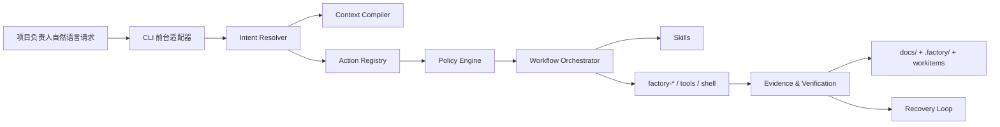

# 动作注册与分级自治策略设计

**文档状态：** MVP 已实现  
**主要读者：** 架构师 | 脚本维护者 | 平台维护者 | 项目协调者  
**负责人：** 仓库维护者  
**关联 ID：** `REQ-003`, `REQ-005`, `REQ-006`, `API-001`, `API-002`, `API-010`, `API-011`, `API-014`, `API-015`, `API-016`  
**最后更新：** 2026-04-02  

## 1. 设计目标

为山海工枢建立一层位于自然语言和 `factory-*` 执行入口之间的“动作注册与自治策略层”，让项目负责人只需要表达意图，系统即可在受控边界内自动完成软件工程动作。

当前确认的目标形态：

- 前台继续保持 `CLI-first`
- 以 `Codex`、`Gemini CLI` 为主要宿主
- 长期扩展更多前台工具，如 `opencode`
- 采用“分级自治”，逐步向更高自动化演进

当前已落地的 MVP：

- `config/action-registry.json`
- `config/autonomy-policy.json`
- `factory-dispatch` 优先从动作注册表解析首批高层动作
- `factory-dispatch --list-actions` 会显示已登记动作的风险级别和默认策略
- `config/frontends/*.json` 和 `factory-frontend-capabilities`
- `factory-intent-resolver` 与 `factory-dispatch intent-resolver`
- `factory-intent-resolver --execute-safe` 已可自动执行 `L0/L1` 主推荐动作
- `factory-intent-resolver --request-approval` 已可为 `L2/L3` 主推荐动作生成冻结审批票据
- `factory-intent-resolver` 已可选择 `command-profiles` / `workflow-runner` 的具体子目标
- `command-profiles` 已支持子目标风险覆盖，`pre-gate` / `daily-close` / `release-ready` / `handover-ready` 会提升到 `L2`
- `factory-intent-eval` 与 `config/evals/intent-resolver-cases.json`
- `factory-intent-approval` 与控制面审批队列视图
- 审批票据已可冻结建议 ownership 角色与写入集合，并在批准执行前再次校验显式写集冲突
- `config/reply-policy.json` 已固定 `reply_summary`、`approval_guidance` 和 skill 正式变更批准边界

当前仍未落地的部分：

- 面向 UI / 远程协作者的审批 hook 接入
- 工作流和多代理的正式策略接入
- 基于回放与历史成功率的意图排序优化

## 2. 为什么主骨架不能只靠 skill

`skill` 负责行为协议、阅读顺序和思维约束，但不适合单独承担整套运行时骨架。

如果主架构完全以 `skill` 为中心，会出现这些问题：

- 高风险动作缺少稳定的执行边界
- 相同自然语言请求在不同前台上的行为不够一致
- 无法统一统计成功率、误判率、人工介入率
- 多代理协作难以形成明确的动作 ownership 和恢复协议

因此，主骨架应当转为：

- `Action Registry`：定义系统能做什么
- `Policy Engine`：定义什么情况下允许自动做
- `Workflow Orchestrator`：定义多个动作如何组合
- `Skill`：定义每个阶段和角色应该怎样理解问题、读取上下文和保持约束

## 3. 方案比较

### 方案 A：继续以 skill 为主骨架

- 优点：改动最小，延续当前技能组织方式
- 缺点：执行层自由度过高，风险治理和观测性不足

### 方案 B：以工作流图为主骨架

- 优点：阶段型流程稳定，适合审批和 Gate
- 缺点：对开放式工程任务过于刚性，难覆盖探索性工作

### 方案 C：以动作注册表为主骨架，工作流作为编排层

- 优点：兼顾自然语言入口、执行确定性、风险治理和多前台复用
- 缺点：需要新增统一动作契约和策略层

### 当前推荐方案

采用方案 C。

它最符合山海工枢的约束：

- 保留 `CLI-first`
- 不推翻现有 `factory-*` 资产
- 可以把自然语言、skill、script、workflow 和多代理协作纳入同一套运行时

## 4. 核心概念

| 概念 | 定义 | 作用 |
|---|---|---|
| `intent` | 用户自然语言表达的目标 | 作为动作选择和工作流编排的起点 |
| `action` | 一个已注册、可执行、可验证的标准动作 | 系统的最小执行单元 |
| `workflow` | 多个动作按时序和条件组合的流程模板 | 把高层任务拆成可执行序列 |
| `policy` | 动作的风险等级、前置条件和审批规则 | 决定动作能否自动执行 |
| `evidence` | 证明动作已完成的文件、测试、日志和检查结果 | 防止“口头完成” |
| `recovery` | 失败后的安全重试、降级和停止规则 | 提升系统恢复能力 |

## 5. 目标运行时结构

## 6. Action Registry 契约

每个动作都必须具备稳定且可机器消费的元数据；系统不应允许未注册动作直接进入自动执行路径。

### 6.1 最小字段

| 字段 | 说明 |
|---|---|
| `id` | 动作唯一标识，如 `docs.standard_upgrade` |
| `aliases` | 自然语言和历史命令别名 |
| `purpose` | 这个动作解决什么问题 |
| `inputs_schema` | 参数结构和必填项 |
| `preconditions` | 项目类型、阶段、文件存在性等前置条件 |
| `risk_level` | `L0` 到 `L3` |
| `frontend_requirements` | 是否需要 shell、文件编辑、子代理、MCP |
| `artifacts` | 预期产物 |
| `success_criteria` | 什么算完成 |
| `verification` | 如何验证完成 |
| `recovery_hints` | 出错后的安全恢复提示 |
| `subtargets` | 可选的子目标策略覆盖，例如某些 profile 单独提高风险等级 |

### 6.2 建议的注册样例

| 动作 ID | 现有实现或目标实现 | 说明 |
|---|---|---|
| `session.refresh` | `factory-agent-session` | 编译当前会话最小上下文包 |
| `state.doctor` | `factory-state-doctor` | 诊断项目状态和缺口 |
| `project.historical_onboarding` | `factory-historical-project-onboarding` | 历史项目纳管 |
| `docs.standard_upgrade` | `factory-docs-standard-upgrade` | 升级 docs 到最新标准 |
| `workflow.pre_gate` | `factory-command-profiles pre-gate` 或 `factory-dispatch workflow` | Gate 前组合动作 |
| `board.multi_agent` | `factory-multi-agent-board` | 多代理协作看板 |

### 6.3 当前 MVP 覆盖范围

当前注册表已经覆盖首批高层动作：

- `init`
- `agent-session`
- `state-doctor`
- `historical-project-onboarding`
- `docs-standard-upgrade`
- `docs-standard-upgrade-batch`
- `project-rules-refresh`
- `multi-agent-board`
- `frontend-capabilities`
- `intent-resolver`
- `intent-eval`
- `workflow-runner`
- `command-profiles`

其余历史动作仍由 `factory-dispatch` 的 legacy 映射兼容承载，后续逐步迁移入注册表。

## 7. 分级自治策略

### 7.1 风险等级

| 等级 | 典型动作 | 默认策略 |
|---|---|---|
| `L0` 只读 | session、doctor、读取文档、状态分析 | 自动执行 |
| `L1` 低风险写入 | 刷新索引、补齐说明文档、生成摘要 | 自动执行 |
| `L2` 中风险变更 | 结构迁移、批量修复、任务分解、部分代码改动 | 执行前给出摘要并确认 |
| `L3` 高风险动作 | 删除、覆盖、发布、迁移数据库、强制回退 | 必须显式批准 |

### 7.2 自治收口规则

- 不允许自然语言直接映射到任意 shell 命令
- 不允许未注册动作进入 `L1` 以上自动执行路径
- 不允许没有验证证据的动作被标记为“完成”
- 不允许缺少项目识别、阶段识别或目标路径时直接实施

### 7.3 长期向更高自治演进的条件

只有满足下面条件，动作才能从更高风险门槛逐步降级：

- 该动作有稳定输入输出结构
- 历史成功率持续较高
- 人工打断率和回退率持续较低
- 已有明确恢复剧本
- 已具备回放评估和回归样本

## 8. 执行流程

1. 前台适配器识别当前宿主能力。
2. `Intent Resolver` 从自然语言中提取目标项目、目标阶段和目标意图。
3. `Context Compiler` 生成最小上下文包。
4. 从 `Action Registry` 里选择最匹配动作或工作流。
5. `Policy Engine` 评估是否可自动执行。
6. 通过 `Skill` 补充阶段约束和阅读顺序。
7. 执行动作、收集证据并写回 `docs/`、`.factory/` 和工作项。
8. 若失败，进入恢复协议；若成功，记录观测结果供后续进化。

## 9. 证据与恢复契约

每个动作和工作流都必须返回统一观察结构：

- `status`
- `summary`
- `artifacts`
- `verification`
- `next_actions`
- `recovery_hint`

统一失败模式至少包括：

- `blocked`
- `looping`
- `unverified`
- `policy_denied`
- `context_insufficient`
- `tool_unavailable`

统一恢复步骤：

1. 复述当前目标
2. 指出失败模式
3. 说明已排除路径
4. 给出下一条明显不同的安全路径
5. 指定本轮必须补齐的证据

## 10. 与现有山海工枢资产的映射

| 现有资产 | 新定位 |
|---|---|
| `factory-dispatch` | 执行后端和动作分派器 |
| `factory-agent-session` | `Context Compiler` 的当前承载体 |
| `factory-state-doctor` | 运行时健康检查和缺口诊断器 |
| `factory-command-profiles` | 工作流模板库的早期形态 |
| `skills/` | 阶段协议、角色约束和专业能力层 |
| `factory-multi-agent-board` | 多代理编排面的现有入口 |

## 11. 验收标准

- 给定一个明确自然语言请求，系统能稳定映射到已注册动作或工作流。
- 给定一个高风险动作，系统会按策略要求停在审批边界。
- 给定一次成功执行，系统能产出明确证据和可追踪产物。
- 给定一次失败执行，系统能返回结构化恢复建议，而不是只输出原始报错。
- 给定一个新前台工具，系统可以通过能力画像接入，而不是重写整套动作定义。

## 12. 外部参考

- [claw-code](https://github.com/ultraworkers/claw-code)
- [CLAW.md](https://github.com/ultraworkers/claw-code/blob/main/CLAW.md)
- [Prompt Engineering Guide - Function Calling](https://www.promptingguide.ai/agents/function-calling)
- [Prompt Engineering Guide - Context Engineering](https://www.promptingguide.ai/agents/context-engineering)
- [Prompt Engineering Guide - Reflexion](https://www.promptingguide.ai/techniques/reflexion)
- [Prompt Engineering Guide - Prompt Injection](https://www.promptingguide.ai/prompts/adversarial-prompting/prompt-injection)

## 13. 变更记录

| 日期 | 变更内容 | 变更人 |
|---|---|---|
| 2026-04-02 | 初始版本，定义动作注册、分级自治和证据恢复契约 | Codex |
| 2026-04-02 | 落地 `config/action-registry.json` 与 `config/autonomy-policy.json`，并接入 `factory-dispatch` 首批高层动作 | Codex |
| 2026-04-02 | 落地最小 `Intent Resolver`、前台能力画像查询入口，并把 `init`、`intent-resolver` 纳入动作注册表 | Codex |
| 2026-04-02 | 为 `Intent Resolver` 增加 `profile/workflow` 子目标选择和 `--execute-safe`，只放行 `L0/L1` 主推荐动作 | Codex |
| 2026-04-02 | 增加 `Intent Eval` 固定样本回放入口，开始沉淀意图命中率与失败样本证据 | Codex |
| 2026-04-02 | 增加最小审批票据 hook，支持 `--request-approval`、`factory-intent-approval` 和冻结执行计划 | Codex |
| 2026-04-02 | 为审批票据增加冻结 ownership 和批准前显式写集冲突校验 | Codex |
| 2026-04-02 | 为 `command-profiles` 增加子目标风险覆盖，并将工作流型 profile 纳入审批与回放验证 | Codex |
| 2026-04-02 | 增加 `reply-policy.json`，把对话摘要字段、审批票据触发条件和 skill 正式变更批准边界固定为运行时契约 | Codex |
