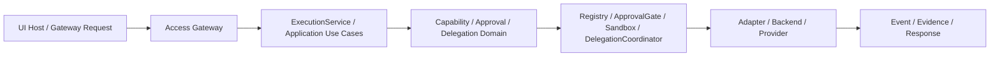

# 动作注册与分级自治策略设计

**文档状态：** `v2` 主题专项基线  
**主要读者：** 架构 | 平台维护者 | 治理规则维护者 | 集成开发者  
**负责人：** 仓库维护者  
**关联 ID：** `REQ-005`, `REQ-007`, `REQ-008`, `API-005`, `API-008`, `API-009`, `API-010`, `API-011`  
**最后更新：** 2026-04-15

## 1. 设计目标

文件名沿用“动作注册”是为了兼容旧讨论，当前正式语义已经收口为：

```text
能力注册 + 执行治理 + 分级自治策略
```

目标是在平台内回答三件事：

1. 系统能执行哪些能力，以及能力的输入输出和风险边界是什么。
2. 某个动作在当前上下文下是否允许执行，是否需要审批或沙箱。
3. 多代理或外部宿主调用时，如何保持一致的自治等级和证据要求。

## 2. 分层定位

| 层 | 责任 | 当前或目标落点 |
|---|---|---|
| 接口/网关层 | 把用户请求映射成运行请求 | `src/access/` |
| 业务调度层 | 编排执行、审批、委派和结果收口 | `src/application/` |
| 业务模型层 | 定义 capability、approval、delegation 的业务语义 | `src/domain/capability/`, `src/domain/approval/`, `src/domain/delegation/` |
| 基础能力层 | 提供 capability registry、approval gate、sandbox、delegation coordinator | `src/runtime/capability/`, `src/runtime/approval/`, `src/runtime/delegation/` |
| 基础设置层 | 提供 registry backend、approval backend、delegation backend 实现 | `src/settings/capability_registry/`, `src/settings/approval/`, `src/settings/delegation/` |

正式边界：

- capability 的语义 owner 在 `domain/capability`。
- approval / sandbox 的业务判断入口在 `domain/approval`。
- 具体执行资源、provider 和 backend 只在 `runtime` / `settings`。

## 3. 核心对象

| 对象 | 作用 |
|---|---|
| `CapabilityDescriptor` | 声明能力 ID、输入输出、风险、写集和证据要求 |
| `CapabilityResult` | 标准化能力执行结果 |
| `ApprovalDecision` | 审批判定结果 |
| `SandboxDecision` | 写集与工作区安全判定 |
| `DelegationPlan` / `DelegationTicket` / `DelegationResult` | 子任务委派和回收语义 |
| `AgentResponse` | 最终统一响应结构 |

这些对象共同保证平台不会把“执行什么”“能不能执行”“谁来执行”“如何返回”混成一层。

## 4. 执行治理链路



当前正式规则：

- access 只绑定协议，不做能力风险判断。
- application 只编排，不直接决定 provider 或后端。
- capability/approval/delegation 的业务规则在 `domain`。
- runtime 负责把这些规则落成可执行技术能力。
- settings 只实现，不越权改写治理语义。

## 5. 注册模型

平台级能力注册至少要描述下面这些字段：

| 字段 | 说明 |
|---|---|
| `id` | 能力唯一标识 |
| `input_schema` | 输入契约 |
| `output_schema` | 输出契约 |
| `risk_level` | 风险等级 |
| `approval_required` | 是否需要审批 |
| `writeset` | 可能写入的资源边界 |
| `evidence_required` | 是否必须留下证据 |
| `timeout / budget hints` | 运行预算建议 |

这些字段是平台正式能力契约的一部分，不应散落在宿主侧或某个 provider 里。

## 6. 分级自治策略

### 6.1 风险等级

建议统一为 4 级：

| 等级 | 含义 | 默认策略 |
|---|---|---|
| `L0` | 纯读取、无副作用 | 自动执行 |
| `L1` | 低风险局部写入 | 自动执行并留证据 |
| `L2` | 中风险变更或跨边界动作 | 需要用户确认或明确审批 |
| `L3` | 高风险动作、敏感资源或不可逆副作用 | 必须显式批准 |

### 6.2 治理原则

- 风险等级不是宿主 UI 决定的，而是能力契约的一部分。
- approval 和 sandbox 必须与 capability 执行解耦。
- delegation 不能绕过 approval / sandbox。
- 没有证据的执行结果不能被标记为“完成”。

## 7. 当前代码映射

| 能力 | 当前代码 |
|---|---|
| capability 领域模型 | `src/domain/capability/` |
| approval 领域模型 | `src/domain/approval/` |
| delegation 领域模型 | `src/domain/delegation/` |
| capability registry port | `src/runtime/ports/capability_registry.py` |
| approval policy port | `src/runtime/ports/approval_policy.py` |
| sandbox policy port | `src/runtime/ports/sandbox_policy.py` |
| delegation transport port | `src/runtime/ports/delegation_transport.py` |
| capability registry adapter | `src/settings/capability_registry/` |
| approval adapter | `src/settings/approval/` |
| delegation adapter | `src/settings/delegation/` |

## 8. 当前缺口

当前还需要继续补齐：

- capability catalog 的更完整查询面和 explainability 视图
- approval state bridge 和宿主侧交互流程
- writeset 规则与 workspace 规则的更细粒度表达
- delegation ticket / result 的更系统化测试
- 自治等级和历史成功率的长期策略调优

## 9. 一句话定稿

当前平台的正式口径不是“skill 驱动所有动作”，而是：

```text
能力先注册，风险先建模，审批与沙箱独立判定，委派显式交接，执行结果统一留证据。
```
- 人工打断率和回退率持续较低
- 已有明确恢复剧本
- 已具备回放评估和回归样本

## 8. 执行流程

1. 前台适配器识别当前宿主能力。
2. `Intent Resolver` 从自然语言中提取目标项目、目标阶段和目标意图。
3. `Context Compiler` 生成最小上下文包。
4. 从 `Action Registry` 里选择最匹配动作或工作流。
5. `Policy Engine` 评估是否可自动执行。
6. 通过 `Skill` 补充阶段约束和阅读顺序。
7. 执行动作、收集证据并写回 `docs/`、`.factory/` 和工作项。
8. 若失败，进入恢复协议；若成功，记录观测结果供后续进化。

## 9. 证据与恢复契约

每个动作和工作流都必须返回统一观察结构：

- `status`
- `summary`
- `artifacts`
- `verification`
- `next_actions`
- `recovery_hint`

统一失败模式至少包括：

- `blocked`
- `looping`
- `unverified`
- `policy_denied`
- `context_insufficient`
- `tool_unavailable`

统一恢复步骤：

1. 复述当前目标
2. 指出失败模式
3. 说明已排除路径
4. 给出下一条明显不同的安全路径
5. 指定本轮必须补齐的证据

## 10. 与现有山海工枢资产的映射

| 现有资产 | 新定位 |
|---|---|
| `factory-dispatch` | 执行后端和动作分派器 |
| `factory-agent-session` | `Context Compiler` 的当前承载体 |
| `factory-state-doctor` | 运行时健康检查和缺口诊断器 |
| `factory-command-profiles` | 工作流模板库的早期形态 |
| `skills/` | 阶段协议、角色约束和专业能力层 |
| `factory-multi-agent-board` | 多代理编排面的现有入口 |

## 11. 验收标准

- 给定一个明确自然语言请求，系统能稳定映射到已注册动作或工作流。
- 给定一个高风险动作，系统会按策略要求停在审批边界。
- 给定一次成功执行，系统能产出明确证据和可追踪产物。
- 给定一次失败执行，系统能返回结构化恢复建议，而不是只输出原始报错。
- 给定一个新前台工具，系统可以通过能力画像接入，而不是重写整套动作定义。

## 12. 外部参考

- [claw-code](https://github.com/ultraworkers/claw-code)
- [CLAW.md](https://github.com/ultraworkers/claw-code/blob/main/CLAW.md)
- [Prompt Engineering Guide - Function Calling](https://www.promptingguide.ai/agents/function-calling)
- [Prompt Engineering Guide - Context Engineering](https://www.promptingguide.ai/agents/context-engineering)
- [Prompt Engineering Guide - Reflexion](https://www.promptingguide.ai/techniques/reflexion)
- [Prompt Engineering Guide - Prompt Injection](https://www.promptingguide.ai/prompts/adversarial-prompting/prompt-injection)

## 13. 变更记录

| 日期 | 变更内容 | 变更人 |
|---|---|---|
| 2026-04-02 | 初始版本，定义动作注册、分级自治和证据恢复契约 | Codex |
| 2026-04-02 | 落地 `config/action-registry.json` 与 `config/autonomy-policy.json`，并接入 `factory-dispatch` 首批高层动作 | Codex |
| 2026-04-02 | 落地最小 `Intent Resolver`、前台能力画像查询入口，并把 `init`、`intent-resolver` 纳入动作注册表 | Codex |
| 2026-04-02 | 为 `Intent Resolver` 增加 `profile/workflow` 子目标选择和 `--execute-safe`，只放行 `L0/L1` 主推荐动作 | Codex |
| 2026-04-02 | 增加 `Intent Eval` 固定样本回放入口，开始沉淀意图命中率与失败样本证据 | Codex |
| 2026-04-02 | 增加最小审批票据 hook，支持 `--request-approval`、`factory-intent-approval` 和冻结执行计划 | Codex |
| 2026-04-02 | 为审批票据增加冻结 ownership 和批准前显式写集冲突校验 | Codex |
| 2026-04-02 | 为 `command-profiles` 增加子目标风险覆盖，并将工作流型 profile 纳入审批与回放验证 | Codex |
| 2026-04-02 | 增加 `reply-policy.json`，把对话摘要字段、审批票据触发条件和 skill 正式变更批准边界固定为运行时契约 | Codex |
| 2026-04-03 | 增加 `skill-draft` 动作，允许先将候选能力固化到 `skills-drafts/`，而不是直接改正式 skill | Codex |
| 2026-04-03 | 增加 `skill-eval` 动作，要求候选 skill 通过正式评估命令生成 `passed/failed` 报告，而不是手工改评估状态 | Codex |
| 2026-04-03 | 增加 `skill-approval` 动作，允许候选 skill 进入专用审批票据链路并把批准结果写回候选目录 | Codex |
| 2026-04-03 | 增加 `skill-promote` 动作，要求候选 skill 必须通过评估且已批准后才能写入正式 `skills/` | Codex |
| 2026-04-03 | 增加 `skill-delete-approval` 动作，为首次发布的新 skill 提供删除回退专用审批票据 | Codex |
| 2026-04-03 | 更新 `skill-rollback` 动作，允许首次发布的新 skill 在删除回退审批通过后执行受控删除回退 | Codex |
| 2026-04-03 | 重构 `factory-intent-resolver` 的 skill 生命周期解析块，允许自然语言按候选状态路由到 skill 治理链的下一条正式动作，并在缺少候选时保留阻塞边界而不是回退成无关动作 | Codex |
