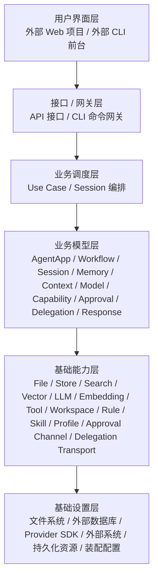

# 抽象 Agent 平台架构设计

**项目名称：** 山海工枢 / shanforge
**文档状态：** `v2` 平台主设计
**负责人：** 仓库维护者
**主要读者：** 架构维护者 | Agent Runtime 开发者 | 业务 Agent 开发者
**上游输入：** PRD | 需求分析 | Hermes Agent 源码调研报告
**下游输出：** 模块边界 | API 设计 | 实施计划 | 测试计划
**关联 ID：** `REQ-001` ~ `REQ-010`, `ADR-001` ~ `ADR-007`, `MOD-001` ~ `MOD-014`, `API-001` ~ `API-013`
**最后更新：** 2026-04-15

## 1. 平台结论

`v2` 的产品中心是抽象 Agent 平台，不是旧脚本集合，也不是单一 CLI 工具。

平台吸收 Hermes 的核心思想，但不照搬其工程形态。正式架构口径如下：

- 整个系统先按能力分成 6 层：用户界面层、接口/网关层、业务调度层、业务模型层、基础能力层、基础设置层。
- 每一层内部再按业务领域内聚建模，例如 `memory`、`workflow`、`session`、`approval`、`delegation`。
- 基础能力层对上提供统一技术能力，对内再通过不同基础设置实现多样化支撑。
- 业务调度层必须保持薄，只做用例编排，不承载供应商差异、持久化细节和底层规则判断。
- 正式 owner 规则只有一条：谁调用下层，谁定义接口；基础设置层只实现，不拥有上层逻辑。

## 2. 六层结构



### 2.1 每层职责

| 层 | 作用 | 当前代码落点 |
|---|---|---|
| 用户界面层 | 负责最终的人机交互界面 | 仓外 Web 项目、外部 CLI 前台；本仓不承载完整 UI |
| 接口/网关层 | 把外部请求收口为统一平台入口 | `src/access/` |
| 业务调度层 | 组织一次完整业务执行 | `src/application/` |
| 业务模型层 | 定义稳定业务对象、业务逻辑与领域规则 | `src/domain/` |
| 基础能力层 | 提供可复用技术能力服务 | `src/runtime/` |
| 基础设置层 | 提供文件、数据库、外部系统和装配实现 | `src/settings/` |

### 2.2 当前仓库的真实边界

本仓当前主要负责后 5 层中的 5 个实现区域：

- 不负责完整用户界面层产品实现。
- 负责接口/网关层中的 API 接口和 CLI 命令网关。
- 负责业务调度层、业务模型层、基础能力层。
- 负责基础设置层中的本地实现、外部系统桥接和容器装配。

也就是说，当前仓库不是“前后端一体 UI 仓”，而是“平台主仓”。

## 3. 架构原则

### 3.1 按能力分层，而不是按技术杂项分层

分层优先级固定如下：

1. 先判断它属于 UI、网关、调度、模型、能力还是设置。
2. 再判断它属于哪个业务领域，例如记忆、模型、能力注册、审批、委派。
3. 最后才决定它落在哪个目录或由哪个适配器实现。

因此：

- 基础设置层只有一个正式代码根：`src/settings/`。
- `src/settings/` 内部再按实现领域与支撑模块组织，不新增架构层次。
- `ports/` 也不是独立层，而是消费者所在层拥有的依赖接口。

### 3.2 基础能力层与基础设置层必须分开

这一点是当前架构重构后的正式定稿：

- 基础能力层负责“提供通用技术能力”，例如文件访问、结构化存储、全文检索、向量召回、模型调用、规则源、技能源、审批通道、委派通道。
- 基础设置层负责“提供这些能力背后的真实资源和实现”，例如文件系统、JSONL/SQLite/外部数据库、模型供应商 SDK、Hermes bridge、外部工具系统。
- `src/settings/composition/` 是设置层内唯一 composition root 与本地业务绑定层：它在启动时做跨层对象接线，并通过外部 `shanforge-di` 完成业务 ID 到具体实现的解析，但不承担业务编排，也不向业务层暴露 class path 级技术字符串。

一句话：

```text
能力层负责技术抽象与编排，设置层负责实现与接线。
```

### 3.3 统一接口原则

同一能力域在对外时必须是统一服务界面，在对内时才允许多实现并存。

例如：

- 接口/网关层只看到 `AgentAppMaterializationUseCase`、`RuntimeExecutionUseCase` 这类应用用例接口。
- 业务调度层只看到 `MemoryDomainService`、`WorkflowDomainService`、`CapabilityDomainService` 这类领域服务接口。
- 业务模型层只看到 `MemoryRecordRepositoryPort`、`CapabilityExecutionPort`、`ApprovalRequestPort` 这类基础能力接口。
- 基础能力层只看到 `LLMProviderPort`、`StructuredStoreProviderPort`、`RuleSourceProviderPort` 这类 provider 接口。

### 3.4 业务调度层必须足够薄

`src/application/` 的职责只有：

- 解析入口语义
- 选择业务 app / workflow
- 开 session
- 调用领域服务
- 收口结果

它不负责：

- provider 选择细节
- store 类型选择
- prompt/context 细节
- 审批与沙箱规则本体
- 供应商返回结构转换

## 4. 各层领域与接口 owner

当前正式 owner 关系如下：

| 调用层 | 领域 | 拥有的接口 |
|---|---|---|
| 用户界面层 | `web_console`、`cli_frontend`、`automation_host` | 消费网关接口，不向下定义本仓代码接口 |
| 接口/网关层 | `runtime_gateway`、`workflow_gateway`、`memory_gateway`、`capability_gateway` | `src/access/ports/application_use_cases.py` |
| 业务调度层 | `app_application`、`workflow_application`、`session_application`、`memory_application`、`execution_application` | `src/application/ports/domain_services.py` |
| 业务模型层 | `agent_app`、`workflow`、`session`、`memory`、`context`、`model`、`capability`、`approval`、`delegation`、`response` | `src/domain/*/ports.py` |
| 基础能力层 | `file_access`、`structured_storage`、`llm_gateway`、`tool_execution`、`rule_source`、`profile_source` 等 | `src/runtime/ports/*.py` |
| 基础设置层 | `model`、`memory`、`session`、`skills`、`workspace`、`approval`、`delegation`、`gateway`、`capability_registry`、`hermes`、`composition`、`shared` | 不定义新的上层逻辑接口，可实现 domain-owned 持久化端口与 runtime-owned provider 接口 |

## 5. 关键运行链路

### 5.1 主执行链

```text
外部 UI / 前台
  -> 接口 / 网关层
  -> 业务调度层
  -> 业务模型层
  -> 基础能力层
  -> 基础设置层
```

更具体地说：

1. 外部 Web 或 CLI 前台发起请求。
2. `src/access/` 把请求收口成 API / CLI 网关调用。
3. `src/application/` 编排 session、workflow 和结果收口。
4. `src/domain/` 执行业务规则，决定 recall、审批、委派、响应等语义。
5. `src/runtime/` 为领域提供文件、存储、检索、模型、规则源、技能源等通用能力。
6. `src/settings/` 提供 provider、持久化、桥接和装配实现，并在层内按实现领域组织代码。

### 5.2 记忆领域链路

```text
接口 / 网关层
  -> 业务调度层 MemoryDomainService
  -> 业务模型层 memory
  -> 基础能力层 recall/search/rule/profile/skill/store capability
  -> 基础设置层 file/db/index/provider implementation
```

### 5.3 模型调用链路

```text
业务模型层 model
  -> 基础能力层 llm_gateway / embedding_gateway
  -> 基础设置层 provider adapter
```

## 6. Hermes 对应关系

Hermes 对 `v2` 的真正启发，不是目录形态，而是能力切分方式：

| Hermes 思路 | `v2` 吸收方式 | 当前归属层次 |
|---|---|---|
| Agent 主循环 | 只吸收为基础能力层执行辅助，不作为业务 owner | 基础能力层 |
| Tool registry | 吸收到 `capability` 领域 + tool execution capability | 业务模型层 + 基础能力层 + 基础设置层 |
| Session / memory | 吸收到 `session` / `memory` 领域 + 对应基础能力 | 业务模型层 + 基础能力层 + 基础设置层 |
| Provider abstraction | 收口为 `llm_gateway` / `embedding_gateway` provider 模型 | 基础能力层 + 基础设置层 |
| Delegation | 收口为 `delegation` 领域 + delegation backend | 业务模型层 + 基础能力层 + 基础设置层 |
| Gateway / session context | 收口为接口/网关层契约 + Hermes-backed adapter scaffold | 接口/网关层 + 基础设置层 |

正式规则：

- 复用 Hermes 的成熟实现，但只允许落在基础设置层实现区。
- Hermes 不能反向主导 `domain / application / runtime` 的边界。
- 所有 Hermes 能力都必须先经过 `shanforge` 自己的接口契约收口。
- `shanforge-di` 作为外部反射 / DI 技术库，只允许由 `src/settings/composition/` 集成使用；业务层和普通 runtime service 只能消费已注入好的接口对象。

## 7. 架构决策定稿

| ADR | 决策 | 定稿 |
|---|---|---|
| `ADR-001` | `v2` 以抽象 Agent 平台为产品中心 | 保留 |
| `ADR-002` | 业务逻辑放在 Business Agent App / Workflow 中 | 保留 |
| `ADR-003` | 工作流采用声明式 DSL | 保留 |
| `ADR-004` | 大模型交互统一经领域策略 + 基础能力层 provider | 保留，并明确 owner |
| `ADR-005` | 工具能力统一治理 | 保留 |
| `ADR-006` | Context / Memory / Session 走统一平台闭环 | 保留 |
| `ADR-007` | 文件、数据库、外部系统只作为基础设置层实现存在 | 重述并定稿 |

## 8. 本轮重构结论

本轮架构重构后，正式口径只有一套：

- 用户界面层由仓外 Web 项目和外部 CLI 前台承担。
- 本仓实现接口/网关层中的 API 与 CLI 命令网关。
- `src/application/` 是薄业务调度层。
- `src/domain/` 是业务模型层，也是平台业务逻辑 owner。
- `src/runtime/` 是基础能力层，只提供通用技术能力。
- `src/settings/` 是基础设置层唯一正式代码根；`model / memory / session / skills / workspace / approval / delegation / gateway / capability_registry / hermes` 是层内实现领域，`composition / shared` 是层内支撑模块。

后续所有系统架构、模块边界、代码映射和接口定义，都必须使用这套口径。
