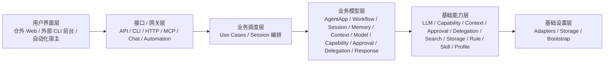

# 总体方案与协作总览

**项目名称：** 山海工枢 / shanforge  
**文档状态：** `v2` 总览基线  
**负责人：** 仓库维护者  
**主要读者：** 架构 | 平台开发 | 业务 Agent 开发 | 项目协调者  
**上游输入：** PRD | 需求分析 | Hermes Agent 源码调研报告  
**下游输出：** 系统架构 | 模块边界 | API 设计 | 实施计划  
**最后更新：** 2026-04-15

## 1. 方案结论

山海工枢 `v2` 的产品中心已经明确收口为一个面向业务装配的抽象 Agent 平台，而不是旧脚本集合，也不是单一 CLI 工具。

平台对业务暴露的不是底层 SDK，而是四类稳定装配面：

- `Agent App Manifest`：声明业务身份、输入输出和能力需求。
- `Workflow DSL`：声明步骤、流转条件和执行顺序。
- `ModelPolicy`：声明模型选择、预算和推理约束。
- `Capability Registry`：声明工具能力、风险级别、证据要求和写集边界。

平台对内则统一承载三条主闭环：

- 运行闭环：`session -> context -> workflow step -> model/capability -> response`
- 治理闭环：`capability -> approval/sandbox -> delegation -> evidence`
- 记忆闭环：`session/event/artifact -> evidence -> candidate -> promotion -> recall`

## 2. 六层平台视图

当前正式原则只有一套：

- 依赖只允许单向向下。
- 平台业务逻辑 owner 在 `domain`。
- `runtime` 只提供通用技术能力，不承担业务 owner。
- `adapters / storage / bootstrap` 是基础设置层实现分区，不是额外层次。
- 谁调用下层，谁定义接口。

## 3. 仓库职责边界

本仓不是“前后端一体 UI 仓”，而是平台主仓。当前重点承载下面 5 个仓内区域：

| 架构层 | 当前宿主或代码落点 | 责任 |
|---|---|---|
| 用户界面层 | 仓外 Web 项目、外部 CLI 前台 | 最终人机交互，不在本仓完整实现 |
| 接口/网关层 | `src/access/` | API、CLI、HTTP、MCP、Chat、Automation 收口 |
| 业务调度层 | `src/application/` | 用例编排、会话生命周期、流程协同 |
| 业务模型层 | `src/domain/` | 平台业务对象、策略、规则、契约 |
| 基础能力层 | `src/runtime/` | 上下文、模型、能力、审批、委派、检索、存储等技术能力 |
| 基础设置层 | `src/adapters/` + `src/storage/` + `src/bootstrap/` | provider、持久化、桥接、容器装配 |

## 4. 业务开发方式

业务开发的最小路径已经收敛为：

1. 定义 `Agent App Manifest`
2. 声明业务 `workflow`
3. 为每个 step 绑定 `capability` 或 `model_policy`
4. 声明 `output_schema`
5. 通过 mock provider 或本地持久化完成契约测试

因此，业务流不再通过直接调用 shell、Git 或供应商 SDK 来实现，而是通过平台定义好的声明式装配面进入运行闭环。

## 5. 运行闭环

当前正式运行链路如下：

1. 用户或上游系统经 UI 宿主发起请求。
2. `src/access/` 把请求绑定到统一网关入口。
3. `src/application/` 打开 session、选择 workflow、组织 prepare/run/persist。
4. `src/domain/` 负责 workflow、memory、approval、delegation、response 等业务规则。
5. `src/runtime/` 通过 Context Engine、Execution Engine、LLM Runtime、Capability Registry 等提供技术能力。
6. `src/adapters/`、`src/storage/`、`src/bootstrap/` 提供 provider、store 和装配实现。
7. 结果统一收口为 `AgentResponse`，并留下事件、证据和记忆蒸馏产物。

## 6. 方案边界

### 做什么

- 建立统一平台内核和声明式业务装配协议
- 允许不同入口复用同一套用例、领域模型和治理规则
- 允许不同 step 采用不同模型策略、能力策略和审批策略
- 保留 local-first、可审计、可回放的实现基线

### 不做什么

- 不把旧脚本或遗留入口继续当作产品定义中心
- 不让业务层直接依赖 SDK、数据库驱动或外部协议对象
- 不把 `runtime`、`adapters`、`storage` 混成一个“基础设施大层”
- 不把记忆、审批、委派等业务规则继续放在技术层 owner 位置

## 7. 推荐阅读顺序

1. [技术选型与工程规则](./technical-selection.md)
2. [系统架构设计](./system-architecture.md)
3. [抽象 Agent 平台架构](./agent-platform-architecture.md)
4. [分层领域与接口总表](./layered-domain-interface-catalog.md)
5. [模块边界文档](./module-boundaries.md)
6. [架构分层与代码映射说明](./architecture-layer-code-mapping.md)
7. [基础设置层与外部资源设计](./infrastructure-layer-design.md)
8. [API 设计文档](./api-design.md)

## 8. 版本记录

| 版本 | 日期 | 变更内容 |
|---|---|---|
| `v2.0` | 2026-04-13 | 按全新抽象 Agent 平台重写总体总览，移除旧版本边界叙事 |
| `v2.1` | 2026-04-15 | 统一到六层架构、消费者定义接口和 domain owner 口径 |
