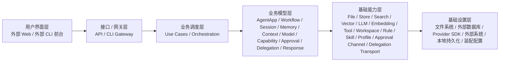
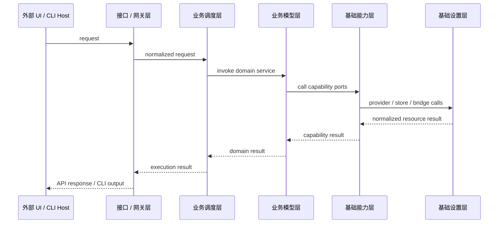

# 系统架构设计

**项目名称：** 山海工枢 / shanforge
**文档状态：** `v2` 架构基线
**负责人：** 仓库维护者
**主要读者：** 架构 | 平台开发 | 测试 | 运维
**上游输入：** PRD | 需求分析 | Hermes Agent 源码调研报告
**下游输出：** 模块边界 | API 设计 | 实施计划 | 测试计划
**关联 ID：** `REQ-001` ~ `REQ-010`, `NFR-001` ~ `NFR-005`, `ADR-001` ~ `ADR-007`, `MOD-001` ~ `MOD-014`, `API-001` ~ `API-013`
**最后更新：** 2026-04-15

## 1. 架构概览

系统正式采用单向六层分层架构。

- 正式依赖链只有一条：`用户界面层 -> 接口/网关层 -> 业务调度层 -> 业务模型层 -> 基础能力层 -> 基础设置层`。
- 每一层内部再按业务领域内聚建模，例如 `memory`、`session`、`workflow`、`capability`、`approval`。
- `adapters / storage / bootstrap` 不是附加架构层，而是基础设置层的实现分区。
- 不再使用“跨层子系统 owner”作为正式架构口径。

## 2. 层职责

| 层 | 职责 | 当前代码或宿主 |
|---|---|---|
| 用户界面层 | 面向最终用户交互、展示和操作 | 仓外 Web 项目、外部 CLI 前台 |
| 接口/网关层 | 提供 API 接口、CLI 命令网关和协议收口 | `src/access/` |
| 业务调度层 | 编排一次完整业务执行和会话生命周期 | `src/application/` |
| 业务模型层 | 持有平台业务逻辑、稳定领域对象和领域规则 | `src/domain/` |
| 基础能力层 | 提供通用技术能力抽象，并实现领域所需的统一能力 | `src/runtime/` |
| 基础设置层 | 提供文件、数据库、provider、外部系统和装配实现 | `src/adapters/` + `src/storage/` + `src/bootstrap/` |

## 3. 层内领域建模

模块不是简单按目录切碎，而是先按层，再在层内按领域内聚建模。

| 层 | 领域组 | 说明 |
|---|---|---|
| 用户界面层 | `web_console`、`cli_frontend`、`automation_host` | 宿主交互，不承载平台业务逻辑 |
| 接口/网关层 | `runtime_gateway`、`workflow_gateway`、`session_gateway`、`memory_gateway`、`capability_gateway` | 协议绑定、出入参归一化、入口收口 |
| 业务调度层 | `app_application`、`workflow_application`、`session_application`、`memory_application`、`execution_application` | 薄编排层，只调领域服务 |
| 业务模型层 | `agent_app`、`workflow`、`session`、`memory`、`context`、`model`、`capability`、`approval`、`delegation`、`response` | 平台业务规则 owner |
| 基础能力层 | `file_access`、`structured_storage`、`search_index`、`vector_index`、`llm_gateway`、`tool_execution`、`rule_source`、`skill_source`、`profile_source` 等 | 统一技术能力抽象与实现编排 |
| 基础设置层 | `provider_adapters`、`storage_backends`、`container_bootstrap` | 真实文件、数据库、SDK、外部系统和装配实现 |

## 4. 模块到层的正式归属

| 模块 | 主归属层 | 次级落点 | 说明 |
|---|---|---|---|
| `MOD-001` Business Agent Apps | 业务模型层 | 无 | 业务声明面 |
| `MOD-002` Application Use Cases | 业务调度层 | 无 | 薄编排层 |
| `MOD-003` Agent Domain Model | 业务模型层 | 无 | 稳定领域对象 |
| `MOD-004` Workflow Support | 业务模型层 | 基础能力层 | 业务工作流规则由领域 owner，运行辅助能力由基础能力层承载 |
| `MOD-005` Model Policy & Invocation | 业务模型层 | 基础能力层 + 基础设置层 | 策略归领域，调用能力走下层 |
| `MOD-006` Capability | 业务模型层 | 基础能力层 + 基础设置层 | 声明与风险规则归领域，执行依赖下层 |
| `MOD-007` Memory | 业务模型层 | 业务调度层 + 基础能力层 + 基础设置层 | 记忆业务逻辑 owner 在领域层 |
| `MOD-008` Approval | 业务模型层 | 基础能力层 + 基础设置层 | 审批语义归领域，通道与实现走下层 |
| `MOD-009` Delegation | 业务模型层 | 基础能力层 + 基础设置层 | 委派业务语义归领域 |
| `MOD-010` Session & Evidence | 业务模型层 | 基础能力层 + 基础设置层 | 会话与证据模型归领域，存储实现走下层 |
| `MOD-011` Interface & Gateway Entry | 接口/网关层 | 无 | API / CLI Gateway |
| `MOD-012` Consumer-Owned Ports | 跟随消费者 | 无 | 不构成单独层 |
| `MOD-013` Base Setting Implementations | 基础设置层 | 无 | provider、store、bridge、container |
| `MOD-014` Response | 业务模型层 | 基础能力层 | 输出语义归领域，验证和统计能力走下层 |

## 5. 运行时主时序

## 6. 数据与状态原则

- `session / event / evidence` 是第一事实源。
- `memory` 是蒸馏得到的二级资产，不覆盖第一事实源。
- 业务调度层不直接依赖基础能力层或基础设置层的具体实现。
- 业务模型层通过自己拥有的能力接口消费基础能力层。
- 基础能力层统一消费和产出领域对象，不泄漏底层 SDK 或数据库对象。
- 基础设置层可以替换实现，但不能改写上层能力语义。
- `ports` 跟随消费者所在层定义，所有实现都必须回到领域契约。

## 7. 安全与可靠性

- 高风险能力必须先经过审批和沙箱判断。
- 委派任务必须以显式输入契约和结果契约交接。
- Provider adapter 错误不能直接泄漏给业务调度层。
- 所有关键步骤都必须留下结构化事件与证据。

## 8. 架构决策

| ADR | 决策 | 结论 |
|---|---|---|
| `ADR-001` | `v2` 以抽象 Agent 平台为产品中心 | 保留 |
| `ADR-002` | 业务逻辑放在 Business Agent App / Workflow 中 | 保留 |
| `ADR-003` | 工作流采用声明式 DSL | 保留 |
| `ADR-004` | 模型交互统一经过领域策略 + 基础能力层模型能力 | 保留并明确 owner |
| `ADR-005` | 工具能力统一治理 | 保留，业务 owner 归领域层 |
| `ADR-006` | 上下文、记忆和会话走统一平台闭环 | 保留，业务 owner 归领域层 |
| `ADR-007` | 文件、数据库、外部系统属于基础设置层 | 定稿 |

## 9. 当前未决问题

- 外部 Web 项目与本仓 API 网关之间的契约粒度是否需要单独固化为网关规范。
- 基础设置层的持久化实现首版是否维持 `JSONL + in-memory`，还是尽快补外部数据库适配。
- UI 层是否需要为 CLI host 和 Web host 分别定义统一会话协议。

## 10. 版本记录

| 版本 | 日期 | 变更内容 |
|---|---|---|
| `v2.0` | 2026-04-13 | 重写系统架构，建立纯 `v2` 平台基线 |
| `v2.1` | 2026-04-14 | 建立六层架构基线 |
| `v2.2` | 2026-04-15 | 收口为单向依赖链，并把业务逻辑 owner 统一回业务模型层 |
