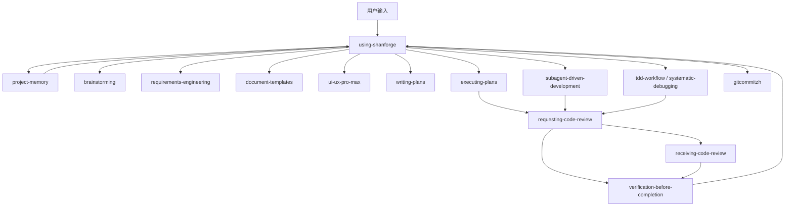

# 流程契约实施方案

## 版本信息

| 项目 | 内容 |
|---|---|
| 文档编号 | `FLOW-CONTRACT-001` |
| 文档类型 | 实施方案 |
| 当前版本 | `0.1.0` |
| 当前状态 | 草稿 |
| 最近更新 | 2026-07-06 |

## 版本历史

| 版本 | 修改内容 | 日期 | 修改人 | 审核 | 批准 |
|---|---|---|---|---|---|
| `0.1.0` | 根据 `FLOW-REQ-001` 首版需求形成完整实施方案、流程管控设计、skill 调用图、运行时文档设计、输入输出契约和任务拆解 | 2026-07-06 | Codex | 待审核 | 待批准 |
| `0.1.1` | 补充项目级测试运行时、测试环境启动和端口规则、启动记忆读取顺序、非活跃任务记忆降级及后续任务拆解 | 2026-07-06 | Codex | 待审核 | 待批准 |
| `0.1.2` | 将启动记忆读取改为条件读取链，明确 `agent-session.md`、`runtime-brief.md`、`current-state.md` 不是每次必读集合 | 2026-07-06 | Codex | 待审核 | 待批准 |

## 1. 实施目标

把 Shanforge workflow 从“多个 skill 分别执行”升级为“流程契约驱动”的系统：

- 四类场景入口清晰。
- 单个需求和任务内部按瀑布式 gate 推进。
- 多个需求之间可并列敏捷推进。
- 项目级 baseline work item 承载领域划分、总体架构、数据库、API 和整体 UI。
- 正式文档、临时文档、memory、work item、PM 视图边界固定。
- 每个 skill 的输入、输出、内部流程和状态回写可验证。
- AI 不能跳过步骤、不能省略 evidence、不能自批完成。
- 整体黑盒测试、UI 测试、接口测试和测试环境作为项目级测试工作项治理。
- 启动记忆按条件读取链恢复，够用即停；非活跃任务从 `current-state.md` 降级。

## 2. 总体结构

```text
用户输入
  ↓
using-shanforge
  ↓
project-memory
  ↓
场景识别：新项目 / 增加需求 / 变更需求 / 修复 bug
  ↓
需求分析或 baseline 分析
  ↓
设计影响判断
  ↓
任务拆解
  ↓
任务瀑布执行
  ↓
review / verification / human confirmation
  ↓
PM 视图刷新 / memory 同步 / 提交门
```

## 3. 业务流程管控设计

### 3.1 状态对象

| 对象 | 状态 |
|---|---|
| Project | `draft -> baseline_ready -> active -> archived` |
| Baseline | `draft -> ready_for_review -> approved -> active -> superseded` |
| Requirement | `intake -> requirements_ready -> design_impact_checked -> planned -> in_progress -> ready_for_review -> approved -> pending_human_confirmation -> closed` |
| Task | `draft -> design_ready -> test_design_ready -> implementation_ready -> unit_test_passed -> ready_for_review -> approved -> integration_passed -> pending_human_confirmation -> closed` |
| Bug | `reported -> reproduced -> root_cause_found -> fix_planned -> fixed -> regression_passed -> approved -> pending_human_confirmation -> closed` |

### 3.2 场景一：新项目

```text
输入：用户提出新项目
输出：Project baseline + 第一批 requirements + task plan
```

步骤：

1. `using-shanforge` 判断场景为 `new_project`。
2. `project-memory` 生成新项目会话卡，确认不存在现有 project baseline。
3. `brainstorming` 澄清项目目标、非目标、角色、成功标准。
4. `requirements-engineering` 形成首批项目级需求。
5. `document-templates` 创建或更新 `project-map` 和 `project-baseline` 等正式文档。
6. baseline work item 依次登记：
   - `BASE-001` 项目目标与范围。
   - `BASE-002` 领域划分与模块边界。
   - `BASE-003` 总体技术架构。
   - `BASE-004` 数据库基线。
   - `BASE-005` API 基线。
   - `BASE-006` 整体 UI 设计。
7. `writing-plans` 拆第一批业务需求任务。
8. `executing-plans` 或 `subagent-driven-development` 执行任务。
9. `requesting-code-review` 做独立 review。
10. `verification-before-completion` 做新鲜验证。
11. `using-shanforge` 停在人工确认门。

### 3.3 场景二：增加需求

```text
输入：用户提出新增功能
输出：Requirement + tasks + affected baseline updates
```

步骤：

1. `using-shanforge` 判断场景为 `add_requirement`。
2. `project-memory` 读取当前会话卡和相关 summary。
3. `brainstorming` 澄清意图和非目标。
4. `requirements-engineering` 写需求、AC、NFR。
5. `requirements-engineering` 做 baseline 影响分析：
   - 是否影响领域划分。
   - 是否影响总体架构。
   - 是否影响数据库。
   - 是否影响 API。
   - 是否影响整体 UI。
6. 影响 baseline 时，创建 `BASE-*` 变更 work item，并反向关联该需求。
7. `writing-plans` 拆任务。
8. 任务按瀑布流程执行、review、验证、关闭。
9. 需求级验收后进入人工确认。

### 3.4 场景三：变更需求

```text
输入：用户要求修改已有需求
输出：已更新版本的 Requirement + 受影响任务调整
```

步骤：

1. `using-shanforge` 判断场景为 `change_requirement`。
2. `project-memory` 定位原需求、原任务、ledger、review 状态。
3. `requirements-engineering` 对原需求做版本变更：
   - 更新当前版本。
   - 写版本历史。
   - 保留原事实，不删除审计轨迹。
4. 做影响分析。
5. 对未开始任务，更新任务输入。
6. 对进行中任务，标记 `change_required`，重新设计。
7. 对已关闭任务，新增回归或修正任务。
8. 必要时触发 baseline 变更。
9. 完成 review、回归测试、人工确认。

### 3.5 场景四：修复 bug

```text
输入：用户报告 bug
输出：Bug requirement + root cause + regression evidence
```

步骤：

1. `using-shanforge` 判断场景为 `fix_bug`。
2. `tdd-workflow` 或 `systematic-debugging` 先复现问题。
3. 记录：
   - 复现步骤。
   - 期望行为。
   - 实际行为。
   - 受影响范围。
4. 定位根因，不允许猜测式补丁。
5. 判断根因是否来自 baseline 缺陷：
   - 领域边界错误。
   - 架构规则缺失。
   - 数据库模型错误。
   - API 契约错误。
   - UI 交互基线错误。
6. 如是，创建 baseline 变更。
7. 写红灯测试。
8. 最小修复。
9. 运行单元测试、集成测试和回归测试。
10. 独立 review。
11. 人工确认后关闭 bug。

## 4. 文档运行时设计

### 4.1 正式文档结构

保留四大模块：

```text
docs/
  01-getting-started/
  02-user-guide/
  03-developer-guide/
  04-project-development/
    03-requirements/
      process-workflow-contract-requirements.md
    04-design/
      backend/
      frontend/
      database/
      api/
    05-development-process/
      process-workflow-contract-implementation-plan.md
```

说明：

- `02-user-guide` 面向使用者。
- `03-developer-guide` 面向二次开发、API、SDK、插件。
- `04-project-development` 面向内部项目实施。
- `04-project-development/04-design` 的编号是历史目录排序，不在本轮迁移。

### 4.2 三层文档模型

| 层级 | 文档 | 说明 |
|---|---|---|
| 项目级 | project map / project baseline / baseline 设计文档 | 全局事实和设计基线 |
| 需求级 | requirement 文档 | 为什么做、做什么、做到什么算完成 |
| 任务级 | work item plan / task brief / evidence | 怎么做、怎么验、谁确认 |

### 4.3 正式文档规则

1. 正式文档只能放在 `docs/` 登记路径。
2. 新增正式文档必须更新根 `docs/index.md` 或 `doc-map.md`。
3. 正式文档必须有中文 `版本信息` 和 `版本历史`。
4. 修改正式文档必须追加版本历史。
5. 临时文档只能放：
   - `.factory/workitems/<ID>/evidence/`
   - `.factory/workitems/<ID>/reports/`
   - `.factory/workitems/<ID>/reviews/`
   - `.factory/pm/generated/`
6. `.factory/pm/generated/` 可以覆盖生成。
7. `project-implementation-management.md` 只在阶段汇报或归档时生成。

### 4.4 记忆结构

| 文件 | 内容 | 不包含 |
|---|---|---|
| `.factory/memory/runtime-brief.md` | 项目入口、当前流程、禁止动作 | 长需求正文 |
| `.factory/memory/current-state.md` | 当前阶段、活跃任务、最近事实 | 未执行计划 |
| `.factory/memory/doc-map.md` | 正式文档到 summary 的映射 | 正文副本 |
| `.factory/memory/tasks.summary.md` | 需求、任务、gate、下一动作摘要 | 详细实现步骤 |
| `.factory/memory/architecture.summary.md` | 架构和模块当前结论 | 完整架构设计 |
| `.factory/memory/api.summary.md` | API 契约索引 | 完整 OpenAPI 内容 |
| `.factory/memory/design-assets.summary.md` | UI / 视觉资产索引 | 原型正文 |

### 4.4.1 启动记忆读取

启动时不只查看 `current-state.md`，也不固定读取所有 memory 文件。`current-state.md` 是当前状态页，不是完整恢复包。

默认是条件读取链。每一步如果已经能判断当前阶段、工作项、禁止动作和下一步，就停止。

```text
当前对话已有新鲜会话卡
-> 够用则停止
-> 不够才读 .factory/memory/agent-session.md
-> 仍缺关键事实才读 runtime-brief.md / current-state.md 的最小片段
-> 有当前 work item 时才读该 work item ledger
-> summary 不足时才读当前任务相关 summary
-> 只有需要定位正式事实源时才读 doc-map.md
-> 只有 summary 与 ledger 仍不足时，才按 doc-map.md 单文件回源正式文档
```

读取边界：

- 没有当前任务时，不读取所有 work item。
- summary 足够时，不回源正式长文档。
- 只有要定位事实源时读取 `doc-map.md`。
- `current-state.md` 只保留活跃任务、阻塞项、最近事实和下一动作。
- `agent-session.md`、`runtime-brief.md`、`current-state.md` 是 fallback 链，不是启动必读清单。
- 恢复结果应压缩成会话卡，避免把 memory 文件原文带入后续上下文。

### 4.4.2 非活跃任务降级

非活跃任务从当前记忆移除，但不删除事实。

```text
closed / committed / done
-> 下一次 memory sync 从 current-state.md 移除
-> tasks.summary.md 保留一行索引
-> ledger / evidence / review / report 原地保留
-> 阶段归档后进入历史摘要或 release report
```

暂停任务：

```text
paused but not closed
-> 移入 backlog summary
-> 用户恢复时再进入 current-state.md
```

仍算活跃：

- `ready_for_review`
- `changes_requested`
- `pending_human_confirmation`
- `blocked` 且有 `next_required_action`

### 4.5 PM 视图

日常：

```text
.factory/pm/generated/status-dashboard.html
```

阶段归档：

```text
docs/04-project-development/05-development-process/reports/project-implementation-management.md
```

归档文档只汇总事实，不作为新事实源。

### 4.6 测试运行时设计

整体测试按项目级工作项管理。

```text
Project
  -> TEST-ENV-001 测试环境基线
  -> TEST-API-001 接口契约与接口回归
  -> TEST-UI-001 UI smoke / E2E
  -> TEST-BB-001 整体黑盒测试
  -> TEST-REL-001 发布前回归
```

具体测试用例反向关联：

```text
REQ / AC / API / 页面 / 模块 / baseline
```

测试环境基线：

```text
docs/04-project-development/06-testing-verification/test-environment.md
```

内容：

| 服务 | 启动命令 | 默认端口 | 健康检查 | 配置变量 |
|---|---|---|---|---|
| backend | 项目定义 | 项目定义 | `/health` 或等价命令 | `API_BASE_URL` |
| frontend | 项目定义 | 项目定义 | `/` 或目标页面 | `WEB_BASE_URL` |
| database | 项目定义 | 项目定义 | 数据库健康检查 | `DATABASE_URL` |

端口规则：

- 默认端口写在 `test-environment.md`。
- 自动化测试通过环境变量读取实际 URL。
- 端口冲突时，测试执行者选择可用端口并记录原因。
- 测试报告必须写实际 `API_BASE_URL`、`WEB_BASE_URL`、启动命令、健康检查和关闭方式。

启动责任：

- 谁执行测试，谁启动测试环境。
- `verification-before-completion` 或 `TEST-*` work item 执行者负责启动、健康检查、执行测试、停止环境和记录 evidence。
- 如果服务已经运行，测试报告必须记录“复用已有服务”、URL、健康检查结果和来源。

接口测试：

| 层级 | 挂载 | 产物 |
|---|---|---|
| 单接口测试 | 对应 `REQ` / `TASK` | 任务 evidence |
| 全量契约测试 | `TEST-API-*` | `api-test-report.md` |
| 发布接口回归 | `TEST-REL-*` | release regression report |

UI 测试：

| 层级 | 挂载 | 产物 |
|---|---|---|
| 页面 smoke | 对应 `REQ` / `TASK` | screenshot、console、断言 |
| 交互测试 | 对应 `REQ` / `TASK` | Playwright / 项目测试报告 |
| 全站 E2E | `TEST-UI-*` 或 `TEST-REL-*` | UI test report |

整体黑盒测试：

| 层级 | 挂载 | 产物 |
|---|---|---|
| 系统行为 | `TEST-BB-*` | black-box test report |
| 发布验收 | `TEST-REL-*` | release acceptance report |

## 5. Skill 调用图



原则：

- `using-shanforge` 是唯一流程路由 owner。
- 工作 skill 只完成本职工作并回写状态。
- 工作 skill 不决定下一个 skill。
- `project-memory` 只恢复和同步上下文，不做业务判断。
- `gitcommitzh` 只在 gate 全部满足且用户要求提交时运行。

## 6. Skill 输入输出设计

### 6.1 `using-shanforge`

输入：

- 用户请求。
- `.factory/memory/agent-session.md`
- `.factory/memory/current-state.md`
- 当前 work item ledger。
- review ledger。

输出：

- 场景分类：`new_project | add_requirement | change_requirement | fix_bug | baseline | continue_work | review | commit`
- 下一步唯一 skill。
- 输入包。
- 阻塞 gate。
- 人工确认包。

内部流程：

1. 恢复最小上下文。
2. 判断是否存在 `pending_human_confirmation`。
3. 判断四类场景或当前 work item 状态。
4. 检查是否需要 baseline work item。
5. 检查 gate 证据。
6. 选择唯一下一步 skill。
7. 输出输入包。
8. 关闭或提交前重读 ledger。

禁止：

- 写需求正文。
- 写代码。
- 自批完成。
- 跳过 review、verification 或 human confirmation。

### 6.2 `project-memory`

输入：

- 当前对话。
- `.factory/memory/agent-session.md`
- `.factory/memory/current-state.md`
- `.factory/memory/doc-map.md`
- 当前 work item ledger。

输出：

- 会话卡。
- 已读文件清单。
- 排除文件清单。
- 禁止动作。
- memory / ledger 同步事件。

内部流程：

1. 优先复用会话卡。
2. 缺关键事实时读取最小 summary。
3. 必要时按 `doc-map.md` 单文件回源。
4. 读取当前 work item ledger。
5. 防止重复执行已完成事件。
6. 更新 summary 时只写真实观察事实。

禁止：

- 默认散读 `docs/`。
- 把 memory 当正式事实源。
- 把计划写成已完成。

### 6.3 `brainstorming`

输入：

- 用户原始意图。
- 当前会话卡。
- 当前 work item brief。

输出：

- 意图摘要。
- 场景候选。
- 目标、非目标、成功标准。
- 未决问题。
- `needs_user_input` 或 `ready_for_review` 状态包。

内部流程：

1. 判断是否真需要头脑风暴。
2. 识别四类场景。
3. 一次只问一个关键问题。
4. 给 2-3 个方案并推荐一个。
5. 写 brief 草稿。
6. 标记是否需要需求分析。

禁止：

- 替代正式需求。
- 推进到 approved。
- 默认读取长文档。

### 6.4 `requirements-engineering`

输入：

- 已澄清意图。
- work item brief。
- 相关正式需求。
- 相关 baseline 摘要。

输出：

- 需求文档。
- REQ、AC、NFR。
- 影响分析。
- 领域模块映射。
- baseline 变更建议。
- `.factory/memory/tasks.summary.md` 摘要。

内部流程：

1. 区分事实、假设和待确认。
2. 写用户故事。
3. 写功能需求和验收标准。
4. 写非功能需求。
5. 做 baseline 影响分析。
6. 映射领域模块。
7. 写风险和关闭条件。
8. 写版本历史。
9. 输出状态包。

禁止：

- 未确认需求写成 approved。
- 绕过 baseline 直接改领域、数据库、API 或 UI。

### 6.5 `document-templates`

输入：

- 需求或 baseline 输入。
- 文档类型。
- 当前文档结构。
- `doc-map.md`。

输出：

- 正式文档。
- 文档版本信息。
- 版本历史。
- 根导航或 doc-map 更新建议。

内部流程：

1. 判断文档属于用户手册、开发者指南还是内部项目开发文档。
2. 判断是否已有正式文档。
3. 默认修改既有正式文档。
4. 新增文档时同步导航或 doc-map。
5. 临时内容放 work item evidence。
6. 检查版本历史。

禁止：

- 随意增加未登记正式文档。
- 把临时推理写进正式文档。
- 用 `.factory/pm/generated/` 作为事实源。

### 6.6 `ui-ux-pro-max`

输入：

- 项目 UI baseline 或需求级 UI 影响。
- 用户角色。
- 页面和流程。
- 后端 API 或前端业务接口约束。

输出：

- 整体 UI 设计或增量 UI 设计。
- 页面清单。
- 组件规则。
- 状态设计。
- 接口使用说明。
- 设计资产索引。

内部流程：

1. 判断是 baseline UI 设计还是需求级 UI 增量。
2. baseline 任务写完整信息架构。
3. 需求级任务只写增量影响。
4. 确认复用后端接口、扩展后端接口或新增 BFF。
5. 输出可评审设计。
6. 需要视觉资产时登记路径。

禁止：

- 在普通任务中偷偷改全局 UI 规则。
- 没有接口约束就画孤立 UI。

### 6.7 `writing-plans`

输入：

- 已批准需求或 baseline。
- 影响分析。
- 设计约束。
- 测试策略。

输出：

- work item plan。
- task brief。
- 文件清单。
- 测试策略。
- review gate。

内部流程：

1. 确认输入已批准或明确是草稿计划。
2. 锁定文件结构。
3. 拆任务。
4. 每个任务写设计、接口、UI 或 N/A、测试设计、开发、单测、review、集成测试。
5. 写真实命令和期望输出。
6. 写 memory 和 ledger 同步要求。
7. 自审计划。

禁止：

- 用“后续补充”当步骤。
- 省略测试设计。
- 把计划写成已经执行。

### 6.8 `executing-plans`

输入：

- 已批准计划。
- 当前任务 brief。
- 允许修改范围。
- 禁止修改范围。

输出：

- 实现 diff。
- 验证 evidence。
- 实现报告。
- ledger 事件。
- `ready_for_review` 状态包。

内部流程：

1. 先 review 当前计划是否可执行。
2. 按任务顺序执行。
3. 遇到设计缺口时停止并回写 blocked。
4. 写最小实现。
5. 运行要求测试。
6. 写 evidence 和报告。
7. 状态只到 `ready_for_review`。

禁止：

- 自批 approved。
- 跳过计划步骤。
- 修改任务范围外文件。

### 6.9 `subagent-driven-development`

输入：

- 已批准计划。
- 可隔离任务 brief。
- 写集边界。
- 验收标准。

输出：

- 子任务执行结果。
- evidence。
- report。
- review 输入包。
- ledger 事件。

内部流程：

1. 判断任务是否适合独立子 agent。
2. 为每个子任务提供完整输入包。
3. 限定写集。
4. 回收结果。
5. 检查 evidence。
6. 写入主 work item ledger。

禁止：

- 让子 agent 决定流程下一步。
- 合并无 evidence 的结果。

### 6.10 `tdd-workflow`

输入：

- bug 报告或功能需求。
- 当前测试策略。
- 相关代码范围。

输出：

- 红灯测试。
- 根因说明。
- 最小修复。
- 绿灯测试 evidence。
- 回归范围。

内部流程：

1. 复现问题或定义失败测试。
2. 确认失败。
3. 定位根因。
4. 写最小修复。
5. 运行目标测试。
6. 运行邻近回归。
7. 输出 evidence。

禁止：

- 未复现就修。
- 用未验证 fallback 掩盖根因。

### 6.11 `systematic-debugging`

输入：

- 失败命令。
- 日志。
- 相关代码范围。
- 复现路径。

输出：

- 根因。
- 证据链。
- 修复建议或修复 diff。
- 回归测试。

内部流程：

1. 收集失败事实。
2. 定位首次异常点。
3. 查调用链。
4. 找共享根因。
5. 修在共同入口。
6. 验证修复。

禁止：

- 猜测式补丁。
- 只修 ticket 路径而不查 sibling caller。

### 6.12 `requesting-code-review`

输入：

- 实现报告。
- diff。
- 需求和计划。
- 测试 evidence。

输出：

- 独立 review 请求。
- review 结果。
- score。
- `approved` 或 `changes_requested`。

内部流程：

1. 组装 review package。
2. 确认 reviewer 独立性。
3. 按需求、设计、测试、代码、文档、memory 检查。
4. 写 review ledger。
5. approved 后仍进入人工确认门。

禁止：

- 作者同线程自评写 approved。
- 用 review 替代测试。

### 6.13 `receiving-code-review`

输入：

- review feedback。
- 当前 diff。
- 原需求和计划。

输出：

- feedback triage。
- 修复报告。
- 重新验证 evidence。
- re-review 输入包。

内部流程：

1. 逐条核实反馈。
2. 区分有效、无效、需要澄清。
3. 修有效问题。
4. 运行相关验证。
5. 写 response。
6. 进入复审。

禁止：

- 表演式同意。
- 未验证就改。
- 跳过复审。

### 6.14 `verification-before-completion`

输入：

- 候选完成状态。
- 需求和任务关闭条件。
- 测试命令。
- review 状态。

输出：

- 新鲜验证 evidence。
- 通过 / 失败结论。
- 未运行项和原因。

内部流程：

1. 重读关闭条件。
2. 运行必要测试。
3. 检查 exit code。
4. 记录输出。
5. 对未运行项写原因。
6. 失败则阻塞完成声明。

禁止：

- 用旧测试结果声明完成。
- 不读输出就说通过。

### 6.15 `gitcommitzh`

输入：

- 用户明确提交要求。
- 当前任务范围。
- review / verification / memory sync evidence。
- git diff。

输出：

- 暂存范围。
- 中文提交说明。
- 本地 commit。

内部流程：

1. 检查 gate。
2. 只选择当前任务范围。
3. 写中文提交说明。
4. 本地提交。
5. 不 push、不 PR，除非用户另行要求。

禁止：

- 提交无关脏改。
- 用 commit 替代 review 或人工确认。

## 7. 后端设计运行时

后端按领域模块设计：

```text
docs/04-project-development/04-design/backend/
  overview.md
  modules/
    <domain-module>.md
```

模块文档内容：

```text
模块目标
关联需求
领域模型
架构设计
数据库影响
接口影响
权限与安全
错误处理
测试要求
版本历史
```

交互规则：

- 同进程模块调用使用应用服务接口。
- 异步解耦使用领域事件。
- 报表和列表使用只读查询视图。
- 必须共享关系时使用集成表或映射表。
- 管理后台和外部系统使用 API 契约。

## 8. 数据库设计运行时

数据库独立维护：

```text
docs/04-project-development/04-design/database/
  database-design.md
  erd.mmd
  domains/
    <domain>.mmd
```

顺序：

```text
统一领域边界
-> 按领域 / 模块设计数据
-> 按需求增量修改
```

需求级数据库变更必须包含：

- 关联需求。
- 影响领域。
- 表 / 字段 / 索引 / 约束。
- 迁移步骤。
- 兼容策略。
- 回滚策略。
- 测试用例。

## 9. API 设计运行时

API 独立维护：

```text
docs/04-project-development/04-design/api/
  api-design.md
  openapi.yaml
```

公开 API 可同步到：

```text
docs/03-developer-guide/openapi/public-v1.openapi.yaml
```

API 变更必须包含：

- 关联需求。
- 所属领域模块。
- 认证和权限。
- 请求 schema。
- 响应 schema。
- 错误码。
- 兼容性。
- OpenAPI 更新。
- 接口测试。

## 10. 前端设计运行时

前端整体设计：

```text
docs/04-project-development/04-design/frontend/
  ui-design.md
  routes.md
  components.md
  interface-usage.md
```

UI baseline 任务必须覆盖：

- 产品信息架构。
- 页面清单。
- 用户路径。
- 布局规则。
- 组件规则。
- 状态设计。
- 表单与校验。
- 空状态、加载、错误。
- 可访问性。
- 接口使用。

接口使用判断：

| 情况 | 处理 |
|---|---|
| 后端已有接口满足 | 记录复用接口 |
| 后端接口缺字段 | 创建 API 变更任务 |
| 前端需要组合多个后端接口 | 评估 BFF 或前端业务接口 |
| 仅原型阶段 | Mock 数据必须标记为临时 |

## 11. Gate 与 evidence

| 阶段 | 必需 evidence |
|---|---|
| 意图理解 | brief 或对话摘要 |
| 需求分析 | 正式需求文档、AC、NFR、影响分析 |
| baseline 设计 | baseline work item、设计文档、review |
| 任务拆解 | plan、task brief、测试策略 |
| 任务设计 | 方案、接口、UI 或 N/A、测试设计 |
| 开发 | diff、实现报告 |
| 单元测试 | 命令、输出、exit code |
| code review | 独立 review 文件 |
| 集成测试 | 命令、输出、未运行原因 |
| 人工确认 | 用户明确确认 |
| 提交 | review、verification、memory sync、ledger 全部齐备 |

N/A 规则：

```text
N/A 必须写原因。
N/A 必须被 reviewer 接受。
未写原因的 N/A 等同缺 evidence。
```

## 12. 防偷懒机制

1. 状态机限制可进入的下一个状态。
2. 每个 gate 要求 evidence path。
3. 工作 skill 只能到 `ready_for_review`。
4. `approved` 必须来自独立 review。
5. `closed` 必须经过人工确认或明确关闭指令。
6. 缺 evidence 时只能 `blocked`。
7. 黑盒 eval 覆盖诱导跳步场景。
8. 关闭和提交前必须重读 ledger。
9. memory 冲突时回源正式文档。
10. PM 看板只展示事实，不创造事实。

## 13. 实施任务拆解

### `FLOW-TASK-001` 固化流程契约需求

目标：把用户讨论落为正式需求文档、doc-map 和 memory 摘要。

文件：

- `docs/04-project-development/03-requirements/process-workflow-contract-requirements.md`
- `docs/index.md`
- `.factory/memory/doc-map.md`
- `.factory/memory/tasks.summary.md`

验收：

- 需求覆盖四类场景、三层文档、baseline、领域模块、前后端设计、版本管理、PM 和防跳步。
- 文档包含中文版本信息和版本历史。

### `FLOW-TASK-002` 固化流程契约实施方案

目标：写完整实施方案、流程管控、skill 调用图、运行时文档设计、输入输出设计和任务拆解。

文件：

- `docs/04-project-development/05-development-process/process-workflow-contract-implementation-plan.md`
- `.factory/workitems/FLOW-CONTRACT-001/plan.md`

验收：

- 每个核心 workflow skill 有输入、输出、内部流程和禁止项。
- 计划列出任务、文件、gate、测试和 review。

### `FLOW-TASK-003` 升级文档治理规则

目标：让 `document-templates` 固定正式文档、临时文档、版本信息、版本历史和导航同步规则。

修改：

- `skills/document-templates/SKILL.md`
- `skills/document-templates/references/repository-structure.md`
- 相关模板。

测试：

- 结构测试断言新增正式文档必须同步导航或 doc-map。
- 结构测试断言正式文档模板包含中文版本信息和版本历史。

### `FLOW-TASK-004` 升级需求工程流程

目标：让 `requirements-engineering` 支持四类场景、需求版本、影响分析、领域模块映射和 baseline 变更建议。

修改：

- `skills/requirements-engineering/SKILL.md`
- `skills/requirements-engineering/references/prd-template.md`

测试：

- 新增需求场景。
- 变更需求场景。
- bug 需求场景。
- baseline 影响场景。

### `FLOW-TASK-005` 升级流程总控

目标：让 `using-shanforge` 成为四类场景、baseline work item、gate 和关闭规则的唯一路由 owner。

修改：

- `skills/using-shanforge/SKILL.md`
- `skills/using-shanforge/references/black-box-flow-eval.md`

测试：

- 输入新项目，路由到 baseline / 需求澄清。
- 输入新增需求，路由到需求分析。
- 输入变更需求，要求定位原需求。
- 输入 bug，路由到复现和根因。
- 缺 evidence 时阻塞关闭。

### `FLOW-TASK-006` 升级项目记忆

目标：让 `project-memory` 明确 docs、work item、memory、PM 视图事实源优先级。

修改：

- `skills/project-memory/SKILL.md`
- `.factory/memory/doc-map.md`
- 相关 memory 模板。

测试：

- summary 与正式文档冲突时要求回源。
- PM generated 文件不作为事实源。
- memory 不复制正式长文档。

### `FLOW-TASK-007` 升级计划编写

目标：让 `writing-plans` 的任务模板强制包含设计方案、接口设计、UI 或 N/A、测试设计、开发、单测、review、集成测试。

修改：

- `skills/writing-plans/SKILL.md`
- `skills/writing-plans/references/workitem-plan-template.md`
- `skills/writing-plans/references/task-brief-template.md`

测试：

- 任务模板缺测试设计时失败。
- UI N/A 缺原因时失败。
- plan 写“后续补充”时失败。

### `FLOW-TASK-008` 升级执行类 skill

目标：让 `executing-plans` 和 `subagent-driven-development` 按任务 gate 执行，缺设计或测试时阻塞。

修改：

- `skills/executing-plans/SKILL.md`
- `skills/subagent-driven-development/SKILL.md`

测试：

- 未批准计划不能执行。
- 缺 gate 不能跳过。
- 子 agent 不能决定下一步 skill。

### `FLOW-TASK-009` 升级 review 和 verification

目标：让 review 接受或拒绝 N/A，verification 在关闭前检查新鲜命令和 evidence。

修改：

- `skills/requesting-code-review/SKILL.md`
- `skills/receiving-code-review/SKILL.md`
- `skills/verification-before-completion/SKILL.md`

测试：

- 作者自检不能 approved。
- 无测试 evidence 不能关闭。
- N/A 无 reviewer 接受不能关闭。

### `FLOW-TASK-010` 增加 baseline 设计模板

目标：为领域划分、后端模块、数据库、API、前端 UI 建立正式模板。

新增或修改：

- `skills/document-templates/references/project-baseline-template.md`
- `skills/document-templates/references/backend-module-design-template.md`
- `skills/document-templates/references/database-design-template.md`
- `skills/document-templates/references/api-design-template.md`
- `skills/document-templates/references/frontend-ui-design-template.md`

测试：

- 每个模板包含版本信息和版本历史。
- 数据库模板包含 ERD。
- API 模板引用 `openapi.yaml`。

### `FLOW-TASK-011` 升级 PM 视图

目标：PM 看板按 Project、Baseline、Requirement、Task、Gate、Evidence 展示状态。

修改：

- `skills/using-shanforge/references/pm-dashboard-rendering.md`
- PM 生成测试。

测试：

- status dashboard 能显示 baseline work item。
- 缺 evidence 显示 blocked。
- HTML 不被当作事实源。

### `FLOW-TASK-012` 增加黑盒流程 eval

目标：验证 AI 不跳步、不省略、不自批。

场景：

- 新项目缺 baseline。
- 新增需求直接要求开发。
- 变更需求未写版本历史。
- bug 未复现直接修。
- UI N/A 缺原因。
- 缺测试要求提交。
- 作者自检写 approved。
- PM 看板缺证据却显示完成。

测试：

- critical assertion 任一失败则 workflow eval 失败。
- 每个场景记录实际行为、期望行为、证据。

### `FLOW-TASK-013` 增加项目级测试治理

目标：建立整体黑盒测试、UI 测试、接口测试、发布回归和测试环境基线的文档与 skill 规则。

修改：

- `skills/verification-before-completion/SKILL.md`
- `skills/webapp-testing/SKILL.md`
- `skills/api-design/SKILL.md`
- `skills/document-templates/references/test-environment-template.md`
- `docs/04-project-development/06-testing-verification/test-environment.md`

测试：

- 接口全量测试必须挂 `TEST-API-*`。
- UI / E2E 全量测试必须挂 `TEST-UI-*` 或 `TEST-REL-*`。
- 测试环境报告必须包含启动命令、端口、健康检查和关闭方式。

### `FLOW-TASK-014` 增加启动记忆和非活跃任务降级规则

目标：让 `project-memory` 固定启动读取顺序，并把非活跃任务从 `current-state.md` 降级到 summary 或 history。

修改：

- `skills/project-memory/SKILL.md`
- `skills/project-memory/references/session-start-checklist.md`
- `skills/project-memory/references/current-state-update-checklist.md`
- `.factory/memory/current-state.md`
- `.factory/memory/tasks.summary.md`

测试：

- 启动流程不能只读取 `current-state.md`。
- 启动流程不能固定读取 `agent-session.md`、`runtime-brief.md`、`current-state.md` 三件套；必须够用即停。
- `closed / committed / done` 的任务在下一次 memory sync 后不能继续占据 active tasks。
- ledger、evidence、review 和 report 不得被删除。

## 14. 验证策略

| 类型 | 命令 | 期望 |
|---|---|---|
| 文档结构 | `uvx --from docs-stratego docs-stratego source validate --repo-path .` | 通过 |
| skill 结构 | `uv run pytest tests/test_*workflow*_skills.py` | 通过 |
| PM 回归 | `uv run pytest tests/test_project_management_control_plane.py` | 通过 |
| 黑盒流程 | `uv run pytest tests/test_black_box_workflow_eval.py` | 通过 |
| Web 测试 | `uv run pytest <project web tests>` 或项目现有命令 | 通过或记录未运行原因 |
| API 测试 | `uv run pytest <project api tests>` 或项目现有命令 | 通过或记录未运行原因 |
| 代码风格 | `uv run ruff check tests skills` | 通过 |
| diff 检查 | `git diff --check` | 通过 |

未运行项必须写明原因，不能省略。

## 15. 评审门

计划完成后进入：

```text
ready_for_review
```

不能直接进入：

```text
approved
closed
commit
```

评审必须检查：

- 需求覆盖是否完整。
- 是否新增不必要文档。
- 是否保留 `04-project-development`。
- 是否区分 docs、memory、work item、PM。
- 是否定义每个 skill 的输入输出和内部流程。
- 是否有防跳步测试。
- 是否恢复了旧中心脚本。

## 16. 当前状态

本方案是 `FLOW-CONTRACT-001` 的草稿实施方案。它只完成需求分析和计划设计，不代表 skill 改造已完成。
