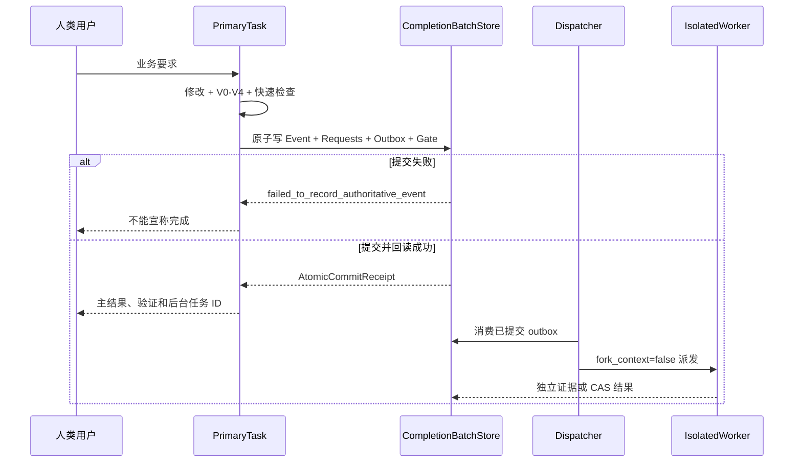

# 数据与存储设计

## 文档控制

| 项目 | 内容 |
|---|---|
| 文档 ID | `DESIGN-DATA-001` |
| 正式版本 | `v1.3.0` |
| 来源候选 | `PK-SOURCE-MIGRATION-001` |
| 发布事务 | `DESIGN-RELEASE-TX-R019-G001` |
| 负责人 | `HUMAN_DATABASE_LEAD` |
| 修改 / 审核 / 批准 | `uroborus` / `uroborus` / `uroborus` |
| 状态 | 已批准并生效 |
| 上游 | `PRD`、`module-domain-design`、`BusinessField` |
| 下游 | `api-design`、`测试`、`迁移任务` |

## 文档职责

- 允许保存：业务对象；数据表或文件模型；字段；约束；索引；事务；迁移；数据生命周期。
- 禁止保存：接口反向定义业务字段；生产数据；任务执行结果。
- 主要读者：架构、后端、数据、测试。

## 正式内容

**项目名称：** 山海工枢 / shanforge
**文档状态：** `v2` 基础设置层详细设计基线
**负责人：** 仓库维护者
**主要读者：** 架构 | 平台开发 | 适配器维护者 | 测试
**上游输入：** PRD | 需求分析 | 系统架构 | 模块边界 | 核心领域与能力清单
**下游输出：** 端口实现 | 适配器实现 | 契约测试 | 实施计划
**关联 ID：** `REQ-001`, `REQ-004`, `REQ-005`, `REQ-006`, `REQ-007`, `REQ-008`, `NFR-001`, `NFR-002`, `NFR-003`, `NFR-004`, `MOD-005`, `MOD-006`, `MOD-007`, `MOD-008`, `MOD-009`, `MOD-010`, `MOD-012`, `MOD-013`, `API-004`, `API-006`, `API-007`, `API-008`, `API-009`, `API-010`, `API-012`, `API-013`
**最后更新：** 2026-04-17

## 1. 目标

本文件只回答 4 个问题：

1. 六层架构里的“基础设置层”到底是什么。
2. 它和“基础能力层”如何明确分开。
3. 当前代码里哪些目录属于基础设置层。
4. 基础设置层应该如何实现上层 provider 接口，并优先复用 Hermes 的成熟实现。

## 2. 正式定义

基础设置层是平台对真实资源、真实系统和真实装配方式的统一实现区。

这里的“设置”不是指业务参数，而是指：

- 文件系统与工作区资源
- 本地持久化与外部数据库
- 模型供应商 SDK 与远程服务
- 远程或遗留外部系统
- 容器装配、实现切换和运行配置

因此，基础设置层不等于基础能力层。

### 2.1 基础能力层和基础设置层的分工

| 层 | 回答的问题 | 当前代码 |
|---|---|---|
| 基础能力层 | “平台对上提供什么统一技术能力” | `src/runtime/` |
| 基础设置层 | “这些能力背后由什么真实资源和实现来支撑” | `src/settings/` |

正式定稿：

- 文件访问、结构化存储、检索、向量、模型调用、规则源、profile 源、审批通道、委派通道属于基础能力层。
- 宿主 Skill 只保存在仓库顶层 `skills/*/SKILL.md`，由代理宿主按需使用；它不是 Shanforge runtime provider，也不进入 settings 装配或持久化。
- 文件系统、外部数据库、provider SDK、Hermes bridge、JSONL store、container 装配属于基础设置层。

## 3. 代码边界

基础设置层现在只有一个正式代码根：`src/settings/`。

层内再按实现领域与支撑模块组织：

| 组别 | 目录 | 作用 |
|---|---|---|
| 模型与 provider | `src/settings/model/` | 模型供应商实现与注册 |
| 持久化与档案 | `src/settings/memory/`、`src/settings/session/` | memory、evidence、dataset、session、artifact、archive 实现 |
| 本地资源与目录 | `src/settings/workspace/` | 工作区与本地源数据实现 |
| 治理与桥接 | `src/settings/approval/`、`src/settings/delegation/`、`src/settings/gateway/`、`src/settings/capability_registry/`、`src/settings/hermes/` | approval、delegation、gateway、registry 与 Hermes bridge |
| 装配与共享支撑 | `src/settings/composition/`、`src/settings/shared/` | settings、container、JSONL 等层内公共基础设施 |

这些都属于基础设置层的层内分域，不是新增层次。

## 4. 设计原则

### 4.1 消费者拥有接口

基础设置层不能拥有上层接口，只能实现它们。

统一规则：

```text
上层声明需要什么；基础设置层负责满足它。
```

因此：

- 接口/网关层拥有应用用例接口，例如 `RuntimeExecutionUseCase`。
- 业务调度层拥有领域服务接口，例如 `MemoryDomainService`。
- 业务模型层拥有对基础能力层的下行接口，例如 `MemoryRecordRepositoryPort`、`CapabilityExecutionPort`。
- 基础能力层拥有对基础设置层的 provider 接口，例如 `LLMProviderPort`、`StructuredStoreProviderPort`、`RuleSourceProviderPort`。
- 基础设置层负责实现 domain-owned 持久化端口和 runtime-owned provider 接口，并完成最终装配。

### 4.2 不承载业务规则

基础设置层不能决定：

- workflow 如何编排
- memory 是否应该晋升
- approval 是否应该放行
- response 如何向业务解释

这些都属于业务调度层或业务模型层。

### 4.3 只返回领域契约或 provider 语义

基础设置层对上只能返回领域对象、协议对象和稳定错误语义，不能直接向上暴露：

- SDK 原始对象
- 数据库游标
- HTTP client 原始响应
- shell 内部执行细节

### 4.4 可替换实现

每个基础设置接口都应支持：

- 至少一个 `in-memory / local` 实现
- 至少一个真实外部或持久化实现

当前仓库已初步做到：

- `in-memory`
- `JSONL-backed`
- `Hermes-backed scaffold`

## 5. 基础设置层实现清单

### 5.1 模型供应商实现

| 能力 | 上层接口 | 当前实现 |
|---|---|---|
| 模型生成 | `LLMProviderPort` | `src/settings/model/mock_provider.py`、`openai_provider.py`、`anthropic_provider.py` |
| 向量生成 | `EmbeddingProviderPort` | `src/settings/model/embedding_provider.py` 的首轮 skeleton，后续再绑定真实 embedding backend |

这里的 provider adapter 属于基础设置层，因为它们封装的是具体 SDK 与供应商差异。

### 5.2 源数据与执行 backend 实现

| 能力 | 上层接口 | 当前实现 |
|---|---|---|
| 规则源 | `RuleSourceProviderPort` | `src/settings/workspace/` 或未来 `src/settings/rules/` |
| profile 源 | `ProfileSourceProviderPort` | `src/settings/workspace/source_provider.py` + `profile_catalog.py` + `backend_catalog.py` + `provider_catalog.py`；支持 workspace `profiles.json`、专门 `backend-bindings.json`、`provider-bindings.json`、profile-specific override 与 default profile |
| web search / document | `WebSearchProviderPort`、`WebDocumentProviderPort` | `src/settings/shared/web_provider.py` 的首轮 local bridge，后续可升格到专门分域或 Hermes-assisted provider |
| 浏览器自动化 | `BrowserAutomationProviderPort` | `src/settings/shared/browser_provider.py` 的首轮 local bridge，后续可升格到专门分域 |
| 审批后端 | `ApprovalBackendPort` | `src/settings/approval/` |
| 委派后端 | `DelegationBackendPort` | `src/settings/delegation/` |
| workspace / shell / git / http | `WorkspaceProviderPort`、`ShellCommandProviderPort`、`GitProviderPort`、`HttpClientProviderPort` | `src/settings/workspace/` 的首轮 local bridge、workspace profile/backend/provider catalogs 与 profile-scoped override，`src/settings/gateway/http_client.py` 的 `file:// + http(s)` JSON transport，以及 `src/settings/gateway/` 的宿主适配 |

### 5.3 持久化实现

| 能力 | 上层接口 | 当前实现 |
|---|---|---|
| 文件系统 | `FileSystemProviderPort` | `src/settings/workspace/` 或未来 `src/settings/file_access/` |
| 结构化存储 | `StructuredStoreProviderPort` | `src/settings/shared/`、`src/settings/session/`、`src/settings/memory/` |
| blob 存储 | `BlobStoreProviderPort` | `src/settings/session/blob_store.py` 的首轮 in-memory skeleton |
| 搜索索引 | `SearchIndexProviderPort` | `src/settings/session/search_index.py` 的稳定入口，当前 archive-backed 实现仍落在 `src/settings/session/archive.py` |
| 向量索引 | `VectorIndexProviderPort` | `src/settings/session/vector_index.py` 的空实现骨架 |

### 5.4 装配实现

| 能力 | 代码位置 | 作用 |
|---|---|---|
| settings layer catalog | `src/settings/catalog.py` | 作为基础设置层功能域、能力清单和模块入口的稳定事实源 |
| runtime settings | `src/settings/composition/settings.py` | 读取环境配置与实现开关 |
| provider manager | `src/settings/composition/provider_manager.py` | 解析 `llm_provider` 的业务选择、provider readiness 与 fallback explainability |
| default container | `src/settings/composition/container.py` | 按配置装配基础能力层与基础设置层 |
| business bindings | `src/settings/composition/component_bindings.py` | 把 `shanforge` 的业务 ID 绑定到本仓真实实现 |
| external DI kernel | `../shanforge-di`（通过 `pyproject.toml` + `uv` 依赖） | 提供注解注册、受控反射、registry、resolver、container 等纯技术能力 |

### 5.5 外部 DI 技术库

为避免把实现选择规则继续写死在 `shanforge` 仓内，基础设置层正式改为依赖外部技术库 `shanforge-di`。该库只负责注册、受控反射与依赖注入；`shanforge` 自己只保留业务绑定与默认容器。

正式目标：

- 让前端、用户配置和 profile 只面向稳定的业务字符串，例如 `provider_id`、`backend_id`、`profile_id`。
- 让 `src/settings/composition/container.py` 收敛为薄装配门面。
- 让 `src/settings/composition/component_bindings.py` 只表达“业务 ID -> 本仓实现”的绑定，不再承载技术内核。
- 让反射加载、实现注册、工厂实例化、生命周期管理和 allowlist 安全边界统一收口在外部 `shanforge-di`。

明确非目标：

- 不让 `shanforge` 仓内重新复制一套 `loader / registry / resolver` 内核。
- 不让 `application / domain / runtime` 普遍直接依赖 `shanforge-di`。
- 不把 `class_path`、`module_path` 暴露给前端、用户入参或业务配置。
- 不用该技术库承载业务编排本身；业务编排仍在各层自己的正式 owner 中完成。

### 5.6 业务字符串与技术字符串边界

基础设置层装配框架必须区分两类字符串：

| 类型 | 例子 | 谁可见 | 规则 |
|---|---|---|---|
| 业务字符串 | `provider_id=\"openai\"`、`backend_id=\"jsonl\"`、`profile_id=\"local-dev\"` | 前端、用户配置、业务层策略对象 | 允许进入上层，但只表达业务选择，不表达 Python 实现细节 |
| 技术字符串 | `module_path`、`class_path`、`callable_path` | 外部 `shanforge-di` 与极薄的本地集成层 | 只允许存在于外部 DI 技术库或其受控集成点中，禁止外露到业务层 |

正式规则：

- 业务层最多保留业务 ID，不接触技术字符串。
- 技术字符串只能由外部 `shanforge-di` 解释。
- 业务 ID 必须稳定，允许底层实现类名和路径变更而不影响上层。

### 5.7 框架结构与运行机制

当前正式结构分成“外部技术内核 + 本地业务绑定”两部分：

| 模块 | 责任 |
|---|---|
| `shanforge-di.decorators/contracts` | 定义组件元数据、依赖引用、生命周期 |
| `shanforge-di.loader/registry/resolver/container` | 提供受控反射、业务名注册、依赖解析与统一门面 |
| `src/settings/composition/component_bindings.py` | 声明 `llm_provider / memory_store / approval_policy / delegation_transport / web_search / web_document / shell_command / git / browser_automation` 等业务绑定 |
| `src/settings/composition/container.py` | 读取 settings、选择业务 ID、把解析结果接成平台对象图 |

推荐运行链：

```text
profile_id / provider_id / backend_id
  -> workspace profile/backend/provider catalogs / env settings
  -> provider_manager resolve(default provider/model + readiness)
  -> component_bindings
  -> shanforge-di registry lookup
  -> shanforge-di reflection / factory instantiate
  -> shanforge-di lifecycle cache(singleton / transient)
  -> container thin wiring
```

### 5.8 生命周期、安全与契约校验

首版正式支持两种生命周期：

- `singleton`
- `transient`

`session` 级生命周期暂不进入首版正式范围。

首版强制安全边界：

- 只允许加载 allowlist 内的模块和对象。
- 禁止 `eval`、`exec` 或用户直接传任意 class path。
- 先校验注册元数据和实例契约，再校验实例是否满足指定接口或构造约束。
- `shanforge-di` 只允许由 `src/settings/composition/` 集成使用。

### 5.9 与现有容器的对接原则

`build_default_container()` 后续按以下原则收敛：

- 继续保留为默认容器入口。
- 不再持有反射 / registry / resolver 技术内核。
- 继续手写创建稳定编排对象，例如 `ExecutionService`、`AgentKernel`、`ContextEngine`、`ResponseNormalizer`、领域服务对象。
- provider、store、Hermes-backed adapter、profile 绑定等实现选择，改由 `component_bindings + shanforge-di` 驱动。

正式定稿：

- `src/settings/composition/` 继续作为 `shanforge` 本地唯一 composition root。
- 当前不新增顶层 `src/composition/`。
- DI 技术内核已外置到独立库 `shanforge-di`，`shanforge` 仓内不再保留同类自研实现。

## 6. 对上服务方式

基础设置层对上的正式服务对象只有一类：

| 服务对象 | 上层角色 | 例子 |
|---|---|---|
| 基础能力层 | 需要 provider、store、source、backend 等真实实现 | `LLMProviderPort`、`StructuredStoreProviderPort`、`RuleSourceProviderPort` |

注意：

- 业务调度层原则上不直接碰基础设置层。
- 业务模型层也不直接触碰基础设置实现。
- 所有真实资源都要先经过基础能力层的 provider 接口收口。
- `shanforge-di` 只允许 composition root 和本地业务绑定层集成使用；业务层和普通 runtime service 不得自行解析实现。

## 7. Hermes 复用策略

Hermes 的复用只允许发生在基础设置层实现区。

### 7.1 复用原则

- 先有 `shanforge` 自己的领域契约和端口。
- 再用 Hermes 的成熟模块去实现这些端口。
- 不能为了复用 Hermes 而反向改写本仓的层边界。

### 7.2 当前映射

| `shanforge` 目标 | 优先复用的 Hermes 位置 | 当前落点 |
|---|---|---|
| 规则 / profile 源适配 | `gateway/session.py`、相关加载逻辑 | `src/settings/workspace/` 及后续分域 |
| 能力注册表适配 | `tools/registry.py`、`model_tools.py` | `src/settings/capability_registry/hermes_registry.py` |
| 审批后端 | `tools/approval.py` | `src/settings/approval/hermes_policy.py` |
| 委派后端 | `tools/delegate_tool.py` | `src/settings/delegation/hermes_transport.py` |
| 外部桥接适配 | `gateway/platforms/base.py`、`gateway/session_context.py` | `src/settings/gateway/`、`src/settings/hermes/` |

### 7.3 明确禁止

禁止把 Hermes 的以下内容直接拉进上层：

- 顶层 agent loop
- 产品级 prompt 拼装
- Hermes 私有 session 协议
- 任何要求上层直接持有 Hermes 内部对象的路径

### 7.4 当前已落地的 Hermes adapter 契约收口

- `capability_registry / approval_policy / delegation_transport` 的 Hermes-backed adapter 已补统一 `contract_metadata()`，至少暴露 `bridge_modules`、`bridge_repo_root`、`contract_ready` 与 `fallback_class`
- 默认容器现会先合并 workspace `backend-bindings.json`、profile-specific backend override 与 legacy settings fallback，再把 governance adapter 的实际选择写入 `backend_ids`
- 默认容器现也会先合并 workspace `provider-bindings.json`、profile-specific provider override 与 legacy settings fallback，再由 `provider_manager` 选择“当前可运行的默认 provider/model”
- `SessionAssemblyManifest.backend_bindings` 现在不只记录 `llm_provider / memory_store`，也会投影 `capability_registry / approval_policy / delegation_transport` 的绑定、`binding_source / source_path` 这类来源元数据，以及 `requested_binding_id` 导致的 fallback 解释
- `SessionAssemblyManifest.selected_model` 当前保持 session-start 默认装配选择；实际 prompt step 调用轨迹继续落在 `model_bindings`
- 默认容器现也会把 `memory_provider` 纳入 `backend-bindings.json` 治理来源，通过 `src/runtime/memory/provider_manager.py` 协调 single external provider；`SessionAssemblyManifest` 会冻结 `memory_provider_binding`，session context 会注入带显式 fence 的 `external_memory_recall_block`
- `src/settings/memory/provider.py` 现已提供 `memory_provider:jsonl / jsonl_vector / remote_http`；其中 `jsonl / jsonl_vector` 把 provider-owned snapshot / turn / digest state 落到 profile-scoped JSONL root，`jsonl_vector` 会基于 `RecallQuery.query_text` 做 provider-owned rank/prefetch，`remote_http` 则通过 settings-layer `http_client` 的 `file:// + http(s)` JSON transport 拉取远端 recall block/hits，并支持 `request_headers / bearer_token(_env|_file) / signature_secret(_env|_file) / signature_key_id / retry_status_codes / max_retries / timeout_seconds`、`method + path + query + body_sha256 + timestamp` 的 canonical `hmac-sha256` 签名串、内建 `remote_memory_prefetch_v1 / remote_memory_writeback_ack_v1` response contract 投影，以及由 `src/settings/workspace/secret_catalog.py` 统一承载的 durable secret governance provider；该 provider 负责 `secret_catalog_file` 的加载、相对路径解析、`default_signature_key_id / signature_keys / default_bearer_token_id / bearer_tokens` 的 key rotation 选择、selection-source audit，以及 metadata-only secret id fallback。与此同时，`src/settings/memory/remote_http_metadata.py` 新增 `RemoteHttpMetadataResolver + RemoteHttpRequestGovernance`，把 `recall_endpoint_url / sync_endpoint_url / session_end_endpoint_url / delegation_endpoint_url`、`recall_response_contract / sync_response_contract / session_end_response_contract / delegation_response_contract`、`recall_response_validation / sync_response_validation / session_end_response_validation / delegation_response_validation`、`sync_failure_policy / session_end_failure_policy / delegation_failure_policy`、canonical `bearer_token*` 键，以及 legacy `endpoint_url / prefetch_response_contract / writeback_response_contract / prefetch_response_validation / writeback_response_validation / writeback_failure_policy / auth_bearer_token*` alias fallback，统一投影为 provider 可直接消费的 request governance 读模型。当前 `jsonl / jsonl_vector / remote_http` 也已对齐一组共有 explainability 诊断：`query_terms / source_breakdown / result_truncated / budget_trace / rank_trace / hit_provenance / contract_trace / access_trace / writeback_trace`；`src/runtime/memory/provider_manager.py` 与 `src/domain/memory/service.py` 现会共用 `src/domain/memory/augmentation_diagnostics.py` 的 trace-first normalizer，但 runtime provider manager 自身已在输出侧直接压成 compact canonical diagnostics，不再主动平铺 `bridge_kind / retrieval_kind / endpoint_url / response_contract / attempt_count / writeback_enabled / writeback_reports` 这类 legacy 顶层键；这些 alias 仅在读取冻结的 legacy diagnostics 时作为 normalize 输入兼容，而 `DefaultMemoryDomainService` 的 stored replay 过滤也已收口到同一模块的 `project_stored_augmentation_diagnostics()`，不再在 service 内部硬编码一份独立 `allowed_keys`。同时，stored replay 现会基于 `memory_provider_binding.provider_id` 推断默认 `bridge_kind / provider_kind / storage_kind / retrieval_kind / response_contract / response_contract_source`，并基于 `memory_provider_binding.metadata.recall_endpoint_url` 恢复 remote access 默认值，所以这组 legacy 顶层键已不再需要继续保留在 replay 输入白名单里。与此同时，`prepare_session / distill_session / _refresh_session_assembly_manifest()` 已把 session/context 与 manifest diagnostics 的落盘口径压成 compact trace-first 版本，而 `preview_recall()` 现已完全只暴露 canonical trace-first 诊断，不再输出 `legacy_aliases`。当前 transport auth、retry/timeout、secret selection 与 catalog source 已统一进入 `access_trace`，prefetch `response_validation_error` 已进入 `contract_trace`，writeback 的 `successes / response_oks / response_statuses / response_messages / response_report_ids / failure_policies / response_validation_errors` 摘要则进入 `writeback_trace`，而 `detail_reports` 已成为 canonical drill-down 字段，仅在存在实际写回明细时才保留；旧的 `reports` 只作为 replay/normalize 输入兼容；`budget_trace` 现继续承载 `selected_hit_count / selected_hit_ids / query_text_present`，`writeback_reports` 则仍稳定回读 `request_kind / response_ok / response_status / response_message / response_report_id` 等细节。
- workspace `backend_binding_metadata` 现还支持 `metadata_file`，把远端 endpoint、secret source 和 failure policy 从主 catalog 内联 JSON 提升成更稳定的 settings source；`metadata_file` 中的相对 `*_file` 路径会按源文件目录解析成稳定绝对路径
- 对应契约测试已落在 `tests/test_composition_container.py`、`tests/test_composition_resolver.py`、`tests/test_infrastructure_scaffold.py`、`tests/test_platform_scaffold.py`

## 8. 下一批基础设置工作

下一轮基础设置层优先补齐：

- 外部数据库或更稳定本地持久化实现
- 把 `workspace / file / git / shell` 的 local bridge 扩成 profile 化、可远端化的正式 backend
- 把 `web_search / web_document / browser_automation` 从首轮 local bridge 扩成更稳定的专门实现
- gateway 的真实多宿主适配
- 在已落地 `none / in_memory / jsonl / jsonl_vector / remote_http` 的基础上，继续把 budget/rank explainability 统一到跨 backend 语义，并继续减少 provider-specific 诊断字段碎片
- 与 `shanforge-di` 的 profile / source / contract 对齐
- 让 `container.py` 继续保持只做薄装配和对象接线的 composition root

## 9. 一句话定稿

基础设置层的正式定义是：

```text
为平台提供文件、数据库、provider、外部系统和装配实现的统一实现区。
```

当前代码中：

- `src/settings/` 是基础设置层唯一正式代码根
- `src/settings/` 内部按实现领域和支撑模块分域
- `src/settings/composition/` 负责 settings、container、本地业务绑定与唯一 composition root
- `shanforge-di` 负责外部反射 / registry / resolver / lifecycle 等纯技术内核

基础设置层只服务于基础能力层和上层声明的端口，不反向主导业务调度层和业务模型层。

---

## 10. Artifact Registry、存储分层与处置

目录表达职责归属，存储层表达字节资格，Artifact Registry 表达事实身份。当前项目只采用三层；外部持久存储是受控 N/A，不是发布、验证或回滚前置。

### 10.1 三层存储

| 层 | 保存什么 | 禁止保存什么 | 生命周期 |
|---|---|---|---|
| L1-GIT-AUTHORITATIVE | 正式文档、源码、测试、稳定 Builder、小型 TaskCard/Ledger、最终 Review/Human Decision、发布事件和 hash | 完整 Catalog、原始长日志、重复候选、压缩或编码 payload、会话全文 | 由正式版本和 Git 历史治理；自动 TTL 不改写历史 |
| L2-TASK-TEMPORARY | 当前任务候选、原始 Evidence、Review 过程材料、影响报告和待处置前像 | 当前正式事实、没有 TaskCard 的讨论稿、无期限大型副本 | 原始 Evidence/Review 过程材料自当前有效 completed/cancelled 事件起 PT168H；候选按终态即时处置 |
| L3-EPHEMERAL-BUILD | 完整 Catalog、隔离重建输出、变异、失败模拟和 staged after-image | 唯一事实副本、跨会话依据、正式版本 | 单次验证结束立即删除；崩溃残留由独立清理任务处置 |

外部持久存储的适用性为 N/A；受控决定记录必须恰好使用正式 PRD 的八个字段，不能用技术实现字段替换：

| 字段 | 当前批准值 |
|---|---|
| scope | 当前项目的大型候选、原始证据和可重建完整机器目录 |
| reason | 上述产物均可按期删除或由受控输入确定性重建，不需要长期持久化提供方 |
| risk | 错误分类为可删除或可重建会导致诊断材料或不可重建事实丢失 |
| alternative | Git 保存权威小记录和重建合同；临时区保存活跃候选和原始材料；TTL、引用和 legal hold Gate 控制删除 |
| approved_by | uroborus（人类） |
| approved_candidate_hash | 70e88752afd13e3aa3c3c8cec713531cb9a3370e001e224793c973ab7e7dfdfd |
| review_trigger | 出现 legal hold、不可重建业务事实、跨机器共享、灾难恢复需求或重建验证失败 |
| exit_trigger | 任一 review_trigger 经需求影响分析确认需要持久存储，并取得新的人工计划批准 |

八字段缺一项即阻断发布。只有 review_trigger 命中并完成需求影响分析与新的人工批准，才退出 N/A；AI 不得自行安装、配置或恢复外部持久存储前提。

### 10.2 十七类 Artifact 的默认资格

项目身份、正式文档、源码、测试、发布决定和最小 Ledger 属于 L1。Draft、原始 Evidence、Review 过程材料、Generated 和待处置 Archive 属于 L2。完整 Catalog 和 Build 物化属于 L3。最终 Review/Human Decision 虽由 Review 流程产生，但其资格是 L1 追加事件；不能因为过程材料到期而删除最终决定。

每类必须登记：class_id、allowed/prohibited content、fact domain、owner、默认层、状态机、保留 Profile、transition_refs、legal hold、活动引用和处置证据。解析出多个 owner、未登记层、缺生效事件或 unknown class 时拒绝消费。

### 10.3 原始证据和评审材料 PT168H

raw_evidence 与 review_process_material 的时钟从 TaskCard 当前有效 completed 或 cancelled 事件开始，使用带时区 ISO 8601 和半开区间 [start, start+PT168H)。到期前不得删，恰好到期可以申请删除，到期后可重试。任务重开会追加新事件、撤销未执行清理并从新的有效终态重算；旧事件不能原位修改。

最终 Review Decision、Human Decision、TaskCard、最小 Ledger、正式 hash、released/release_failed、纠正链和 ReleaseTransaction 最小结果没有 TTL 自动删除。legal hold 优先于全部自动清理；hold 解除后重新读取 generation，不使用旧判断。

### 10.4 候选即时处置真值表

| 对象状态 | 活动引用 | legal hold | 其他条件 | 结果 |
|---|---:|---:|---|---|
| selected | 任意 | 任意 | released、正式后像 hash 回读、发布清单可读三条件未齐 | 保留，拒绝清理 |
| selected | 0 | 无 | 三条件齐全且 generation 未漂移 | compare-and-delete，立即删除 |
| rejected/abandoned/cancelled | 大于 0 | 无 | 引用尚未替换 | 保留并登记引用影响 |
| rejected/abandoned/cancelled | 0 | 有 | hold 生效 | 保留 |
| rejected/abandoned/cancelled | 0 | 无 | generation 未漂移 | compare-and-delete，立即删除 |
| 任意 | 任意 | 任意 | 删除结果未知 | reconcile 字节、hash 和幂等键，禁止盲重放 |

compare-and-delete 固定比较 artifact_generation、active_reference_generation、legal_hold_generation、policy_generation 和 expected_sha256。删除失败不改写主交付结果；released 后失败进入 cleanup_pending，released 前失败进入发布回滚状态。

### 10.5 Catalog 紧凑源与临时完整输出

R019 发布 manifest 已归档到 WorkItem evidence；当前紧凑机器源是 `.factory/catalog/ai-sdlc-catalog.source.json`，稳定生成器是 `tools/ai-sdlc-catalog/build.mjs`。完整 JSONL 只在 L3 生成，用完立即删除。

CatalogSemanticInputBudget/v1 同时计算整个 source 和 Builder output-related literal：统一字节不超过 min(2,097,152, R016 oracle 输出字节的 35%)，统一叶数不超过 oracle 的 35%，source_records 不超过 1,024，direct-copy/constant 输出叶不超过 15%，derived 输出叶至少 65%。constant_registry 不超过 512 值且单值不超过 128 字节；fixed_parameters 不超过 256 scalar/16,384 字节；Builder literal 不超过 256/16,384 字节。

### 10.6 独立清理任务

ArtifactDispositionTask、MemoryProjectionTask 和 ProjectProgressProjectionTask 均使用独立 task ID、fork_context=false、最小 read/write set 和 outbox，不加载主任务原始上下文。登记请求属于主任务原子完成批次；worker 失败只能报告 cleanup_pending 或 projection_lag，不能把已完成主交付改回进行中。

RegressionTask 也与主上下文隔离，但不是普通投影：它不阻塞无依赖工作和会话响应，却必须阻止正式 docs、released、候选清理、TaskCard 关闭及 Git/远端动作，直到五字段 Gate CAS 进入 verification_ready。

### 10.7 Git 对象门

Gate 冻结 baseline commit、主对象库/alternates、全部 OID/type/size、index 和 worktree。验证同时扫描任务写集、untracked、index/staged、commit range，以及任务期间新增的 reachable/unreachable blob。改扩展名、压缩、先 add 后 reset、删除工作树文件或制造 dangling object 都不能绕过。

本轮基线为 commit 8539c7cdc9cdd19bb2e5c196eb99ec4b3266ab96、10,700 个对象和 docs 68/17。任何不可解释对象、需求、目录、Workflow 数或产品代码变化都阻断候选或正式化。

## 22. WP-07 交付拓扑、纵向切片与 BusinessField 追踪

### 22.1 树负责归属，边负责矩阵关系

目录和导航必须是一棵树，否则人和 AI 都难以确定唯一 owner；软件关系本身是矩阵，不能靠复制目录表达。`TOPOLOGY-DELIVERABLE-001` 因此同时定义：

1. 每个 DeliverableNode 只有一个 `canonical_parent_node_id`，用于导航、owner、路径和版本归属。
2. 产品表面消费服务、服务实现领域、模块实现领域、模块参与切片等多对多关系使用类型化 DependencyEdge，不复制节点或文档。
3. Project → Product Surface → Service → Domain → Module → Vertical Slice → Task 是端到端业务路径的类型链，不强制把同一服务复制到每个前端目录下。

Project 可直接拥有产品表面、服务、领域、纵向切片和横向基线；产品表面拥有前端模块，服务拥有后端模块，领域可拥有纯领域模块，纵向切片拥有 TaskCard。所有跨树关系通过 `consumes/realizes/implements/contributes_to/decomposes_to/depends_on/shares_baseline/publishes_contract/owns_data/verifies` 等边表达。

DeliverableNode 只保存所有节点共有字段，不能代替类型详情。`typed_detail_binding_contract` 要求每个 ProductSurface、Service、Module、VerticalSlice、Task 和 HorizontalBaseline 节点恰好解析到一个同 ID、同类型的 detail 记录；反向也要求每个 detail 恰好对应一个现存节点。缺 detail 只允许一个绑定该 node ID、含原因、影响、替代方案、owner 和 ReviewerDecision 的结构化 N/A。每个 `na_id` 必须唯一，每条 N/A 必须被恰好一个适用节点消费，且该节点不能同时存在 detail；整体省略、重复、孤立、ID/类型错配、未被节点消费或与 detail 并存都拒绝。

### 22.2 领域和模块不是固定上下级

Domain 是业务语义、术语、不变量和所有权边界，不等于代码目录、微服务或前端工程。Module 是某个产品表面、服务或领域中的实现单元，必须引用一个主领域，可通过受控引用关联次领域。

- 后端模块说明所属服务、主领域、职责、不变量、应用用例、接口 owner、依赖、数据所有权、错误和测试边界。
- 前端模块说明所属产品表面、主领域、业务能力、页面/路由、组件边界、状态来源、API 契约、共享策略和测试边界。
- 共享模块使用结构化创建契约，必须已有至少两个登记消费者、稳定契约引用、owner assignment 和版本策略引用；“以后可能复用”不足以创建共享层。
- 跨模块调用必须使用受控接口；共享数据库列或隐式全局状态不能充当接口。

因此后端和前端都分模块，但分法不同：后端围绕领域、用例、服务和适配器；前端先按产品表面，再按业务能力/领域组织页面、状态和组件。

### 22.3 产品表面和服务分别登记

Web、移动 App、小程序、每个管理后台和 CLI 都是独立 ProductSurface；多个管理后台必须使用不同稳定 ID、受众、权限、页面能力、构建和验收。后端服务、API 服务、网关、worker、定时任务和集成适配器都是独立 Service，分别登记职责、领域、模块、数据 owner、接口、依赖、部署、监控、恢复和发布状态。五类产品表面、六类服务和第二个管理后台都必须有可执行登记正例；未知 subtype 必须拒绝。

每个产品表面和服务可以独立设计、计划、实现、测试和发布，同时通过 BusinessField、API、权限、设计系统和纵向切片保持共同需求一致。最终交付报告必须按这些节点分别列完成、未完成、验证、版本和发布状态。

### 22.4 任务以纵向业务切片为主

VerticalSlice 从用户或业务结果开始，贯通 Requirement、UX、UI、ProductSurface、API、Application、Domain、Database、Permission、Test 和 Release。先创建可独立验收的切片，再在同一 TaskCard 的 ActionSpec 中安排数据库、接口、前端、多端、测试、文档和发布动作。

禁止先建立“全部数据库任务”“全部 API 任务”“全部 UI 任务”三棵互不验收的树。读文件、运行命令、写测试和记录 evidence 是 Action，不单独创建 TaskCard。P0/P1 切片的适用层必须完整；N/A 需保存层、原因、替代验证、Reviewer 决定和当前 subject hash。

任务目录按 `WorkItem → VerticalSlice/TaskCard → drafts/evidence/reviews/reports` 归属，不按数据库/API/UI 建业务任务目录。产品源码仍可按真实前端表面和后端服务建立模块目录，但每个模块必须反向引用 `module_id/domain_id/slice_id`。

### 22.5 横向基线与全局文档关系

横向基线包含项目、领域、架构、数据、API、UI 设计系统、质量、安全隐私和发布运维。它们服务多个纵向切片，不被复制进每个模块目录。基线变更可以有独立 TaskCard，但必须生成 BaselineImpact，列出受影响产品表面、服务、领域、模块、切片、BusinessField、失效 Artifact 和必需任务。

正式 `docs/` 只保留登记 owner 的最小文档；全局文档通过 Catalog ID、Requirement ID、Domain/Module ID、Slice ID 和 BusinessField ID 与具体模块设计关联。讨论不能为了表达一个矩阵关系就新增 Markdown；完整拓扑和关系矩阵以机器 Catalog 为唯一事实源，Markdown 只解释阅读方式和关键取舍。

### 22.6 BusinessField 唯一规范定义

`FIELD-TRACE-BUSINESS-001` 要求每个 BusinessField 保存稳定 ID、业务名称和含义、owner、需求、规范类型、格式/单位/精度、枚举、可空、默认、来源、敏感级别、生命周期、校验、权限、各层映射、变更历史和证据。技术名称可以不同，但必须引用同一 BusinessField ID。

必需追踪层为：Requirement、Domain、Database、API/Event、UI、Validation、Permission、Log/Audit、Test。兼容校验必须从每层真实 `technical_type`、必填/可空值、owner Artifact、默认、约束、权限和 validation refs 推导规范值，再和 BusinessField 比较；`normalized_contract` 只是非权威派生摘要，不能掩盖实际字段漂移。数据库结构不能反向定义公共 API 语义，UI 标签也不能代替业务含义。

### 22.7 字段变更和 TraceBreak

字段新增、删除、改名、改类型、改枚举、改权限或改敏感级别时生成 BusinessFieldImpact。七类 change kind 分别使用封闭影响集合，ImpactList 强制绑定旧/新 contract hash、受影响映射和 Artifact、失效批准、任务、迁移/兼容、Review 和验证；删除任一必填字段都必须失败。稳定 BusinessField ID 在技术改名时不变。

缺映射、含义漂移、类型/可空/默认/枚举不一致、校验变弱、权限扩大、敏感级别丢失、日志脱敏缺失、测试缺失或未经评审的 N/A 都形成 TraceBreak。P0/P1 进入实现前，未解释或无 owner TraceBreak 必须为 0。

### 22.8 完整字段链参考

CP-03 使用 `BF-HIGH-RISK-AUTH-VALID-UNTIL-001` 作为完整参考链：

| 层 | 映射 | 必须保持的语义 |
|---|---|---|
| Requirement | 高风险/PR 授权有效期 | 每次人类明确授权，严格晚于求值时刻 |
| Domain | `HumanAuthorization.validUntil` / `OffsetDateTime` | 必填、明确时区、不能由 AI 生成 |
| Database | `human_authorization.valid_until` / 带时区时间戳 | NOT NULL，晚于授权时间，支持活动未消费授权查询 |
| API | `valid_until` / `string date-time` | 必填，拒绝无时区和可解析但非 ISO 值 |
| UI | “授权有效期”时区感知输入/只读显示 | 人类批准前可编辑，授权后只读，显示时区和过期状态 |
| Validation | `parseStrictTimezoneIso8601` | 合法日历、偏移不超过 14:00、精确解析、未来比较 |
| Permission | `HUMAN_APPROVER.write_valid_until` | 只有有效人类批准人可写，AI 只能读取候选决定 |
| Log/Audit | 授权过期求值事件 | 追加授权 ID、求值时刻、结果和 hash，不记录 secret |
| Test | high-risk authorization 边界矩阵 | 未来 ISO 允许；过期等待；非 ISO、无时区、非法日期/偏移拒绝 |

该参考链是运行时实现的设计契约，不冒充当前已经存在数据库或 UI；它证明同一字段如何在未来实现中保持一致，并直接复用 CP-02 R005 的严格时间对抗测试。

### 22.9 覆盖闭合与 CP-03

WP-07 同步核对前序覆盖，发现 WP-04 至 WP-06 的需求覆盖仍保留占位或 deferred 状态。43 条 WP-04 至 WP-07 覆盖现已逐项指向真实 metadata、Method、ToolPolicy、ResponseTemplate、Topology 或 FieldTrace 对象；能力缺口保留“已登记人工 owner”语义，不伪称专业 Skill 已实现。

CP-03 R001 独立评审发现 3 Critical、6 Important、1 Minor，结论为 `changes_requested / 30`。第 1 轮整改要求：裸布尔权限自证、跨工具 PR 授权、伪造 normalized 字段、通用 Skill/Prompt、回复假报、拓扑/影响 schema 清空和 stdout 截断都必须有真实负例。完整 `cp03@0.3.0`、受影响 `cp02`、WP-05/WP-06 阶段和输出管道验证全部通过后，才能冻结 R002 并由同一 Reviewer Russell 只读复审。作者 Green 不等于 CP-03 或 CP-02 恢复通过，当前也没有人工设计批准或正式发布资格。

R002 复审关闭了 6 项，仍以 `changes_requested / 58` 保留 `CP03-C-001`、`CP03-I-003`、`CP03-I-004`、`CP03-M-001`，CP-02 R006 当前候选影响也因同一来源根问题退回。第 2 轮整改增加外部 TrustAnchorRegistry 和来源根 attestation、真实 Artifact/Verification ReferenceRegistry、拓扑节点与 typed-detail 双向一一绑定，并把状态证据更新到当前轮次。R003 是本检查点最后一个自动复审候选；若同一 Reviewer 再次退回，必须停止交人工决定。作者 Green、R003 冻结或 CP-02 R007 影响快照都不等于 Reviewer approved、人工设计批准或正式发布。

R003 最终自动复审为 `changes_requested / 64`，关闭 `CP03-M-001`，仍开放来源登记同调用边界、引用登记/退出码结果不一致和孤立 Reviewer N/A 三项。R004 定向整改把三项全部关闭，同一 Reviewer Russell 给出 `approved / 100`，CP-02 R008 当前候选影响也通过；用户随后确认关闭 CP-03 并授权执行 WP-08 到下一人工确认门。

## 27. R015 主任务、系统侧派生任务与风险分级验证完整设计

### 27.1 输入、目标和继承关系

R015 章节保留主任务、系统侧派生任务和风险分级验证的有效设计语义；其旧输入版本和归档候选只属历史前像。R017 当前权威输入统一取第 2.1 节冻结的 PRD v3.3.0、需求矩阵 v3.3.0、文档索引 v1.3.0、P017 R004 和 WP-RB-01 基线闭包，任何旧发布资格不得恢复。

本节在同一完整设计中补齐 `GAP-AI-013`，不创建同义 Workflow。Workflow 总数保持 123；为 `WF-CTL-001`、`WF-CTL-010`、`WF-PLAN-003`、`WF-QA-001..013`、`WF-DEL-001`、`WF-DEL-008` 共 18 条现有 Workflow 增加异步执行合同。机器 Catalog 必须展开 18 个实际 ID，不允许只保存范围字符串。机器定义位于 `TOP-SPEC-WORK-SESSION-001/primary_task_async_boundary_contract`。

### 27.2 同步主任务边界

主任务同步链只有四段：业务动作、V 等级要求的快速前置检查、构造完成批次、原子提交并回读。`PrimaryTaskCompletionBatch/v1` 在同一事务中写入：

1. 一条不可变 `AuthoritativeEvent/v1`；
2. 零到多条预生成 task ID 的 `DurableTaskRequest/v1`；
3. 与每个请求一一对应的 `DispatchOutbox/v1`；
4. 当前父任务的 `VerificationGate/v1`。

事务隔离至少达到串行化或单写者等价语义。提交前外部观察不到任何对象；提交后四类对象全部可见。提交回读必须逐项核对 batch ID、task ID、artifact hash、Gate generation 和幂等键。失败时返回 `failed_to_record_authoritative_event`，不得宣称主结果已登记，不得返回虚假后台 task ID，也不得留下只有事件或只有 Gate 的半状态。事务成功后主会话立即组装回复，不等待 dispatcher 或 worker。



### 27.3 数据对象、约束和幂等

| 对象 | 主键/唯一键 | 关键字段 | 不变量 |
|---|---|---|---|
| `AuthoritativeEvent/v1` | `event_id`；项目内 `sequence` 唯一 | project、parent task、artifact refs/hash、verification summary、occurred_at | 只追加，不被投影覆盖 |
| `DurableTaskRequest/v1` | `task_id`；`idempotency_key` 唯一 | kind、parent IDs、source range/head、read/write set、target Gate | 必须与 event 同批提交 |
| `DispatchOutbox/v1` | `outbox_id`；request 一一对应 | request ID、attempt、next_at、dispatch status | 只有已提交记录可派发 |
| `VerificationGate/v1` | parent task + gate ID | artifact hash、test plan hash、generation、state | CAS 全匹配才转换 |
| `SystemSideTask/v1` | `task_id` | requested/current head、aliases、retry、evidence | 不继承聊天和高风险授权，不计产品进度 |

同一项目、同一投影类型且尚未开始的任务可以按 `coalesce_key` 合并。`requested_head` 保留首次值，`current_target_head` 只允许单调增加；旧幂等键成为 alias 并解析到同一个存续 task ID。被合并请求进入不可执行终态 `merged_into_survivor`，必须保存 `merged_into_task_id`，不能重新进入 queued；只有存续任务继续执行。任务开始后不得就地扩大读写集，只能创建后继任务。重试只追加 attempt；超过阈值进入 `dead_letter` 并在系统维护队列可见，不能退回主会话同步执行。

### 27.4 上下文、权限和完成率隔离

系统侧任务固定 `fork_context=false`，父聊天消息数为 0。交接信封不超过 8 KiB，只包含 project/task ID、artifact hash、source event range、最小 read/write set、策略版本和引用；不得复制父聊天、原始事件正文、无关文件或父工具日志。投影 worker 只能写登记的投影路径/表，回归 worker 默认只读代码并写验证证据。两者都不得继承 Commit、Push、PR、Merge、部署或数据破坏授权。

系统侧任务是可追踪任务，但 `product_progress_denominator_contribution=0`、`product_progress_completed_contribution=0`。记忆/进度失败不改变主任务业务状态；RegressionTask 只可改变验证 Gate。看板把它们放入独立“系统维护/验证队列”，不污染 WBS、里程碑、燃尽或产品完成率。

### 27.5 进度快查的 H/P 算法

查询开始原子捕获项目和权威头 `H`，随后读取投影头 `P`。基础快照必须完整绑定项目、事件 hash 链、来源注册表、事件 schema、reducer、投影 schema、基础内容 hash 和可逆贡献谱系。

```text
if P == H and project/hash-chain/registry/schema/reducer/content/lineage bindings all validate:
    return validated persisted snapshot
if P < H and bindings compatible:
    freeze events (P, H]
    if count <= 1000 and encoded_bytes <= 8 MiB and reducer_time <= 3000 ms:
        apply the same pure versioned reducer read-only
        verify result hashes; return ProjectProgressSnapshot/v2(persisted=false, as_of_H=H)
    return projection_lag_exceeds_query_budget
if registry/schema/reducer version or hash drifted:
    enqueue isolated rebuild task; return projection_rebuild_required
if correction targets contribution <= P and reversible lineage is absent:
    enqueue isolated rebuild task; return projection_rebuild_required
if P > H or project mismatches or hash-chain is corrupt or snapshot/increment is incomplete:
    return data_not_ready_or_fact_conflict
```

捕获 `H` 后到达的 `H+1` 不进入本次结果。`P > H`、项目不符、hash 链损坏、快照缺失或增量不完整返回 `data_not_ready_or_fact_conflict`；registry/schema/reducer 漂移或无法撤销的旧贡献返回 `projection_rebuild_required` 并入队独立重建任务。两类原因码不得互换。查询可以入队追平任务，但不能等待它，也不能在查询会话持久化临时叠加。

### 27.6 会话恢复的 H/M 算法

恢复时原子捕获记忆头 `M` 和权威头 `H`，并验证与持久化记忆投影相同的纯函数 reducer 及全部兼容字段。`M=H` 验证通过后产生紧凑上下文且无需因滞后创建任务；只要 `M<H`，无论是否在快速预算内，都先新建或合并独立 `MemoryProjectionTask`，并在回复中返回已持久化 task ID。预算只决定本轮能否同时返回临时上下文：最多 200 条、1 MiB、1,000 ms 且输出不超过 8 KiB 时返回 `MemoryRecoveryContext/v1`；201 条、超过 1 MiB、超过 1,000 ms 或输出超过 8 KiB 时返回 `memory_recovery_not_ready/tail_budget_exceeded`。该投影任务不阻塞回复。`M>H`、hash 损坏或兼容漂移返回 `incompatible_or_corrupt_base`。

恢复会话从不重写记忆、不无界读取尾部、不把旧摘要伪装成当前事实。捕获 `H` 后的事件留给下次恢复。

### 27.7 V0-V4 确定性分类

`ImpactClassificationDecision/v1` 输入是语义 diff、公共契约、依赖闭包、持久化/迁移/事务/并发、安全边界、构建/启动/DI/发布全局影响及可逆性。版本化规则取所有命中项的最高级；代码行数和预计耗时都不是等级输入。

| 等级 | 最低语义边界 | 发布前范围 | 全仓 |
|---|---|---|---|
| V0 | 无行为变化 | 格式、解析、链接和范围检查 | 禁止自动执行 |
| V1 | 私有局部、契约/数据/安全不变 | 定向 + 最近模块 | 禁止自动执行 |
| V2 | 可界定受影响域 | 依赖闭包 + 集成/冒烟 | 不执行 |
| V3 | 公共契约、数据、安全或跨边界但子系统可界定 | 全部受影响子系统及跨边界路径 | 不执行 |
| V4 | 系统级、不可界定、根工具链/启动/发布基础设施、不可逆数据或全局安全边界 | 全仓 + 适用 E2E/安全/迁移/发布检查 | 必须 |

主会话快速预算默认 60 秒。超过预算只把必需测试转成 RegressionTask，不改变 V 等级。人类可提高等级；降低最低等级必须形成有主体、理由、范围、有效期和残余风险的人工风险接受，AI 无权自行降低。

### 27.8 RegressionTask 与 Gate CAS

RegressionTask 输入只含变更包、artifact hash、影响图、VerificationPlan hash 和环境引用。结果枚举固定为 `passed | test_failed | infra_failed | timed_out | cancelled | superseded | incomplete_required_tests`，派发结果与测试结果分开保存。

Gate 更新必须比较 `parent_task_id + gate_id + artifact_hash + test_plan_hash + gate_generation`。只有五项全部匹配、结果为 `passed`、必需测试完整且 skipped/not-run 都为 0，才能从 `verification_pending` 直接推进为 verified。五项匹配且真实测试失败时从 pending 进入 `verification_failed`；基础设施失败、超时、取消或必需测试不完整执行 pending 自保持。任何五元组不匹配的晚到结果只追加 `superseded` 结果证据，当前 Gate 不发生任何转换，状态和 generation 都保持不变。

### 27.9 证据复用与严格失效

`EvidenceReuseKey/v1` 必须逐项绑定：`gate_id`、`artifact_or_candidate_root_sha256`、`impact_policy_version`、`test_selection_plan_sha256`、`required_test_set_sha256`、`test_source_sha256`、`fixture_sha256`、`config_sha256`、`runner_name`、`runner_version`、`runner_sha256`、`dependency_lock_sha256`、`normalized_command`、`environment_attestation_sha256`、`external_dependency_fingerprint`、`passed_count`、`failed_count`、`skipped_count`、`not_run_count`、`evidence_time`。前 15 项也是执行前 `EvidenceExecutionIdentity/v1` 的精确字段集合和固定顺序，按 compact canonical JSON 加 domain separator `shanforge:EvidenceExecutionIdentity/v1\n` 计算 identity hash。任一字段缺失、不可验证、改变或超过 Gate 新鲜度都强制失效，不存在“兼容即可”的第二放行路径。进入发布不自动重跑全仓，只核对制品、必需证据、环境前置和发布专属检查；失效后只重跑对应风险范围，除非当前等级为 V4。

### 27.10 十八条既有 Workflow 的职责变化

| Workflow | R015 新职责 | 不允许发生 |
|---|---|---|
| `WF-CTL-001` | H/M 恢复；任何 M<H 都入队或合并记忆投影，预算内同时返回临时上下文 | 同步重写记忆、无界读尾部或只在超预算时才入队 |
| `WF-CTL-010` | H/P 准确查询、预算内只读叠加、显式滞后状态 | 把 P<H 旧快照标为最新 |
| `WF-PLAN-003` | TaskCard、依赖和并行图；登记 ProjectionTask/RegressionTask、blocking scope、合并和背压 | 抢占 QA-001 的 V0-V4 owner |
| `WF-QA-001` | 测试设计和风险分级；生成 V0-V4、前置检查、发布必需测试和复用决定 | 用行数/耗时降级 |
| `WF-QA-002` | 按计划执行单元测试、边界和不变量 | 无依据扩大到全仓 |
| `WF-QA-003` | 按计划执行模块/数据库/外部边界和失败恢复集成测试 | 跳过已识别事务边界 |
| `WF-QA-004` | 按计划执行请求响应、事件、schema 和版本兼容测试 | 契约变化仍按局部私有变更处理 |
| `WF-QA-005` | 按计划执行组件和前端交互测试 | 忽略状态、权限、语义或焦点 |
| `WF-QA-006` | 按计划执行 E2E 和关键用户旅程 | V0-V3 无依据全量 E2E |
| `WF-QA-007` | 按计划执行可访问性、视觉和响应式测试 | 跳过适用视口或视觉回归 |
| `WF-QA-008` | 按冻结协议执行性能、负载和可靠性测试 | 丢弃失败样本或错误计算 P95 |
| `WF-QA-009` | 按威胁模型执行安全和隐私测试 | 安全边界变化仍无安全验证 |
| `WF-QA-010` | 执行数据、迁移、回滚和恢复测试 | 未 dry-run 或未对账即放行 |
| `WF-QA-011` | 固定场景/模型/工具/沙盒执行 AI 回归和流程黑盒测试 | 让 evaluator 读取预期自证 |
| `WF-QA-012` | 失败分流、Bug 调查和根因确认 | 把 infra/timeout 误报为产品 Bug |
| `WF-QA-013` | UAT 和完成前验证；昂贵必需测试隔离并 CAS 回写 Gate | 晚到或非通过结果推进当前 Gate |
| `WF-DEL-001` | 作者自检和变更包；同步验证、登记异步回归并生成 review input | 把投影待处理当作产品失败 |
| `WF-DEL-008` | 版本、构建、制品和发布说明；复用完全匹配证据或等待 RegressionTask | 无条件全仓或用旧证据放行 |

### 27.11 会话回复装配

回复固定按九段中文顺序输出：本轮做了什么、完成了什么、验证情况、没有运行什么、后台任务、当前状态、是否影响下一项工作、需要你做什么、下一步。机器状态必须同时显示中文标签，内部编号和 hash 只能放在中文名称之后。后台任务没有时也写“无”；下一步恰好一个。

`main_output_ready` 显示“主产出已完成”；`verification_pending` 显示“主产出已完成，等待必需验证”；`failed_to_record_authoritative_event` 显示“主结果登记失败，不能宣称完成”。模糊 `failed` 必须附错误码。该合同保证用户能直接判断这一轮做了什么、现在到哪里、是否需要操作。

### 27.12 接口、模块与依赖方向

`application` 编排 `CompletePrimaryTask`、`QueryProjectProgress` 和 `RecoverSessionContext`；`domain` 拥有影响分类、Gate 和证据复用规则；`runtime` 提供事务、outbox、reducer 和任务运行通用能力；`access` 提供会话和 worker 入站适配；`settings` 只实现上层 port，并在 `src/settings/composition/` 装配。依赖保持 `access -> application -> domain -> runtime -> settings`，接口由调用下层的一方定义。

主任务完成只有一个写端口：由 `application` 定义 `CompletionBatchPort.commit(PrimaryTaskCompletionBatch/v1)`，一次传入 event、全部 request、与 request 一一对应的 outbox 和 Gate；`settings` 以单事务实现。禁止向 application 暴露可分别提交四类对象的 port。其他只读或派生端口为 `ChangeGraphPort`、`PolicyRegistryPort`、`ProjectionPort`、`ReducerPort` 和 `ResponseAssemblyPort`。业务事务不直接调用具体 SQLite 或子代理实现。

### 27.13 可观测性、性能和故障语义

每个完成批次记录 batch ID、提交耗时、对象数和回读 hash；dispatcher 记录 oldest age、attempt、next retry 和 dead-letter reason；投影记录 P/M/H、预算使用、兼容元组和 reducer hash；分类记录策略版本、命中规则、未选测试及理由；回归记录 artifact/plan/generation 和 CAS 结果。日志不得包含父聊天正文或秘密。

原子持久化 P95 不高于 500 ms；最多 1,000 条增量的后台投影在基准负载和 worker 可用时追平 P95 不高于 60 秒；查询和恢复按 27.5/27.6 的硬预算快速准确失败。性能使用 10,000 个任务和 100,000 条事件的冻结数据，并发固定为 1 和 8；每个场景预热 10 次、实测 100 次，以 `ceil(0.95*N)` 最近秩计算 P95，原始和失败样本都保留。

### 27.14 验收和负例闭环

Catalog 新增 29 条 requirement/NFR/Gap 映射和 52 条 `TC-AC-ASYNC-*` 可执行设计夹具。每个夹具绑定正式 PRD hash、独立 fixture、期望机器状态、禁止结果和 mutation。进度边界固定覆盖 0/1/100/1,000/1,001 条，记忆边界固定覆盖 0/1/50/200/201 条，并逐项覆盖字节、耗时和并发 `H+1`。validator 必须独立拒绝：原子批次缺对象、投影或记忆边界放宽一位、V0-V3 被扩大为全仓、耗时改变等级、非 passed 推进 Gate、CAS 缺字段、证据键缺字段、后台任务计入产品完成率、高风险授权继承以及回复缺中文标签。

UI 适用性为 N/A：本变更没有新的产品页面，只定义后台编排和会话回复合同。R010 已有项目看板继续使用，但数据新鲜度和系统侧任务统计必须遵守本节。

### 27.15 当前资格和下一正式门

R015 设计、Catalog、validator 和候选清单通过作者验证后由同一独立 AI Reviewer 只读复审。独立复审通过只表示“设计完成”，不会自动修改正式 `docs/`、分配正式版本、提交、Push、创建 PR、Merge 或部署。正式设计落档和版本生效需要人类对最终冻结哈希另行明确授权；PR 仍只能由人类明确确认后创建。

### 27.16 R011 评审问题的机器闭环

R012 对 R011 的 2 个 Critical 和 7 个 Important 采用以下不可绕过设计：

1. 18 条受影响 Workflow 的 35 个补充动作全部成为 `graph.nodes[].operation_action_refs`。`mandatory_action_spec_ids` 和全路径验证器共同证明：从 entry 到任一 terminal 的每条正常路径都包含全部必需动作；异步动作在回复前只登记持久化请求，worker 完成不进入同步等待。
2. `SM-VERIFICATION-GATE-001` 只允许严格五元组匹配的 pending 到 verified/failed 转换；infra/timeout/cancel/incomplete 自保持 pending；晚到结果没有 Gate transition，只追加 superseded 证据。
3. `PrimaryTaskCompletionBatch/v1` 对 request/outbox 建立双射、无孤儿和无重复约束，并在 event、每条 request、每条 outbox、Gate 的每个写点和回读点前后注入故障，任何失败都必须全批不可见。
4. 无法界定影响的唯一结果为 V4。人工降低等级必须通过 `RiskAcceptance/v1`，五个字段是 human actor、reason、scope、valid_until 和 residual risk。
5. 29 条覆盖记录不再按序号取模，而是显式保存 source -> design object -> test_case_ids -> oracle_refs；validator 冻结并逐项比较完整映射。
6. 52 条验收夹具都绑定已注册的 `ASYNC-EXECUTION-AC-EVALUATOR-001`，runner 只能从场景输入求值，不能读取 oracle；validator 必须真实执行全部夹具和逐字段 mutation。性能夹具固定并发 1/8、预热 10 次、实测 100 次。
7. 18 条 Workflow 统一绑定 `RESP-NODE-COMPLETE-001@2.0.0`，模板机器化九段顺序、八状态中文标签、后台任务“无”、唯一下一步和 `failed.error_code`。
8. 被合并请求进入不可执行终态 `merged_into_survivor`；存续任务以 queued 自转换单调提升目标高水位，被合并请求没有回到 queued 的边。
9. `RUNTIME-GUARD-REGISTRY-001` 为验收 runner、设计 evaluator、影响分级 evaluator 和系统侧任务 guard 提供版本化定义、输入输出 schema、实现引用及 fail-closed 注册；所有新增引用必须闭合。

### 27.17 R012 复审问题的机器闭环

R013 对 R012 的 1 个 Critical 和 2 个 Important 进行了第一轮收敛；独立复审确认响应合同已关闭，但运行时引用闭包和 持久回执 可达性仍不完整：

1. `RESP-NODE-COMPLETE-001@2.0.0` 删除旧 `required_final_fields` 和 `field_order`，唯一规范源为九项 `ordered_sections/required_fields`；`applicable_workflow_ids` 必须包含全部 18 条受影响 Workflow。任何旧字段恢复、顺序变化或范围缺失都由 validator 拒绝。
2. R013 注册了 25 个通过固定键白名单发现的引用，但遗漏 `compatibility_refs` 和 `response_contract_ref`，且实现定位只检查非空，因此该项在 R014 继续整改。
3. 四个主流程 ActionSpec 与四个 detached worker ActionSpec 已物理拆分，worker 隔离成立；但 16 条 descriptor-producing Workflow 尚未把原子提交动作放入正常路径，因此该项在 R014 继续整改。

### 27.18 R013 复审问题的机器闭环

R014 只整改 R013 未关闭的 1 个 Critical 和 1 个 Important：

1. 运行时引用收集器新增 `compatibility_refs` 与 `response_contract_ref` 的语义识别，实际引用集合固定为 27 个。`BUSINESS-FIELD-TYPE-COMPATIBILITY-EVALUATOR-001` 和 `RESPONSE-TEMPLATE-SELECTOR-001` 纳入 `RUNTIME-GUARD-REGISTRY-001@1.2.0-candidate`。每个条目的输入 schema、输出 schema 和 decision implementation 都由可解析的 `catalog://record#/json-pointer` 定位；validator 必须解析三类引用、校验标准 JSON Schema 子集，并实际执行 allow、deny、ambiguous、missing 四个 probe。未知兼容性引用、未知响应 selector、无效 implementation locator 或不可执行 operator 都会失败。
2. `WF-CTL-001`、`WF-CTL-010`、`WF-PLAN-003`、`WF-QA-002..013`、`WF-DEL-008` 共 16 条 descriptor-producing Workflow 的每条正常路径都依次包含 descriptor ActionSpec 和 `AS-PRIMARY-COMPLETION-ATOMIC-COMMIT-001`。descriptor 统一输出 `CompletionBatchFragment/v1`，原子提交动作消费 `CompletionBatchFragment/v1[]` 并输出 `AtomicCommitReceipt/v1`，回复必须消费有效 receipt。Catalog 同时精确核对图引用与 ActionSpec `workflow_ids`，任何 receipt owner 缺失、typed edge 缺失、顺序反转或作用域漏登记都会失败。

### 27.19 R014 复审问题的机器闭环

R015 只整改 R014 唯一未关闭的 Critical `N-C-R012-001`，不改变已批准需求、工作流数量、ActionSpec、状态机、接口边界或正式发布门：

1. `RUNTIME-GUARD-REGISTRY-001@1.3.0-candidate` 的 27 个条目不再接受调用方给出的 `registered_rule_result`。每个条目都有独立的必填 `subject` 字段、`semantic_rule_id`、版本化 `allow_when` 规则和正例、反例、歧义例、缺字段例、伪造放行例；decision 只能由 subject 求值。
2. 规则执行顺序固定为：递归校验输入 JSON Schema -> 拒绝缺字段、额外字段和类型错误 -> 检查 `ambiguity_detected` -> 执行确定性语义规则 -> 生成固定 reason code。输入不合法、规则无法解释、结果歧义或版本不匹配都 fail closed。
3. 规则 DSL 只允许 `all/any/not/eq/field_eq/nonempty/in/array_length_eq/array_includes_field/level_gte`。validator 递归核对对象、数组、必填字段、枚举、常量、长度和整数下界，同时验证规则引用的字段路径和比较值类型；未知 operator 或非法嵌套 schema 必须失败。
4. `VERIFICATION-GATE-CAS-001` 必须逐字段比较 parent task、Gate、制品、测试计划和 generation 五元组，并要求 passed、必需测试完整、skipped=0、not_run=0；`ROLE-ASSIGNMENT-EVALUATOR-001` 必须同时验证主体类型、授权权利和职责分离；`RESPONSE-TEMPLATE-SELECTOR-001` 与 `WORKFLOW-TARGET-EVALUATOR-001` 必须只有一个候选。
5. 作者提供的 test vectors 不能作为唯一 oracle。R015 validator 内置与 Catalog 分离的 27 组语义 probe，并增加伪造 allow、CAS 不匹配、角色越权、selector 非唯一和递归 schema 破坏攻击；任何一项错误放行都会使候选失败。

## 28. R017 存储、保留与 Catalog 重建设计闭环

### 28.1 当前基线和完整性

WP-RB-01 已冻结 baseline commit 8539c7cdc9cdd19bb2e5c196eb99ec4b3266ab96、10,700 个 Git 对象、68 个 docs 文件和 17 个目录。R017 不删除任何当前文件；本阶段只生成候选、临时 Catalog、验证证据和 Review Decision。

55 个未来退役路径均有 SourcePreimageDisposition/v2：42 项 baseline_reachable，0 项 byte_move，13 项 human_discard_after_semantic_merge，0 项 retain_blocking。当前发布依赖活动引用总数为 39；冻结 P017 计划中的 3 个旧路径引用单独分类为 immutable_historical_nonblocking，保留审计但不进入活动发布依赖。13 项不可由冻结提交恢复的前像必须在同文件系统 ReleaseTransaction/v1 rollback 区先保存精确字节，再允许正式写入，并由 uroborus 在 GATE-R017-HUMAN 逐项批准。

### 28.2 SourcePreimageDisposition/v2

每项固定绑定 source path/hash/bytes、Artifact Class、事实资格、policy ID/version/generation、baseline blob OID/可达性、mode、目标路径、active reference snapshot hash/generation/count、legal hold ref/state/generation、处置主体、人工批准状态、到期条件、回滚策略和幂等键。

baseline_reachable 只有在冻结提交可达 blob 与当前精确字节一致时成立；byte_move 必须有正式目标相同 SHA-256；human_discard_after_semantic_merge 必须证明不是唯一权威字节、有效事实全部进入新 owner，并取得精确人工计划；其他情况进入 retain_blocking。任何 ref/hold/policy generation 漂移都会使先前决定失效。

### 28.3 CatalogInputClosure/v1 与 RuntimeImage/v1

应用可读闭包恰好两个文件：ai-sdlc-catalog.R017.source.json 和 TASK-DESIGN-001-R017-builder.mjs。四个 schema/profile/registry/parameter 合同是 source 子对象，不能成为第三个输入文件。外层 manifest 绑定两文件 path/hash/bytes、四个 JSON Pointer 子对象的 JCS canonical hash/bytes、Builder AST policy 和输出 oracle。

五产物集合根使用 CandidateArtifactSetRoot/v1：对完整设计、紧凑源、IA、Builder、Validator 五个实际文件逐项投影 bytes/path/sha256 三字段，禁止附加字段；按 canonical POSIX 仓库相对 path 的 Unicode code point 升序排列；对象键按 JCS-RFC8785 规范化，编码为无 BOM、无末尾 LF 的 UTF-8；根前像严格为 UTF8("shanforge.r017.artifact-set.v1") + 单字节 0x00 + JCS(排序成员数组)，最后计算 SHA-256。Validator 和独立 runner 必须从五个实际文件重算，错误顺序、漏字段、错误 bytes 或错误 hash 都要形成不同根并被拒绝。

RuntimeImage/v1 逐文件登记 Node binary 与 macOS loader 依赖的 logical path、host path、SHA-256、bytes、mode 和依赖边。OS loader 可读 runtime image；Node 应用权限只允许 closure-root 和 output-root，不能把 runtime image 加入应用读取白名单。任何 runtime 文件新增、替换、mode、symlink、hardlink、mount 或祖先身份变化均 fail closed。

### 28.4 IsolatedRebuildRunner/v1

Runner 建立三个相互独立且父目录不含仓库的临时根。每个根只复制内容寻址的 source 和 Builder，输出目录独立；拒绝仓库父目录、旧 Catalog、旧 delta/Builder、网络、外部存储和 child process。第三次执行前删除前两次输出。三次 canonical SHA-256、bytes、4,102 条记录和 123 条 Workflow 必须一致。

读取审计分别记录 closure 成功读取、OS loader runtime 读取和拒绝读取。Builder 对 runtime image 文件、仓库 sentinel、闭包外相对/绝对路径和网络的应用读取必须被拒绝；不能证明 loader 与应用读取边界时返回 blocked_isolation_runner_unavailable。

### 28.5 变异与预算

Validator 攻击 ascii85、超大 Unicode 编码、数字 byte array、JSON 转义、压缩 seed 和自由 codec 六类 opaque 载荷；同时攻击 source-record plain leaf、profile enum/default、fixed parameter、Builder literal、runtime payload/依赖/link/mount、闭包外读取、网络和 child process。任一接受即失败。

验证报告必须给出 source bytes/leaves、四子对象 bytes/leaves、Builder literal count/bytes、unique source fact、constant/direct leaves、derived leaves、各 class cardinality、完整输出 hash/bytes/leaves、记录类型计数和三次重建 receipt。

## 34. R019：项目执行位置与停止可见性统一设计

### 34.1 单一快照事实链（REQ-VIS-002、REQ-VIS-004、NFR-VIS-002）

R019 新增且只允许一条位置事实链：

```text
EventLog(H) -> ProjectProgressReducer/v2 -> validated/authorized ProjectProgressSnapshot/v2
            -> PositionViewPort -> PositionViewAdapter/v1 -> ProjectExecutionPosition/v1
            -> ResponseAssemblyPort -> REQ-ASYNC-016 v4.0.0 renderer
```

`application` 是端口调用方和合同 owner；`runtime` 只提供纯 reducer、canonical hash 和资格求值；`settings` 实现读取/渲染适配器并只在 `src/settings/composition/` 装配。依赖方向仍是 `access -> application -> domain -> runtime -> settings`。`access` 不得越过 application 读取 projection store，`settings` 不得重新定义上层 port，仓内不得重建 DI resolver、loader、registry、factory 或 manifest 内核。

三个入口——会话首轮恢复、用户主动查询项目状态、任务节点完成后的主动回复——都必须先捕获同一固定高水位 `H`。本轮计算期间出现的 H+1 只进入下一快照，不能改变本轮 N/M、当前节点、Gate 或回复。若某字段来自 P<H、P>H 或未授权 projection，整个位置绑定失败关闭。

`ProjectExecutionPosition/v1` 必须逐字节绑定 validated/authorized `ProjectProgressSnapshot/v2` 的九个字段：`project_id`、`snapshot_id`、`snapshot_sha256`、`as_of_H`、`registry_sha256`、`event_schema_sha256`、`reducer_sha256`、`snapshot_schema_sha256`、`authorization_digest`。任一字段 missing 或 drift 均返回专用失败码 `project_progress_binding_conflict`，不能折叠为 lifecycle 失败。失败路径上 `PositionViewAdapter/v1` 的 event-log read / event reduce / Gate advance 调用计数必须严格为 `0/0/0`。因此 adapter 只能投影已验证快照，不能偷偷成为第二 reducer，也没有推进 Gate 的能力。

快照通过 `SnapshotQualification/v2` 校验 schema/hash、registry generation、reducer generation、授权摘要和 fixed H。校验顺序为 schema → 九字段完整性 → hash → authorization → H → adapter；任何一步失败都不继续。`NFR-VIS-002` 的一致性因此由同一快照和禁止第二 reducer 的能力边界保证，而不是靠文字约定。

### 34.2 生命周期 N/M 绑定（REQ-VIS-001）

整体路线来自恰好一个 active `LifecyclePlanBinding/v1`，AI 不能从当前目录或局部任务计划自行挑选分母。绑定必填十字段为：`artifact_id`、`artifact_version`、`artifact_sha256`、`binding_status`、`effective_scope`、`authorization_digest`、`stage_map_id`、`stage_map_version`、`stage_map_sha256`、`as_of_H`。

`LifecycleBindingPort` 在 H 上读取只读注册表；`domain` 的 binding evaluator 要求 active cardinality 恰好为 1。零个、多个、inactive、hash drift、stage map 冲突和权限拒绝分别返回：`lifecycle_binding_missing`、`multiple_active_lifecycle_bindings`、`lifecycle_binding_inactive`、`lifecycle_hash_mismatch`、`stage_map_conflict`、`lifecycle_permission_denied`。失败时整体 N/M 不得从当前 WorkItem 或最后一次回复猜测，而是进入 `blocked/fact_conflict`。

N/M 的分母是 active binding 的全局 stage map；支线、回退、review loop 和局部 WorkItem plan 只显示为当前 stage 内的节点或分支，不能增减 M。阶段完成仅由 stage completion policy 与正式事件决定；“文件已写”“作者自报完成”或“子任务已返回”都不能直接推进 N。这样当前的整体坐标始终类似“3/8 设计重基线”，不会被“T02 2/6”替代。

### 34.3 四维状态与七种互斥处置（REQ-VIS-003）

系统分开保存 `workflow_run_state`、`completion_state`、`reply_state` 和派生 `execution_disposition`。前面三维是输入事实，`execution_disposition` 是纯函数结果，不能反向覆盖输入。处置规则使用七个 mutually-exclusive selector；每个 selector 对其他 selector 都有 forbids：

| disposition | required selector | 必须禁止的其他 selector | 责任含义 |
|---|---|---|---|
| `running` | `run_active=true` | 其余六个为 false | 当前执行器正在运行 |
| `auto_continuing` | `auto_authorized=true` | 其余六个为 false | 当前节点完成后授权范围内自动进入下一节点 |
| `waiting_ai_execution` | `ai_ready=true` | 其余六个为 false | AI 已具备执行条件但尚未取得运行槽 |
| `waiting_independent_review` | `review_dispatched=true` | 其余六个为 false | 已有真实 dispatch/submission/task ID，责任人为独立 Reviewer |
| `waiting_human` | `human_gate_pending=true` | 其余六个为 false | 恰好一个人工计划 Gate 真正需要用户动作 |
| `blocked` | `terminal_or_fact_conflict=true` | 其余六个为 false | 缺工具、事实冲突或不可自动恢复失败 |
| `completed` | `task_complete=true` | 其余六个为 false | 当前任务或当前 stage 已满足其完成定义 |

零条或多条命中都返回 `blocked/fact_conflict`，不能用优先级掩盖事实冲突。`waiting_independent_review` 只有在 dispatch/outbox 持久化并回读成功后成立；“准备派发”仍是 `auto_continuing` 或 `waiting_ai_execution`。`waiting_human` 也只能来自未满足的人工 Gate，不得用它表达 AI 正在做事、等待测试或一般不确定性。

### 34.4 固定 H、会话恢复和节点绑定（REQ-VIS-004）

每次 projection request 生成 `ProjectionReadContext/v1`，冻结 `project_id + as_of_H + authorization_digest + request_id`。会话恢复、状态查询和节点完成回复把该 context 传给 snapshot、lifecycle、task、review 和 authorization readers；reader 不能自行刷新 H。若任一依赖只能提供 H+1，当前请求返回一致性阻断并建议下一轮重试，不把两代事实拼在同一回复里。

节点绑定包含全局 stage、当前 WorkItem、TaskCard、task node、gate generation 和 responsible actor。局部任务状态只能补充“当前任务/当前节点”，不能覆盖“项目总路线/当前坐标”。恢复时 Memory 只提供定位线索，正式坐标必须由 event ledger 与 snapshot 重算；Memory 中的旧 N/M、旧 stop reason 或旧 next action 一律不具备事实资格。

### 34.5 Evidence observation、执行身份和正式 CAS（REQ-VIS-005）

`EvidenceObservationPort` 的顺序固定为 canonical payload → authorization/Gate/generation 校验 → append-only observation → fsync/readback → 五字段 CAS。未经登记的文件、旧 generation、错误 actor、错误 artifact root、错误 test plan 或晚到 attempt 只保留审计，不推进 Gate。

执行前 `EvidenceExecutionIdentity/v1` 只含 15 个可事先知道的字段，顺序固定为：`gate_id`、`artifact_or_candidate_root_sha256`、`impact_policy_version`、`test_selection_plan_sha256`、`required_test_set_sha256`、`test_source_sha256`、`fixture_sha256`、`config_sha256`、`runner_name`、`runner_version`、`runner_sha256`、`dependency_lock_sha256`、`normalized_command`、`environment_attestation_sha256`、`external_dependency_fingerprint`。按该顺序编码 compact canonical JSON，并以 domain separator `shanforge:EvidenceExecutionIdentity/v1\n` 计算 `evidence_execution_identity_sha256`。request 只冻结这 15 项及其 hash，禁止预测测试 outcome。

Worker 结束后才追加五个真实结果字段：`passed_count`、`failed_count`、`skipped_count`、`not_run_count`、`evidence_time`，形成 20 字段 `EvidenceReuseKey/v1`。只有 execution status 为 passed、全部 required tests 实际运行且 failed/skipped/not_run 都为 0，20 字段逐一可复算时才能复用。`artifact_or_candidate_root_sha256` 必须等于 `CandidateArtifactSetRoot/R019`；`test_selection_plan_sha256` 必须等于 request 的 `test_plan_hash`。

正式 Gate CAS 仍是 `parent_task_id + gate_id + artifact_hash + test_plan_hash + gate_generation` 五字段。`artifact_hash` 必须字节等于当前 candidate root。CAS 只从当前合法前态推进一次；wrong parent/gate/hash/plan/generation、retry superseded、迟到 result、未登记 observation 全部失败关闭。

### 34.6 权限视图与侧信道控制（REQ-VIS-006、NFR-VIS-003）

`AuthorizationViewPort` 不改变真实全局分母，但会把无权查看的节点内容替换为固定 label。默认拒绝字段为 `task_title`、`task_path`、`risk_text`、`approval_text`、`adjacent_stage_name`。受限用户只能看到固定长度类别、当前位置是否可执行及允许动作；不能从字符串长度、hash、子项计数、排序、错误差异或响应时延推断秘密文本。

权限过滤在 renderer 前完成，renderer 只消费 `AuthorizedPositionView/v1`。禁止先渲染秘密文本再遮罩，也禁止用无权字段参与摘要 hash、分母、branch count 或“是否影响下一项工作”的文案。权限不足返回稳定 `lifecycle_permission_denied` 或 position authorization failure，不能回显目标路径和隐藏 stage 名称。

### 34.7 唯一十五行响应合同（REQ-VIS-007、REQ-ASYNC-016、NFR-VIS-001）

`ResponseAssemblyPort` 的唯一 producer/owner 是 `REQ-ASYNC-016` v4.0.0。renderer 必须按下列精确顺序输出恰好十五个 label，每个 label 只出现一次：

1. `项目总路线`
2. `当前坐标`
3. `当前任务`
4. `当前节点`
5. `本轮做了什么`
6. `完成了什么`
7. `验证情况`
8. `没有运行什么`
9. `后台任务`
10. `当前状态`
11. `为什么停下`
12. `是否影响下一项工作`
13. `下一责任人`
14. `需要你做什么`
15. `下一步`

行值来自同一 H 的 position/lifecycle/task/review/authorization view。未停止时“为什么停下”必须明确为“未停止，授权范围内继续”；不需要用户动作时“需要你做什么”必须明确为“无需操作”。后台任务只有真实 durable task ID 才能写“已派发”。这样用户不必从零散的工具日志推断状态，也不会把每个 AI 内部步骤误认为人工确认门。

v3.x 九行 consumer 属于 MAJOR 迁移：当前会话 renderer、项目状态查询、Memory 恢复回复、Review/人工 Gate 确认包、测试夹具和文档 owner 都必须登记 parser 从 `v3.x-nine-line` 到 `v4.0.0-fifteen-line` 的迁移、负例、rollback condition 和 generation。任一 strict nine-line parser 仍在活动路径时阻断 release_ready；系统不提供双 renderer 或兼容别名。

### 34.8 人工 Gate 与旧资格拒绝（REQ-VIS-008）

人工 Gate 仅有六类：`business_decision`、`risk_acceptance`、`candidate_approval`、`formal_action_authorization`、`credential_or_permission_grant`、`irreversible_action_confirmation`。普通编制、作者验证、已授权范围内复审整改、只读检查和可逆本地步骤不是人工 Gate。每个 `waiting_human` 必须给出 gate type、精确对象/hash、未满足原因、责任人和批准后下一动作。

R019 generation 中以下十类资格固定为 false：`P017_plan_author_validation`、`P017_independent_review`、`P017_human_plan_approval`、`P017_execution_authorization`、`R017_design_author_validation`、`R017_independent_review`、`R017_human_candidate_approval`、`R017_formalization_eligibility`、`R017_release_eligibility`、`R017_commit_or_remote_authorization`。它们即使拥有完整旧 evidence 也不能迁移。资格求值器必须比较正式 requirements hash、P022 plan hash、candidate root 和 `TASK-DESIGN-001-R019-G001`；任一不等即拒绝。

当前授权允许 R019 候选编制、作者验证、独立只读复审及同范围必要整改循环；唯一人工停止点是 R019 精确 candidate root 批准。正式发布、Git index/commit 和远端操作仍无授权。

### 34.9 Candidate root、写集和控制平面证明（REQ-VIS-009）

`CandidateArtifactSetRoot/R019` 的成员和顺序固定为：design、catalog_source、information_architecture、builder、validator、verification_runner。每个成员编码为只含 `artifact_id`、`path`、`sha256`、`bytes` 的 JSON object，键顺序即此顺序；路径是仓根相对 POSIX，UTF-8、LF、无 BOM、无额外空白。六对象按上述顺序组成 compact JSON array。domain separator 精确为 `shanforge:CandidateArtifactSetRoot/R019:v1\n`；root 为 `SHA-256(separator bytes || canonical array bytes)`。

manifest 排除在六成员之外，避免自引用。任一 schema 如保留 `candidate_sha256`，它必须与 `candidate_set_root` 字节相等，否则返回 `candidate_identity_conflict`。单文件 hash、manifest hash 或旧五成员 root 都不得称为 candidate hash。

27 条 canonical registry 由 P022 scope anchor 冻结。`HygienePhaseManifest/v2` 只能由 registry、Owner/Gate 和 `async_branch` 派生有序且不相交的 present/absent partition：transfer pre-T06 24/3、final 27/0；no_transfer pre-T06 21/6、final 24/3。两数组并集必须严格等于 27 条。实际 R019 选择 no_transfer，因此 regression request/outbox/result 三路径在 final 仍必须 absent。

每个文件写完后，控制平面向 work ledger 追加 `ArtifactWriteAttestation/v1`。schema 精确包含 `schema_version`、`event_id`、`actor_id`、`actor_type`、`execution_or_review_task_id`、`dispatch_receipt_id`、`authorization_event_id`、`authorized_write_set_sha256`、`target_path`、`expected_owner`、`gate_id`、`gate_generation`、`artifact_sha256`、`artifact_bytes`、`written_at`、`tool_receipt_sha256`、`ledger_prefix_sha256`。候选文件内自报的 actor/reviewer 不具备证明力；validator 必须从 authorization event 与 review ledger 的真实 dispatch 回读 actor/task/dispatch/write-set/owner/Gate，按 attestation 所在字节位置重算 ledger prefix，核对 tool receipt 与当前 hash/bytes，并拒绝 wrong actor、wrong task、fake reviewer、缺失或过期 dispatch、伪 prefix、未 readback 和过期 attestation。

`FinalHygieneReceipt/v2` 位于 27 路径集合外，只能在 final hygiene 后向 work ledger 追加一次。它精确包含 `schema_version`、`receipt_id`、`async_branch`、`canonical_registry_sha256`、`phase_manifest_sha256`、`validator_sha256`、`normalized_command`、顶层 `execution_id`、`gate_generation`、`present_entries[{path,sha256,bytes,attestation_event_id}]`、`expected_present_set_root`、`absent_proofs[{path,checked_at,absence_code,validator_execution_id}]`、`expected_absent_proof_root`、计数、`failed=0` 和 `finished_at`。phase manifest、validator、command、execution、generation 必须与每个 present/absence proof 同一执行绑定；旧 proof、跨 branch/generation replay 或 receipt 后 expected-present 漂移/expected-absent 出现都会立即撤销 Gate 资格。

其中集合和计数字段名固定为 `present_entries`、`absent_proofs`、`present_count`、`absent_count`、`passed_count`、`failed`；每个 absence proof 的四个字段名固定为 `path`、`checked_at`、`absence_code`、`validator_execution_id`。不得用 `present_artifacts`、`command`、`observed_at` 或不带 execution binding 的 `{path,exists}` 兼容别名。

### 34.10 Session-level V4 验证与性能（REQ-ASYNC-015、NFR-VIS-004）

`QuickVerificationSession/v1` 使用 monotonic clock，单一 session deadline 为 60,000ms，dispatch reserve 为 5,000ms，inline cutoff 为 start+55,000ms，策略版本为 `R019-quick-session-v1`。每个 L1–L4 required test 启动前用 remaining budget 做 admission，不能按测试或 retry 重置。预计时间超过 remaining window 时直接 transfer；已运行 attempt 到 cutoff 必须取消并在 reserve 内原子提交 durable request/outbox/parent Gate 与 readback。

`no_transfer` 要求全部 required tests 在 cutoff 前真实完成，四计数中 failed/skipped/not_run 都为 0，Worker 完全不运行，三份 async 文件不存在。`transfer` 至少有一项因预计超预算或实际到 cutoff 转移，才允许 `RegressionTaskRequest/v3`、outbox、`RegressionTaskResult/v3` 存在；request 固定 `fork_context=false`，只绑定执行前 identity，不预测 outcome。

预算边界必须覆盖 54s/55s/56s、59s/60s/61s、59s+59s、30s+31s，以及取消、事务、readback、回复时间和 clock drift。54 秒可以在完全空白窗口内启动，55 秒及以上必须 transfer；组合测试始终按累计 remaining budget 判断。事务失败也必须在绝对 deadline 前回复 `blocked/durable_dispatch_not_committed`，不能延长时钟。

性能基线使用 10,000 tasks、100,000 events；投影读取 hard cap 为 1,000 rows、8MiB、3,000ms。测试需证明新增九字段 binding、lifecycle lookup、permission filtering 和十五行 renderer 没有额外全库扫描，且 adapter 禁止直接读 event log。

### 34.11 R019 接口与 owner 总表

| 合同 | 定义方 | 实现方 | 关键限制 |
|---|---|---|---|
| `ProjectProgressSnapshot/v2` / `ProjectProgressPort` | `application` | `settings` projection adapter | validated/authorized、固定 H、九字段完整 |
| `PositionViewPort` | `application` | `settings` 的 `PositionViewAdapter/v1` | 只能消费 snapshot；禁止 read/reduce/Gate advance |
| `LifecycleBindingPort` | `application` | `settings` readonly registry adapter | H 上恰好一个 active binding |
| `DispositionEvaluator` | `domain` | `runtime` pure evaluator | 七条互斥；零/多命中失败关闭 |
| `ResponseAssemblyPort` | `application` | `settings` renderer | `REQ-ASYNC-016` 唯一 owner，严格十五行 |
| `EvidenceObservationPort` | `application` | `settings` append-only store | 先验证后 observation，再正式五字段 CAS |
| `QualificationEvaluator` | `domain` | `runtime` pure evaluator | 比较 requirements/plan/root/generation，旧资格拒绝 |
| `AuthorizationViewPort` | `application` | `settings` authorization adapter | 保留真实分母、固定受限标签、禁止侧信道 |
| `CandidateArtifactSetRoot/R019` | `application` 调用侧 | `runtime` canonical hash | 六成员固定顺序；manifest 排除 |
| `EvidenceExecutionIdentity/v1` | `application` 调用侧 | `runtime` canonical hash | 15 个执行前字段，不含预测 outcome |
| `EvidenceReuseKey/v1` | `application` 调用侧 | `runtime` equality evaluator | 15+5 全字段相等且全测试真实通过 |
| `QuickVerificationSession/v1` | `application` 调用侧 | `runtime` budget evaluator | 单 session 60s、5s reserve、monotonic |
| `RegressionTaskRequest/v3` / `RegressionTaskResult/v3` | `application` 调用侧 | `settings` durable queue/worker | 仅 transfer；两维状态与正式 CAS |
| `ArtifactWriteAttestation/v1` | control plane | `settings` work ledger | 真实 writer receipt，artifact 自报无效 |
| `HygienePhaseManifest/v2` / `FinalHygieneReceipt/v2` | `application` 调用侧 | `runtime` + `settings` ledger | branch-aware，receipt 在 registry 外 |

### 34.12 需求追踪与攻击矩阵

| 需求 | 设计 owner | 必需攻击 |
|---|---|---|
| `REQ-VIS-001` | §34.2 lifecycle binding | 零/多个 active、inactive、hash/stage map/权限漂移、支线改变分母 |
| `REQ-VIS-002` | §34.1 snapshot/position | 九字段逐一 missing/drift、第二 reducer、adapter `0/0/0` |
| `REQ-VIS-003` | §34.3 disposition | selector 全组合、零命中、多命中、伪 waiting 状态 |
| `REQ-VIS-004` | §34.4 fixed H | H+1、P<H、P>H、三个入口不同 H |
| `REQ-VIS-005` | §34.5 evidence/CAS | 未登记 observation、旧 generation、actor/hash/plan/CAS/late attempt |
| `REQ-VIS-006` | §34.6 authorization | secret text、长度/hash/计数/排序/错误/时延侧信道 |
| `REQ-VIS-007` | §34.7 renderer | 行数、行序、重复 label、缺字段、strict nine-line parser |
| `REQ-VIS-008` | §34.8 qualification | 十类旧 evidence 逐项注入、旧 root/plan/generation |
| `REQ-VIS-009` | §34.9 write/provenance | 27 路径、owner、branch partition、假 writer、receipt 后漂移 |
| `NFR-VIS-001` | §34.7 | 十五行可理解性与无需用户动作明确性 |
| `NFR-VIS-002` | §34.1 | 快照一致性与禁止第二 reducer |
| `NFR-VIS-003` | §34.5–§34.9 | 权限、证据、资格、writer 和 Gate 安全负例 |
| `NFR-VIS-004` | §34.10 | 10k/100k、1000 rows/8MiB/3000ms、无全库扫描 |

受影响的既有治理需求 `REQ-AI-WORKFLOW-008`、`REQ-AI-WORKFLOW-042`、`REQ-AI-WORKFLOW-045`、`REQ-AI-WORKFLOW-046`、`REQ-AI-WORKFLOW-047`、`REQ-AI-WORKFLOW-054`、`REQ-ASYNC-015`、`REQ-ASYNC-016` 均由上述合同吸收，不新增同义 Workflow。原 123 Workflow 身份保持不变；主要 owner 仍是 `WF-CTL-001` 和 `WF-CTL-010`。

### 34.13 当前候选 Gate 与停止规则

R019 作者只能把 T01–T06 产物标记为 `ready_for_review`。完整 profile 要求 assertions 至少 120，required tests 的 failed/skipped/not_run 均为 0，no_transfer 分支的 async 三路径保持 absent，pre-T06 hygiene 为 21/6。独立 Reviewer 必须未参与编制，只写唯一 Decision；Critical/Important 都为 0 才能进入人工候选批准。

独立评审出现同范围 Finding 时，作者依据 Finding 整改、重新生成受影响 root/manifest/evidence、重新派发同一 Reviewer 复审，期间不停止向用户索要确认。只有复审通过、final hygiene 24/3、Decision provenance 和 final receipt 都有效后，状态才变为 `waiting_human/candidate_approval`，并向 uroborus 展示精确 `CandidateArtifactSetRoot/R019`、manifest hash、Decision hash、正式 requirements hash、P022 hash 与 generation。

该人工批准只授权进入后续正式需求设计发布事务的资格判断；本次执行不包含正式发布、Git index/commit、远端操作或部署。未得到新的明确授权前，上述动作的执行次数必须保持 0。

### 34.14 R018 正式发布预检三项 Critical 的 R019 闭包

`R018-RELEASE-C-001` 的 37 docs + Builder 写集是历史发布合同；T06 激活后当前 docs 只登记 34 份人类 Markdown，机器源登记为 `.factory/catalog/ai-sdlc-catalog.source.json`。

`R018-RELEASE-C-002` 的确定性验证保留；稳定 Builder 当前默认读取 `.factory/catalog/ai-sdlc-catalog.source.json`，隔离候选仍只接受登记 basename，非法输入继续失败关闭。

`R018-RELEASE-C-003` 由当前正式前像闭合：IA baseline、三项 disposition、55 项 `source_preimage_disposition_refs` 中对应的活动记录和 target source-preimage binding 必须分别绑定 PRD `v4.0.0 / 648db794…`、需求矩阵 `v4.0.0 / 375ed02f…`、文档索引 `v2.0.0 / 2bc0cb84…` 的真实 hash/bytes。55 项 disposition ref 必须通过 disposition ID、source path 与 source hash 一一绑定，不允许活动表保留另一组前像。三份 target 的 current/candidate version 保持相等且 `change_level=NONE`；任何旧 `v3.1.0/v1.1.0` 或旧 hash 进入任一 CAS / disposition ref 都必须阻断，并由 required seed 的旧 hash mutation 明确证明拒绝。

<!-- sf:section-id=PROJECT-KNOWLEDGE-DATA -->
## 项目知识数据设计增补

项目知识 schema 固定为 29 张核心表、10 张 PM 投影表和 2 个 FTS 虚表。核心表按来源/generation、artifact/entity/locator、relation、document/code、requirement/work item/test/memory、search/diagnostic/cache/render 分组；PM 表覆盖项目基本信息、干系人、计划、风险、沟通、会议、行动项、状态报告、变更和项目总结十要素，并逐项承载 R009 的 137 字段映射。连接、筛选、排序和首页展示所需高频字段同时写入 typed columns；完整四态值与中文标签保留在 `field_values_json`，非 `known` 值不得伪造成 `0`、空字符串或推导状态。

每次变更不保存一份完整业务快照正文。索引器按来源目录 mtime 和文件 size/mtime 先做发现缓存判断，只有变化来源才读取与解析；发现缓存仅在新 generation 成功发布后提交，失败构建不能污染下次判断。索引在单一事务中发布当前投影，仅保留 current 与一个可原子恢复的 previous generation，更早代次由 Git/Ledger 承担历史；单个既有、无跨来源所有权冲突的 Python 来源变化只替换该来源拥有的 artifact/entity/locator/search/code/test 投影，其他变化使用完整事务替换。重建先写隔离数据库，checkpoint、完整性检查和单文件模式成功后再原子替换。文档只保存 ID、元数据、章节 key、block hash 和 locator，不保存正文。

`pk_entity_alias`、`pk_module`、`pk_document_revision`、`pk_memory_checkpoint` 由索引发布事务写入；`pk_render_view` 和 `pk_cache_entry` 由站点发布器在 generation 匹配后登记。缓存登记 owner、TTL、字节上限、legal hold 和 realpath；维护器只删除登记且仍位于受控根内的派生文件。所有 contribution、SQLite 可展示文本、HTML 和 CLI receipt 共用同一敏感值策略，凭证模式统一替换为 `[REDACTED]`。

当前项目知识需求只从 `docs/04-product/prd.md` 中带稳定 `sf:section-id` 的
`REQ-PKI-*`、`NFR-PKI-*` 章节提取。Markdown extractor 为需求、非功能需求和验收标准
生成稳定实体，以 `doc_id + section_id + block_sha256` 形成 locator，并把同一
`section_key` 写入 `pk_requirement.source_section_key`；标题、顺序或前置章节变化不会
改变实体 ID。SQLite 不复制 PRD 正文，文档详情构建时只按已登记路径读取一次源字节，
校验大小、普通文件、无 symlink、项目根边界与索引 Hash 后交给渲染器。

冻结的 `REQ-CHANGE-PROJECT-KNOWLEDGE-001.contract.R009.json` 不再属于当前 source
registry，只保留为历史候选和迁移核对证据。R009 PM 字段映射、R014 合同和最终发布
清单继续按各自职责登记，不能随需求合同一起移除。迁移验证同时执行 warm refresh 与
空库 cold rebuild，并对 requirement、AC、section、locator 和 edge 的规范化 after-image
逐行比较；任一差异阻止发布。

WorkItem 使用已登记任务编号作为 canonical `entity_id`。Ledger 负责当前状态和最近
事件，task brief 负责中文标题与任务说明；两者通过同一任务编号合并，ledger 的较高
authority 不得把已有中文标题退化成机器编号。关系声明写入前先验证 Task 和 Requirement
双方端点存在，缺失端点时失败关闭，禁止产生孤儿追踪边。

Canonical 任务编号必须以大写命名空间开头、包含连字符分段且至少包含一个数字；
不符合该格式的自然标签继续使用 source-scoped 稳定哈希，不能跨 ledger 静默合并。
从 `jsonl-event-v4` 的 source-scoped WorkItem ID 迁移到任务编号时，每个旧哈希都写入
`pk_entity_alias`，记录迁移原因和来源；旧 ID 的 `show/trace/context` 先解析 alias，
不得因当前实体改名而失效。

## 正式版本历史（仅已发布）

| 版本 | 日期 | 变更 | 修改人 | 审核 | 批准 |
|---|---|---|---|---|---|
| `v1.0.0` | 2026-07-18 | 基于 `TASK-DESIGN-001-R019` 正式落档 | `uroborus` | `uroborus` | `uroborus` |
| `v1.1.0` | 2026-07-22 | 增补项目知识 SQLite、39 表投影、FTS、generation 与有界 cache 规则 | `uroborus` | `uroborus` | `uroborus` |
| `v1.2.0` | 2026-07-22 | 增补双 generation 留存和单 Python 来源事务增量投影 | `uroborus` | `uroborus` | `uroborus` |
| `v1.3.0` | 2026-07-23 | 明确 PRD 单一需求事实源、稳定章节投影、R009 退役边界、warm/cold 等价和任务 canonical ID 合并规则 | `uroborus` | `uroborus` | `uroborus` |
