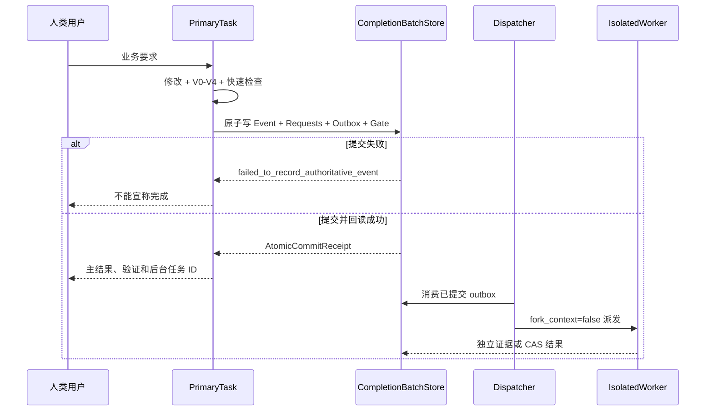

# 记忆系统设计

## 文档控制

| 项目 | 内容 |
|---|---|
| 文档 ID | `DESIGN-MEMORY-001` |
| 正式版本 | `v3.1.0` |
| 来源候选 | `TASK-DESIGN-001-R019` |
| 发布事务 | `DESIGN-RELEASE-TX-R019-G001` |
| 负责人 | `HUMAN_ARCHITECTURE_DOMAIN_LEAD` |
| 修改 / 审核 / 批准 | `uroborus` / `uroborus` / `uroborus` |
| 状态 | 已批准并生效 |
| 上游 | `system-architecture`、`workflow-execution-design`、`PRD` |
| 下游 | `实现端口`、`测试`、`doc-map` |

## 文档职责

- 允许保存：记忆模型；会话账本；隔离；蒸馏；召回；晋升；端口；数据形状；写入治理。
- 禁止保存：会话全文；恢复摘要实例；任务状态副本；过时子设计。
- 主要读者：架构、平台开发、测试。

## 正式内容

**最后更新：** 2026-04-15

## 1. 目标

定义首版蒸馏流水线与后续训练化边界。

## 2. 设计结论

- 首版采用 `规则治理 + 选择性 LLM 候选生成 + 样本沉淀`
- 训练化只在样本足够后再启动
- 不训练“大一统 memory model”
- 宿主 Skill 只以顶层 `skills/*/SKILL.md` 形式存在，由代理宿主按需读取；memory、session assembly、runtime 和 settings 均不拥有 Skill 目录或管理生命周期。
- 后续优先考虑小模型：
  - `candidate extractor`
  - `episodic summarizer`
  - `promotion scorer`
  - `recall ranker`

## 3. 首版落点

- 先实现 deterministic extraction
- 为 summarizer 保留 port
- 保存 `candidate -> decision` 样本链

## 4. 当前实现状态

- `MemorySummarizerPort` 已在运行时保留，默认由 `null summarizer` 占位
- 当前记忆蒸馏主链已把每个 candidate 的 promotion 结果写入 dataset store
- 默认容器支持 `in-memory` 和 `JSONL-backed` dataset store，便于后续离线标注与训练准备
- 当前容器在显式配置 `memory_summarizer_provider/model` 时，可切换到 `LLMMemorySummarizer`
- 当前 `LLMMemorySummarizer` 已严格要求 candidate draft 至少返回 `title/body`；`kind/scope/confidence` 不再信任模型输出
- 同一 session repeated distill 时，dataset sample 已按稳定 ID 幂等更新，不再重复追加

---

**最后更新：** 2026-04-14

## 1. 目标

定义候选记忆如何产生、验证和晋升。

## 2. 核心对象

- `MemoryCandidate`
- `PromotionDecision`
- `MemoryRecord`

## 3. 设计结论

- candidate 先于 record
- promotion 与 recall 解耦
- 无来源 refs 的 candidate 不得晋升长期记忆
- procedural / reflective 默认先 `draft`

## 4. 首版落点

- 在 `domain.memory` 建模 candidate / record / decision
- 先实现 deterministic gate
- LLM 只生成 candidate draft，不直接写 store

## 5. 当前实现状态

- promotion gate 已在 `domain.memory.policy` 中收口为 `MemoryPromotionPolicy`
- 当前策略负责：
  - `min_confidence`
  - `min_confidence_by_kind`
  - `draft_kinds`
  - `allowed_scopes_by_kind`
- `DefaultMemoryDomainService` 负责组装 supporting refs、调用 policy、写入 record 和 decision
- 默认容器已经支持通过 settings / env 外置这些 promotion policy 参数

---

**最后更新：** 2026-04-14

## 1. 目标

定义记忆如何进入 `Context Engine`。

## 2. 核心对象

- `RecallQuery`
- `RecallBundle`
- `ContextSegmentType.LONG_TERM_MEMORY`

## 3. 设计结论

- recall 结果必须带 diagnostics 和 source refs
- `Context Engine` 只消费 recall bundle
- recall 默认只返回 `accepted` memory
- recalled memory 与 working memory 必须分层显示

## 4. 首版落点

- `MemoryDomainService.prepare_session()` 先 recall
- `ContextEngine` 新增 long-term memory segment 装配
- 测试覆盖 recall hit 和 context segment 类型

---

**项目名称：** 山海工枢 / shanforge
**文档状态：** `v2` 专项设计基线
**负责人：** 仓库维护者
**主要读者：** 架构 | 平台开发 | 测试 | 记忆治理维护者
**上游输入：** PRD | 系统架构 | 抽象 Agent 平台架构 | Hermes Agent 源码调研报告
**下游输出：** API 设计 | 实施计划 | 测试计划 | `.factory/memory` 摘要策略
**关联 ID：** `REQ-001`, `REQ-006`, `REQ-009`, `NFR-002`, `MOD-007`, `MOD-010`, `API-006`, `API-007`
**最后更新：** 2026-04-15

## 1. 设计结论

`v2` 的记忆系统不再作为 `Context Engine` 的附属能力设计，而是提升为平台一级能力专题。

兼容说明：

- 文件名 `memory-runtime-design.md` 保留是为了兼容旧索引。
- 当前正式 owner 已经收口为 `domain/memory`。
- `src/runtime/memory/*` 的正式角色是基础能力层中的技术模块与兼容实现，不再被表述为独立业务 owner。

其职责不是“多存一点聊天历史”，而是：

- 接收来自 session ledger 的结构化运行事实
- 把事件和 evidence 蒸馏成可治理的记忆资产
- 以 recall / promotion / decay 策略向 `Context Engine` 提供最小、可追溯、可审计的上下文输入
- 为长期记忆、过程经验和自我进化提供统一控制面

## 2. 核心原则

### 2.1 二级资产原则

记忆永远是从事件和 evidence 蒸馏出来的二级资产，不反客为主。

这里的含义是：

- `Session Event`、`Evidence`、`Artifact` 是第一事实源
- `Memory Record` 是基于第一事实源归纳出的派生资产
- 当记忆与第一事实源冲突时，以第一事实源为准
- 任何长期记忆都必须能回溯到产生它的事件、证据或人工确认

平台因此避免两个常见错误：

1. 把模型“说得像真的总结”当成事实
2. 让长期记忆反过来覆盖真实执行轨迹

### 2.2 分层而非混存

平台不维护一个模糊的“大记忆池”，而是维护多层、不同生命周期的记忆资产。

### 2.3 local-first + port 扩展

首版记忆系统以本地结构化存储为默认实现，先保证可审计、可回放、可测试；外部向量库、远程知识库或企业 memory provider 通过 port 扩展，而不是直接成为第一实现。

### 2.4 recall 与 promotion 解耦

检索什么进入本轮上下文，与哪些结论应该晋升为长期记忆，是两个不同决策。两者不能混成一步。

## 3. 分层模型

### 3.1 Session Ledger Layer

这是记忆系统的输入层，也是运行事实真相源。

包含：

- `SessionEvent`
- `EvidenceRecord`
- `ToolResult`
- `SessionArtifact`
- `StepSummary`

特点：

- 按时间顺序记录
- 不做长期结论假设
- 支持会话回放
- 支持审计和故障追踪

### 3.2 Working Memory

当前 session / 当前 step 的临时工作记忆。

适合保存：

- 当前任务目标
- 中间结果
- 当前假设
- 尚未验证的结论

特点：

- 生命周期短
- 默认不跨 session 继承
- 可被后续 step 覆盖

### 3.3 Episodic Memory

按 session、任务或阶段形成的经历型记忆。

适合保存：

- 会话摘要
- 已完成的阶段
- 遇到的阻塞
- 关键决策和其上下文

特点：

- 以“发生过什么”为核心
- 保留时间线与背景
- 优先服务于恢复、续跑和 session search

### 3.4 Declarative Memory

稳定事实型记忆。

适合保存：

- 用户偏好
- 项目事实
- 环境约束
- 平台规则

特点：

- 需要较高置信度
- 应有稳定 scope
- 变更时需要冲突检测

### 3.5 Procedural Memory

过程型记忆，也就是“应该怎么做”。

适合保存：

- 成功工作流
- 操作规范
- 最佳实践
- 常见故障修复路径

特点：

- 可演化为 skill、runbook 或模板
- 写入门槛应高于 declarative memory

### 3.6 Reflective Memory

反思型记忆，用于支持自我进化。

适合保存：

- 哪类策略经常成功
- 哪类错误重复出现
- 哪类模型策略更适合特定场景
- 哪些 prompt / tool 组合效果差

特点：

- 来源于多次 session 的归纳
- 默认先进入 draft，不直接成为正式规则

## 4. Scope 与隔离

记忆必须带 scope，禁止默认全局共享。

建议的 scope 分层：

- `session`
- `task`
- `agent_app`
- `project`
- `user`
- `workspace`
- `organization`

隔离规则：

- child agent 默认只读取父级提供的 recall snapshot
- child agent 默认不直接写入父级长期记忆
- `session` / `task` scope 的 working memory 不跨 agent 自动共享
- `project` 与 `user` 级长期记忆只能通过 promotion pipeline 写入

## 5. 蒸馏流水线

### 5.1 Observe

运行时先把原始事实写入 session ledger：

- step 开始与结束事件
- capability 调用参数与结果摘要
- 模型输出
- 结构化 response
- evidence 引用

### 5.2 Extract Candidate

从事件和 evidence 中提取候选记忆，而不是直接写长期记忆。

候选类型：

- `fact_candidate`
- `episode_candidate`
- `procedure_candidate`
- `reflection_candidate`

### 5.3 Validate

验证候选是否满足晋升条件：

- 是否有足够 evidence
- 是否与现有记忆冲突
- 是否属于稳定事实而不是临时观察
- 是否超过最小置信度阈值

### 5.4 Promote

验证通过后，再把候选晋升为正式 `MemoryRecord`。

晋升结果可能是：

- `accepted`
- `draft`
- `rejected`
- `superseded`

### 5.5 Recall

`Context Engine` 不直接扫存储层，而是消费由 `MemoryDomainService` 组织出来的 `RecallBundle`；底层可由 `runtime/memory`、store、search 或其他基础能力模块提供技术支撑。

### 5.6 Decay / Merge

记忆系统定期做：

- 去重
- 合并
- 过期
- 降级
- 冲突重写

目标不是保留全部历史，而是保留最有价值、最可追溯、最稳定的记忆资产。

## 6. Memory Distillation Pipeline v1

### 6.1 设计目标

`v1` 的目标不是一次性实现“全自动智能记忆系统”，而是建立一个可落地、可审计、可逐步训练化的混合流水线：

- 原始事实绝不丢失
- 规则负责治理和裁决
- LLM 负责语言归纳和候选生成
- 训练化只作为后续优化方向，不成为首版前提

### 6.2 v1 总体策略

`v1` 采用三层责任分工：

1. `Deterministic Layer`
   - 负责结构化采集、字段抽取、冲突检查、promotion gate
2. `LLM Summarization Layer`
   - 负责长文本摘要、经验候选、反思候选生成
3. `Learning Dataset Layer`
   - 负责沉淀高质量样本，为后续训练小模型做准备

因此，`v1` 不是：

- 全量信息直接发给便宜模型压缩
- 也不是一开始就训练专用压缩模型

而是：

```text
raw events/evidence
-> deterministic extraction
-> selective llm summarization
-> promotion validation
-> accepted memory records
-> labeled dataset for future training
```

### 6.3 哪些环节必须优先用规则

以下环节优先使用确定性逻辑，而不是依赖 LLM：

- 事件类型识别
- step 状态迁移
- capability 名称、退出码、文件路径、写集范围提取
- evidence 引用完整性检查
- 记忆 scope 归属
- 冲突检测
- TTL / supersede / pin 规则
- promotion decision 的硬门槛

原因很简单：这些问题不是“理解自然语言”，而是“维护系统边界”。

### 6.4 哪些环节适合用 LLM

以下环节适合用 LLM 生成候选，但不直接成为正式记忆：

- 长日志摘要
- 长会话 episode summary
- 从多条 event 中提炼 `fact_candidate`
- 从多次成功/失败案例中提炼 `procedure_candidate`
- 从跨 session 轨迹中提炼 `reflection_candidate`

LLM 在这里的角色是：

- 把冗长信息压成更短表达
- 从多条事实中生成“候选结论”
- 产出方便 recall 的自然语言摘要

LLM 在这里不负责：

- 裁定事实真伪
- 决定是否晋升长期记忆
- 覆写人类确认过的规则

### 6.5 v1 推荐模型分层

推荐把记忆蒸馏相关模型分成三档：

| 档位 | 用途 | 要求 |
|---|---|---|
| `cheap summarizer` | 日志摘要、episode summary、长工具输出压缩 | 低成本、高吞吐 |
| `mid extractor` | fact/procedure/reflection candidate 生成 | 稳定归纳、结构化输出较好 |
| `human/strict gate` | 高价值长期记忆、规则升级、skill 发布 | 显式 review 或审批 |

首版默认策略：

- `episodic summary` 可走便宜模型
- `declarative candidate` 可走中档模型，但 promotion 必须过规则门
- `procedural / reflective` 默认先写 `draft`

### 6.6 v1 分阶段处理流程

#### Phase A: Raw Capture

输入：

- session events
- tool results
- model outputs
- artifacts
- evidence refs

输出：

- `SessionLedgerEntry`
- `EvidenceRecord`

这一层禁止压缩覆盖原文。

#### Phase B: Deterministic Extraction

从原始输入中抽出不需要模型理解的结构化信号：

- 通过/失败
- 文件路径
- capability id
- step output key
- approval result
- writeset
- retry count

输出：

- `StructuredObservation`

#### Phase C: Selective Summarization

只有满足以下任一条件时才调用 LLM：

- 单条 evidence 超过摘要阈值
- 单个 session 对话超过 episode 阈值
- 多条 observation 需要归纳成候选结论

输出：

- `CompressedEvidence`
- `EpisodeSummary`
- `MemoryCandidateDraft`

#### Phase D: Validation and Promotion

由规则层完成：

- 来源完整性检查
- 与现有 memory 的冲突检查
- scope 合法性检查
- 是否满足晋升门槛

输出：

- `PromotionDecision`
- `MemoryRecord`

#### Phase E: Dataset Logging

把 candidate 与最终 decision 一起沉淀成训练样本：

- 输入是什么
- 模型给了什么候选
- 最终是否通过
- 为什么通过或拒绝

这一步是后续训练化的关键。

### 6.7 v1 提示词形态

蒸馏 LLM 的提示词不应该要求“自由总结一切”，而应要求生成受限结构：

```text
Input:
- normalized events
- evidence snippets
- current scope
- candidate kind

Output JSON:
- candidate_title
- candidate_body
- candidate_kind
- confidence
- source_event_ids
- evidence_ids
- rejection_risks
```

这样做的目的不是追求漂亮文笔，而是方便进入 promotion gate。

### 6.8 v1 Promotion Gate

建议把 promotion gate 固定成“硬规则优先”：

- 没有 `source_event_ids` -> reject
- 没有 `evidence_ids` 且目标不是 working memory -> reject
- 与 human-confirmed memory 冲突 -> draft 或 reject
- 单次 session 的 procedure candidate -> 默认 draft
- 涉及平台规则或 skill 发布 -> 必须人工 review

### 6.9 v1 Recall Strategy

Recall 也分层，不直接把最新生成的 candidate 全塞给上下文：

- `accepted` memory：可进入 recall
- `draft` memory：默认不进入，除非显式调试或 review 模式
- `rejected` memory：保留样本，不参与 recall
- `superseded` memory：只做审计，不进入 recall

### 6.10 v1 与后续训练的关系

后续如果样本足够，再考虑训练小模型，但训练目标应拆分：

- `candidate extractor model`
- `episodic summarizer model`
- `promotion scorer model`
- `recall ranker model`

不建议训练一个“大一统 memory model”，因为：

- 任务目标差异太大
- 标注口径不容易统一
- 错误定位会更困难

### 6.11 何时值得训练

只有同时满足以下条件，训练才有意义：

- 已积累足够多的 candidate -> decision 样本
- rejection reason 有稳定标签
- prompt + 商用模型成本已经明显成为瓶颈
- recall / promotion 错误模式已经足够清晰

在这之前，优先做高质量数据和高质量 gate。

## 7. 检索流水线

标准 recall 流程建议如下：

```text
1. 输入 RecallQuery
2. 解析当前 session / step / app / scope
3. 先返回 pinned memories
4. 再检索 session 级 episodic memory
5. 再检索 project / user 级 declarative memory
6. 再检索 procedural / reflective memory
7. 过滤无 evidence、低置信度和冲突项
8. 结合预算返回 RecallBundle
9. Context Engine 把 RecallBundle 装入 ContextEnvelope
```

排序维度：

- 当前 step 相关性
- scope 匹配程度
- 新近性
- 事实稳定性
- evidence 完整度
- 用户显式 pin

## 8. 关键数据结构

```text
SessionEvent
- id
- session_id
- step_id
- type
- payload
- timestamp

EvidenceRecord
- id
- session_id
- kind
- source_ref
- summary
- content_digest
- producer
- timestamp

MemoryCandidate
- id
- kind
- scope
- title
- body
- source_event_ids
- evidence_ids
- confidence
- extracted_at

MemoryRecord
- id
- kind
- scope
- title
- body
- status
- confidence
- supporting_refs
- supersedes
- created_at
- updated_at

RecallQuery
- session_id
- app_id
- workflow_id
- step_id
- user_input
- scope_filters
- budget

RecallBundle
- pinned_records
- retrieved_records
- evidence_refs
- diagnostics
```

## 9. 写入治理

### 8.1 哪些内容不能直接进入长期记忆

- 单次模型猜测
- 未验证的 TODO
- 临时草稿
- 只存在于对话措辞中的模糊偏好
- 没有证据支撑的“经验总结”

### 8.2 哪些内容可以优先晋升

- 用户明确确认的稳定偏好
- 在多个 session 中重复成立的项目事实
- 带证据支撑的关键架构决策
- 多次复现后收敛出的高价值 procedure

### 8.3 自我进化边界

Reflective / Procedural memory 可以为自我进化提供候选输入，但不能直接改写正式规则文件、skills 或 `.factory/memory`。正式发布必须经过显式 review 或审批。

## 10. 典型实例

### 9.1 终端命令结果蒸馏为事实记忆

原始事实：

- event: 执行 `uv run pytest tests/test_context_engine.py`
- evidence: 测试输出 `2 passed in 0.04s`

蒸馏过程：

1. ledger 记录命令和测试输出
2. extractor 生成 `episode_candidate`: “本次会话已验证 context engine 测试通过”
3. 如果同类测试在多个 session 中持续通过，可进一步生成 `declarative_candidate`: “当前 scaffold 的 context engine 基础契约稳定可运行”
4. recall 时，默认优先返回摘要与 evidence ref，而不是整段终端原文

不应该发生的事：

- 直接把“系统已经完全稳定”写成长期事实

### 9.2 架构决策蒸馏为长期项目记忆

原始事实：

- event: 用户明确确认“记忆业务 owner 在 `domain/memory`，技术能力和实现继续分层”
- evidence: 已提交的设计文档与时间戳

蒸馏过程：

1. 生成 `fact_candidate`: “`MOD-007` 的业务 owner 在 `domain/memory`，`runtime` 只提供技术能力”
2. 验证其有用户确认和正式文档支撑
3. 晋升为 `project` scope 的 declarative memory
4. 后续 recall 时，这条记忆可直接约束实现与 review

不应该发生的事：

- 把一次 brainstorming 中尚未确认的方向也写成正式事实

### 9.3 重复修复经验蒸馏为 procedural memory

原始事实：

- 多次 session 中都出现“上下文膨胀导致 prompt 失控”
- 对应 evidence 显示：通过摘要替换旧对话、降级低价值检索片段后恢复稳定

蒸馏过程：

1. 多个 episode 被 reflective analyzer 聚合
2. 形成 `procedure_candidate`: “先裁剪检索片段，再压缩工具输出，再把旧对话替换为摘要”
3. 经人工 review 后晋升为 procedural memory
4. 后续可进一步沉淀为 skill、runbook 或实现策略

不应该发生的事：

- 因为一次偶然成功就把方法升级为平台硬规则

## 11. 实施落点

推荐的首版代码落点：

```text
src/application/ports/
  domain_services.py

src/application/execution/
  service.py

src/domain/memory/
  models.py
  ports.py
  policy.py
  service.py

src/runtime/memory/
  runtime.py
  policy.py
  summarizer.py

src/settings/memory/
  store.py

src/settings/memory/
  evidence_store.py

src/settings/memory/
  dataset_store.py
```

模块关系：

- `Session Store / Event Log` 负责保存第一事实源
- `DefaultMemoryDomainService` 负责记忆业务语义与主链编排
- `src/runtime/memory/*` 负责 local-first 技术辅助、summarizer 和兼容实现
- `Context Engine` 负责消费 recall bundle 并装配上下文

## 12. 版本记录

| 版本 | 日期 | 变更内容 |
|---|---|---|
| `v2.0` | 2026-04-14 | 新增记忆运行时专项设计，确立二级资产原则和蒸馏流水线 |
| `v2.1` | 2026-04-14 | 补充 `Memory Distillation Pipeline v1`，明确规则、LLM 和未来训练化的分工 |
| `v2.2` | 2026-04-15 | 收口到 `domain owner + runtime capability + settings implementation` 的正式口径 |

---

**项目名称：** 山海工枢 / shanforge
**文档状态：** `v2` 接口基线
**负责人：** 仓库维护者
**主要读者：** 架构 | 平台开发 | 测试 | 适配器维护者
**上游输入：** 记忆运行时设计 | 记忆系统详细设计方案
**下游输出：** 代码实现 | 契约测试
**关联 ID：** `REQ-006`, `API-006`, `API-007`, `MOD-007`
**最后更新：** 2026-04-20

## 1. 目标

本文件只回答一个问题：在新分层口径下，`memory` 领域相关的稳定接口有哪些，以及接口 owner 在哪一层。

它不描述内部算法细节，只描述：

- 接口/网关层如何发起记忆查询
- 业务调度层如何调用记忆领域服务
- 业务模型层如何向下声明基础能力需求
- 基础能力层如何向下声明 provider 需求
- explainability、archive query 与 external provider 应如何收口

## 2. 接口/网关层接口

### `MemoryInspectionUseCase`

```text
recall(query) -> RecallBundle
preview_recall(session_id, limit=None) -> RecallPreview
```

语义：

- 支持独立调试、测试和网关查询
- `preview_recall` 当前通过独立治理接口暴露 session 对应的 recall query / plan / bundle 预览
- 不暴露领域内部编排步骤，也不把 `preview_recall` 混进 session archive inspection 门面

代码位置：

- `src/access/ports/application_use_cases.py`

### `MemoryGovernanceUseCase`

```text
review_lifecycle(session_id) -> MemoryLifecycleReviewResult
load_lifecycle_queue(session_id, queue_filter=None) -> MemoryLifecycleQueue
reopen_lifecycle_queue(session_id, actor, record_ids=None, queue_filter=None, note=None) -> MemoryLifecycleQueueUpdateResult
load_lifecycle_audit(session_id, audit_filter=None) -> MemoryLifecycleAuditLog
update_lifecycle_queue(session_id, actor, review_status, record_ids=None, queue_filter=None, note=None, resolution=None) -> MemoryLifecycleQueueUpdateResult
apply_lifecycle(session_id, actor, record_ids=None, queue_filter=None) -> MemoryLifecycleApplyResult
```

语义：

- `review_lifecycle`
  - 暴露 session scope 下的完整 lifecycle review 结果
  - 不直接改写 store，只返回 `effective_status / reason / hidden`
- `load_lifecycle_queue`
  - 将 lifecycle review 投影为产品可消费的 durable queue 读模型
  - 默认只返回 `allowed + status_changed + review_status=pending` 的 actionable items
  - 支持通过 `queue_filter` 按 `reason / current_status / effective_status / hidden / review_status` 做过滤
  - 每个 queue item 还会给出 `resolution_required`、推荐 `resolution_options` 和建议 note 模板，供 reviewer 面直接消费
- `reopen_lifecycle_queue`
  - 将 queue item 恢复为 `pending`
  - 适用于人工复核重新打开，而不是复用普通 status update 语义
  - 当未显式给出 `record_ids` 时，可通过 `queue_filter` 批量选中匹配的 queue item
- `load_lifecycle_audit`
  - 返回 durable 审计轨迹，回答谁在什么时候把 queue/review/apply 改成了什么
  - 支持通过 `audit_filter` 按 `action / record_id / actor / queue_review_status / resolution` 过滤
  - 支持 `latest_per_record_only`，用于直接读取每条 memory 最近一次人工处理结果
- `update_lifecycle_queue`
  - 持久化人工 review 状态 `pending / dismissed / applied`
  - 不直接改写 memory record，只更新 queue entry 的 review metadata
  - 可显式写入 reviewer resolution taxonomy；当 `reopen_lifecycle_queue` 把 item 恢复到 `pending` 时，已记录 resolution 会被清空
  - 当 review status 不变但 note 变化时，会留下 `review_note_updated` 审计动作
  - 当未显式给出 `record_ids` 时，可通过 `queue_filter` 对过滤命中的 queue item 做批量 review
- `apply_lifecycle`
  - 对选中的 record 应用已评审 lifecycle decision
  - 当未显式给出 `record_ids` 时，可通过 `queue_filter` 按 queue 选择批量 apply
  - 持久化写回仍通过 `MemoryRecordRepositoryPort`，业务规则 owner 继续在 `domain.memory`
  - 已执行的 queue item 会同步标记为 `review_status=applied`
  - 当 provider governance 允许时，application/use case 链路会把领域决策后的 `lifecycle_apply` 结果继续交给 external provider writeback，并把刷新后的 session durable 保存回 `SessionLedgerPort`

### `SessionInspectionUseCase`

```text
get_session(session_id) -> AgentSession | None
```

用于 explainability、回放和档案相关入口。

## 3. 业务调度层接口

### `MemoryDomainService`

```text
prepare_session(session, app, workflow) -> RecallBundle
recall(query) -> RecallBundle
preview_recall(session, limit=None) -> RecallPreview
distill_session(session) -> DistillationResult
explain_session_memory(session) -> Mapping[str, Any]
review_lifecycle(session) -> MemoryLifecycleReviewResult
load_lifecycle_queue(session, queue_filter=None) -> MemoryLifecycleQueue
reopen_lifecycle_queue(session, actor, record_ids=None, queue_filter=None, note=None) -> MemoryLifecycleQueueUpdateResult
load_lifecycle_audit(session, audit_filter=None) -> MemoryLifecycleAuditLog
update_lifecycle_queue(session, actor, review_status, record_ids=None, queue_filter=None, note=None, resolution=None) -> MemoryLifecycleQueueUpdateResult
apply_lifecycle(session, actor, record_ids=None, queue_filter=None) -> MemoryLifecycleApplyResult
```

语义：

- `prepare_session`
  - 在 workflow 执行前调用
  - 负责本轮装配与 recall
- `distill_session`
  - 在 session 完成后调用
  - 负责 evidence、candidate、promotion 和记忆沉淀
- `recall`
  - 支持独立调试、测试和网关查询复用
- `preview_recall`
  - 负责基于已冻结的 session assembly / augmentation 事实生成 recall 预览
  - 只读，不应触发新的 provider 写副作用
- `explain_session_memory`
  - 负责解释本轮记忆装配与来源
  - 当前应至少稳定投影 recalled memory 状态、promotion reasons、冻结的 recall plan、memory provider binding，以及 scoped records 的 `lifecycle_evaluations / lifecycle_queue_summary / lifecycle_audit_summary`
- `review_lifecycle`
  - 负责返回 session scope 下的完整 lifecycle review 结果
- `load_lifecycle_queue`
  - 负责把 review 结果投影为 durable queue 读模型和默认 batch selection
- `reopen_lifecycle_queue`
  - 负责把已关闭的 review item 恢复到 `pending`
  - 若 `record_ids` 为空，则可按 `queue_filter` 批量恢复匹配 queue item
- `load_lifecycle_audit`
  - 负责读取 durable 审计轨迹，不直接参与业务决策
  - 当前 audit read model 已保证 `latest_entries` 为最新优先，并额外提供 `latest_by_record`
- `update_lifecycle_queue`
  - 负责持久化人工 review 状态，不直接改写 memory record
  - 可显式持久化 reviewer resolution；当 queue item 被 reopen 回 `pending` 时，resolution 会被清空
  - 当仅更新 note 时，仍由 memory domain 决定审计动作类型
  - 若 `record_ids` 为空，则可按 `queue_filter` 对匹配 queue item 做批量 review
- `apply_lifecycle`
  - 负责将已允许的 lifecycle decision durable 写回 memory store
  - 若 `record_ids` 为空，则可消费 queue filter 做批量选择
  - 已执行的 queue item 会同步标记为 `applied`
  - 当 provider governance 允许 lifecycle writeback 时，会继续触发专门的 external `lifecycle_apply` 通道，并刷新 session explainability 事实

代码位置：

- `src/application/ports/domain_services.py`

## 4. 业务模型层下行接口

`memory` 领域向基础能力层声明的接口如下：

### `MemoryRecordRepositoryPort`

```text
save_memory_record(record) -> None
scan_memory_records(scope_filters, allowed_statuses) -> tuple[MemoryRecord, ...]
query_memory_records(query) -> tuple[MemoryRecord, ...]
```

约束：

- `scan_memory_records` 是当前正式 owner，用于把持久化扫描与 recall 排序拆开
- `query_memory_records` 只保留给兼容适配器或独立调试场景，不能再承载 recall budget / rank owner

### `EvidenceRepositoryPort`

```text
save_evidence(record) -> None
list_evidence(session_id) -> tuple[EvidenceRecord, ...]
```

### `MemoryDatasetRepositoryPort`

```text
save_sample(sample) -> None
list_samples(session_id) -> tuple[MemoryDistillationSample, ...]
```

### `MemoryLifecycleQueueRepositoryPort`

```text
list_lifecycle_queue_entries(session_id) -> tuple[MemoryLifecycleQueueEntry, ...]
replace_lifecycle_queue_entries(session_id, entries) -> None
```

约束：

- 只持久化 lifecycle review queue 的 durable state，不主导 lifecycle 业务决策
- entry 至少保留 `record_id / reason / effective_status / review_status / reviewed_by / reviewed_at / review_note`
- `domain.memory` 负责决定 queue 里出现什么以及何时从 `pending` 进入 `dismissed / applied`

### `MemoryLifecycleAuditRepositoryPort`

```text
list_lifecycle_audit_entries(session_id) -> tuple[MemoryLifecycleAuditEntry, ...]
append_lifecycle_audit_entries(session_id, entries) -> None
```

约束：

- 只持久化 lifecycle 审计轨迹，不主导 queue/review/apply 业务决策
- entry 至少保留 `record_id / actor / action / current_status / effective_status / queue_review_status / created_at`
- `domain.memory` 负责决定什么时候记审计以及 metadata 里带哪些治理解释

### `MemoryArchiveQueryPort`

```text
search_archive(app_id, query_text, limit=20) -> tuple[Mapping[str, Any], ...]
```

### `MemoryProfileResolverPort`

```text
resolve_profile(session, app_id, workflow_id) -> Mapping[str, Any]
```

### `MemoryRuleBundlePort`

```text
load_rule_bundle(workspace_root, profile_id) -> Mapping[str, Any]
```

### `MemoryReasoningPort`

```text
summarize_evidence(session, evidence_records) -> SummaryResult
extract_candidates(session, evidence_records, summary) -> CandidateDrafts
```

### `MemorySemanticSearchPort`

```text
semantic_search(namespace, query_text, limit=8, filters=None) -> tuple[Mapping[str, Any], ...]
```

### `RecallPlannerPort`

```text
plan(decision) -> RecallPlan
```

语义：

- 根据 `RecallGovernanceDecision` 物化本轮 recall 的 `scope_budgets`
- 保留领域已决定的 `scope_filters`、`allowed_statuses`、`ranking_strategy` 与显式排序指令
- 不直接读 store，也不直接做排序

### `RecallRankerPort`

```text
rank(plan, records, augmentation=None) -> tuple[MemoryRecord, ...]
```

语义：

- 基于 `RecallPlan` 执行预算裁剪、显式 bucket 排序和 top-k 收口
- 当前排序 owner 已从 store 查询中拆出，不再让 `MemoryStorePort.search()` 同时承担 scan 与 rank

代码位置：

- `src/domain/memory/ports.py`

## 5. 已落地的读模型与档案查询界面（首轮）

为满足 `MEM-BIZ-006` 和 `MEM-BIZ-008`，当前已在统一门面旁边补三组只读接口：

### `MemoryAssemblyQueryPort`

```text
get_session(session_id) -> AgentSession | None
search_session_archive(query, profile_id, limit=10) -> tuple[SessionArchiveHit, ...]
load_session_slice(session_id, cursor, limit) -> SessionTranscriptSlice
explain_session_assembly(session_id) -> SessionAssemblyManifest
```

### `SessionArchiveQueryPort`

```text
search_session_archive(query, profile_id, limit=10) -> tuple[SessionArchiveHit, ...]
get_session_summary(session_id) -> str | None
```

### `SessionTranscriptSlicePort`

```text
load_session_slice(session_id, cursor, limit) -> SessionTranscriptSlice
```

语义：

- `MemoryAssemblyQueryPort` 当前负责统一暴露 session inspection 读门面
- `SessionArchiveQueryPort` 负责回答“以前发生过什么”
- `SessionTranscriptSlicePort` 负责回答“历史会话具体片段怎么回放”
- `SessionAssemblyManifest` 当前已包含 `child_session_ids + child_digests + selected_model + model_bindings + backend_bindings`，用于回答“有哪些子任务摘要已经回收到父会话、默认装配选择了哪个模型/后端、这些绑定来自哪里，以及执行时实际用了哪些模型”
- `backend_bindings` 当前不仅覆盖 `llm_provider / memory_store`，也会投影 `capability_registry / approval_policy / delegation_transport` 的业务选择、Hermes bridge 契约元数据，以及 `binding_source / source_path / requested_binding_id` 这类 backend 来源治理信息
- `selected_model` 当前保持 session-start 默认 provider/model 选择及其治理元数据；`model_bindings` 负责记录 step 级真实调用轨迹，不再覆盖默认装配解释
- 这两类查询都不应借道长期记忆存储接口

## 6. Context 领域消费界面

### `RecallBundle`

```text
RecallBundle
- pinned_records
- retrieved_records
- evidence_refs
- diagnostics
```

约束：

- `Context Engine` 只能消费 `accepted` records
- `draft/rejected/superseded` 不默认进入上下文
- `diagnostics` 必须包含命中数量、过滤原因和预算信息；当前主链还会补 `scanned_count`、`recall_plan` 与 `external_augmentation_present`

### `RecallPreview`

```text
RecallPreview
- session_id
- query
- plan
- bundle
- scope_breakdowns
- record_rankings
- augmentation_preview
- memory_provider_binding
- external_recall_block
- metadata
```

约束：

- `RecallPreview` 属于独立治理读模型，不替代 `RecallBundle`
- 它回答的是“按当前冻结装配与当前 store 状态看，recall 会怎么执行”，而不是“真实执行时已经注入了什么”
- `scope_breakdowns` 必须显式给出每个 scope 的 budget、扫描集合、命中集合与 overflow 集合
- `record_rankings` 必须把 `scan -> rank -> select` 的排序轨迹显式化，区分 `scope_budget`、`overflow_candidate` 与 `overflow_fill`
- `augmentation_preview` 必须解释 external memory augmentation 的 provider/source/namespace，以及 recall block 是否存在、来自哪里
- `query` 当前也会携带 `query_text`，供 external/vector provider 在不越过 domain owner 的前提下做 provider-owned retrieval

## 7. 蒸馏与晋升界面

### `DistillationResult`

```text
DistillationResult
- evidence_records
- candidates
- promotion_decisions
- promoted_records
```

### `PromotionDecision`

```text
PromotionDecision
- candidate_id
- status
- reason
- supporting_refs
```

### `MemoryPromotionPolicy`

```text
evaluate(candidate) -> (status, reason)
```

语义：

- 独立负责 confidence threshold、allowed scope 和 default draft kinds
- 不直接写 store
- 由 `memory` 领域在蒸馏流程中调用
- 首版允许通过 settings / env 外置化

## 8. 基础能力层与基础设置层界面

这里不再让业务层直接面向具体存储实现，而是统一经过基础能力层 provider 接口：

```text
StructuredStoreProviderPort
SearchIndexProviderPort
VectorIndexProviderPort
RuleSourceProviderPort
ProfileSourceProviderPort
EmbeddingProviderPort
```

这些接口由基础能力层定义，由基础设置层实现。

## 9. Summarizer / Extractor / Provider 界面

### `MemorySummarizerPort`

```text
summarize_evidence(payload) -> SummaryResult
extract_candidates(payload) -> CandidateDrafts
```

约束：

- Summarizer 只返回候选草案
- 不直接写 memory store
- 不直接决定 promotion status
- 首版默认可用 `null summarizer` 占位；是否启用 LLM 总结器不影响 deterministic gate 生效
- 当容器显式配置 `memory_summarizer_provider/model` 时，可启用 `LLMMemorySummarizer`
- `LLMMemorySummarizer` 当前严格要求 extraction 输出至少包含 `title` 和 `body`
- `kind / scope / confidence` 由运行时配置控制，模型输出中的同名字段默认忽略

### `MemoryProviderPort`

当前正式落点：

- 接口 owner：`src/domain/memory/ports.py`
- 协调器：`src/runtime/memory/provider_manager.py`
- 基础设置实现：`src/settings/memory/provider.py`

```text
initialize(binding, session_id) -> None
prefetch(query, session_id) -> str
sync_turn(session_id, latest_events) -> None
on_session_end(session_id, distillation_result) -> None
on_lifecycle_apply(session_id, apply_result) -> None
on_delegation(digest) -> None
```

约束：

- built-in local memory store 永远存在，external provider 只是 augmentation
- 同时只允许 1 个 external provider 激活，避免 schema 膨胀与可解释性退化
- provider 返回的 recall block 只能作为附加上下文，不得绕过 promotion / evidence 真相源
- provider 返回的 recall block 必须带显式 context fence / system note，并在注入前做 sanitize
- provider manager 现在直接消费 `MemoryProviderGovernanceDecision`；`writable`、delegation shared-write 等门槛由 `domain.memory` 先决策，再由 service 决定是否调用 manager
- `apply_lifecycle` 不复用 `session_end` 写回语义；provider 现在拥有专门的 `on_lifecycle_apply()` 通道，用于同步 lifecycle review/apply 结果
- provider manager 当前会合并 `contract_metadata()` 与可选 `prefetch_diagnostics()`，并在 runtime 边界直接输出 compact 的 canonical explainability，而不是继续平铺 legacy 顶层 alias
- 当前基础设置实现已提供 `none / in_memory / jsonl / jsonl_vector / remote_http` 五档；其中 `jsonl` 会把 provider-owned snapshot / turn / digest state 落到独立 JSONL root，`jsonl_vector` 会基于 `query_text` 对这些 provider-owned state 做向量式 rank/prefetch，并在 lifecycle apply 时同步移除 `superseded / forgotten` snapshot，`remote_http` 则通过 settings-layer `http_client` 的 `file:// + http(s)` JSON transport 拉取远端 recall block 与 hits，并可选写回 `sync / session_end / lifecycle_apply / delegation` 事件；当前 binding metadata 还可声明 `metadata_file`、`request_headers / bearer_token(_env|_file) / signature_secret(_env|_file) / signature_key_id / retry_status_codes / max_retries / timeout_seconds`、canonical `hmac-sha256` 签名串、`prefetch_response_validation`、`*_failure_policy` 与 `secret_catalog_file`，其中 `RemoteHttpMetadataResolver` 会把 `recall / sync / session_end / lifecycle_apply / delegation` 的 endpoint、response contract、response validation、failure policy、canonical `bearer_token*` 以及 legacy alias fallback 收口到统一解析路径，并投影为 `RemoteHttpRequestGovernance`；当前 preview diagnostics 已跨 `jsonl / jsonl_vector / remote_http` 对齐 `query_terms / source_breakdown / result_truncated / budget_trace / rank_trace / hit_provenance / contract_trace / access_trace / writeback_trace`，并由 provider manager、stored replay、domain preview 回读和 session/manifest 落盘共用的 normalize/compact/project-stored/preview-project 路径统一兼容 legacy 输入；其中 preview 顶层现已完全保留 canonical 诊断，不再暴露 `legacy_aliases`；stored replay 现还会基于 `provider_id` 推断默认 contract metadata，并基于 `memory_provider_binding.metadata.recall_endpoint_url` 恢复 remote access 默认值，因此 `bridge_kind / provider_kind / storage_kind / retrieval_kind / response_contract / response_contract_source / endpoint_url` 这组 legacy 顶层键已经不再需要作为输入事实源；`access_trace` 现承载 transport auth、retry/timeout、secret selection 与 catalog source，`contract_trace` 现承载 prefetch `response_validation_error`，`writeback_trace` 现承载 `successes / response_oks / response_statuses / response_messages / response_report_ids / failure_policies / response_validation_errors` 这组稳定 outcome 摘要，而 `detail_reports` 已成为 canonical drill-down 字段，仅在存在实际写回明细时才保留；旧的 `reports` 只作为 replay/normalize 输入兼容；`budget_trace` 现继续承载 `selected_hit_count / selected_hit_ids / query_text_present`，旧的 `hit_count / hit_ids / query_text_present` 仅在 normalize/backfill 阶段作为兼容输入

## 10. 外部适配器可见数据

对外 adapter 可稳定读取：

- `AgentSession.recalled_memories`
- `AgentSession.memory_candidates`

---

**最后更新：** 2026-04-15

## 1. 目标

定义记忆系统的一手事实源。

## 2. 核心对象

- `SessionEvent`
- `SessionArtifact`
- `EvidenceRecord`

## 3. 设计结论

- event / artifact 必须先落 ledger，再进入蒸馏
- ledger 条目必须有稳定 `id`
- ledger 条目必须支持 replay 与 source refs
- 蒸馏层不得覆盖 ledger 原文

## 4. 首版落点

- 扩展 `domain.session.models`
- 补充 event / artifact 的 `id` 与时间戳
- 由记忆蒸馏主链把 ledger 投影为 `EvidenceRecord`

## 5. 当前实现状态

- `SessionEvent` / `SessionArtifact` 已带稳定 `id` 与 `created_at`
- 当前 `DefaultMemoryDomainService -> EvidenceRepositoryPort` 投影 evidence 时已使用稳定 ID
- 同一 session 的 repeated distill 不再重复写入同一 evidence record

---

**项目名称：** 山海工枢 / shanforge
**文档状态：** `v0.2` 业务驱动详细设计
**负责人：** 仓库维护者
**主要读者：** 架构 | 平台开发 | 业务 Agent 开发 | 测试 | 运营协作者
**上游输入：** [产品需求文档](../04-product/prd.md) | [需求分析文档](../04-product/prd.md) | [记忆运行时设计](./memory-design.md) | [记忆系统对外界面](./memory-design.md) | [Hermes Agent 源码与实现原理调研报告](./solution-overview.md)
**下游输出：** 代码实现 | 追踪矩阵 | 测试计划 | `.factory/memory` 摘要
**关联 ID：** `REQ-006`, `MOD-007`, `MOD-010`, `API-006`, `API-007`, `MEM-BIZ-001` ~ `MEM-BIZ-008`
**最后更新：** 2026-04-19

## 1. 这份文档解决什么问题

现有 `memory-runtime-design.md` 文件已经回答了“记忆为什么要成为平台一级能力专题、recall / promotion / distill 怎么分层、当前实现闭环怎么落地”。
治理边界、分层 owner 与开发分阶段收口，统一收口在本文件、[记忆运行时设计](./memory-design.md) 和 [记忆系统对外界面](./memory-design.md) 中说明。
本文件进一步回答业务侧真正关心的 8 个问题：

1. 会话启动时，哪一层负责决定长期记忆域与项目规则，并保持宿主 Skill 与 runtime 的边界。
2. 不同生产线、混合技术栈项目和多 Agent 协作场景下，记忆系统如何避免污染。
3. 记忆系统在平台分层中的正式位置，以及与 `Context Engine`、`Session Store`、宿主 Skill 的边界。
4. 领域模型如何把“长期记忆、会话档案、项目规则、子 Agent 汇总”严格区分。
5. 存储系统如何在 `local-first` 前提下做到隔离、可审计、可解释和可演进。
6. 当前代码骨架基础上，下一步应该新增哪些端口、读模型和源代码落点。
7. `hermes-agent` 的记忆系统设计精华里，哪些适合直接吸收，哪些只适合抽象借鉴。
8. 主 Agent 从业务角度看，当前方案最该优先补什么，哪些能力必须延后。

这份文档的定位不是替代 `memory-runtime-design.md`，而是为其补上“业务装配治理 + 详细工程落点 + Hermes 启发吸收”。

## 2. 业务约束到设计原则的映射

| 业务约束 | 设计原则 | 设计结果 |
|---|---|---|
| `MEM-BIZ-001` 会话启动必须路由到正确长期记忆域 | 长期记忆域由显式 `profile` 或等价入口决定，`cwd` 不负责切脑子 | 引入 `ProfileMemoryDomain` 与 `ProfileResolverPort` |
| `MEM-BIZ-002` 不同生产线长期记忆隔离 | 长期记忆至少按 `profile` 分桶，不默认全局共池 | 记忆存储按 `profile_id` 物理或逻辑分区 |
| `MEM-BIZ-003` 混合技术栈项目要“单项目记忆 + 多 Skill 按需使用” | 项目记忆与宿主 Skill 分层治理 | `SessionAssemblyManifest` 只记录 runtime 事实；Skill 由代理宿主从顶层目录按需读取 |
| `MEM-BIZ-004` Skill 必须按任务按需使用 | Skill 属于宿主流程资产，不属于事实记忆或 runtime capability | 不建立 `SkillCatalogPort`、runtime Skill 目录或 session activation 状态 |
| `MEM-BIZ-005` 长期记忆自动维护但保持小而精 | recall、promotion、merge、decay 分离治理 | 引入 `RecallPlannerPort` / `RecallRankerPort` 与 retention policy |
| `MEM-BIZ-006` 会话档案与长期记忆分层 | session ledger 是第一事实源，memory record 是二级蒸馏资产，历史回查走独立 archive query | append-only 会话档案、独立 evidence store、独立 memory store、独立 `SessionArchiveQueryPort` |
| `MEM-BIZ-007` 多 Agent 协作由主 Agent 串联 | 子 Agent 默认只产出 digest，不直接改写共享长期记忆 | 引入 `SubAgentDigest`、`DelegationDigestStorePort` 与 child-isolated memory policy |
| `MEM-BIZ-008` 当前装配结果必须可解释 | “装配了什么”必须成为一等读模型，且 session-start snapshot 要稳定 | 引入 `SessionAssemblyManifest`、`MemoryAssemblyQueryPort` 与 `AssemblySnapshotPolicy` |

## 3. 系统分层

### 3.1 领域定位

记忆是业务模型层中的核心领域，不再用“跨层子系统 owner”描述。

在六层架构内，记忆领域内部仍然可以拆成两个协作平面 + 一个支撑查询面：

- 装配平面：解决“这次会话该带什么脑子、哪些规则、哪些子 Agent 摘要、哪些增强 provider”；不管理宿主 Skill。
- 记忆平面：解决“把哪些事实蒸馏成长期资产，以及如何被后续会话 recall”。
- 档案查询面：解决“历史细节怎么回查”，只服务会话档案与 explainability，不把旧日志伪装成长期记忆。

Hermes Agent 的源码结论进一步验证了这个分拆方向：它把 bounded built-in memory、外部 memory provider、session search 和 delegation 隔离成不同能力面，而不是让一个 memory store 同时承担全部职责。`shanforge` 应吸收这种边界，而不是照搬其 monolithic runtime 组织方式。

### 3.2 记忆领域在六层架构中的正式落点

| 架构层 | 代码落点 | 对记忆系统的责任 | 不能做什么 |
|---|---|---|---|
| 用户界面层 | 仓外 Web 项目、外部 CLI 前台 | 承载用户交互与调试入口 | 直接操作 memory store |
| 接口 / 网关层 | `src/access/` | 接收运行请求、调试查询和未来 explainability 查询入口 | 越过应用门面直连基础设置实现 |
| 业务调度层 | `src/application/` | 组织 `prepare -> run -> distill -> persist` 会话生命周期，并通过 `MemoryDomainService` 调用记忆领域 | 直接决定 store / provider 实现细节 |
| 业务模型层 | `src/domain/memory/`、相关 assembly/archive 模型 | 定义 `RecallQuery`、`RecallBundle`、`MemoryRecord`、`SessionAssemblyManifest` 等稳定契约，并持有记忆业务逻辑 | 持有外部 SDK 或数据库驱动细节 |
| 基础能力层 | `src/runtime/ports/` 及未来实现模块 | 提供 recall、assembly、promotion、archive query 所需的检索、规则、profile、推理和存储能力 | 主导记忆业务语义 |
| 基础设置层 | `src/settings/session/`、`src/settings/memory/`、`src/settings/model/`、`src/settings/composition/`、sibling `shanforge-di` | 提供 session ledger、evidence、memory、dataset、archive、provider、本地 business bindings 与装配实现 | 主导业务路由或改写领域规则 |

补充约束：

- `src/runtime/memory/assembly.py`、`provider_manager.py` 这类新增文件如果落地，仍然属于基础能力层内部模块，不是新的架构层。
- `src/settings/` 是基础设置层唯一正式代码根；`session / memory / model / workspace / approval / delegation / gateway / capability_registry / hermes` 是层内实现领域。

### 3.3 记忆系统主链路

```text
外部 UI / 前台
  -> 接口 / 网关层
  -> 业务调度层
  -> 业务模型层 memory
  -> 基础能力层 recall / assembly / archive / context capability
  -> 基础设置层 Memory / Evidence / Dataset / Archive / Provider 实现
```

### 3.4 五个必须坚持的边界

- `cwd` 只决定“现场规则”，不决定“长期脑子是谁”。
- Skill 是代理宿主流程资产，只从顶层 `skills/*/SKILL.md` 按需读取，不进入长期事实记忆池或 runtime 装配。
- 子 Agent 结果默认先进入 `digest` 区，不直接晋升全局长期记忆。
- 会话档案回查走 archive query，不借道 `MemoryStorePort.search()`。
- built-in local memory 始终保留；external provider 只能做 augmentation，不得覆盖 evidence / memory 的主事实链。

## 4. 领域模型建模

### 4.1 现有模型继续保留

以下模型已经在代码中存在，继续作为正式核心契约：

- `SessionEvent`
- `SessionArtifact`
- `AgentSession`
- `EvidenceRecord`
- `MemoryCandidate`
- `PromotionDecision`
- `MemoryRecord`
- `RecallQuery`
- `RecallBundle`
- `DistillationResult`
- `MemoryDistillationSample`

### 4.2 新增业务装配模型

| 模型 | 建议落点 | 作用 |
|---|---|---|
| `ProfileMemoryDomain` | `src/domain/memory/assembly_models.py`（新增） | 标识当前长期记忆域，包含 `profile_id`、默认 `scope` 与默认 recall policy |
| `ProjectRuleBundle` | `src/domain/session/assembly_models.py`（新增） | 表达当前仓库加载到的规则文件、规则来源、版本摘要 |
| `SessionAssemblyManifest` | `src/domain/session/assembly_models.py`（新增） | 一次会话最终装配结果的读模型，记录 profile、cwd、规则、recall plan、memory sources、backend bindings、默认 selected model 与实际 model invocation history |
| `SubAgentDigest` | `src/domain/session/delegation_models.py`（新增） | 子 Agent 产出摘要、责任范围、证据来源、主 Agent 吸收状态 |
| `RecallPlan` | `src/domain/memory/assembly_models.py`（新增） | 记录本轮 recall 的 scopes、预算、排序策略和过滤原因 |
| `MemoryProviderBinding` | `src/domain/memory/assembly_models.py`（新增） | 描述本轮启用的 built-in / external provider、命名空间与注入模式 |
| `SessionArchiveHit` | `src/domain/session/archive_models.py`（新增） | 历史会话检索命中项，只作为回查读模型，不进入长期记忆聚合 |

### 4.3 Working Memory 的正式定位

`working memory` 不应被建模成可持久化的 `MemoryRecord`。它属于当前 session / 当前 step 的运行时状态，应继续驻留在：

- `AgentSession.context`
- `ContextEnvelope.values`
- `ContextSegmentType.WORKING_MEMORY`

结论是：

- 持久化长期记忆只有 `episodic / declarative / procedural / reflective`
- `working memory` 是会话级运行时对象，不进入长期记忆存储

### 4.4 聚合关系

```text
AgentSession
  -> SessionEvent*
  -> SessionArtifact*
  -> SessionAssemblyManifest (1)
  -> SubAgentDigest*
  -> DistillationResult (0..1)

DistillationResult
  -> EvidenceRecord*
  -> MemoryCandidate*
  -> PromotionDecision*
  -> MemoryRecord*

SessionArchiveHit
  -> session_id
  -> matched_event_refs*
  -> summary
  -> score
```

### 4.5 生命周期规则

| 对象 | 生命周期 | 默认去向 |
|---|---|---|
| `SessionEvent` / `SessionArtifact` | 会话执行期间持续追加 | session ledger |
| `EvidenceRecord` | session 结束后保留，可重建 | evidence store |
| `MemoryCandidate` | 短期可审计资产 | dataset store + session state |
| `MemoryRecord` | 跨会话长期资产 | memory store |
| `SubAgentDigest` | 默认待主 Agent 吸收 | digest store |
| `MemoryProviderBinding` | session-start 冻结，session-end 关闭 | assembly manifest + provider manager state |
| `SessionArchiveHit` | 按查询即时生成 | archive query result |

## 5. 存储系统设计

### 5.1 存储职责拆分

| 存储 | 当前状态 | 下一步职责 |
|---|---|---|
| `Session Ledger Store` | 目前由 `AgentSession` + `SessionStore` 承接，持久化能力不足 | 负责 append-only 事件、artifact、会话摘要留档 |
| `Evidence Store` | 已有 `InMemory/JsonlEvidenceStore` | 保存事实投影，供审计、追溯和 candidate 支撑引用 |
| `Memory Store` | 已有 `InMemory/JsonlMemoryStore` | 保存 `accepted/draft/superseded` 记忆，按 `profile_id + scope + scope_key` 分区 |
| `Dataset Store` | 已有 `InMemory/JsonlMemoryDatasetStore` | 保存 `candidate -> decision -> supporting refs` 样本链 |
| `Assembly Store` | 已有 `InMemory/JsonlSessionAssemblyStore` | 保存 `SessionAssemblyManifest`，支撑“当前装配了什么”的解释与调试 |
| `Digest Store` | 已有 `InMemory/JsonlDelegationDigestStore` | 保存子 Agent 输出摘要和主 Agent 吸收决策 |
| `Session Archive Index` | 缺失 | 为历史会话建立 `session/event/artifact` 检索索引，专门服务回查 |

### 5.2 推荐的本地目录布局

`local-first` 版本建议采用按 `profile` 与 `session` 双主键拆分，而不是继续把所有记忆放在一个共享文件里：

```text
<memory_root>/
  profiles/
    <profile_id>/
      memory-records.jsonl
      memory-dataset.jsonl
      profile-config.json
      memory-provider/
        memory-provider-snapshots.jsonl
        memory-provider-turns.jsonl
        memory-provider-digests.jsonl
  sessions/
    <session_id>/
      session-events.jsonl
      evidence-records.jsonl
      assembly-manifest.json
      sub-agent-digests.jsonl
  indexes/
    session-archive.sqlite
```

### 5.3 分桶策略

| 资产 | 主分桶键 | 次分桶键 | 说明 |
|---|---|---|---|
| 长期记忆 | `profile_id` | `scope/scope_key` | 保证不同生产线、不同项目默认隔离 |
| 会话档案 | `session_id` | `event kind` | 事实源按 session 保留 |
| 样本数据 | `profile_id` | `session_id` | 训练与分析按长期脑子归档 |
| 装配读模型 | `session_id` | 无 | 专供 explainability |
| 子 Agent 摘要 | `parent_session_id` | `child_session_id` | 支撑主从协作收口 |
| 会话检索索引 | `profile_id` | `session_id` | 支撑历史回查，不替代长期记忆 |

### 5.4 检索与持久化分离

当前这条链已经从“设计要求”进入“正式实现”，主链已拆成：

- `MemoryStorePort`：负责持久化与按分区扫描；当前正式 owner 是 `scan_memory_records()`
- `RecallGovernancePolicy`：负责确定查询 scope、状态过滤与 augmentation 参与条件
- `RecallPlannerPort`：负责把 `RecallGovernanceDecision` 物化为带预算的 `RecallPlan`
- `RecallRankerPort`：负责排序、去重、pinned 优先级和 top-k 裁剪
- `SessionArchiveQueryPort`：负责在 session ledger / archive index 上做历史回查，不污染长期记忆入口
- `provider_manager`：负责把 built-in snapshot 与单个 external provider augmentation 编织到本轮装配中

这样可以避免未来把向量检索、关键词检索、规则过滤和 external augmentation 全部塞进 store。

### 5.5 清理与维护规则

长期记忆自动维护必须有明确预算，而不是停留在原则层：

- `accepted` 记录进入 recall 候选
- `draft` 记录默认不进入 recall，但保留复核价值
- `superseded` 记录保留追溯链，不参与默认 recall
- 同 `scope + title` 冲突时优先生成 `supersedes` 链，而不是直接覆盖
- 当分区达到预算上限时，优先执行 merge / supersede / decay，再考虑淘汰
- session-start snapshot 一旦生成，本轮只允许追加 durable state，不允许隐式改写已注入上下文
- external provider 的 recall block 属于 augmentation，不写回 session ledger 正文

## 6. 源代码骨架

### 6.1 当前已存在的正式骨架

| 路径 | 状态 | 责任 |
|---|---|---|
| `src/domain/memory/models.py` | 已存在 | 记忆领域核心模型 |
| `src/domain/session/models.py` | 已存在 | session / event / artifact 契约 |
| `src/domain/context/models.py` | 已存在 | 上下文段、预算和 envelope 契约 |
| `src/application/ports/domain_services.py` | 已存在 | 应用层对记忆领域的正式服务接口定义 |
| `src/application/execution/service.py` | 已存在 | `prepare -> run -> distill` 主链路 |
| `src/domain/memory/service.py` | 已存在 | recall / distill / explainability 领域实现 |
| `src/domain/memory/ports.py` | 已存在 | 记忆领域向基础能力层声明的下行接口 |
| `src/domain/memory/policy.py` | 已存在 | promotion policy 领域规则 |
| `src/runtime/context/engine.py` | 已存在 | 消费 recalled memory 编译上下文 |
| `src/runtime/ports/*.py` | 已存在 | provider、store、source、backend ports |
| `src/settings/memory/store.py` | 已存在 | memory store 实现 |
| `src/settings/memory/evidence_store.py` | 已存在 | evidence store 实现 |
| `src/settings/memory/dataset_store.py` | 已存在 | dataset store 实现 |
| `src/settings/composition/container.py` | 已存在 | 默认容器装配 |
| `src/settings/composition/component_bindings.py` | 已存在 | 记忆相关 store/provider 的本地 business bindings |

迁移说明：

- 旧的 `src/runtime/memory/runtime.py` 与 `src/runtime/memory/policy.py` 已在 2026-04-18 退役；记忆主链只保留 `src/domain/memory/service.py`、`src/domain/memory/policy.py` 与 runtime 侧的 planner/ranker/provider_manager/summarizer 支撑模块。

### 6.2 建议新增的骨架

| 路径 | 状态 | 责任 |
|---|---|---|
| `src/domain/memory/assembly_models.py` | 新增 | `ProfileMemoryDomain`、`RecallPlan`、`MemoryProviderBinding` |
| `src/domain/session/assembly_models.py` | 新增 | `ProjectRuleBundle`、`SessionAssemblyManifest` |
| `src/domain/session/delegation_models.py` | 已落地 | `SubAgentDigest` |
| `src/domain/session/archive_models.py` | 新增 | `SessionArchiveHit` |
| `src/application/ports/memory_assembly.py` | 新增 | `MemoryAssemblyQueryPort` |
| `src/access/api/memory_api.py` | 新增 | 读写分离的 memory / assembly 调试与运维入口 |
| `src/runtime/memory/assembly.py` | 新增 | `profile + rules + digest` 装配服务 |
| `src/runtime/memory/provider_manager.py` | 已落地 | 编排 built-in local memory 与单个 external memory provider |
| `src/runtime/memory/recall_planner.py` | 已落地 | recall plan 生成与预算裁剪 |
| `src/runtime/ports/profile_resolver.py` | 新增 | 显式入口 -> profile domain |
| `src/runtime/ports/workspace_rule_bundle.py` | 新增 | 从 `cwd` 加载项目规则摘要 |
| `src/domain/memory/ports.py` | 已扩展 | `MemoryProviderPort` / `MemoryProviderManagerPort` 的 consumer-owned 接口定义 |
| `src/runtime/memory/recall_ranker.py` | 已落地 | recall 结果排序与裁剪 |
| `src/domain/session/ports.py` | 已落地 | `SessionAssemblyStorePort`，承载 assembly manifest 的 durable snapshot 契约 |
| `src/runtime/ports/delegation_digest_store.py` | 新增 | 子 Agent digest 持久化 |
| `src/runtime/ports/session_archive_query.py` | 新增 | 历史会话检索与摘要回查 |
| `src/settings/memory/provider.py` | 已落地 | external memory provider 的 `none / in_memory / jsonl` 基础设置实现 |
| `src/settings/session/assembly_store.py` | 已落地 | assembly store 的 `in-memory / JSONL` 实现 |
| `src/settings/delegation/digest_store.py` | 新增 | digest store 的 `in-memory / JSONL` 实现 |
| `src/settings/session/archive_index.py` | 新增 | session archive query 的 `SQLite FTS / JSONL` 实现 |

### 6.3 与当前实现的关键对齐结论

- `ExecutionService -> SessionDomainService / MemoryDomainService -> domain ports -> stores / reasoning capability` 已经是真实主链路，不再以 `MemoryRuntime` 作为正式业务 owner。
- `project_scope_key="shanforge"` 这类静态配置已从默认容器迁出；当前默认装配已改为通过 `ProfileSourceService + RuleSourceService` 生成 `profile_id` 与 `project_scope_key`，并随 `SessionAssemblyManifest` 持久化。
- `ContextSegmentType` 保留 `EVIDENCE`，用于后续把 evidence 段正式产出；Skill 内容不进入 Shanforge context segment。
- `DefaultMemoryDomainService` 当前已承接 recall / distill / promotion 主逻辑；其中 recall 已改为 `RecallGovernancePolicy -> RecallPlannerPort -> scan_memory_records() -> RecallRankerPort` 的独立协作链，不再回塞到 legacy runtime shim 或 store 查询里。
- external `MemoryProviderPort + provider_manager` 已从首轮边界推进到 durable backend/source：domain owner 定义 `MemoryProviderPort / MemoryProviderManagerPort`，runtime `DefaultMemoryProviderManager` 负责 single-provider lifecycle + sanitize fence，settings `memory_provider` family 已提供 `none / in_memory / jsonl / jsonl_vector / remote_http` 实现，`SessionAssemblyManifest` 现会冻结 `memory_provider_binding`。
- `JsonlAugmentationMemoryProvider` 会把 provider-owned snapshot / turn / digest state 落到 profile-scoped JSONL root，保证 built-in local memory 与 external augmentation 的 durable state 仍然分仓治理。
- `RemoteAugmentationMemoryProvider` 现已通过 settings-layer `http_client` 支持 `file:// + http(s)` JSON transport，并可选写回 `sync / session_end / lifecycle_apply / delegation` 事件；binding metadata 还可声明 `metadata_file`、`request_headers / bearer_token(_env|_file) / signature_secret(_env|_file) / signature_key_id / retry_status_codes / max_retries / timeout_seconds`、canonical `hmac-sha256` 签名串、`prefetch_response_validation`、`*_failure_policy` 与 `secret_catalog_file`；其中 `secret_catalog_file` 可提供 `default_signature_key_id / signature_keys / default_bearer_token_id / bearer_tokens`，把 key rotation 与 durable secret governance 留在 settings 层，而 `RemoteHttpMetadataResolver` 会把 `recall / sync / session_end / lifecycle_apply / delegation` 的 endpoint、response contract、response validation、failure policy、canonical `bearer_token*` 与 legacy alias fallback 统一收口到同一条解析路径，并投影为 `RemoteHttpRequestGovernance` 读模型供 provider 直接消费；当前 `jsonl / jsonl_vector / remote_http` 也已统一把 `query_terms / source_breakdown / result_truncated / budget_trace / rank_trace / hit_provenance / contract_trace / access_trace / writeback_trace` 回收到 preview explainability，`src/domain/memory/augmentation_diagnostics.py` 则把 provider manager、stored replay、domain preview 回读和 session/manifest 落盘统一到同一套 normalize/compact/project-stored/preview-project 路径上；其中 runtime provider manager 现已直接输出 compact canonical diagnostics，不再主动展开 legacy 顶层 alias，而读取冻结的旧 diagnostics 时仍可经 normalize 把这些 legacy 顶层键并回 trace，且 `DefaultMemoryDomainService` 不再单独维护一份 service-local `allowed_keys`。与此同时，stored replay 现还会基于 `provider_id` 推断基础 contract defaults，并基于 `memory_provider_binding.metadata.recall_endpoint_url` 恢复 access 默认值，使 `bridge_kind / provider_kind / storage_kind / retrieval_kind / response_contract / response_contract_source / endpoint_url` 不再需要继续作为 legacy 顶层输入。preview 现已完全只暴露 canonical trace-first 字段，不再输出 `legacy_aliases`。`remote_http` provider 自身则继续移除重复顶层 diagnostics，并把 transport auth、retry/timeout、secret selection、catalog source、prefetch validation 与 writeback outcome/error 摘要分别统一回收到 `access_trace / contract_trace / writeback_trace`；其中 `writeback_trace` 现会稳定暴露 `successes / response_oks / response_statuses / response_messages / response_report_ids / failure_policies / response_validation_errors`，并以 `detail_reports` 作为 canonical drill-down 字段；旧的 `reports` 只在 replay/normalize 阶段作为兼容输入，`hit_count / hit_ids / query_text_present` 这组跨 backend 命中摘要也已继续并入 `budget_trace.selected_hit_count / selected_hit_ids / query_text_present`。`apply_lifecycle()` 现还会在本地 memory store durable 更新后，按 `MemoryProviderGovernanceDecision.allow_lifecycle_writeback` 决定是否继续触发 provider-aware lifecycle writeback。
- Hermes 的 `MemoryManager + MemoryProvider` 模式可直接复用为 shanforge 的“增强 provider 插槽”，但 evidence / accepted memory 仍必须由本仓的 local-first stores 主导。

## 7. 对外服务界面

### 7.1 平台内部统一门面

正式目标是由 `MemoryDomainService` 承担应用编排层对记忆领域的统一门面：

```text
prepare_session(session, app, workflow) -> RecallBundle
recall(query) -> RecallBundle
distill_session(session) -> DistillationResult
explain_session_memory(session) -> Mapping[str, Any]
review_lifecycle(session) -> MemoryLifecycleReviewResult
load_lifecycle_queue(session, queue_filter=None) -> MemoryLifecycleQueue
reopen_lifecycle_queue(session, actor, record_ids=None, queue_filter=None, note=None) -> MemoryLifecycleQueueUpdateResult
load_lifecycle_audit(session, audit_filter=None) -> MemoryLifecycleAuditLog
update_lifecycle_queue(session, actor, review_status, record_ids=None, queue_filter=None, note=None, resolution=None) -> MemoryLifecycleQueueUpdateResult
apply_lifecycle(session, actor, record_ids=None, queue_filter=None) -> MemoryLifecycleApplyResult
```

解释：

- `prepare_session` 内部应先完成 `SessionAssemblyManifest` 解析，再执行 recall
- `recall` 保持可独立调试和测试
- `distill_session` 负责 evidence 投影、candidate 提取、promotion、sample 写入
- `explain_session_memory` 负责 explainability 读模型收口，并稳定给出 recall plan、memory provider binding、promotion reasons、recalled memory lifecycle 状态，以及 scoped records 的 `lifecycle_evaluations / lifecycle_queue_summary / lifecycle_audit_summary`；其中 audit summary 会把 `latest_entries` 固化为最新优先，并额外给出 `latest_by_record`
- `review_lifecycle` 负责返回 session scope 下的完整 lifecycle review 结果
- `load_lifecycle_queue` 负责把 review 结果投影为产品可消费的 durable queue 读模型，并给出默认 batch selection；默认只返回 `pending` 的 actionable items
- `load_lifecycle_queue` 对 actionable item 还会投影 reviewer guidance，包括 `resolution_required`、推荐 `resolution_options` 和建议 note 模板
- `reopen_lifecycle_queue` 负责把已 dismiss/applied 的 review item 恢复到 `pending`
- 当未显式给出 `record_ids` 时，`reopen_lifecycle_queue` 可按 `queue_filter` 批量恢复命中的 queue item
- `load_lifecycle_audit` 负责读取 durable 审计轨迹，回答 queue review/apply 的 actor/action/status/resolution 变化，并支持按 `queue_review_status / resolution` 过滤；当 `audit_filter.latest_per_record_only=True` 时，可直接返回每条 record 最近一次人工处理事件
- `update_lifecycle_queue` 负责持久化人工 review 状态 `pending / dismissed / applied`，不直接改写 memory record；当状态不变但 note 变化时，会落为独立 `review_note_updated` 审计动作
- `update_lifecycle_queue` 也可显式持久化 reviewer resolution taxonomy；当 queue item 被 `reopen` 回 `pending` 时，已记录 resolution 会被清空
- 当未显式给出 `record_ids` 时，`update_lifecycle_queue` 可按 `queue_filter` 批量更新命中的 queue item；这里的 filter 语义是“命中队列项全集”，与 `apply_lifecycle` 的默认选中子集不同
- `apply_lifecycle` 负责将已允许的 lifecycle decision durable 写回 memory store；当未显式给出 `record_ids` 时，可直接消费 queue filter 做批量 apply；成功 apply 后，对应 queue item 会同步标记为 `applied`；当 provider governance 允许时，还会继续通过专门的 `lifecycle_apply` 通道把结果同步给 external provider

兼容说明：

- 旧版单独 `memory_system.py` 口径已经废弃。
- 正式架构 owner 以 `src/application/ports/domain_services.py` 和 `src/domain/memory/ports.py` 为准。

### 7.2 可解释性查询门面

首轮已落地的读模型门面 `MemoryAssemblyQueryPort`：

```text
get_session(session_id) -> AgentSession | None
search_session_archive(query, profile_id, limit) -> tuple[SessionArchiveHit, ...]
load_session_slice(session_id, cursor, limit) -> SessionTranscriptSlice
explain_session_assembly(session_id) -> SessionAssemblyManifest
```

目的：

- 让 CLI / HTTP / 测试可直接看见“当前装配了什么”
- 将“路由错了、规则错了、skill 装错了、记忆召回错了、历史回查错了”五类问题区分开

当前落地说明：

- 默认容器已接线 `MemoryAPI -> SessionInspectionService -> SessionSearchQueryAdapter -> SessionSearchService`
- 默认容器现还额外接线 `MemoryInspectionService -> DefaultMemoryDomainService.preview_recall()`，把 recall 预览作为独立治理接口暴露给 `MemoryAPI`
- `prepare_session` 会把 assembly snapshot 写入 `AgentSession.context["assembly_manifest"]`，并同步保存到专门 `SessionAssemblyStorePort`
- `SubAgentDigest` 与 `DelegationDigestStorePort` 已落地，`prepare_session` 会把 child digests 合并进 `SessionAssemblyManifest`
- `ExecutionService` 现会在 session 打开后注入稳定的 `session_context_defaults`，把本轮 profile/backend/model 默认绑定冻结进 session context
- `CapabilityExecutor` 现会把每个 prompt step 的实际 `provider/model` 调用记录回 `SessionAssemblyManifest.model_bindings`
- `SessionAssemblyManifest` 现已显式暴露 `backend_bindings`、`selected_model` 与 `model_bindings`，用于区分“装配默认选择”“这些绑定来自哪个 profile/backend/provider 来源”以及“执行时实际使用”；`selected_model` 继续保留默认装配元数据，不再被 step 级真实调用覆盖

### 7.3 Access 层推荐服务

`src/access/api/memory_api.py` 已提供首轮 `MemoryAPI`，用于调试、诊断与治理，而不是替代 `RuntimeAPI`：

```text
get_session(session_id) -> AgentSession | None
search_session_archive(query, profile_id, limit) -> tuple[SessionArchiveHit, ...]
load_session_slice(session_id, cursor, limit) -> SessionTranscriptSlice
explain_session_assembly(session_id) -> SessionAssemblyManifest
preview_recall(session_id, limit=None) -> RecallPreview
```

其中：

- `search_session_archive` 只回查历史，不把旧日志晋升为长期记忆
- `load_session_slice` 只回放 archive facts，不改变长期记忆
- `preview_recall` 已作为独立治理接口落到 `MemoryInspectionService`，通过 `MemoryAPI` 聚合暴露，但没有写回 `SessionInspectionService`
- 当前 `preview_recall` 会显式返回 `scope_breakdowns`、`record_rankings` 与 `augmentation_preview`，用来回答 recall budget 如何分配、哪些记录因 overflow 被淘汰、external augmentation provenance 从哪里来
- 后续如果补 digest 吸收和 backend 列表，也应继续沿独立治理接口扩展，不与当前 inspection facade 混写

## 8. 需要接入的基础设施能力界面定义

### 8.1 装配与路由接口

```text
ProfileResolverPort.resolve(profile_hint, cwd) -> ProfileMemoryDomain
WorkspaceRuleBundlePort.load(cwd) -> ProjectRuleBundle
```

要求：

- `ProfileResolverPort` 只能基于显式入口、配置或用户选择路由，不得偷偷由 `cwd` 猜 profile
- `WorkspaceRuleBundlePort` 只读取项目规则文件，不回写长期记忆

### 8.2 Recall 与治理接口

```text
RecallGovernancePolicy.decide(session, app_id, workflow_id, profile_id, project_scope_key, provider_decision, default_limit=None) -> RecallGovernanceDecision
RecallPlannerPort.plan(decision) -> RecallPlan
RecallRankerPort.rank(records, plan) -> tuple[MemoryRecord, ...]
MemoryPromotionPolicy.evaluate(candidate) -> (status, reason)
```

要求：

- `RecallGovernancePolicy` 决定本轮查哪些 `scope`、接受哪些 `status`，以及 external augmentation 能否参与
- `RecallPlannerPort` 只负责把领域决策转成预算化且带显式排序指令的 `RecallPlan`
- `RecallRankerPort` 只负责执行 `RecallPlan` 中的 bucket/overflow 排序与 top-k 收口
- `MemoryPromotionPolicy` 继续独立，不进入 store
- 若启用 external memory provider，其 augmentation 结果只能作为 ranker 的额外输入，不得绕过 built-in policy 直接注入 accepted memory

### 8.3 存储接口

```text
MemoryStorePort.save(record) -> None
MemoryStorePort.list_by_scope(scope, scope_key) -> tuple[MemoryRecord, ...]
MemoryStorePort.search(query) -> tuple[MemoryRecord, ...]

EvidenceStorePort.save_evidence(record) -> None
EvidenceStorePort.list_by_session(session_id) -> tuple[EvidenceRecord, ...]

MemoryDatasetStorePort.save_entry(entry) -> None
MemoryDatasetStorePort.list_by_session(session_id) -> tuple[MemoryDistillationSample, ...]

SessionAssemblyStorePort.save(manifest) -> None
SessionAssemblyStorePort.get(session_id) -> SessionAssemblyManifest | None

DelegationDigestStorePort.save(digest) -> None
DelegationDigestStorePort.list_by_session(session_id) -> tuple[SubAgentDigest, ...]

SessionArchiveQueryPort.search_session_archive(query, profile_id, limit) -> tuple[SessionArchiveHit, ...]
SessionArchiveQueryPort.get_session_summary(session_id) -> str | None
SessionTranscriptSlicePort.load_session_slice(session_id, cursor, limit) -> SessionTranscriptSlice
```

### 8.4 模型与技能提炼接口

```text
MemorySummarizerPort.summarize_evidence(session, evidence_records) -> SummaryResult
MemorySummarizerPort.extract_candidates(session, evidence_records, summary) -> CandidateDrafts
```

要求：

- summarizer 只能生成候选草案
- `kind / scope / confidence` 继续由运行时控制
- procedural memory 可产生 skill 候选，但 skill 发布必须走独立治理流，不直接把 memory record 当正式 skill

### 8.5 记忆增强提供方接口

Hermes Agent 最值得吸收的是“内建 bounded memory 永远保留，external provider 按需增强且同时只激活一个”的接口组织方式。落到 shanforge，建议在 runtime ports 中新增：

```text
MemoryProviderPort.initialize(binding, session_id) -> None
MemoryProviderPort.prefetch(query, session_id) -> str
MemoryProviderPort.sync_turn(session_id, latest_events) -> None
MemoryProviderPort.on_session_end(session_id, distillation_result) -> None
MemoryProviderPort.on_delegation(digest) -> None
```

要求：

- built-in local memory store 永远存在，external provider 只是 augmentation
- 同时只允许 1 个 external provider 激活，避免 schema 膨胀和解释困难
- provider 只能写自己的后端，不得改写本地 evidence / memory / dataset 真相源
- provider 返回的 recall block 必须带显式 context fence / system note，并在注入前做 sanitize，避免被误当作新 user input
- child agent 默认不持有 shared provider write capability，只回传 `SubAgentDigest`

## 9. 业务评估与改进方案

### 9.1 主 Agent 评估结论

从业务视角看，当前 `v1` 设计已经把“记忆不是日志、记忆不能覆盖事实、recall / promotion 必须解耦”这三件最关键的事做对了。
真正的缺口不在 `distill_session()` 算法，而在会话装配治理、历史回查治理和增强 provider 治理：

- `profile`、项目规则和子 Agent digest 的装配模型需要持续与实现对齐；宿主 Skill 不属于该模型
- 还没有把“当前装配了什么”做成独立读模型
- 还没有把 recall 规划从静态 `APP + PROJECT` 查询扩成可配置策略
- 还存在静态 `project_scope_key` 这类会限制多 profile / 多项目落地的硬编码
- 还没有把历史会话回查从长期记忆入口中拆出来，`MEM-BIZ-006` 仍缺一条独立查询链
- 还没有建立 built-in + single external provider 的增强接口边界，后续若直接接云 memory SDK 会很快污染主链路

换句话说，现有实现已经具备“记忆核心”，但还没有形成“业务可控的记忆系统产品”。

### 9.2 优先级最高的改进项

1. 先补 `SessionAssemblyManifest`，把 `profile / cwd / rules / recall sources / child digests / provider bindings` 变成一等对象。
2. 先补 `ProfileResolverPort` 与 `WorkspaceRuleBundlePort`，切断 `cwd` 与长期脑路由的耦合。
3. `SessionAssemblyStorePort`、`DelegationDigestStorePort`、`MemoryAssemblyQueryPort` 与 `SessionArchiveQueryPort` 已进入首轮实现；下一轮继续补 provider bindings 治理。
4. 先补 `MemoryProviderPort + provider_manager`，明确 built-in local memory 与单个 external provider 的职责边界。
5. 先把 `project_scope_key` 从硬编码改成装配输入，避免后续多项目和多 profile 迁移返工。

### 9.3 应延后处理的改进项

以下能力重要，但不应抢在装配治理之前：

- 向量检索或远程 memory provider
- 更复杂的 LLM candidate 生成策略
- 训练专用 memory model
- 管理后台 UI
- vendor-specific memory SDK 全量接入

原因很直接：如果装配分层和解释模型没立住，后续引入更强检索只会更难定位错误来源。

### 9.4 推荐实施顺序

| 阶段 | 目标 | 主要产出 |
|---|---|---|
| `P0` | 建立业务可控的装配治理 | `SessionAssemblyManifest`、`ProfileResolverPort`、`WorkspaceRuleBundlePort` |
| `P1` | 建立 explainability、archive query 与主从协作闭环 | `MemoryAssemblyQueryPort`、`SessionAssemblyStorePort`、`DelegationDigestStorePort`、`SessionArchiveQueryPort` |
| `P2` | 建立 built-in + external provider augmentation 边界 | `MemoryProviderPort`、`provider_manager`、`provider bindings`、durable `memory_provider:jsonl / jsonl_vector / remote_http` |
| `P3` | 扩 recall 规划与检索能力 | `RecallPlannerPort`、`RecallRankerPort`、向量/远程检索适配器 |
| `P4` | 扩长期治理与训练化 | retention policy、dataset 审核流、训练样本治理 |

当前实现状态：

- `P2` 已落地，并已补到 durable `jsonl / jsonl_vector / remote_http`；其中 `remote_http` 已支持真实 `HTTP/file` transport 与可选远端写回
- `P3` 的 `RecallPlannerPort / RecallRankerPort`、`preview_recall` 与 provider provenance explainability 已落地；当前剩余的是跨 backend 的统一 recall diagnostics，以及 `remote_http` 的 response schema contract、secret rotation audit 与统一 durable secret governance provider

## 10. Hermes-Agent 可复用能力

本轮通过子 agent 精读 `/Users/uroborus/AiProject/hermes-agent`，确认最值得吸收的是结构而不是供应商适配器：

| 类别 | Hermes 精华 | shanforge 采用方式 | 结论 |
|---|---|---|---|
| 直接复用 | `MemoryProvider` 抽象 + `MemoryManager` 单点编排 | 落为 `MemoryProviderPort + provider_manager` | 直接吸收 |
| 直接复用 | built-in bounded memory 始终保留、external provider 同时只启用一个 | built-in local stores 始终保留，external provider 只做 augmentation | 直接吸收 |
| 直接复用 | session archive / session search 与长期 memory 分离 | 增加 `SessionArchiveQueryPort`，不经 `MemoryStorePort.search()` | 直接吸收 |
| 直接复用 | 子 Agent 默认禁止写共享 memory，只回传摘要 | `SubAgentDigest + child-isolated memory policy` | 直接吸收 |
| 适配复用 | Holographic 的 `SQLite + FTS5 + 分桶 + trust` 检索结构 | 作为 `session archive index` / 本地 recall index 的优先实现蓝本 | 适配吸收 |
| 适配复用 | frozen snapshot + live durable write | 落为 `AssemblySnapshotPolicy`，保证 session-start 注入稳定 | 适配吸收 |
| 宿主边界 | Skill 目录化资产（`SKILL.md + references/templates/scripts/assets`） | 只保留在顶层 `skills/`，由代理宿主按需使用 | 不进入 runtime |
| 不建议直搬 | Honcho / Hindsight / Mem0 / OpenViking / ByteRover / Supermemory 等 vendor SDK | 只保留统一 port，不把第三方语义写进主流程 | 不直接复用 |
| 不建议直搬 | monolithic `run_agent.py` 把 prompt、tools、memory、providers 全绑在一个 runtime | 继续坚持 shanforge 的单向分层领域架构 | 不直接复用 |

主 Agent 的业务判断是：Hermes 的价值在于证明“bounded local memory + optional external augmentation + archive search + delegation isolation”这套组合是可运行的；而 shanforge 的优势应当体现在把这套组合拆成更可审计、更可测试的正式分层接口。

## 11. 归档说明

本次归档形成的正式事实是：

- 记忆系统的业务驱动详细设计主文档已经建立
- 业务需求与现有 `domain/memory` / `MemoryDomainService` / `ContextEngine` / `storage` 骨架已完成对齐
- 已吸收 Hermes Agent 的 `provider manager / bounded local memory / archive search / delegation isolation` 设计精华
- 下一轮实现不应直接继续堆 recall 算法，而应优先补 `profile/rules/digest/provider/archive` 装配治理与可解释性

## 12. 版本记录

| 版本 | 日期 | 变更内容 |
|---|---|---|
| `v0.1` | 2026-04-15 | 基于正式需求、现有记忆设计与代码骨架，新增业务驱动的记忆系统详细设计方案 |
| `v0.2` | 2026-04-15 | 吸收 `hermes-agent` 记忆系统设计精华，补充 provider manager、archive query、snapshot policy、可复用能力与主 Agent 业务改进方案 |

---

## 10. Artifact Registry、存储分层与处置

目录表达职责归属，存储层表达字节资格，Artifact Registry 表达事实身份。当前项目只采用三层；外部持久存储是受控 N/A，不是发布、验证或回滚前置。

### 10.1 三层存储

| 层 | 保存什么 | 禁止保存什么 | 生命周期 |
|---|---|---|---|
| L1-GIT-AUTHORITATIVE | 正式文档、源码、测试、稳定 Builder、小型 TaskCard/Ledger、最终 Review/Human Decision、发布事件和 hash | 完整 Catalog、原始长日志、重复候选、压缩或编码 payload、会话全文 | 由正式版本和 Git 历史治理；自动 TTL 不改写历史 |
| L2-TASK-TEMPORARY | 当前任务候选、原始 Evidence、Review 过程材料、影响报告和待处置前像 | 当前正式事实、没有 TaskCard 的讨论稿、无期限大型副本 | 原始 Evidence/Review 过程材料自当前有效 completed/cancelled 事件起 PT168H；候选按终态即时处置 |
| L3-EPHEMERAL-BUILD | 完整 Catalog、隔离重建输出、变异、失败模拟和 staged after-image | 唯一事实副本、跨会话依据、正式版本 | 单次验证结束立即删除；崩溃残留由独立清理任务处置 |

外部持久存储的适用性为 N/A；受控决定记录必须恰好使用正式 PRD 的八个字段，不能用技术实现字段替换：

| 字段 | 当前批准值 |
|---|---|
| scope | 当前项目的大型候选、原始证据和可重建完整机器目录 |
| reason | 上述产物均可按期删除或由受控输入确定性重建，不需要长期持久化提供方 |
| risk | 错误分类为可删除或可重建会导致诊断材料或不可重建事实丢失 |
| alternative | Git 保存权威小记录和重建合同；临时区保存活跃候选和原始材料；TTL、引用和 legal hold Gate 控制删除 |
| approved_by | uroborus（人类） |
| approved_candidate_hash | 70e88752afd13e3aa3c3c8cec713531cb9a3370e001e224793c973ab7e7dfdfd |
| review_trigger | 出现 legal hold、不可重建业务事实、跨机器共享、灾难恢复需求或重建验证失败 |
| exit_trigger | 任一 review_trigger 经需求影响分析确认需要持久存储，并取得新的人工计划批准 |

八字段缺一项即阻断发布。只有 review_trigger 命中并完成需求影响分析与新的人工批准，才退出 N/A；AI 不得自行安装、配置或恢复外部持久存储前提。

### 10.2 十七类 Artifact 的默认资格

项目身份、正式文档、源码、测试、发布决定和最小 Ledger 属于 L1。Draft、原始 Evidence、Review 过程材料、Generated 和待处置 Archive 属于 L2。完整 Catalog 和 Build 物化属于 L3。最终 Review/Human Decision 虽由 Review 流程产生，但其资格是 L1 追加事件；不能因为过程材料到期而删除最终决定。

每类必须登记：class_id、allowed/prohibited content、fact domain、owner、默认层、状态机、保留 Profile、transition_refs、legal hold、活动引用和处置证据。解析出多个 owner、未登记层、缺生效事件或 unknown class 时拒绝消费。

### 10.3 原始证据和评审材料 PT168H

raw_evidence 与 review_process_material 的时钟从 TaskCard 当前有效 completed 或 cancelled 事件开始，使用带时区 ISO 8601 和半开区间 [start, start+PT168H)。到期前不得删，恰好到期可以申请删除，到期后可重试。任务重开会追加新事件、撤销未执行清理并从新的有效终态重算；旧事件不能原位修改。

最终 Review Decision、Human Decision、TaskCard、最小 Ledger、正式 hash、released/release_failed、纠正链和 ReleaseTransaction 最小结果没有 TTL 自动删除。legal hold 优先于全部自动清理；hold 解除后重新读取 generation，不使用旧判断。

### 10.4 候选即时处置真值表

| 对象状态 | 活动引用 | legal hold | 其他条件 | 结果 |
|---|---:|---:|---|---|
| selected | 任意 | 任意 | released、正式后像 hash 回读、发布清单可读三条件未齐 | 保留，拒绝清理 |
| selected | 0 | 无 | 三条件齐全且 generation 未漂移 | compare-and-delete，立即删除 |
| rejected/abandoned/cancelled | 大于 0 | 无 | 引用尚未替换 | 保留并登记引用影响 |
| rejected/abandoned/cancelled | 0 | 有 | hold 生效 | 保留 |
| rejected/abandoned/cancelled | 0 | 无 | generation 未漂移 | compare-and-delete，立即删除 |
| 任意 | 任意 | 任意 | 删除结果未知 | reconcile 字节、hash 和幂等键，禁止盲重放 |

compare-and-delete 固定比较 artifact_generation、active_reference_generation、legal_hold_generation、policy_generation 和 expected_sha256。删除失败不改写主交付结果；released 后失败进入 cleanup_pending，released 前失败进入发布回滚状态。

### 10.5 Catalog 紧凑源与临时完整输出

R019 发布 manifest 已归档到 WorkItem evidence；当前紧凑机器源是 `.factory/catalog/ai-sdlc-catalog.source.json`，稳定生成器是 `tools/ai-sdlc-catalog/build.mjs`。完整 JSONL 只在 L3 生成，用完立即删除。

CatalogSemanticInputBudget/v1 同时计算整个 source 和 Builder output-related literal：统一字节不超过 min(2,097,152, R016 oracle 输出字节的 35%)，统一叶数不超过 oracle 的 35%，source_records 不超过 1,024，direct-copy/constant 输出叶不超过 15%，derived 输出叶至少 65%。constant_registry 不超过 512 值且单值不超过 128 字节；fixed_parameters 不超过 256 scalar/16,384 字节；Builder literal 不超过 256/16,384 字节。

### 10.6 独立清理任务

ArtifactDispositionTask、MemoryProjectionTask 和 ProjectProgressProjectionTask 均使用独立 task ID、fork_context=false、最小 read/write set 和 outbox，不加载主任务原始上下文。登记请求属于主任务原子完成批次；worker 失败只能报告 cleanup_pending 或 projection_lag，不能把已完成主交付改回进行中。

RegressionTask 也与主上下文隔离，但不是普通投影：它不阻塞无依赖工作和会话响应，却必须阻止正式 docs、released、候选清理、TaskCard 关闭及 Git/远端动作，直到五字段 Gate CAS 进入 verification_ready。

### 10.7 Git 对象门

Gate 冻结 baseline commit、主对象库/alternates、全部 OID/type/size、index 和 worktree。验证同时扫描任务写集、untracked、index/staged、commit range，以及任务期间新增的 reachable/unreachable blob。改扩展名、压缩、先 add 后 reset、删除工作树文件或制造 dangling object 都不能绕过。

本轮基线为 commit 8539c7cdc9cdd19bb2e5c196eb99ec4b3266ab96、10,700 个对象和 docs 68/17。任何不可解释对象、需求、目录、Workflow 数或产品代码变化都阻断候选或正式化。

## 12. Artifact 与事实状态机

### 12.1 内容型 Artifact

`SM-ARTIFACT-CONTENT-001` 是内容类状态的并集，不要求每种产物走完并集中的全部状态。每个 Artifact Class 必须另行声明 `initial_state`、`allowed_state_subset` 和 `terminal_states`，运行时只能使用该子图。主要子图为：

```text
正式正文/目录：working -> candidate -> frozen -> verified -> review_ready
  -> changes_requested -> working
  -> review_approved -> human_approved -> releasing -> released
  -> release_failed -> working|cancelled -> archived
  released -> superseded -> archived

任务：working -> active -> blocked|paused -> active -> review_ready
  -> changes_requested -> active
  -> completed|cancelled -> archived

草案：working -> candidate -> frozen -> verified
  -> changes_requested -> working
  -> merged -> deleted
  working -> abandoned -> deleted
  frozen -> superseded -> archived

源码/测试：working -> versioned -> active -> superseded -> archived|deleted
制品：built -> verified -> signed -> release_candidate -> released
  -> expired -> deleted，或 failed|rejected|revoked -> archived
```

作者只能推进到 review ready；独立 Reviewer 决定 review approved/changes requested；只有 human 可产生 human approved；released 必须有发布事件回读。失败、取消、拒绝、撤销和过期都必须有到归档或删除终态的闭合路径。

### 12.2 追加事件

`SM-ARTIFACT-EVENT-001` 包含两种受控子图：普通追加事件为 `recorded -> valid|invalid -> corrected -> archived`；发布事件为 `prepared -> human_approved -> releasing -> released -> superseded -> archived`，发布失败进入 `release_failed -> archived`。原字节不可修改；纠正追加新事件并引用 `corrects`；同幂等键 payload 冲突必须阻断。

### 12.3 验证证据

`SM-ARTIFACT-EVIDENCE-001`：`recorded -> verified -> accepted -> stale -> expired -> archived`，或在任一校验失败时进入 `rejected`。原始观测不可改写，新验证使用新 evidence ID。

### 12.4 派生、归档和外部引用

`SM-ARTIFACT-DISPOSITION-001` 是 Memory、Generated、Archive 和 External Ref 的联合图。Memory/Generated 为 `current -> stale|superseded|expired -> disposition_pending -> refreshed|archived|deleted`，已归档对象在保留期到达后可重新进入 disposition pending；Archive 从 `archived` 开始，只能经 pending/legal hold 到 deleted；External Ref 从 `registered` 经 `valid/expiring`，进入 expired、unreachable、hash mismatch、revoked 或 replaced。删除需要无 legal hold、无活跃引用和删除证据。

### 12.5 图校验与转换授权

Catalog 必须且只能包含上述 4 个状态机。所有转换具有全局唯一 `transition_id`，并明确允许主体、`required_right`、必需证据和可解析 guard；guard 不是标签。转换请求必须携带显式 `target_transition`，状态 evaluator 先按 transition ID 唯一取边，再依次核对该 ID 属于当前 Artifact 的完整 `transition_refs`、请求 `from/to` 与边一致、主体、必需证据、Assignment 的权利/规范化 scope/时间/目标 action/transition/来源 hash，以及附加 guard。它不得用 `from/to` 的第一条命中边替代显式选边。评审转换执行独立性 evaluator，删除分别执行绑定来源 hash 的 no-legal-hold evaluator 和完整引用扫描 evaluator，任一缺失、deny 或绑定不一致都阻断。因此无 Assignment 的人工批准、错误权利结果重放、跨 Artifact 边、并行边误选、作者充当独立 Reviewer、legal hold 下删除和仍有活跃引用的删除都不能成功。

校验器针对 17 个 Artifact Class 分别抽取允许子图并证明：初始态存在、所有允许状态从初始态可达、每个非终态可到达至少一个终态、终态没有出边、处置策略引用的转换属于同一状态机且没有越出该类别的状态子集。状态机并集本身不能替代逐类别证明。

> 第 13 至 27 节保留 R015 形成过程和既有设计细节，作为 R016 的继承基线与审计记录；若与第 10 节、第 25 节、第 28 节或正式 PRD v3.3.0 冲突，以这些 R016 融合章节和正式 PRD 为准。

## 21. WP-06 工具策略、会话回复与人机交接

### 21.1 工具分类与默认拒绝

工具注册表包含 13 类：文件读取、文件写入、命令与进程、浏览器、网络、图像、文档与表格、外部连接器、独立子代理、本地 Git、远端 Git/PR、构建发布部署、生产操作。工具是否安装、当前是否可调用、AI 是否知道调用方法，都不等于已获授权。

`TOOL-PERMISSION-EVALUATOR-001` 固定按以下顺序求值：工具类别已知、可信 RouteDecision、可信 RoleAssignmentEvaluation、ActionSpec 引用该 ToolPolicy、可信 ScopeEvaluation 与路径规范化、可信 Artifact Gate、可信 OperationRequest、需要时的可信人类授权和可信消费回执、证据与补偿已准备。可信事实只能由 `TRUSTED-RUNTIME-FACT-LOADER-001` 从追加 ledger 或 hash 绑定快照加载；工具请求只提交事实 ID，不能提交 `route_and_action_current=true` 等布尔值自证权限。

Route、角色、scope、Artifact、操作请求、授权和消费记录都必须校验自身 canonical SHA-256，并绑定同一 ActionSpec、actor、subject/hash、目标和求值时间。仓库路径必须是相对路径，规范化后仍位于 ScopeEvaluation 的允许前缀；`..` 逃逸、损坏 hash、缺 owner 或缺可信记录一律拒绝。任一步失败立即返回具名原因码；模型推荐的工具只能是候选，不能覆盖规则决定。

单条事实的自哈希只证明该对象内部一致，不能证明它来自已登记来源。来源登记由 `settings` 装配的只读快照端口从追加 ledger 头或冻结快照加载；动作求值函数只接收事实 ID 和来源登记 ID，不接收可由调用方构造的登记对象。求值器加载登记后，再验证 `LoaderAttestation`、逐事实唯一 `FactSourceBinding`、独立来源记录 hash 和当前事实 hash；来源记录 hash 必须由来源记录封套计算且不能等于事实自哈希。登记不存在、ID 不匹配、同一事实零条或多条绑定、来源记录未纳入快照时全部拒绝。普通权限和 29 个高风险 ActionSpec 都执行同一规则。

### 21.2 四个 ToolPolicy

| ToolPolicy | 用途 | 关键允许条件 | 典型拒绝 |
|---|---|---|---|
| 最小必要读取 | 文件、命令、浏览器、网络、文档、连接器和只读子代理 | 目标属于 ActionSpec 读集，来源有效，敏感信息已脱敏 | 默认读归档、原始秘密、模型扩大读集、只读名义下委派写入 |
| 受控 Artifact 写入 | 候选文件、生成资产、命令写入、浏览器/连接器变更和有写集的子代理 | 输出契约、路径 resolver、精确写集、前像/追加规则和当前 Gate 同时通过 | 讨论直接写 `docs/`、未登记路径、无发布门改正式文档、隐式 commit |
| 输出验证与回读 | 测试、构建检查、hash 回读、浏览器验收、外部状态回读 | 当前输出 hash 与验证目标一致，命令和期望退出码已声明，验证无未声明副作用 | 只凭文件存在宣称完成、无新鲜退出码宣称测试通过、隐藏截断输出、作者自审冒充独立评审 |
| 高风险逐项人工授权 | 本地 commit、分支、Push、PR、Merge、发布、部署、数据和生产操作 | 固定 human 授权逐值匹配 ActionSpec、action/tool/operation kind、参数 hash、目标、scope、subject/hash、assignment、有效期和 ActionRun；单次消费回执先于副作用 | AI 生成授权、跨工具/动作复用、空 scope、缺参数、缺消费回执、未确认即开 PR、未知副作用盲重试 |

四个策略都产生追加式 `ToolEvent`，记录 ActionRun、策略、工具类别、操作、目标、参数 hash、权限决定、开始/结束时间、结果码、输出引用/hash、副作用、脱敏和补偿引用。原始 secret 不得进入 ToolEvent；缺输出、截断输出或不确定副作用不能写成成功。

### 21.3 PR、提交和生产动作

`local_commit`、`create_branch`、`push`、`create_pull_request`、`merge`、签名、版本写入、部署、回滚、数据变更和生产操作均是独立高风险 ActionSpec。每个 ActionSpec 固定唯一 ToolKind、OperationKind 和参数 schema。创建 PR 每一次都必须由人类明确授权，并绑定 ActionSpec、OperationRequest、ActionRun、远端 Git ToolKind、`create_pull_request` OperationKind、repository、head/base branch、draft、commit、参数 hash 和 subject hash；空 scope、跨生产工具复用或缺任一字段均拒绝。

授权在副作用前以稳定键 append/fsync/readback，形成绑定当前 ActionRun 的 `AuthorizationConsumptionReceipt`；只有 append 已提交、fsync 成功、readback 精确匹配、消费次数为 1 且副作用尚未开始时才允许执行。重复策略只允许 `single_use`。目标、scope、subject、assignment、工具、操作、参数或动作种类不一致时拒绝；授权过期时重新请求人类决定；执行结果不确定时先回读远端或生产状态，禁止盲重试。

### 21.4 会话中间更新

项目化会话在任务开始、Workflow/工作包切换、文件编辑前、关键命令前后、子代理派发或返回、自动整改轮次变化、阻断或范围变化时必须给用户短更新。持续执行期间最长静默时间为 30 秒；更新至少说明当前目的、正在做什么、观察到的进度和下一动作。

中间更新不是最终回复，不能宣称任务完成，也不能只把结果写入文件后让会话无回执。子代理或自动 loop 返回后，主 AI 必须把评审结论、当前状态和下一步带回当前会话。

### 21.5 七类中文最终回复

所有项目化会话最终回复固定按八个字段组织：本轮目的、已经完成、产物与路径、验证结果、当前状态、用户需要做什么、明确未做、下一步。字段不得省略；确实没有内容时必须写“无（原因）”。机器 ID、WP/CP 编号和状态码首次出现时必须同时给出中文名称或用途，禁止只返回一串编号和链接。

`RESPONSE-CONTENT-EVALUATOR-001` 还必须绑定当前 subject/hash、真实状态、已登记 Artifact refs、验证 evidence refs 和正式发布状态。`artifacts=有`、`verification=已通过`、无证据的 `done`，以及“候选已获人工批准并正式生效”等同义假报均拒绝；验证必须给出命令/证据引用和退出码/结果，未运行时必须写原因。

“引用格式像路径”不等于引用已登记。回复求值器按 `reference_registry_id` 从 `settings` 只读快照端口加载 `ReferenceRegistry`，调用方不能直接传入登记对象；上下文 ID 必须与加载结果完全一致。每个 Artifact/Verification 记录必须恰有一条独立来源绑定，来源记录 hash 不能等于记录自哈希。Verification 还必须保存 `expected_exit_code` 并执行结果矩阵：退出码 0 才能是 `passed`；非零且期望为 0 才能是 `failed`；非零退出码与已登记预期值相同才能是 `expected_red`。ID、subject/hash、来源绑定、命令、退出码、结果或 evidence 任一不一致均拒绝。

| 模板 | 使用场景 | 附加内容 |
|---|---|---|
| 直接咨询与解释 | 无项目副作用的回答 | 答案、依据/假设、无项目写入、可选后续 |
| 缺少输入 | 关键输入缺失或无效 | 已知事实、每批最多三个问题、阻断原因、恢复节点 |
| 阶段或动作完成 | 节点、工作包或任务完成并在本轮停止 | 中文工作流名称、完成范围、新鲜验证、继续或停止位置 |
| 独立评审交接 | 等待评审或评审退回 | 对象/目的、修订/hash、Reviewer 和只读范围、发现与待处理项 |
| 人工确认 | 人工决定或显式授权 Gate | 待确认对象/hash、允许决定、影响/风险、未决定前禁止动作 |
| 阻断/失败/取消 | 权限、事实、验证、范围、未知副作用或取消 | 第一失败条件、已尝试动作、副作用/未写入、恢复条件 |
| 高风险动作结果 | 高风险动作已执行、被拒绝或状态不确定 | 授权绑定、真实工具结果、目标回读、副作用、补偿/回滚 |

`RESPONSE-TEMPLATE-SELECTOR-001` 按高风险结果、人工确认、评审、缺输入、阻断、直接回答、普通完成的优先级唯一选模板；零匹配进入阻断模板，模型不能自行改选。Session 的 `stopped/waiting_user/waiting_review/blocked/failed/cancelled` 和 Workflow 的人工确认、缺输入、评审、退回、暂停、阻断、失败状态均有确定模板。

### 21.6 继续、停止与 HandoffPackage

当前 Action 已提交、下一动作已在既有授权内、没有人工/评审 Gate、没有关键输入缺失、事实或范围冲突、验证失败或不确定副作用时，AI 应在同一会话继续，不能仅因“刚创建计划”“刚创建任务卡”“完成一个内部工作包”或“一个工具调用返回”随意停下。

缺输入、独立评审 Gate、人工决定 Gate、显式高风险授权 Gate、范围变化、事实冲突、权限拒绝、验证失败、不确定副作用、loop 上限或用户暂停/取消时必须停止。停止前生成 `HandoffPackage`：绑定项目、WorkItem、TaskCard、WorkflowRun、当前 Workflow/Node、封闭 Session/Workflow 状态、八项回复内容、待决 Gate、第一失败条件、subject/hash、`reference_registry_id` 和恢复点。Artifact/verification 必须通过该 ID 从只读快照端口加载并解析为当前 subject/hash 的登记记录，调用方传入的登记对象无效；`current_status` 必须等于 Workflow 状态，`subject_sha256` 和创建时间必须合法，最后以 canonical payload 计算 `handoff_sha256`。Memory 只保存该包的精简投影和引用，不复制正式文档正文或秘密；直接咨询且 `project_effect=none` 时只在会话返回，不写项目状态。

### 21.7 WP-06 适用性与下一步

WP-06 的图形 UI 适用性为 `N/A`，因为交付的是会话文字和结构化交接契约。替代验收是中文字段顺序、模板确定性选择、全部停止状态覆盖、工具权限真实求值以及未授权文件写入、网络、子代理、Git、PR、部署和生产动作负例。

CP-03 R004 已把来源登记移出动作求值输入，并要求唯一来源绑定和独立来源记录 hash；同一 Reviewer Russell 对 CP-03 R004 给出 `approved / 100`，对 CP-02 R008 当前候选影响给出 `approved`。用户已确认关闭 CP-03 并进入 WP-08；该确认仍不授权正式落档、提交、PR、Merge 或部署。

## 27. R015 主任务、系统侧派生任务与风险分级验证完整设计

### 27.1 输入、目标和继承关系

R015 章节保留主任务、系统侧派生任务和风险分级验证的有效设计语义；其旧输入版本和归档候选只属历史前像。R017 当前权威输入统一取第 2.1 节冻结的 PRD v3.3.0、需求矩阵 v3.3.0、文档索引 v1.3.0、P017 R004 和 WP-RB-01 基线闭包，任何旧发布资格不得恢复。

本节在同一完整设计中补齐 `GAP-AI-013`，不创建同义 Workflow。Workflow 总数保持 123；为 `WF-CTL-001`、`WF-CTL-010`、`WF-PLAN-003`、`WF-QA-001..013`、`WF-DEL-001`、`WF-DEL-008` 共 18 条现有 Workflow 增加异步执行合同。机器 Catalog 必须展开 18 个实际 ID，不允许只保存范围字符串。机器定义位于 `TOP-SPEC-WORK-SESSION-001/primary_task_async_boundary_contract`。

### 27.2 同步主任务边界

主任务同步链只有四段：业务动作、V 等级要求的快速前置检查、构造完成批次、原子提交并回读。`PrimaryTaskCompletionBatch/v1` 在同一事务中写入：

1. 一条不可变 `AuthoritativeEvent/v1`；
2. 零到多条预生成 task ID 的 `DurableTaskRequest/v1`；
3. 与每个请求一一对应的 `DispatchOutbox/v1`；
4. 当前父任务的 `VerificationGate/v1`。

事务隔离至少达到串行化或单写者等价语义。提交前外部观察不到任何对象；提交后四类对象全部可见。提交回读必须逐项核对 batch ID、task ID、artifact hash、Gate generation 和幂等键。失败时返回 `failed_to_record_authoritative_event`，不得宣称主结果已登记，不得返回虚假后台 task ID，也不得留下只有事件或只有 Gate 的半状态。事务成功后主会话立即组装回复，不等待 dispatcher 或 worker。



### 27.3 数据对象、约束和幂等

| 对象 | 主键/唯一键 | 关键字段 | 不变量 |
|---|---|---|---|
| `AuthoritativeEvent/v1` | `event_id`；项目内 `sequence` 唯一 | project、parent task、artifact refs/hash、verification summary、occurred_at | 只追加，不被投影覆盖 |
| `DurableTaskRequest/v1` | `task_id`；`idempotency_key` 唯一 | kind、parent IDs、source range/head、read/write set、target Gate | 必须与 event 同批提交 |
| `DispatchOutbox/v1` | `outbox_id`；request 一一对应 | request ID、attempt、next_at、dispatch status | 只有已提交记录可派发 |
| `VerificationGate/v1` | parent task + gate ID | artifact hash、test plan hash、generation、state | CAS 全匹配才转换 |
| `SystemSideTask/v1` | `task_id` | requested/current head、aliases、retry、evidence | 不继承聊天和高风险授权，不计产品进度 |

同一项目、同一投影类型且尚未开始的任务可以按 `coalesce_key` 合并。`requested_head` 保留首次值，`current_target_head` 只允许单调增加；旧幂等键成为 alias 并解析到同一个存续 task ID。被合并请求进入不可执行终态 `merged_into_survivor`，必须保存 `merged_into_task_id`，不能重新进入 queued；只有存续任务继续执行。任务开始后不得就地扩大读写集，只能创建后继任务。重试只追加 attempt；超过阈值进入 `dead_letter` 并在系统维护队列可见，不能退回主会话同步执行。

### 27.4 上下文、权限和完成率隔离

系统侧任务固定 `fork_context=false`，父聊天消息数为 0。交接信封不超过 8 KiB，只包含 project/task ID、artifact hash、source event range、最小 read/write set、策略版本和引用；不得复制父聊天、原始事件正文、无关文件或父工具日志。投影 worker 只能写登记的投影路径/表，回归 worker 默认只读代码并写验证证据。两者都不得继承 Commit、Push、PR、Merge、部署或数据破坏授权。

系统侧任务是可追踪任务，但 `product_progress_denominator_contribution=0`、`product_progress_completed_contribution=0`。记忆/进度失败不改变主任务业务状态；RegressionTask 只可改变验证 Gate。看板把它们放入独立“系统维护/验证队列”，不污染 WBS、里程碑、燃尽或产品完成率。

### 27.5 进度快查的 H/P 算法

查询开始原子捕获项目和权威头 `H`，随后读取投影头 `P`。基础快照必须完整绑定项目、事件 hash 链、来源注册表、事件 schema、reducer、投影 schema、基础内容 hash 和可逆贡献谱系。

```text
if P == H and project/hash-chain/registry/schema/reducer/content/lineage bindings all validate:
    return validated persisted snapshot
if P < H and bindings compatible:
    freeze events (P, H]
    if count <= 1000 and encoded_bytes <= 8 MiB and reducer_time <= 3000 ms:
        apply the same pure versioned reducer read-only
        verify result hashes; return ProjectProgressSnapshot/v2(persisted=false, as_of_H=H)
    return projection_lag_exceeds_query_budget
if registry/schema/reducer version or hash drifted:
    enqueue isolated rebuild task; return projection_rebuild_required
if correction targets contribution <= P and reversible lineage is absent:
    enqueue isolated rebuild task; return projection_rebuild_required
if P > H or project mismatches or hash-chain is corrupt or snapshot/increment is incomplete:
    return data_not_ready_or_fact_conflict
```

捕获 `H` 后到达的 `H+1` 不进入本次结果。`P > H`、项目不符、hash 链损坏、快照缺失或增量不完整返回 `data_not_ready_or_fact_conflict`；registry/schema/reducer 漂移或无法撤销的旧贡献返回 `projection_rebuild_required` 并入队独立重建任务。两类原因码不得互换。查询可以入队追平任务，但不能等待它，也不能在查询会话持久化临时叠加。

### 27.6 会话恢复的 H/M 算法

恢复时原子捕获记忆头 `M` 和权威头 `H`，并验证与持久化记忆投影相同的纯函数 reducer 及全部兼容字段。`M=H` 验证通过后产生紧凑上下文且无需因滞后创建任务；只要 `M<H`，无论是否在快速预算内，都先新建或合并独立 `MemoryProjectionTask`，并在回复中返回已持久化 task ID。预算只决定本轮能否同时返回临时上下文：最多 200 条、1 MiB、1,000 ms 且输出不超过 8 KiB 时返回 `MemoryRecoveryContext/v1`；201 条、超过 1 MiB、超过 1,000 ms 或输出超过 8 KiB 时返回 `memory_recovery_not_ready/tail_budget_exceeded`。该投影任务不阻塞回复。`M>H`、hash 损坏或兼容漂移返回 `incompatible_or_corrupt_base`。

恢复会话从不重写记忆、不无界读取尾部、不把旧摘要伪装成当前事实。捕获 `H` 后的事件留给下次恢复。

### 27.7 V0-V4 确定性分类

`ImpactClassificationDecision/v1` 输入是语义 diff、公共契约、依赖闭包、持久化/迁移/事务/并发、安全边界、构建/启动/DI/发布全局影响及可逆性。版本化规则取所有命中项的最高级；代码行数和预计耗时都不是等级输入。

| 等级 | 最低语义边界 | 发布前范围 | 全仓 |
|---|---|---|---|
| V0 | 无行为变化 | 格式、解析、链接和范围检查 | 禁止自动执行 |
| V1 | 私有局部、契约/数据/安全不变 | 定向 + 最近模块 | 禁止自动执行 |
| V2 | 可界定受影响域 | 依赖闭包 + 集成/冒烟 | 不执行 |
| V3 | 公共契约、数据、安全或跨边界但子系统可界定 | 全部受影响子系统及跨边界路径 | 不执行 |
| V4 | 系统级、不可界定、根工具链/启动/发布基础设施、不可逆数据或全局安全边界 | 全仓 + 适用 E2E/安全/迁移/发布检查 | 必须 |

主会话快速预算默认 60 秒。超过预算只把必需测试转成 RegressionTask，不改变 V 等级。人类可提高等级；降低最低等级必须形成有主体、理由、范围、有效期和残余风险的人工风险接受，AI 无权自行降低。

### 27.8 RegressionTask 与 Gate CAS

RegressionTask 输入只含变更包、artifact hash、影响图、VerificationPlan hash 和环境引用。结果枚举固定为 `passed | test_failed | infra_failed | timed_out | cancelled | superseded | incomplete_required_tests`，派发结果与测试结果分开保存。

Gate 更新必须比较 `parent_task_id + gate_id + artifact_hash + test_plan_hash + gate_generation`。只有五项全部匹配、结果为 `passed`、必需测试完整且 skipped/not-run 都为 0，才能从 `verification_pending` 直接推进为 verified。五项匹配且真实测试失败时从 pending 进入 `verification_failed`；基础设施失败、超时、取消或必需测试不完整执行 pending 自保持。任何五元组不匹配的晚到结果只追加 `superseded` 结果证据，当前 Gate 不发生任何转换，状态和 generation 都保持不变。

### 27.9 证据复用与严格失效

`EvidenceReuseKey/v1` 必须逐项绑定：`gate_id`、`artifact_or_candidate_root_sha256`、`impact_policy_version`、`test_selection_plan_sha256`、`required_test_set_sha256`、`test_source_sha256`、`fixture_sha256`、`config_sha256`、`runner_name`、`runner_version`、`runner_sha256`、`dependency_lock_sha256`、`normalized_command`、`environment_attestation_sha256`、`external_dependency_fingerprint`、`passed_count`、`failed_count`、`skipped_count`、`not_run_count`、`evidence_time`。前 15 项也是执行前 `EvidenceExecutionIdentity/v1` 的精确字段集合和固定顺序，按 compact canonical JSON 加 domain separator `shanforge:EvidenceExecutionIdentity/v1\n` 计算 identity hash。任一字段缺失、不可验证、改变或超过 Gate 新鲜度都强制失效，不存在“兼容即可”的第二放行路径。进入发布不自动重跑全仓，只核对制品、必需证据、环境前置和发布专属检查；失效后只重跑对应风险范围，除非当前等级为 V4。

### 27.10 十八条既有 Workflow 的职责变化

| Workflow | R015 新职责 | 不允许发生 |
|---|---|---|
| `WF-CTL-001` | H/M 恢复；任何 M<H 都入队或合并记忆投影，预算内同时返回临时上下文 | 同步重写记忆、无界读尾部或只在超预算时才入队 |
| `WF-CTL-010` | H/P 准确查询、预算内只读叠加、显式滞后状态 | 把 P<H 旧快照标为最新 |
| `WF-PLAN-003` | TaskCard、依赖和并行图；登记 ProjectionTask/RegressionTask、blocking scope、合并和背压 | 抢占 QA-001 的 V0-V4 owner |
| `WF-QA-001` | 测试设计和风险分级；生成 V0-V4、前置检查、发布必需测试和复用决定 | 用行数/耗时降级 |
| `WF-QA-002` | 按计划执行单元测试、边界和不变量 | 无依据扩大到全仓 |
| `WF-QA-003` | 按计划执行模块/数据库/外部边界和失败恢复集成测试 | 跳过已识别事务边界 |
| `WF-QA-004` | 按计划执行请求响应、事件、schema 和版本兼容测试 | 契约变化仍按局部私有变更处理 |
| `WF-QA-005` | 按计划执行组件和前端交互测试 | 忽略状态、权限、语义或焦点 |
| `WF-QA-006` | 按计划执行 E2E 和关键用户旅程 | V0-V3 无依据全量 E2E |
| `WF-QA-007` | 按计划执行可访问性、视觉和响应式测试 | 跳过适用视口或视觉回归 |
| `WF-QA-008` | 按冻结协议执行性能、负载和可靠性测试 | 丢弃失败样本或错误计算 P95 |
| `WF-QA-009` | 按威胁模型执行安全和隐私测试 | 安全边界变化仍无安全验证 |
| `WF-QA-010` | 执行数据、迁移、回滚和恢复测试 | 未 dry-run 或未对账即放行 |
| `WF-QA-011` | 固定场景/模型/工具/沙盒执行 AI 回归和流程黑盒测试 | 让 evaluator 读取预期自证 |
| `WF-QA-012` | 失败分流、Bug 调查和根因确认 | 把 infra/timeout 误报为产品 Bug |
| `WF-QA-013` | UAT 和完成前验证；昂贵必需测试隔离并 CAS 回写 Gate | 晚到或非通过结果推进当前 Gate |
| `WF-DEL-001` | 作者自检和变更包；同步验证、登记异步回归并生成 review input | 把投影待处理当作产品失败 |
| `WF-DEL-008` | 版本、构建、制品和发布说明；复用完全匹配证据或等待 RegressionTask | 无条件全仓或用旧证据放行 |

### 27.11 会话回复装配

回复固定按九段中文顺序输出：本轮做了什么、完成了什么、验证情况、没有运行什么、后台任务、当前状态、是否影响下一项工作、需要你做什么、下一步。机器状态必须同时显示中文标签，内部编号和 hash 只能放在中文名称之后。后台任务没有时也写“无”；下一步恰好一个。

`main_output_ready` 显示“主产出已完成”；`verification_pending` 显示“主产出已完成，等待必需验证”；`failed_to_record_authoritative_event` 显示“主结果登记失败，不能宣称完成”。模糊 `failed` 必须附错误码。该合同保证用户能直接判断这一轮做了什么、现在到哪里、是否需要操作。

### 27.12 接口、模块与依赖方向

`application` 编排 `CompletePrimaryTask`、`QueryProjectProgress` 和 `RecoverSessionContext`；`domain` 拥有影响分类、Gate 和证据复用规则；`runtime` 提供事务、outbox、reducer 和任务运行通用能力；`access` 提供会话和 worker 入站适配；`settings` 只实现上层 port，并在 `src/settings/composition/` 装配。依赖保持 `access -> application -> domain -> runtime -> settings`，接口由调用下层的一方定义。

主任务完成只有一个写端口：由 `application` 定义 `CompletionBatchPort.commit(PrimaryTaskCompletionBatch/v1)`，一次传入 event、全部 request、与 request 一一对应的 outbox 和 Gate；`settings` 以单事务实现。禁止向 application 暴露可分别提交四类对象的 port。其他只读或派生端口为 `ChangeGraphPort`、`PolicyRegistryPort`、`ProjectionPort`、`ReducerPort` 和 `ResponseAssemblyPort`。业务事务不直接调用具体 SQLite 或子代理实现。

### 27.13 可观测性、性能和故障语义

每个完成批次记录 batch ID、提交耗时、对象数和回读 hash；dispatcher 记录 oldest age、attempt、next retry 和 dead-letter reason；投影记录 P/M/H、预算使用、兼容元组和 reducer hash；分类记录策略版本、命中规则、未选测试及理由；回归记录 artifact/plan/generation 和 CAS 结果。日志不得包含父聊天正文或秘密。

原子持久化 P95 不高于 500 ms；最多 1,000 条增量的后台投影在基准负载和 worker 可用时追平 P95 不高于 60 秒；查询和恢复按 27.5/27.6 的硬预算快速准确失败。性能使用 10,000 个任务和 100,000 条事件的冻结数据，并发固定为 1 和 8；每个场景预热 10 次、实测 100 次，以 `ceil(0.95*N)` 最近秩计算 P95，原始和失败样本都保留。

### 27.14 验收和负例闭环

Catalog 新增 29 条 requirement/NFR/Gap 映射和 52 条 `TC-AC-ASYNC-*` 可执行设计夹具。每个夹具绑定正式 PRD hash、独立 fixture、期望机器状态、禁止结果和 mutation。进度边界固定覆盖 0/1/100/1,000/1,001 条，记忆边界固定覆盖 0/1/50/200/201 条，并逐项覆盖字节、耗时和并发 `H+1`。validator 必须独立拒绝：原子批次缺对象、投影或记忆边界放宽一位、V0-V3 被扩大为全仓、耗时改变等级、非 passed 推进 Gate、CAS 缺字段、证据键缺字段、后台任务计入产品完成率、高风险授权继承以及回复缺中文标签。

UI 适用性为 N/A：本变更没有新的产品页面，只定义后台编排和会话回复合同。R010 已有项目看板继续使用，但数据新鲜度和系统侧任务统计必须遵守本节。

### 27.15 当前资格和下一正式门

R015 设计、Catalog、validator 和候选清单通过作者验证后由同一独立 AI Reviewer 只读复审。独立复审通过只表示“设计完成”，不会自动修改正式 `docs/`、分配正式版本、提交、Push、创建 PR、Merge 或部署。正式设计落档和版本生效需要人类对最终冻结哈希另行明确授权；PR 仍只能由人类明确确认后创建。

### 27.16 R011 评审问题的机器闭环

R012 对 R011 的 2 个 Critical 和 7 个 Important 采用以下不可绕过设计：

1. 18 条受影响 Workflow 的 35 个补充动作全部成为 `graph.nodes[].operation_action_refs`。`mandatory_action_spec_ids` 和全路径验证器共同证明：从 entry 到任一 terminal 的每条正常路径都包含全部必需动作；异步动作在回复前只登记持久化请求，worker 完成不进入同步等待。
2. `SM-VERIFICATION-GATE-001` 只允许严格五元组匹配的 pending 到 verified/failed 转换；infra/timeout/cancel/incomplete 自保持 pending；晚到结果没有 Gate transition，只追加 superseded 证据。
3. `PrimaryTaskCompletionBatch/v1` 对 request/outbox 建立双射、无孤儿和无重复约束，并在 event、每条 request、每条 outbox、Gate 的每个写点和回读点前后注入故障，任何失败都必须全批不可见。
4. 无法界定影响的唯一结果为 V4。人工降低等级必须通过 `RiskAcceptance/v1`，五个字段是 human actor、reason、scope、valid_until 和 residual risk。
5. 29 条覆盖记录不再按序号取模，而是显式保存 source -> design object -> test_case_ids -> oracle_refs；validator 冻结并逐项比较完整映射。
6. 52 条验收夹具都绑定已注册的 `ASYNC-EXECUTION-AC-EVALUATOR-001`，runner 只能从场景输入求值，不能读取 oracle；validator 必须真实执行全部夹具和逐字段 mutation。性能夹具固定并发 1/8、预热 10 次、实测 100 次。
7. 18 条 Workflow 统一绑定 `RESP-NODE-COMPLETE-001@2.0.0`，模板机器化九段顺序、八状态中文标签、后台任务“无”、唯一下一步和 `failed.error_code`。
8. 被合并请求进入不可执行终态 `merged_into_survivor`；存续任务以 queued 自转换单调提升目标高水位，被合并请求没有回到 queued 的边。
9. `RUNTIME-GUARD-REGISTRY-001` 为验收 runner、设计 evaluator、影响分级 evaluator 和系统侧任务 guard 提供版本化定义、输入输出 schema、实现引用及 fail-closed 注册；所有新增引用必须闭合。

### 27.17 R012 复审问题的机器闭环

R013 对 R012 的 1 个 Critical 和 2 个 Important 进行了第一轮收敛；独立复审确认响应合同已关闭，但运行时引用闭包和 持久回执 可达性仍不完整：

1. `RESP-NODE-COMPLETE-001@2.0.0` 删除旧 `required_final_fields` 和 `field_order`，唯一规范源为九项 `ordered_sections/required_fields`；`applicable_workflow_ids` 必须包含全部 18 条受影响 Workflow。任何旧字段恢复、顺序变化或范围缺失都由 validator 拒绝。
2. R013 注册了 25 个通过固定键白名单发现的引用，但遗漏 `compatibility_refs` 和 `response_contract_ref`，且实现定位只检查非空，因此该项在 R014 继续整改。
3. 四个主流程 ActionSpec 与四个 detached worker ActionSpec 已物理拆分，worker 隔离成立；但 16 条 descriptor-producing Workflow 尚未把原子提交动作放入正常路径，因此该项在 R014 继续整改。

### 27.18 R013 复审问题的机器闭环

R014 只整改 R013 未关闭的 1 个 Critical 和 1 个 Important：

1. 运行时引用收集器新增 `compatibility_refs` 与 `response_contract_ref` 的语义识别，实际引用集合固定为 27 个。`BUSINESS-FIELD-TYPE-COMPATIBILITY-EVALUATOR-001` 和 `RESPONSE-TEMPLATE-SELECTOR-001` 纳入 `RUNTIME-GUARD-REGISTRY-001@1.2.0-candidate`。每个条目的输入 schema、输出 schema 和 decision implementation 都由可解析的 `catalog://record#/json-pointer` 定位；validator 必须解析三类引用、校验标准 JSON Schema 子集，并实际执行 allow、deny、ambiguous、missing 四个 probe。未知兼容性引用、未知响应 selector、无效 implementation locator 或不可执行 operator 都会失败。
2. `WF-CTL-001`、`WF-CTL-010`、`WF-PLAN-003`、`WF-QA-002..013`、`WF-DEL-008` 共 16 条 descriptor-producing Workflow 的每条正常路径都依次包含 descriptor ActionSpec 和 `AS-PRIMARY-COMPLETION-ATOMIC-COMMIT-001`。descriptor 统一输出 `CompletionBatchFragment/v1`，原子提交动作消费 `CompletionBatchFragment/v1[]` 并输出 `AtomicCommitReceipt/v1`，回复必须消费有效 receipt。Catalog 同时精确核对图引用与 ActionSpec `workflow_ids`，任何 receipt owner 缺失、typed edge 缺失、顺序反转或作用域漏登记都会失败。

### 27.19 R014 复审问题的机器闭环

R015 只整改 R014 唯一未关闭的 Critical `N-C-R012-001`，不改变已批准需求、工作流数量、ActionSpec、状态机、接口边界或正式发布门：

1. `RUNTIME-GUARD-REGISTRY-001@1.3.0-candidate` 的 27 个条目不再接受调用方给出的 `registered_rule_result`。每个条目都有独立的必填 `subject` 字段、`semantic_rule_id`、版本化 `allow_when` 规则和正例、反例、歧义例、缺字段例、伪造放行例；decision 只能由 subject 求值。
2. 规则执行顺序固定为：递归校验输入 JSON Schema -> 拒绝缺字段、额外字段和类型错误 -> 检查 `ambiguity_detected` -> 执行确定性语义规则 -> 生成固定 reason code。输入不合法、规则无法解释、结果歧义或版本不匹配都 fail closed。
3. 规则 DSL 只允许 `all/any/not/eq/field_eq/nonempty/in/array_length_eq/array_includes_field/level_gte`。validator 递归核对对象、数组、必填字段、枚举、常量、长度和整数下界，同时验证规则引用的字段路径和比较值类型；未知 operator 或非法嵌套 schema 必须失败。
4. `VERIFICATION-GATE-CAS-001` 必须逐字段比较 parent task、Gate、制品、测试计划和 generation 五元组，并要求 passed、必需测试完整、skipped=0、not_run=0；`ROLE-ASSIGNMENT-EVALUATOR-001` 必须同时验证主体类型、授权权利和职责分离；`RESPONSE-TEMPLATE-SELECTOR-001` 与 `WORKFLOW-TARGET-EVALUATOR-001` 必须只有一个候选。
5. 作者提供的 test vectors 不能作为唯一 oracle。R015 validator 内置与 Catalog 分离的 27 组语义 probe，并增加伪造 allow、CAS 不匹配、角色越权、selector 非唯一和递归 schema 破坏攻击；任何一项错误放行都会使候选失败。

## 34. R019：项目执行位置与停止可见性统一设计

### 34.1 单一快照事实链（REQ-VIS-002、REQ-VIS-004、NFR-VIS-002）

R019 新增且只允许一条位置事实链：

```text
EventLog(H) -> ProjectProgressReducer/v2 -> validated/authorized ProjectProgressSnapshot/v2
            -> PositionViewPort -> PositionViewAdapter/v1 -> ProjectExecutionPosition/v1
            -> ResponseAssemblyPort -> REQ-ASYNC-016 v4.0.0 renderer
```

`application` 是端口调用方和合同 owner；`runtime` 只提供纯 reducer、canonical hash 和资格求值；`settings` 实现读取/渲染适配器并只在 `src/settings/composition/` 装配。依赖方向仍是 `access -> application -> domain -> runtime -> settings`。`access` 不得越过 application 读取 projection store，`settings` 不得重新定义上层 port，仓内不得重建 DI resolver、loader、registry、factory 或 manifest 内核。

三个入口——会话首轮恢复、用户主动查询项目状态、任务节点完成后的主动回复——都必须先捕获同一固定高水位 `H`。本轮计算期间出现的 H+1 只进入下一快照，不能改变本轮 N/M、当前节点、Gate 或回复。若某字段来自 P<H、P>H 或未授权 projection，整个位置绑定失败关闭。

`ProjectExecutionPosition/v1` 必须逐字节绑定 validated/authorized `ProjectProgressSnapshot/v2` 的九个字段：`project_id`、`snapshot_id`、`snapshot_sha256`、`as_of_H`、`registry_sha256`、`event_schema_sha256`、`reducer_sha256`、`snapshot_schema_sha256`、`authorization_digest`。任一字段 missing 或 drift 均返回专用失败码 `project_progress_binding_conflict`，不能折叠为 lifecycle 失败。失败路径上 `PositionViewAdapter/v1` 的 event-log read / event reduce / Gate advance 调用计数必须严格为 `0/0/0`。因此 adapter 只能投影已验证快照，不能偷偷成为第二 reducer，也没有推进 Gate 的能力。

快照通过 `SnapshotQualification/v2` 校验 schema/hash、registry generation、reducer generation、授权摘要和 fixed H。校验顺序为 schema → 九字段完整性 → hash → authorization → H → adapter；任何一步失败都不继续。`NFR-VIS-002` 的一致性因此由同一快照和禁止第二 reducer 的能力边界保证，而不是靠文字约定。

### 34.2 生命周期 N/M 绑定（REQ-VIS-001）

整体路线来自恰好一个 active `LifecyclePlanBinding/v1`，AI 不能从当前目录或局部任务计划自行挑选分母。绑定必填十字段为：`artifact_id`、`artifact_version`、`artifact_sha256`、`binding_status`、`effective_scope`、`authorization_digest`、`stage_map_id`、`stage_map_version`、`stage_map_sha256`、`as_of_H`。

`LifecycleBindingPort` 在 H 上读取只读注册表；`domain` 的 binding evaluator 要求 active cardinality 恰好为 1。零个、多个、inactive、hash drift、stage map 冲突和权限拒绝分别返回：`lifecycle_binding_missing`、`multiple_active_lifecycle_bindings`、`lifecycle_binding_inactive`、`lifecycle_hash_mismatch`、`stage_map_conflict`、`lifecycle_permission_denied`。失败时整体 N/M 不得从当前 WorkItem 或最后一次回复猜测，而是进入 `blocked/fact_conflict`。

N/M 的分母是 active binding 的全局 stage map；支线、回退、review loop 和局部 WorkItem plan 只显示为当前 stage 内的节点或分支，不能增减 M。阶段完成仅由 stage completion policy 与正式事件决定；“文件已写”“作者自报完成”或“子任务已返回”都不能直接推进 N。这样当前的整体坐标始终类似“3/8 设计重基线”，不会被“T02 2/6”替代。

### 34.3 四维状态与七种互斥处置（REQ-VIS-003）

系统分开保存 `workflow_run_state`、`completion_state`、`reply_state` 和派生 `execution_disposition`。前面三维是输入事实，`execution_disposition` 是纯函数结果，不能反向覆盖输入。处置规则使用七个 mutually-exclusive selector；每个 selector 对其他 selector 都有 forbids：

| disposition | required selector | 必须禁止的其他 selector | 责任含义 |
|---|---|---|---|
| `running` | `run_active=true` | 其余六个为 false | 当前执行器正在运行 |
| `auto_continuing` | `auto_authorized=true` | 其余六个为 false | 当前节点完成后授权范围内自动进入下一节点 |
| `waiting_ai_execution` | `ai_ready=true` | 其余六个为 false | AI 已具备执行条件但尚未取得运行槽 |
| `waiting_independent_review` | `review_dispatched=true` | 其余六个为 false | 已有真实 dispatch/submission/task ID，责任人为独立 Reviewer |
| `waiting_human` | `human_gate_pending=true` | 其余六个为 false | 恰好一个人工计划 Gate 真正需要用户动作 |
| `blocked` | `terminal_or_fact_conflict=true` | 其余六个为 false | 缺工具、事实冲突或不可自动恢复失败 |
| `completed` | `task_complete=true` | 其余六个为 false | 当前任务或当前 stage 已满足其完成定义 |

零条或多条命中都返回 `blocked/fact_conflict`，不能用优先级掩盖事实冲突。`waiting_independent_review` 只有在 dispatch/outbox 持久化并回读成功后成立；“准备派发”仍是 `auto_continuing` 或 `waiting_ai_execution`。`waiting_human` 也只能来自未满足的人工 Gate，不得用它表达 AI 正在做事、等待测试或一般不确定性。

### 34.4 固定 H、会话恢复和节点绑定（REQ-VIS-004）

每次 projection request 生成 `ProjectionReadContext/v1`，冻结 `project_id + as_of_H + authorization_digest + request_id`。会话恢复、状态查询和节点完成回复把该 context 传给 snapshot、lifecycle、task、review 和 authorization readers；reader 不能自行刷新 H。若任一依赖只能提供 H+1，当前请求返回一致性阻断并建议下一轮重试，不把两代事实拼在同一回复里。

节点绑定包含全局 stage、当前 WorkItem、TaskCard、task node、gate generation 和 responsible actor。局部任务状态只能补充“当前任务/当前节点”，不能覆盖“项目总路线/当前坐标”。恢复时 Memory 只提供定位线索，正式坐标必须由 event ledger 与 snapshot 重算；Memory 中的旧 N/M、旧 stop reason 或旧 next action 一律不具备事实资格。

### 34.5 Evidence observation、执行身份和正式 CAS（REQ-VIS-005）

`EvidenceObservationPort` 的顺序固定为 canonical payload → authorization/Gate/generation 校验 → append-only observation → fsync/readback → 五字段 CAS。未经登记的文件、旧 generation、错误 actor、错误 artifact root、错误 test plan 或晚到 attempt 只保留审计，不推进 Gate。

执行前 `EvidenceExecutionIdentity/v1` 只含 15 个可事先知道的字段，顺序固定为：`gate_id`、`artifact_or_candidate_root_sha256`、`impact_policy_version`、`test_selection_plan_sha256`、`required_test_set_sha256`、`test_source_sha256`、`fixture_sha256`、`config_sha256`、`runner_name`、`runner_version`、`runner_sha256`、`dependency_lock_sha256`、`normalized_command`、`environment_attestation_sha256`、`external_dependency_fingerprint`。按该顺序编码 compact canonical JSON，并以 domain separator `shanforge:EvidenceExecutionIdentity/v1\n` 计算 `evidence_execution_identity_sha256`。request 只冻结这 15 项及其 hash，禁止预测测试 outcome。

Worker 结束后才追加五个真实结果字段：`passed_count`、`failed_count`、`skipped_count`、`not_run_count`、`evidence_time`，形成 20 字段 `EvidenceReuseKey/v1`。只有 execution status 为 passed、全部 required tests 实际运行且 failed/skipped/not_run 都为 0，20 字段逐一可复算时才能复用。`artifact_or_candidate_root_sha256` 必须等于 `CandidateArtifactSetRoot/R019`；`test_selection_plan_sha256` 必须等于 request 的 `test_plan_hash`。

正式 Gate CAS 仍是 `parent_task_id + gate_id + artifact_hash + test_plan_hash + gate_generation` 五字段。`artifact_hash` 必须字节等于当前 candidate root。CAS 只从当前合法前态推进一次；wrong parent/gate/hash/plan/generation、retry superseded、迟到 result、未登记 observation 全部失败关闭。

### 34.6 权限视图与侧信道控制（REQ-VIS-006、NFR-VIS-003）

`AuthorizationViewPort` 不改变真实全局分母，但会把无权查看的节点内容替换为固定 label。默认拒绝字段为 `task_title`、`task_path`、`risk_text`、`approval_text`、`adjacent_stage_name`。受限用户只能看到固定长度类别、当前位置是否可执行及允许动作；不能从字符串长度、hash、子项计数、排序、错误差异或响应时延推断秘密文本。

权限过滤在 renderer 前完成，renderer 只消费 `AuthorizedPositionView/v1`。禁止先渲染秘密文本再遮罩，也禁止用无权字段参与摘要 hash、分母、branch count 或“是否影响下一项工作”的文案。权限不足返回稳定 `lifecycle_permission_denied` 或 position authorization failure，不能回显目标路径和隐藏 stage 名称。

### 34.7 唯一十五行响应合同（REQ-VIS-007、REQ-ASYNC-016、NFR-VIS-001）

`ResponseAssemblyPort` 的唯一 producer/owner 是 `REQ-ASYNC-016` v4.0.0。renderer 必须按下列精确顺序输出恰好十五个 label，每个 label 只出现一次：

1. `项目总路线`
2. `当前坐标`
3. `当前任务`
4. `当前节点`
5. `本轮做了什么`
6. `完成了什么`
7. `验证情况`
8. `没有运行什么`
9. `后台任务`
10. `当前状态`
11. `为什么停下`
12. `是否影响下一项工作`
13. `下一责任人`
14. `需要你做什么`
15. `下一步`

行值来自同一 H 的 position/lifecycle/task/review/authorization view。未停止时“为什么停下”必须明确为“未停止，授权范围内继续”；不需要用户动作时“需要你做什么”必须明确为“无需操作”。后台任务只有真实 durable task ID 才能写“已派发”。这样用户不必从零散的工具日志推断状态，也不会把每个 AI 内部步骤误认为人工确认门。

v3.x 九行 consumer 属于 MAJOR 迁移：当前会话 renderer、项目状态查询、Memory 恢复回复、Review/人工 Gate 确认包、测试夹具和文档 owner 都必须登记 parser 从 `v3.x-nine-line` 到 `v4.0.0-fifteen-line` 的迁移、负例、rollback condition 和 generation。任一 strict nine-line parser 仍在活动路径时阻断 release_ready；系统不提供双 renderer 或兼容别名。

### 34.8 人工 Gate 与旧资格拒绝（REQ-VIS-008）

人工 Gate 仅有六类：`business_decision`、`risk_acceptance`、`candidate_approval`、`formal_action_authorization`、`credential_or_permission_grant`、`irreversible_action_confirmation`。普通编制、作者验证、已授权范围内复审整改、只读检查和可逆本地步骤不是人工 Gate。每个 `waiting_human` 必须给出 gate type、精确对象/hash、未满足原因、责任人和批准后下一动作。

R019 generation 中以下十类资格固定为 false：`P017_plan_author_validation`、`P017_independent_review`、`P017_human_plan_approval`、`P017_execution_authorization`、`R017_design_author_validation`、`R017_independent_review`、`R017_human_candidate_approval`、`R017_formalization_eligibility`、`R017_release_eligibility`、`R017_commit_or_remote_authorization`。它们即使拥有完整旧 evidence 也不能迁移。资格求值器必须比较正式 requirements hash、P022 plan hash、candidate root 和 `TASK-DESIGN-001-R019-G001`；任一不等即拒绝。

当前授权允许 R019 候选编制、作者验证、独立只读复审及同范围必要整改循环；唯一人工停止点是 R019 精确 candidate root 批准。正式发布、Git index/commit 和远端操作仍无授权。

### 34.9 Candidate root、写集和控制平面证明（REQ-VIS-009）

`CandidateArtifactSetRoot/R019` 的成员和顺序固定为：design、catalog_source、information_architecture、builder、validator、verification_runner。每个成员编码为只含 `artifact_id`、`path`、`sha256`、`bytes` 的 JSON object，键顺序即此顺序；路径是仓根相对 POSIX，UTF-8、LF、无 BOM、无额外空白。六对象按上述顺序组成 compact JSON array。domain separator 精确为 `shanforge:CandidateArtifactSetRoot/R019:v1\n`；root 为 `SHA-256(separator bytes || canonical array bytes)`。

manifest 排除在六成员之外，避免自引用。任一 schema 如保留 `candidate_sha256`，它必须与 `candidate_set_root` 字节相等，否则返回 `candidate_identity_conflict`。单文件 hash、manifest hash 或旧五成员 root 都不得称为 candidate hash。

27 条 canonical registry 由 P022 scope anchor 冻结。`HygienePhaseManifest/v2` 只能由 registry、Owner/Gate 和 `async_branch` 派生有序且不相交的 present/absent partition：transfer pre-T06 24/3、final 27/0；no_transfer pre-T06 21/6、final 24/3。两数组并集必须严格等于 27 条。实际 R019 选择 no_transfer，因此 regression request/outbox/result 三路径在 final 仍必须 absent。

每个文件写完后，控制平面向 work ledger 追加 `ArtifactWriteAttestation/v1`。schema 精确包含 `schema_version`、`event_id`、`actor_id`、`actor_type`、`execution_or_review_task_id`、`dispatch_receipt_id`、`authorization_event_id`、`authorized_write_set_sha256`、`target_path`、`expected_owner`、`gate_id`、`gate_generation`、`artifact_sha256`、`artifact_bytes`、`written_at`、`tool_receipt_sha256`、`ledger_prefix_sha256`。候选文件内自报的 actor/reviewer 不具备证明力；validator 必须从 authorization event 与 review ledger 的真实 dispatch 回读 actor/task/dispatch/write-set/owner/Gate，按 attestation 所在字节位置重算 ledger prefix，核对 tool receipt 与当前 hash/bytes，并拒绝 wrong actor、wrong task、fake reviewer、缺失或过期 dispatch、伪 prefix、未 readback 和过期 attestation。

`FinalHygieneReceipt/v2` 位于 27 路径集合外，只能在 final hygiene 后向 work ledger 追加一次。它精确包含 `schema_version`、`receipt_id`、`async_branch`、`canonical_registry_sha256`、`phase_manifest_sha256`、`validator_sha256`、`normalized_command`、顶层 `execution_id`、`gate_generation`、`present_entries[{path,sha256,bytes,attestation_event_id}]`、`expected_present_set_root`、`absent_proofs[{path,checked_at,absence_code,validator_execution_id}]`、`expected_absent_proof_root`、计数、`failed=0` 和 `finished_at`。phase manifest、validator、command、execution、generation 必须与每个 present/absence proof 同一执行绑定；旧 proof、跨 branch/generation replay 或 receipt 后 expected-present 漂移/expected-absent 出现都会立即撤销 Gate 资格。

其中集合和计数字段名固定为 `present_entries`、`absent_proofs`、`present_count`、`absent_count`、`passed_count`、`failed`；每个 absence proof 的四个字段名固定为 `path`、`checked_at`、`absence_code`、`validator_execution_id`。不得用 `present_artifacts`、`command`、`observed_at` 或不带 execution binding 的 `{path,exists}` 兼容别名。

### 34.10 Session-level V4 验证与性能（REQ-ASYNC-015、NFR-VIS-004）

`QuickVerificationSession/v1` 使用 monotonic clock，单一 session deadline 为 60,000ms，dispatch reserve 为 5,000ms，inline cutoff 为 start+55,000ms，策略版本为 `R019-quick-session-v1`。每个 L1–L4 required test 启动前用 remaining budget 做 admission，不能按测试或 retry 重置。预计时间超过 remaining window 时直接 transfer；已运行 attempt 到 cutoff 必须取消并在 reserve 内原子提交 durable request/outbox/parent Gate 与 readback。

`no_transfer` 要求全部 required tests 在 cutoff 前真实完成，四计数中 failed/skipped/not_run 都为 0，Worker 完全不运行，三份 async 文件不存在。`transfer` 至少有一项因预计超预算或实际到 cutoff 转移，才允许 `RegressionTaskRequest/v3`、outbox、`RegressionTaskResult/v3` 存在；request 固定 `fork_context=false`，只绑定执行前 identity，不预测 outcome。

预算边界必须覆盖 54s/55s/56s、59s/60s/61s、59s+59s、30s+31s，以及取消、事务、readback、回复时间和 clock drift。54 秒可以在完全空白窗口内启动，55 秒及以上必须 transfer；组合测试始终按累计 remaining budget 判断。事务失败也必须在绝对 deadline 前回复 `blocked/durable_dispatch_not_committed`，不能延长时钟。

性能基线使用 10,000 tasks、100,000 events；投影读取 hard cap 为 1,000 rows、8MiB、3,000ms。测试需证明新增九字段 binding、lifecycle lookup、permission filtering 和十五行 renderer 没有额外全库扫描，且 adapter 禁止直接读 event log。

### 34.11 R019 接口与 owner 总表

| 合同 | 定义方 | 实现方 | 关键限制 |
|---|---|---|---|
| `ProjectProgressSnapshot/v2` / `ProjectProgressPort` | `application` | `settings` projection adapter | validated/authorized、固定 H、九字段完整 |
| `PositionViewPort` | `application` | `settings` 的 `PositionViewAdapter/v1` | 只能消费 snapshot；禁止 read/reduce/Gate advance |
| `LifecycleBindingPort` | `application` | `settings` readonly registry adapter | H 上恰好一个 active binding |
| `DispositionEvaluator` | `domain` | `runtime` pure evaluator | 七条互斥；零/多命中失败关闭 |
| `ResponseAssemblyPort` | `application` | `settings` renderer | `REQ-ASYNC-016` 唯一 owner，严格十五行 |
| `EvidenceObservationPort` | `application` | `settings` append-only store | 先验证后 observation，再正式五字段 CAS |
| `QualificationEvaluator` | `domain` | `runtime` pure evaluator | 比较 requirements/plan/root/generation，旧资格拒绝 |
| `AuthorizationViewPort` | `application` | `settings` authorization adapter | 保留真实分母、固定受限标签、禁止侧信道 |
| `CandidateArtifactSetRoot/R019` | `application` 调用侧 | `runtime` canonical hash | 六成员固定顺序；manifest 排除 |
| `EvidenceExecutionIdentity/v1` | `application` 调用侧 | `runtime` canonical hash | 15 个执行前字段，不含预测 outcome |
| `EvidenceReuseKey/v1` | `application` 调用侧 | `runtime` equality evaluator | 15+5 全字段相等且全测试真实通过 |
| `QuickVerificationSession/v1` | `application` 调用侧 | `runtime` budget evaluator | 单 session 60s、5s reserve、monotonic |
| `RegressionTaskRequest/v3` / `RegressionTaskResult/v3` | `application` 调用侧 | `settings` durable queue/worker | 仅 transfer；两维状态与正式 CAS |
| `ArtifactWriteAttestation/v1` | control plane | `settings` work ledger | 真实 writer receipt，artifact 自报无效 |
| `HygienePhaseManifest/v2` / `FinalHygieneReceipt/v2` | `application` 调用侧 | `runtime` + `settings` ledger | branch-aware，receipt 在 registry 外 |

### 34.12 需求追踪与攻击矩阵

| 需求 | 设计 owner | 必需攻击 |
|---|---|---|
| `REQ-VIS-001` | §34.2 lifecycle binding | 零/多个 active、inactive、hash/stage map/权限漂移、支线改变分母 |
| `REQ-VIS-002` | §34.1 snapshot/position | 九字段逐一 missing/drift、第二 reducer、adapter `0/0/0` |
| `REQ-VIS-003` | §34.3 disposition | selector 全组合、零命中、多命中、伪 waiting 状态 |
| `REQ-VIS-004` | §34.4 fixed H | H+1、P<H、P>H、三个入口不同 H |
| `REQ-VIS-005` | §34.5 evidence/CAS | 未登记 observation、旧 generation、actor/hash/plan/CAS/late attempt |
| `REQ-VIS-006` | §34.6 authorization | secret text、长度/hash/计数/排序/错误/时延侧信道 |
| `REQ-VIS-007` | §34.7 renderer | 行数、行序、重复 label、缺字段、strict nine-line parser |
| `REQ-VIS-008` | §34.8 qualification | 十类旧 evidence 逐项注入、旧 root/plan/generation |
| `REQ-VIS-009` | §34.9 write/provenance | 27 路径、owner、branch partition、假 writer、receipt 后漂移 |
| `NFR-VIS-001` | §34.7 | 十五行可理解性与无需用户动作明确性 |
| `NFR-VIS-002` | §34.1 | 快照一致性与禁止第二 reducer |
| `NFR-VIS-003` | §34.5–§34.9 | 权限、证据、资格、writer 和 Gate 安全负例 |
| `NFR-VIS-004` | §34.10 | 10k/100k、1000 rows/8MiB/3000ms、无全库扫描 |

受影响的既有治理需求 `REQ-AI-WORKFLOW-008`、`REQ-AI-WORKFLOW-042`、`REQ-AI-WORKFLOW-045`、`REQ-AI-WORKFLOW-046`、`REQ-AI-WORKFLOW-047`、`REQ-AI-WORKFLOW-054`、`REQ-ASYNC-015`、`REQ-ASYNC-016` 均由上述合同吸收，不新增同义 Workflow。原 123 Workflow 身份保持不变；主要 owner 仍是 `WF-CTL-001` 和 `WF-CTL-010`。

### 34.13 当前候选 Gate 与停止规则

R019 作者只能把 T01–T06 产物标记为 `ready_for_review`。完整 profile 要求 assertions 至少 120，required tests 的 failed/skipped/not_run 均为 0，no_transfer 分支的 async 三路径保持 absent，pre-T06 hygiene 为 21/6。独立 Reviewer 必须未参与编制，只写唯一 Decision；Critical/Important 都为 0 才能进入人工候选批准。

独立评审出现同范围 Finding 时，作者依据 Finding 整改、重新生成受影响 root/manifest/evidence、重新派发同一 Reviewer 复审，期间不停止向用户索要确认。只有复审通过、final hygiene 24/3、Decision provenance 和 final receipt 都有效后，状态才变为 `waiting_human/candidate_approval`，并向 uroborus 展示精确 `CandidateArtifactSetRoot/R019`、manifest hash、Decision hash、正式 requirements hash、P022 hash 与 generation。

该人工批准只授权进入后续正式需求设计发布事务的资格判断；本次执行不包含正式发布、Git index/commit、远端操作或部署。未得到新的明确授权前，上述动作的执行次数必须保持 0。

### 34.14 R018 正式发布预检三项 Critical 的 R019 闭包

`R018-RELEASE-C-001` 的 37 docs + Builder 写集是历史发布合同；T06 激活后当前 docs 只登记 34 份人类 Markdown，机器源登记为 `.factory/catalog/ai-sdlc-catalog.source.json`。

`R018-RELEASE-C-002` 的确定性验证保留；稳定 Builder 当前默认读取 `.factory/catalog/ai-sdlc-catalog.source.json`，隔离候选仍只接受登记 basename，非法输入继续失败关闭。

`R018-RELEASE-C-003` 由当前正式前像闭合：IA baseline、三项 disposition、55 项 `source_preimage_disposition_refs` 中对应的活动记录和 target source-preimage binding 必须分别绑定 PRD `v4.0.0 / 648db794…`、需求矩阵 `v4.0.0 / 375ed02f…`、文档索引 `v2.0.0 / 2bc0cb84…` 的真实 hash/bytes。55 项 disposition ref 必须通过 disposition ID、source path 与 source hash 一一绑定，不允许活动表保留另一组前像。三份 target 的 current/candidate version 保持相等且 `change_level=NONE`；任何旧 `v3.1.0/v1.1.0` 或旧 hash 进入任一 CAS / disposition ref 都必须阻断，并由 required seed 的旧 hash mutation 明确证明拒绝。

<!-- sf:section-id=PROJECT-KNOWLEDGE-MEMORY -->
## 单一记忆点与压缩增补

新会话默认只读 `.factory/memory/agent-session.md`，缺上下文时先查 SQLite，再依据 `doc-map` 定向读取至多一个正式 owner 或相关 summary。禁止默认散读 `.factory/memory`、`docs` 或全部 work item。会话卡保持 8 KiB 上限，保存恢复所需的当前目标、事实高水位、未决 Gate、下一动作和 locator，不复制文档正文。

压缩由事件阈值、文件大小、任务收口和维护窗口触发，采用后台幂等投影，不在主会话里按固定分钟阻塞执行。历史只在合法保留期内保存；可由正式源重建的完整索引、HTML 和 cache 按 TTL/容量自动清理。

## 正式版本历史（仅已发布）

| 版本 | 日期 | 变更 | 修改人 | 审核 | 批准 |
|---|---|---|---|---|---|
| `v3.0.0` | 2026-07-18 | 基于 `TASK-DESIGN-001-R019` 正式落档 | `uroborus` | `uroborus` | `uroborus` |
| `v3.1.0` | 2026-07-22 | 增补单一会话记忆点、SQLite 定向召回和后台压缩策略 | `uroborus` | `uroborus` | `uroborus` |
