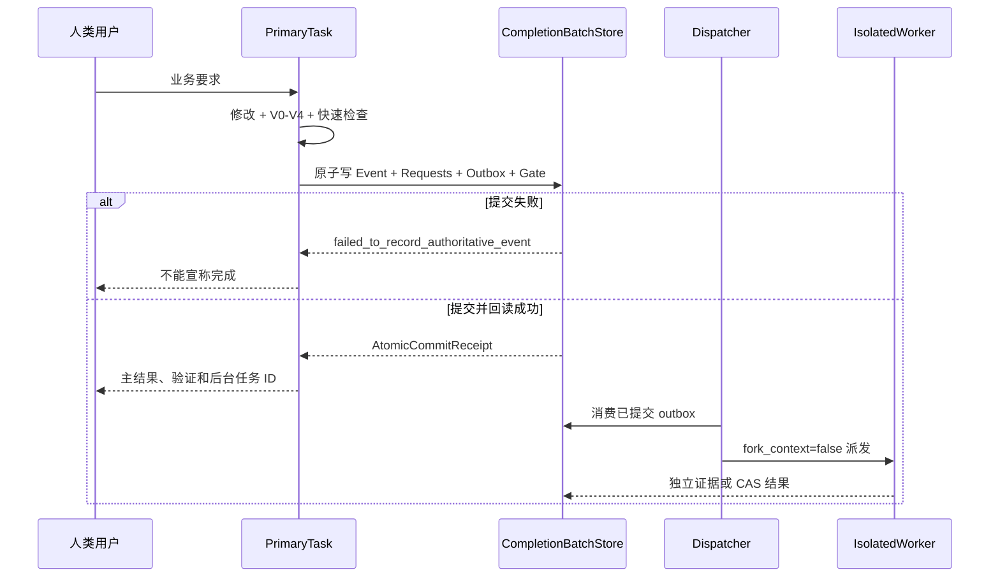

# 模块与领域设计

## 文档控制

| 项目 | 内容 |
|---|---|
| 文档 ID | `DESIGN-MODULE-001` |
| 正式版本 | `v3.1.0` |
| 来源候选 | `TASK-DESIGN-001-R019` |
| 发布事务 | `DESIGN-RELEASE-TX-R019-G001` |
| 负责人 | `HUMAN_ARCHITECTURE_DOMAIN_LEAD` |
| 修改 / 审核 / 批准 | `uroborus` / `uroborus` / `uroborus` |
| 状态 | 已批准并生效 |
| 上游 | `system-architecture`、`PRD` |
| 下游 | `data-design`、`api-design`、`frontend-design`、`requirements-matrix` |

## 文档职责

- 允许保存：领域边界；模块 owner；产品表面；服务；纵向业务流；依赖规则。
- 禁止保存：按数据库接口页面拆三套目录；无 owner 共享模块；任务状态。
- 主要读者：架构、前后端、数据、测试。

## 正式内容

**项目名称：** 山海工枢 / shanforge
**文档状态：** `v2` 架构细化总表
**负责人：** 仓库维护者
**主要读者：** 架构 | 平台开发 | 业务 Agent 开发 | 测试
**上游输入：** 系统架构 | 平台架构设计 | 模块边界
**下游输出：** 接口骨架 | 模块实现 | 测试计划
**最后更新：** 2026-04-15

## 1. 定稿原则

这份文档是当前分层、领域归属和接口 owner 的唯一细化入口。

正式依赖链只有一条：

```text
用户界面层 -> 接口/网关层 -> 业务调度层 -> 业务模型层 -> 基础能力层 -> 基础设置层
```

正式 owner 规则只有一条：

```text
每一层只拥有自己的业务逻辑；调用下层时，由调用方定义接口。
```

因此：

- 接口/网关层定义它依赖的应用用例接口。
- 业务调度层定义它依赖的领域服务接口。
- 业务模型层定义它依赖的基础能力接口。
- 基础能力层定义它依赖的基础设置 provider 接口。
- 基础设置层只做实现，不拥有上层逻辑和接口。

## 2. 六层总表

| 层      | 作用                | owner 逻辑                                | 下行依赖                   |
| ------ | ----------------- | --------------------------------------- | ---------------------- |
| 用户界面层  | Web、CLI Host、人机交互 | 页面、命令体验、交互编排                            | 接口/网关层 API / Protocol Gateway |
| 接口/网关层 | API 与协议收口 | 请求绑定、协议转换、出入参归一化                        | 业务调度层应用用例              |
| 业务调度层  | 用例编排、事务边界、流程协同    | run app、describe workflow、query session | 业务模型层领域服务              |
| 业务模型层  | 平台业务规则与领域逻辑       | 记忆、会话、流程、上下文、审批、委派、响应                   | 基础能力层统一能力              |
| 基础能力层  | 通用技术能力抽象          | 文件、存储、检索、模型、工具、规则源、时间、工作区等能力编排          | 基础设置层 provider         |
| 基础设置层  | 真实实现              | 文件系统、数据库、SDK、外部系统、容器装配                  | 无                      |

## 3. 每层领域模块细化

### 3.1 用户界面层

本仓当前不实现完整 UI，但正式宿主域要明确：

| 领域模块 | 说明 |
|---|---|
| `web_console` | Web 项目中的页面、会话交互、结果展示 |
| `cli_frontend` | 最终用户命令体验、参数组织、输出排版 |
| `automation_host` | 自动化触发界面、定时任务宿主 |

### 3.2 接口/网关层

| 领域模块 | 说明 | 代码落点 |
|---|---|---|
| `runtime_gateway` | 运行 Agent/App/Workflow 的统一入口 | `src/access/api/` |
| `app_gateway` | app materialize / describe 入口 | `src/access/api/` |
| `workflow_gateway` | workflow describe / choose 入口 | `src/access/api/` |
| `session_gateway` | session 查询与调试入口 | `src/access/api/` 目标接口 |
| `memory_gateway` | recall / explain / archive query 入口 | `src/access/api/` 目标接口 |
| `capability_gateway` | capability catalog / inspection 入口 | `src/access/api/` 目标接口 |
| `gateway_binding` | 原始协议与内部请求的绑定 | `src/access/ports/` |

### 3.3 业务调度层

| 领域模块 | 说明 | 当前或目标落点 |
|---|---|---|
| `app_application` | 编译、加载、校验 app | `src/application/app_compilation/` |
| `workflow_application` | workflow 选择、描述、入口编排 | `src/application/workflow_resolution/` |
| `session_application` | session 打开、恢复、查询、结束编排 | `src/application/session/` 目标细化 |
| `memory_application` | 调用 memory 领域服务完成 prepare / distill / explain | `src/application/` 目标细化 |
| `capability_application` | capability 查询与运行用例编排 | `src/application/` 目标细化 |
| `approval_application` | 高风险动作审批流程编排 | `src/application/` 目标细化 |
| `delegation_application` | 子任务委派和结果汇总编排 | `src/application/` 目标细化 |
| `response_application` | 最终输出装配与查询编排 | `src/application/` 目标细化 |
| `execution_application` | 组合上面各领域服务完成最终运行 | `src/application/execution/` |

### 3.4 业务模型层

这里是平台自身的业务逻辑 owner 层。

| 领域模块 | 说明 | 当前或目标落点 |
|---|---|---|
| `agent_app` | AgentApp、Manifest、业务声明 | `src/domain/agent_app/` |
| `workflow` | WorkflowDefinition、step 规则、状态推进 | `src/domain/workflow/` |
| `session` | session 生命周期、ledger、artifact 归属 | `src/domain/session/` |
| `memory` | recall、promotion、distill、archive、explainability | `src/domain/memory/` |
| `context` | 上下文组装规则、segment 规划、预算裁剪策略 | `src/domain/context/` |
| `model` | ModelPolicy、模型选择规则、推理预算策略 | `src/domain/model/` 与 `src/domain/agent_app/policies.py` |
| `capability` | capability 声明、风险级别、输入输出契约 | `src/domain/capability/` |
| `approval` | 审批规则、permit 判定、审计语义 | `src/domain/approval/` |
| `delegation` | 子任务语义、child result 合并规则 | `src/domain/delegation/` |
| `response` | 平台统一响应、结构化结果、evidence 输出 | `src/domain/response/` |

业务模型层的补充子域，当前先作为上面领域内部细化，不单独拉新大目录：

- `profile_resolution`
- `workspace_rule_bundle`
- `session_archive`
- `memory_dataset`
- `artifact_reference`

### 3.5 基础能力层

基础能力层不拥有平台业务逻辑，只拥有通用能力抽象。

| 领域模块 | 说明 | 当前或目标落点 |
|---|---|---|
| `file_access` | 文本、JSON、目录、路径资源访问 | `src/runtime/` 目标模块 |
| `structured_storage` | 结构化记录读写、分页查询、按键查找 | `src/runtime/` 目标模块 |
| `blob_storage` | 大对象或附件读写 | `src/runtime/` 目标模块 |
| `search_index` | 结构化搜索、全文检索、归档查询 | `src/runtime/` 目标模块 |
| `vector_index` | 语义检索、向量召回 | `src/runtime/` 目标模块 |
| `llm_gateway` | 文本生成、结构化生成、模型路由 | `src/runtime/llm/` |
| `embedding_gateway` | 向量化能力 | `src/runtime/` 目标模块 |
| `tool_execution` | 通用工具/能力执行 | `src/runtime/capability/` 目标收口 |
| `workspace_access` | workspace root、路径白名单、资源定位 | `src/runtime/ports/workspace.py` 目标扩展 |
| `rule_source` | 规则文件与工作区规则加载 | `src/runtime/` 目标模块 |
| `profile_source` | profile 解析与加载 | `src/runtime/` 目标模块 |
| `approval_channel` | 人工审批通道、审批后端适配 | `src/runtime/` 目标模块 |
| `delegation_transport` | worker/backend 派发与回收 | `src/runtime/delegation/` |
| `shell_gateway` | shell 执行能力 | `src/runtime/` 目标模块 |
| `git_gateway` | git 读写能力 | `src/runtime/` 目标模块 |
| `http_gateway` | 对外 HTTP 调用能力 | `src/runtime/` 目标模块 |
| `clock_identity` | 时间、ID、trace 生成 | `src/runtime/` 目标模块 |

### 3.6 基础设置层

| 实现分区 | 说明 | 当前落点 |
|---|---|---|
| `provider_adapters` | OpenAI、Anthropic、HTTP、shell、git、workspace 等外部实现 | `src/adapters/` |
| `storage_backends` | JSONL、数据库、索引、blob storage 等持久化实现 | `src/storage/` |
| `container_bootstrap` | settings、provider 选择、实现装配 | `src/bootstrap/` |

## 4. 接口 owner 总表

### 4.0 用户界面层消费的契约

用户界面层不向下定义本仓代码接口，但必须消费下列稳定入口：

| UI 宿主契约 | 说明 | 对应下层接口 |
|---|---|---|
| `RuntimeGatewayClient` | 发起运行、读取执行结果 | `RuntimeExecutionUseCase` |
| `WorkflowGatewayClient` | 查看 workflow 描述与可选项 | `WorkflowDescriptionUseCase` |
| `SessionGatewayClient` | 查询 session、回放、诊断 | `SessionInspectionUseCase` |
| `MemoryGatewayClient` | 查询 recall 和 explainability | `MemoryInspectionUseCase` |
| `CapabilityGatewayClient` | 查看 capability 目录与风险级别 | `CapabilityCatalogUseCase` |
| `PlatformHealthClient` | 健康检查、就绪性检查 | `PlatformHealthUseCase` |

### 4.1 接口/网关层拥有的接口

这些接口描述 access 对 application 的依赖。

| 接口 | 作用 | 代码文件 |
|---|---|---|
| `AgentAppMaterializationUseCase` | materialize app | `src/access/ports/application_use_cases.py` |
| `WorkflowDescriptionUseCase` | describe workflow | `src/access/ports/application_use_cases.py` |
| `RuntimeExecutionUseCase` | run app / run manifest | `src/access/ports/application_use_cases.py` |
| `SessionInspectionUseCase` | query session | `src/access/ports/application_use_cases.py` |
| `MemoryInspectionUseCase` | memory recall / explain | `src/access/ports/application_use_cases.py` |
| `CapabilityCatalogUseCase` | list capabilities | `src/access/ports/application_use_cases.py` |
| `PlatformHealthUseCase` | health / readiness | `src/access/ports/application_use_cases.py` |

### 4.2 业务调度层拥有的接口

这些接口描述 application 对 domain 的依赖。

| 接口 | 作用 | 代码文件 |
|---|---|---|
| `AgentAppDomainService` | app 编译/校验 | `src/application/ports/domain_services.py` |
| `WorkflowDomainService` | workflow 选择与状态入口 | `src/application/ports/domain_services.py` |
| `SessionDomainService` | open / complete / fail session | `src/application/ports/domain_services.py` |
| `MemoryDomainService` | prepare / recall / distill / explain | `src/application/ports/domain_services.py` |
| `ContextDomainService` | compile context | `src/application/ports/domain_services.py` |
| `ModelDomainService` | model policy resolve | `src/application/ports/domain_services.py` |
| `CapabilityDomainService` | capability catalog / invoke | `src/application/ports/domain_services.py` |
| `ApprovalDomainService` | approval / sandbox decision | `src/application/ports/domain_services.py` |
| `DelegationDomainService` | plan / dispatch / collect / merge | `src/application/ports/domain_services.py` |
| `ResponseDomainService` | normalize response | `src/application/ports/domain_services.py` |

### 4.3 业务模型层拥有的接口

这些接口描述 domain 对基础能力层的依赖。

| 领域 | 主要下行接口文件 |
|---|---|
| `agent_app` | `src/domain/agent_app/ports.py` |
| `workflow` | `src/domain/workflow/ports.py` |
| `session` | `src/domain/session/ports.py` |
| `memory` | `src/domain/memory/ports.py` |
| `context` | `src/domain/context/ports.py` |
| `model` | `src/domain/model/ports.py` |
| `capability` | `src/domain/capability/ports.py` |
| `approval` | `src/domain/approval/ports.py` |
| `delegation` | `src/domain/delegation/ports.py` |
| `response` | `src/domain/response/ports.py` |

### 4.4 基础能力层拥有的接口

这些接口描述 runtime/basic-capability 对基础设置 provider 的依赖。

| provider 接口分组 | 代码文件 |
|---|---|
| 数据访问 provider | `src/runtime/ports/data_access.py` |
| AI provider | `src/runtime/ports/ai_backends.py` |
| 源数据 provider | `src/runtime/ports/source_backends.py` |
| 执行 backend provider | `src/runtime/ports/execution_backends.py` |

### 4.5 基础设置层实现责任

基础设置层不再新增上层逻辑接口，但会实现两类接口：

- domain-owned 持久化端口：例如 session / artifact / memory / evidence / dataset 相关仓储接口
- runtime-owned provider 接口：数据访问、AI、源数据、执行 backend 等 provider 接口

## 5. 领域接口清单

### 5.1 `agent_app` 领域

- 上行实现：`AgentAppDomainService`
- 下行能力：
  - `AgentAppCatalogPort`
  - `AgentAppSchemaValidationPort`

### 5.2 `workflow` 领域

- 上行实现：`WorkflowDomainService`
- 下行能力：
  - `WorkflowDefinitionCatalogPort`
  - `WorkflowRuleEvaluationPort`
  - `WorkflowInstructionRenderPort`

### 5.3 `session` 领域

- 上行实现：`SessionDomainService`
- 下行能力：
  - `SessionLedgerPort`
  - `SessionArtifactStorePort`
  - `SessionClockPort`
  - `SessionIdentityPort`

### 5.4 `memory` 领域

- 上行实现：`MemoryDomainService`
- 下行能力：
  - `MemoryRecordRepositoryPort`
  - `EvidenceRepositoryPort`
  - `MemoryDatasetRepositoryPort`
  - `MemoryArchiveQueryPort`
  - `MemoryProfileResolverPort`
  - `MemoryRuleBundlePort`
  - `MemoryReasoningPort`
  - `MemorySemanticSearchPort`

### 5.5 `context` 领域

- 上行实现：`ContextDomainService`
- 下行能力：
  - `ContextRuleBundlePort`
  - `ContextTokenEstimationPort`
  - `ContextRenderingPort`

### 5.6 `model` 领域

- 上行实现：`ModelDomainService`
- 下行能力：
  - `ModelInvocationPort`
  - `ModelMetadataPort`
  - `EmbeddingGenerationPort`

### 5.7 `capability` 领域

- 上行实现：`CapabilityDomainService`
- 下行能力：
  - `CapabilityCatalogPort`
  - `CapabilityExecutionPort`
  - `CapabilityWorkspacePort`
  - `CapabilityHttpPort`
  - `CapabilityShellPort`
  - `CapabilityGitPort`

### 5.8 `approval` 领域

- 上行实现：`ApprovalDomainService`
- 下行能力：
  - `ApprovalRequestPort`
  - `ApprovalDecisionQueryPort`
  - `ApprovalAuditPort`

### 5.9 `delegation` 领域

- 上行实现：`DelegationDomainService`
- 下行能力：
  - `DelegationWorkerDispatchPort`
  - `DelegationResultCollectionPort`
  - `DelegationWorkspacePort`

### 5.10 `response` 领域

- 上行实现：`ResponseDomainService`
- 下行能力：
  - `ResponseSchemaValidationPort`
  - `ResponseArtifactResolverPort`
  - `ResponseUsageAccountingPort`

## 6. 当前实现迁移原则

当前仓库已经存在一批实现代码，但从现在开始，目标结构按这份总表收口：

- 不再把记忆、上下文、审批、委派这类平台业务逻辑放在基础能力层 owner 位置。
- 基础能力层只保留通用技术能力抽象与实现编排。
- 业务逻辑 owner 一律回到业务模型层。
- 这轮先立接口，不做实现迁移。

## 7. 本轮交付范围

本轮只做两件事：

1. 用这份文档把层、领域、接口 owner 一次定稿。
2. 在代码里新增接口契约骨架，不写任何实现。

---

**项目名称：** 山海工枢 / shanforge
**文档状态：** `v2` 模块边界基线
**负责人：** 仓库维护者
**主要读者：** 架构 | 平台开发 | 业务 Agent 开发 | 测试
**上游输入：** 系统架构 | 平台架构设计
**下游输出：** API 设计 | 实施计划 | 测试计划
**关联 ID：** `MOD-001` ~ `MOD-014`, `REQ-001` ~ `REQ-010`
**最后更新：** 2026-04-15

## 1. 边界原则

- 系统只有一套正式分层口径：用户界面层、接口/网关层、业务调度层、业务模型层、基础能力层、基础设置层。
- `ports` 跟随消费者所在层定义，不构成额外层次。
- 基础设置层统一收口到 `src/settings/`；层内可再按实现领域和支撑模块分组，但不构成额外层次。
- 依赖只能单向向下：`access -> application -> domain -> runtime/basic-capability -> settings`。
- 业务调度层只做编排，不吸收基础能力层和基础设置层细节。
- 业务模型层拥有业务逻辑；基础能力层只提供通用技术能力；基础设置层只负责实现和装配。
- `session ledger` 是第一事实源，记忆只能作为派生资产存在。

## 2. 模块归属矩阵

| 模块 | 主归属层 | 可触达层 | 说明 |
|---|---|---|---|
| `MOD-001` Business Agent Apps | 业务模型层 | 业务调度层 | 业务 app、workflow、输出契约 |
| `MOD-002` Application Use Cases | 业务调度层 | 接口/网关层 | 平台薄编排层 |
| `MOD-003` Agent Domain Model | 业务模型层 | 业务调度层 | 稳定领域对象与规则 |
| `MOD-004` Workflow | 业务模型层 | 基础能力层 | 业务流程规则归领域，运行辅助走基础能力 |
| `MOD-005` Model | 业务模型层 | 基础能力层、基础设置层 | 模型策略归领域，调用能力走下层 |
| `MOD-006` Capability | 业务模型层 | 基础能力层、基础设置层 | 能力声明、风险和结果语义归领域 |
| `MOD-007` Memory | 业务模型层 | 业务调度层、基础能力层、基础设置层 | 记忆业务逻辑 owner |
| `MOD-008` Approval | 业务模型层 | 基础能力层、基础设置层 | 审批语义与规则归领域 |
| `MOD-009` Delegation | 业务模型层 | 基础能力层、基础设置层 | 委派语义与合并规则归领域 |
| `MOD-010` Session & Evidence | 业务模型层 | 基础能力层、基础设置层 | 会话、档案和证据模型归领域 |
| `MOD-011` Interface & Gateway Entry | 接口/网关层 | 业务调度层 | API、CLI、HTTP、MCP 入口收口 |
| `MOD-012` Consumer-Owned Ports | 跟随消费者 | 接口/网关层、业务调度层、业务模型层、基础能力层 | 消费者向下依赖接口 |
| `MOD-013` Base Setting Implementations | 基础设置层 | 基础能力层 | provider、store、外部系统、容器装配 |
| `MOD-014` Response | 业务模型层 | 基础能力层 | 标准响应语义归领域 |

## 3. 允许依赖

| 层 / 模块 | 允许依赖 | 禁止依赖 |
|---|---|---|
| 接口/网关层 | 业务调度层、自己拥有的 ports | 业务模型内部实现、基础能力实现、基础设置细节 |
| 业务调度层 | 业务模型层、自己拥有的 ports | runtime provider、settings 实现 |
| 业务模型层 | 基础能力层能力接口、自己拥有的 ports | UI、gateway、adapter、store、SDK |
| 基础能力层 | 基础设置 provider ports | 业务编排、业务规则判断、UI 协议 |
| 基础设置层 | 业务模型层持久化 ports、基础能力层 provider ports | 业务编排、业务规则分支、UI 协议 |

## 4. `ports` 的正式边界

`ports` 的正式定义是：

```text
消费者定义的向下依赖接口
```

因此：

- `src/access/ports/` 属于接口/网关层。
- `src/application/ports/` 属于业务调度层。
- `src/domain/*/ports.py` 属于业务模型层。
- `src/runtime/ports/` 属于基础能力层。
- `MOD-012` 只是这一设计原则的汇总编号，不代表额外新层。

## 5. 基础设置层的正式边界

基础设置层只做下面三类事：

- 提供真实资源：文件系统、数据库、本地 JSONL、provider SDK、远程系统。
- 实现上层声明的持久化与 provider 端口：domain-owned repository/store ports，以及 runtime-owned provider/backend ports。
- 进行装配选择：settings、container、runtime binding。

基础设置层不能做的事：

- 决定业务 app 如何执行。
- 决定 workflow 的业务分支。
- 决定记忆是否晋升、审批是否放行这类上层规则。
- 向上泄漏 SDK 原始对象或底层数据库语义。

## 6. 典型禁止耦合

- 用户界面层或外部 Web 项目直接调用 `src/runtime/` 内部对象。
- 接口/网关层直接调用 `src/settings/` 具体实现。
- 业务调度层直接选择 `JSONL`、`SQLite`、`OpenAIProvider` 之类的实现。
- 业务模型层直接持有 SDK、数据库驱动或网关协议对象。
- 基础能力层直接依赖外部 UI 协议。
- 基础设置层出现业务规则分支。
- 记忆领域绕过 session facts 直接覆盖人工确认事实。

## 7. 迁移与实现规则

- 旧文件合同、遗留宿主桥接和实现细节脚本统一归入基础设置层实现区；面向用户的 CLI host / launcher 仍属于用户界面层或外部入口。
- 统一界面必须保留在调用方所在层，不得被基础设置层反向拉平。
- 新增能力时先决定它属于哪一层，再决定它属于哪个领域，最后再决定目录位置。
- 实现顺序固定为：定义 access 用例接口 -> 定义 application 领域服务接口 -> 定义 domain 能力接口 -> 定义 runtime provider 接口 -> 实现 settings。

## 8. 版本记录

| 版本 | 日期 | 变更内容 |
|---|---|---|
| `v2.0` | 2026-04-13 | 重写模块边界，按平台内核、业务 App、ports、adapters 重新定义依赖规则 |
| `v2.1` | 2026-04-14 | 建立六层边界基线 |
| `v2.2` | 2026-04-15 | 收口为单向依赖链，并把业务 owner 统一回业务模型层 |

---

## 22. WP-07 交付拓扑、纵向切片与 BusinessField 追踪

### 22.1 树负责归属，边负责矩阵关系

目录和导航必须是一棵树，否则人和 AI 都难以确定唯一 owner；软件关系本身是矩阵，不能靠复制目录表达。`TOPOLOGY-DELIVERABLE-001` 因此同时定义：

1. 每个 DeliverableNode 只有一个 `canonical_parent_node_id`，用于导航、owner、路径和版本归属。
2. 产品表面消费服务、服务实现领域、模块实现领域、模块参与切片等多对多关系使用类型化 DependencyEdge，不复制节点或文档。
3. Project → Product Surface → Service → Domain → Module → Vertical Slice → Task 是端到端业务路径的类型链，不强制把同一服务复制到每个前端目录下。

Project 可直接拥有产品表面、服务、领域、纵向切片和横向基线；产品表面拥有前端模块，服务拥有后端模块，领域可拥有纯领域模块，纵向切片拥有 TaskCard。所有跨树关系通过 `consumes/realizes/implements/contributes_to/decomposes_to/depends_on/shares_baseline/publishes_contract/owns_data/verifies` 等边表达。

DeliverableNode 只保存所有节点共有字段，不能代替类型详情。`typed_detail_binding_contract` 要求每个 ProductSurface、Service、Module、VerticalSlice、Task 和 HorizontalBaseline 节点恰好解析到一个同 ID、同类型的 detail 记录；反向也要求每个 detail 恰好对应一个现存节点。缺 detail 只允许一个绑定该 node ID、含原因、影响、替代方案、owner 和 ReviewerDecision 的结构化 N/A。每个 `na_id` 必须唯一，每条 N/A 必须被恰好一个适用节点消费，且该节点不能同时存在 detail；整体省略、重复、孤立、ID/类型错配、未被节点消费或与 detail 并存都拒绝。

### 22.2 领域和模块不是固定上下级

Domain 是业务语义、术语、不变量和所有权边界，不等于代码目录、微服务或前端工程。Module 是某个产品表面、服务或领域中的实现单元，必须引用一个主领域，可通过受控引用关联次领域。

- 后端模块说明所属服务、主领域、职责、不变量、应用用例、接口 owner、依赖、数据所有权、错误和测试边界。
- 前端模块说明所属产品表面、主领域、业务能力、页面/路由、组件边界、状态来源、API 契约、共享策略和测试边界。
- 共享模块使用结构化创建契约，必须已有至少两个登记消费者、稳定契约引用、owner assignment 和版本策略引用；“以后可能复用”不足以创建共享层。
- 跨模块调用必须使用受控接口；共享数据库列或隐式全局状态不能充当接口。

因此后端和前端都分模块，但分法不同：后端围绕领域、用例、服务和适配器；前端先按产品表面，再按业务能力/领域组织页面、状态和组件。

### 22.3 产品表面和服务分别登记

Web、移动 App、小程序、每个管理后台和 CLI 都是独立 ProductSurface；多个管理后台必须使用不同稳定 ID、受众、权限、页面能力、构建和验收。后端服务、API 服务、网关、worker、定时任务和集成适配器都是独立 Service，分别登记职责、领域、模块、数据 owner、接口、依赖、部署、监控、恢复和发布状态。五类产品表面、六类服务和第二个管理后台都必须有可执行登记正例；未知 subtype 必须拒绝。

每个产品表面和服务可以独立设计、计划、实现、测试和发布，同时通过 BusinessField、API、权限、设计系统和纵向切片保持共同需求一致。最终交付报告必须按这些节点分别列完成、未完成、验证、版本和发布状态。

### 22.4 任务以纵向业务切片为主

VerticalSlice 从用户或业务结果开始，贯通 Requirement、UX、UI、ProductSurface、API、Application、Domain、Database、Permission、Test 和 Release。先创建可独立验收的切片，再在同一 TaskCard 的 ActionSpec 中安排数据库、接口、前端、多端、测试、文档和发布动作。

禁止先建立“全部数据库任务”“全部 API 任务”“全部 UI 任务”三棵互不验收的树。读文件、运行命令、写测试和记录 evidence 是 Action，不单独创建 TaskCard。P0/P1 切片的适用层必须完整；N/A 需保存层、原因、替代验证、Reviewer 决定和当前 subject hash。

任务目录按 `WorkItem → VerticalSlice/TaskCard → drafts/evidence/reviews/reports` 归属，不按数据库/API/UI 建业务任务目录。产品源码仍可按真实前端表面和后端服务建立模块目录，但每个模块必须反向引用 `module_id/domain_id/slice_id`。

### 22.5 横向基线与全局文档关系

横向基线包含项目、领域、架构、数据、API、UI 设计系统、质量、安全隐私和发布运维。它们服务多个纵向切片，不被复制进每个模块目录。基线变更可以有独立 TaskCard，但必须生成 BaselineImpact，列出受影响产品表面、服务、领域、模块、切片、BusinessField、失效 Artifact 和必需任务。

正式 `docs/` 只保留登记 owner 的最小文档；全局文档通过 Catalog ID、Requirement ID、Domain/Module ID、Slice ID 和 BusinessField ID 与具体模块设计关联。讨论不能为了表达一个矩阵关系就新增 Markdown；完整拓扑和关系矩阵以机器 Catalog 为唯一事实源，Markdown 只解释阅读方式和关键取舍。

### 22.6 BusinessField 唯一规范定义

`FIELD-TRACE-BUSINESS-001` 要求每个 BusinessField 保存稳定 ID、业务名称和含义、owner、需求、规范类型、格式/单位/精度、枚举、可空、默认、来源、敏感级别、生命周期、校验、权限、各层映射、变更历史和证据。技术名称可以不同，但必须引用同一 BusinessField ID。

必需追踪层为：Requirement、Domain、Database、API/Event、UI、Validation、Permission、Log/Audit、Test。兼容校验必须从每层真实 `technical_type`、必填/可空值、owner Artifact、默认、约束、权限和 validation refs 推导规范值，再和 BusinessField 比较；`normalized_contract` 只是非权威派生摘要，不能掩盖实际字段漂移。数据库结构不能反向定义公共 API 语义，UI 标签也不能代替业务含义。

### 22.7 字段变更和 TraceBreak

字段新增、删除、改名、改类型、改枚举、改权限或改敏感级别时生成 BusinessFieldImpact。七类 change kind 分别使用封闭影响集合，ImpactList 强制绑定旧/新 contract hash、受影响映射和 Artifact、失效批准、任务、迁移/兼容、Review 和验证；删除任一必填字段都必须失败。稳定 BusinessField ID 在技术改名时不变。

缺映射、含义漂移、类型/可空/默认/枚举不一致、校验变弱、权限扩大、敏感级别丢失、日志脱敏缺失、测试缺失或未经评审的 N/A 都形成 TraceBreak。P0/P1 进入实现前，未解释或无 owner TraceBreak 必须为 0。

### 22.8 完整字段链参考

CP-03 使用 `BF-HIGH-RISK-AUTH-VALID-UNTIL-001` 作为完整参考链：

| 层 | 映射 | 必须保持的语义 |
|---|---|---|
| Requirement | 高风险/PR 授权有效期 | 每次人类明确授权，严格晚于求值时刻 |
| Domain | `HumanAuthorization.validUntil` / `OffsetDateTime` | 必填、明确时区、不能由 AI 生成 |
| Database | `human_authorization.valid_until` / 带时区时间戳 | NOT NULL，晚于授权时间，支持活动未消费授权查询 |
| API | `valid_until` / `string date-time` | 必填，拒绝无时区和可解析但非 ISO 值 |
| UI | “授权有效期”时区感知输入/只读显示 | 人类批准前可编辑，授权后只读，显示时区和过期状态 |
| Validation | `parseStrictTimezoneIso8601` | 合法日历、偏移不超过 14:00、精确解析、未来比较 |
| Permission | `HUMAN_APPROVER.write_valid_until` | 只有有效人类批准人可写，AI 只能读取候选决定 |
| Log/Audit | 授权过期求值事件 | 追加授权 ID、求值时刻、结果和 hash，不记录 secret |
| Test | high-risk authorization 边界矩阵 | 未来 ISO 允许；过期等待；非 ISO、无时区、非法日期/偏移拒绝 |

该参考链是运行时实现的设计契约，不冒充当前已经存在数据库或 UI；它证明同一字段如何在未来实现中保持一致，并直接复用 CP-02 R005 的严格时间对抗测试。

### 22.9 覆盖闭合与 CP-03

WP-07 同步核对前序覆盖，发现 WP-04 至 WP-06 的需求覆盖仍保留占位或 deferred 状态。43 条 WP-04 至 WP-07 覆盖现已逐项指向真实 metadata、Method、ToolPolicy、ResponseTemplate、Topology 或 FieldTrace 对象；能力缺口保留“已登记人工 owner”语义，不伪称专业 Skill 已实现。

CP-03 R001 独立评审发现 3 Critical、6 Important、1 Minor，结论为 `changes_requested / 30`。第 1 轮整改要求：裸布尔权限自证、跨工具 PR 授权、伪造 normalized 字段、通用 Skill/Prompt、回复假报、拓扑/影响 schema 清空和 stdout 截断都必须有真实负例。完整 `cp03@0.3.0`、受影响 `cp02`、WP-05/WP-06 阶段和输出管道验证全部通过后，才能冻结 R002 并由同一 Reviewer Russell 只读复审。作者 Green 不等于 CP-03 或 CP-02 恢复通过，当前也没有人工设计批准或正式发布资格。

R002 复审关闭了 6 项，仍以 `changes_requested / 58` 保留 `CP03-C-001`、`CP03-I-003`、`CP03-I-004`、`CP03-M-001`，CP-02 R006 当前候选影响也因同一来源根问题退回。第 2 轮整改增加外部 TrustAnchorRegistry 和来源根 attestation、真实 Artifact/Verification ReferenceRegistry、拓扑节点与 typed-detail 双向一一绑定，并把状态证据更新到当前轮次。R003 是本检查点最后一个自动复审候选；若同一 Reviewer 再次退回，必须停止交人工决定。作者 Green、R003 冻结或 CP-02 R007 影响快照都不等于 Reviewer approved、人工设计批准或正式发布。

R003 最终自动复审为 `changes_requested / 64`，关闭 `CP03-M-001`，仍开放来源登记同调用边界、引用登记/退出码结果不一致和孤立 Reviewer N/A 三项。R004 定向整改把三项全部关闭，同一 Reviewer Russell 给出 `approved / 100`，CP-02 R008 当前候选影响也通过；用户随后确认关闭 CP-03 并授权执行 WP-08 到下一人工确认门。

## 27. R015 主任务、系统侧派生任务与风险分级验证完整设计

### 27.1 输入、目标和继承关系

R015 章节保留主任务、系统侧派生任务和风险分级验证的有效设计语义；其旧输入版本和归档候选只属历史前像。R017 当前权威输入统一取第 2.1 节冻结的 PRD v3.3.0、需求矩阵 v3.3.0、文档索引 v1.3.0、P017 R004 和 WP-RB-01 基线闭包，任何旧发布资格不得恢复。

本节在同一完整设计中补齐 `GAP-AI-013`，不创建同义 Workflow。Workflow 总数保持 123；为 `WF-CTL-001`、`WF-CTL-010`、`WF-PLAN-003`、`WF-QA-001..013`、`WF-DEL-001`、`WF-DEL-008` 共 18 条现有 Workflow 增加异步执行合同。机器 Catalog 必须展开 18 个实际 ID，不允许只保存范围字符串。机器定义位于 `TOP-SPEC-WORK-SESSION-001/primary_task_async_boundary_contract`。

### 27.2 同步主任务边界

主任务同步链只有四段：业务动作、V 等级要求的快速前置检查、构造完成批次、原子提交并回读。`PrimaryTaskCompletionBatch/v1` 在同一事务中写入：

1. 一条不可变 `AuthoritativeEvent/v1`；
2. 零到多条预生成 task ID 的 `DurableTaskRequest/v1`；
3. 与每个请求一一对应的 `DispatchOutbox/v1`；
4. 当前父任务的 `VerificationGate/v1`。

事务隔离至少达到串行化或单写者等价语义。提交前外部观察不到任何对象；提交后四类对象全部可见。提交回读必须逐项核对 batch ID、task ID、artifact hash、Gate generation 和幂等键。失败时返回 `failed_to_record_authoritative_event`，不得宣称主结果已登记，不得返回虚假后台 task ID，也不得留下只有事件或只有 Gate 的半状态。事务成功后主会话立即组装回复，不等待 dispatcher 或 worker。



### 27.3 数据对象、约束和幂等

| 对象 | 主键/唯一键 | 关键字段 | 不变量 |
|---|---|---|---|
| `AuthoritativeEvent/v1` | `event_id`；项目内 `sequence` 唯一 | project、parent task、artifact refs/hash、verification summary、occurred_at | 只追加，不被投影覆盖 |
| `DurableTaskRequest/v1` | `task_id`；`idempotency_key` 唯一 | kind、parent IDs、source range/head、read/write set、target Gate | 必须与 event 同批提交 |
| `DispatchOutbox/v1` | `outbox_id`；request 一一对应 | request ID、attempt、next_at、dispatch status | 只有已提交记录可派发 |
| `VerificationGate/v1` | parent task + gate ID | artifact hash、test plan hash、generation、state | CAS 全匹配才转换 |
| `SystemSideTask/v1` | `task_id` | requested/current head、aliases、retry、evidence | 不继承聊天和高风险授权，不计产品进度 |

同一项目、同一投影类型且尚未开始的任务可以按 `coalesce_key` 合并。`requested_head` 保留首次值，`current_target_head` 只允许单调增加；旧幂等键成为 alias 并解析到同一个存续 task ID。被合并请求进入不可执行终态 `merged_into_survivor`，必须保存 `merged_into_task_id`，不能重新进入 queued；只有存续任务继续执行。任务开始后不得就地扩大读写集，只能创建后继任务。重试只追加 attempt；超过阈值进入 `dead_letter` 并在系统维护队列可见，不能退回主会话同步执行。

### 27.4 上下文、权限和完成率隔离

系统侧任务固定 `fork_context=false`，父聊天消息数为 0。交接信封不超过 8 KiB，只包含 project/task ID、artifact hash、source event range、最小 read/write set、策略版本和引用；不得复制父聊天、原始事件正文、无关文件或父工具日志。投影 worker 只能写登记的投影路径/表，回归 worker 默认只读代码并写验证证据。两者都不得继承 Commit、Push、PR、Merge、部署或数据破坏授权。

系统侧任务是可追踪任务，但 `product_progress_denominator_contribution=0`、`product_progress_completed_contribution=0`。记忆/进度失败不改变主任务业务状态；RegressionTask 只可改变验证 Gate。看板把它们放入独立“系统维护/验证队列”，不污染 WBS、里程碑、燃尽或产品完成率。

### 27.5 进度快查的 H/P 算法

查询开始原子捕获项目和权威头 `H`，随后读取投影头 `P`。基础快照必须完整绑定项目、事件 hash 链、来源注册表、事件 schema、reducer、投影 schema、基础内容 hash 和可逆贡献谱系。

```text
if P == H and project/hash-chain/registry/schema/reducer/content/lineage bindings all validate:
    return validated persisted snapshot
if P < H and bindings compatible:
    freeze events (P, H]
    if count <= 1000 and encoded_bytes <= 8 MiB and reducer_time <= 3000 ms:
        apply the same pure versioned reducer read-only
        verify result hashes; return ProjectProgressSnapshot/v2(persisted=false, as_of_H=H)
    return projection_lag_exceeds_query_budget
if registry/schema/reducer version or hash drifted:
    enqueue isolated rebuild task; return projection_rebuild_required
if correction targets contribution <= P and reversible lineage is absent:
    enqueue isolated rebuild task; return projection_rebuild_required
if P > H or project mismatches or hash-chain is corrupt or snapshot/increment is incomplete:
    return data_not_ready_or_fact_conflict
```

捕获 `H` 后到达的 `H+1` 不进入本次结果。`P > H`、项目不符、hash 链损坏、快照缺失或增量不完整返回 `data_not_ready_or_fact_conflict`；registry/schema/reducer 漂移或无法撤销的旧贡献返回 `projection_rebuild_required` 并入队独立重建任务。两类原因码不得互换。查询可以入队追平任务，但不能等待它，也不能在查询会话持久化临时叠加。

### 27.6 会话恢复的 H/M 算法

恢复时原子捕获记忆头 `M` 和权威头 `H`，并验证与持久化记忆投影相同的纯函数 reducer 及全部兼容字段。`M=H` 验证通过后产生紧凑上下文且无需因滞后创建任务；只要 `M<H`，无论是否在快速预算内，都先新建或合并独立 `MemoryProjectionTask`，并在回复中返回已持久化 task ID。预算只决定本轮能否同时返回临时上下文：最多 200 条、1 MiB、1,000 ms 且输出不超过 8 KiB 时返回 `MemoryRecoveryContext/v1`；201 条、超过 1 MiB、超过 1,000 ms 或输出超过 8 KiB 时返回 `memory_recovery_not_ready/tail_budget_exceeded`。该投影任务不阻塞回复。`M>H`、hash 损坏或兼容漂移返回 `incompatible_or_corrupt_base`。

恢复会话从不重写记忆、不无界读取尾部、不把旧摘要伪装成当前事实。捕获 `H` 后的事件留给下次恢复。

### 27.7 V0-V4 确定性分类

`ImpactClassificationDecision/v1` 输入是语义 diff、公共契约、依赖闭包、持久化/迁移/事务/并发、安全边界、构建/启动/DI/发布全局影响及可逆性。版本化规则取所有命中项的最高级；代码行数和预计耗时都不是等级输入。

| 等级 | 最低语义边界 | 发布前范围 | 全仓 |
|---|---|---|---|
| V0 | 无行为变化 | 格式、解析、链接和范围检查 | 禁止自动执行 |
| V1 | 私有局部、契约/数据/安全不变 | 定向 + 最近模块 | 禁止自动执行 |
| V2 | 可界定受影响域 | 依赖闭包 + 集成/冒烟 | 不执行 |
| V3 | 公共契约、数据、安全或跨边界但子系统可界定 | 全部受影响子系统及跨边界路径 | 不执行 |
| V4 | 系统级、不可界定、根工具链/启动/发布基础设施、不可逆数据或全局安全边界 | 全仓 + 适用 E2E/安全/迁移/发布检查 | 必须 |

主会话快速预算默认 60 秒。超过预算只把必需测试转成 RegressionTask，不改变 V 等级。人类可提高等级；降低最低等级必须形成有主体、理由、范围、有效期和残余风险的人工风险接受，AI 无权自行降低。

### 27.8 RegressionTask 与 Gate CAS

RegressionTask 输入只含变更包、artifact hash、影响图、VerificationPlan hash 和环境引用。结果枚举固定为 `passed | test_failed | infra_failed | timed_out | cancelled | superseded | incomplete_required_tests`，派发结果与测试结果分开保存。

Gate 更新必须比较 `parent_task_id + gate_id + artifact_hash + test_plan_hash + gate_generation`。只有五项全部匹配、结果为 `passed`、必需测试完整且 skipped/not-run 都为 0，才能从 `verification_pending` 直接推进为 verified。五项匹配且真实测试失败时从 pending 进入 `verification_failed`；基础设施失败、超时、取消或必需测试不完整执行 pending 自保持。任何五元组不匹配的晚到结果只追加 `superseded` 结果证据，当前 Gate 不发生任何转换，状态和 generation 都保持不变。

### 27.9 证据复用与严格失效

`EvidenceReuseKey/v1` 必须逐项绑定：`gate_id`、`artifact_or_candidate_root_sha256`、`impact_policy_version`、`test_selection_plan_sha256`、`required_test_set_sha256`、`test_source_sha256`、`fixture_sha256`、`config_sha256`、`runner_name`、`runner_version`、`runner_sha256`、`dependency_lock_sha256`、`normalized_command`、`environment_attestation_sha256`、`external_dependency_fingerprint`、`passed_count`、`failed_count`、`skipped_count`、`not_run_count`、`evidence_time`。前 15 项也是执行前 `EvidenceExecutionIdentity/v1` 的精确字段集合和固定顺序，按 compact canonical JSON 加 domain separator `shanforge:EvidenceExecutionIdentity/v1\n` 计算 identity hash。任一字段缺失、不可验证、改变或超过 Gate 新鲜度都强制失效，不存在“兼容即可”的第二放行路径。进入发布不自动重跑全仓，只核对制品、必需证据、环境前置和发布专属检查；失效后只重跑对应风险范围，除非当前等级为 V4。

### 27.10 十八条既有 Workflow 的职责变化

| Workflow | R015 新职责 | 不允许发生 |
|---|---|---|
| `WF-CTL-001` | H/M 恢复；任何 M<H 都入队或合并记忆投影，预算内同时返回临时上下文 | 同步重写记忆、无界读尾部或只在超预算时才入队 |
| `WF-CTL-010` | H/P 准确查询、预算内只读叠加、显式滞后状态 | 把 P<H 旧快照标为最新 |
| `WF-PLAN-003` | TaskCard、依赖和并行图；登记 ProjectionTask/RegressionTask、blocking scope、合并和背压 | 抢占 QA-001 的 V0-V4 owner |
| `WF-QA-001` | 测试设计和风险分级；生成 V0-V4、前置检查、发布必需测试和复用决定 | 用行数/耗时降级 |
| `WF-QA-002` | 按计划执行单元测试、边界和不变量 | 无依据扩大到全仓 |
| `WF-QA-003` | 按计划执行模块/数据库/外部边界和失败恢复集成测试 | 跳过已识别事务边界 |
| `WF-QA-004` | 按计划执行请求响应、事件、schema 和版本兼容测试 | 契约变化仍按局部私有变更处理 |
| `WF-QA-005` | 按计划执行组件和前端交互测试 | 忽略状态、权限、语义或焦点 |
| `WF-QA-006` | 按计划执行 E2E 和关键用户旅程 | V0-V3 无依据全量 E2E |
| `WF-QA-007` | 按计划执行可访问性、视觉和响应式测试 | 跳过适用视口或视觉回归 |
| `WF-QA-008` | 按冻结协议执行性能、负载和可靠性测试 | 丢弃失败样本或错误计算 P95 |
| `WF-QA-009` | 按威胁模型执行安全和隐私测试 | 安全边界变化仍无安全验证 |
| `WF-QA-010` | 执行数据、迁移、回滚和恢复测试 | 未 dry-run 或未对账即放行 |
| `WF-QA-011` | 固定场景/模型/工具/沙盒执行 AI 回归和流程黑盒测试 | 让 evaluator 读取预期自证 |
| `WF-QA-012` | 失败分流、Bug 调查和根因确认 | 把 infra/timeout 误报为产品 Bug |
| `WF-QA-013` | UAT 和完成前验证；昂贵必需测试隔离并 CAS 回写 Gate | 晚到或非通过结果推进当前 Gate |
| `WF-DEL-001` | 作者自检和变更包；同步验证、登记异步回归并生成 review input | 把投影待处理当作产品失败 |
| `WF-DEL-008` | 版本、构建、制品和发布说明；复用完全匹配证据或等待 RegressionTask | 无条件全仓或用旧证据放行 |

### 27.11 会话回复装配

回复固定按九段中文顺序输出：本轮做了什么、完成了什么、验证情况、没有运行什么、后台任务、当前状态、是否影响下一项工作、需要你做什么、下一步。机器状态必须同时显示中文标签，内部编号和 hash 只能放在中文名称之后。后台任务没有时也写“无”；下一步恰好一个。

`main_output_ready` 显示“主产出已完成”；`verification_pending` 显示“主产出已完成，等待必需验证”；`failed_to_record_authoritative_event` 显示“主结果登记失败，不能宣称完成”。模糊 `failed` 必须附错误码。该合同保证用户能直接判断这一轮做了什么、现在到哪里、是否需要操作。

### 27.12 接口、模块与依赖方向

`application` 编排 `CompletePrimaryTask`、`QueryProjectProgress` 和 `RecoverSessionContext`；`domain` 拥有影响分类、Gate 和证据复用规则；`runtime` 提供事务、outbox、reducer 和任务运行通用能力；`access` 提供会话和 worker 入站适配；`settings` 只实现上层 port，并在 `src/settings/composition/` 装配。依赖保持 `access -> application -> domain -> runtime -> settings`，接口由调用下层的一方定义。

主任务完成只有一个写端口：由 `application` 定义 `CompletionBatchPort.commit(PrimaryTaskCompletionBatch/v1)`，一次传入 event、全部 request、与 request 一一对应的 outbox 和 Gate；`settings` 以单事务实现。禁止向 application 暴露可分别提交四类对象的 port。其他只读或派生端口为 `ChangeGraphPort`、`PolicyRegistryPort`、`ProjectionPort`、`ReducerPort` 和 `ResponseAssemblyPort`。业务事务不直接调用具体 SQLite 或子代理实现。

### 27.13 可观测性、性能和故障语义

每个完成批次记录 batch ID、提交耗时、对象数和回读 hash；dispatcher 记录 oldest age、attempt、next retry 和 dead-letter reason；投影记录 P/M/H、预算使用、兼容元组和 reducer hash；分类记录策略版本、命中规则、未选测试及理由；回归记录 artifact/plan/generation 和 CAS 结果。日志不得包含父聊天正文或秘密。

原子持久化 P95 不高于 500 ms；最多 1,000 条增量的后台投影在基准负载和 worker 可用时追平 P95 不高于 60 秒；查询和恢复按 27.5/27.6 的硬预算快速准确失败。性能使用 10,000 个任务和 100,000 条事件的冻结数据，并发固定为 1 和 8；每个场景预热 10 次、实测 100 次，以 `ceil(0.95*N)` 最近秩计算 P95，原始和失败样本都保留。

### 27.14 验收和负例闭环

Catalog 新增 29 条 requirement/NFR/Gap 映射和 52 条 `TC-AC-ASYNC-*` 可执行设计夹具。每个夹具绑定正式 PRD hash、独立 fixture、期望机器状态、禁止结果和 mutation。进度边界固定覆盖 0/1/100/1,000/1,001 条，记忆边界固定覆盖 0/1/50/200/201 条，并逐项覆盖字节、耗时和并发 `H+1`。validator 必须独立拒绝：原子批次缺对象、投影或记忆边界放宽一位、V0-V3 被扩大为全仓、耗时改变等级、非 passed 推进 Gate、CAS 缺字段、证据键缺字段、后台任务计入产品完成率、高风险授权继承以及回复缺中文标签。

UI 适用性为 N/A：本变更没有新的产品页面，只定义后台编排和会话回复合同。R010 已有项目看板继续使用，但数据新鲜度和系统侧任务统计必须遵守本节。

### 27.15 当前资格和下一正式门

R015 设计、Catalog、validator 和候选清单通过作者验证后由同一独立 AI Reviewer 只读复审。独立复审通过只表示“设计完成”，不会自动修改正式 `docs/`、分配正式版本、提交、Push、创建 PR、Merge 或部署。正式设计落档和版本生效需要人类对最终冻结哈希另行明确授权；PR 仍只能由人类明确确认后创建。

### 27.16 R011 评审问题的机器闭环

R012 对 R011 的 2 个 Critical 和 7 个 Important 采用以下不可绕过设计：

1. 18 条受影响 Workflow 的 35 个补充动作全部成为 `graph.nodes[].operation_action_refs`。`mandatory_action_spec_ids` 和全路径验证器共同证明：从 entry 到任一 terminal 的每条正常路径都包含全部必需动作；异步动作在回复前只登记持久化请求，worker 完成不进入同步等待。
2. `SM-VERIFICATION-GATE-001` 只允许严格五元组匹配的 pending 到 verified/failed 转换；infra/timeout/cancel/incomplete 自保持 pending；晚到结果没有 Gate transition，只追加 superseded 证据。
3. `PrimaryTaskCompletionBatch/v1` 对 request/outbox 建立双射、无孤儿和无重复约束，并在 event、每条 request、每条 outbox、Gate 的每个写点和回读点前后注入故障，任何失败都必须全批不可见。
4. 无法界定影响的唯一结果为 V4。人工降低等级必须通过 `RiskAcceptance/v1`，五个字段是 human actor、reason、scope、valid_until 和 residual risk。
5. 29 条覆盖记录不再按序号取模，而是显式保存 source -> design object -> test_case_ids -> oracle_refs；validator 冻结并逐项比较完整映射。
6. 52 条验收夹具都绑定已注册的 `ASYNC-EXECUTION-AC-EVALUATOR-001`，runner 只能从场景输入求值，不能读取 oracle；validator 必须真实执行全部夹具和逐字段 mutation。性能夹具固定并发 1/8、预热 10 次、实测 100 次。
7. 18 条 Workflow 统一绑定 `RESP-NODE-COMPLETE-001@2.0.0`，模板机器化九段顺序、八状态中文标签、后台任务“无”、唯一下一步和 `failed.error_code`。
8. 被合并请求进入不可执行终态 `merged_into_survivor`；存续任务以 queued 自转换单调提升目标高水位，被合并请求没有回到 queued 的边。
9. `RUNTIME-GUARD-REGISTRY-001` 为验收 runner、设计 evaluator、影响分级 evaluator 和系统侧任务 guard 提供版本化定义、输入输出 schema、实现引用及 fail-closed 注册；所有新增引用必须闭合。

### 27.17 R012 复审问题的机器闭环

R013 对 R012 的 1 个 Critical 和 2 个 Important 进行了第一轮收敛；独立复审确认响应合同已关闭，但运行时引用闭包和 持久回执 可达性仍不完整：

1. `RESP-NODE-COMPLETE-001@2.0.0` 删除旧 `required_final_fields` 和 `field_order`，唯一规范源为九项 `ordered_sections/required_fields`；`applicable_workflow_ids` 必须包含全部 18 条受影响 Workflow。任何旧字段恢复、顺序变化或范围缺失都由 validator 拒绝。
2. R013 注册了 25 个通过固定键白名单发现的引用，但遗漏 `compatibility_refs` 和 `response_contract_ref`，且实现定位只检查非空，因此该项在 R014 继续整改。
3. 四个主流程 ActionSpec 与四个 detached worker ActionSpec 已物理拆分，worker 隔离成立；但 16 条 descriptor-producing Workflow 尚未把原子提交动作放入正常路径，因此该项在 R014 继续整改。

### 27.18 R013 复审问题的机器闭环

R014 只整改 R013 未关闭的 1 个 Critical 和 1 个 Important：

1. 运行时引用收集器新增 `compatibility_refs` 与 `response_contract_ref` 的语义识别，实际引用集合固定为 27 个。`BUSINESS-FIELD-TYPE-COMPATIBILITY-EVALUATOR-001` 和 `RESPONSE-TEMPLATE-SELECTOR-001` 纳入 `RUNTIME-GUARD-REGISTRY-001@1.2.0-candidate`。每个条目的输入 schema、输出 schema 和 decision implementation 都由可解析的 `catalog://record#/json-pointer` 定位；validator 必须解析三类引用、校验标准 JSON Schema 子集，并实际执行 allow、deny、ambiguous、missing 四个 probe。未知兼容性引用、未知响应 selector、无效 implementation locator 或不可执行 operator 都会失败。
2. `WF-CTL-001`、`WF-CTL-010`、`WF-PLAN-003`、`WF-QA-002..013`、`WF-DEL-008` 共 16 条 descriptor-producing Workflow 的每条正常路径都依次包含 descriptor ActionSpec 和 `AS-PRIMARY-COMPLETION-ATOMIC-COMMIT-001`。descriptor 统一输出 `CompletionBatchFragment/v1`，原子提交动作消费 `CompletionBatchFragment/v1[]` 并输出 `AtomicCommitReceipt/v1`，回复必须消费有效 receipt。Catalog 同时精确核对图引用与 ActionSpec `workflow_ids`，任何 receipt owner 缺失、typed edge 缺失、顺序反转或作用域漏登记都会失败。

### 27.19 R014 复审问题的机器闭环

R015 只整改 R014 唯一未关闭的 Critical `N-C-R012-001`，不改变已批准需求、工作流数量、ActionSpec、状态机、接口边界或正式发布门：

1. `RUNTIME-GUARD-REGISTRY-001@1.3.0-candidate` 的 27 个条目不再接受调用方给出的 `registered_rule_result`。每个条目都有独立的必填 `subject` 字段、`semantic_rule_id`、版本化 `allow_when` 规则和正例、反例、歧义例、缺字段例、伪造放行例；decision 只能由 subject 求值。
2. 规则执行顺序固定为：递归校验输入 JSON Schema -> 拒绝缺字段、额外字段和类型错误 -> 检查 `ambiguity_detected` -> 执行确定性语义规则 -> 生成固定 reason code。输入不合法、规则无法解释、结果歧义或版本不匹配都 fail closed。
3. 规则 DSL 只允许 `all/any/not/eq/field_eq/nonempty/in/array_length_eq/array_includes_field/level_gte`。validator 递归核对对象、数组、必填字段、枚举、常量、长度和整数下界，同时验证规则引用的字段路径和比较值类型；未知 operator 或非法嵌套 schema 必须失败。
4. `VERIFICATION-GATE-CAS-001` 必须逐字段比较 parent task、Gate、制品、测试计划和 generation 五元组，并要求 passed、必需测试完整、skipped=0、not_run=0；`ROLE-ASSIGNMENT-EVALUATOR-001` 必须同时验证主体类型、授权权利和职责分离；`RESPONSE-TEMPLATE-SELECTOR-001` 与 `WORKFLOW-TARGET-EVALUATOR-001` 必须只有一个候选。
5. 作者提供的 test vectors 不能作为唯一 oracle。R015 validator 内置与 Catalog 分离的 27 组语义 probe，并增加伪造 allow、CAS 不匹配、角色越权、selector 非唯一和递归 schema 破坏攻击；任何一项错误放行都会使候选失败。

## 34. R019：项目执行位置与停止可见性统一设计

### 34.1 单一快照事实链（REQ-VIS-002、REQ-VIS-004、NFR-VIS-002）

R019 新增且只允许一条位置事实链：

```text
EventLog(H) -> ProjectProgressReducer/v2 -> validated/authorized ProjectProgressSnapshot/v2
            -> PositionViewPort -> PositionViewAdapter/v1 -> ProjectExecutionPosition/v1
            -> ResponseAssemblyPort -> REQ-ASYNC-016 v4.0.0 renderer
```

`application` 是端口调用方和合同 owner；`runtime` 只提供纯 reducer、canonical hash 和资格求值；`settings` 实现读取/渲染适配器并只在 `src/settings/composition/` 装配。依赖方向仍是 `access -> application -> domain -> runtime -> settings`。`access` 不得越过 application 读取 projection store，`settings` 不得重新定义上层 port，仓内不得重建 DI resolver、loader、registry、factory 或 manifest 内核。

三个入口——会话首轮恢复、用户主动查询项目状态、任务节点完成后的主动回复——都必须先捕获同一固定高水位 `H`。本轮计算期间出现的 H+1 只进入下一快照，不能改变本轮 N/M、当前节点、Gate 或回复。若某字段来自 P<H、P>H 或未授权 projection，整个位置绑定失败关闭。

`ProjectExecutionPosition/v1` 必须逐字节绑定 validated/authorized `ProjectProgressSnapshot/v2` 的九个字段：`project_id`、`snapshot_id`、`snapshot_sha256`、`as_of_H`、`registry_sha256`、`event_schema_sha256`、`reducer_sha256`、`snapshot_schema_sha256`、`authorization_digest`。任一字段 missing 或 drift 均返回专用失败码 `project_progress_binding_conflict`，不能折叠为 lifecycle 失败。失败路径上 `PositionViewAdapter/v1` 的 event-log read / event reduce / Gate advance 调用计数必须严格为 `0/0/0`。因此 adapter 只能投影已验证快照，不能偷偷成为第二 reducer，也没有推进 Gate 的能力。

快照通过 `SnapshotQualification/v2` 校验 schema/hash、registry generation、reducer generation、授权摘要和 fixed H。校验顺序为 schema → 九字段完整性 → hash → authorization → H → adapter；任何一步失败都不继续。`NFR-VIS-002` 的一致性因此由同一快照和禁止第二 reducer 的能力边界保证，而不是靠文字约定。

### 34.2 生命周期 N/M 绑定（REQ-VIS-001）

整体路线来自恰好一个 active `LifecyclePlanBinding/v1`，AI 不能从当前目录或局部任务计划自行挑选分母。绑定必填十字段为：`artifact_id`、`artifact_version`、`artifact_sha256`、`binding_status`、`effective_scope`、`authorization_digest`、`stage_map_id`、`stage_map_version`、`stage_map_sha256`、`as_of_H`。

`LifecycleBindingPort` 在 H 上读取只读注册表；`domain` 的 binding evaluator 要求 active cardinality 恰好为 1。零个、多个、inactive、hash drift、stage map 冲突和权限拒绝分别返回：`lifecycle_binding_missing`、`multiple_active_lifecycle_bindings`、`lifecycle_binding_inactive`、`lifecycle_hash_mismatch`、`stage_map_conflict`、`lifecycle_permission_denied`。失败时整体 N/M 不得从当前 WorkItem 或最后一次回复猜测，而是进入 `blocked/fact_conflict`。

N/M 的分母是 active binding 的全局 stage map；支线、回退、review loop 和局部 WorkItem plan 只显示为当前 stage 内的节点或分支，不能增减 M。阶段完成仅由 stage completion policy 与正式事件决定；“文件已写”“作者自报完成”或“子任务已返回”都不能直接推进 N。这样当前的整体坐标始终类似“3/8 设计重基线”，不会被“T02 2/6”替代。

### 34.3 四维状态与七种互斥处置（REQ-VIS-003）

系统分开保存 `workflow_run_state`、`completion_state`、`reply_state` 和派生 `execution_disposition`。前面三维是输入事实，`execution_disposition` 是纯函数结果，不能反向覆盖输入。处置规则使用七个 mutually-exclusive selector；每个 selector 对其他 selector 都有 forbids：

| disposition | required selector | 必须禁止的其他 selector | 责任含义 |
|---|---|---|---|
| `running` | `run_active=true` | 其余六个为 false | 当前执行器正在运行 |
| `auto_continuing` | `auto_authorized=true` | 其余六个为 false | 当前节点完成后授权范围内自动进入下一节点 |
| `waiting_ai_execution` | `ai_ready=true` | 其余六个为 false | AI 已具备执行条件但尚未取得运行槽 |
| `waiting_independent_review` | `review_dispatched=true` | 其余六个为 false | 已有真实 dispatch/submission/task ID，责任人为独立 Reviewer |
| `waiting_human` | `human_gate_pending=true` | 其余六个为 false | 恰好一个人工计划 Gate 真正需要用户动作 |
| `blocked` | `terminal_or_fact_conflict=true` | 其余六个为 false | 缺工具、事实冲突或不可自动恢复失败 |
| `completed` | `task_complete=true` | 其余六个为 false | 当前任务或当前 stage 已满足其完成定义 |

零条或多条命中都返回 `blocked/fact_conflict`，不能用优先级掩盖事实冲突。`waiting_independent_review` 只有在 dispatch/outbox 持久化并回读成功后成立；“准备派发”仍是 `auto_continuing` 或 `waiting_ai_execution`。`waiting_human` 也只能来自未满足的人工 Gate，不得用它表达 AI 正在做事、等待测试或一般不确定性。

### 34.4 固定 H、会话恢复和节点绑定（REQ-VIS-004）

每次 projection request 生成 `ProjectionReadContext/v1`，冻结 `project_id + as_of_H + authorization_digest + request_id`。会话恢复、状态查询和节点完成回复把该 context 传给 snapshot、lifecycle、task、review 和 authorization readers；reader 不能自行刷新 H。若任一依赖只能提供 H+1，当前请求返回一致性阻断并建议下一轮重试，不把两代事实拼在同一回复里。

节点绑定包含全局 stage、当前 WorkItem、TaskCard、task node、gate generation 和 responsible actor。局部任务状态只能补充“当前任务/当前节点”，不能覆盖“项目总路线/当前坐标”。恢复时 Memory 只提供定位线索，正式坐标必须由 event ledger 与 snapshot 重算；Memory 中的旧 N/M、旧 stop reason 或旧 next action 一律不具备事实资格。

### 34.5 Evidence observation、执行身份和正式 CAS（REQ-VIS-005）

`EvidenceObservationPort` 的顺序固定为 canonical payload → authorization/Gate/generation 校验 → append-only observation → fsync/readback → 五字段 CAS。未经登记的文件、旧 generation、错误 actor、错误 artifact root、错误 test plan 或晚到 attempt 只保留审计，不推进 Gate。

执行前 `EvidenceExecutionIdentity/v1` 只含 15 个可事先知道的字段，顺序固定为：`gate_id`、`artifact_or_candidate_root_sha256`、`impact_policy_version`、`test_selection_plan_sha256`、`required_test_set_sha256`、`test_source_sha256`、`fixture_sha256`、`config_sha256`、`runner_name`、`runner_version`、`runner_sha256`、`dependency_lock_sha256`、`normalized_command`、`environment_attestation_sha256`、`external_dependency_fingerprint`。按该顺序编码 compact canonical JSON，并以 domain separator `shanforge:EvidenceExecutionIdentity/v1\n` 计算 `evidence_execution_identity_sha256`。request 只冻结这 15 项及其 hash，禁止预测测试 outcome。

Worker 结束后才追加五个真实结果字段：`passed_count`、`failed_count`、`skipped_count`、`not_run_count`、`evidence_time`，形成 20 字段 `EvidenceReuseKey/v1`。只有 execution status 为 passed、全部 required tests 实际运行且 failed/skipped/not_run 都为 0，20 字段逐一可复算时才能复用。`artifact_or_candidate_root_sha256` 必须等于 `CandidateArtifactSetRoot/R019`；`test_selection_plan_sha256` 必须等于 request 的 `test_plan_hash`。

正式 Gate CAS 仍是 `parent_task_id + gate_id + artifact_hash + test_plan_hash + gate_generation` 五字段。`artifact_hash` 必须字节等于当前 candidate root。CAS 只从当前合法前态推进一次；wrong parent/gate/hash/plan/generation、retry superseded、迟到 result、未登记 observation 全部失败关闭。

### 34.6 权限视图与侧信道控制（REQ-VIS-006、NFR-VIS-003）

`AuthorizationViewPort` 不改变真实全局分母，但会把无权查看的节点内容替换为固定 label。默认拒绝字段为 `task_title`、`task_path`、`risk_text`、`approval_text`、`adjacent_stage_name`。受限用户只能看到固定长度类别、当前位置是否可执行及允许动作；不能从字符串长度、hash、子项计数、排序、错误差异或响应时延推断秘密文本。

权限过滤在 renderer 前完成，renderer 只消费 `AuthorizedPositionView/v1`。禁止先渲染秘密文本再遮罩，也禁止用无权字段参与摘要 hash、分母、branch count 或“是否影响下一项工作”的文案。权限不足返回稳定 `lifecycle_permission_denied` 或 position authorization failure，不能回显目标路径和隐藏 stage 名称。

### 34.7 唯一十五行响应合同（REQ-VIS-007、REQ-ASYNC-016、NFR-VIS-001）

`ResponseAssemblyPort` 的唯一 producer/owner 是 `REQ-ASYNC-016` v4.0.0。renderer 必须按下列精确顺序输出恰好十五个 label，每个 label 只出现一次：

1. `项目总路线`
2. `当前坐标`
3. `当前任务`
4. `当前节点`
5. `本轮做了什么`
6. `完成了什么`
7. `验证情况`
8. `没有运行什么`
9. `后台任务`
10. `当前状态`
11. `为什么停下`
12. `是否影响下一项工作`
13. `下一责任人`
14. `需要你做什么`
15. `下一步`

行值来自同一 H 的 position/lifecycle/task/review/authorization view。未停止时“为什么停下”必须明确为“未停止，授权范围内继续”；不需要用户动作时“需要你做什么”必须明确为“无需操作”。后台任务只有真实 durable task ID 才能写“已派发”。这样用户不必从零散的工具日志推断状态，也不会把每个 AI 内部步骤误认为人工确认门。

v3.x 九行 consumer 属于 MAJOR 迁移：当前会话 renderer、项目状态查询、Memory 恢复回复、Review/人工 Gate 确认包、测试夹具和文档 owner 都必须登记 parser 从 `v3.x-nine-line` 到 `v4.0.0-fifteen-line` 的迁移、负例、rollback condition 和 generation。任一 strict nine-line parser 仍在活动路径时阻断 release_ready；系统不提供双 renderer 或兼容别名。

### 34.8 人工 Gate 与旧资格拒绝（REQ-VIS-008）

人工 Gate 仅有六类：`business_decision`、`risk_acceptance`、`candidate_approval`、`formal_action_authorization`、`credential_or_permission_grant`、`irreversible_action_confirmation`。普通编制、作者验证、已授权范围内复审整改、只读检查和可逆本地步骤不是人工 Gate。每个 `waiting_human` 必须给出 gate type、精确对象/hash、未满足原因、责任人和批准后下一动作。

R019 generation 中以下十类资格固定为 false：`P017_plan_author_validation`、`P017_independent_review`、`P017_human_plan_approval`、`P017_execution_authorization`、`R017_design_author_validation`、`R017_independent_review`、`R017_human_candidate_approval`、`R017_formalization_eligibility`、`R017_release_eligibility`、`R017_commit_or_remote_authorization`。它们即使拥有完整旧 evidence 也不能迁移。资格求值器必须比较正式 requirements hash、P022 plan hash、candidate root 和 `TASK-DESIGN-001-R019-G001`；任一不等即拒绝。

当前授权允许 R019 候选编制、作者验证、独立只读复审及同范围必要整改循环；唯一人工停止点是 R019 精确 candidate root 批准。正式发布、Git index/commit 和远端操作仍无授权。

### 34.9 Candidate root、写集和控制平面证明（REQ-VIS-009）

`CandidateArtifactSetRoot/R019` 的成员和顺序固定为：design、catalog_source、information_architecture、builder、validator、verification_runner。每个成员编码为只含 `artifact_id`、`path`、`sha256`、`bytes` 的 JSON object，键顺序即此顺序；路径是仓根相对 POSIX，UTF-8、LF、无 BOM、无额外空白。六对象按上述顺序组成 compact JSON array。domain separator 精确为 `shanforge:CandidateArtifactSetRoot/R019:v1\n`；root 为 `SHA-256(separator bytes || canonical array bytes)`。

manifest 排除在六成员之外，避免自引用。任一 schema 如保留 `candidate_sha256`，它必须与 `candidate_set_root` 字节相等，否则返回 `candidate_identity_conflict`。单文件 hash、manifest hash 或旧五成员 root 都不得称为 candidate hash。

27 条 canonical registry 由 P022 scope anchor 冻结。`HygienePhaseManifest/v2` 只能由 registry、Owner/Gate 和 `async_branch` 派生有序且不相交的 present/absent partition：transfer pre-T06 24/3、final 27/0；no_transfer pre-T06 21/6、final 24/3。两数组并集必须严格等于 27 条。实际 R019 选择 no_transfer，因此 regression request/outbox/result 三路径在 final 仍必须 absent。

每个文件写完后，控制平面向 work ledger 追加 `ArtifactWriteAttestation/v1`。schema 精确包含 `schema_version`、`event_id`、`actor_id`、`actor_type`、`execution_or_review_task_id`、`dispatch_receipt_id`、`authorization_event_id`、`authorized_write_set_sha256`、`target_path`、`expected_owner`、`gate_id`、`gate_generation`、`artifact_sha256`、`artifact_bytes`、`written_at`、`tool_receipt_sha256`、`ledger_prefix_sha256`。候选文件内自报的 actor/reviewer 不具备证明力；validator 必须从 authorization event 与 review ledger 的真实 dispatch 回读 actor/task/dispatch/write-set/owner/Gate，按 attestation 所在字节位置重算 ledger prefix，核对 tool receipt 与当前 hash/bytes，并拒绝 wrong actor、wrong task、fake reviewer、缺失或过期 dispatch、伪 prefix、未 readback 和过期 attestation。

`FinalHygieneReceipt/v2` 位于 27 路径集合外，只能在 final hygiene 后向 work ledger 追加一次。它精确包含 `schema_version`、`receipt_id`、`async_branch`、`canonical_registry_sha256`、`phase_manifest_sha256`、`validator_sha256`、`normalized_command`、顶层 `execution_id`、`gate_generation`、`present_entries[{path,sha256,bytes,attestation_event_id}]`、`expected_present_set_root`、`absent_proofs[{path,checked_at,absence_code,validator_execution_id}]`、`expected_absent_proof_root`、计数、`failed=0` 和 `finished_at`。phase manifest、validator、command、execution、generation 必须与每个 present/absence proof 同一执行绑定；旧 proof、跨 branch/generation replay 或 receipt 后 expected-present 漂移/expected-absent 出现都会立即撤销 Gate 资格。

其中集合和计数字段名固定为 `present_entries`、`absent_proofs`、`present_count`、`absent_count`、`passed_count`、`failed`；每个 absence proof 的四个字段名固定为 `path`、`checked_at`、`absence_code`、`validator_execution_id`。不得用 `present_artifacts`、`command`、`observed_at` 或不带 execution binding 的 `{path,exists}` 兼容别名。

### 34.10 Session-level V4 验证与性能（REQ-ASYNC-015、NFR-VIS-004）

`QuickVerificationSession/v1` 使用 monotonic clock，单一 session deadline 为 60,000ms，dispatch reserve 为 5,000ms，inline cutoff 为 start+55,000ms，策略版本为 `R019-quick-session-v1`。每个 L1–L4 required test 启动前用 remaining budget 做 admission，不能按测试或 retry 重置。预计时间超过 remaining window 时直接 transfer；已运行 attempt 到 cutoff 必须取消并在 reserve 内原子提交 durable request/outbox/parent Gate 与 readback。

`no_transfer` 要求全部 required tests 在 cutoff 前真实完成，四计数中 failed/skipped/not_run 都为 0，Worker 完全不运行，三份 async 文件不存在。`transfer` 至少有一项因预计超预算或实际到 cutoff 转移，才允许 `RegressionTaskRequest/v3`、outbox、`RegressionTaskResult/v3` 存在；request 固定 `fork_context=false`，只绑定执行前 identity，不预测 outcome。

预算边界必须覆盖 54s/55s/56s、59s/60s/61s、59s+59s、30s+31s，以及取消、事务、readback、回复时间和 clock drift。54 秒可以在完全空白窗口内启动，55 秒及以上必须 transfer；组合测试始终按累计 remaining budget 判断。事务失败也必须在绝对 deadline 前回复 `blocked/durable_dispatch_not_committed`，不能延长时钟。

性能基线使用 10,000 tasks、100,000 events；投影读取 hard cap 为 1,000 rows、8MiB、3,000ms。测试需证明新增九字段 binding、lifecycle lookup、permission filtering 和十五行 renderer 没有额外全库扫描，且 adapter 禁止直接读 event log。

### 34.11 R019 接口与 owner 总表

| 合同 | 定义方 | 实现方 | 关键限制 |
|---|---|---|---|
| `ProjectProgressSnapshot/v2` / `ProjectProgressPort` | `application` | `settings` projection adapter | validated/authorized、固定 H、九字段完整 |
| `PositionViewPort` | `application` | `settings` 的 `PositionViewAdapter/v1` | 只能消费 snapshot；禁止 read/reduce/Gate advance |
| `LifecycleBindingPort` | `application` | `settings` readonly registry adapter | H 上恰好一个 active binding |
| `DispositionEvaluator` | `domain` | `runtime` pure evaluator | 七条互斥；零/多命中失败关闭 |
| `ResponseAssemblyPort` | `application` | `settings` renderer | `REQ-ASYNC-016` 唯一 owner，严格十五行 |
| `EvidenceObservationPort` | `application` | `settings` append-only store | 先验证后 observation，再正式五字段 CAS |
| `QualificationEvaluator` | `domain` | `runtime` pure evaluator | 比较 requirements/plan/root/generation，旧资格拒绝 |
| `AuthorizationViewPort` | `application` | `settings` authorization adapter | 保留真实分母、固定受限标签、禁止侧信道 |
| `CandidateArtifactSetRoot/R019` | `application` 调用侧 | `runtime` canonical hash | 六成员固定顺序；manifest 排除 |
| `EvidenceExecutionIdentity/v1` | `application` 调用侧 | `runtime` canonical hash | 15 个执行前字段，不含预测 outcome |
| `EvidenceReuseKey/v1` | `application` 调用侧 | `runtime` equality evaluator | 15+5 全字段相等且全测试真实通过 |
| `QuickVerificationSession/v1` | `application` 调用侧 | `runtime` budget evaluator | 单 session 60s、5s reserve、monotonic |
| `RegressionTaskRequest/v3` / `RegressionTaskResult/v3` | `application` 调用侧 | `settings` durable queue/worker | 仅 transfer；两维状态与正式 CAS |
| `ArtifactWriteAttestation/v1` | control plane | `settings` work ledger | 真实 writer receipt，artifact 自报无效 |
| `HygienePhaseManifest/v2` / `FinalHygieneReceipt/v2` | `application` 调用侧 | `runtime` + `settings` ledger | branch-aware，receipt 在 registry 外 |

### 34.12 需求追踪与攻击矩阵

| 需求 | 设计 owner | 必需攻击 |
|---|---|---|
| `REQ-VIS-001` | §34.2 lifecycle binding | 零/多个 active、inactive、hash/stage map/权限漂移、支线改变分母 |
| `REQ-VIS-002` | §34.1 snapshot/position | 九字段逐一 missing/drift、第二 reducer、adapter `0/0/0` |
| `REQ-VIS-003` | §34.3 disposition | selector 全组合、零命中、多命中、伪 waiting 状态 |
| `REQ-VIS-004` | §34.4 fixed H | H+1、P<H、P>H、三个入口不同 H |
| `REQ-VIS-005` | §34.5 evidence/CAS | 未登记 observation、旧 generation、actor/hash/plan/CAS/late attempt |
| `REQ-VIS-006` | §34.6 authorization | secret text、长度/hash/计数/排序/错误/时延侧信道 |
| `REQ-VIS-007` | §34.7 renderer | 行数、行序、重复 label、缺字段、strict nine-line parser |
| `REQ-VIS-008` | §34.8 qualification | 十类旧 evidence 逐项注入、旧 root/plan/generation |
| `REQ-VIS-009` | §34.9 write/provenance | 27 路径、owner、branch partition、假 writer、receipt 后漂移 |
| `NFR-VIS-001` | §34.7 | 十五行可理解性与无需用户动作明确性 |
| `NFR-VIS-002` | §34.1 | 快照一致性与禁止第二 reducer |
| `NFR-VIS-003` | §34.5–§34.9 | 权限、证据、资格、writer 和 Gate 安全负例 |
| `NFR-VIS-004` | §34.10 | 10k/100k、1000 rows/8MiB/3000ms、无全库扫描 |

受影响的既有治理需求 `REQ-AI-WORKFLOW-008`、`REQ-AI-WORKFLOW-042`、`REQ-AI-WORKFLOW-045`、`REQ-AI-WORKFLOW-046`、`REQ-AI-WORKFLOW-047`、`REQ-AI-WORKFLOW-054`、`REQ-ASYNC-015`、`REQ-ASYNC-016` 均由上述合同吸收，不新增同义 Workflow。原 123 Workflow 身份保持不变；主要 owner 仍是 `WF-CTL-001` 和 `WF-CTL-010`。

### 34.13 当前候选 Gate 与停止规则

R019 作者只能把 T01–T06 产物标记为 `ready_for_review`。完整 profile 要求 assertions 至少 120，required tests 的 failed/skipped/not_run 均为 0，no_transfer 分支的 async 三路径保持 absent，pre-T06 hygiene 为 21/6。独立 Reviewer 必须未参与编制，只写唯一 Decision；Critical/Important 都为 0 才能进入人工候选批准。

独立评审出现同范围 Finding 时，作者依据 Finding 整改、重新生成受影响 root/manifest/evidence、重新派发同一 Reviewer 复审，期间不停止向用户索要确认。只有复审通过、final hygiene 24/3、Decision provenance 和 final receipt 都有效后，状态才变为 `waiting_human/candidate_approval`，并向 uroborus 展示精确 `CandidateArtifactSetRoot/R019`、manifest hash、Decision hash、正式 requirements hash、P022 hash 与 generation。

该人工批准只授权进入后续正式需求设计发布事务的资格判断；本次执行不包含正式发布、Git index/commit、远端操作或部署。未得到新的明确授权前，上述动作的执行次数必须保持 0。

### 34.14 R018 正式发布预检三项 Critical 的 R019 闭包

`R018-RELEASE-C-001` 的 37 docs + Builder 写集是历史发布合同；T06 激活后当前 docs 只登记 34 份人类 Markdown，机器源登记为 `.factory/catalog/ai-sdlc-catalog.source.json`。

`R018-RELEASE-C-002` 的确定性验证保留；稳定 Builder 当前默认读取 `.factory/catalog/ai-sdlc-catalog.source.json`，隔离候选仍只接受登记 basename，非法输入继续失败关闭。

`R018-RELEASE-C-003` 由当前正式前像闭合：IA baseline、三项 disposition、55 项 `source_preimage_disposition_refs` 中对应的活动记录和 target source-preimage binding 必须分别绑定 PRD `v4.0.0 / 648db794…`、需求矩阵 `v4.0.0 / 375ed02f…`、文档索引 `v2.0.0 / 2bc0cb84…` 的真实 hash/bytes。55 项 disposition ref 必须通过 disposition ID、source path 与 source hash 一一绑定，不允许活动表保留另一组前像。三份 target 的 current/candidate version 保持相等且 `change_level=NONE`；任何旧 `v3.1.0/v1.1.0` 或旧 hash 进入任一 CAS / disposition ref 都必须阻断，并由 required seed 的旧 hash mutation 明确证明拒绝。

<!-- sf:section-id=PROJECT-KNOWLEDGE-MODULES -->
## 项目知识模块增补

`domain/project_knowledge` 只定义稳定 ID、访问级别、快照与同步值对象；`application/project_knowledge` 编排 index/query/site/sync/maintenance ports；`runtime/project_knowledge` 负责 Markdown、Python AST、JSON、JSONL、Git 提取和纯 HTML 渲染；`settings/project_knowledge` 实现 SQLite、来源注册、PM 投影、缓存发布和 worker；`access/cli.py` 只解析参数并返回固定 receipt。

代码地图使用模块 import name、AST qualified name、symbol kind 与签名摘要，不使用行号。文档地图使用 document ID 和 section ID；JSON 使用 Pointer；JSONL 使用 event UID。调用方定义 port，settings 只实现 port。

## 正式版本历史（仅已发布）

| 版本 | 日期 | 变更 | 修改人 | 审核 | 批准 |
|---|---|---|---|---|---|
| `v3.0.0` | 2026-07-18 | 基于 `TASK-DESIGN-001-R019` 正式落档 | `uroborus` | `uroborus` | `uroborus` |
| `v3.1.0` | 2026-07-22 | 登记项目知识五层模块职责、稳定 locator 和代码地图边界 | `uroborus` | `uroborus` | `uroborus` |
