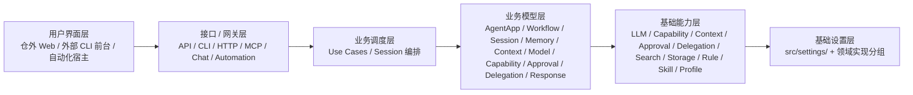

# 总体方案与协作治理设计

## 文档控制

| 项目 | 内容 |
|---|---|
| 文档 ID | `DESIGN-SOLUTION-001` |
| 正式版本 | `v3.1.0` |
| 来源候选 | `TASK-DESIGN-001-R019` |
| 发布事务 | `DESIGN-RELEASE-TX-R019-G001` |
| 负责人 | `HUMAN_ARCHITECTURE_DOMAIN_LEAD` |
| 修改 / 审核 / 批准 | `uroborus` / `uroborus` / `uroborus` |
| 状态 | 已批准并生效 |
| 上游 | `PRD`、`项目章程` |
| 下游 | `其余技术设计`、`workflow-execution-design` |

## 文档职责

- 允许保存：系统目标；四套规范；生命周期；文档信息架构；关键取舍。
- 禁止保存：机器记录全集；专题实现细节；任务过程。
- 主要读者：项目负责人、架构、所有内部协作者。

## 正式内容

**文档类型：** 外部项目源码调研 / 需求方案输入
**主要读者：** 项目协调者 | 产品 | 架构师 | 后端维护者 | Agent Runtime 设计者
**负责人：** 项目负责人
**状态：** 已确认
**关联 ID：** `DISC-HERMES-001`
**最后更新：** 2026-04-13

## 1. 调研目标与范围

### 1.1 调研目标

本报告面向 `shanforge` 的后续能力演进，分析第三方开源项目 [NousResearch/hermes-agent](https://github.com/NousResearch/hermes-agent) 的源码结构、实现原理和工程取舍，回答以下问题：

1. Hermes Agent 的本质系统定位是什么。
2. 它为什么能同时支持 CLI、消息平台、编辑器接入和长期会话。
3. 它的“自我改进”能力具体是如何在工程上实现的。
4. 其中哪些机制适合作为 `shanforge` 的需求方案参考。

### 1.2 调研范围

- 分析对象：`NousResearch/hermes-agent` GitHub 仓库 `main` 分支源码快照。
- 调研时间：2026-04-13。
- 重点源码范围：
  - `run_agent.py`
  - `agent/`
  - `tools/`
  - `gateway/`
  - `acp_adapter/`
  - `cron/`
  - `hermes_state.py`
  - `hermes_cli/`
- 辅助依据：
  - `README.md`
  - `pyproject.toml`

### 1.3 调研方法

本报告以源码阅读为主，README 只用于核对项目对外宣称的能力边界。由于仓库内关于内核架构的正式文档较少，部分结论属于基于代码路径、调用关系和状态结构得出的实现性判断，而非来自项目作者的显式设计说明。

## 2. 项目概述与核心判断

### 2.1 项目概述

Hermes Agent 是一个面向多模型、多工具、多入口和长期会话的 Agent Runtime。项目在 `pyproject.toml` 中声明的包版本为 `0.8.0`，入口脚本包括：

- `hermes = hermes_cli.main:main`
- `hermes-agent = run_agent:main`
- `hermes-acp = acp_adapter.entry:main`

从对外能力看，它同时覆盖：

- 交互式 CLI
- Telegram、Discord、Slack、WhatsApp、Signal 等消息平台
- ACP 编辑器接入
- MCP 扩展工具
- 定时任务调度
- 子代理委派
- 程序化工具调用
- 跨会话记忆、技能和历史检索

### 2.2 核心判断

Hermes Agent 的本质不是“一个会调工具的聊天机器人”，而是一个统一的 `Agent Runtime`。它的工程核心不在模型本身，而在四个闭环：

1. `主任务执行闭环`：模型、工具、错误恢复和回合控制。
2. `长期状态闭环`：memory、skills、session search、session DB。
3. `上下文控制闭环`：system prompt 稳定化、临时上下文注入、context compression。
4. `多入口分发闭环`：CLI、gateway、cron、ACP 共用同一套 agent 内核。

### 2.3 关键结论

- Hermes 的“self-improving”不是参数训练，而是 `经验外部化`。
- 它把长期学习拆成三类工件：
  - `memory`：声明式事实。
  - `skill`：程序化方法。
  - `session_search`：历史轨迹检索。
- 它的长期可用性依赖两个关键工程点：
  - 稳定 system prompt 与 prompt cache 友好的上下文注入策略。
  - 面向长会话的压缩、分叉和检索机制。
- 它已经从“单代理工具循环”演化为“带状态、带协议适配、带任务管理的 agent 系统”。

## 3. 总体架构

### 3.1 架构分层

Hermes 可以分为六层：

| 层级 | 主要模块 | 主要职责 |
|---|---|---|
| 入口层 | `hermes_cli/`、`gateway/`、`acp_adapter/` | 接收来自终端、消息平台、编辑器的输入 |
| 编排层 | `run_agent.py`、`agent/` | 构造 prompt、驱动主循环、处理重试与回退 |
| 工具层 | `tools/`、`model_tools.py`、`toolsets.py` | 注册、裁剪、调度和执行工具 |
| 状态层 | `hermes_state.py`、memory、skills、todo、checkpoint | 维护长期状态和可恢复上下文 |
| 执行环境层 | `tools/terminal_tool.py`、`tools/environments/` | 统一本地与远程执行后端 |
| 扩展层 | MCP、ACP、plugins、skills | 扩展工具表面和接入协议 |

### 3.2 核心编排中心

系统的绝对中心是 `run_agent.py` 中的 `AIAgent`。它承担以下职责：

- 保存当前运行时配置和 provider 信息。
- 组装 system prompt。
- 维护消息历史。
- 调用模型接口。
- 解析 assistant text 与 tool calls。
- 执行工具调用并将结果回写消息流。
- 管理上下文压缩、fallback、rate limit 恢复、中断和子代理。

换句话说，CLI、Gateway 和 ACP 都只是不同“前台壳”，真正的系统核心仍然是 `AIAgent`。

### 3.3 统一入口，多壳复用

#### CLI

`hermes_cli/main.py` 提供终端产品壳，负责：

- 配置读取
- profile 处理
- 模型选择
- 交互命令
- 会话恢复
- gateway/cron/setup/status 等外围命令入口

#### Gateway

`gateway/run.py` 负责多消息平台适配。平台事件会被标准化为 `SessionSource` 和 `SessionContext`，再交给统一的 `AIAgent` 处理。

#### ACP

`acp_adapter/server.py` 和 `acp_adapter/session.py` 负责把编辑器协议会话映射到 Hermes session。ACP 并不是另一套 agent 逻辑，而是相同内核在编辑器场景下的协议包装。

### 3.4 工具系统架构

Hermes 的工具系统不是把函数直接塞给模型，而是分成三层：

1. `tools/registry.py`
   - 每个工具在 import 时向 registry 注册 schema、handler、toolset、availability check。
2. `model_tools.py`
   - 负责工具发现、tool definition 输出、统一 dispatch、sync/async bridge。
3. `toolsets.py`
   - 负责按场景组装工具集，例如 `web`、`terminal`、`file`、`browser`、`delegation`、`hermes-acp`。

这种设计使 Hermes 具备两个重要特性：

- 工具可按入口裁剪，而非全量暴露。
- MCP、插件和内建工具可以进入同一个统一调用面。

### 3.5 状态系统架构

Hermes 的状态不是单一对象，而是多个互相配合的长期工件：

| 状态类型 | 存储方式 | 用途 |
|---|---|---|
| Session transcript | SQLite `sessions/messages/messages_fts` | 长期会话、检索、恢复、统计 |
| Memory | `~/.hermes/memories/MEMORY.md`、`USER.md` | 持久化声明式事实 |
| Skills | `~/.hermes/skills/` | 持久化程序化经验 |
| Todo | 内存 + 对话恢复 | 当前任务规划 |
| Checkpoint | 工作目录快照 | 文件变更前保护 |
| Tool result storage | 工具级预算与裁剪 | 控制返回上下文体积 |

状态层的一个关键思想是：`把“模型记住的东西”变成“系统能管理的工件”`。

### 3.6 扩展架构

#### MCP

`tools/mcp_tool.py` 会读取配置中的 MCP server，动态发现外部工具并注册到 Hermes 工具表面中。这样外部能力和内建能力在模型视角下是统一的。

#### ACP

ACP 层除了转发消息，还能把编辑器提供的 MCP servers 注入当前 session，实现“编辑器上下文 + Hermes 工具系统”的融合。

#### Skills

skills 不是插件代码，而是结构化文档型能力资产，兼顾：

- 过程性知识
- 用户偏好
- 可读性
- 可被 agent 自行修补

## 4. 核心算法与实现机制

### 4.1 Agent 主循环

Hermes 的主循环可概括为：

1. 准备消息历史与当前轮输入。
2. 构造 system prompt 与临时上下文。
3. 生成 API 请求。
4. 调用模型。
5. 解析 assistant 响应。
6. 若有 tool calls，则执行工具。
7. 把 tool results 追加为后续输入。
8. 重复直到得到最终回答或达到预算/中断条件。

这是一种强化版的 ReAct / tool-calling loop，但比典型实现多了：

- 工具修复
- 并行调度
- context overflow 恢复
- prompt cache 友好的 system prompt 管理
- 背景 review 和长期状态同步

### 4.2 System Prompt 组装算法

Hermes 将 system prompt 拆成稳定层和临时层。

#### 稳定层

`_build_system_prompt()` 组装以下内容：

1. 身份层：优先 `SOUL.md`，否则默认 identity。
2. 工具行为规则：如 memory/session_search/skills 的使用指导。
3. 特定模型的 tool-use enforcement 与执行纪律。
4. 当前 session 的 memory snapshot。
5. external memory provider 的 system prompt block。
6. skills 索引。
7. 项目上下文文件：
   - `.hermes.md` / `HERMES.md`
   - `AGENTS.md`
   - `CLAUDE.md`
   - `.cursorrules`
8. 当前时间、模型、provider、平台环境提示。

#### 临时层

当前轮才会注入：

- memory provider prefetch 的 recall block
- plugin 的 pre_llm_call 上下文

这些内容只参与本轮 API 调用，不会直接改写持久消息历史，也不会改变缓存 system prompt。

#### 设计价值

该策略解决了两个常见问题：

1. 避免 system prompt 每轮漂移，提升 cache 命中率。
2. 避免短期上下文污染长期 session transcript。

### 4.3 工具治理算法

Hermes 的工具治理不是“模型说调什么就调什么”，而是包含一整套防御逻辑：

#### 工具名修复

若模型输出不存在的工具名，系统会尝试：

- 小写化
- 连字符/空格归一化为下划线
- 模糊匹配

这降低了模型输出近似工具名时的失败率。

#### 参数 JSON 校验

工具调用参数不是直接相信，而是先做 JSON 校验。若参数为空字符串，会自动修复为 `{}`。若明显因截断导致 JSON 残缺，系统会拒绝执行并要求继续生成或终止为 partial。

#### 重复调用去重

同一轮内若模型输出相同 `(tool_name, arguments)` 的重复调用，系统会去重。

#### delegation 限流

即使模型一轮内发出多个 `delegate_task` 调用，也会被限制在配置上限之内。

#### 并行判定

Hermes 不会盲目并发所有工具。只读工具或路径独立的文件工具才进入并行执行路径；交互式或带共享副作用的工具则走串行路径。

### 4.4 子代理委派算法

`delegate_task` 的核心不是“再创建一个 agent”，而是“创建一个受控 worker”：

- 子代理使用新的 `task_id`。
- 拥有独立 conversation。
- 默认继承有限工具集。
- 显式禁止：
  - 再次 delegation
  - clarify
  - memory
  - send_message
  - execute_code

这说明 Hermes 对子代理的定位不是“复制主代理”，而是“让子代理在受约束的执行面上完成聚焦任务”。

### 4.5 程序化工具调用算法

`execute_code` 是 Hermes 的一个重要差异点。

它允许模型输出一个 Python 脚本，由该脚本通过 `hermes_tools.py` stub 对父进程发起 RPC 工具调用。这样复杂任务可以从：

- 多轮“思考 -> 调工具 -> 读结果 -> 再调工具”

压缩成：

- 一轮生成程序
- 程序内部多次工具调用
- 最终只把程序 stdout 返回给模型

其价值在于：

- 降低 token 往返成本
- 减少中间 tool results 进入上下文窗口
- 让复杂多步操作转为程序控制流

### 4.6 上下文压缩算法

Hermes 的 context compression 不是简单删除历史，而是有结构的：

1. 先清理旧 tool outputs。
2. 保护首部消息。
3. 保护最近尾部消息。
4. 仅对中间部分做摘要。
5. 生成 handoff summary。
6. 重新构造 message list。

其摘要前缀明确声明：

- 这是压缩交接摘要。
- 仅作为背景参考。
- 不应被当作仍待执行的指令。

这类提示是为了防止模型把旧需求误当作当前仍需执行的任务。

### 4.7 Session Split 算法

压缩完成后，Hermes 不是简单覆盖原 session，而是：

1. 结束旧 session。
2. 新建一个新 session。
3. 将旧 session id 写入 `parent_session_id`。
4. 把压缩后的消息写入新 session。

这个设计的价值是：

- 保留 lineage
- 保留压缩前的完整历史
- 允许搜索和追踪“压缩前后”两段会话关系

### 4.8 历史检索算法

`session_search` 的处理链路是：

1. 在 SQLite FTS5 中搜索消息内容。
2. 按 session 聚合高相关结果。
3. 加载相关 session transcript。
4. 用 cheap/fast auxiliary model 做聚焦摘要。
5. 返回针对当前问题相关的历史结论。

这意味着 Hermes 区分了两种长期知识来源：

- 明确值得长期保留的 memory / skill
- 不值得固化但可能未来有用的历史对话

### 4.9 经验沉淀算法

Hermes 的自我改进不是自动改代码，而是自动沉淀经验。

#### Memory flush

在 compression 之前，系统会给模型一次短回合机会，让它把值得保留的信息写入 memory，避免摘要后丢失。

#### Background review

当达到 memory/skill nudge 条件后，系统会 fork 一个后台 review agent，用专门 prompt 检查：

- 用户偏好、约束、风格是否值得写入 memory
- 本轮方法是否值得新建或修补 skill

因此 Hermes 的 self-improving 更接近：

`轨迹反思 -> 工件更新 -> 后续复用`

而不是在线微调。

### 4.10 辅助模型与回退机制

Hermes 将部分旁路任务交给 auxiliary client：

- compression
- session search
- vision
- web extract
- memory flush

辅助模型可以与主模型不同，从而降低成本。

同时，主循环还带有一套比较完整的恢复策略：

- rate limit 等待与退避
- provider fallback
- context limit 探测
- 输出 token 上限缩减
- long-context tier 降级
- transport recovery

这使 Hermes 更像一个“长期运行的服务”，而不是一次性脚本。

## 5. 关键数据结构

### 5.1 SQLite SessionDB

`hermes_state.py` 中的 SQLite 状态层是核心基础设施。

#### `sessions` 表

存储：

- `id`
- `source`
- `model`
- `model_config`
- `system_prompt`
- `parent_session_id`
- token 与 cost 统计
- title 与生命周期字段

#### `messages` 表

存储逐条消息，包含：

- `role`
- `content`
- `tool_call_id`
- `tool_calls`
- `tool_name`
- `finish_reason`
- `reasoning`
- `reasoning_details`
- `codex_reasoning_items`

#### `messages_fts`

FTS5 虚拟表，用于全文检索。

### 5.2 Message 结构

Hermes 的消息不仅有 `user/assistant/tool/system` 基本角色，还携带：

- tool call 元数据
- reasoning 内容
- finish reason
- Codex 响应式推理项

说明 Hermes 的消息流已经不是简单 chat transcript，而是包含执行轨迹与推理恢复信息的结构化日志。

### 5.3 ToolEntry 与 ToolRegistry

`ToolEntry` 主要字段包括：

- `name`
- `toolset`
- `schema`
- `handler`
- `check_fn`
- `requires_env`
- `is_async`
- `description`
- `emoji`
- `max_result_size_chars`

这使每个工具都具备：

- 被模型调用的 schema
- 被系统调度的 handler
- 被入口裁剪的能力分组
- 被环境检查的可用性门禁

### 5.4 MemoryStore

`MemoryStore` 的一个关键设计是双态：

- `_system_prompt_snapshot`
  - session 启动时冻结，用于 system prompt。
- `memory_entries / user_entries`
  - 运行时实时更新并落盘。

这意味着：

- 当前 session 内，memory 写入立即 durable。
- 但不会立刻改变 prompt，从而保持缓存稳定。

### 5.5 Skill 目录结构

skill 本质上是一个目录化文档包：

- `SKILL.md`
- `references/`
- `templates/`
- `scripts/`
- `assets/`

这使 skill 可以同时承载：

- 说明
- 支撑材料
- 模板
- 可执行脚本

也说明 Hermes 把“经验”建模成“可维护的文件系统对象”。

### 5.6 SessionContext 与 SessionSource

Gateway 中的 `SessionSource` 和 `SessionContext` 用于表达：

- 来自哪个平台
- 哪个 chat / thread / user
- 哪些平台已连接
- 哪些 home channels 可用

这是 Hermes 能在消息平台里做 `origin delivery`、`home delivery` 和多平台协作的基础。

### 5.7 ACP SessionState

ACP 的 `SessionState` 存储：

- `session_id`
- `agent`
- `cwd`
- `model`
- `history`
- `cancel_event`

这说明编辑器接入被视为“同一个 agent 系统中的另一种 session 形态”，而不是外挂插件。

### 5.8 ContextEngine 抽象

`ContextEngine` 定义了：

- `should_compress`
- `compress`
- `update_from_response`
- `on_session_start`
- `on_session_end`
- `get_tool_schemas`
- `handle_tool_call`

默认实现是 `ContextCompressor`，但抽象层表明项目作者希望未来可替换为其他上下文管理引擎。

## 6. 运行时流程

### 6.1 CLI 流程

CLI 的典型运行流程如下：

1. 读取 profile 与 config。
2. 解析当前 provider/model。
3. 初始化 `AIAgent`。
4. 加载历史 session。
5. 用户输入进入 `run_conversation()`。
6. 若返回流式 delta，则交给 TUI 渲染。
7. 完成后更新 SQLite、memory、skills review 状态。

CLI 是最完整的产品壳，也是其他入口的能力参考基准。

### 6.2 Gateway 流程

Gateway 的运行流程大致如下：

1. 各平台适配器收消息。
2. 构造 `SessionSource`。
3. 生成或查找 `SessionContext`。
4. 创建新的 `AIAgent` 实例处理这条消息。
5. 流式输出通过 `GatewayStreamConsumer` 发送到平台。
6. 需要时支持 interrupt、busy handling、follow-up delivery。

这里的一个重要取舍是：

- Gateway 往往“每条消息新建一个 AIAgent 实例”。
- 但长期 session 状态不靠 agent 实例内存，而靠 SQLite、memory 文件和其他持久状态恢复。

### 6.3 流式输出流程

`GatewayStreamConsumer` 的职责是：

- 接收同步回调中的 token delta
- 放入线程安全队列
- 在异步任务中节流、缓冲和编辑平台消息

其设计说明 Hermes 非常重视跨平台“连续感”，而不是只在模型结束后一次性输出。

### 6.4 Cron 流程

Cron 的流程是：

1. scheduler 定期 tick。
2. 查找 due jobs。
3. 为 job 启动 agent 执行。
4. 结果存档。
5. 根据 `deliver` 策略把结果投递回：
   - `local`
   - `origin`
   - `platform`
   - `platform:chat_id`

这意味着 cron 不是单独的自动化系统，而是“用同一内核做无人值守调用”。

### 6.5 ACP 流程

ACP 侧的运行流程是：

1. 编辑器初始化 ACP 会话。
2. Hermes 创建 session 并绑定 `cwd`。
3. 编辑器发 prompt。
4. ACP server 在后台线程里运行 `AIAgent`。
5. tool start / progress / complete 被转为 ACP tool call events。
6. session 持久化到同一个 SessionDB。

该设计的价值在于：

- 编辑器会话与 CLI/Gateway 会话共享同一套状态能力。
- ACP 并未引入第二套 agent core。

## 7. 工程优势与主要风险

### 7.1 主要优势

#### 优势一：系统化完整

Hermes 已经把 agent 所需的核心运行时要素做全：

- 会话
- 工具
- 状态
- 压缩
- 协议
- 调度
- 回顾学习

#### 优势二：长期状态设计成熟

它没有把长期能力寄托在模型上下文，而是外部化为 memory、skills、session search、session DB。

#### 优势三：多入口统一

CLI、Gateway、Cron、ACP 共用一个内核，避免能力碎片化。

#### 优势四：上下文治理强

prompt 稳定化、context compression、session split 和历史检索形成了较完整的长会话治理体系。

### 7.2 主要风险

#### 风险一：编排层过重

`run_agent.py` 已接近超大编排器。虽然内部已分拆出多个模块，但大量全局运行时逻辑仍集中在主文件中，维护门槛高。

#### 风险二：状态一致性复杂

系统同时维护：

- agent 实例状态
- SQLite session
- memory 文件
- skills 文件
- tool result budget
- gateway session store

一旦后续继续扩展，状态一致性和边界会变得更脆弱。

#### 风险三：文档弱于实现

项目 README 偏产品说明，内核设计主要靠代码阅读恢复。对二次维护者而言，理解成本较高。

#### 风险四：入口壳增多后回归复杂

CLI、Gateway、ACP、Cron 共用内核虽是优势，但任何主循环变更都可能影响所有前台壳，回归测试要求高。

## 8. 对 shanforge 的需求方案启发

### 8.1 可直接借鉴的能力

#### 借鉴一：稳定 system prompt + 当前轮临时注入

这是 Hermes 最值得借鉴的设计之一。对于 `shanforge` 而言，可复用为：

- 会话级稳定上下文
- 当前任务级临时上下文
- memory 检索结果不直接污染历史

#### 借鉴二：状态外部化

将以下能力从“模型记忆”转为“系统工件”：

- 用户偏好
- 任务方法
- 历史会话
- 调度状态

这比单纯堆积上下文更适合工程化维护。

#### 借鉴三：ContextEngine 抽象

若 `shanforge` 后续要做压缩、摘要、工作台视图或任务图谱，建议一开始就把上下文管理抽象成可替换接口，而不是把压缩写死在主循环里。

#### 借鉴四：工具注册层

应采用 registry + toolset 的能力管理方式，避免入口层直接拼装工具列表。

### 8.2 适合谨慎借鉴的能力

#### 谨慎项一：超大单文件编排器

Hermes 的成功不代表 `run_agent.py` 的体量值得复制。`shanforge` 更适合在早期就把：

- API 调用
- 消息规整
- tool governance
- recovery policy
- background review

拆为独立 orchestrator/service 层。

#### 谨慎项二：过早做全平台入口

Hermes 已完成 CLI、gateway、ACP、cron 的统一，但这是一条高投入路线。`shanforge` 若尚未稳定主循环，不应过早分散到多入口。

### 8.3 现阶段推荐采纳顺序

建议 `shanforge` 按以下顺序吸收 Hermes 的设计：

1. `AIAgent 主循环 + ToolRegistry`
2. `SessionDB + session_search`
3. `memory + skills`
4. `ContextEngine + compression`
5. `delegate_task / execute_code`
6. `gateway / cron / ACP`

该顺序的原则是：先把 `内核` 和 `状态` 做对，再做入口扩展。

## 9. 复刻建议

### 9.1 最小可行版本

若以 Hermes 为参考复刻一个最小可用系统，建议第一版只实现：

- 单入口 CLI
- `AIAgent` 主循环
- `ToolRegistry`
- `terminal`、`read_file`、`write_file`、`search_files`、`web_search`
- SQLite session storage
- 简化版 context compressor

这一阶段的目标不是功能齐全，而是建立可持续迭代的 runtime 骨架。

### 9.2 第二阶段

第二阶段补长期状态与方法沉淀：

- `MEMORY.md`
- `USER.md`
- skill 目录系统
- FTS5 session search
- prompt cache 友好的 memory 注入

这是从“会做事”升级为“会积累经验”的关键一步。

### 9.3 第三阶段

第三阶段补高级执行能力：

- delegation
- execute_code
- checkpoint
- background review

这一阶段的目标是降低复杂任务的回合成本，提高长任务完成率。

### 9.4 第四阶段

第四阶段补多入口与外部协议：

- messaging gateway
- cron scheduler
- ACP
- MCP

此时系统才真正具备 Hermes 风格的“统一 agent runtime”能力。

### 9.5 工程建议

复刻时建议坚持以下原则：

1. 将“长期知识”外部化，不依赖模型自然记住。
2. 将“当前轮检索结果”作为临时注入，而不是永久写进 transcript。
3. 为 context overflow、rate limit 和 provider fallback 提前设计恢复路径。
4. 不要把所有 orchestrator 逻辑都堆在一个文件里。
5. 在入口扩张之前，先保证主循环、状态层和压缩层稳定。

## 10. 记忆系统专题补充（2026-04-15）

本节基于对子仓 `/Users/uroborus/AiProject/hermes-agent` 的专题精读，专门回答“哪些记忆系统设计精华值得 `shanforge` 吸收”。

### 10.1 记忆系统的真实分层

Hermes 的记忆能力不是一个单独 store，而是四层协作：

1. `agent/memory_provider.py`
   定义 provider 生命周期与扩展点：`initialize / prefetch / queue_prefetch / sync_turn / on_session_end / on_pre_compress / on_delegation`。
2. `agent/memory_manager.py`
   统一编排 built-in provider 与 external provider，并强约束“最多只激活 1 个 external provider”。
3. `tools/memory_tool.py`
   提供 bounded built-in memory，管理 `MEMORY.md` / `USER.md` 双仓和 session-start frozen snapshot。
4. `tools/session_search_tool.py`
   把历史会话回查单独做成 session archive search，而不是塞进 memory store。

这套分层对 `shanforge` 的意义是：长期记忆、历史档案、外部增强和子 Agent 摘要必须分开建模。

### 10.2 领域建模精华

Hermes 最关键的运行时作用域不是“某条 memory entry”，而是：

- `session_id`
- `agent_context`
- `agent_identity`
- `agent_workspace`
- `user_id`
- `parent_session_id`

也就是说，记忆系统的业务关键不是先设计“条目长什么样”，而是先设计“这条信息属于谁、在哪个会话、哪个身份、哪个工作空间、是否来自子任务”。这正是 `shanforge` 需要把 `ProfileMemoryDomain`、`SessionAssemblyManifest`、`SubAgentDigest` 做成一等对象的原因。

### 10.3 存储系统精华

Hermes 给出两条很有价值的本地优先路径：

- 低成本路径：
  `tools/memory_tool.py` 的 `MEMORY.md + USER.md` 双文件、bounded char budget、file lock、atomic replace、frozen snapshot。
- 结构化路径：
  Holographic provider 的 `SQLite + FTS5 + 分桶(bank/category) + trust/retrieval` 组合。

对 `shanforge` 的启发不是去照搬 `MEMORY.md` 工具，而是：

- session-start 注入必须有稳定 snapshot
- mid-session durable write 不应隐式改写当前 prompt
- archive search 与 long-term memory search 应分离
- recall augmentation block 应带 context fence / system note，并在注入前做 sanitize
- 本地结构化索引优先考虑 `SQLite FTS5`，而不是一开始就接第三方云 memory SDK

### 10.4 对外服务界面精华

Hermes 的对外面主要是三类：

- model-facing：
  `memory` 工具与 provider tool schemas
- runtime-facing：
  `MemoryManager` 调用 provider 生命周期钩子
- human-facing：
  `hermes memory setup/status` 等 CLI 运维入口

`shanforge` 不适合复制它的工具直写模式，但非常适合吸收“统一 manager + typed provider port + 调试运维入口”这一组织方式。

### 10.5 子 Agent 隔离精华

`tools/delegate_tool.py` 明确禁止 child agent 使用共享 `memory` 工具写入全局记忆。父 Agent 只消费子 Agent 的摘要结果，不消费其中间轨迹。

这对 `shanforge` 是一个直接设计约束：

- child agent 默认只写自己的 session ledger
- 对主会话的共享长期记忆回写必须经过 `SubAgentDigest`
- memory absorb 只能由主 Agent 或显式治理流程触发

### 10.6 采用与不采用清单

建议采用：

- `MemoryProvider` 抽象
- `MemoryManager` 单点编排
- built-in bounded local memory
- frozen snapshot
- session archive search 与 long-term memory 分离
- child-isolated memory write policy

建议适配采用：

- Holographic 的 `SQLite + FTS5 + trust` 结构
- provider lifecycle hooks

不建议直接采用：

- Honcho / Hindsight / Mem0 / OpenViking / ByteRover / Supermemory 的 vendor-specific 适配器
- `run_agent.py` 式的 monolithic runtime 绑定方式
- 让模型通过工具直接操作 prompt-facing memory 文件的产品接口

## 11. 结论

Hermes Agent 的技术价值不在于“它支持多少平台”，而在于它已经把 Agent 系统中最难工程化的部分组合到一起：

- 主循环可持续运行
- 长期状态可管理
- 上下文可压缩可检索
- 多入口共享同一内核
- 经验可以被系统性沉淀

对于 `shanforge` 来说，这份调研最重要的结论不是“照搬 Hermes”，而是：

`应优先建设统一 agent runtime 与状态系统，再决定前台壳和平台接入形态。`

Hermes 提供的是一套值得参考的工程路线图，而不是必须逐项复制的产品清单。

## 附录 A：建议重点阅读的源码入口

| 入口 | 作用 |
|---|---|
| `run_agent.py` | 核心编排与主循环 |
| `agent/prompt_builder.py` | system prompt 组装 |
| `agent/context_compressor.py` | 上下文压缩 |
| `agent/memory_manager.py` | memory provider 协调 |
| `model_tools.py` | 工具发现与调度 |
| `tools/registry.py` | 工具注册中心 |
| `tools/delegate_tool.py` | 子代理委派 |
| `tools/code_execution_tool.py` | 程序化工具调用 |
| `hermes_state.py` | SQLite session 存储 |
| `gateway/run.py` | 消息平台入口 |
| `gateway/session.py` | gateway session 上下文 |
| `acp_adapter/server.py` | ACP 编辑器接入 |
| `cron/scheduler.py` | 定时任务调度 |

## 附录 B：术语解释

- **Memory**：长期声明式事实，不等于完整历史。
- **Skill**：可复用方法，不等于一般性记忆。
- **Session Search**：从历史 transcript 中召回上下文。
- **Context Compression**：压缩历史消息，不是删除 session。
- **Session Split**：压缩后新建 continuation session，并保留 lineage。
- **Auxiliary Model**：用于旁路任务的廉价或快速模型，不一定等于主模型。
- **Gateway**：消息平台接入层。
- **ACP**：编辑器 Agent Client Protocol 接入层。
- **MCP**：外部工具或上下文能力接入协议。

---

**项目名称：** 山海工枢 / shanforge
**文档状态：** `v2` 总览基线
**负责人：** 仓库维护者
**主要读者：** 架构 | 平台开发 | 业务 Agent 开发 | 项目协调者
**上游输入：** PRD | 需求分析 | Hermes Agent 源码调研报告
**下游输出：** 系统架构 | 模块边界 | API 设计 | 实施计划
**最后更新：** 2026-04-15

## 1. 方案结论

山海工枢 `v2` 的产品中心已经明确收口为一个面向业务装配的抽象 Agent 平台，而不是旧脚本集合，也不是单一 CLI 工具。

平台对业务暴露的不是底层 SDK，而是四类稳定装配面：

- `Agent App Manifest`：声明业务身份、输入输出和能力需求。
- `Workflow DSL`：声明步骤、流转条件和执行顺序。
- `ModelPolicy`：声明模型选择、预算和推理约束。
- `Capability Registry`：声明工具能力、风险级别、证据要求和写集边界。

平台对内则统一承载三条主闭环：

- 运行闭环：`session -> context -> workflow step -> model/capability -> response`
- 治理闭环：`capability -> approval/sandbox -> delegation -> evidence`
- 记忆闭环：`session/event/artifact -> evidence -> candidate -> promotion -> recall`

## 2. 六层平台视图



当前正式原则只有一套：

- 依赖只允许单向向下。
- 平台业务逻辑 owner 在 `domain`。
- `runtime` 只提供通用技术能力，不承担业务 owner。
- 基础设置层只有一个正式代码根：`src/settings/`；层内可以继续按实现领域分组，但不新增架构层次。
- 谁调用下层，谁定义接口。

## 3. 仓库职责边界

本仓不是“前后端一体 UI 仓”，而是平台主仓。当前重点承载下面 5 个仓内区域：

| 架构层 | 当前宿主或代码落点 | 责任 |
|---|---|---|
| 用户界面层 | 仓外 Web 项目、外部 CLI 前台 | 最终人机交互，不在本仓完整实现 |
| 接口/网关层 | `src/access/` | API、CLI、HTTP、MCP、Chat、Automation 收口 |
| 业务调度层 | `src/application/` | 用例编排、会话生命周期、流程协同 |
| 业务模型层 | `src/domain/` | 平台业务对象、策略、规则、契约 |
| 基础能力层 | `src/runtime/` | 上下文、模型、能力、审批、委派、检索、存储等技术能力 |
| 基础设置层 | `src/settings/` | provider、持久化、桥接、容器装配 |

## 4. 业务开发方式

业务开发的最小路径已经收敛为：

1. 定义 `Agent App Manifest`
2. 声明业务 `workflow`
3. 为每个 step 绑定 `capability` 或 `model_policy`
4. 声明 `output_schema`
5. 通过 mock provider 或本地持久化完成契约测试

因此，业务流不再通过直接调用 shell、Git 或供应商 SDK 来实现，而是通过平台定义好的声明式装配面进入运行闭环。

## 5. 运行闭环

当前正式运行链路如下：

1. 用户或上游系统经 UI 宿主发起请求。
2. `src/access/` 把请求绑定到统一网关入口。
3. `src/application/` 打开 session、选择 workflow、组织 prepare/run/persist。
4. `src/domain/` 负责 workflow、memory、approval、delegation、response 等业务规则。
5. `src/runtime/` 通过 Context Engine、Execution Engine、LLM Runtime、Capability Registry 等提供技术能力。
6. `src/settings/` 提供 provider、store、Hermes bridge 和容器装配实现，并在层内按 `model / memory / session / workspace / approval / delegation / gateway / capability_registry / hermes` 等领域分组；顶层 `skills/*/SKILL.md` 由代理宿主按需使用，不进入 runtime/settings 装配。
7. 结果统一收口为 `AgentResponse`，并留下事件、证据和记忆蒸馏产物。

## 6. 方案边界

### 做什么

- 建立统一平台内核和声明式业务装配协议
- 允许不同入口复用同一套用例、领域模型和治理规则
- 允许不同 step 采用不同模型策略、能力策略和审批策略
- 保留 local-first、可审计、可回放的实现基线

### 不做什么

- 不把旧脚本或遗留入口继续当作产品定义中心
- 不让业务层直接依赖 SDK、数据库驱动或外部协议对象
- 不把 `runtime`、`adapters`、`storage` 混成一个“基础设施大层”
- 不把记忆、审批、委派等业务规则继续放在技术层 owner 位置

## 7. 推荐阅读顺序

1. [技术选型与工程规则](./technical-selection.md)
2. [系统架构设计](./system-architecture.md)
3. [抽象 Agent 平台架构](./system-architecture.md)
4. [分层领域与接口总表](./module-domain-design.md)
5. [模块边界文档](./module-domain-design.md)
6. [基础设置层与外部资源设计](./system-architecture.md)
7. [API 设计文档](./api-design.md)

## 8. 版本记录

| 版本 | 日期 | 变更内容 |
|---|---|---|
| `v2.0` | 2026-04-13 | 按全新抽象 Agent 平台重写总体总览，移除旧版本边界叙事 |
| `v2.1` | 2026-04-15 | 统一到六层架构、消费者定义接口和 domain owner 口径 |

---

## 1. 设计目标与边界

本设计要把 PRD v4.0.0 中的软件开发协作要求变成一个确定、可执行、可验证的 Agent 设计，而不是让模型临场发明流程。最终设计必须同时回答：

1. 软件从项目建立到退役经历哪些阶段，每个阶段如何进入、执行、验收、退回和退出。
2. 每次会话如何确定唯一 Workflow，人在什么节点决策，AI 在什么范围执行，规则系统如何阻断越权。
3. 每个动作使用什么 Method、Skill 和 ToolPolicy，读取什么、写入什么、形成什么证据。
4. 正式文档、任务产物、Memory、Catalog、源码、测试、制品、发布和运维记录分别保存什么、不能保存什么、何时生效和如何处置。
5. 需求、领域、数据库、API、UI、权限、校验和测试如何通过稳定 ID 保持字段一致。
6. 123 条 Workflow、原 597 个动作槽、369 个通用黑盒场景和 1359 个待设计槽如何迁移到唯一机器 Catalog，并将 `WF-CTL-010` 合法扩展为 9 个动作。
7. 项目进度查询如何通过已登记事实、全局日志、SQLite 可重建投影和固定代码渲染做到快且准确，AI 只负责意图候选和专业检查。
8. 任务过程产物如何按正式 Git、任务临时区和构建临时区分层，如何执行 7 天保留、候选即时清理、legal hold、活动引用和回滚规则，并保证外部持久存储为受控 N/A。
9. 每次响应如何从同一 `ProjectProgressSnapshot/v2` 计算整体 N/M、当前停止原因、责任主体和唯一下一动作，避免局部计划冒充项目总路线。
10. 如何用固定十五行 `REQ-ASYNC-016` renderer、权限过滤和版本化 consumer migration 保证用户始终知道整体进度、当前停点以及是否真的需要人工确认。

本任务设计流程、契约、状态机、方法和验证规则，不实现产品运行时代码，不创建真实业务数据库、API 或产品页面，不修改正式 docs。UI 适用性为 N/A，本轮以中文流程、字段表、状态真值表和机器负例验收。

## 2. 权威来源与读取规则

### 2.1 已冻结输入

| 输入 | 正式版本/修订 | SHA-256 | 本任务读取范围 |
|---|---|---|---|
| PRD | v3.3.0 | 9d66a99378ce403b3bcdf1ca0e927876a9141e1c079ce67b4f5d52344da4a1d2 | 全生命周期需求及 REQ-AI-WORKFLOW-048/050/052/053、AC-RET-001 至 AC-RET-015 |
| 需求矩阵 | v3.3.0 | 656082229d9e53e8c741c9abdad07ee30d445490cc52a03d71da76fba9ff1435 | 需求到设计、验证和正式 owner 的追踪 |
| 文档索引 | v1.3.0 | 8b49f54d49e7a080e43ac394c45343d3792f42ab14daf1146802d14b5950a618 | 当前正式路径和版本资格 |
| 需求发布清单 | released | 973e45e26d62eff52a22083b1967af62606bbf76942e843890c427f83476449d | 证明 v3.3.0 已生效 |
| P017 R004 | approved | 8af5ac682617a10c3fbe4de546c7d04e76247668ed81ec18ab0cde5eae95100c | R017 候选写集、验证、评审和停止 Gate |
| R016 设计前像 | protected non-storage oracle | 13039aeb1b7a9817cd4ab38aa1340b82afc0e3a467459e44e003cbafe393f329 | 只继承有效生命周期、工作流、方法、会话、进度和风险语义 |
| WP-RB-01 基线闭包 | candidate evidence | 7302cd584b2580616fafc0c576303934930126e45b42bfa988beed225912c6c3 | 68/17、10,700 个 Git 对象、55 项前像处置、39 个活动引用和 3 个历史非阻断引用 |

归档和失效候选默认禁止读取。正式需求正文高于矩阵投影；R016 只作非存储语义 oracle，不能恢复旧发布资格。

### 2.2 输入库存

| 范围 | 数量 | 当前处理结果 |
|---|---:|---|
| 治理 REQ | 54 | 54/54 建立覆盖记录 |
| 治理 NFR | 19 | 19/19 建立覆盖记录 |
| 设计 GAP | 13 | 13/13 建立覆盖记录 |
| 正式需求变更 | 2 | `REQ-CHANGE-WF-CTL-010-001`、`REQ-CHANGE-AI-EXEC-ASYNC-001` 建立覆盖记录 |
| Workflow | 123 | 身份和分阶段数量已冻结 |
| Node / ActionSpec 槽 | 597 个原映射槽、601 个当前源动作 | 仅 `WF-CTL-010` 从 5 步扩为 9 步，其余不变 |
| 黑盒场景 | 369 | 作为 WP-04/WP-08 迁移输入冻结 |
| R014 专项验收夹具 | 56 | 56/56 转为独立机器测试记录，不改变原 369 个通用场景 |
| 身份源指针 | 1089 | `123 + 597 + 369` |
| 待设计槽 | 1359 | 元数据 16、Workflow 级 1343 |
| 总迁移指针 | 2448 | 作为最终完整性门 |

### 2.3 事实选择规则

- 正式 PRD、矩阵、索引、R014 发布清单、R014 机器合同和 R006 映射任一 hash 漂移时，当前候选立即阻断，不自动吸收变化。
- `docs/` 在最终设计候选通过独立评审并获人工批准前只读。
- 机器对象和字段最终以 Catalog 为权威；Markdown 只解释目标、原因、取舍、时序和阅读方式。
- 覆盖矩阵、流程图和索引是带 Catalog 版本/hash 的投影，不得反向成为第二份字段定义。
- Memory 只保存状态和路径索引，不能复制本设计正文或 Catalog 记录。

## 3. 自上而下的设计顺序

设计严格按以下依赖推进，后层不得替前层补决定：

```text
正式需求与项目约束
  -> 四套顶层规范
  -> 生命周期、角色、事实和 Artifact 状态机
  -> 确定性路由、WorkflowRun、Node 和 Gate
  -> 123 条 Workflow 与 ActionSpec
  -> Method、SkillBinding、PromptTemplate 和 ToolPolicy
  -> 交付拓扑、纵向切片和 Business Field Trace
  -> 验证器、黑盒测试、评审和发布事务
```

如果上游对象变化，下游对象按引用影响集合失效；禁止只修改数据库、接口或页面中的一个字段后让其他层继续保持“已批准”。

## 4. 唯一机器事实源

R017 的唯一非代码语义输入是 ai-sdlc-catalog.R017.source.json。它符合 CatalogCompactSource/v1，根部只允许十个固定字段；contract_bundle 内只允许 source_meta_schema、compact_profile、constant_registry 和 fixed_parameters 四个子对象。完整 4,102 条 Catalog 不进入仓库，不保存压缩副本，也不依赖任何旧全量候选。

Git 最终只保存紧凑源、稳定 Builder、封闭验证合同、期望输出身份和小型重建入口。Builder 的正常模式只能读取紧凑源并向指定临时目录写一个 JSONL；旧设计、旧差量、仓库父目录、网络、外部存储、子进程、动态代码和编码载荷都不在输入闭包内。

Catalog 仍使用 21 个封闭 record_type，最终计数保持 4,102 条，其中 Workflow 123、ActionSpec 641、RouteRule 133、CoverageMapping 2,554、TestCase 478。937 条规范化 source fact 保存不可推导事实；RouteRule、CoverageMapping、通用 Workflow Test、完整血缘、完整性和验证合同由 allowlist operator 确定性生成。

每个输出叶只能是 source_fact 或 derived_fact。source_fact 必须指向 /source_records 或 /contract_bundle/constant_registry；derived_fact 必须绑定非恒等 operator 和输入指针。schema/profile 只能验证结构，fixed_parameters 只能控制边界，二者不能供应输出业务值。未知 record_type、未知字段、未登记 literal、opaque 编码、镜像字典、闭包外读取或输出指标漂移均 fail closed。

## 5. 覆盖图

### 5.1 图模型

每条需求覆盖边采用同一结构：

```text
REQ/NFR/GAP
  -> 主责 WP
  -> 目标 Catalog record ID / record type
  -> 正式 owner path / field
  -> test_case_id
  -> evidence_ref
```

覆盖记录存在只证明“已分配设计责任”，不证明目标对象已经完成。`catalog_target_status=deferred_until_wp` 的记录必须在对应工作包完成时解析为真实对象；最终 profile 中未解析目标数必须为 0。

### 5.2 主责边界

| 主责 WP | 设计责任 |
|---|---|
| WP-01 | 输入绑定、需求/GAP 覆盖、profile bootstrap |
| WP-02 | 四规范、角色、Artifact、事实资格、生命周期 |
| WP-03 | 路由、Session/Workflow/Action 状态机和 Gate |
| WP-04 | 123 Workflow、Node、ActionSpec 和迁移账本 |
| WP-05 | 全生命周期 Method、SkillBinding、PromptTemplate |
| WP-06 | ToolPolicy、会话回复和人机交接 |
| WP-07 | 交付拓扑、纵向切片和 Business Field Trace |
| WP-08 | validator 完整实现、test_case 和负例 |
| WP-09 | 候选冻结、评审、人工批准和发布清单 |
| WP-10 | 正式融合、补偿、生效和草案处置 |

76 条逐 ID 记录只保存在 Catalog，不在 Markdown 重抄第二份表。

## 7. 检查点与持续授权

CP-01 至 CP-04不是中间正式文档或新任务，而是同一任务内的质量检查点。每个检查点记录：

- 中文设计、Catalog、validator 三个 SHA-256。
- profile ID/version、覆盖 JSON Pointer 和共享规则 hash。
- 已允许延后的范围、机器影响集合和独立 Reviewer 结论。

用户已持续授权本任务四个检查点及最终设计候选的独立 AI 只读评审。Reviewer 写集为空；同一 Gate 最多自动修正复审 2 轮，超限或出现人工决策才停止。

Checkpoint manifest 是追加历史。首条 profile registry 属于 R001，任何后续 validator 或 profile 变化都不得原位修改该行；必须追加具有唯一 `registry_revision`、`supersedes_registry_sha256`、新 validator hash、完整 profile 集和生效快照的 revision。每个 snapshot 和 review result 也只追加，旧快照被退回后保留原字节并由新 revision 明确取代。

## 8. 四套顶层规范

四套规范正交分工，只通过引用组合。Workflow 不得复制规范正文，也不能在冲突时自行选择其中一套。

| Catalog ID | 规范 | 唯一职责 | 不负责 |
|---|---|---|---|
| `TOP-SPEC-PROCESS-001` | 流程规范 | 14 个阶段的进入、必做流程、产物 Gate、退出、N/A、失败、回退、重入和下游失效 | 具体角色实例、工具参数和文件字段 |
| `TOP-SPEC-COLLABORATION-001` | 协作分工规范 | 人、AI、规则系统、Reviewer、批准人的职责、决策权、独立性和交接责任 | Session 呈现和 Artifact schema |
| `TOP-SPEC-WORK-SESSION-001` | 工作、Session 与交接规范 | 单次会话的路由、最小读取、执行、可见性、落盘、停止、恢复和回复 | 生命周期范围和正式事实权威 |
| `TOP-SPEC-ARTIFACT-IO-001` | 文档与 Artifact 输入输出规范 | 17 类产物、14 个事实域、输入输出资格、存储、状态、版本、保留和处置 | 具体业务流程图和 Method 步骤 |

### 8.1 继承顺序

```text
Project Baseline
  -> ProcessSpec 选择阶段和允许 Workflow
  -> CollaborationSpec 为 Node 绑定角色和决策权
  -> WorkSessionSpec 约束本次执行、可见性和停止
  -> ArtifactIOSpec 校验每个输入输出和事实资格
  -> Workflow / ActionSpec 只能在四项均满足时执行
```

### 8.2 冲突与版本

四套规范和具体动作统一引用 `CONFLICT-PRECEDENCE-001`。规则系统按优先级从高到低求值，低层允许不能覆盖高层拒绝；同一优先级出现互斥决定时返回 `blocked_by_policy_conflict`，写入数为 0。

| 优先级 | Rule ID | 约束范围 | 结果 |
|---:|---|---|---|
| 100 | `CONFLICT-LEGAL-SAFETY-001` | 法律、合规、安全、隐私、legal hold | 拒绝或要求人工整改，禁止覆盖 |
| 90 | `CONFLICT-HUMAN-EXPLICIT-AUTH-001` | 风险接受、高风险/生产动作、正式批准 | 必须有当前有效的人工授权 |
| 80 | `CONFLICT-FORMAL-GATE-001` | 评审、验证、人工确认、发布 Gate | Gate 未满足即阻断 |
| 70 | `CONFLICT-ROLE-AUTHORITY-001` | Role Assignment、主体类型、决策权、独立性 | 交给确定性授权求值器 |
| 60 | `CONFLICT-ACTION-TOOL-001` | Workflow、Node、ActionSpec、ToolPolicy、读写集 | 所有动作和工具约束必须同时满足 |
| 50 | `CONFLICT-ARTIFACT-DOCUMENT-001` | Artifact、事实资格、文档、保留和处置 | 输入输出契约必须满足 |
| 10 | `CONFLICT-MODEL-CANDIDATE-001` | 模型推断、Prompt、Skill 建议 | 只产生候选，永不产生权限 |

`CONFLICT-PRECEDENCE-EVALUATOR-001` 必须实际消费 7 组上下文，不能只返回最高优先级规则的名称：法律/安全必须明确为 clear；需人工授权的动作必须回读当前有效授权；所有必需 Gate 必须在 passed 集合；Role Assignment 必须来自授权求值器的 allow；ActionSpec/ToolPolicy 和 Artifact/文档决定集合均不得为空且必须全部 allow；模型输出只能标记为 candidate。缺任何上下文直接 deny，同级规则互斥返回 `blocked_by_policy_conflict`，缺人工决定返回 `needs_human_decision`，其余失败返回 `deny`；只有全部适用约束通过才返回 `allow`。这四种值是唯一对外结果，内部动作名不得泄漏为决定。

每次求值记录参与规则、胜出优先级、拒绝规则和原因码。阶段与 Task/ledger 冲突、Session 与 Workflow 冲突都使用这一算法，不能由模型选择“更方便”的规则，也不能用低优先级 candidate 结果补齐缺失授权或 Gate。

改变优先级、决定、可覆盖性或删除约束属于不兼容变更，正式发布时升 `MAJOR`；新增不削弱现有约束的规则或证据字段升 `MINOR`；只改显示文本或来源引用升 `PATCH`。候选阶段只使用任务修订和 hash，不预分配正式版本。

## 24. R017 候选与正式发布绑定

R017 候选由完整设计、紧凑源、文档信息架构、稳定 Builder 和 Validator 五个文件组成集合根；外层 manifest 绑定完整集合根算法、五文件 hash/bytes、四个 source 子对象、RuntimeImage、期望 Catalog 输出和两个 Gate。候选不分配正式版本，不修改 docs。独立 Reviewer 只决定候选质量；uroborus（人类）只在 GATE-R017-HUMAN 对当前候选身份和正式化影响作决定。

## 25. R017 正式文档目标结构、职责与 68 文件处置

### 25.1 物理边界

正式文档只保存面向人类的稳定事实，项目跟踪只保存在 `.factory/workitems`，AI 会话恢复只保存于 `.factory/memory`。三者通过 TaskCard、需求 ID、文档 ID、artifact hash 和 release event 建立引用，不互相复制正文。当前 `docs` 固定为 7 个目录、34 份 Markdown；机器紧凑源位于 `.factory/catalog/ai-sdlc-catalog.source.json`，稳定 Builder 位于 `tools/ai-sdlc-catalog/build.mjs`，旧发布 manifest 只作为 WorkItem evidence 保存。

### 25.2 目标目录职责

| 目录 | 只能保存 | 禁止保存 |
|---|---|---|
| docs/ | 正式文档总入口、文档索引和发布策略 | 任务状态、会话、草案、原始证据和长日志 |
| docs/01-getting-started/ | 项目概览、章程和快速开始 | 产品需求、详细技术设计和任务过程 |
| docs/02-user-guide/ | 面向使用者的稳定操作说明和已批准提示模板 | 内部实现、当前任务状态和未批准建议 |
| docs/03-developer-guide/ | 开发环境、应用开发、接口参考和插件开发 | 项目进度、一次性实现计划和正式需求副本 |
| docs/04-product/ | 产品 PRD、需求矩阵和产品入口 | 技术实现正文、任务卡和评审过程 |
| docs/05-design/ | 架构、模块领域、数据、API、前端、UX/UI、工作流、记忆和接口矩阵 | 当前进度、实现日志、完整 Catalog payload 和临时候选 |
| docs/06-delivery/ | 测试策略、发布说明、部署和运维 | 原始测试日志、一次性运行结果和当前发布任务状态 |

### 25.3 三十七份正式文档的唯一职责

| 目标路径 | 唯一职责 | owner | 允许内容 | 禁止内容 |
|---|---|---|---|---|
| docs/index.md | 文档总入口 | HUMAN_PROJECT_OWNER | 六类入口；访问级别；最短阅读路线 | 详细需求；详细设计；任务过程；会话记录 |
| docs/document-index.md | 文档索引与变更记录 | HUMAN_PROJECT_OWNER | 37 个目标文件登记；版本；负责人；读者；变更历史；来源、继任位置和处置结果 | 正式正文副本；候选；任务长日志 |
| .factory/catalog/document-publication-policy.json | 文档发布机器策略 | HUMAN_PROJECT_OWNER | 公开与内部发布策略；机器校验参数 | 正文；密钥；会话状态 |
| docs/01-getting-started/index.md | 项目概览入口 | HUMAN_PROJECT_OWNER | 项目身份；章程；快速开始；三步阅读顺序 | 详细需求；技术实现；执行状态 |
| docs/01-getting-started/project-overview.md | 项目概览 | HUMAN_PROJECT_OWNER | 项目定位；范围；角色；六类阅读入口 | 需求明细；架构实现细节；执行状态 |
| docs/01-getting-started/project-charter.md | 项目章程 | HUMAN_PROJECT_OWNER | 项目目标；范围；非目标；成功标准；风险；人员授权 | 实现细节；会话讨论；未确认人员；任务状态 |
| docs/01-getting-started/quick-start.md | 快速开始 | HUMAN_DEVELOPMENT_EXECUTOR | 最小安装启动；常用验证入口；失败时去向 | 完整开发手册；临时命令输出；环境密钥 |
| docs/02-user-guide/index.md | 用户指南入口 | HUMAN_PRODUCT_ANALYST | 使用边界；推荐阅读顺序 | 内部设计；任务证据 |
| docs/02-user-guide/user-guide.md | 使用指南 | HUMAN_PRODUCT_ANALYST | 日常使用；会话交互；状态理解；常见问题 | 内部实现；候选流程；会话全文 |
| docs/02-user-guide/prompt-templates.md | 提示词速查 | HUMAN_PRODUCT_ANALYST | 按场景使用的中文请求模板；使用时机；必要输入 | 内部系统提示词；密钥；未批准流程 |
| docs/03-developer-guide/index.md | 开发者指南入口 | HUMAN_ARCHITECTURE_DOMAIN_LEAD | 开发暴露面；推荐阅读顺序；稳定接口边界 | 内部任务进度；重复设计正文 |
| docs/03-developer-guide/development-setup.md | 开发环境 | HUMAN_DEVELOPMENT_EXECUTOR | 环境准备；依赖；调试；验证命令 | 密钥原值；机器私有路径；一次性日志 |
| docs/03-developer-guide/application-development.md | 应用开发 | HUMAN_DEVELOPMENT_EXECUTOR | 扩展流程；代码入口；分层约束；测试入口 | 内部执行证据；过期架构副本 |
| docs/03-developer-guide/interface-reference.md | 接口与函数参考 | HUMAN_API_INTEGRATION_LEAD | 稳定公共接口；函数与命令入口；兼容约束 | 内部候选接口；实现私有细节；重复 API 设计 |
| docs/03-developer-guide/plugin-development.md | 插件开发 | HUMAN_DEVELOPMENT_EXECUTOR | 插件入口；生命周期；打包验证；兼容边界 | 业务项目私有方案；临时安装结果 |
| docs/04-product/index.md | 产品与需求入口 | HUMAN_REQUIREMENTS_LEAD | 唯一 PRD；需求追踪；需求变更入口 | 任务状态；需求分析快照；验证日志；设计正文 |
| docs/04-product/prd.md | 产品需求文档 | HUMAN_REQUIREMENTS_LEAD | 正式目标；范围；需求；人类可读验收；非功能要求；业务规则 | 设计决定；任务执行状态；未批准补丁 |
| docs/04-product/requirements-matrix.md | 需求追踪矩阵 | HUMAN_REQUIREMENTS_LEAD | 需求到设计、机器目录、任务、测试和发布的关系 | 需求正文；设计正文；执行日志 |
| docs/05-design/index.md | 软件技术设计入口 | HUMAN_ARCHITECTURE_DOMAIN_LEAD | 十一份设计 owner；机器 Catalog；按问题和纵向业务流阅读 | 任务计划；实现状态；评审记录；重复专题页 |
| .factory/workitems/FLOW-CONTRACT-001/evidence/TASK-DESIGN-001-R019-ai-sdlc-catalog-release-manifest.json | R019 Catalog 发布凭据 | HUMAN_ARCHITECTURE_DOMAIN_LEAD | 历史发布 source/builder/output hash 与授权边界 | 当前运行时状态；会话正文 |
| .factory/catalog/ai-sdlc-catalog.source.json | AI 软件开发全生命周期机器 Catalog 紧凑源 | HUMAN_ARCHITECTURE_DOMAIN_LEAD | 可审计紧凑事实源；123 个 Workflow 身份；正式需求绑定；重建合同与验证种子 | 完整 Catalog payload；任务状态；会话正文 |
| docs/05-design/solution-overview.md | 总体方案与协作治理设计 | HUMAN_ARCHITECTURE_DOMAIN_LEAD | 系统目标；四套规范；生命周期；文档信息架构；关键取舍 | 机器记录全集；专题实现细节；任务过程 |
| docs/05-design/technical-selection.md | 技术选型与工程规则 | HUMAN_ARCHITECTURE_DOMAIN_LEAD | 技术栈；工程工具；兼容与替换规则 | 安装结果；一次性实验；架构正文副本 |
| docs/05-design/system-architecture.md | 系统架构设计 | HUMAN_ARCHITECTURE_DOMAIN_LEAD | 系统上下文；技术分层；运行时；部署边界；安全边界；外部依赖 | 模块清单副本；任务状态；机器 schema 全量 |
| docs/05-design/module-domain-design.md | 模块与领域设计 | HUMAN_ARCHITECTURE_DOMAIN_LEAD | 领域边界；模块 owner；产品表面；服务；纵向业务流；依赖规则 | 按数据库接口页面拆三套目录；无 owner 共享模块；任务状态 |
| docs/05-design/data-design.md | 数据与存储设计 | HUMAN_DATABASE_LEAD | 业务对象；数据表或文件模型；字段；约束；索引；事务；迁移；数据生命周期 | 接口反向定义业务字段；生产数据；任务执行结果 |
| docs/05-design/api-design.md | 接口与事件设计 | HUMAN_API_INTEGRATION_LEAD | API；命令；事件；请求响应字段；错误；权限；幂等；兼容 | 公共使用教程；实现日志；数据库反向定义业务语义 |
| docs/05-design/frontend-design.md | 前端架构与页面设计 | HUMAN_DEVELOPMENT_EXECUTOR | Web、App、小程序和管理后台边界；路由；页面；组件；状态；权限；字段绑定 | 视觉稿正文；接口契约副本；任务进度 |
| docs/05-design/ux-ui-design.md | 用户体验、交互与 UI 设计 | HUMAN_UX_LEAD | 用户旅程；信息架构；交互状态；页面线框；视觉规范；组件状态；响应式；可访问性；UI 生成提示词 | 前端代码结构；接口 schema 副本；临时讨论稿 |
| docs/05-design/workflow-execution-design.md | 会话、任务与工作流执行设计 | HUMAN_PROJECT_OWNER | 会话分类；Workflow；Action；方法；工具；回复；Gate；任务状态；发布事务 | 单个任务状态；证据全文；未批准流程补丁；项目跟踪副本 |
| docs/05-design/memory-design.md | 记忆系统设计 | HUMAN_ARCHITECTURE_DOMAIN_LEAD | 记忆模型；会话账本；隔离；蒸馏；召回；晋升；端口；数据形状；写入治理 | 会话全文；恢复摘要实例；任务状态副本；过时子设计 |
| docs/05-design/interface-matrix.md | 接口与字段追踪矩阵 | HUMAN_API_INTEGRATION_LEAD | 业务字段到数据、接口、页面、组件、权限、校验和测试的关系 | 接口完整 schema；设计正文；实现日志 |
| docs/06-delivery/index.md | 质量、发布与运维入口 | HUMAN_RELEASE_OPERATIONS_LEAD | 稳定测试策略；已发布变化；部署和运行手册 | 任务计划；测试日志；候选发布状态；事故原文 |
| docs/06-delivery/test-plan.md | 测试策略与质量门 | HUMAN_QUALITY_SECURITY_LEAD | 测试层次；范围；环境；入口出口；覆盖规则；质量门 | 某次运行结果；长日志；未脱敏生产数据 |
| docs/06-delivery/release-notes.md | 发布说明 | HUMAN_RELEASE_OPERATIONS_LEAD | 已发布版本变化；兼容影响；迁移和回滚摘要 | 未发布候选；部署计划冒充结果；命令日志 |
| docs/06-delivery/deployment-guide.md | 部署手册 | HUMAN_RELEASE_OPERATIONS_LEAD | 部署前置；步骤；配置类别；验证；回滚入口 | 密钥原值；某次部署结果；环境私有值 |
| docs/06-delivery/operations-runbook.md | 运维手册 | HUMAN_RELEASE_OPERATIONS_LEAD | 启停；巡检；告警；故障分流；恢复和升级入口 | 事故原始日志；密钥；未执行结果 |

### 25.4 六十八个现存文件逐项处置

| 现存路径 | 处置 | 继任位置 | Disposition | 原因 |
|---|---|---|---|---|
| docs/01-getting-started/document-map.md | 条件处置：正式融合与发布事务全部通过后移除旧路径 | docs/index.md；docs/document-index.md | SPD-R017-001 | 旧文档地图并入六类根入口和唯一文档索引 |
| docs/01-getting-started/index.md | 保留并融合到当前正式 owner | docs/01-getting-started/index.md | N/A | 保留为目标树中的登记 owner 或导航、策略文件 |
| docs/01-getting-started/project-overview.md | 保留并融合到当前正式 owner | docs/01-getting-started/project-overview.md | N/A | 保留为目标树中的登记 owner 或导航、策略文件 |
| docs/01-getting-started/quick-start.md | 保留并融合到当前正式 owner | docs/01-getting-started/quick-start.md | N/A | 保留为目标树中的登记 owner 或导航、策略文件 |
| docs/02-user-guide/index.md | 保留并融合到当前正式 owner | docs/02-user-guide/index.md | N/A | 保留为目标树中的登记 owner 或导航、策略文件 |
| docs/02-user-guide/prompt-templates.md | 保留并融合到当前正式 owner | docs/02-user-guide/prompt-templates.md | N/A | 保留为目标树中的登记 owner 或导航、策略文件 |
| docs/02-user-guide/user-guide.md | 保留并融合到当前正式 owner | docs/02-user-guide/user-guide.md | N/A | 保留为目标树中的登记 owner 或导航、策略文件 |
| docs/03-developer-guide/application-development.md | 保留并融合到当前正式 owner | docs/03-developer-guide/application-development.md | N/A | 保留为目标树中的登记 owner 或导航、策略文件 |
| docs/03-developer-guide/development-setup.md | 保留并融合到当前正式 owner | docs/03-developer-guide/development-setup.md | N/A | 保留为目标树中的登记 owner 或导航、策略文件 |
| docs/03-developer-guide/function-reference.md | 条件处置：正式融合与发布事务全部通过后移除旧路径 | docs/03-developer-guide/interface-reference.md | SPD-R017-002 | 函数与接口共同由一个稳定参考页负责 |
| docs/03-developer-guide/index.md | 保留并融合到当前正式 owner | docs/03-developer-guide/index.md | N/A | 保留为目标树中的登记 owner 或导航、策略文件 |
| docs/03-developer-guide/interface-reference.md | 保留并融合到当前正式 owner | docs/03-developer-guide/interface-reference.md | N/A | 保留为目标树中的登记 owner 或导航、策略文件 |
| docs/03-developer-guide/plugin-development.md | 保留并融合到当前正式 owner | docs/03-developer-guide/plugin-development.md | N/A | 保留为目标树中的登记 owner 或导航、策略文件 |
| docs/04-project-development/01-governance/index.md | 条件处置：正式融合与发布事务全部通过后移除旧路径 | docs/01-getting-started/index.md | SPD-R017-003 | 治理导航并入项目概览入口 |
| docs/04-project-development/01-governance/project-charter.md | 条件处置：正式融合与发布事务全部通过后移除旧路径 | docs/01-getting-started/project-charter.md | SPD-R017-004 | 项目章程移到项目概览模块，内容和文档 ID 延续 |
| docs/04-project-development/02-discovery/hermes-agent-source-analysis-report.md | 条件处置：正式融合与发布事务全部通过后移除旧路径 | docs/05-design/solution-overview.md | SPD-R017-005 | 长篇源码调研作为历史任务证据归档，已采用结论进入总体设计 |
| docs/04-project-development/02-discovery/index.md | 条件处置：正式融合与发布事务全部通过后移除旧路径 | docs/04-product/index.md；docs/05-design/index.md | SPD-R017-006 | 调研过程不再设正式目录；结论分别融入需求或设计，原始材料进入 WorkItem |
| docs/04-project-development/03-requirements/index.md | 条件处置：正式融合与发布事务全部通过后移除旧路径 | docs/04-product/index.md | SPD-R017-007 | 需求入口迁移到独立产品模块 |
| docs/04-project-development/03-requirements/prd.md | 条件处置：正式融合与发布事务全部通过后移除旧路径 | docs/04-product/prd.md | SPD-R017-008 | PRD 迁移到独立产品模块，文档 ID 延续 |
| docs/04-project-development/03-requirements/requirements-analysis.md | 条件处置：正式融合与发布事务全部通过后移除旧路径 | docs/04-product/prd.md | SPD-R017-009 | 分析结论必须融合进正式 PRD，不保留补丁页 |
| docs/04-project-development/03-requirements/requirements-verification.md | 条件处置：正式融合与发布事务全部通过后移除旧路径 | docs/04-product/requirements-matrix.md | SPD-R017-010 | 某次验证结果进入 WorkItem evidence，稳定关系由需求追踪矩阵负责 |
| docs/04-project-development/04-design/agent-platform-architecture.md | 条件处置：正式融合与发布事务全部通过后移除旧路径 | docs/05-design/system-architecture.md | SPD-R017-011 | 平台架构与系统架构重复且保留旧分层表达 |
| docs/04-project-development/04-design/ai-drama-production-skill-system.md | 条件处置：正式融合与发布事务全部通过后移除旧路径 | 原路径 owner | SPD-R017-012 | 专题业务方案不属于当前 shanforge 核心正式基线，无活跃 owner |
| docs/04-project-development/04-design/api-design.md | 条件处置：正式融合与发布事务全部通过后移除旧路径 | docs/05-design/api-design.md | SPD-R017-013 | 接口设计迁移到独立技术设计模块，文档 ID 延续 |
| docs/04-project-development/04-design/assets/v2-architecture-pages/01-系统分层总览.drawio | 条件处置：正式融合与发布事务全部通过后移除旧路径 | docs/05-design/system-architecture.md | SPD-R017-014 | 旧架构图被当前系统架构和机器追踪取代 |
| docs/04-project-development/04-design/assets/v2-architecture-pages/02-平台核心能力分解.drawio | 条件处置：正式融合与发布事务全部通过后移除旧路径 | docs/05-design/system-architecture.md | SPD-R017-015 | 旧架构图被当前系统架构和机器追踪取代 |
| docs/04-project-development/04-design/assets/v2-architecture-pages/03-业务运行链路图.drawio | 条件处置：正式融合与发布事务全部通过后移除旧路径 | docs/05-design/system-architecture.md | SPD-R017-016 | 旧架构图被当前系统架构和机器追踪取代 |
| docs/04-project-development/04-design/assets/v2-architecture-pages/04-功能模块清单图.drawio | 条件处置：正式融合与发布事务全部通过后移除旧路径 | docs/05-design/system-architecture.md | SPD-R017-017 | 旧架构图被当前系统架构和机器追踪取代 |
| docs/04-project-development/04-design/assets/v2-architecture-pages/05-数据与存储架构图.drawio | 条件处置：正式融合与发布事务全部通过后移除旧路径 | docs/05-design/system-architecture.md | SPD-R017-018 | 旧架构图被当前系统架构和机器追踪取代 |
| docs/04-project-development/04-design/assets/v2-architecture-pages/06-层间依赖图.drawio | 条件处置：正式融合与发布事务全部通过后移除旧路径 | docs/05-design/system-architecture.md | SPD-R017-019 | 旧架构图被当前系统架构和机器追踪取代 |
| docs/04-project-development/04-design/assets/v2-architecture-pages/07-分层接口总表图.drawio | 条件处置：正式融合与发布事务全部通过后移除旧路径 | docs/05-design/system-architecture.md | SPD-R017-020 | 旧架构图被当前系统架构和机器追踪取代 |
| docs/04-project-development/04-design/assets/v2-architecture-pages/08-子系统定义图.drawio | 条件处置：正式融合与发布事务全部通过后移除旧路径 | docs/05-design/system-architecture.md | SPD-R017-021 | 旧架构图被当前系统架构和机器追踪取代 |
| docs/04-project-development/04-design/assets/v2-architecture-pages/09-记忆系统跨层调用图.drawio | 条件处置：正式融合与发布事务全部通过后移除旧路径 | docs/05-design/system-architecture.md | SPD-R017-022 | 旧架构图被当前系统架构和机器追踪取代 |
| docs/04-project-development/04-design/assets/v2-architecture-views.drawio | 条件处置：正式融合与发布事务全部通过后移除旧路径 | docs/05-design/system-architecture.md | SPD-R017-023 | 旧合并架构图被当前系统架构取代 |
| docs/04-project-development/04-design/index.md | 条件处置：正式融合与发布事务全部通过后移除旧路径 | docs/05-design/index.md | SPD-R017-024 | 技术设计改为独立顶层入口 |
| docs/04-project-development/04-design/infrastructure-layer-design.md | 条件处置：正式融合与发布事务全部通过后移除旧路径 | docs/05-design/system-architecture.md；docs/05-design/data-design.md | SPD-R017-025 | 基础设施边界并入系统架构，存储部分进入数据设计 |
| docs/04-project-development/04-design/layered-domain-interface-catalog.md | 条件处置：正式融合与发布事务全部通过后移除旧路径 | docs/05-design/module-domain-design.md；docs/05-design/api-design.md；docs/05-design/interface-matrix.md | SPD-R017-026 | 层与模块进入模块领域设计，接口和字段关系进入接口设计与追踪矩阵 |
| docs/04-project-development/04-design/memory-distillation-learning-design.md | 条件处置：正式融合与发布事务全部通过后移除旧路径 | docs/05-design/memory-design.md | SPD-R017-027 | 蒸馏与学习并入唯一记忆系统设计 |
| docs/04-project-development/04-design/memory-promotion-design.md | 条件处置：正式融合与发布事务全部通过后移除旧路径 | docs/05-design/memory-design.md | SPD-R017-028 | 晋升规则并入唯一记忆系统设计 |
| docs/04-project-development/04-design/memory-recall-design.md | 条件处置：正式融合与发布事务全部通过后移除旧路径 | docs/05-design/memory-design.md | SPD-R017-029 | 召回规则并入唯一记忆系统设计 |
| docs/04-project-development/04-design/memory-runtime-design.md | 条件处置：正式融合与发布事务全部通过后移除旧路径 | docs/05-design/memory-design.md | SPD-R017-030 | 记忆运行时与领域接口合并成一份记忆系统设计 |
| docs/04-project-development/04-design/memory-runtime-interfaces.md | 条件处置：正式融合与发布事务全部通过后移除旧路径 | docs/05-design/memory-design.md；docs/05-design/interface-matrix.md | SPD-R017-031 | 记忆端口进入记忆系统设计，接口关系进入追踪矩阵 |
| docs/04-project-development/04-design/memory-session-ledger-design.md | 条件处置：正式融合与发布事务全部通过后移除旧路径 | docs/05-design/memory-design.md；docs/05-design/workflow-execution-design.md | SPD-R017-032 | 会话账本由记忆系统和工作流执行设计共同负责 |
| docs/04-project-development/04-design/memory-system-detailed-design.md | 条件处置：正式融合与发布事务全部通过后移除旧路径 | docs/05-design/memory-design.md | SPD-R017-033 | 旧详细方案含过时骨架，稳定内容并入唯一记忆系统设计 |
| docs/04-project-development/04-design/module-boundaries.md | 条件处置：正式融合与发布事务全部通过后移除旧路径 | docs/05-design/module-domain-design.md | SPD-R017-034 | 模块边界扩展为模块、领域和纵向业务流设计 |
| docs/04-project-development/04-design/solution-overview.md | 条件处置：正式融合与发布事务全部通过后移除旧路径 | docs/05-design/solution-overview.md | SPD-R017-035 | 总体方案迁移到独立技术设计模块，文档 ID 延续 |
| docs/04-project-development/04-design/system-architecture.md | 条件处置：正式融合与发布事务全部通过后移除旧路径 | docs/05-design/system-architecture.md | SPD-R017-036 | 系统架构迁移到独立技术设计模块，文档 ID 延续 |
| docs/04-project-development/04-design/technical-selection.md | 条件处置：正式融合与发布事务全部通过后移除旧路径 | docs/05-design/technical-selection.md | SPD-R017-037 | 技术选型迁移到独立技术设计模块，文档 ID 延续 |
| docs/04-project-development/04-design/v2-architecture-pages.md | 条件处置：正式融合与发布事务全部通过后移除旧路径 | docs/05-design/system-architecture.md | SPD-R017-038 | 旧架构图索引被当前系统架构取代 |
| docs/04-project-development/05-development-process/implementation-plan.md | 条件处置：正式融合与发布事务全部通过后移除旧路径 | 原路径 owner | SPD-R017-039 | 实施计划是具体 WorkItem 的执行材料，后续只允许保存于 .factory/workitems/<WORKITEM-ID>/plan.md |
| docs/04-project-development/05-development-process/index.md | 条件处置：正式融合与发布事务全部通过后移除旧路径 | docs/05-design/workflow-execution-design.md | SPD-R017-040 | 正式设计只保留执行规则；项目过程入口和当前状态归 WorkItem |
| docs/04-project-development/05-development-process/task-execution-contract.md | 条件处置：正式融合与发布事务全部通过后移除旧路径 | docs/05-design/workflow-execution-design.md | SPD-R017-041 | 稳定执行规则迁移到技术设计，单任务状态仍留在 .factory |
| docs/04-project-development/06-testing-verification/index.md | 条件处置：正式融合与发布事务全部通过后移除旧路径 | docs/06-delivery/index.md | SPD-R017-042 | 测试入口并入质量与交付模块 |
| docs/04-project-development/06-testing-verification/test-plan.md | 条件处置：正式融合与发布事务全部通过后移除旧路径 | docs/06-delivery/test-plan.md | SPD-R017-043 | 稳定测试策略迁移到质量与交付模块 |
| docs/04-project-development/06-testing-verification/test-report.md | 条件处置：正式融合与发布事务全部通过后移除旧路径 | docs/06-delivery/test-plan.md | SPD-R017-044 | 某轮测试结果进入 WorkItem evidence，不作为长期正式页 |
| docs/04-project-development/07-release-delivery/index.md | 条件处置：正式融合与发布事务全部通过后移除旧路径 | docs/06-delivery/index.md | SPD-R017-045 | 发布入口并入质量与交付模块 |
| docs/04-project-development/07-release-delivery/release-notes.md | 条件处置：正式融合与发布事务全部通过后移除旧路径 | docs/06-delivery/release-notes.md | SPD-R017-046 | 发布说明迁移到统一交付模块 |
| docs/04-project-development/08-operations-maintenance/deployment-guide.md | 条件处置：正式融合与发布事务全部通过后移除旧路径 | docs/06-delivery/deployment-guide.md | SPD-R017-047 | 部署手册迁移到统一交付模块 |
| docs/04-project-development/08-operations-maintenance/index.md | 条件处置：正式融合与发布事务全部通过后移除旧路径 | docs/06-delivery/index.md | SPD-R017-048 | 运维入口并入质量与交付模块 |
| docs/04-project-development/08-operations-maintenance/operations-runbook.md | 条件处置：正式融合与发布事务全部通过后移除旧路径 | docs/06-delivery/operations-runbook.md | SPD-R017-049 | 运维手册迁移到统一交付模块 |
| docs/04-project-development/09-evolution/index.md | 条件处置：正式融合与发布事务全部通过后移除旧路径 | 原路径 owner | SPD-R017-050 | 复盘和演进提案属于 WorkItem；批准后的稳定变化直接修改原正式 owner 文档 |
| docs/04-project-development/10-traceability/document-index.md | 条件处置：正式融合与发布事务全部通过后移除旧路径 | docs/document-index.md | SPD-R017-051 | 文档索引迁移到根入口，便于所有维护者查找 |
| docs/04-project-development/10-traceability/index.md | 条件处置：正式融合与发布事务全部通过后移除旧路径 | docs/document-index.md；docs/04-product/requirements-matrix.md；docs/05-design/interface-matrix.md | SPD-R017-052 | 三份追踪材料分别放到文档根、产品需求和技术设计，不再单建目录 |
| docs/04-project-development/10-traceability/interface-matrix.md | 条件处置：正式融合与发布事务全部通过后移除旧路径 | docs/05-design/interface-matrix.md | SPD-R017-053 | 接口矩阵升级为数据、接口、页面和 UI 字段追踪矩阵 |
| docs/04-project-development/10-traceability/requirements-matrix.md | 条件处置：正式融合与发布事务全部通过后移除旧路径 | docs/04-product/requirements-matrix.md | SPD-R017-054 | 需求追踪矩阵迁移到产品需求模块 |
| docs/04-project-development/index.md | 条件处置：正式融合与发布事务全部通过后移除旧路径 | docs/index.md；docs/04-product/index.md；docs/05-design/index.md；docs/06-delivery/index.md | SPD-R017-055 | 取消混合项目开发目录，稳定事实分流到产品、技术设计和交付入口 |
| docs/index.md | 保留并融合到当前正式 owner | docs/index.md | N/A | 保留为目标树中的登记 owner 或导航、策略文件 |
| docs/publication-policy.json | 移出人类文档目录 | .factory/catalog/document-publication-policy.json | N/A | 机器发布策略进入稳定 Catalog 配置 |

68 项必须各出现一次。13 项保留并融合；55 项只有在 37/7 正式后像完成、SourcePreimageDisposition/v2 的活动引用已解决、legal hold 缺失、policy/ref/hold generation 未漂移、回滚前像可用且适用人工计划批准有效时才能条件处置。冻结 P017 计划对旧路径的 3 个引用属于 immutable_historical_nonblocking，只作为批准依据审计，不要求也不允许改写冻结计划。正式发布不创建旧字节归档副本；可恢复前像仅在 ReleaseTransaction/v1 同文件系统 rollback 区短期存在。

### 25.5 阅读和新增文档 Gate

人类从 docs/index.md 选择六类入口；AI 先从会话卡和 doc-map 定位单一 owner，再只读所需正式源。新文档默认拒绝，只有现有 owner 无法承载、目标读者和事实域明确、导航和上下游引用完整、独立评审通过并取得人工批准时，才可进入后续发布事务。讨论、篇幅变长或单次修改都不能直接增加 docs 文件。

### 25.6 验收

验收同时核对 68/17 基线、37/7 后像、38 个发布内容目标、10 个设计 owner、1 个正式紧凑源、68 项唯一处置、55 项 disposition、0 个归档 payload、0 个仓外持久目标、0 个未登记写入、0 个断链和 0 个版本提前生效。候选与 AI 评审不修改正式版本；人工批准当前候选身份并成功发布后才写正式版本和历史。

## 29. 文档信息架构和正式 owner

目标是 7 个目录、37 个文件（均位于 docs）。项目跟踪继续在 .factory/workitems，技术设计集中在 docs/05-design；二者不互存正文副本。十个设计 owner 是 system-architecture、module-domain-design、data-design、api-design、frontend-design、ux-ui-design、workflow-execution-design、memory-design、interface-matrix 和 ai-sdlc-catalog.manifest；紧凑源是该 Catalog owner 的登记机器输入，不另增事实 owner。

树负责唯一归属，引用边负责需求、领域、数据库、API、页面、UI、权限、校验和测试的矩阵关系。后端按领域/模块定义边界；前端按产品表面、路由、状态和组件责任拆分，并通过 BusinessField ID 与后端字段相连，而不是机械复制后端目录。

68 个当前文件逐项只能 retain_and_integrate 或 conditional_retire_after_integrated_formal_release。正式事务在完整临时副本生成 37 个 docs 目标（包含紧凑源）和稳定 Builder，验证版本头、人员、链接、owner、需求追踪、55 项 disposition 和 Catalog 重建后，才允许触碰正式树。

<!-- sf:section-id=PROJECT-KNOWLEDGE-SOLUTION -->
## 项目知识与项目站点总方案增补

本方案把“AI 每次临时判断并拼文档”改为“固定 CLI 读取登记源、刷新 SQLite、投影 PM 十要素并生成只读多页面站点”。人类文档按项目适用性创建且原位维护；任务与证据保留在 WorkItem；SQLite 只管理索引和关系；HTML 只保留最后有效 current。无变化调用直接返回现有入口。

## 正式版本历史（仅已发布）

| 版本 | 日期 | 变更 | 修改人 | 审核 | 批准 |
|---|---|---|---|---|---|
| `v3.0.0` | 2026-07-18 | 基于 `TASK-DESIGN-001-R019` 正式落档 | `uroborus` | `uroborus` | `uroborus` |
| `v3.1.0` | 2026-07-22 | 增补自适应文档、项目知识核心、只读站点和机器配置迁移总方案 | `uroborus` | `uroborus` | `uroborus` |
