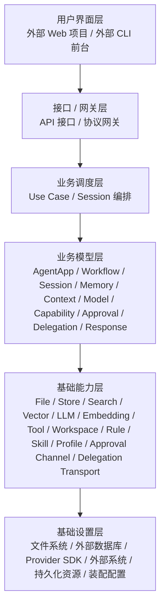
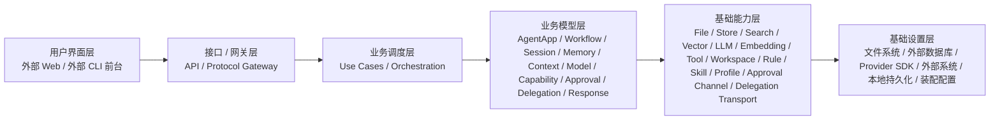
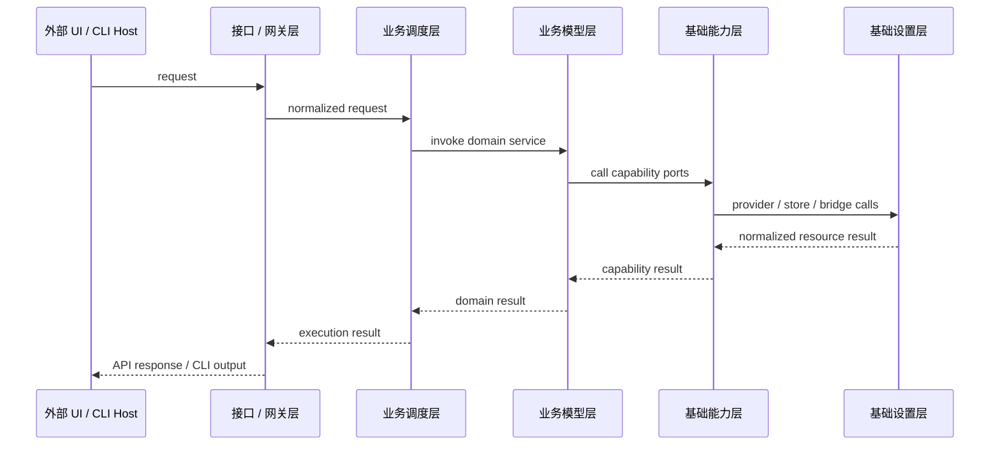
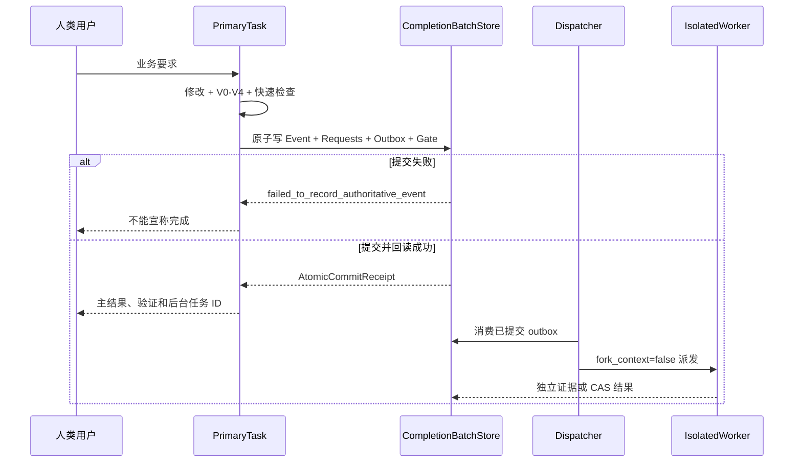

# 系统架构设计

## 文档控制

| 项目 | 内容 |
|---|---|
| 文档 ID | `DESIGN-ARCH-001` |
| 正式版本 | `v3.1.0` |
| 来源候选 | `TASK-DESIGN-001-R019` |
| 发布事务 | `DESIGN-RELEASE-TX-R019-G001` |
| 负责人 | `HUMAN_ARCHITECTURE_DOMAIN_LEAD` |
| 修改 / 审核 / 批准 | `uroborus` / `uroborus` / `uroborus` |
| 状态 | 已批准并生效 |
| 上游 | `solution-overview`、`technical-selection` |
| 下游 | `module-domain-design`、`data-design`、`api-design`、`frontend-design` |

## 文档职责

- 允许保存：系统上下文；技术分层；运行时；部署边界；安全边界；外部依赖。
- 禁止保存：模块清单副本；任务状态；机器 schema 全量。
- 主要读者：架构、开发、测试、运维。

## 正式内容

**项目名称：** 山海工枢 / shanforge
**文档状态：** `v2` 平台主设计
**负责人：** 仓库维护者
**主要读者：** 架构维护者 | Agent Runtime 开发者 | 业务 Agent 开发者
**上游输入：** PRD | 需求分析 | Hermes Agent 源码调研报告
**下游输出：** 模块边界 | API 设计 | 实施计划 | 测试计划
**关联 ID：** `REQ-001` ~ `REQ-010`, `ADR-001` ~ `ADR-007`, `MOD-001` ~ `MOD-014`, `API-001` ~ `API-013`
**最后更新：** 2026-04-15

## 1. 平台结论

`v2` 的产品中心是抽象 Agent 平台，不是旧脚本集合，也不是单一 CLI 工具。

平台吸收 Hermes 的核心思想，但不照搬其工程形态。正式架构口径如下：

- 整个系统先按能力分成 6 层：用户界面层、接口/网关层、业务调度层、业务模型层、基础能力层、基础设置层。
- 每一层内部再按业务领域内聚建模，例如 `memory`、`workflow`、`session`、`approval`、`delegation`。
- 基础能力层对上提供统一技术能力，对内再通过不同基础设置实现多样化支撑。
- 业务调度层必须保持薄，只做用例编排，不承载供应商差异、持久化细节和底层规则判断。
- 正式 owner 规则只有一条：谁调用下层，谁定义接口；基础设置层只实现，不拥有上层逻辑。

## 2. 六层结构



### 2.1 每层职责

| 层 | 作用 | 当前代码落点 |
|---|---|---|
| 用户界面层 | 负责最终的人机交互界面 | 仓外 Web 项目、外部 CLI 前台；本仓不承载完整 UI |
| 接口/网关层 | 把外部请求收口为统一平台入口 | `src/access/` |
| 业务调度层 | 组织一次完整业务执行 | `src/application/` |
| 业务模型层 | 定义稳定业务对象、业务逻辑与领域规则 | `src/domain/` |
| 基础能力层 | 提供可复用技术能力服务 | `src/runtime/` |
| 基础设置层 | 提供文件、数据库、外部系统和装配实现 | `src/settings/` |

### 2.2 当前仓库的真实边界

本仓当前主要负责后 5 层中的 5 个实现区域：

- 不负责完整用户界面层产品实现。
- 负责接口/网关层中的 API 接口和协议网关。
- 负责业务调度层、业务模型层、基础能力层。
- 负责基础设置层中的本地实现、外部系统桥接和容器装配。

也就是说，当前仓库不是“前后端一体 UI 仓”，而是“平台主仓”。

## 3. 架构原则

### 3.1 按能力分层，而不是按技术杂项分层

分层优先级固定如下：

1. 先判断它属于 UI、网关、调度、模型、能力还是设置。
2. 再判断它属于哪个业务领域，例如记忆、模型、能力注册、审批、委派。
3. 最后才决定它落在哪个目录或由哪个适配器实现。

因此：

- 基础设置层只有一个正式代码根：`src/settings/`。
- `src/settings/` 内部再按实现领域与支撑模块组织，不新增架构层次。
- `ports/` 也不是独立层，而是消费者所在层拥有的依赖接口。

### 3.2 基础能力层与基础设置层必须分开

这一点是当前架构重构后的正式定稿：

- 基础能力层负责“提供通用技术能力”，例如文件访问、结构化存储、全文检索、向量召回、模型调用、规则源、审批通道、委派通道。
- 基础设置层负责“提供这些能力背后的真实资源和实现”，例如文件系统、JSONL/SQLite/外部数据库、模型供应商 SDK、Hermes bridge、外部工具系统。
- `src/settings/composition/` 是设置层内唯一 composition root 与本地业务绑定层：它在启动时做跨层对象接线，并通过外部 `shanforge-di` 完成业务 ID 到具体实现的解析，但不承担业务编排，也不向业务层暴露 class path 级技术字符串。
- 宿主 Skill 的唯一仓内事实源是顶层 `skills/*/SKILL.md`。代理宿主只在匹配任务时读取它们；Shanforge runtime 不提供 Skill catalog、安装、启停、session activation、配置或持久化能力。

一句话：

```text
能力层负责技术抽象与编排，设置层负责实现与接线。
```

### 3.3 统一接口原则

同一能力域在对外时必须是统一服务界面，在对内时才允许多实现并存。

例如：

- 接口/网关层只看到 `AgentAppMaterializationUseCase`、`RuntimeExecutionUseCase` 这类应用用例接口。
- 业务调度层只看到 `MemoryDomainService`、`WorkflowDomainService`、`CapabilityDomainService` 这类领域服务接口。
- 业务模型层只看到 `MemoryRecordRepositoryPort`、`CapabilityExecutionPort`、`ApprovalRequestPort` 这类基础能力接口。
- 基础能力层只看到 `LLMProviderPort`、`StructuredStoreProviderPort`、`RuleSourceProviderPort` 这类 provider 接口。

### 3.4 业务调度层必须足够薄

`src/application/` 的职责只有：

- 解析入口语义
- 选择业务 app / workflow
- 开 session
- 调用领域服务
- 收口结果

它不负责：

- provider 选择细节
- store 类型选择
- prompt/context 细节
- 审批与沙箱规则本体
- 供应商返回结构转换

## 4. 各层领域与接口 owner

当前正式 owner 关系如下：

| 调用层 | 领域 | 拥有的接口 |
|---|---|---|
| 用户界面层 | `web_console`、`cli_frontend`、`automation_host` | 消费网关接口，不向下定义本仓代码接口 |
| 接口/网关层 | `runtime_gateway`、`workflow_gateway`、`memory_gateway`、`capability_gateway` | `src/access/ports/application_use_cases.py` |
| 业务调度层 | `app_application`、`workflow_application`、`session_application`、`memory_application`、`execution_application` | `src/application/ports/domain_services.py` |
| 业务模型层 | `agent_app`、`workflow`、`session`、`memory`、`context`、`model`、`capability`、`approval`、`delegation`、`response` | `src/domain/*/ports.py` |
| 基础能力层 | `file_access`、`structured_storage`、`llm_gateway`、`tool_execution`、`rule_source`、`profile_source` 等 | `src/runtime/ports/*.py` |
| 基础设置层 | `model`、`memory`、`session`、`workspace`、`approval`、`delegation`、`gateway`、`capability_registry`、`hermes`、`composition`、`shared` | 不定义新的上层逻辑接口，可实现 domain-owned 持久化端口与 runtime-owned provider 接口 |

## 5. 关键运行链路

### 5.1 主执行链

```text
外部 UI / 前台
  -> 接口 / 网关层
  -> 业务调度层
  -> 业务模型层
  -> 基础能力层
  -> 基础设置层
```

更具体地说：

1. 外部 Web 或 CLI 前台发起请求。
2. `src/access/` 把请求收口成 API / CLI 网关调用。
3. `src/application/` 编排 session、workflow 和结果收口。
4. `src/domain/` 执行业务规则，决定 recall、审批、委派、响应等语义。
5. `src/runtime/` 为领域提供文件、存储、检索、模型、规则源等通用能力。
6. `src/settings/` 提供 provider、持久化、桥接和装配实现，并在层内按实现领域组织代码。

### 5.2 记忆领域链路

```text
接口 / 网关层
  -> 业务调度层 MemoryDomainService
  -> 业务模型层 memory
  -> 基础能力层 recall/search/rule/profile/store capability
  -> 基础设置层 file/db/index/provider implementation
```

### 5.3 模型调用链路

```text
业务模型层 model
  -> 基础能力层 llm_gateway / embedding_gateway
  -> 基础设置层 provider adapter
```

## 6. Hermes 对应关系

Hermes 对 `v2` 的真正启发，不是目录形态，而是能力切分方式：

| Hermes 思路 | `v2` 吸收方式 | 当前归属层次 |
|---|---|---|
| Agent 主循环 | 只吸收为基础能力层执行辅助，不作为业务 owner | 基础能力层 |
| Tool registry | 吸收到 `capability` 领域 + tool execution capability | 业务模型层 + 基础能力层 + 基础设置层 |
| Session / memory | 吸收到 `session` / `memory` 领域 + 对应基础能力 | 业务模型层 + 基础能力层 + 基础设置层 |
| Provider abstraction | 收口为 `llm_gateway` / `embedding_gateway` provider 模型 | 基础能力层 + 基础设置层 |
| Delegation | 收口为 `delegation` 领域 + delegation backend | 业务模型层 + 基础能力层 + 基础设置层 |
| Gateway / session context | 收口为接口/网关层契约 + Hermes-backed adapter scaffold | 接口/网关层 + 基础设置层 |

正式规则：

- 复用 Hermes 的成熟实现，但只允许落在基础设置层实现区。
- Hermes 不能反向主导 `domain / application / runtime` 的边界。
- 所有 Hermes 能力都必须先经过 `shanforge` 自己的接口契约收口。
- `shanforge-di` 作为外部反射 / DI 技术库，只允许由 `src/settings/composition/` 集成使用；业务层和普通 runtime service 只能消费已注入好的接口对象。

## 7. 架构决策定稿

| ADR | 决策 | 定稿 |
|---|---|---|
| `ADR-001` | `v2` 以抽象 Agent 平台为产品中心 | 保留 |
| `ADR-002` | 业务逻辑放在 Business Agent App / Workflow 中 | 保留 |
| `ADR-003` | 工作流采用声明式 DSL | 保留 |
| `ADR-004` | 大模型交互统一经领域策略 + 基础能力层 provider | 保留，并明确 owner |
| `ADR-005` | 工具能力统一治理 | 保留 |
| `ADR-006` | Context / Memory / Session 走统一平台闭环 | 保留 |
| `ADR-007` | 文件、数据库、外部系统只作为基础设置层实现存在 | 重述并定稿 |

## 8. 本轮重构结论

本轮架构重构后，正式口径只有一套：

- 用户界面层由仓外 Web 项目和外部 CLI 前台承担。
- 本仓实现接口/网关层中的 API 与协议网关；本地 CLI demo 已删除。
- `src/application/` 是薄业务调度层。
- `src/domain/` 是业务模型层，也是平台业务逻辑 owner。
- `src/runtime/` 是基础能力层，只提供通用技术能力。
- `src/settings/` 是基础设置层唯一正式代码根；`model / memory / session / workspace / approval / delegation / gateway / capability_registry / hermes` 是层内实现领域，`composition / shared` 是层内支撑模块。

后续所有系统架构、模块边界、代码映射和接口定义，都必须使用这套口径。

---

<mxfile host="Electron" agent="Mozilla/5.0 (Macintosh; Intel Mac OS X 10_15_7) AppleWebKit/537.36 (KHTML, like Gecko) draw.io/29.6.6 Chrome/144.0.7559.236 Electron/40.8.4 Safari/537.36" compressed="false" version="29.6.6" pages="7"><diagram id="layer-overview" name="01-系统分层总览">
    <mxGraphModel dx="2377" dy="1273" grid="1" gridSize="10" guides="1" tooltips="1" connect="1" arrows="1" fold="1" page="1" pageScale="1" pageWidth="2200" pageHeight="1400" math="0" shadow="0">
      <root>
        <mxCell id="0" />
        <mxCell id="1" parent="0" />
        <mxCell id="t1" parent="1" style="text;html=1;strokeColor=none;fillColor=none;align=center;verticalAlign=middle;fontSize=26;fontStyle=1;" value="shanforge v2 系统分层总览图" vertex="1">
          <mxGeometry height="30" width="700" x="700" y="20" as="geometry" />
        </mxCell>
        <mxCell id="t2" parent="1" style="text;html=1;strokeColor=none;fillColor=none;align=center;verticalAlign=middle;fontSize=12;fontColor=#666666;" value="六层架构中，仓外 UI 未在本图展开；本图从仓内接口/网关层开始展示，并将基础设置层拆成实现分区" vertex="1">
          <mxGeometry height="20" width="1060" x="520" y="55" as="geometry" />
        </mxCell>
        <mxCell id="l1" parent="1" style="rounded=1;whiteSpace=wrap;html=1;fillColor=#f4cccc;strokeColor=#cc6666;fontSize=18;fontStyle=1;" value="接口/网关层" vertex="1">
          <mxGeometry height="110" width="150" x="130" y="100" as="geometry" />
        </mxCell>
        <mxCell id="l2" parent="1" style="rounded=1;whiteSpace=wrap;html=1;fillColor=#d9ead3;strokeColor=#82b366;fontSize=18;fontStyle=1;" value="业务模型层" vertex="1">
          <mxGeometry height="130" width="150" x="130" y="230" as="geometry" />
        </mxCell>
        <mxCell id="l3" parent="1" style="rounded=1;whiteSpace=wrap;html=1;fillColor=#cfe2f3;strokeColor=#6c8ebf;fontSize=18;fontStyle=1;" value="业务调度层" vertex="1">
          <mxGeometry height="130" width="150" x="130" y="380" as="geometry" />
        </mxCell>
        <mxCell id="l4" parent="1" style="rounded=1;whiteSpace=wrap;html=1;fillColor=#d9d2e9;strokeColor=#9673a6;fontSize=18;fontStyle=1;" value="基础能力层" vertex="1">
          <mxGeometry height="250" width="150" x="130" y="530" as="geometry" />
        </mxCell>
        <mxCell id="l5" parent="1" style="rounded=1;whiteSpace=wrap;html=1;fillColor=#fce5cd;strokeColor=#d79b00;fontSize=18;fontStyle=1;" value="基础设置层&lt;br/&gt;外部实现分区" vertex="1">
          <mxGeometry height="160" width="150" x="130" y="800" as="geometry" />
        </mxCell>
        <mxCell id="l6" parent="1" style="rounded=1;whiteSpace=wrap;html=1;fillColor=#d0e0e3;strokeColor=#76a5af;fontSize=18;fontStyle=1;" value="基础设置层&lt;br/&gt;持久化/装配分区" vertex="1">
          <mxGeometry height="140" width="150" x="130" y="980" as="geometry" />
        </mxCell>
        <mxCell id="g1" parent="1" style="rounded=1;whiteSpace=wrap;html=1;fillColor=#fff6f6;strokeColor=#cc6666;strokeWidth=2;" value="" vertex="1">
          <mxGeometry height="110" width="1540" x="310" y="100" as="geometry" />
        </mxCell>
        <mxCell id="g2" parent="1" style="rounded=1;whiteSpace=wrap;html=1;fillColor=#f7fff5;strokeColor=#82b366;strokeWidth=2;" value="" vertex="1">
          <mxGeometry height="130" width="1540" x="310" y="230" as="geometry" />
        </mxCell>
        <mxCell id="g3" parent="1" style="rounded=1;whiteSpace=wrap;html=1;fillColor=#f7fbff;strokeColor=#6c8ebf;strokeWidth=2;" value="" vertex="1">
          <mxGeometry height="130" width="1540" x="310" y="380" as="geometry" />
        </mxCell>
        <mxCell id="g4" parent="1" style="rounded=1;whiteSpace=wrap;html=1;fillColor=#fbf8ff;strokeColor=#9673a6;strokeWidth=2;" value="" vertex="1">
          <mxGeometry height="250" width="1540" x="310" y="530" as="geometry" />
        </mxCell>
        <mxCell id="g5" parent="1" style="rounded=1;whiteSpace=wrap;html=1;fillColor=#fffaf2;strokeColor=#d79b00;strokeWidth=2;" value="" vertex="1">
          <mxGeometry height="160" width="1540" x="310" y="800" as="geometry" />
        </mxCell>
        <mxCell id="g6" parent="1" style="rounded=1;whiteSpace=wrap;html=1;fillColor=#f4fbfc;strokeColor=#76a5af;strokeWidth=2;" value="" vertex="1">
          <mxGeometry height="140" width="1540" x="310" y="980" as="geometry" />
        </mxCell>
        <mxCell id="m11" parent="1" style="rounded=1;whiteSpace=wrap;html=1;fillColor=#fce5e5;strokeColor=#cc6666;fontSize=16;" value="命令行入口" vertex="1">
          <mxGeometry height="50" width="220" x="360" y="130" as="geometry" />
        </mxCell>
        <mxCell id="m12" parent="1" style="rounded=1;whiteSpace=wrap;html=1;fillColor=#fce5e5;strokeColor=#cc6666;fontSize=16;" value="对话入口" vertex="1">
          <mxGeometry height="50" width="220" x="630" y="130" as="geometry" />
        </mxCell>
        <mxCell id="m13" parent="1" style="rounded=1;whiteSpace=wrap;html=1;fillColor=#fce5e5;strokeColor=#cc6666;fontSize=16;" value="HTTP API 入口" vertex="1">
          <mxGeometry height="50" width="220" x="900" y="130" as="geometry" />
        </mxCell>
        <mxCell id="m14" parent="1" style="rounded=1;whiteSpace=wrap;html=1;fillColor=#fce5e5;strokeColor=#cc6666;fontSize=16;" value="MCP / 插件接入" vertex="1">
          <mxGeometry height="50" width="220" x="1170" y="130" as="geometry" />
        </mxCell>
        <mxCell id="m15" parent="1" style="rounded=1;whiteSpace=wrap;html=1;fillColor=#fce5e5;strokeColor=#cc6666;fontSize=16;" value="自动化任务触发" vertex="1">
          <mxGeometry height="50" width="220" x="1440" y="130" as="geometry" />
        </mxCell>
        <mxCell id="m21" parent="1" style="rounded=1;whiteSpace=wrap;html=1;fillColor=#e8f5e3;strokeColor=#82b366;fontSize=15;" value="业务代理应用&lt;br/&gt;定义一个具体业务助手" vertex="1">
          <mxGeometry height="70" width="260" x="360" y="258" as="geometry" />
        </mxCell>
        <mxCell id="m22" parent="1" style="rounded=1;whiteSpace=wrap;html=1;fillColor=#e8f5e3;strokeColor=#82b366;fontSize=15;" value="任务流程定义&lt;br/&gt;先做什么、后做什么" vertex="1">
          <mxGeometry height="70" width="260" x="660" y="258" as="geometry" />
        </mxCell>
        <mxCell id="m23" parent="1" style="rounded=1;whiteSpace=wrap;html=1;fillColor=#e8f5e3;strokeColor=#82b366;fontSize=15;" value="模型选择规则&lt;br/&gt;每一步用哪个模型" vertex="1">
          <mxGeometry height="70" width="260" x="960" y="258" as="geometry" />
        </mxCell>
        <mxCell id="m24" parent="1" style="rounded=1;whiteSpace=wrap;html=1;fillColor=#e8f5e3;strokeColor=#82b366;fontSize=15;" value="结果格式定义&lt;br/&gt;最后输出什么结构" vertex="1">
          <mxGeometry height="70" width="260" x="1260" y="258" as="geometry" />
        </mxCell>
        <mxCell id="m25" parent="1" style="rounded=1;whiteSpace=wrap;html=1;fillColor=#e8f5e3;strokeColor=#82b366;fontSize=15;" value="能力引用清单&lt;br/&gt;这个业务需要哪些工具" vertex="1">
          <mxGeometry height="70" width="240" x="1560" y="258" as="geometry" />
        </mxCell>
        <mxCell id="m31" parent="1" style="rounded=1;whiteSpace=wrap;html=1;fillColor=#eaf3fb;strokeColor=#6c8ebf;fontSize=16;" value="请求标准化" vertex="1">
          <mxGeometry height="60" width="220" x="360" y="415" as="geometry" />
        </mxCell>
        <mxCell id="m32" parent="1" style="rounded=1;whiteSpace=wrap;html=1;fillColor=#eaf3fb;strokeColor=#6c8ebf;fontSize=16;" value="业务应用选择" vertex="1">
          <mxGeometry height="60" width="220" x="620" y="415" as="geometry" />
        </mxCell>
        <mxCell id="m33" parent="1" style="rounded=1;whiteSpace=wrap;html=1;fillColor=#eaf3fb;strokeColor=#6c8ebf;fontSize=16;" value="会话创建 / 恢复" vertex="1">
          <mxGeometry height="60" width="220" x="880" y="415" as="geometry" />
        </mxCell>
        <mxCell id="m34" parent="1" style="rounded=1;whiteSpace=wrap;html=1;fillColor=#eaf3fb;strokeColor=#6c8ebf;fontSize=16;" value="流程加载与编排" vertex="1">
          <mxGeometry height="60" width="220" x="1140" y="415" as="geometry" />
        </mxCell>
        <mxCell id="m35" parent="1" style="rounded=1;whiteSpace=wrap;html=1;fillColor=#eaf3fb;strokeColor=#6c8ebf;fontSize=16;" value="执行协调" vertex="1">
          <mxGeometry height="60" width="220" x="1400" y="415" as="geometry" />
        </mxCell>
        <mxCell id="m41" parent="1" style="rounded=1;whiteSpace=wrap;html=1;fillColor=#efe9fb;strokeColor=#9673a6;fontSize=15;" value="流程执行器&lt;br/&gt;按步骤推进任务" vertex="1">
          <mxGeometry height="70" width="220" x="360" y="570" as="geometry" />
        </mxCell>
        <mxCell id="m42" parent="1" style="rounded=1;whiteSpace=wrap;html=1;fillColor=#efe9fb;strokeColor=#9673a6;fontSize=15;" value="上下文组装器&lt;br/&gt;拼装当前步骤所需上下文" vertex="1">
          <mxGeometry height="70" width="260" x="620" y="570" as="geometry" />
        </mxCell>
        <mxCell id="m43" parent="1" style="rounded=1;whiteSpace=wrap;html=1;fillColor=#efe9fb;strokeColor=#9673a6;fontSize=15;" value="记忆系统&lt;br/&gt;召回经验、沉淀记忆" vertex="1">
          <mxGeometry height="70" width="240" x="920" y="570" as="geometry" />
        </mxCell>
        <mxCell id="m44" parent="1" style="rounded=1;whiteSpace=wrap;html=1;fillColor=#efe9fb;strokeColor=#9673a6;fontSize=15;" value="大模型运行时&lt;br/&gt;统一调用各家模型" vertex="1">
          <mxGeometry height="70" width="240" x="1200" y="570" as="geometry" />
        </mxCell>
        <mxCell id="m45" parent="1" style="rounded=1;whiteSpace=wrap;html=1;fillColor=#efe9fb;strokeColor=#9673a6;fontSize=15;" value="能力注册中心&lt;br/&gt;统一管理工具和能力" vertex="1">
          <mxGeometry height="70" width="240" x="1480" y="570" as="geometry" />
        </mxCell>
        <mxCell id="m46" parent="1" style="rounded=1;whiteSpace=wrap;html=1;fillColor=#efe9fb;strokeColor=#9673a6;fontSize=15;" value="审批与风控&lt;br/&gt;高风险动作先决策" vertex="1">
          <mxGeometry height="70" width="220" x="360" y="675" as="geometry" />
        </mxCell>
        <mxCell id="m47" parent="1" style="rounded=1;whiteSpace=wrap;html=1;fillColor=#efe9fb;strokeColor=#9673a6;fontSize=15;" value="子任务委派&lt;br/&gt;把子问题拆给子 Agent" vertex="1">
          <mxGeometry height="70" width="260" x="620" y="675" as="geometry" />
        </mxCell>
        <mxCell id="m48" parent="1" style="rounded=1;whiteSpace=wrap;html=1;fillColor=#efe9fb;strokeColor=#9673a6;fontSize=15;" value="响应标准化&lt;br/&gt;统一输出结果格式" vertex="1">
          <mxGeometry height="70" width="240" x="920" y="675" as="geometry" />
        </mxCell>
        <mxCell id="m49" parent="1" style="rounded=1;whiteSpace=wrap;html=1;fillColor=#efe9fb;strokeColor=#9673a6;fontSize=15;" value="执行沙箱&lt;br/&gt;限制可写范围和执行权限" vertex="1">
          <mxGeometry height="70" width="240" x="1200" y="675" as="geometry" />
        </mxCell>
        <mxCell id="m410" parent="1" style="rounded=1;whiteSpace=wrap;html=1;fillColor=#efe9fb;strokeColor=#9673a6;fontSize=15;" value="运行诊断与用量统计&lt;br/&gt;记录耗时、token、错误" vertex="1">
          <mxGeometry height="70" width="260" x="1480" y="675" as="geometry" />
        </mxCell>
        <mxCell id="m51" parent="1" style="rounded=1;whiteSpace=wrap;html=1;fillColor=#fff1db;strokeColor=#d79b00;fontSize=16;" value="模型 Provider 适配器" vertex="1">
          <mxGeometry height="55" width="180" x="360" y="845" as="geometry" />
        </mxCell>
        <mxCell id="m52" parent="1" style="rounded=1;whiteSpace=wrap;html=1;fillColor=#fff1db;strokeColor=#d79b00;fontSize=16;" value="能力注册适配器" vertex="1">
          <mxGeometry height="55" width="180" x="580" y="845" as="geometry" />
        </mxCell>
        <mxCell id="m53" parent="1" style="rounded=1;whiteSpace=wrap;html=1;fillColor=#fff1db;strokeColor=#d79b00;fontSize=16;" value="工作区适配器" vertex="1">
          <mxGeometry height="55" width="180" x="800" y="845" as="geometry" />
        </mxCell>
        <mxCell id="m54" parent="1" style="rounded=1;whiteSpace=wrap;html=1;fillColor=#fff1db;strokeColor=#d79b00;fontSize=16;" value="记忆总结器适配器" vertex="1">
          <mxGeometry height="55" width="180" x="1020" y="845" as="geometry" />
        </mxCell>
        <mxCell id="m55" parent="1" style="rounded=1;whiteSpace=wrap;html=1;fillColor=#fff1db;strokeColor=#d79b00;fontSize=16;" value="遗留系统桥接" vertex="1">
          <mxGeometry height="55" width="180" x="1240" y="845" as="geometry" />
        </mxCell>
        <mxCell id="m56" parent="1" style="rounded=1;whiteSpace=wrap;html=1;fillColor=#fff1db;strokeColor=#d79b00;fontSize=16;" value="文件 / Git / Shell 适配器" vertex="1">
          <mxGeometry height="55" width="240" x="1460" y="845" as="geometry" />
        </mxCell>
        <mxCell id="m61" parent="1" style="rounded=1;whiteSpace=wrap;html=1;fillColor=#e7f6f8;strokeColor=#76a5af;fontSize=16;" value="会话事件账本" vertex="1">
          <mxGeometry height="55" width="210" x="380" y="1020" as="geometry" />
        </mxCell>
        <mxCell id="m62" parent="1" style="rounded=1;whiteSpace=wrap;html=1;fillColor=#e7f6f8;strokeColor=#76a5af;fontSize=16;" value="记忆 / 证据存储" vertex="1">
          <mxGeometry height="55" width="210" x="630" y="1020" as="geometry" />
        </mxCell>
        <mxCell id="m63" parent="1" style="rounded=1;whiteSpace=wrap;html=1;fillColor=#e7f6f8;strokeColor=#76a5af;fontSize=16;" value="训练样本存储" vertex="1">
          <mxGeometry height="55" width="210" x="880" y="1020" as="geometry" />
        </mxCell>
        <mxCell id="m64" parent="1" style="rounded=1;whiteSpace=wrap;html=1;fillColor=#e7f6f8;strokeColor=#76a5af;fontSize=16;" value="Artifact 存储" vertex="1">
          <mxGeometry height="55" width="210" x="1130" y="1020" as="geometry" />
        </mxCell>
        <mxCell id="m65" parent="1" style="rounded=1;whiteSpace=wrap;html=1;fillColor=#e7f6f8;strokeColor=#76a5af;fontSize=16;" value="工作区 / 文件系统" vertex="1">
          <mxGeometry height="55" width="210" x="1380" y="1020" as="geometry" />
        </mxCell>
        <mxCell id="m66" parent="1" style="rounded=1;whiteSpace=wrap;html=1;fillColor=#e7f6f8;strokeColor=#76a5af;fontSize=15;" value="运行环境&lt;br/&gt;in-memory / JSONL / 向量库扩展" vertex="1">
          <mxGeometry height="75" width="180" x="1630" y="1010" as="geometry" />
        </mxCell>
        <mxCell id="e1" edge="1" parent="1" source="g1" style="edgeStyle=orthogonalEdgeStyle;rounded=0;orthogonalLoop=1;jettySize=auto;html=1;endArrow=block;endFill=1;strokeColor=#6c8ebf;strokeWidth=2;" target="g2">
          <mxGeometry relative="1" as="geometry" />
        </mxCell>
        <mxCell id="e2" edge="1" parent="1" source="g2" style="edgeStyle=orthogonalEdgeStyle;rounded=0;orthogonalLoop=1;jettySize=auto;html=1;endArrow=block;endFill=1;strokeColor=#6c8ebf;strokeWidth=2;" target="g3">
          <mxGeometry relative="1" as="geometry" />
        </mxCell>
        <mxCell id="e3" edge="1" parent="1" source="g3" style="edgeStyle=orthogonalEdgeStyle;rounded=0;orthogonalLoop=1;jettySize=auto;html=1;endArrow=block;endFill=1;strokeColor=#9673a6;strokeWidth=2;" target="g4">
          <mxGeometry relative="1" as="geometry" />
        </mxCell>
        <mxCell id="e4" edge="1" parent="1" source="g4" style="edgeStyle=orthogonalEdgeStyle;rounded=0;orthogonalLoop=1;jettySize=auto;html=1;endArrow=block;endFill=1;strokeColor=#d79b00;strokeWidth=2;" target="g5">
          <mxGeometry relative="1" as="geometry" />
        </mxCell>
        <mxCell id="e5" edge="1" parent="1" source="g5" style="edgeStyle=orthogonalEdgeStyle;rounded=0;orthogonalLoop=1;jettySize=auto;html=1;endArrow=block;endFill=1;strokeColor=#76a5af;strokeWidth=2;" target="g6">
          <mxGeometry relative="1" as="geometry" />
        </mxCell>
      </root>
    </mxGraphModel>
  </diagram>
  </mxfile>

---

<mxfile host="Electron" agent="Mozilla/5.0 (Macintosh; Intel Mac OS X 10_15_7) AppleWebKit/537.36 (KHTML, like Gecko) draw.io/29.6.6 Chrome/144.0.7559.236 Electron/40.8.4 Safari/537.36" compressed="false" version="29.6.6" pages="7"><diagram id="core-breakdown" name="02-平台核心能力分解">
    <mxGraphModel dx="2593" dy="1389" grid="1" gridSize="10" guides="1" tooltips="1" connect="1" arrows="1" fold="1" page="1" pageScale="1" pageWidth="2200" pageHeight="1400" math="0" shadow="0">
      <root>
        <mxCell id="0" />
        <mxCell id="1" parent="0" />
        <mxCell id="c1" parent="1" style="text;html=1;strokeColor=none;fillColor=none;align=center;verticalAlign=middle;fontSize=26;fontStyle=1;" value="shanforge v2 平台核心能力分解图" vertex="1">
          <mxGeometry height="30" width="760" x="680" y="20" as="geometry" />
        </mxCell>
        <mxCell id="c2" parent="1" style="text;html=1;strokeColor=none;fillColor=none;align=center;verticalAlign=middle;fontSize=12;fontColor=#666666;" value="把平台真正的“核心能力”拆清楚：执行、记忆、模型、工具、会话、协作、风控" vertex="1">
          <mxGeometry height="20" width="980" x="570" y="55" as="geometry" />
        </mxCell>
        <mxCell id="cl1" parent="1" style="rounded=1;whiteSpace=wrap;html=1;fillColor=#d9ead3;strokeColor=#82b366;fontSize=18;fontStyle=1;" value="执行主循环" vertex="1">
          <mxGeometry height="120" width="170" x="130" y="100" as="geometry" />
        </mxCell>
        <mxCell id="cl2" parent="1" style="rounded=1;whiteSpace=wrap;html=1;fillColor=#cfe2f3;strokeColor=#6c8ebf;fontSize=18;fontStyle=1;" value="会话与状态" vertex="1">
          <mxGeometry height="120" width="170" x="130" y="240" as="geometry" />
        </mxCell>
        <mxCell id="cl3" parent="1" style="rounded=1;whiteSpace=wrap;html=1;fillColor=#d9d2e9;strokeColor=#9673a6;fontSize=18;fontStyle=1;" value="记忆能力" vertex="1">
          <mxGeometry height="140" width="170" x="130" y="380" as="geometry" />
        </mxCell>
        <mxCell id="cl4" parent="1" style="rounded=1;whiteSpace=wrap;html=1;fillColor=#fce5cd;strokeColor=#d79b00;fontSize=18;fontStyle=1;" value="模型能力" vertex="1">
          <mxGeometry height="140" width="170" x="130" y="540" as="geometry" />
        </mxCell>
        <mxCell id="cl5" parent="1" style="rounded=1;whiteSpace=wrap;html=1;fillColor=#ead1dc;strokeColor=#c27ba0;fontSize=18;fontStyle=1;" value="工具能力" vertex="1">
          <mxGeometry height="140" width="170" x="130" y="700" as="geometry" />
        </mxCell>
        <mxCell id="cl6" parent="1" style="rounded=1;whiteSpace=wrap;html=1;fillColor=#d0e0e3;strokeColor=#76a5af;fontSize=18;fontStyle=1;" value="协作与治理" vertex="1">
          <mxGeometry height="140" width="170" x="130" y="860" as="geometry" />
        </mxCell>
        <mxCell id="cg1" parent="1" style="rounded=1;whiteSpace=wrap;html=1;fillColor=#f8fff5;strokeColor=#82b366;strokeWidth=2;" value="" vertex="1">
          <mxGeometry height="120" width="1700" x="330" y="100" as="geometry" />
        </mxCell>
        <mxCell id="cg2" parent="1" style="rounded=1;whiteSpace=wrap;html=1;fillColor=#f7fbff;strokeColor=#6c8ebf;strokeWidth=2;" value="" vertex="1">
          <mxGeometry height="120" width="1700" x="330" y="240" as="geometry" />
        </mxCell>
        <mxCell id="cg3" parent="1" style="rounded=1;whiteSpace=wrap;html=1;fillColor=#fbf8ff;strokeColor=#9673a6;strokeWidth=2;" value="" vertex="1">
          <mxGeometry height="140" width="1700" x="330" y="380" as="geometry" />
        </mxCell>
        <mxCell id="cg4" parent="1" style="rounded=1;whiteSpace=wrap;html=1;fillColor=#fffaf2;strokeColor=#d79b00;strokeWidth=2;" value="" vertex="1">
          <mxGeometry height="140" width="1700" x="330" y="540" as="geometry" />
        </mxCell>
        <mxCell id="cg5" parent="1" style="rounded=1;whiteSpace=wrap;html=1;fillColor=#fff7fb;strokeColor=#c27ba0;strokeWidth=2;" value="" vertex="1">
          <mxGeometry height="140" width="1700" x="330" y="700" as="geometry" />
        </mxCell>
        <mxCell id="cg6" parent="1" style="rounded=1;whiteSpace=wrap;html=1;fillColor=#f6fbfb;strokeColor=#76a5af;strokeWidth=2;" value="" vertex="1">
          <mxGeometry height="140" width="1700" x="330" y="860" as="geometry" />
        </mxCell>
        <mxCell id="cb11" parent="1" style="rounded=1;whiteSpace=wrap;html=1;fillColor=#eef9e9;strokeColor=#82b366;fontSize=15;" value="请求解析" vertex="1">
          <mxGeometry height="50" width="180" x="380" y="135" as="geometry" />
        </mxCell>
        <mxCell id="cb12" parent="1" style="rounded=1;whiteSpace=wrap;html=1;fillColor=#eef9e9;strokeColor=#82b366;fontSize=15;" value="业务应用装载" vertex="1">
          <mxGeometry height="50" width="180" x="600" y="135" as="geometry" />
        </mxCell>
        <mxCell id="cb13" parent="1" style="rounded=1;whiteSpace=wrap;html=1;fillColor=#eef9e9;strokeColor=#82b366;fontSize=15;" value="流程推进" vertex="1">
          <mxGeometry height="50" width="180" x="820" y="135" as="geometry" />
        </mxCell>
        <mxCell id="cb14" parent="1" style="rounded=1;whiteSpace=wrap;html=1;fillColor=#eef9e9;strokeColor=#82b366;fontSize=15;" value="失败重试" vertex="1">
          <mxGeometry height="50" width="180" x="1040" y="135" as="geometry" />
        </mxCell>
        <mxCell id="cb15" parent="1" style="rounded=1;whiteSpace=wrap;html=1;fillColor=#eef9e9;strokeColor=#82b366;fontSize=15;" value="结果收口" vertex="1">
          <mxGeometry height="50" width="180" x="1260" y="135" as="geometry" />
        </mxCell>
        <mxCell id="cb16" parent="1" style="rounded=1;whiteSpace=wrap;html=1;fillColor=#eef9e9;strokeColor=#82b366;fontSize=15;" value="用量统计" vertex="1">
          <mxGeometry height="50" width="180" x="1480" y="135" as="geometry" />
        </mxCell>
        <mxCell id="cb21" parent="1" style="rounded=1;whiteSpace=wrap;html=1;fillColor=#eaf3fb;strokeColor=#6c8ebf;fontSize=15;" value="会话 ID" vertex="1">
          <mxGeometry height="50" width="160" x="380" y="275" as="geometry" />
        </mxCell>
        <mxCell id="cb22" parent="1" style="rounded=1;whiteSpace=wrap;html=1;fillColor=#eaf3fb;strokeColor=#6c8ebf;fontSize=15;" value="运行状态" vertex="1">
          <mxGeometry height="50" width="160" x="580" y="275" as="geometry" />
        </mxCell>
        <mxCell id="cb23" parent="1" style="rounded=1;whiteSpace=wrap;html=1;fillColor=#eaf3fb;strokeColor=#6c8ebf;fontSize=15;" value="事件记录" vertex="1">
          <mxGeometry height="50" width="160" x="780" y="275" as="geometry" />
        </mxCell>
        <mxCell id="cb24" parent="1" style="rounded=1;whiteSpace=wrap;html=1;fillColor=#eaf3fb;strokeColor=#6c8ebf;fontSize=15;" value="证据记录" vertex="1">
          <mxGeometry height="50" width="160" x="980" y="275" as="geometry" />
        </mxCell>
        <mxCell id="cb25" parent="1" style="rounded=1;whiteSpace=wrap;html=1;fillColor=#eaf3fb;strokeColor=#6c8ebf;fontSize=15;" value="Artifact 记录" vertex="1">
          <mxGeometry height="50" width="170" x="1180" y="275" as="geometry" />
        </mxCell>
        <mxCell id="cb26" parent="1" style="rounded=1;whiteSpace=wrap;html=1;fillColor=#eaf3fb;strokeColor=#6c8ebf;fontSize=15;" value="诊断信息" vertex="1">
          <mxGeometry height="50" width="160" x="1390" y="275" as="geometry" />
        </mxCell>
        <mxCell id="cb31" parent="1" style="rounded=1;whiteSpace=wrap;html=1;fillColor=#efe9fb;strokeColor=#9673a6;fontSize=15;" value="Recall 查询" vertex="1">
          <mxGeometry height="55" width="180" x="380" y="420" as="geometry" />
        </mxCell>
        <mxCell id="cb32" parent="1" style="rounded=1;whiteSpace=wrap;html=1;fillColor=#efe9fb;strokeColor=#9673a6;fontSize=15;" value="候选提取" vertex="1">
          <mxGeometry height="55" width="180" x="600" y="420" as="geometry" />
        </mxCell>
        <mxCell id="cb33" parent="1" style="rounded=1;whiteSpace=wrap;html=1;fillColor=#efe9fb;strokeColor=#9673a6;fontSize=15;" value="规则校验" vertex="1">
          <mxGeometry height="55" width="180" x="820" y="420" as="geometry" />
        </mxCell>
        <mxCell id="cb34" parent="1" style="rounded=1;whiteSpace=wrap;html=1;fillColor=#efe9fb;strokeColor=#9673a6;fontSize=15;" value="晋升决策" vertex="1">
          <mxGeometry height="55" width="180" x="1040" y="420" as="geometry" />
        </mxCell>
        <mxCell id="cb35" parent="1" style="rounded=1;whiteSpace=wrap;html=1;fillColor=#efe9fb;strokeColor=#9673a6;fontSize=15;" value="衰减 / 合并 / 去重" vertex="1">
          <mxGeometry height="55" width="220" x="1260" y="420" as="geometry" />
        </mxCell>
        <mxCell id="cb36" parent="1" style="rounded=1;whiteSpace=wrap;html=1;fillColor=#efe9fb;strokeColor=#9673a6;fontSize=15;" value="训练样本沉淀" vertex="1">
          <mxGeometry height="55" width="200" x="1520" y="420" as="geometry" />
        </mxCell>
        <mxCell id="cb41" parent="1" style="rounded=1;whiteSpace=wrap;html=1;fillColor=#fff1db;strokeColor=#d79b00;fontSize=15;" value="Provider 选择" vertex="1">
          <mxGeometry height="55" width="180" x="380" y="585" as="geometry" />
        </mxCell>
        <mxCell id="cb42" parent="1" style="rounded=1;whiteSpace=wrap;html=1;fillColor=#fff1db;strokeColor=#d79b00;fontSize=15;" value="模型选择" vertex="1">
          <mxGeometry height="55" width="180" x="600" y="585" as="geometry" />
        </mxCell>
        <mxCell id="cb43" parent="1" style="rounded=1;whiteSpace=wrap;html=1;fillColor=#fff1db;strokeColor=#d79b00;fontSize=15;" value="预算控制" vertex="1">
          <mxGeometry height="55" width="180" x="820" y="585" as="geometry" />
        </mxCell>
        <mxCell id="cb44" parent="1" style="rounded=1;whiteSpace=wrap;html=1;fillColor=#fff1db;strokeColor=#d79b00;fontSize=15;" value="失败降级" vertex="1">
          <mxGeometry height="55" width="180" x="1040" y="585" as="geometry" />
        </mxCell>
        <mxCell id="cb45" parent="1" style="rounded=1;whiteSpace=wrap;html=1;fillColor=#fff1db;strokeColor=#d79b00;fontSize=15;" value="结构化输出" vertex="1">
          <mxGeometry height="55" width="180" x="1260" y="585" as="geometry" />
        </mxCell>
        <mxCell id="cb46" parent="1" style="rounded=1;whiteSpace=wrap;html=1;fillColor=#fff1db;strokeColor=#d79b00;fontSize=15;" value="用量 / 成本估算" vertex="1">
          <mxGeometry height="55" width="200" x="1480" y="585" as="geometry" />
        </mxCell>
        <mxCell id="cb51" parent="1" style="rounded=1;whiteSpace=wrap;html=1;fillColor=#fceef4;strokeColor=#c27ba0;fontSize=15;" value="能力注册" vertex="1">
          <mxGeometry height="55" width="180" x="380" y="745" as="geometry" />
        </mxCell>
        <mxCell id="cb52" parent="1" style="rounded=1;whiteSpace=wrap;html=1;fillColor=#fceef4;strokeColor=#c27ba0;fontSize=15;" value="输入输出结构" vertex="1">
          <mxGeometry height="55" width="180" x="600" y="745" as="geometry" />
        </mxCell>
        <mxCell id="cb53" parent="1" style="rounded=1;whiteSpace=wrap;html=1;fillColor=#fceef4;strokeColor=#c27ba0;fontSize=15;" value="写入范围定义" vertex="1">
          <mxGeometry height="55" width="180" x="820" y="745" as="geometry" />
        </mxCell>
        <mxCell id="cb54" parent="1" style="rounded=1;whiteSpace=wrap;html=1;fillColor=#fceef4;strokeColor=#c27ba0;fontSize=15;" value="风险等级" vertex="1">
          <mxGeometry height="55" width="180" x="1040" y="745" as="geometry" />
        </mxCell>
        <mxCell id="cb55" parent="1" style="rounded=1;whiteSpace=wrap;html=1;fillColor=#fceef4;strokeColor=#c27ba0;fontSize=15;" value="执行代理" vertex="1">
          <mxGeometry height="55" width="180" x="1260" y="745" as="geometry" />
        </mxCell>
        <mxCell id="cb56" parent="1" style="rounded=1;whiteSpace=wrap;html=1;fillColor=#fceef4;strokeColor=#c27ba0;fontSize=15;" value="证据要求" vertex="1">
          <mxGeometry height="55" width="180" x="1480" y="745" as="geometry" />
        </mxCell>
        <mxCell id="cb61" parent="1" style="rounded=1;whiteSpace=wrap;html=1;fillColor=#e9f6f7;strokeColor=#76a5af;fontSize=15;" value="审批决策" vertex="1">
          <mxGeometry height="55" width="180" x="380" y="905" as="geometry" />
        </mxCell>
        <mxCell id="cb62" parent="1" style="rounded=1;whiteSpace=wrap;html=1;fillColor=#e9f6f7;strokeColor=#76a5af;fontSize=15;" value="执行沙箱" vertex="1">
          <mxGeometry height="55" width="180" x="600" y="905" as="geometry" />
        </mxCell>
        <mxCell id="cb63" parent="1" style="rounded=1;whiteSpace=wrap;html=1;fillColor=#e9f6f7;strokeColor=#76a5af;fontSize=15;" value="子 Agent 委派" vertex="1">
          <mxGeometry height="55" width="180" x="820" y="905" as="geometry" />
        </mxCell>
        <mxCell id="cb64" parent="1" style="rounded=1;whiteSpace=wrap;html=1;fillColor=#e9f6f7;strokeColor=#76a5af;fontSize=15;" value="结果回传契约" vertex="1">
          <mxGeometry height="55" width="180" x="1040" y="905" as="geometry" />
        </mxCell>
        <mxCell id="cb65" parent="1" style="rounded=1;whiteSpace=wrap;html=1;fillColor=#e9f6f7;strokeColor=#76a5af;fontSize=15;" value="配置注入" vertex="1">
          <mxGeometry height="55" width="180" x="1260" y="905" as="geometry" />
        </mxCell>
        <mxCell id="cb66" parent="1" style="rounded=1;whiteSpace=wrap;html=1;fillColor=#e9f6f7;strokeColor=#76a5af;fontSize=15;" value="监控诊断" vertex="1">
          <mxGeometry height="55" width="180" x="1480" y="905" as="geometry" />
        </mxCell>
        <mxCell id="note1" parent="1" style="rounded=1;whiteSpace=wrap;html=1;fillColor=#fff2cc;strokeColor=#d6b656;fontSize=14;fontStyle=1;" value="记忆系统原则&lt;br/&gt;1. 事件和证据是一等事实源&lt;br/&gt;2. 记忆是二级资产&lt;br/&gt;3. Recall 和晋升决策分离" vertex="1">
          <mxGeometry height="160" width="240" x="1760" y="400" as="geometry" />
        </mxCell>
      </root>
    </mxGraphModel>
  </diagram>
  </mxfile>

---

<mxfile host="Electron" agent="Mozilla/5.0 (Macintosh; Intel Mac OS X 10_15_7) AppleWebKit/537.36 (KHTML, like Gecko) draw.io/29.6.6 Chrome/144.0.7559.236 Electron/40.8.4 Safari/537.36" compressed="false" version="29.6.6" pages="7"><diagram id="runtime-flow" name="03-业务运行链路图">
    <mxGraphModel dx="1820" dy="1020" grid="1" gridSize="10" guides="1" tooltips="1" connect="1" arrows="1" fold="1" page="1" pageScale="1" pageWidth="2200" pageHeight="1400" math="0" shadow="0">
      <root>
        <mxCell id="0" />
        <mxCell id="1" parent="0" />
        <mxCell id="f1" value="shanforge v2 业务运行链路图" style="text;html=1;strokeColor=none;fillColor=none;align=center;verticalAlign=middle;fontSize=26;fontStyle=1;" vertex="1" parent="1">
          <mxGeometry x="710" y="20" width="740" height="30" as="geometry" />
        </mxCell>
        <mxCell id="f2" value="按“请求进入 -&gt; 业务编排 -&gt; 核心执行 -&gt; 存储落盘 -&gt; 外部系统调用”顺序展示" style="text;html=1;strokeColor=none;fillColor=none;align=center;verticalAlign=middle;fontSize=12;fontColor=#666666;" vertex="1" parent="1">
          <mxGeometry x="620" y="55" width="920" height="20" as="geometry" />
        </mxCell>
        <mxCell id="flow_left" value="运行链路" style="rounded=1;whiteSpace=wrap;html=1;fillColor=#4f6bed;strokeColor=#3c4db3;fontColor=#ffffff;fontSize=18;fontStyle=1;rotation=90;" vertex="1" parent="1">
          <mxGeometry x="20" y="150" width="90" height="980" as="geometry" />
        </mxCell>
        <mxCell id="fl1" value="调用方" style="rounded=1;whiteSpace=wrap;html=1;fillColor=#d9ead3;strokeColor=#82b366;fontSize=18;fontStyle=1;" vertex="1" parent="1">
          <mxGeometry x="130" y="100" width="150" height="100" as="geometry" />
        </mxCell>
        <mxCell id="fl2" value="入口层" style="rounded=1;whiteSpace=wrap;html=1;fillColor=#f4cccc;strokeColor=#cc6666;fontSize=18;fontStyle=1;" vertex="1" parent="1">
          <mxGeometry x="130" y="220" width="150" height="110" as="geometry" />
        </mxCell>
        <mxCell id="fl3" value="业务编排层" style="rounded=1;whiteSpace=wrap;html=1;fillColor=#cfe2f3;strokeColor=#6c8ebf;fontSize=18;fontStyle=1;" vertex="1" parent="1">
          <mxGeometry x="130" y="350" width="150" height="130" as="geometry" />
        </mxCell>
        <mxCell id="fl4" value="核心执行层" style="rounded=1;whiteSpace=wrap;html=1;fillColor=#d9d2e9;strokeColor=#9673a6;fontSize=18;fontStyle=1;" vertex="1" parent="1">
          <mxGeometry x="130" y="500" width="150" height="250" as="geometry" />
        </mxCell>
        <mxCell id="fl5" value="存储层" style="rounded=1;whiteSpace=wrap;html=1;fillColor=#d0e0e3;strokeColor=#76a5af;fontSize=18;fontStyle=1;" vertex="1" parent="1">
          <mxGeometry x="130" y="770" width="150" height="150" as="geometry" />
        </mxCell>
        <mxCell id="fl6" value="外部系统层" style="rounded=1;whiteSpace=wrap;html=1;fillColor=#fce5cd;strokeColor=#d79b00;fontSize=18;fontStyle=1;" vertex="1" parent="1">
          <mxGeometry x="130" y="940" width="150" height="140" as="geometry" />
        </mxCell>
        <mxCell id="fg1" value="" style="rounded=1;whiteSpace=wrap;html=1;fillColor=#f7fff5;strokeColor=#82b366;strokeWidth=2;" vertex="1" parent="1">
          <mxGeometry x="320" y="100" width="1500" height="100" as="geometry" />
        </mxCell>
        <mxCell id="fg2" value="" style="rounded=1;whiteSpace=wrap;html=1;fillColor=#fff6f6;strokeColor=#cc6666;strokeWidth=2;" vertex="1" parent="1">
          <mxGeometry x="320" y="220" width="1500" height="110" as="geometry" />
        </mxCell>
        <mxCell id="fg3" value="" style="rounded=1;whiteSpace=wrap;html=1;fillColor=#f7fbff;strokeColor=#6c8ebf;strokeWidth=2;" vertex="1" parent="1">
          <mxGeometry x="320" y="350" width="1500" height="130" as="geometry" />
        </mxCell>
        <mxCell id="fg4" value="" style="rounded=1;whiteSpace=wrap;html=1;fillColor=#fbf8ff;strokeColor=#9673a6;strokeWidth=2;" vertex="1" parent="1">
          <mxGeometry x="320" y="500" width="1500" height="250" as="geometry" />
        </mxCell>
        <mxCell id="fg5" value="" style="rounded=1;whiteSpace=wrap;html=1;fillColor=#f4fbfc;strokeColor=#76a5af;strokeWidth=2;" vertex="1" parent="1">
          <mxGeometry x="320" y="770" width="1500" height="150" as="geometry" />
        </mxCell>
        <mxCell id="fg6" value="" style="rounded=1;whiteSpace=wrap;html=1;fillColor=#fffaf2;strokeColor=#d79b00;strokeWidth=2;" vertex="1" parent="1">
          <mxGeometry x="320" y="940" width="1500" height="140" as="geometry" />
        </mxCell>
        <mxCell id="fa1" value="用户" style="rounded=1;whiteSpace=wrap;html=1;fillColor=#eef9e9;strokeColor=#82b366;fontSize=16;" vertex="1" parent="1">
          <mxGeometry x="390" y="125" width="180" height="50" as="geometry" />
        </mxCell>
        <mxCell id="fa2" value="开发者" style="rounded=1;whiteSpace=wrap;html=1;fillColor=#eef9e9;strokeColor=#82b366;fontSize=16;" vertex="1" parent="1">
          <mxGeometry x="640" y="125" width="180" height="50" as="geometry" />
        </mxCell>
        <mxCell id="fa3" value="自动化任务" style="rounded=1;whiteSpace=wrap;html=1;fillColor=#eef9e9;strokeColor=#82b366;fontSize=16;" vertex="1" parent="1">
          <mxGeometry x="890" y="125" width="180" height="50" as="geometry" />
        </mxCell>
        <mxCell id="fa4" value="第三方系统" style="rounded=1;whiteSpace=wrap;html=1;fillColor=#eef9e9;strokeColor=#82b366;fontSize=16;" vertex="1" parent="1">
          <mxGeometry x="1140" y="125" width="180" height="50" as="geometry" />
        </mxCell>
        <mxCell id="fb1" value="CLI" style="rounded=1;whiteSpace=wrap;html=1;fillColor=#fce5e5;strokeColor=#cc6666;fontSize=16;" vertex="1" parent="1">
          <mxGeometry x="430" y="250" width="160" height="50" as="geometry" />
        </mxCell>
        <mxCell id="fb2" value="聊天界面" style="rounded=1;whiteSpace=wrap;html=1;fillColor=#fce5e5;strokeColor=#cc6666;fontSize=16;" vertex="1" parent="1">
          <mxGeometry x="650" y="250" width="160" height="50" as="geometry" />
        </mxCell>
        <mxCell id="fb3" value="HTTP API" style="rounded=1;whiteSpace=wrap;html=1;fillColor=#fce5e5;strokeColor=#cc6666;fontSize=16;" vertex="1" parent="1">
          <mxGeometry x="870" y="250" width="160" height="50" as="geometry" />
        </mxCell>
        <mxCell id="fb4" value="MCP / 插件" style="rounded=1;whiteSpace=wrap;html=1;fillColor=#fce5e5;strokeColor=#cc6666;fontSize=16;" vertex="1" parent="1">
          <mxGeometry x="1090" y="250" width="180" height="50" as="geometry" />
        </mxCell>
        <mxCell id="fc1" value="请求标准化" style="rounded=1;whiteSpace=wrap;html=1;fillColor=#eaf3fb;strokeColor=#6c8ebf;fontSize=16;" vertex="1" parent="1">
          <mxGeometry x="390" y="390" width="180" height="55" as="geometry" />
        </mxCell>
        <mxCell id="fc2" value="选择业务应用" style="rounded=1;whiteSpace=wrap;html=1;fillColor=#eaf3fb;strokeColor=#6c8ebf;fontSize=16;" vertex="1" parent="1">
          <mxGeometry x="630" y="390" width="180" height="55" as="geometry" />
        </mxCell>
        <mxCell id="fc3" value="准备会话与记忆" style="rounded=1;whiteSpace=wrap;html=1;fillColor=#eaf3fb;strokeColor=#6c8ebf;fontSize=16;" vertex="1" parent="1">
          <mxGeometry x="870" y="390" width="220" height="55" as="geometry" />
        </mxCell>
        <mxCell id="fc4" value="装载流程" style="rounded=1;whiteSpace=wrap;html=1;fillColor=#eaf3fb;strokeColor=#6c8ebf;fontSize=16;" vertex="1" parent="1">
          <mxGeometry x="1150" y="390" width="180" height="55" as="geometry" />
        </mxCell>
        <mxCell id="fc5" value="进入执行主循环" style="rounded=1;whiteSpace=wrap;html=1;fillColor=#eaf3fb;strokeColor=#6c8ebf;fontSize=16;" vertex="1" parent="1">
          <mxGeometry x="1390" y="390" width="220" height="55" as="geometry" />
        </mxCell>
        <mxCell id="fd1" value="流程执行器" style="rounded=1;whiteSpace=wrap;html=1;fillColor=#efe9fb;strokeColor=#9673a6;fontSize=16;" vertex="1" parent="1">
          <mxGeometry x="380" y="545" width="180" height="60" as="geometry" />
        </mxCell>
        <mxCell id="fd2" value="上下文组装器" style="rounded=1;whiteSpace=wrap;html=1;fillColor=#efe9fb;strokeColor=#9673a6;fontSize=16;" vertex="1" parent="1">
          <mxGeometry x="600" y="545" width="200" height="60" as="geometry" />
        </mxCell>
        <mxCell id="fd3" value="记忆系统" style="rounded=1;whiteSpace=wrap;html=1;fillColor=#efe9fb;strokeColor=#9673a6;fontSize=16;" vertex="1" parent="1">
          <mxGeometry x="840" y="545" width="180" height="60" as="geometry" />
        </mxCell>
        <mxCell id="fd4" value="大模型运行时" style="rounded=1;whiteSpace=wrap;html=1;fillColor=#efe9fb;strokeColor=#9673a6;fontSize=16;" vertex="1" parent="1">
          <mxGeometry x="1060" y="545" width="200" height="60" as="geometry" />
        </mxCell>
        <mxCell id="fd5" value="能力注册中心" style="rounded=1;whiteSpace=wrap;html=1;fillColor=#efe9fb;strokeColor=#9673a6;fontSize=16;" vertex="1" parent="1">
          <mxGeometry x="1300" y="545" width="200" height="60" as="geometry" />
        </mxCell>
        <mxCell id="fd6" value="审批与风控" style="rounded=1;whiteSpace=wrap;html=1;fillColor=#efe9fb;strokeColor=#9673a6;fontSize=16;" vertex="1" parent="1">
          <mxGeometry x="1540" y="545" width="200" height="60" as="geometry" />
        </mxCell>
        <mxCell id="fd7" value="子任务委派" style="rounded=1;whiteSpace=wrap;html=1;fillColor=#efe9fb;strokeColor=#9673a6;fontSize=16;" vertex="1" parent="1">
          <mxGeometry x="540" y="645" width="200" height="60" as="geometry" />
        </mxCell>
        <mxCell id="fd8" value="响应标准化" style="rounded=1;whiteSpace=wrap;html=1;fillColor=#efe9fb;strokeColor=#9673a6;fontSize=16;" vertex="1" parent="1">
          <mxGeometry x="800" y="645" width="200" height="60" as="geometry" />
        </mxCell>
        <mxCell id="fd9" value="Evidence / Artifact 收口" style="rounded=1;whiteSpace=wrap;html=1;fillColor=#efe9fb;strokeColor=#9673a6;fontSize=16;" vertex="1" parent="1">
          <mxGeometry x="1060" y="645" width="240" height="60" as="geometry" />
        </mxCell>
        <mxCell id="fd10" value="运行诊断与日志" style="rounded=1;whiteSpace=wrap;html=1;fillColor=#efe9fb;strokeColor=#9673a6;fontSize=16;" vertex="1" parent="1">
          <mxGeometry x="1360" y="645" width="220" height="60" as="geometry" />
        </mxCell>
        <mxCell id="fe1" value="会话事件账本" style="rounded=1;whiteSpace=wrap;html=1;fillColor=#e7f6f8;strokeColor=#76a5af;fontSize=16;" vertex="1" parent="1">
          <mxGeometry x="420" y="820" width="210" height="60" as="geometry" />
        </mxCell>
        <mxCell id="fe2" value="记忆 / 证据存储" style="rounded=1;whiteSpace=wrap;html=1;fillColor=#e7f6f8;strokeColor=#76a5af;fontSize=16;" vertex="1" parent="1">
          <mxGeometry x="680" y="820" width="210" height="60" as="geometry" />
        </mxCell>
        <mxCell id="fe3" value="训练样本存储" style="rounded=1;whiteSpace=wrap;html=1;fillColor=#e7f6f8;strokeColor=#76a5af;fontSize=16;" vertex="1" parent="1">
          <mxGeometry x="940" y="820" width="210" height="60" as="geometry" />
        </mxCell>
        <mxCell id="fe4" value="Artifact 存储" style="rounded=1;whiteSpace=wrap;html=1;fillColor=#e7f6f8;strokeColor=#76a5af;fontSize=16;" vertex="1" parent="1">
          <mxGeometry x="1200" y="820" width="210" height="60" as="geometry" />
        </mxCell>
        <mxCell id="ff1" value="OpenAI / Anthropic / Mock Provider" style="rounded=1;whiteSpace=wrap;html=1;fillColor=#fff1db;strokeColor=#d79b00;fontSize=15;" vertex="1" parent="1">
          <mxGeometry x="390" y="980" width="280" height="60" as="geometry" />
        </mxCell>
        <mxCell id="ff2" value="Git / Shell / 文件系统 / 工作区" style="rounded=1;whiteSpace=wrap;html=1;fillColor=#fff1db;strokeColor=#d79b00;fontSize=15;" vertex="1" parent="1">
          <mxGeometry x="740" y="980" width="300" height="60" as="geometry" />
        </mxCell>
        <mxCell id="ff3" value="JSONL / In-Memory / 向量库扩展" style="rounded=1;whiteSpace=wrap;html=1;fillColor=#fff1db;strokeColor=#d79b00;fontSize=15;" vertex="1" parent="1">
          <mxGeometry x="1110" y="980" width="300" height="60" as="geometry" />
        </mxCell>
        <mxCell id="ff4" value="第三方 API / 遗留系统桥接" style="rounded=1;whiteSpace=wrap;html=1;fillColor=#fff1db;strokeColor=#d79b00;fontSize=15;" vertex="1" parent="1">
          <mxGeometry x="1480" y="980" width="280" height="60" as="geometry" />
        </mxCell>
        <mxCell id="side1" value="配置中心" style="rounded=1;whiteSpace=wrap;html=1;fillColor=#4f6bed;strokeColor=#3c4db3;fontColor=#ffffff;fontSize=15;fontStyle=1;" vertex="1" parent="1">
          <mxGeometry x="1880" y="300" width="200" height="50" as="geometry" />
        </mxCell>
        <mxCell id="side2" value="日志监控" style="rounded=1;whiteSpace=wrap;html=1;fillColor=#4f6bed;strokeColor=#3c4db3;fontColor=#ffffff;fontSize=15;fontStyle=1;" vertex="1" parent="1">
          <mxGeometry x="1880" y="380" width="200" height="50" as="geometry" />
        </mxCell>
        <mxCell id="side3" value="权限审批" style="rounded=1;whiteSpace=wrap;html=1;fillColor=#4f6bed;strokeColor=#3c4db3;fontColor=#ffffff;fontSize=15;fontStyle=1;" vertex="1" parent="1">
          <mxGeometry x="1880" y="460" width="200" height="50" as="geometry" />
        </mxCell>
        <mxCell id="side4" value="审计追踪" style="rounded=1;whiteSpace=wrap;html=1;fillColor=#4f6bed;strokeColor=#3c4db3;fontColor=#ffffff;fontSize=15;fontStyle=1;" vertex="1" parent="1">
          <mxGeometry x="1880" y="540" width="200" height="50" as="geometry" />
        </mxCell>
        <mxCell id="fe11" style="edgeStyle=orthogonalEdgeStyle;rounded=0;orthogonalLoop=1;jettySize=auto;html=1;endArrow=block;endFill=1;strokeColor=#6c8ebf;strokeWidth=2;" edge="1" parent="1" source="fg1" target="fg2">
          <mxGeometry relative="1" as="geometry" />
        </mxCell>
        <mxCell id="fe12" style="edgeStyle=orthogonalEdgeStyle;rounded=0;orthogonalLoop=1;jettySize=auto;html=1;endArrow=block;endFill=1;strokeColor=#6c8ebf;strokeWidth=2;" edge="1" parent="1" source="fg2" target="fg3">
          <mxGeometry relative="1" as="geometry" />
        </mxCell>
        <mxCell id="fe13" style="edgeStyle=orthogonalEdgeStyle;rounded=0;orthogonalLoop=1;jettySize=auto;html=1;endArrow=block;endFill=1;strokeColor=#9673a6;strokeWidth=2;" edge="1" parent="1" source="fg3" target="fg4">
          <mxGeometry relative="1" as="geometry" />
        </mxCell>
        <mxCell id="fe14" style="edgeStyle=orthogonalEdgeStyle;rounded=0;orthogonalLoop=1;jettySize=auto;html=1;endArrow=block;endFill=1;strokeColor=#76a5af;strokeWidth=2;" edge="1" parent="1" source="fg4" target="fg5">
          <mxGeometry relative="1" as="geometry" />
        </mxCell>
        <mxCell id="fe15" style="edgeStyle=orthogonalEdgeStyle;rounded=0;orthogonalLoop=1;jettySize=auto;html=1;endArrow=block;endFill=1;strokeColor=#d79b00;strokeWidth=2;" edge="1" parent="1" source="fg5" target="fg6">
          <mxGeometry relative="1" as="geometry" />
        </mxCell>
      </root>
    </mxGraphModel>
  </diagram>
  </mxfile>

---

<mxfile host="Electron" agent="Mozilla/5.0 (Macintosh; Intel Mac OS X 10_15_7) AppleWebKit/537.36 (KHTML, like Gecko) draw.io/29.6.6 Chrome/144.0.7559.236 Electron/40.8.4 Safari/537.36" compressed="false" version="29.6.6" pages="7"><diagram id="module-matrix" name="04-功能模块清单图">
    <mxGraphModel dx="1820" dy="1020" grid="1" gridSize="10" guides="1" tooltips="1" connect="1" arrows="1" fold="1" page="1" pageScale="1" pageWidth="2200" pageHeight="1400" math="0" shadow="0">
      <root>
        <mxCell id="0" />
        <mxCell id="1" parent="0" />
        <mxCell id="m1" value="shanforge v2 功能模块清单图" style="text;html=1;strokeColor=none;fillColor=none;align=center;verticalAlign=middle;fontSize=26;fontStyle=1;" vertex="1" parent="1">
          <mxGeometry x="720" y="20" width="720" height="30" as="geometry" />
        </mxCell>
        <mxCell id="m2" value="按模块分组列出“模块名称 + 主要职责”，适合直接拿去评审和继续拆任务" style="text;html=1;strokeColor=none;fillColor=none;align=center;verticalAlign=middle;fontSize=12;fontColor=#666666;" vertex="1" parent="1">
          <mxGeometry x="620" y="55" width="920" height="20" as="geometry" />
        </mxCell>
        <mxCell id="mg1" value="业务定义模块" style="rounded=1;whiteSpace=wrap;html=1;fillColor=#d9ead3;strokeColor=#82b366;fontSize=20;fontStyle=1;align=left;verticalAlign=top;spacingTop=8;" vertex="1" parent="1">
          <mxGeometry x="60" y="100" width="1020" height="250" as="geometry" />
        </mxCell>
        <mxCell id="mg2" value="编排与入口模块" style="rounded=1;whiteSpace=wrap;html=1;fillColor=#cfe2f3;strokeColor=#6c8ebf;fontSize=20;fontStyle=1;align=left;verticalAlign=top;spacingTop=8;" vertex="1" parent="1">
          <mxGeometry x="1120" y="100" width="1020" height="250" as="geometry" />
        </mxCell>
        <mxCell id="mg3" value="核心执行模块" style="rounded=1;whiteSpace=wrap;html=1;fillColor=#d9d2e9;strokeColor=#9673a6;fontSize=20;fontStyle=1;align=left;verticalAlign=top;spacingTop=8;" vertex="1" parent="1">
          <mxGeometry x="60" y="390" width="1020" height="350" as="geometry" />
        </mxCell>
        <mxCell id="mg4" value="状态与治理模块" style="rounded=1;whiteSpace=wrap;html=1;fillColor=#d0e0e3;strokeColor=#76a5af;fontSize=20;fontStyle=1;align=left;verticalAlign=top;spacingTop=8;" vertex="1" parent="1">
          <mxGeometry x="1120" y="390" width="1020" height="350" as="geometry" />
        </mxCell>
        <mxCell id="mg5" value="接口与基础设施模块" style="rounded=1;whiteSpace=wrap;html=1;fillColor=#fce5cd;strokeColor=#d79b00;fontSize=20;fontStyle=1;align=left;verticalAlign=top;spacingTop=8;" vertex="1" parent="1">
          <mxGeometry x="60" y="780" width="2080" height="300" as="geometry" />
        </mxCell>
        <mxCell id="mm11" value="业务代理应用&lt;br/&gt;职责：定义某个具体业务助手" style="rounded=1;whiteSpace=wrap;html=1;fillColor=#eef9e9;strokeColor=#82b366;fontSize=16;" vertex="1" parent="1">
          <mxGeometry x="110" y="155" width="280" height="70" as="geometry" />
        </mxCell>
        <mxCell id="mm12" value="任务流程定义&lt;br/&gt;职责：声明步骤、条件、重试" style="rounded=1;whiteSpace=wrap;html=1;fillColor=#eef9e9;strokeColor=#82b366;fontSize=16;" vertex="1" parent="1">
          <mxGeometry x="430" y="155" width="280" height="70" as="geometry" />
        </mxCell>
        <mxCell id="mm13" value="模型选择规则&lt;br/&gt;职责：按步骤选模型、控预算" style="rounded=1;whiteSpace=wrap;html=1;fillColor=#eef9e9;strokeColor=#82b366;fontSize=16;" vertex="1" parent="1">
          <mxGeometry x="750" y="155" width="280" height="70" as="geometry" />
        </mxCell>
        <mxCell id="mm14" value="输出结果定义&lt;br/&gt;职责：规定最终返回结构" style="rounded=1;whiteSpace=wrap;html=1;fillColor=#eef9e9;strokeColor=#82b366;fontSize=16;" vertex="1" parent="1">
          <mxGeometry x="270" y="255" width="280" height="70" as="geometry" />
        </mxCell>
        <mxCell id="mm15" value="能力引用清单&lt;br/&gt;职责：说明流程依赖哪些工具" style="rounded=1;whiteSpace=wrap;html=1;fillColor=#eef9e9;strokeColor=#82b366;fontSize=16;" vertex="1" parent="1">
          <mxGeometry x="590" y="255" width="320" height="70" as="geometry" />
        </mxCell>
        <mxCell id="mm21" value="CLI / 对话 / HTTP / MCP 入口&lt;br/&gt;职责：接收不同来源请求" style="rounded=1;whiteSpace=wrap;html=1;fillColor=#eaf3fb;strokeColor=#6c8ebf;fontSize=16;" vertex="1" parent="1">
          <mxGeometry x="1170" y="155" width="300" height="70" as="geometry" />
        </mxCell>
        <mxCell id="mm22" value="请求标准化&lt;br/&gt;职责：把不同入口请求转成统一结构" style="rounded=1;whiteSpace=wrap;html=1;fillColor=#eaf3fb;strokeColor=#6c8ebf;fontSize=16;" vertex="1" parent="1">
          <mxGeometry x="1510" y="155" width="300" height="70" as="geometry" />
        </mxCell>
        <mxCell id="mm23" value="业务应用选择&lt;br/&gt;职责：决定本次跑哪个业务助手" style="rounded=1;whiteSpace=wrap;html=1;fillColor=#eaf3fb;strokeColor=#6c8ebf;fontSize=16;" vertex="1" parent="1">
          <mxGeometry x="1850" y="155" width="240" height="70" as="geometry" />
        </mxCell>
        <mxCell id="mm24" value="会话创建 / 恢复&lt;br/&gt;职责：打开或续跑一次会话" style="rounded=1;whiteSpace=wrap;html=1;fillColor=#eaf3fb;strokeColor=#6c8ebf;fontSize=16;" vertex="1" parent="1">
          <mxGeometry x="1280" y="255" width="300" height="70" as="geometry" />
        </mxCell>
        <mxCell id="mm25" value="流程装载与编排&lt;br/&gt;职责：把业务定义变成可执行链路" style="rounded=1;whiteSpace=wrap;html=1;fillColor=#eaf3fb;strokeColor=#6c8ebf;fontSize=16;" vertex="1" parent="1">
          <mxGeometry x="1620" y="255" width="340" height="70" as="geometry" />
        </mxCell>
        <mxCell id="mm31" value="流程执行器&lt;br/&gt;职责：逐步推进任务" style="rounded=1;whiteSpace=wrap;html=1;fillColor=#efe9fb;strokeColor=#9673a6;fontSize=16;" vertex="1" parent="1">
          <mxGeometry x="110" y="450" width="220" height="75" as="geometry" />
        </mxCell>
        <mxCell id="mm32" value="上下文组装器&lt;br/&gt;职责：装配当前步骤上下文" style="rounded=1;whiteSpace=wrap;html=1;fillColor=#efe9fb;strokeColor=#9673a6;fontSize=16;" vertex="1" parent="1">
          <mxGeometry x="360" y="450" width="260" height="75" as="geometry" />
        </mxCell>
        <mxCell id="mm33" value="记忆系统&lt;br/&gt;职责：召回与沉淀记忆" style="rounded=1;whiteSpace=wrap;html=1;fillColor=#efe9fb;strokeColor=#9673a6;fontSize=16;" vertex="1" parent="1">
          <mxGeometry x="650" y="450" width="220" height="75" as="geometry" />
        </mxCell>
        <mxCell id="mm34" value="大模型运行时&lt;br/&gt;职责：调用模型与处理降级" style="rounded=1;whiteSpace=wrap;html=1;fillColor=#efe9fb;strokeColor=#9673a6;fontSize=16;" vertex="1" parent="1">
          <mxGeometry x="110" y="555" width="240" height="75" as="geometry" />
        </mxCell>
        <mxCell id="mm35" value="能力注册中心&lt;br/&gt;职责：管理工具、写集、风险" style="rounded=1;whiteSpace=wrap;html=1;fillColor=#efe9fb;strokeColor=#9673a6;fontSize=16;" vertex="1" parent="1">
          <mxGeometry x="380" y="555" width="260" height="75" as="geometry" />
        </mxCell>
        <mxCell id="mm36" value="审批与风控&lt;br/&gt;职责：判断高风险动作是否允许" style="rounded=1;whiteSpace=wrap;html=1;fillColor=#efe9fb;strokeColor=#9673a6;fontSize=16;" vertex="1" parent="1">
          <mxGeometry x="670" y="555" width="300" height="75" as="geometry" />
        </mxCell>
        <mxCell id="mm37" value="子任务委派&lt;br/&gt;职责：把子问题下发给子 Agent" style="rounded=1;whiteSpace=wrap;html=1;fillColor=#efe9fb;strokeColor=#9673a6;fontSize=16;" vertex="1" parent="1">
          <mxGeometry x="250" y="660" width="300" height="75" as="geometry" />
        </mxCell>
        <mxCell id="mm38" value="响应标准化&lt;br/&gt;职责：把结果整理成统一输出" style="rounded=1;whiteSpace=wrap;html=1;fillColor=#efe9fb;strokeColor=#9673a6;fontSize=16;" vertex="1" parent="1">
          <mxGeometry x="590" y="660" width="300" height="75" as="geometry" />
        </mxCell>
        <mxCell id="mm41" value="会话事件账本&lt;br/&gt;职责：保存运行事实真相源" style="rounded=1;whiteSpace=wrap;html=1;fillColor=#e9f6f7;strokeColor=#76a5af;fontSize=16;" vertex="1" parent="1">
          <mxGeometry x="1170" y="450" width="280" height="75" as="geometry" />
        </mxCell>
        <mxCell id="mm42" value="记忆 / 证据存储&lt;br/&gt;职责：保存长期记忆和证据" style="rounded=1;whiteSpace=wrap;html=1;fillColor=#e9f6f7;strokeColor=#76a5af;fontSize=16;" vertex="1" parent="1">
          <mxGeometry x="1490" y="450" width="300" height="75" as="geometry" />
        </mxCell>
        <mxCell id="mm43" value="训练样本存储&lt;br/&gt;职责：沉淀候选与决策样本" style="rounded=1;whiteSpace=wrap;html=1;fillColor=#e9f6f7;strokeColor=#76a5af;fontSize=16;" vertex="1" parent="1">
          <mxGeometry x="1830" y="450" width="260" height="75" as="geometry" />
        </mxCell>
        <mxCell id="mm44" value="配置注入 / 容器装配&lt;br/&gt;职责：把默认实现装进运行时" style="rounded=1;whiteSpace=wrap;html=1;fillColor=#e9f6f7;strokeColor=#76a5af;fontSize=16;" vertex="1" parent="1">
          <mxGeometry x="1280" y="555" width="320" height="75" as="geometry" />
        </mxCell>
        <mxCell id="mm45" value="监控诊断&lt;br/&gt;职责：统计耗时、错误、token 和成本" style="rounded=1;whiteSpace=wrap;html=1;fillColor=#e9f6f7;strokeColor=#76a5af;fontSize=16;" vertex="1" parent="1">
          <mxGeometry x="1640" y="555" width="320" height="75" as="geometry" />
        </mxCell>
        <mxCell id="mm46" value="策略配置&lt;br/&gt;职责：外置阈值、白名单、降级规则" style="rounded=1;whiteSpace=wrap;html=1;fillColor=#e9f6f7;strokeColor=#76a5af;fontSize=16;" vertex="1" parent="1">
          <mxGeometry x="1460" y="660" width="320" height="75" as="geometry" />
        </mxCell>
        <mxCell id="mm51" value="模型 Provider 适配器&lt;br/&gt;职责：接 OpenAI / Anthropic / Mock" style="rounded=1;whiteSpace=wrap;html=1;fillColor=#fff1db;strokeColor=#d79b00;fontSize=16;" vertex="1" parent="1">
          <mxGeometry x="110" y="845" width="340" height="75" as="geometry" />
        </mxCell>
        <mxCell id="mm52" value="文件 / Git / Shell 适配器&lt;br/&gt;职责：接本地工作区和外部执行能力" style="rounded=1;whiteSpace=wrap;html=1;fillColor=#fff1db;strokeColor=#d79b00;fontSize=16;" vertex="1" parent="1">
          <mxGeometry x="500" y="845" width="360" height="75" as="geometry" />
        </mxCell>
        <mxCell id="mm53" value="持久化适配器&lt;br/&gt;职责：接 session / memory / artifact store" style="rounded=1;whiteSpace=wrap;html=1;fillColor=#fff1db;strokeColor=#d79b00;fontSize=16;" vertex="1" parent="1">
          <mxGeometry x="910" y="845" width="360" height="75" as="geometry" />
        </mxCell>
        <mxCell id="mm54" value="遗留系统桥接&lt;br/&gt;职责：兼容旧脚本、旧文件合同、第三方接口" style="rounded=1;whiteSpace=wrap;html=1;fillColor=#fff1db;strokeColor=#d79b00;fontSize=16;" vertex="1" parent="1">
          <mxGeometry x="1320" y="845" width="380" height="75" as="geometry" />
        </mxCell>
        <mxCell id="mm55" value="运行资源后端&lt;br/&gt;职责：接 in-memory / JSONL / 向量库扩展" style="rounded=1;whiteSpace=wrap;html=1;fillColor=#fff1db;strokeColor=#d79b00;fontSize=16;" vertex="1" parent="1">
          <mxGeometry x="1750" y="845" width="330" height="75" as="geometry" />
        </mxCell>
        <mxCell id="mm56" value="这一页用途&lt;br/&gt;可直接作为评审清单：每个盒子都是一个可继续拆分的模块" style="rounded=1;whiteSpace=wrap;html=1;fillColor=#fff2cc;strokeColor=#d6b656;fontSize=16;fontStyle=1;" vertex="1" parent="1">
          <mxGeometry x="760" y="960" width="680" height="85" as="geometry" />
        </mxCell>
      </root>
    </mxGraphModel>
  </diagram>
  </mxfile>

---

<mxfile host="Electron" agent="Mozilla/5.0 (Macintosh; Intel Mac OS X 10_15_7) AppleWebKit/537.36 (KHTML, like Gecko) draw.io/29.6.6 Chrome/144.0.7559.236 Electron/40.8.4 Safari/537.36" compressed="false" version="29.6.6" pages="7"><diagram id="data-storage" name="05-数据与存储架构图">
    <mxGraphModel dx="1820" dy="1020" grid="1" gridSize="10" guides="1" tooltips="1" connect="1" arrows="1" fold="1" page="1" pageScale="1" pageWidth="2200" pageHeight="1400" math="0" shadow="0">
      <root>
        <mxCell id="0" />
        <mxCell id="1" parent="0" />
        <mxCell id="ds1" value="shanforge v2 数据与存储架构图" style="text;html=1;strokeColor=none;fillColor=none;align=center;verticalAlign=middle;fontSize=26;fontStyle=1;" vertex="1" parent="1">
          <mxGeometry x="700" y="20" width="760" height="30" as="geometry" />
        </mxCell>
        <mxCell id="ds2" value="把“数据从哪里来、落到哪里、怎么被召回、底层用什么存”画清楚" style="text;html=1;strokeColor=none;fillColor=none;align=center;verticalAlign=middle;fontSize=12;fontColor=#666666;" vertex="1" parent="1">
          <mxGeometry x="640" y="55" width="880" height="20" as="geometry" />
        </mxCell>
        <mxCell id="ds_left" value="数据分层" style="rounded=1;whiteSpace=wrap;html=1;fillColor=#4f6bed;strokeColor=#3c4db3;fontColor=#ffffff;fontSize=18;fontStyle=1;rotation=90;" vertex="1" parent="1">
          <mxGeometry x="20" y="150" width="90" height="980" as="geometry" />
        </mxCell>
        <mxCell id="dsl1" value="数据来源层" style="rounded=1;whiteSpace=wrap;html=1;fillColor=#d9ead3;strokeColor=#82b366;fontSize=18;fontStyle=1;" vertex="1" parent="1">
          <mxGeometry x="130" y="100" width="150" height="120" as="geometry" />
        </mxCell>
        <mxCell id="dsl2" value="运行事实层" style="rounded=1;whiteSpace=wrap;html=1;fillColor=#cfe2f3;strokeColor=#6c8ebf;fontSize=18;fontStyle=1;" vertex="1" parent="1">
          <mxGeometry x="130" y="240" width="150" height="150" as="geometry" />
        </mxCell>
        <mxCell id="dsl3" value="记忆加工层" style="rounded=1;whiteSpace=wrap;html=1;fillColor=#d9d2e9;strokeColor=#9673a6;fontSize=18;fontStyle=1;" vertex="1" parent="1">
          <mxGeometry x="130" y="410" width="150" height="180" as="geometry" />
        </mxCell>
        <mxCell id="dsl4" value="记忆存储层" style="rounded=1;whiteSpace=wrap;html=1;fillColor=#ead1dc;strokeColor=#c27ba0;fontSize=18;fontStyle=1;" vertex="1" parent="1">
          <mxGeometry x="130" y="610" width="150" height="190" as="geometry" />
        </mxCell>
        <mxCell id="dsl5" value="召回消费层" style="rounded=1;whiteSpace=wrap;html=1;fillColor=#fce5cd;strokeColor=#d79b00;fontSize=18;fontStyle=1;" vertex="1" parent="1">
          <mxGeometry x="130" y="820" width="150" height="120" as="geometry" />
        </mxCell>
        <mxCell id="dsl6" value="底层资源层" style="rounded=1;whiteSpace=wrap;html=1;fillColor=#d0e0e3;strokeColor=#76a5af;fontSize=18;fontStyle=1;" vertex="1" parent="1">
          <mxGeometry x="130" y="960" width="150" height="140" as="geometry" />
        </mxCell>
        <mxCell id="dsg1" value="" style="rounded=1;whiteSpace=wrap;html=1;fillColor=#f7fff5;strokeColor=#82b366;strokeWidth=2;" vertex="1" parent="1">
          <mxGeometry x="320" y="100" width="1540" height="120" as="geometry" />
        </mxCell>
        <mxCell id="dsg2" value="" style="rounded=1;whiteSpace=wrap;html=1;fillColor=#f7fbff;strokeColor=#6c8ebf;strokeWidth=2;" vertex="1" parent="1">
          <mxGeometry x="320" y="240" width="1540" height="150" as="geometry" />
        </mxCell>
        <mxCell id="dsg3" value="" style="rounded=1;whiteSpace=wrap;html=1;fillColor=#fbf8ff;strokeColor=#9673a6;strokeWidth=2;" vertex="1" parent="1">
          <mxGeometry x="320" y="410" width="1540" height="180" as="geometry" />
        </mxCell>
        <mxCell id="dsg4" value="" style="rounded=1;whiteSpace=wrap;html=1;fillColor=#fff7fb;strokeColor=#c27ba0;strokeWidth=2;" vertex="1" parent="1">
          <mxGeometry x="320" y="610" width="1540" height="190" as="geometry" />
        </mxCell>
        <mxCell id="dsg5" value="" style="rounded=1;whiteSpace=wrap;html=1;fillColor=#fffaf2;strokeColor=#d79b00;strokeWidth=2;" vertex="1" parent="1">
          <mxGeometry x="320" y="820" width="1540" height="120" as="geometry" />
        </mxCell>
        <mxCell id="dsg6" value="" style="rounded=1;whiteSpace=wrap;html=1;fillColor=#f4fbfc;strokeColor=#76a5af;strokeWidth=2;" vertex="1" parent="1">
          <mxGeometry x="320" y="960" width="1540" height="140" as="geometry" />
        </mxCell>
        <mxCell id="dsm11" value="步骤事件&lt;br/&gt;step_planned / context_compiled / step_completed" style="rounded=1;whiteSpace=wrap;html=1;fillColor=#eef9e9;strokeColor=#82b366;fontSize=15;" vertex="1" parent="1">
          <mxGeometry x="370" y="130" width="290" height="60" as="geometry" />
        </mxCell>
        <mxCell id="dsm12" value="模型输出&lt;br/&gt;ModelResponse / AgentResponse" style="rounded=1;whiteSpace=wrap;html=1;fillColor=#eef9e9;strokeColor=#82b366;fontSize=15;" vertex="1" parent="1">
          <mxGeometry x="720" y="130" width="260" height="60" as="geometry" />
        </mxCell>
        <mxCell id="dsm13" value="能力执行结果&lt;br/&gt;CapabilityResult / Artifact" style="rounded=1;whiteSpace=wrap;html=1;fillColor=#eef9e9;strokeColor=#82b366;fontSize=15;" vertex="1" parent="1">
          <mxGeometry x="1040" y="130" width="280" height="60" as="geometry" />
        </mxCell>
        <mxCell id="dsm14" value="用户输入 / 会话上下文" style="rounded=1;whiteSpace=wrap;html=1;fillColor=#eef9e9;strokeColor=#82b366;fontSize=15;" vertex="1" parent="1">
          <mxGeometry x="1380" y="130" width="240" height="60" as="geometry" />
        </mxCell>
        <mxCell id="dsm21" value="会话对象 AgentSession&lt;br/&gt;当前运行中的核心状态对象" style="rounded=1;whiteSpace=wrap;html=1;fillColor=#eaf3fb;strokeColor=#6c8ebf;fontSize=15;" vertex="1" parent="1">
          <mxGeometry x="370" y="275" width="280" height="70" as="geometry" />
        </mxCell>
        <mxCell id="dsm22" value="会话事件账本&lt;br/&gt;保存 workflow_started / step_completed 等事件" style="rounded=1;whiteSpace=wrap;html=1;fillColor=#eaf3fb;strokeColor=#6c8ebf;fontSize=15;" vertex="1" parent="1">
          <mxGeometry x="700" y="275" width="300" height="70" as="geometry" />
        </mxCell>
        <mxCell id="dsm23" value="Artifact 记录&lt;br/&gt;保存能力执行生成的 artifact" style="rounded=1;whiteSpace=wrap;html=1;fillColor=#eaf3fb;strokeColor=#6c8ebf;fontSize=15;" vertex="1" parent="1">
          <mxGeometry x="1050" y="275" width="280" height="70" as="geometry" />
        </mxCell>
        <mxCell id="dsm24" value="证据投影&lt;br/&gt;把事件 / artifact 投影成 EvidenceRecord" style="rounded=1;whiteSpace=wrap;html=1;fillColor=#eaf3fb;strokeColor=#6c8ebf;fontSize=15;" vertex="1" parent="1">
          <mxGeometry x="1380" y="275" width="300" height="70" as="geometry" />
        </mxCell>
        <mxCell id="dsm31" value="候选提取&lt;br/&gt;从事实和证据提取 MemoryCandidate" style="rounded=1;whiteSpace=wrap;html=1;fillColor=#efe9fb;strokeColor=#9673a6;fontSize=15;" vertex="1" parent="1">
          <mxGeometry x="370" y="450" width="280" height="70" as="geometry" />
        </mxCell>
        <mxCell id="dsm32" value="总结器&lt;br/&gt;NullMemorySummarizer / LLMMemorySummarizer" style="rounded=1;whiteSpace=wrap;html=1;fillColor=#efe9fb;strokeColor=#9673a6;fontSize=15;" vertex="1" parent="1">
          <mxGeometry x="700" y="450" width="310" height="70" as="geometry" />
        </mxCell>
        <mxCell id="dsm33" value="晋升策略&lt;br/&gt;MemoryPromotionPolicy 决定 accepted / draft / rejected" style="rounded=1;whiteSpace=wrap;html=1;fillColor=#efe9fb;strokeColor=#9673a6;fontSize=15;" vertex="1" parent="1">
          <mxGeometry x="1060" y="450" width="360" height="70" as="geometry" />
        </mxCell>
        <mxCell id="dsm34" value="样本构建&lt;br/&gt;把 candidate + decision 变成训练样本" style="rounded=1;whiteSpace=wrap;html=1;fillColor=#efe9fb;strokeColor=#9673a6;fontSize=15;" vertex="1" parent="1">
          <mxGeometry x="1470" y="450" width="300" height="70" as="geometry" />
        </mxCell>
        <mxCell id="dsm41" value="SessionStore&lt;br/&gt;保存完整 AgentSession" style="rounded=1;whiteSpace=wrap;html=1;fillColor=#fceef4;strokeColor=#c27ba0;fontSize=15;" vertex="1" parent="1">
          <mxGeometry x="370" y="645" width="230" height="70" as="geometry" />
        </mxCell>
        <mxCell id="dsm42" value="ArtifactStore&lt;br/&gt;保存 SessionArtifact" style="rounded=1;whiteSpace=wrap;html=1;fillColor=#fceef4;strokeColor=#c27ba0;fontSize=15;" vertex="1" parent="1">
          <mxGeometry x="640" y="645" width="230" height="70" as="geometry" />
        </mxCell>
        <mxCell id="dsm43" value="EvidenceStore&lt;br/&gt;保存 EvidenceRecord" style="rounded=1;whiteSpace=wrap;html=1;fillColor=#fceef4;strokeColor=#c27ba0;fontSize=15;" vertex="1" parent="1">
          <mxGeometry x="910" y="645" width="230" height="70" as="geometry" />
        </mxCell>
        <mxCell id="dsm44" value="MemoryStore&lt;br/&gt;保存 MemoryRecord" style="rounded=1;whiteSpace=wrap;html=1;fillColor=#fceef4;strokeColor=#c27ba0;fontSize=15;" vertex="1" parent="1">
          <mxGeometry x="1180" y="645" width="230" height="70" as="geometry" />
        </mxCell>
        <mxCell id="dsm45" value="MemoryDatasetStore&lt;br/&gt;保存 Distillation Sample" style="rounded=1;whiteSpace=wrap;html=1;fillColor=#fceef4;strokeColor=#c27ba0;fontSize=15;" vertex="1" parent="1">
          <mxGeometry x="1450" y="645" width="280" height="70" as="geometry" />
        </mxCell>
        <mxCell id="dsm46" value="Recall 索引视图&lt;br/&gt;按 scope + status + confidence 过滤和排序" style="rounded=1;whiteSpace=wrap;html=1;fillColor=#fceef4;strokeColor=#c27ba0;fontSize=15;" vertex="1" parent="1">
          <mxGeometry x="860" y="735" width="380" height="50" as="geometry" />
        </mxCell>
        <mxCell id="dsm51" value="RecallBundle&lt;br/&gt;给 ContextEngine 只喂 accepted memory" style="rounded=1;whiteSpace=wrap;html=1;fillColor=#fff1db;strokeColor=#d79b00;fontSize=15;" vertex="1" parent="1">
          <mxGeometry x="470" y="850" width="320" height="60" as="geometry" />
        </mxCell>
        <mxCell id="dsm52" value="ContextEngine&lt;br/&gt;把 recalled memory 编进 LONG_TERM_MEMORY segment" style="rounded=1;whiteSpace=wrap;html=1;fillColor=#fff1db;strokeColor=#d79b00;fontSize=15;" vertex="1" parent="1">
          <mxGeometry x="860" y="850" width="380" height="60" as="geometry" />
        </mxCell>
        <mxCell id="dsm53" value="ExecutionService&lt;br/&gt;prepare_session -&gt; run -&gt; distill_session" style="rounded=1;whiteSpace=wrap;html=1;fillColor=#fff1db;strokeColor=#d79b00;fontSize=15;" vertex="1" parent="1">
          <mxGeometry x="1310" y="850" width="380" height="60" as="geometry" />
        </mxCell>
        <mxCell id="dsm61" value="InMemory 后端&lt;br/&gt;开发 / 测试默认实现" style="rounded=1;whiteSpace=wrap;html=1;fillColor=#e7f6f8;strokeColor=#76a5af;fontSize=15;" vertex="1" parent="1">
          <mxGeometry x="420" y="1000" width="260" height="65" as="geometry" />
        </mxCell>
        <mxCell id="dsm62" value="JSONL 后端&lt;br/&gt;memory-records.jsonl 等文件" style="rounded=1;whiteSpace=wrap;html=1;fillColor=#e7f6f8;strokeColor=#76a5af;fontSize=15;" vertex="1" parent="1">
          <mxGeometry x="740" y="1000" width="280" height="65" as="geometry" />
        </mxCell>
        <mxCell id="dsm63" value="工作区文件系统&lt;br/&gt;artifact / 配置 / 本地数据目录" style="rounded=1;whiteSpace=wrap;html=1;fillColor=#e7f6f8;strokeColor=#76a5af;fontSize=15;" vertex="1" parent="1">
          <mxGeometry x="1080" y="1000" width="320" height="65" as="geometry" />
        </mxCell>
        <mxCell id="dsm64" value="未来扩展&lt;br/&gt;向量库 / 远程知识库 / 企业 Memory Provider" style="rounded=1;whiteSpace=wrap;html=1;fillColor=#e7f6f8;strokeColor=#76a5af;fontSize=15;" vertex="1" parent="1">
          <mxGeometry x="1460" y="1000" width="360" height="65" as="geometry" />
        </mxCell>
        <mxCell id="dse1" style="edgeStyle=orthogonalEdgeStyle;rounded=0;orthogonalLoop=1;jettySize=auto;html=1;endArrow=block;endFill=1;strokeColor=#6c8ebf;strokeWidth=2;" edge="1" parent="1" source="dsg1" target="dsg2">
          <mxGeometry relative="1" as="geometry" />
        </mxCell>
        <mxCell id="dse2" style="edgeStyle=orthogonalEdgeStyle;rounded=0;orthogonalLoop=1;jettySize=auto;html=1;endArrow=block;endFill=1;strokeColor=#9673a6;strokeWidth=2;" edge="1" parent="1" source="dsg2" target="dsg3">
          <mxGeometry relative="1" as="geometry" />
        </mxCell>
        <mxCell id="dse3" style="edgeStyle=orthogonalEdgeStyle;rounded=0;orthogonalLoop=1;jettySize=auto;html=1;endArrow=block;endFill=1;strokeColor=#c27ba0;strokeWidth=2;" edge="1" parent="1" source="dsg3" target="dsg4">
          <mxGeometry relative="1" as="geometry" />
        </mxCell>
        <mxCell id="dse4" style="edgeStyle=orthogonalEdgeStyle;rounded=0;orthogonalLoop=1;jettySize=auto;html=1;endArrow=block;endFill=1;strokeColor=#d79b00;strokeWidth=2;" edge="1" parent="1" source="dsg4" target="dsg5">
          <mxGeometry relative="1" as="geometry" />
        </mxCell>
        <mxCell id="dse5" style="edgeStyle=orthogonalEdgeStyle;rounded=0;orthogonalLoop=1;jettySize=auto;html=1;endArrow=block;endFill=1;strokeColor=#76a5af;strokeWidth=2;" edge="1" parent="1" source="dsg4" target="dsg6">
          <mxGeometry relative="1" as="geometry" />
        </mxCell>
      </root>
    </mxGraphModel>
  </diagram>
  </mxfile>

---

<mxfile host="Electron" agent="Mozilla/5.0 (Macintosh; Intel Mac OS X 10_15_7) AppleWebKit/537.36 (KHTML, like Gecko) draw.io/29.6.6 Chrome/144.0.7559.236 Electron/40.8.4 Safari/537.36" compressed="false" version="29.6.6" pages="7"><diagram id="layer-dependency" name="06-层间依赖图">
    <mxGraphModel dx="1901" dy="1019" grid="1" gridSize="10" guides="1" tooltips="1" connect="1" arrows="1" fold="1" page="1" pageScale="1" pageWidth="2200" pageHeight="1400" math="0" shadow="0">
      <root>
        <mxCell id="0" />
        <mxCell id="1" parent="0" />
        <mxCell id="dep_t1" parent="1" style="text;html=1;strokeColor=none;fillColor=none;align=center;verticalAlign=middle;fontSize=26;fontStyle=1;" value="shanforge v2 层间依赖图" vertex="1">
          <mxGeometry height="30" width="760" x="720" y="20" as="geometry" />
        </mxCell>
        <mxCell id="dep_t2" parent="1" style="text;html=1;strokeColor=none;fillColor=none;align=center;verticalAlign=middle;fontSize=12;fontColor=#666666;" value="用户界面层在仓外；本图从接口/网关层开始展示。src 第一层文件夹是层，消费者在本层 ports/ 定义向下依赖接口" vertex="1">
          <mxGeometry height="20" width="1080" x="560" y="55" as="geometry" />
        </mxCell>
        <mxCell id="dep_run_title" parent="1" style="rounded=1;whiteSpace=wrap;html=1;fillColor=#dae8fc;strokeColor=#6c8ebf;fontSize=16;fontStyle=1;" value="运行调用方向：请求从接口/网关层向下，基础能力层通过自有 ports 调基础设置实现" vertex="1">
          <mxGeometry height="40" width="860" x="180" y="100" as="geometry" />
        </mxCell>
        <mxCell id="dep_r1" parent="1" style="rounded=1;whiteSpace=wrap;html=1;fillColor=#f4cccc;strokeColor=#cc6666;fontSize=16;" value="接口/网关层&lt;br/&gt;接收 API / Protocol Gateway 请求" vertex="1">
          <mxGeometry height="80" width="250" x="200" y="165" as="geometry" />
        </mxCell>
        <mxCell id="dep_r2" parent="1" style="rounded=1;whiteSpace=wrap;html=1;fillColor=#cfe2f3;strokeColor=#6c8ebf;fontSize=16;" value="业务调度层&lt;br/&gt;选择 App、解析流程、组织执行" vertex="1">
          <mxGeometry height="80" width="250" x="500" y="165" as="geometry" />
        </mxCell>
        <mxCell id="dep_r3" parent="1" style="rounded=1;whiteSpace=wrap;html=1;fillColor=#d9d2e9;strokeColor=#9673a6;fontSize=16;" value="基础能力层&lt;br/&gt;真正执行、组装上下文、处理记忆" vertex="1">
          <mxGeometry height="80" width="250" x="800" y="165" as="geometry" />
        </mxCell>
        <mxCell id="dep_r4" parent="1" style="rounded=1;whiteSpace=wrap;html=1;fillColor=#fff2cc;strokeColor=#d6b656;fontSize=16;" value="消费者自有 ports&lt;br/&gt;application/runtime 在本层定义依赖接口" vertex="1">
          <mxGeometry height="80" width="250" x="1100" y="165" as="geometry" />
        </mxCell>
        <mxCell id="dep_r5" parent="1" style="rounded=1;whiteSpace=wrap;html=1;fillColor=#d0e0e3;strokeColor=#76a5af;fontSize=16;" value="基础设置层实现区&lt;br/&gt;src/adapters + src/storage + src/bootstrap" vertex="1">
          <mxGeometry height="80" width="330" x="1400" y="165" as="geometry" />
        </mxCell>
        <mxCell id="dep_re1" edge="1" parent="1" source="dep_r1" style="edgeStyle=orthogonalEdgeStyle;rounded=0;orthogonalLoop=1;jettySize=auto;html=1;endArrow=block;endFill=1;strokeColor=#6c8ebf;strokeWidth=2;" target="dep_r2">
          <mxGeometry relative="1" as="geometry" />
        </mxCell>
        <mxCell id="dep_re2" edge="1" parent="1" source="dep_r2" style="edgeStyle=orthogonalEdgeStyle;rounded=0;orthogonalLoop=1;jettySize=auto;html=1;endArrow=block;endFill=1;strokeColor=#9673a6;strokeWidth=2;" target="dep_r3">
          <mxGeometry relative="1" as="geometry" />
        </mxCell>
        <mxCell id="dep_re3" edge="1" parent="1" source="dep_r3" style="edgeStyle=orthogonalEdgeStyle;rounded=0;orthogonalLoop=1;jettySize=auto;html=1;endArrow=block;endFill=1;strokeColor=#d6b656;strokeWidth=2;" target="dep_r4">
          <mxGeometry relative="1" as="geometry" />
        </mxCell>
        <mxCell id="dep_re4" edge="1" parent="1" source="dep_r4" style="edgeStyle=orthogonalEdgeStyle;rounded=0;orthogonalLoop=1;jettySize=auto;html=1;endArrow=block;endFill=1;strokeColor=#76a5af;strokeWidth=2;" target="dep_r5">
          <mxGeometry relative="1" as="geometry" />
        </mxCell>
        <mxCell id="dep_code_title" parent="1" style="rounded=1;whiteSpace=wrap;html=1;fillColor=#e1d5e7;strokeColor=#9673a6;fontSize=16;fontStyle=1;" value="代码依赖方向：消费者自有 ports，不设统一接口层" vertex="1">
          <mxGeometry height="40" width="860" x="180" y="320" as="geometry" />
        </mxCell>
        <mxCell id="dep_c1" parent="1" style="rounded=1;whiteSpace=wrap;html=1;fillColor=#fce5e5;strokeColor=#cc6666;fontSize=15;" value="接口/网关层&lt;br/&gt;只依赖 application + domain" vertex="1">
          <mxGeometry height="70" width="300" x="180" y="395" as="geometry" />
        </mxCell>
        <mxCell id="dep_c2" parent="1" style="rounded=1;whiteSpace=wrap;html=1;fillColor=#eaf3fb;strokeColor=#6c8ebf;fontSize=15;" value="业务调度层&lt;br/&gt;依赖 domain + application 自有 ports" vertex="1">
          <mxGeometry height="70" width="300" x="180" y="495" as="geometry" />
        </mxCell>
        <mxCell id="dep_c3" parent="1" style="rounded=1;whiteSpace=wrap;html=1;fillColor=#efe9fb;strokeColor=#9673a6;fontSize=15;" value="基础能力层&lt;br/&gt;依赖 domain + runtime 自有 ports" vertex="1">
          <mxGeometry height="70" width="300" x="180" y="595" as="geometry" />
        </mxCell>
        <mxCell id="dep_bd" parent="1" style="rounded=1;whiteSpace=wrap;html=1;fillColor=#e8f5e3;strokeColor=#82b366;fontSize=16;fontStyle=1;" value="业务模型层&lt;br/&gt;全系统共享契约基座" vertex="1">
          <mxGeometry height="80" width="350" x="610" y="430" as="geometry" />
        </mxCell>
        <mxCell id="dep_ports" parent="1" style="rounded=1;whiteSpace=wrap;html=1;fillColor=#fff2cc;strokeColor=#d6b656;fontSize=16;fontStyle=1;" value="消费者自有 ports&lt;br/&gt;src/access、src/application、src/runtime 各自在本层定义" vertex="1">
          <mxGeometry height="80" width="350" x="610" y="560" as="geometry" />
        </mxCell>
        <mxCell id="dep_a1" parent="1" style="rounded=1;whiteSpace=wrap;html=1;fillColor=#fff1db;strokeColor=#d79b00;fontSize=15;" value="基础设置层外部实现分区&lt;br/&gt;实现 runtime-owned provider 接口与外部桥接" vertex="1">
          <mxGeometry height="70" width="320" x="1080" y="445" as="geometry" />
        </mxCell>
        <mxCell id="dep_s1" parent="1" style="rounded=1;whiteSpace=wrap;html=1;fillColor=#e7f6f8;strokeColor=#76a5af;fontSize=15;" value="基础设置层持久化与装配分区&lt;br/&gt;实现 domain-owned 持久化端口与 runtime-owned provider 接口" vertex="1">
          <mxGeometry height="70" width="320" x="1080" y="585" as="geometry" />
        </mxCell>
        <mxCell id="dep_ce1" edge="1" parent="1" source="dep_c1" style="edgeStyle=orthogonalEdgeStyle;rounded=0;orthogonalLoop=1;jettySize=auto;html=1;endArrow=block;endFill=1;strokeColor=#82b366;strokeWidth=2;" target="dep_bd">
          <mxGeometry relative="1" as="geometry" />
        </mxCell>
        <mxCell id="dep_ce2" edge="1" parent="1" source="dep_c2" style="edgeStyle=orthogonalEdgeStyle;rounded=0;orthogonalLoop=1;jettySize=auto;html=1;endArrow=block;endFill=1;strokeColor=#82b366;strokeWidth=2;" target="dep_bd">
          <mxGeometry relative="1" as="geometry" />
        </mxCell>
        <mxCell id="dep_ce3" edge="1" parent="1" source="dep_c3" style="edgeStyle=orthogonalEdgeStyle;rounded=0;orthogonalLoop=1;jettySize=auto;html=1;endArrow=block;endFill=1;strokeColor=#82b366;strokeWidth=2;" target="dep_bd">
          <mxGeometry relative="1" as="geometry" />
        </mxCell>
        <mxCell id="dep_ce4" edge="1" parent="1" source="dep_c2" style="edgeStyle=orthogonalEdgeStyle;rounded=0;orthogonalLoop=1;jettySize=auto;html=1;endArrow=block;endFill=1;strokeColor=#d6b656;strokeWidth=2;" target="dep_ports">
          <mxGeometry relative="1" as="geometry" />
        </mxCell>
        <mxCell id="dep_ce5" edge="1" parent="1" source="dep_c3" style="edgeStyle=orthogonalEdgeStyle;rounded=0;orthogonalLoop=1;jettySize=auto;html=1;endArrow=block;endFill=1;strokeColor=#d6b656;strokeWidth=2;" target="dep_ports">
          <mxGeometry relative="1" as="geometry" />
        </mxCell>
        <mxCell id="dep_ce6" edge="1" parent="1" source="dep_a1" style="edgeStyle=orthogonalEdgeStyle;rounded=0;orthogonalLoop=1;jettySize=auto;html=1;endArrow=block;endFill=1;strokeColor=#82b366;strokeWidth=2;" target="dep_bd">
          <mxGeometry relative="1" as="geometry" />
        </mxCell>
        <mxCell id="dep_ce7" edge="1" parent="1" source="dep_a1" style="edgeStyle=orthogonalEdgeStyle;rounded=0;orthogonalLoop=1;jettySize=auto;html=1;endArrow=block;endFill=1;strokeColor=#d6b656;strokeWidth=2;" target="dep_ports">
          <mxGeometry relative="1" as="geometry" />
        </mxCell>
        <mxCell id="dep_ce8" edge="1" parent="1" source="dep_s1" style="edgeStyle=orthogonalEdgeStyle;rounded=0;orthogonalLoop=1;jettySize=auto;html=1;endArrow=block;endFill=1;strokeColor=#82b366;strokeWidth=2;" target="dep_bd">
          <mxGeometry relative="1" as="geometry" />
        </mxCell>
        <mxCell id="dep_ce9" edge="1" parent="1" source="dep_s1" style="edgeStyle=orthogonalEdgeStyle;rounded=0;orthogonalLoop=1;jettySize=auto;html=1;endArrow=block;endFill=1;strokeColor=#d6b656;strokeWidth=2;" target="dep_ports">
          <mxGeometry relative="1" as="geometry" />
        </mxCell>
        <mxCell id="dep_mem_outer" parent="1" style="rounded=1;whiteSpace=wrap;html=1;fillColor=#fbf8ff;strokeColor=#9673a6;strokeWidth=2;dashed=1;fontSize=18;fontStyle=1;" value="记忆领域：业务 owner 在 domain，对下调用基础能力" vertex="1">
          <mxGeometry height="420" width="610" x="1460" y="340" as="geometry" />
        </mxCell>
        <mxCell id="dep_mem_api" parent="1" style="rounded=1;whiteSpace=wrap;html=1;fillColor=#fff2cc;strokeColor=#d6b656;fontSize=16;fontStyle=1;" value="MemoryDomainService&lt;br/&gt;由 src/application/ports/domain_services.py 定义&lt;br/&gt;prepare_session / recall / distill_session / explain_session_memory" vertex="1">
          <mxGeometry height="95" width="510" x="1510" y="390" as="geometry" />
        </mxCell>
        <mxCell id="dep_mem_m1" parent="1" style="rounded=1;whiteSpace=wrap;html=1;fillColor=#e8f5e3;strokeColor=#82b366;fontSize=15;" value="memory_contract&lt;br/&gt;记忆数据契约" vertex="1">
          <mxGeometry height="70" width="220" x="1510" y="530" as="geometry" />
        </mxCell>
        <mxCell id="dep_mem_m2" parent="1" style="rounded=1;whiteSpace=wrap;html=1;fillColor=#efe9fb;strokeColor=#9673a6;fontSize=15;" value="memory_domain&lt;br/&gt;召回、蒸馏、晋升" vertex="1">
          <mxGeometry height="70" width="220" x="1800" y="530" as="geometry" />
        </mxCell>
        <mxCell id="dep_mem_m3" parent="1" style="rounded=1;whiteSpace=wrap;html=1;fillColor=#fff1db;strokeColor=#d79b00;fontSize=15;" value="src/runtime/ports&lt;br/&gt;store / summarizer / provider ports" vertex="1">
          <mxGeometry height="70" width="220" x="1510" y="635" as="geometry" />
        </mxCell>
        <mxCell id="dep_mem_m4" parent="1" style="rounded=1;whiteSpace=wrap;html=1;fillColor=#e7f6f8;strokeColor=#76a5af;fontSize=15;" value="memory_store&lt;br/&gt;具体存储实现" vertex="1">
          <mxGeometry height="70" width="220" x="1800" y="635" as="geometry" />
        </mxCell>
        <mxCell id="dep_boot" parent="1" style="rounded=1;whiteSpace=wrap;html=1;fillColor=#fce5cd;strokeColor=#d79b00;fontSize=16;fontStyle=1;" value="架构原则&lt;br/&gt;所有抽象接口都遵循向下依赖接口原则，由消费者定义&lt;br/&gt;接口文件放在消费者所在层；基础设置层的 bootstrap 分区负责把接口和实现接起来" vertex="1">
          <mxGeometry height="80" width="1080" x="360" y="760" as="geometry" />
        </mxCell>
      </root>
    </mxGraphModel>
  </diagram>
  </mxfile>

---

<mxfile host="Electron" agent="Mozilla/5.0 (Macintosh; Intel Mac OS X 10_15_7) AppleWebKit/537.36 (KHTML, like Gecko) draw.io/29.6.6 Chrome/144.0.7559.236 Electron/40.8.4 Safari/537.36" compressed="false" version="29.6.6" pages="7"><diagram id="interface-catalog" name="07-分层接口总表图">
    <mxGraphModel dx="1820" dy="1020" grid="1" gridSize="10" guides="1" tooltips="1" connect="1" arrows="1" fold="1" page="1" pageScale="1" pageWidth="2200" pageHeight="1600" math="0" shadow="0">
      <root>
        <mxCell id="0" />
        <mxCell id="1" parent="0" />
        <mxCell id="if_t1" value="shanforge v2 分层接口总表图" style="text;html=1;strokeColor=none;fillColor=none;align=center;verticalAlign=middle;fontSize=26;fontStyle=1;" vertex="1" parent="1">
          <mxGeometry x="690" y="20" width="820" height="30" as="geometry" />
        </mxCell>
        <mxCell id="if_t2" value="按“消费者定义向下依赖接口”重画；src 第一层文件夹是层，第二层是模块，接口文件归属消费者所在层" style="text;html=1;strokeColor=none;fillColor=none;align=center;verticalAlign=middle;fontSize=12;fontColor=#666666;" vertex="1" parent="1">
          <mxGeometry x="610" y="55" width="980" height="20" as="geometry" />
        </mxCell>
        <mxCell id="if_h1" value="层" style="rounded=1;whiteSpace=wrap;html=1;fillColor=#4f6bed;strokeColor=#3c4db3;fontColor=#ffffff;fontSize=18;fontStyle=1;" vertex="1" parent="1">
          <mxGeometry x="120" y="110" width="220" height="50" as="geometry" />
        </mxCell>
        <mxCell id="if_h2" value="向上暴露 / 向下声明的接口" style="rounded=1;whiteSpace=wrap;html=1;fillColor=#4f6bed;strokeColor=#3c4db3;fontColor=#ffffff;fontSize=18;fontStyle=1;" vertex="1" parent="1">
          <mxGeometry x="360" y="110" width="1180" height="50" as="geometry" />
        </mxCell>
        <mxCell id="if_h3" value="备注" style="rounded=1;whiteSpace=wrap;html=1;fillColor=#4f6bed;strokeColor=#3c4db3;fontColor=#ffffff;fontSize=18;fontStyle=1;" vertex="1" parent="1">
          <mxGeometry x="1560" y="110" width="500" height="50" as="geometry" />
        </mxCell>
        <mxCell id="if_l1" value="接口/网关层" style="rounded=1;whiteSpace=wrap;html=1;fillColor=#f4cccc;strokeColor=#cc6666;fontSize=17;fontStyle=1;" vertex="1" parent="1">
          <mxGeometry x="120" y="180" width="220" height="95" as="geometry" />
        </mxCell>
        <mxCell id="if_c1" value="materialize(manifest)&lt;br/&gt;describe(app, workflow_id)&lt;br/&gt;run_manifest(manifest, user_input, workflow_id)&lt;br/&gt;run_app(app, user_input, workflow_id)" style="rounded=1;whiteSpace=wrap;html=1;fillColor=#fff6f6;strokeColor=#cc6666;fontSize=15;align=left;spacingLeft=10;" vertex="1" parent="1">
          <mxGeometry x="360" y="180" width="1180" height="95" as="geometry" />
        </mxCell>
        <mxCell id="if_n1" value="只做统一入口门面，不负责底层执行" style="rounded=1;whiteSpace=wrap;html=1;fillColor=#fff6f6;strokeColor=#cc6666;fontSize=15;" vertex="1" parent="1">
          <mxGeometry x="1560" y="180" width="500" height="95" as="geometry" />
        </mxCell>
        <mxCell id="if_l2" value="业务模型层" style="rounded=1;whiteSpace=wrap;html=1;fillColor=#d9ead3;strokeColor=#82b366;fontSize=17;fontStyle=1;" vertex="1" parent="1">
          <mxGeometry x="120" y="295" width="220" height="95" as="geometry" />
        </mxCell>
        <mxCell id="if_c2" value="不是跨层接口定义层&lt;br/&gt;只提供业务契约 / 模型 / 规则类型&lt;br/&gt;例如：AgentApp / WorkflowDefinition / AgentSession / MemoryRecord / RecallBundle" style="rounded=1;whiteSpace=wrap;html=1;fillColor=#f7fff5;strokeColor=#82b366;fontSize=15;align=left;spacingLeft=10;" vertex="1" parent="1">
          <mxGeometry x="360" y="295" width="1180" height="95" as="geometry" />
        </mxCell>
        <mxCell id="if_n2" value="纠正：业务定义层不是接口定义层，也不拥有跨层 service port" style="rounded=1;whiteSpace=wrap;html=1;fillColor=#f7fff5;strokeColor=#82b366;fontSize=15;" vertex="1" parent="1">
          <mxGeometry x="1560" y="295" width="500" height="95" as="geometry" />
        </mxCell>
        <mxCell id="if_l3" value="业务调度层" style="rounded=1;whiteSpace=wrap;html=1;fillColor=#cfe2f3;strokeColor=#6c8ebf;fontSize=17;fontStyle=1;" vertex="1" parent="1">
          <mxGeometry x="120" y="410" width="220" height="105" as="geometry" />
        </mxCell>
        <mxCell id="if_c3" value="向上暴露：materialize / describe / run_manifest / run_app / inspect&lt;br/&gt;向下声明：AgentAppDomainService / WorkflowDomainService / SessionDomainService / MemoryDomainService / CapabilityDomainService" style="rounded=1;whiteSpace=wrap;html=1;fillColor=#f7fbff;strokeColor=#6c8ebf;fontSize=15;align=left;spacingLeft=10;" vertex="1" parent="1">
          <mxGeometry x="360" y="410" width="1180" height="105" as="geometry" />
        </mxCell>
        <mxCell id="if_n3" value="application 是调用方，所以这些下游接口逻辑上归它所有" style="rounded=1;whiteSpace=wrap;html=1;fillColor=#f7fbff;strokeColor=#6c8ebf;fontSize=15;" vertex="1" parent="1">
          <mxGeometry x="1560" y="410" width="500" height="105" as="geometry" />
        </mxCell>
        <mxCell id="if_l4" value="基础能力层" style="rounded=1;whiteSpace=wrap;html=1;fillColor=#d9d2e9;strokeColor=#9673a6;fontSize=17;fontStyle=1;" vertex="1" parent="1">
          <mxGeometry x="120" y="535" width="220" height="135" as="geometry" />
        </mxCell>
        <mxCell id="if_c4" value="向上实现：domain 所需的文件 / 存储 / 检索 / 模型 / 规则 / profile / tool 等能力&lt;br/&gt;向下声明：LLMProviderPort / StructuredStoreProviderPort / SearchIndexProviderPort / VectorIndexProviderPort / RuleSourceProviderPort / ProfileSourceProviderPort" style="rounded=1;whiteSpace=wrap;html=1;fillColor=#fbf8ff;strokeColor=#9673a6;fontSize=15;align=left;spacingLeft=10;" vertex="1" parent="1">
          <mxGeometry x="360" y="535" width="1180" height="135" as="geometry" />
        </mxCell>
        <mxCell id="if_n4" value="基础能力层不拥有业务逻辑；它只为业务模型层提供统一技术能力" style="rounded=1;whiteSpace=wrap;html=1;fillColor=#fbf8ff;strokeColor=#9673a6;fontSize=15;" vertex="1" parent="1">
          <mxGeometry x="1560" y="535" width="500" height="135" as="geometry" />
        </mxCell>
        <mxCell id="if_l5" value="消费者自有 ports" style="rounded=1;whiteSpace=wrap;html=1;fillColor=#fce5cd;strokeColor=#d79b00;fontSize=17;fontStyle=1;" vertex="1" parent="1">
          <mxGeometry x="120" y="690" width="220" height="150" as="geometry" />
        </mxCell>
        <mxCell id="if_c5" value="src/access/ports：application use cases&lt;br/&gt;src/application/ports：domain services&lt;br/&gt;src/domain/*/ports.py：domain-&gt;runtime capability ports&lt;br/&gt;src/runtime/ports：runtime-&gt;settings provider ports" style="rounded=1;whiteSpace=wrap;html=1;fillColor=#fffaf2;strokeColor=#d79b00;fontSize=15;align=left;spacingLeft=10;" vertex="1" parent="1">
          <mxGeometry x="360" y="690" width="1180" height="150" as="geometry" />
        </mxCell>
        <mxCell id="if_n5" value="不是独立大层；只是接口文件按消费者归属分开放置" style="rounded=1;whiteSpace=wrap;html=1;fillColor=#fffaf2;strokeColor=#d79b00;fontSize=15;" vertex="1" parent="1">
          <mxGeometry x="1560" y="690" width="500" height="150" as="geometry" />
        </mxCell>
        <mxCell id="if_l6" value="基础设置层 / 外部实现分区" style="rounded=1;whiteSpace=wrap;html=1;fillColor=#ead1dc;strokeColor=#c27ba0;fontSize=17;fontStyle=1;" vertex="1" parent="1">
          <mxGeometry x="120" y="860" width="220" height="125" as="geometry" />
        </mxCell>
        <mxCell id="if_c6" value="实现 runtime-owned ports&lt;br/&gt;例如：generate / invoke / resolve / register / describe&lt;br/&gt;未来补 WorkspaceBridge 也属于这里" style="rounded=1;whiteSpace=wrap;html=1;fillColor=#fff7fb;strokeColor=#c27ba0;fontSize=15;align=left;spacingLeft=10;" vertex="1" parent="1">
          <mxGeometry x="360" y="860" width="1180" height="125" as="geometry" />
        </mxCell>
        <mxCell id="if_n6" value="本层不是业务 API 层，只负责实现 ports 协议" style="rounded=1;whiteSpace=wrap;html=1;fillColor=#fff7fb;strokeColor=#c27ba0;fontSize=15;" vertex="1" parent="1">
          <mxGeometry x="1560" y="860" width="500" height="125" as="geometry" />
        </mxCell>
        <mxCell id="if_l7" value="基础设置层 / 持久化分区" style="rounded=1;whiteSpace=wrap;html=1;fillColor=#d0e0e3;strokeColor=#76a5af;fontSize=17;fontStyle=1;" vertex="1" parent="1">
          <mxGeometry x="120" y="1005" width="220" height="125" as="geometry" />
        </mxCell>
        <mxCell id="if_c7" value="实现 domain-owned 持久化端口与 runtime-owned provider 接口&lt;br/&gt;例如：SessionLedger / ArtifactStore / MemoryStore / EvidenceStore / MemoryDatasetStore" style="rounded=1;whiteSpace=wrap;html=1;fillColor=#f4fbfc;strokeColor=#76a5af;fontSize=15;align=left;spacingLeft=10;" vertex="1" parent="1">
          <mxGeometry x="360" y="1005" width="1180" height="125" as="geometry" />
        </mxCell>
        <mxCell id="if_n7" value="对外暴露的是 store 协议实现，不额外发明新业务接口" style="rounded=1;whiteSpace=wrap;html=1;fillColor=#f4fbfc;strokeColor=#76a5af;fontSize=15;" vertex="1" parent="1">
          <mxGeometry x="1560" y="1005" width="500" height="125" as="geometry" />
        </mxCell>
        <mxCell id="if_l8" value="基础设置层 / 装配分区" style="rounded=1;whiteSpace=wrap;html=1;fillColor=#fff2cc;strokeColor=#d6b656;fontSize=17;fontStyle=1;" vertex="1" parent="1">
          <mxGeometry x="120" y="1150" width="220" height="105" as="geometry" />
        </mxCell>
        <mxCell id="if_c8" value="Settings.from_env()&lt;br/&gt;build_default_container(settings)&lt;br/&gt;PlatformContainer：app_api / workflow_api / runtime_api / registry / stores" style="rounded=1;whiteSpace=wrap;html=1;fillColor=#fffdf0;strokeColor=#d6b656;fontSize=15;align=left;spacingLeft=10;" vertex="1" parent="1">
          <mxGeometry x="360" y="1150" width="1180" height="105" as="geometry" />
        </mxCell>
        <mxCell id="if_n8" value="唯一允许看到全局实现组合的层" style="rounded=1;whiteSpace=wrap;html=1;fillColor=#fffdf0;strokeColor=#d6b656;fontSize=15;" vertex="1" parent="1">
          <mxGeometry x="1560" y="1150" width="500" height="105" as="geometry" />
        </mxCell>
        <mxCell id="if_mem" value="结论&lt;br/&gt;不是所有核心能力层都通过内聚子系统对外服务&lt;br/&gt;只有跨层复用、带独立状态 / 策略 / 存储的能力才子系统化&lt;br/&gt;记忆系统属于这一类；业务定义层不属于接口定义" style="rounded=1;whiteSpace=wrap;html=1;fillColor=#efe9fb;strokeColor=#9673a6;fontSize=16;fontStyle=1;" vertex="1" parent="1">
          <mxGeometry x="640" y="1290" width="900" height="120" as="geometry" />
        </mxCell>
      </root>
    </mxGraphModel>
  </diagram>
</mxfile>

---

<mxfile host="app.diagrams.net">
  <diagram id="subsystems" name="08-子系统定义图">
    <mxGraphModel dx="1600" dy="900" grid="1" gridSize="10" guides="1" tooltips="1" connect="1" arrows="1" fold="1" page="1" pageScale="1" pageWidth="2000" pageHeight="1200" math="0" shadow="0">
      <root>
        <mxCell id="0" />
        <mxCell id="1" parent="0" />
        <mxCell id="t1" value="shanforge v2 子系统定义图" style="text;html=1;strokeColor=none;fillColor=none;align=center;verticalAlign=middle;fontSize=24;fontStyle=1;" vertex="1" parent="1">
          <mxGeometry x="640" y="20" width="720" height="30" as="geometry" />
        </mxCell>
        <mxCell id="t2" value="只把“对外内聚、对内分层”的能力定义为子系统；普通 runtime 模块不单独升格为子系统" style="text;html=1;strokeColor=none;fillColor=none;align=center;verticalAlign=middle;fontSize=12;fontColor=#666666;" vertex="1" parent="1">
          <mxGeometry x="420" y="55" width="1160" height="20" as="geometry" />
        </mxCell>
        <mxCell id="s1" value="记忆系统&lt;br/&gt;Memory System&lt;br/&gt;&lt;br/&gt;business owner: src/domain/memory&lt;br/&gt;application facade: src/application/ports/domain_services.py&lt;br/&gt;动作: prepare_session / recall / distill_session" style="rounded=1;whiteSpace=wrap;html=1;fillColor=#efe9fb;strokeColor=#9673a6;fontSize=16;fontStyle=1;" vertex="1" parent="1">
          <mxGeometry x="120" y="140" width="500" height="170" as="geometry" />
        </mxCell>
        <mxCell id="s2" value="模型网关&lt;br/&gt;Model Gateway&lt;br/&gt;&lt;br/&gt;owner: src/runtime/llm&lt;br/&gt;门面: LLMRuntime.invoke(...)&lt;br/&gt;下游: src/runtime/ports/llm_provider.py + src/settings/model" style="rounded=1;whiteSpace=wrap;html=1;fillColor=#dae8fc;strokeColor=#6c8ebf;fontSize=16;fontStyle=1;" vertex="1" parent="1">
          <mxGeometry x="750" y="140" width="500" height="170" as="geometry" />
        </mxCell>
        <mxCell id="s3" value="能力系统&lt;br/&gt;Capability System&lt;br/&gt;&lt;br/&gt;owner: src/runtime/capability&lt;br/&gt;门面: CapabilityRegistryPort.invoke(...)&lt;br/&gt;下游: registry adapter + capability handler" style="rounded=1;whiteSpace=wrap;html=1;fillColor=#d9ead3;strokeColor=#82b366;fontSize=16;fontStyle=1;" vertex="1" parent="1">
          <mxGeometry x="1380" y="140" width="500" height="170" as="geometry" />
        </mxCell>
        <mxCell id="a1" value="共同特征" style="rounded=1;whiteSpace=wrap;html=1;fillColor=#fff2cc;strokeColor=#d6b656;fontSize=18;fontStyle=1;" vertex="1" parent="1">
          <mxGeometry x="760" y="380" width="480" height="50" as="geometry" />
        </mxCell>
        <mxCell id="a2" value="1. 上层只看到一个稳定门面&lt;br/&gt;2. 子系统内部跨多层协作&lt;br/&gt;3. 有独立状态 / 策略 / 治理逻辑&lt;br/&gt;4. 消费者定义 port，下层按 port 实现" style="rounded=1;whiteSpace=wrap;html=1;fillColor=#fffaf2;strokeColor=#d79b00;fontSize=16;align=left;spacingLeft=10;" vertex="1" parent="1">
          <mxGeometry x="660" y="450" width="680" height="150" as="geometry" />
        </mxCell>
        <mxCell id="n1" value="当前不单独算子系统" style="rounded=1;whiteSpace=wrap;html=1;fillColor=#f8cecc;strokeColor=#b85450;fontSize=18;fontStyle=1;" vertex="1" parent="1">
          <mxGeometry x="120" y="690" width="350" height="50" as="geometry" />
        </mxCell>
        <mxCell id="n2" value="ContextEngine&lt;br/&gt;ResponseNormalizer&lt;br/&gt;ApprovalGate&lt;br/&gt;SandboxGate&lt;br/&gt;DelegationCoordinator&lt;br/&gt;SessionStore / ArtifactStore" style="rounded=1;whiteSpace=wrap;html=1;fillColor=#fff5f5;strokeColor=#cc6666;fontSize=16;" vertex="1" parent="1">
          <mxGeometry x="120" y="760" width="350" height="220" as="geometry" />
        </mxCell>
        <mxCell id="n3" value="原因" style="rounded=1;whiteSpace=wrap;html=1;fillColor=#fce5cd;strokeColor=#d79b00;fontSize=18;fontStyle=1;" vertex="1" parent="1">
          <mxGeometry x="560" y="690" width="240" height="50" as="geometry" />
        </mxCell>
        <mxCell id="n4" value="这些能力现在仍然更适合作为 runtime / settings 内部模块存在。它们很重要，但还没有形成“对外统一门面 + 对内跨层协作”的独立能力单元。" style="rounded=1;whiteSpace=wrap;html=1;fillColor=#fff9f0;strokeColor=#d79b00;fontSize=16;align=left;spacingLeft=10;" vertex="1" parent="1">
          <mxGeometry x="560" y="760" width="610" height="220" as="geometry" />
        </mxCell>
        <mxCell id="n5" value="代码骨架原则" style="rounded=1;whiteSpace=wrap;html=1;fillColor=#d0e0e3;strokeColor=#76a5af;fontSize=18;fontStyle=1;" vertex="1" parent="1">
          <mxGeometry x="1270" y="690" width="300" height="50" as="geometry" />
        </mxCell>
        <mxCell id="n6" value="src 第一层文件夹就是层&lt;br/&gt;第二层文件夹就是模块&lt;br/&gt;模块本身就是内聚领域&lt;br/&gt;port 跟着消费者所在层走" style="rounded=1;whiteSpace=wrap;html=1;fillColor=#f4fbfc;strokeColor=#76a5af;fontSize=16;" vertex="1" parent="1">
          <mxGeometry x="1270" y="760" width="460" height="220" as="geometry" />
        </mxCell>
      </root>
    </mxGraphModel>
  </diagram>
</mxfile>

---

<mxfile host="app.diagrams.net">
  <diagram id="memory-call-chain" name="09-记忆领域分层调用图">
    <mxGraphModel dx="1600" dy="900" grid="1" gridSize="10" guides="1" tooltips="1" connect="1" arrows="1" fold="1" page="1" pageScale="1" pageWidth="2200" pageHeight="1400" math="0" shadow="0">
      <root>
        <mxCell id="0" />
        <mxCell id="1" parent="0" />
        <mxCell id="m1" value="shanforge v2 记忆领域分层调用图" style="text;html=1;strokeColor=none;fillColor=none;align=center;verticalAlign=middle;fontSize=24;fontStyle=1;" vertex="1" parent="1">
          <mxGeometry x="700" y="20" width="800" height="30" as="geometry" />
        </mxCell>
        <mxCell id="m2" value="记忆业务 owner 在 domain：application 调用 MemoryDomainService，domain 向下调用基础能力，基础设置层负责持久化与 provider 实现" style="text;html=1;strokeColor=none;fillColor=none;align=center;verticalAlign=middle;fontSize=12;fontColor=#666666;" vertex="1" parent="1">
          <mxGeometry x="420" y="55" width="1360" height="20" as="geometry" />
        </mxCell>
        <mxCell id="b1" value="接口/网关层&lt;br/&gt;src/access/api/runtime_api.py&lt;br/&gt;run_manifest / run_app" style="rounded=1;whiteSpace=wrap;html=1;fillColor=#f4cccc;strokeColor=#cc6666;fontSize=16;fontStyle=1;" vertex="1" parent="1">
          <mxGeometry x="160" y="160" width="320" height="110" as="geometry" />
        </mxCell>
        <mxCell id="b2" value="业务调度层&lt;br/&gt;src/application/execution/service.py&lt;br/&gt;ExecutionService.execute_app(...)" style="rounded=1;whiteSpace=wrap;html=1;fillColor=#cfe2f3;strokeColor=#6c8ebf;fontSize=16;fontStyle=1;" vertex="1" parent="1">
          <mxGeometry x="560" y="160" width="380" height="110" as="geometry" />
        </mxCell>
        <mxCell id="b3" value="application-owned service&lt;br/&gt;src/application/ports/domain_services.py&lt;br/&gt;MemoryDomainService" style="rounded=1;whiteSpace=wrap;html=1;fillColor=#fff2cc;strokeColor=#d6b656;fontSize=16;fontStyle=1;" vertex="1" parent="1">
          <mxGeometry x="1020" y="160" width="360" height="110" as="geometry" />
        </mxCell>
        <mxCell id="b4" value="业务模型层记忆服务&lt;br/&gt;src/domain/memory/service.py&lt;br/&gt;prepare_session / recall / distill_session" style="rounded=1;whiteSpace=wrap;html=1;fillColor=#d9d2e9;strokeColor=#9673a6;fontSize=16;fontStyle=1;" vertex="1" parent="1">
          <mxGeometry x="1460" y="160" width="420" height="110" as="geometry" />
        </mxCell>
        <mxCell id="e1" edge="1" parent="1" source="b1" target="b2" style="edgeStyle=orthogonalEdgeStyle;rounded=0;orthogonalLoop=1;jettySize=auto;html=1;endArrow=block;endFill=1;strokeColor=#6c8ebf;strokeWidth=2;">
          <mxGeometry relative="1" as="geometry" />
        </mxCell>
        <mxCell id="e2" edge="1" parent="1" source="b2" target="b3" style="edgeStyle=orthogonalEdgeStyle;rounded=0;orthogonalLoop=1;jettySize=auto;html=1;endArrow=block;endFill=1;strokeColor=#d6b656;strokeWidth=2;">
          <mxGeometry relative="1" as="geometry" />
        </mxCell>
        <mxCell id="e3" edge="1" parent="1" source="b3" target="b4" style="edgeStyle=orthogonalEdgeStyle;rounded=0;orthogonalLoop=1;jettySize=auto;html=1;endArrow=block;endFill=1;strokeColor=#9673a6;strokeWidth=2;">
          <mxGeometry relative="1" as="geometry" />
        </mxCell>
        <mxCell id="c1" value="prepare_session 阶段" style="rounded=1;whiteSpace=wrap;html=1;fillColor=#e1d5e7;strokeColor=#9673a6;fontSize=18;fontStyle=1;" vertex="1" parent="1">
          <mxGeometry x="180" y="360" width="260" height="50" as="geometry" />
        </mxCell>
        <mxCell id="c2" value="1. ExecutionService 调用 MemoryDomainService.prepare_session(...)&lt;br/&gt;2. 领域服务组装 RecallQuery&lt;br/&gt;3. 调用 memory store / profile / rule 等下行端口&lt;br/&gt;4. 把结果写进 session.recalled_memories" style="rounded=1;whiteSpace=wrap;html=1;fillColor=#fbf8ff;strokeColor=#9673a6;fontSize=16;align=left;spacingLeft=10;" vertex="1" parent="1">
          <mxGeometry x="180" y="430" width="760" height="180" as="geometry" />
        </mxCell>
        <mxCell id="c3" value="上下文消费阶段" style="rounded=1;whiteSpace=wrap;html=1;fillColor=#dae8fc;strokeColor=#6c8ebf;fontSize=18;fontStyle=1;" vertex="1" parent="1">
          <mxGeometry x="1030" y="360" width="260" height="50" as="geometry" />
        </mxCell>
        <mxCell id="c4" value="1. AgentKernel 在 step 执行前调 ContextEngine.compile_for_step(...)&lt;br/&gt;2. ContextBuilder._build_memory_segments(...) 读取 session.recalled_memories&lt;br/&gt;3. recall 结果被组装进 step 上下文" style="rounded=1;whiteSpace=wrap;html=1;fillColor=#f7fbff;strokeColor=#6c8ebf;fontSize=16;align=left;spacingLeft=10;" vertex="1" parent="1">
          <mxGeometry x="1030" y="430" width="820" height="180" as="geometry" />
        </mxCell>
        <mxCell id="c5" value="distill_session 阶段" style="rounded=1;whiteSpace=wrap;html=1;fillColor=#d9ead3;strokeColor=#82b366;fontSize=18;fontStyle=1;" vertex="1" parent="1">
          <mxGeometry x="180" y="700" width="260" height="50" as="geometry" />
        </mxCell>
        <mxCell id="c6" value="1. workflow 完成后，ExecutionService 调用 MemoryDomainService.distill_session(session)&lt;br/&gt;2. _project_evidence(session) 生成 EvidenceRecord&lt;br/&gt;3. _extract_candidates(...) + reasoning.extract_candidates(...) 生成候选&lt;br/&gt;4. promotion policy 做晋升决策" style="rounded=1;whiteSpace=wrap;html=1;fillColor=#f7fff5;strokeColor=#82b366;fontSize=16;align=left;spacingLeft=10;" vertex="1" parent="1">
          <mxGeometry x="180" y="770" width="1080" height="200" as="geometry" />
        </mxCell>
        <mxCell id="c7" value="基础设置层持久化阶段" style="rounded=1;whiteSpace=wrap;html=1;fillColor=#d0e0e3;strokeColor=#76a5af;fontSize=18;fontStyle=1;" vertex="1" parent="1">
          <mxGeometry x="1360" y="700" width="260" height="50" as="geometry" />
        </mxCell>
        <mxCell id="c8" value="src/settings/memory/store.py&lt;br/&gt;save(record)" style="rounded=1;whiteSpace=wrap;html=1;fillColor=#f4fbfc;strokeColor=#76a5af;fontSize=16;" vertex="1" parent="1">
          <mxGeometry x="1360" y="780" width="220" height="90" as="geometry" />
        </mxCell>
        <mxCell id="c9" value="src/settings/memory/evidence_store.py&lt;br/&gt;save_evidence(record)" style="rounded=1;whiteSpace=wrap;html=1;fillColor=#f4fbfc;strokeColor=#76a5af;fontSize=16;" vertex="1" parent="1">
          <mxGeometry x="1630" y="780" width="220" height="90" as="geometry" />
        </mxCell>
        <mxCell id="c10" value="src/settings/memory/dataset_store.py&lt;br/&gt;save_entry(sample)" style="rounded=1;whiteSpace=wrap;html=1;fillColor=#f4fbfc;strokeColor=#76a5af;fontSize=16;" vertex="1" parent="1">
          <mxGeometry x="1495" y="900" width="220" height="90" as="geometry" />
        </mxCell>
        <mxCell id="foot" value="核心原则：应用层接口 owner 在 src/application/ports，业务 owner 在 src/domain/memory；runtime 提供技术能力，最终持久化落到基础设置层的 src/settings 各分域模块" style="rounded=1;whiteSpace=wrap;html=1;fillColor=#fffaf2;strokeColor=#d79b00;fontSize=16;fontStyle=1;" vertex="1" parent="1">
          <mxGeometry x="330" y="1080" width="1540" height="70" as="geometry" />
        </mxCell>
      </root>
    </mxGraphModel>
  </diagram>
</mxfile>

---

<mxfile host="Electron" agent="Mozilla/5.0 (Macintosh; Intel Mac OS X 10_15_7) AppleWebKit/537.36 (KHTML, like Gecko) draw.io/29.6.6 Chrome/144.0.7559.236 Electron/40.8.4 Safari/537.36" compressed="false" version="29.6.6" pages="7">
  <diagram id="layer-overview" name="01-系统分层总览">
    <mxGraphModel dx="2377" dy="1273" grid="1" gridSize="10" guides="1" tooltips="1" connect="1" arrows="1" fold="1" page="1" pageScale="1" pageWidth="2200" pageHeight="1400" math="0" shadow="0">
      <root>
        <mxCell id="0" />
        <mxCell id="1" parent="0" />
        <mxCell id="t1" parent="1" style="text;html=1;strokeColor=none;fillColor=none;align=center;verticalAlign=middle;fontSize=26;fontStyle=1;" value="shanforge v2 系统分层总览图" vertex="1">
          <mxGeometry height="30" width="700" x="700" y="20" as="geometry" />
        </mxCell>
        <mxCell id="t2" parent="1" style="text;html=1;strokeColor=none;fillColor=none;align=center;verticalAlign=middle;fontSize=12;fontColor=#666666;" value="参考企业分层架构图样式重绘：左侧分层，中间模块矩阵，右侧横向支撑体系" vertex="1">
          <mxGeometry height="20" width="1060" x="520" y="55" as="geometry" />
        </mxCell>
        <mxCell id="l1" parent="1" style="rounded=1;whiteSpace=wrap;html=1;fillColor=#f4cccc;strokeColor=#cc6666;fontSize=18;fontStyle=1;" value="接口/网关层" vertex="1">
          <mxGeometry height="110" width="150" x="130" y="100" as="geometry" />
        </mxCell>
        <mxCell id="l2" parent="1" style="rounded=1;whiteSpace=wrap;html=1;fillColor=#d9ead3;strokeColor=#82b366;fontSize=18;fontStyle=1;" value="业务定义层" vertex="1">
          <mxGeometry height="130" width="150" x="130" y="230" as="geometry" />
        </mxCell>
        <mxCell id="l3" parent="1" style="rounded=1;whiteSpace=wrap;html=1;fillColor=#cfe2f3;strokeColor=#6c8ebf;fontSize=18;fontStyle=1;" value="平台编排层" vertex="1">
          <mxGeometry height="130" width="150" x="130" y="380" as="geometry" />
        </mxCell>
        <mxCell id="l4" parent="1" style="rounded=1;whiteSpace=wrap;html=1;fillColor=#d9d2e9;strokeColor=#9673a6;fontSize=18;fontStyle=1;" value="基础能力层" vertex="1">
          <mxGeometry height="250" width="150" x="130" y="530" as="geometry" />
        </mxCell>
        <mxCell id="l5" parent="1" style="rounded=1;whiteSpace=wrap;html=1;fillColor=#fce5cd;strokeColor=#d79b00;fontSize=18;fontStyle=1;" value="适配实现层" vertex="1">
          <mxGeometry height="160" width="150" x="130" y="800" as="geometry" />
        </mxCell>
        <mxCell id="l6" parent="1" style="rounded=1;whiteSpace=wrap;html=1;fillColor=#d0e0e3;strokeColor=#76a5af;fontSize=18;fontStyle=1;" value="基础设置层&lt;br/&gt;持久化/装配分区" vertex="1">
          <mxGeometry height="140" width="150" x="130" y="980" as="geometry" />
        </mxCell>
        <mxCell id="g1" parent="1" style="rounded=1;whiteSpace=wrap;html=1;fillColor=#fff6f6;strokeColor=#cc6666;strokeWidth=2;" value="" vertex="1">
          <mxGeometry height="110" width="1540" x="310" y="100" as="geometry" />
        </mxCell>
        <mxCell id="g2" parent="1" style="rounded=1;whiteSpace=wrap;html=1;fillColor=#f7fff5;strokeColor=#82b366;strokeWidth=2;" value="" vertex="1">
          <mxGeometry height="130" width="1540" x="310" y="230" as="geometry" />
        </mxCell>
        <mxCell id="g3" parent="1" style="rounded=1;whiteSpace=wrap;html=1;fillColor=#f7fbff;strokeColor=#6c8ebf;strokeWidth=2;" value="" vertex="1">
          <mxGeometry height="130" width="1540" x="310" y="380" as="geometry" />
        </mxCell>
        <mxCell id="g4" parent="1" style="rounded=1;whiteSpace=wrap;html=1;fillColor=#fbf8ff;strokeColor=#9673a6;strokeWidth=2;" value="" vertex="1">
          <mxGeometry height="250" width="1540" x="310" y="530" as="geometry" />
        </mxCell>
        <mxCell id="g5" parent="1" style="rounded=1;whiteSpace=wrap;html=1;fillColor=#fffaf2;strokeColor=#d79b00;strokeWidth=2;" value="" vertex="1">
          <mxGeometry height="160" width="1540" x="310" y="800" as="geometry" />
        </mxCell>
        <mxCell id="g6" parent="1" style="rounded=1;whiteSpace=wrap;html=1;fillColor=#f4fbfc;strokeColor=#76a5af;strokeWidth=2;" value="" vertex="1">
          <mxGeometry height="140" width="1540" x="310" y="980" as="geometry" />
        </mxCell>
        <mxCell id="m11" parent="1" style="rounded=1;whiteSpace=wrap;html=1;fillColor=#fce5e5;strokeColor=#cc6666;fontSize=16;" value="命令行入口" vertex="1">
          <mxGeometry height="50" width="220" x="360" y="130" as="geometry" />
        </mxCell>
        <mxCell id="m12" parent="1" style="rounded=1;whiteSpace=wrap;html=1;fillColor=#fce5e5;strokeColor=#cc6666;fontSize=16;" value="对话入口" vertex="1">
          <mxGeometry height="50" width="220" x="630" y="130" as="geometry" />
        </mxCell>
        <mxCell id="m13" parent="1" style="rounded=1;whiteSpace=wrap;html=1;fillColor=#fce5e5;strokeColor=#cc6666;fontSize=16;" value="HTTP API 入口" vertex="1">
          <mxGeometry height="50" width="220" x="900" y="130" as="geometry" />
        </mxCell>
        <mxCell id="m14" parent="1" style="rounded=1;whiteSpace=wrap;html=1;fillColor=#fce5e5;strokeColor=#cc6666;fontSize=16;" value="MCP / 插件接入" vertex="1">
          <mxGeometry height="50" width="220" x="1170" y="130" as="geometry" />
        </mxCell>
        <mxCell id="m15" parent="1" style="rounded=1;whiteSpace=wrap;html=1;fillColor=#fce5e5;strokeColor=#cc6666;fontSize=16;" value="自动化任务触发" vertex="1">
          <mxGeometry height="50" width="220" x="1440" y="130" as="geometry" />
        </mxCell>
        <mxCell id="m21" parent="1" style="rounded=1;whiteSpace=wrap;html=1;fillColor=#e8f5e3;strokeColor=#82b366;fontSize=15;" value="业务代理应用&lt;br/&gt;定义一个具体业务助手" vertex="1">
          <mxGeometry height="70" width="260" x="360" y="258" as="geometry" />
        </mxCell>
        <mxCell id="m22" parent="1" style="rounded=1;whiteSpace=wrap;html=1;fillColor=#e8f5e3;strokeColor=#82b366;fontSize=15;" value="任务流程定义&lt;br/&gt;先做什么、后做什么" vertex="1">
          <mxGeometry height="70" width="260" x="660" y="258" as="geometry" />
        </mxCell>
        <mxCell id="m23" parent="1" style="rounded=1;whiteSpace=wrap;html=1;fillColor=#e8f5e3;strokeColor=#82b366;fontSize=15;" value="模型选择规则&lt;br/&gt;每一步用哪个模型" vertex="1">
          <mxGeometry height="70" width="260" x="960" y="258" as="geometry" />
        </mxCell>
        <mxCell id="m24" parent="1" style="rounded=1;whiteSpace=wrap;html=1;fillColor=#e8f5e3;strokeColor=#82b366;fontSize=15;" value="结果格式定义&lt;br/&gt;最后输出什么结构" vertex="1">
          <mxGeometry height="70" width="260" x="1260" y="258" as="geometry" />
        </mxCell>
        <mxCell id="m25" parent="1" style="rounded=1;whiteSpace=wrap;html=1;fillColor=#e8f5e3;strokeColor=#82b366;fontSize=15;" value="能力引用清单&lt;br/&gt;这个业务需要哪些工具" vertex="1">
          <mxGeometry height="70" width="240" x="1560" y="258" as="geometry" />
        </mxCell>
        <mxCell id="m31" parent="1" style="rounded=1;whiteSpace=wrap;html=1;fillColor=#eaf3fb;strokeColor=#6c8ebf;fontSize=16;" value="请求标准化" vertex="1">
          <mxGeometry height="60" width="220" x="360" y="415" as="geometry" />
        </mxCell>
        <mxCell id="m32" parent="1" style="rounded=1;whiteSpace=wrap;html=1;fillColor=#eaf3fb;strokeColor=#6c8ebf;fontSize=16;" value="业务应用选择" vertex="1">
          <mxGeometry height="60" width="220" x="620" y="415" as="geometry" />
        </mxCell>
        <mxCell id="m33" parent="1" style="rounded=1;whiteSpace=wrap;html=1;fillColor=#eaf3fb;strokeColor=#6c8ebf;fontSize=16;" value="会话创建 / 恢复" vertex="1">
          <mxGeometry height="60" width="220" x="880" y="415" as="geometry" />
        </mxCell>
        <mxCell id="m34" parent="1" style="rounded=1;whiteSpace=wrap;html=1;fillColor=#eaf3fb;strokeColor=#6c8ebf;fontSize=16;" value="流程加载与编排" vertex="1">
          <mxGeometry height="60" width="220" x="1140" y="415" as="geometry" />
        </mxCell>
        <mxCell id="m35" parent="1" style="rounded=1;whiteSpace=wrap;html=1;fillColor=#eaf3fb;strokeColor=#6c8ebf;fontSize=16;" value="执行协调" vertex="1">
          <mxGeometry height="60" width="220" x="1400" y="415" as="geometry" />
        </mxCell>
        <mxCell id="m41" parent="1" style="rounded=1;whiteSpace=wrap;html=1;fillColor=#efe9fb;strokeColor=#9673a6;fontSize=15;" value="流程执行器&lt;br/&gt;按步骤推进任务" vertex="1">
          <mxGeometry height="70" width="220" x="360" y="570" as="geometry" />
        </mxCell>
        <mxCell id="m42" parent="1" style="rounded=1;whiteSpace=wrap;html=1;fillColor=#efe9fb;strokeColor=#9673a6;fontSize=15;" value="上下文组装器&lt;br/&gt;拼装当前步骤所需上下文" vertex="1">
          <mxGeometry height="70" width="260" x="620" y="570" as="geometry" />
        </mxCell>
        <mxCell id="m43" parent="1" style="rounded=1;whiteSpace=wrap;html=1;fillColor=#efe9fb;strokeColor=#9673a6;fontSize=15;" value="记忆系统&lt;br/&gt;召回经验、沉淀记忆" vertex="1">
          <mxGeometry height="70" width="240" x="920" y="570" as="geometry" />
        </mxCell>
        <mxCell id="m44" parent="1" style="rounded=1;whiteSpace=wrap;html=1;fillColor=#efe9fb;strokeColor=#9673a6;fontSize=15;" value="大模型运行时&lt;br/&gt;统一调用各家模型" vertex="1">
          <mxGeometry height="70" width="240" x="1200" y="570" as="geometry" />
        </mxCell>
        <mxCell id="m45" parent="1" style="rounded=1;whiteSpace=wrap;html=1;fillColor=#efe9fb;strokeColor=#9673a6;fontSize=15;" value="能力注册中心&lt;br/&gt;统一管理工具和能力" vertex="1">
          <mxGeometry height="70" width="240" x="1480" y="570" as="geometry" />
        </mxCell>
        <mxCell id="m46" parent="1" style="rounded=1;whiteSpace=wrap;html=1;fillColor=#efe9fb;strokeColor=#9673a6;fontSize=15;" value="审批与风控&lt;br/&gt;高风险动作先决策" vertex="1">
          <mxGeometry height="70" width="220" x="360" y="675" as="geometry" />
        </mxCell>
        <mxCell id="m47" parent="1" style="rounded=1;whiteSpace=wrap;html=1;fillColor=#efe9fb;strokeColor=#9673a6;fontSize=15;" value="子任务委派&lt;br/&gt;把子问题拆给子 Agent" vertex="1">
          <mxGeometry height="70" width="260" x="620" y="675" as="geometry" />
        </mxCell>
        <mxCell id="m48" parent="1" style="rounded=1;whiteSpace=wrap;html=1;fillColor=#efe9fb;strokeColor=#9673a6;fontSize=15;" value="响应标准化&lt;br/&gt;统一输出结果格式" vertex="1">
          <mxGeometry height="70" width="240" x="920" y="675" as="geometry" />
        </mxCell>
        <mxCell id="m49" parent="1" style="rounded=1;whiteSpace=wrap;html=1;fillColor=#efe9fb;strokeColor=#9673a6;fontSize=15;" value="执行沙箱&lt;br/&gt;限制可写范围和执行权限" vertex="1">
          <mxGeometry height="70" width="240" x="1200" y="675" as="geometry" />
        </mxCell>
        <mxCell id="m410" parent="1" style="rounded=1;whiteSpace=wrap;html=1;fillColor=#efe9fb;strokeColor=#9673a6;fontSize=15;" value="运行诊断与用量统计&lt;br/&gt;记录耗时、token、错误" vertex="1">
          <mxGeometry height="70" width="260" x="1480" y="675" as="geometry" />
        </mxCell>
        <mxCell id="m51" parent="1" style="rounded=1;whiteSpace=wrap;html=1;fillColor=#fff1db;strokeColor=#d79b00;fontSize=16;" value="模型 Provider 适配器" vertex="1">
          <mxGeometry height="55" width="180" x="360" y="845" as="geometry" />
        </mxCell>
        <mxCell id="m52" parent="1" style="rounded=1;whiteSpace=wrap;html=1;fillColor=#fff1db;strokeColor=#d79b00;fontSize=16;" value="能力注册适配器" vertex="1">
          <mxGeometry height="55" width="180" x="580" y="845" as="geometry" />
        </mxCell>
        <mxCell id="m53" parent="1" style="rounded=1;whiteSpace=wrap;html=1;fillColor=#fff1db;strokeColor=#d79b00;fontSize=16;" value="工作区适配器" vertex="1">
          <mxGeometry height="55" width="180" x="800" y="845" as="geometry" />
        </mxCell>
        <mxCell id="m54" parent="1" style="rounded=1;whiteSpace=wrap;html=1;fillColor=#fff1db;strokeColor=#d79b00;fontSize=16;" value="记忆总结器适配器" vertex="1">
          <mxGeometry height="55" width="180" x="1020" y="845" as="geometry" />
        </mxCell>
        <mxCell id="m55" parent="1" style="rounded=1;whiteSpace=wrap;html=1;fillColor=#fff1db;strokeColor=#d79b00;fontSize=16;" value="遗留系统桥接" vertex="1">
          <mxGeometry height="55" width="180" x="1240" y="845" as="geometry" />
        </mxCell>
        <mxCell id="m56" parent="1" style="rounded=1;whiteSpace=wrap;html=1;fillColor=#fff1db;strokeColor=#d79b00;fontSize=16;" value="文件 / Git / Shell 适配器" vertex="1">
          <mxGeometry height="55" width="240" x="1460" y="845" as="geometry" />
        </mxCell>
        <mxCell id="m61" parent="1" style="rounded=1;whiteSpace=wrap;html=1;fillColor=#e7f6f8;strokeColor=#76a5af;fontSize=16;" value="会话事件账本" vertex="1">
          <mxGeometry height="55" width="210" x="380" y="1020" as="geometry" />
        </mxCell>
        <mxCell id="m62" parent="1" style="rounded=1;whiteSpace=wrap;html=1;fillColor=#e7f6f8;strokeColor=#76a5af;fontSize=16;" value="记忆 / 证据存储" vertex="1">
          <mxGeometry height="55" width="210" x="630" y="1020" as="geometry" />
        </mxCell>
        <mxCell id="m63" parent="1" style="rounded=1;whiteSpace=wrap;html=1;fillColor=#e7f6f8;strokeColor=#76a5af;fontSize=16;" value="训练样本存储" vertex="1">
          <mxGeometry height="55" width="210" x="880" y="1020" as="geometry" />
        </mxCell>
        <mxCell id="m64" parent="1" style="rounded=1;whiteSpace=wrap;html=1;fillColor=#e7f6f8;strokeColor=#76a5af;fontSize=16;" value="Artifact 存储" vertex="1">
          <mxGeometry height="55" width="210" x="1130" y="1020" as="geometry" />
        </mxCell>
        <mxCell id="m65" parent="1" style="rounded=1;whiteSpace=wrap;html=1;fillColor=#e7f6f8;strokeColor=#76a5af;fontSize=16;" value="工作区 / 文件系统" vertex="1">
          <mxGeometry height="55" width="210" x="1380" y="1020" as="geometry" />
        </mxCell>
        <mxCell id="m66" parent="1" style="rounded=1;whiteSpace=wrap;html=1;fillColor=#e7f6f8;strokeColor=#76a5af;fontSize=15;" value="运行环境&lt;br/&gt;in-memory / JSONL / 向量库扩展" vertex="1">
          <mxGeometry height="75" width="180" x="1630" y="1010" as="geometry" />
        </mxCell>
        <mxCell id="e1" edge="1" parent="1" source="g1" style="edgeStyle=orthogonalEdgeStyle;rounded=0;orthogonalLoop=1;jettySize=auto;html=1;endArrow=block;endFill=1;strokeColor=#6c8ebf;strokeWidth=2;" target="g2">
          <mxGeometry relative="1" as="geometry" />
        </mxCell>
        <mxCell id="e2" edge="1" parent="1" source="g2" style="edgeStyle=orthogonalEdgeStyle;rounded=0;orthogonalLoop=1;jettySize=auto;html=1;endArrow=block;endFill=1;strokeColor=#6c8ebf;strokeWidth=2;" target="g3">
          <mxGeometry relative="1" as="geometry" />
        </mxCell>
        <mxCell id="e3" edge="1" parent="1" source="g3" style="edgeStyle=orthogonalEdgeStyle;rounded=0;orthogonalLoop=1;jettySize=auto;html=1;endArrow=block;endFill=1;strokeColor=#9673a6;strokeWidth=2;" target="g4">
          <mxGeometry relative="1" as="geometry" />
        </mxCell>
        <mxCell id="e4" edge="1" parent="1" source="g4" style="edgeStyle=orthogonalEdgeStyle;rounded=0;orthogonalLoop=1;jettySize=auto;html=1;endArrow=block;endFill=1;strokeColor=#d79b00;strokeWidth=2;" target="g5">
          <mxGeometry relative="1" as="geometry" />
        </mxCell>
        <mxCell id="e5" edge="1" parent="1" source="g5" style="edgeStyle=orthogonalEdgeStyle;rounded=0;orthogonalLoop=1;jettySize=auto;html=1;endArrow=block;endFill=1;strokeColor=#76a5af;strokeWidth=2;" target="g6">
          <mxGeometry relative="1" as="geometry" />
        </mxCell>
      </root>
    </mxGraphModel>
  </diagram>
  <diagram id="core-breakdown" name="02-平台核心能力分解">
    <mxGraphModel dx="2593" dy="1389" grid="1" gridSize="10" guides="1" tooltips="1" connect="1" arrows="1" fold="1" page="1" pageScale="1" pageWidth="2200" pageHeight="1400" math="0" shadow="0">
      <root>
        <mxCell id="0" />
        <mxCell id="1" parent="0" />
        <mxCell id="c1" parent="1" style="text;html=1;strokeColor=none;fillColor=none;align=center;verticalAlign=middle;fontSize=26;fontStyle=1;" value="shanforge v2 平台核心能力分解图" vertex="1">
          <mxGeometry height="30" width="760" x="680" y="20" as="geometry" />
        </mxCell>
        <mxCell id="c2" parent="1" style="text;html=1;strokeColor=none;fillColor=none;align=center;verticalAlign=middle;fontSize=12;fontColor=#666666;" value="把平台真正的“核心能力”拆清楚：执行、记忆、模型、工具、会话、协作、风控" vertex="1">
          <mxGeometry height="20" width="980" x="570" y="55" as="geometry" />
        </mxCell>
        <mxCell id="cl1" parent="1" style="rounded=1;whiteSpace=wrap;html=1;fillColor=#d9ead3;strokeColor=#82b366;fontSize=18;fontStyle=1;" value="执行主循环" vertex="1">
          <mxGeometry height="120" width="170" x="130" y="100" as="geometry" />
        </mxCell>
        <mxCell id="cl2" parent="1" style="rounded=1;whiteSpace=wrap;html=1;fillColor=#cfe2f3;strokeColor=#6c8ebf;fontSize=18;fontStyle=1;" value="会话与状态" vertex="1">
          <mxGeometry height="120" width="170" x="130" y="240" as="geometry" />
        </mxCell>
        <mxCell id="cl3" parent="1" style="rounded=1;whiteSpace=wrap;html=1;fillColor=#d9d2e9;strokeColor=#9673a6;fontSize=18;fontStyle=1;" value="记忆能力" vertex="1">
          <mxGeometry height="140" width="170" x="130" y="380" as="geometry" />
        </mxCell>
        <mxCell id="cl4" parent="1" style="rounded=1;whiteSpace=wrap;html=1;fillColor=#fce5cd;strokeColor=#d79b00;fontSize=18;fontStyle=1;" value="模型能力" vertex="1">
          <mxGeometry height="140" width="170" x="130" y="540" as="geometry" />
        </mxCell>
        <mxCell id="cl5" parent="1" style="rounded=1;whiteSpace=wrap;html=1;fillColor=#ead1dc;strokeColor=#c27ba0;fontSize=18;fontStyle=1;" value="工具能力" vertex="1">
          <mxGeometry height="140" width="170" x="130" y="700" as="geometry" />
        </mxCell>
        <mxCell id="cl6" parent="1" style="rounded=1;whiteSpace=wrap;html=1;fillColor=#d0e0e3;strokeColor=#76a5af;fontSize=18;fontStyle=1;" value="协作与治理" vertex="1">
          <mxGeometry height="140" width="170" x="130" y="860" as="geometry" />
        </mxCell>
        <mxCell id="cg1" parent="1" style="rounded=1;whiteSpace=wrap;html=1;fillColor=#f8fff5;strokeColor=#82b366;strokeWidth=2;" value="" vertex="1">
          <mxGeometry height="120" width="1700" x="330" y="100" as="geometry" />
        </mxCell>
        <mxCell id="cg2" parent="1" style="rounded=1;whiteSpace=wrap;html=1;fillColor=#f7fbff;strokeColor=#6c8ebf;strokeWidth=2;" value="" vertex="1">
          <mxGeometry height="120" width="1700" x="330" y="240" as="geometry" />
        </mxCell>
        <mxCell id="cg3" parent="1" style="rounded=1;whiteSpace=wrap;html=1;fillColor=#fbf8ff;strokeColor=#9673a6;strokeWidth=2;" value="" vertex="1">
          <mxGeometry height="140" width="1700" x="330" y="380" as="geometry" />
        </mxCell>
        <mxCell id="cg4" parent="1" style="rounded=1;whiteSpace=wrap;html=1;fillColor=#fffaf2;strokeColor=#d79b00;strokeWidth=2;" value="" vertex="1">
          <mxGeometry height="140" width="1700" x="330" y="540" as="geometry" />
        </mxCell>
        <mxCell id="cg5" parent="1" style="rounded=1;whiteSpace=wrap;html=1;fillColor=#fff7fb;strokeColor=#c27ba0;strokeWidth=2;" value="" vertex="1">
          <mxGeometry height="140" width="1700" x="330" y="700" as="geometry" />
        </mxCell>
        <mxCell id="cg6" parent="1" style="rounded=1;whiteSpace=wrap;html=1;fillColor=#f6fbfb;strokeColor=#76a5af;strokeWidth=2;" value="" vertex="1">
          <mxGeometry height="140" width="1700" x="330" y="860" as="geometry" />
        </mxCell>
        <mxCell id="cb11" parent="1" style="rounded=1;whiteSpace=wrap;html=1;fillColor=#eef9e9;strokeColor=#82b366;fontSize=15;" value="请求解析" vertex="1">
          <mxGeometry height="50" width="180" x="380" y="135" as="geometry" />
        </mxCell>
        <mxCell id="cb12" parent="1" style="rounded=1;whiteSpace=wrap;html=1;fillColor=#eef9e9;strokeColor=#82b366;fontSize=15;" value="业务应用装载" vertex="1">
          <mxGeometry height="50" width="180" x="600" y="135" as="geometry" />
        </mxCell>
        <mxCell id="cb13" parent="1" style="rounded=1;whiteSpace=wrap;html=1;fillColor=#eef9e9;strokeColor=#82b366;fontSize=15;" value="流程推进" vertex="1">
          <mxGeometry height="50" width="180" x="820" y="135" as="geometry" />
        </mxCell>
        <mxCell id="cb14" parent="1" style="rounded=1;whiteSpace=wrap;html=1;fillColor=#eef9e9;strokeColor=#82b366;fontSize=15;" value="失败重试" vertex="1">
          <mxGeometry height="50" width="180" x="1040" y="135" as="geometry" />
        </mxCell>
        <mxCell id="cb15" parent="1" style="rounded=1;whiteSpace=wrap;html=1;fillColor=#eef9e9;strokeColor=#82b366;fontSize=15;" value="结果收口" vertex="1">
          <mxGeometry height="50" width="180" x="1260" y="135" as="geometry" />
        </mxCell>
        <mxCell id="cb16" parent="1" style="rounded=1;whiteSpace=wrap;html=1;fillColor=#eef9e9;strokeColor=#82b366;fontSize=15;" value="用量统计" vertex="1">
          <mxGeometry height="50" width="180" x="1480" y="135" as="geometry" />
        </mxCell>
        <mxCell id="cb21" parent="1" style="rounded=1;whiteSpace=wrap;html=1;fillColor=#eaf3fb;strokeColor=#6c8ebf;fontSize=15;" value="会话 ID" vertex="1">
          <mxGeometry height="50" width="160" x="380" y="275" as="geometry" />
        </mxCell>
        <mxCell id="cb22" parent="1" style="rounded=1;whiteSpace=wrap;html=1;fillColor=#eaf3fb;strokeColor=#6c8ebf;fontSize=15;" value="运行状态" vertex="1">
          <mxGeometry height="50" width="160" x="580" y="275" as="geometry" />
        </mxCell>
        <mxCell id="cb23" parent="1" style="rounded=1;whiteSpace=wrap;html=1;fillColor=#eaf3fb;strokeColor=#6c8ebf;fontSize=15;" value="事件记录" vertex="1">
          <mxGeometry height="50" width="160" x="780" y="275" as="geometry" />
        </mxCell>
        <mxCell id="cb24" parent="1" style="rounded=1;whiteSpace=wrap;html=1;fillColor=#eaf3fb;strokeColor=#6c8ebf;fontSize=15;" value="证据记录" vertex="1">
          <mxGeometry height="50" width="160" x="980" y="275" as="geometry" />
        </mxCell>
        <mxCell id="cb25" parent="1" style="rounded=1;whiteSpace=wrap;html=1;fillColor=#eaf3fb;strokeColor=#6c8ebf;fontSize=15;" value="Artifact 记录" vertex="1">
          <mxGeometry height="50" width="170" x="1180" y="275" as="geometry" />
        </mxCell>
        <mxCell id="cb26" parent="1" style="rounded=1;whiteSpace=wrap;html=1;fillColor=#eaf3fb;strokeColor=#6c8ebf;fontSize=15;" value="诊断信息" vertex="1">
          <mxGeometry height="50" width="160" x="1390" y="275" as="geometry" />
        </mxCell>
        <mxCell id="cb31" parent="1" style="rounded=1;whiteSpace=wrap;html=1;fillColor=#efe9fb;strokeColor=#9673a6;fontSize=15;" value="Recall 查询" vertex="1">
          <mxGeometry height="55" width="180" x="380" y="420" as="geometry" />
        </mxCell>
        <mxCell id="cb32" parent="1" style="rounded=1;whiteSpace=wrap;html=1;fillColor=#efe9fb;strokeColor=#9673a6;fontSize=15;" value="候选提取" vertex="1">
          <mxGeometry height="55" width="180" x="600" y="420" as="geometry" />
        </mxCell>
        <mxCell id="cb33" parent="1" style="rounded=1;whiteSpace=wrap;html=1;fillColor=#efe9fb;strokeColor=#9673a6;fontSize=15;" value="规则校验" vertex="1">
          <mxGeometry height="55" width="180" x="820" y="420" as="geometry" />
        </mxCell>
        <mxCell id="cb34" parent="1" style="rounded=1;whiteSpace=wrap;html=1;fillColor=#efe9fb;strokeColor=#9673a6;fontSize=15;" value="晋升决策" vertex="1">
          <mxGeometry height="55" width="180" x="1040" y="420" as="geometry" />
        </mxCell>
        <mxCell id="cb35" parent="1" style="rounded=1;whiteSpace=wrap;html=1;fillColor=#efe9fb;strokeColor=#9673a6;fontSize=15;" value="衰减 / 合并 / 去重" vertex="1">
          <mxGeometry height="55" width="220" x="1260" y="420" as="geometry" />
        </mxCell>
        <mxCell id="cb36" parent="1" style="rounded=1;whiteSpace=wrap;html=1;fillColor=#efe9fb;strokeColor=#9673a6;fontSize=15;" value="训练样本沉淀" vertex="1">
          <mxGeometry height="55" width="200" x="1520" y="420" as="geometry" />
        </mxCell>
        <mxCell id="cb41" parent="1" style="rounded=1;whiteSpace=wrap;html=1;fillColor=#fff1db;strokeColor=#d79b00;fontSize=15;" value="Provider 选择" vertex="1">
          <mxGeometry height="55" width="180" x="380" y="585" as="geometry" />
        </mxCell>
        <mxCell id="cb42" parent="1" style="rounded=1;whiteSpace=wrap;html=1;fillColor=#fff1db;strokeColor=#d79b00;fontSize=15;" value="模型选择" vertex="1">
          <mxGeometry height="55" width="180" x="600" y="585" as="geometry" />
        </mxCell>
        <mxCell id="cb43" parent="1" style="rounded=1;whiteSpace=wrap;html=1;fillColor=#fff1db;strokeColor=#d79b00;fontSize=15;" value="预算控制" vertex="1">
          <mxGeometry height="55" width="180" x="820" y="585" as="geometry" />
        </mxCell>
        <mxCell id="cb44" parent="1" style="rounded=1;whiteSpace=wrap;html=1;fillColor=#fff1db;strokeColor=#d79b00;fontSize=15;" value="失败降级" vertex="1">
          <mxGeometry height="55" width="180" x="1040" y="585" as="geometry" />
        </mxCell>
        <mxCell id="cb45" parent="1" style="rounded=1;whiteSpace=wrap;html=1;fillColor=#fff1db;strokeColor=#d79b00;fontSize=15;" value="结构化输出" vertex="1">
          <mxGeometry height="55" width="180" x="1260" y="585" as="geometry" />
        </mxCell>
        <mxCell id="cb46" parent="1" style="rounded=1;whiteSpace=wrap;html=1;fillColor=#fff1db;strokeColor=#d79b00;fontSize=15;" value="用量 / 成本估算" vertex="1">
          <mxGeometry height="55" width="200" x="1480" y="585" as="geometry" />
        </mxCell>
        <mxCell id="cb51" parent="1" style="rounded=1;whiteSpace=wrap;html=1;fillColor=#fceef4;strokeColor=#c27ba0;fontSize=15;" value="能力注册" vertex="1">
          <mxGeometry height="55" width="180" x="380" y="745" as="geometry" />
        </mxCell>
        <mxCell id="cb52" parent="1" style="rounded=1;whiteSpace=wrap;html=1;fillColor=#fceef4;strokeColor=#c27ba0;fontSize=15;" value="输入输出结构" vertex="1">
          <mxGeometry height="55" width="180" x="600" y="745" as="geometry" />
        </mxCell>
        <mxCell id="cb53" parent="1" style="rounded=1;whiteSpace=wrap;html=1;fillColor=#fceef4;strokeColor=#c27ba0;fontSize=15;" value="写入范围定义" vertex="1">
          <mxGeometry height="55" width="180" x="820" y="745" as="geometry" />
        </mxCell>
        <mxCell id="cb54" parent="1" style="rounded=1;whiteSpace=wrap;html=1;fillColor=#fceef4;strokeColor=#c27ba0;fontSize=15;" value="风险等级" vertex="1">
          <mxGeometry height="55" width="180" x="1040" y="745" as="geometry" />
        </mxCell>
        <mxCell id="cb55" parent="1" style="rounded=1;whiteSpace=wrap;html=1;fillColor=#fceef4;strokeColor=#c27ba0;fontSize=15;" value="执行代理" vertex="1">
          <mxGeometry height="55" width="180" x="1260" y="745" as="geometry" />
        </mxCell>
        <mxCell id="cb56" parent="1" style="rounded=1;whiteSpace=wrap;html=1;fillColor=#fceef4;strokeColor=#c27ba0;fontSize=15;" value="证据要求" vertex="1">
          <mxGeometry height="55" width="180" x="1480" y="745" as="geometry" />
        </mxCell>
        <mxCell id="cb61" parent="1" style="rounded=1;whiteSpace=wrap;html=1;fillColor=#e9f6f7;strokeColor=#76a5af;fontSize=15;" value="审批决策" vertex="1">
          <mxGeometry height="55" width="180" x="380" y="905" as="geometry" />
        </mxCell>
        <mxCell id="cb62" parent="1" style="rounded=1;whiteSpace=wrap;html=1;fillColor=#e9f6f7;strokeColor=#76a5af;fontSize=15;" value="执行沙箱" vertex="1">
          <mxGeometry height="55" width="180" x="600" y="905" as="geometry" />
        </mxCell>
        <mxCell id="cb63" parent="1" style="rounded=1;whiteSpace=wrap;html=1;fillColor=#e9f6f7;strokeColor=#76a5af;fontSize=15;" value="子 Agent 委派" vertex="1">
          <mxGeometry height="55" width="180" x="820" y="905" as="geometry" />
        </mxCell>
        <mxCell id="cb64" parent="1" style="rounded=1;whiteSpace=wrap;html=1;fillColor=#e9f6f7;strokeColor=#76a5af;fontSize=15;" value="结果回传契约" vertex="1">
          <mxGeometry height="55" width="180" x="1040" y="905" as="geometry" />
        </mxCell>
        <mxCell id="cb65" parent="1" style="rounded=1;whiteSpace=wrap;html=1;fillColor=#e9f6f7;strokeColor=#76a5af;fontSize=15;" value="配置注入" vertex="1">
          <mxGeometry height="55" width="180" x="1260" y="905" as="geometry" />
        </mxCell>
        <mxCell id="cb66" parent="1" style="rounded=1;whiteSpace=wrap;html=1;fillColor=#e9f6f7;strokeColor=#76a5af;fontSize=15;" value="监控诊断" vertex="1">
          <mxGeometry height="55" width="180" x="1480" y="905" as="geometry" />
        </mxCell>
        <mxCell id="note1" parent="1" style="rounded=1;whiteSpace=wrap;html=1;fillColor=#fff2cc;strokeColor=#d6b656;fontSize=14;fontStyle=1;" value="记忆系统原则&lt;br/&gt;1. 事件和证据是一等事实源&lt;br/&gt;2. 记忆是二级资产&lt;br/&gt;3. Recall 和晋升决策分离" vertex="1">
          <mxGeometry height="160" width="240" x="1760" y="400" as="geometry" />
        </mxCell>
      </root>
    </mxGraphModel>
  </diagram>
  <diagram id="runtime-flow" name="03-业务运行链路图">
    <mxGraphModel dx="2593" dy="1389" grid="1" gridSize="10" guides="1" tooltips="1" connect="1" arrows="1" fold="1" page="1" pageScale="1" pageWidth="2200" pageHeight="1400" math="0" shadow="0">
      <root>
        <mxCell id="0" />
        <mxCell id="1" parent="0" />
        <mxCell id="f1" parent="1" style="text;html=1;strokeColor=none;fillColor=none;align=center;verticalAlign=middle;fontSize=26;fontStyle=1;" value="shanforge v2 业务运行链路图" vertex="1">
          <mxGeometry height="30" width="740" x="710" y="20" as="geometry" />
        </mxCell>
        <mxCell id="f2" parent="1" style="text;html=1;strokeColor=none;fillColor=none;align=center;verticalAlign=middle;fontSize=12;fontColor=#666666;" value="按“请求进入 -&gt; 业务编排 -&gt; 核心执行 -&gt; 存储落盘 -&gt; 外部系统调用”顺序展示" vertex="1">
          <mxGeometry height="20" width="920" x="620" y="55" as="geometry" />
        </mxCell>
        <mxCell id="fl1" parent="1" style="rounded=1;whiteSpace=wrap;html=1;fillColor=#d9ead3;strokeColor=#82b366;fontSize=18;fontStyle=1;" value="调用方" vertex="1">
          <mxGeometry height="100" width="150" x="130" y="100" as="geometry" />
        </mxCell>
        <mxCell id="fl2" parent="1" style="rounded=1;whiteSpace=wrap;html=1;fillColor=#f4cccc;strokeColor=#cc6666;fontSize=18;fontStyle=1;" value="入口层" vertex="1">
          <mxGeometry height="110" width="150" x="130" y="220" as="geometry" />
        </mxCell>
        <mxCell id="fl3" parent="1" style="rounded=1;whiteSpace=wrap;html=1;fillColor=#cfe2f3;strokeColor=#6c8ebf;fontSize=18;fontStyle=1;" value="业务编排层" vertex="1">
          <mxGeometry height="130" width="150" x="130" y="350" as="geometry" />
        </mxCell>
        <mxCell id="fl4" parent="1" style="rounded=1;whiteSpace=wrap;html=1;fillColor=#d9d2e9;strokeColor=#9673a6;fontSize=18;fontStyle=1;" value="核心执行层" vertex="1">
          <mxGeometry height="250" width="150" x="130" y="500" as="geometry" />
        </mxCell>
        <mxCell id="fl5" parent="1" style="rounded=1;whiteSpace=wrap;html=1;fillColor=#d0e0e3;strokeColor=#76a5af;fontSize=18;fontStyle=1;" value="存储层" vertex="1">
          <mxGeometry height="150" width="150" x="130" y="770" as="geometry" />
        </mxCell>
        <mxCell id="fl6" parent="1" style="rounded=1;whiteSpace=wrap;html=1;fillColor=#fce5cd;strokeColor=#d79b00;fontSize=18;fontStyle=1;" value="外部系统层" vertex="1">
          <mxGeometry height="140" width="150" x="130" y="940" as="geometry" />
        </mxCell>
        <mxCell id="fg1" parent="1" style="rounded=1;whiteSpace=wrap;html=1;fillColor=#f7fff5;strokeColor=#82b366;strokeWidth=2;" value="" vertex="1">
          <mxGeometry height="100" width="1500" x="320" y="100" as="geometry" />
        </mxCell>
        <mxCell id="fg2" parent="1" style="rounded=1;whiteSpace=wrap;html=1;fillColor=#fff6f6;strokeColor=#cc6666;strokeWidth=2;" value="" vertex="1">
          <mxGeometry height="110" width="1500" x="320" y="220" as="geometry" />
        </mxCell>
        <mxCell id="fg3" parent="1" style="rounded=1;whiteSpace=wrap;html=1;fillColor=#f7fbff;strokeColor=#6c8ebf;strokeWidth=2;" value="" vertex="1">
          <mxGeometry height="130" width="1500" x="320" y="350" as="geometry" />
        </mxCell>
        <mxCell id="fg4" parent="1" style="rounded=1;whiteSpace=wrap;html=1;fillColor=#fbf8ff;strokeColor=#9673a6;strokeWidth=2;" value="" vertex="1">
          <mxGeometry height="250" width="1500" x="320" y="500" as="geometry" />
        </mxCell>
        <mxCell id="fg5" parent="1" style="rounded=1;whiteSpace=wrap;html=1;fillColor=#f4fbfc;strokeColor=#76a5af;strokeWidth=2;" value="" vertex="1">
          <mxGeometry height="150" width="1500" x="320" y="770" as="geometry" />
        </mxCell>
        <mxCell id="fg6" parent="1" style="rounded=1;whiteSpace=wrap;html=1;fillColor=#fffaf2;strokeColor=#d79b00;strokeWidth=2;" value="" vertex="1">
          <mxGeometry height="140" width="1500" x="320" y="940" as="geometry" />
        </mxCell>
        <mxCell id="fa1" parent="1" style="rounded=1;whiteSpace=wrap;html=1;fillColor=#eef9e9;strokeColor=#82b366;fontSize=16;" value="用户" vertex="1">
          <mxGeometry height="50" width="180" x="390" y="125" as="geometry" />
        </mxCell>
        <mxCell id="fa2" parent="1" style="rounded=1;whiteSpace=wrap;html=1;fillColor=#eef9e9;strokeColor=#82b366;fontSize=16;" value="开发者" vertex="1">
          <mxGeometry height="50" width="180" x="640" y="125" as="geometry" />
        </mxCell>
        <mxCell id="fa3" parent="1" style="rounded=1;whiteSpace=wrap;html=1;fillColor=#eef9e9;strokeColor=#82b366;fontSize=16;" value="自动化任务" vertex="1">
          <mxGeometry height="50" width="180" x="890" y="125" as="geometry" />
        </mxCell>
        <mxCell id="fa4" parent="1" style="rounded=1;whiteSpace=wrap;html=1;fillColor=#eef9e9;strokeColor=#82b366;fontSize=16;" value="第三方系统" vertex="1">
          <mxGeometry height="50" width="180" x="1140" y="125" as="geometry" />
        </mxCell>
        <mxCell id="fb1" parent="1" style="rounded=1;whiteSpace=wrap;html=1;fillColor=#fce5e5;strokeColor=#cc6666;fontSize=16;" value="CLI" vertex="1">
          <mxGeometry height="50" width="160" x="430" y="250" as="geometry" />
        </mxCell>
        <mxCell id="fb2" parent="1" style="rounded=1;whiteSpace=wrap;html=1;fillColor=#fce5e5;strokeColor=#cc6666;fontSize=16;" value="聊天界面" vertex="1">
          <mxGeometry height="50" width="160" x="650" y="250" as="geometry" />
        </mxCell>
        <mxCell id="fb3" parent="1" style="rounded=1;whiteSpace=wrap;html=1;fillColor=#fce5e5;strokeColor=#cc6666;fontSize=16;" value="HTTP API" vertex="1">
          <mxGeometry height="50" width="160" x="870" y="250" as="geometry" />
        </mxCell>
        <mxCell id="fb4" parent="1" style="rounded=1;whiteSpace=wrap;html=1;fillColor=#fce5e5;strokeColor=#cc6666;fontSize=16;" value="MCP / 插件" vertex="1">
          <mxGeometry height="50" width="180" x="1090" y="250" as="geometry" />
        </mxCell>
        <mxCell id="fc1" parent="1" style="rounded=1;whiteSpace=wrap;html=1;fillColor=#eaf3fb;strokeColor=#6c8ebf;fontSize=16;" value="请求标准化" vertex="1">
          <mxGeometry height="55" width="180" x="390" y="390" as="geometry" />
        </mxCell>
        <mxCell id="fc2" parent="1" style="rounded=1;whiteSpace=wrap;html=1;fillColor=#eaf3fb;strokeColor=#6c8ebf;fontSize=16;" value="选择业务应用" vertex="1">
          <mxGeometry height="55" width="180" x="630" y="390" as="geometry" />
        </mxCell>
        <mxCell id="fc3" parent="1" style="rounded=1;whiteSpace=wrap;html=1;fillColor=#eaf3fb;strokeColor=#6c8ebf;fontSize=16;" value="准备会话与记忆" vertex="1">
          <mxGeometry height="55" width="220" x="870" y="390" as="geometry" />
        </mxCell>
        <mxCell id="fc4" parent="1" style="rounded=1;whiteSpace=wrap;html=1;fillColor=#eaf3fb;strokeColor=#6c8ebf;fontSize=16;" value="装载流程" vertex="1">
          <mxGeometry height="55" width="180" x="1150" y="390" as="geometry" />
        </mxCell>
        <mxCell id="fc5" parent="1" style="rounded=1;whiteSpace=wrap;html=1;fillColor=#eaf3fb;strokeColor=#6c8ebf;fontSize=16;" value="进入执行主循环" vertex="1">
          <mxGeometry height="55" width="220" x="1390" y="390" as="geometry" />
        </mxCell>
        <mxCell id="fd1" parent="1" style="rounded=1;whiteSpace=wrap;html=1;fillColor=#efe9fb;strokeColor=#9673a6;fontSize=16;" value="流程执行器" vertex="1">
          <mxGeometry height="60" width="180" x="380" y="545" as="geometry" />
        </mxCell>
        <mxCell id="fd2" parent="1" style="rounded=1;whiteSpace=wrap;html=1;fillColor=#efe9fb;strokeColor=#9673a6;fontSize=16;" value="上下文组装器" vertex="1">
          <mxGeometry height="60" width="200" x="600" y="545" as="geometry" />
        </mxCell>
        <mxCell id="fd3" parent="1" style="rounded=1;whiteSpace=wrap;html=1;fillColor=#efe9fb;strokeColor=#9673a6;fontSize=16;" value="记忆系统" vertex="1">
          <mxGeometry height="60" width="180" x="840" y="545" as="geometry" />
        </mxCell>
        <mxCell id="fd4" parent="1" style="rounded=1;whiteSpace=wrap;html=1;fillColor=#efe9fb;strokeColor=#9673a6;fontSize=16;" value="大模型运行时" vertex="1">
          <mxGeometry height="60" width="200" x="1060" y="545" as="geometry" />
        </mxCell>
        <mxCell id="fd5" parent="1" style="rounded=1;whiteSpace=wrap;html=1;fillColor=#efe9fb;strokeColor=#9673a6;fontSize=16;" value="能力注册中心" vertex="1">
          <mxGeometry height="60" width="200" x="1300" y="545" as="geometry" />
        </mxCell>
        <mxCell id="fd6" parent="1" style="rounded=1;whiteSpace=wrap;html=1;fillColor=#efe9fb;strokeColor=#9673a6;fontSize=16;" value="审批与风控" vertex="1">
          <mxGeometry height="60" width="200" x="1540" y="545" as="geometry" />
        </mxCell>
        <mxCell id="fd7" parent="1" style="rounded=1;whiteSpace=wrap;html=1;fillColor=#efe9fb;strokeColor=#9673a6;fontSize=16;" value="子任务委派" vertex="1">
          <mxGeometry height="60" width="200" x="540" y="645" as="geometry" />
        </mxCell>
        <mxCell id="fd8" parent="1" style="rounded=1;whiteSpace=wrap;html=1;fillColor=#efe9fb;strokeColor=#9673a6;fontSize=16;" value="响应标准化" vertex="1">
          <mxGeometry height="60" width="200" x="800" y="645" as="geometry" />
        </mxCell>
        <mxCell id="fd9" parent="1" style="rounded=1;whiteSpace=wrap;html=1;fillColor=#efe9fb;strokeColor=#9673a6;fontSize=16;" value="Evidence / Artifact 收口" vertex="1">
          <mxGeometry height="60" width="240" x="1060" y="645" as="geometry" />
        </mxCell>
        <mxCell id="fd10" parent="1" style="rounded=1;whiteSpace=wrap;html=1;fillColor=#efe9fb;strokeColor=#9673a6;fontSize=16;" value="运行诊断与日志" vertex="1">
          <mxGeometry height="60" width="220" x="1360" y="645" as="geometry" />
        </mxCell>
        <mxCell id="fe1" parent="1" style="rounded=1;whiteSpace=wrap;html=1;fillColor=#e7f6f8;strokeColor=#76a5af;fontSize=16;" value="会话事件账本" vertex="1">
          <mxGeometry height="60" width="210" x="420" y="820" as="geometry" />
        </mxCell>
        <mxCell id="fe2" parent="1" style="rounded=1;whiteSpace=wrap;html=1;fillColor=#e7f6f8;strokeColor=#76a5af;fontSize=16;" value="记忆 / 证据存储" vertex="1">
          <mxGeometry height="60" width="210" x="680" y="820" as="geometry" />
        </mxCell>
        <mxCell id="fe3" parent="1" style="rounded=1;whiteSpace=wrap;html=1;fillColor=#e7f6f8;strokeColor=#76a5af;fontSize=16;" value="训练样本存储" vertex="1">
          <mxGeometry height="60" width="210" x="940" y="820" as="geometry" />
        </mxCell>
        <mxCell id="fe4" parent="1" style="rounded=1;whiteSpace=wrap;html=1;fillColor=#e7f6f8;strokeColor=#76a5af;fontSize=16;" value="Artifact 存储" vertex="1">
          <mxGeometry height="60" width="210" x="1200" y="820" as="geometry" />
        </mxCell>
        <mxCell id="ff1" parent="1" style="rounded=1;whiteSpace=wrap;html=1;fillColor=#fff1db;strokeColor=#d79b00;fontSize=15;" value="OpenAI / Anthropic / Mock Provider" vertex="1">
          <mxGeometry height="60" width="280" x="390" y="980" as="geometry" />
        </mxCell>
        <mxCell id="ff2" parent="1" style="rounded=1;whiteSpace=wrap;html=1;fillColor=#fff1db;strokeColor=#d79b00;fontSize=15;" value="Git / Shell / 文件系统 / 工作区" vertex="1">
          <mxGeometry height="60" width="300" x="740" y="980" as="geometry" />
        </mxCell>
        <mxCell id="ff3" parent="1" style="rounded=1;whiteSpace=wrap;html=1;fillColor=#fff1db;strokeColor=#d79b00;fontSize=15;" value="JSONL / In-Memory / 向量库扩展" vertex="1">
          <mxGeometry height="60" width="300" x="1110" y="980" as="geometry" />
        </mxCell>
        <mxCell id="ff4" parent="1" style="rounded=1;whiteSpace=wrap;html=1;fillColor=#fff1db;strokeColor=#d79b00;fontSize=15;" value="第三方 API / 遗留系统桥接" vertex="1">
          <mxGeometry height="60" width="280" x="1480" y="980" as="geometry" />
        </mxCell>
        <mxCell id="fe11" edge="1" parent="1" source="fg1" style="edgeStyle=orthogonalEdgeStyle;rounded=0;orthogonalLoop=1;jettySize=auto;html=1;endArrow=block;endFill=1;strokeColor=#6c8ebf;strokeWidth=2;" target="fg2">
          <mxGeometry relative="1" as="geometry" />
        </mxCell>
        <mxCell id="fe12" edge="1" parent="1" source="fg2" style="edgeStyle=orthogonalEdgeStyle;rounded=0;orthogonalLoop=1;jettySize=auto;html=1;endArrow=block;endFill=1;strokeColor=#6c8ebf;strokeWidth=2;" target="fg3">
          <mxGeometry relative="1" as="geometry" />
        </mxCell>
        <mxCell id="fe13" edge="1" parent="1" source="fg3" style="edgeStyle=orthogonalEdgeStyle;rounded=0;orthogonalLoop=1;jettySize=auto;html=1;endArrow=block;endFill=1;strokeColor=#9673a6;strokeWidth=2;" target="fg4">
          <mxGeometry relative="1" as="geometry" />
        </mxCell>
        <mxCell id="fe14" edge="1" parent="1" source="fg4" style="edgeStyle=orthogonalEdgeStyle;rounded=0;orthogonalLoop=1;jettySize=auto;html=1;endArrow=block;endFill=1;strokeColor=#76a5af;strokeWidth=2;" target="fg5">
          <mxGeometry relative="1" as="geometry" />
        </mxCell>
        <mxCell id="fe15" edge="1" parent="1" source="fg5" style="edgeStyle=orthogonalEdgeStyle;rounded=0;orthogonalLoop=1;jettySize=auto;html=1;endArrow=block;endFill=1;strokeColor=#d79b00;strokeWidth=2;" target="fg6">
          <mxGeometry relative="1" as="geometry" />
        </mxCell>
      </root>
    </mxGraphModel>
  </diagram>
  <diagram id="module-matrix" name="04-功能模块清单图">
    <mxGraphModel dx="1820" dy="1020" grid="1" gridSize="10" guides="1" tooltips="1" connect="1" arrows="1" fold="1" page="1" pageScale="1" pageWidth="2200" pageHeight="1400" math="0" shadow="0">
      <root>
        <mxCell id="0" />
        <mxCell id="1" parent="0" />
        <mxCell id="m1" value="shanforge v2 功能模块清单图" style="text;html=1;strokeColor=none;fillColor=none;align=center;verticalAlign=middle;fontSize=26;fontStyle=1;" vertex="1" parent="1">
          <mxGeometry x="720" y="20" width="720" height="30" as="geometry" />
        </mxCell>
        <mxCell id="m2" value="按模块分组列出“模块名称 + 主要职责”，适合直接拿去评审和继续拆任务" style="text;html=1;strokeColor=none;fillColor=none;align=center;verticalAlign=middle;fontSize=12;fontColor=#666666;" vertex="1" parent="1">
          <mxGeometry x="620" y="55" width="920" height="20" as="geometry" />
        </mxCell>
        <mxCell id="mg1" value="业务定义模块" style="rounded=1;whiteSpace=wrap;html=1;fillColor=#d9ead3;strokeColor=#82b366;fontSize=20;fontStyle=1;align=left;verticalAlign=top;spacingTop=8;" vertex="1" parent="1">
          <mxGeometry x="60" y="100" width="1020" height="250" as="geometry" />
        </mxCell>
        <mxCell id="mg2" value="编排与入口模块" style="rounded=1;whiteSpace=wrap;html=1;fillColor=#cfe2f3;strokeColor=#6c8ebf;fontSize=20;fontStyle=1;align=left;verticalAlign=top;spacingTop=8;" vertex="1" parent="1">
          <mxGeometry x="1120" y="100" width="1020" height="250" as="geometry" />
        </mxCell>
        <mxCell id="mg3" value="核心执行模块" style="rounded=1;whiteSpace=wrap;html=1;fillColor=#d9d2e9;strokeColor=#9673a6;fontSize=20;fontStyle=1;align=left;verticalAlign=top;spacingTop=8;" vertex="1" parent="1">
          <mxGeometry x="60" y="390" width="1020" height="350" as="geometry" />
        </mxCell>
        <mxCell id="mg4" value="状态与治理模块" style="rounded=1;whiteSpace=wrap;html=1;fillColor=#d0e0e3;strokeColor=#76a5af;fontSize=20;fontStyle=1;align=left;verticalAlign=top;spacingTop=8;" vertex="1" parent="1">
          <mxGeometry x="1120" y="390" width="1020" height="350" as="geometry" />
        </mxCell>
        <mxCell id="mg5" value="接口与基础设施模块" style="rounded=1;whiteSpace=wrap;html=1;fillColor=#fce5cd;strokeColor=#d79b00;fontSize=20;fontStyle=1;align=left;verticalAlign=top;spacingTop=8;" vertex="1" parent="1">
          <mxGeometry x="60" y="780" width="2080" height="300" as="geometry" />
        </mxCell>
        <mxCell id="mm11" value="业务代理应用&lt;br/&gt;职责：定义某个具体业务助手" style="rounded=1;whiteSpace=wrap;html=1;fillColor=#eef9e9;strokeColor=#82b366;fontSize=16;" vertex="1" parent="1">
          <mxGeometry x="110" y="155" width="280" height="70" as="geometry" />
        </mxCell>
        <mxCell id="mm12" value="任务流程定义&lt;br/&gt;职责：声明步骤、条件、重试" style="rounded=1;whiteSpace=wrap;html=1;fillColor=#eef9e9;strokeColor=#82b366;fontSize=16;" vertex="1" parent="1">
          <mxGeometry x="430" y="155" width="280" height="70" as="geometry" />
        </mxCell>
        <mxCell id="mm13" value="模型选择规则&lt;br/&gt;职责：按步骤选模型、控预算" style="rounded=1;whiteSpace=wrap;html=1;fillColor=#eef9e9;strokeColor=#82b366;fontSize=16;" vertex="1" parent="1">
          <mxGeometry x="750" y="155" width="280" height="70" as="geometry" />
        </mxCell>
        <mxCell id="mm14" value="输出结果定义&lt;br/&gt;职责：规定最终返回结构" style="rounded=1;whiteSpace=wrap;html=1;fillColor=#eef9e9;strokeColor=#82b366;fontSize=16;" vertex="1" parent="1">
          <mxGeometry x="270" y="255" width="280" height="70" as="geometry" />
        </mxCell>
        <mxCell id="mm15" value="能力引用清单&lt;br/&gt;职责：说明流程依赖哪些工具" style="rounded=1;whiteSpace=wrap;html=1;fillColor=#eef9e9;strokeColor=#82b366;fontSize=16;" vertex="1" parent="1">
          <mxGeometry x="590" y="255" width="320" height="70" as="geometry" />
        </mxCell>
        <mxCell id="mm21" value="CLI / 对话 / HTTP / MCP 入口&lt;br/&gt;职责：接收不同来源请求" style="rounded=1;whiteSpace=wrap;html=1;fillColor=#eaf3fb;strokeColor=#6c8ebf;fontSize=16;" vertex="1" parent="1">
          <mxGeometry x="1170" y="155" width="300" height="70" as="geometry" />
        </mxCell>
        <mxCell id="mm22" value="请求标准化&lt;br/&gt;职责：把不同入口请求转成统一结构" style="rounded=1;whiteSpace=wrap;html=1;fillColor=#eaf3fb;strokeColor=#6c8ebf;fontSize=16;" vertex="1" parent="1">
          <mxGeometry x="1510" y="155" width="300" height="70" as="geometry" />
        </mxCell>
        <mxCell id="mm23" value="业务应用选择&lt;br/&gt;职责：决定本次跑哪个业务助手" style="rounded=1;whiteSpace=wrap;html=1;fillColor=#eaf3fb;strokeColor=#6c8ebf;fontSize=16;" vertex="1" parent="1">
          <mxGeometry x="1850" y="155" width="240" height="70" as="geometry" />
        </mxCell>
        <mxCell id="mm24" value="会话创建 / 恢复&lt;br/&gt;职责：打开或续跑一次会话" style="rounded=1;whiteSpace=wrap;html=1;fillColor=#eaf3fb;strokeColor=#6c8ebf;fontSize=16;" vertex="1" parent="1">
          <mxGeometry x="1280" y="255" width="300" height="70" as="geometry" />
        </mxCell>
        <mxCell id="mm25" value="流程装载与编排&lt;br/&gt;职责：把业务定义变成可执行链路" style="rounded=1;whiteSpace=wrap;html=1;fillColor=#eaf3fb;strokeColor=#6c8ebf;fontSize=16;" vertex="1" parent="1">
          <mxGeometry x="1620" y="255" width="340" height="70" as="geometry" />
        </mxCell>
        <mxCell id="mm31" value="流程执行器&lt;br/&gt;职责：逐步推进任务" style="rounded=1;whiteSpace=wrap;html=1;fillColor=#efe9fb;strokeColor=#9673a6;fontSize=16;" vertex="1" parent="1">
          <mxGeometry x="110" y="450" width="220" height="75" as="geometry" />
        </mxCell>
        <mxCell id="mm32" value="上下文组装器&lt;br/&gt;职责：装配当前步骤上下文" style="rounded=1;whiteSpace=wrap;html=1;fillColor=#efe9fb;strokeColor=#9673a6;fontSize=16;" vertex="1" parent="1">
          <mxGeometry x="360" y="450" width="260" height="75" as="geometry" />
        </mxCell>
        <mxCell id="mm33" value="记忆系统&lt;br/&gt;职责：召回与沉淀记忆" style="rounded=1;whiteSpace=wrap;html=1;fillColor=#efe9fb;strokeColor=#9673a6;fontSize=16;" vertex="1" parent="1">
          <mxGeometry x="650" y="450" width="220" height="75" as="geometry" />
        </mxCell>
        <mxCell id="mm34" value="大模型运行时&lt;br/&gt;职责：调用模型与处理降级" style="rounded=1;whiteSpace=wrap;html=1;fillColor=#efe9fb;strokeColor=#9673a6;fontSize=16;" vertex="1" parent="1">
          <mxGeometry x="110" y="555" width="240" height="75" as="geometry" />
        </mxCell>
        <mxCell id="mm35" value="能力注册中心&lt;br/&gt;职责：管理工具、写集、风险" style="rounded=1;whiteSpace=wrap;html=1;fillColor=#efe9fb;strokeColor=#9673a6;fontSize=16;" vertex="1" parent="1">
          <mxGeometry x="380" y="555" width="260" height="75" as="geometry" />
        </mxCell>
        <mxCell id="mm36" value="审批与风控&lt;br/&gt;职责：判断高风险动作是否允许" style="rounded=1;whiteSpace=wrap;html=1;fillColor=#efe9fb;strokeColor=#9673a6;fontSize=16;" vertex="1" parent="1">
          <mxGeometry x="670" y="555" width="300" height="75" as="geometry" />
        </mxCell>
        <mxCell id="mm37" value="子任务委派&lt;br/&gt;职责：把子问题下发给子 Agent" style="rounded=1;whiteSpace=wrap;html=1;fillColor=#efe9fb;strokeColor=#9673a6;fontSize=16;" vertex="1" parent="1">
          <mxGeometry x="250" y="660" width="300" height="75" as="geometry" />
        </mxCell>
        <mxCell id="mm38" value="响应标准化&lt;br/&gt;职责：把结果整理成统一输出" style="rounded=1;whiteSpace=wrap;html=1;fillColor=#efe9fb;strokeColor=#9673a6;fontSize=16;" vertex="1" parent="1">
          <mxGeometry x="590" y="660" width="300" height="75" as="geometry" />
        </mxCell>
        <mxCell id="mm41" value="会话事件账本&lt;br/&gt;职责：保存运行事实真相源" style="rounded=1;whiteSpace=wrap;html=1;fillColor=#e9f6f7;strokeColor=#76a5af;fontSize=16;" vertex="1" parent="1">
          <mxGeometry x="1170" y="450" width="280" height="75" as="geometry" />
        </mxCell>
        <mxCell id="mm42" value="记忆 / 证据存储&lt;br/&gt;职责：保存长期记忆和证据" style="rounded=1;whiteSpace=wrap;html=1;fillColor=#e9f6f7;strokeColor=#76a5af;fontSize=16;" vertex="1" parent="1">
          <mxGeometry x="1490" y="450" width="300" height="75" as="geometry" />
        </mxCell>
        <mxCell id="mm43" value="训练样本存储&lt;br/&gt;职责：沉淀候选与决策样本" style="rounded=1;whiteSpace=wrap;html=1;fillColor=#e9f6f7;strokeColor=#76a5af;fontSize=16;" vertex="1" parent="1">
          <mxGeometry x="1830" y="450" width="260" height="75" as="geometry" />
        </mxCell>
        <mxCell id="mm44" value="配置注入 / 容器装配&lt;br/&gt;职责：把默认实现装进运行时" style="rounded=1;whiteSpace=wrap;html=1;fillColor=#e9f6f7;strokeColor=#76a5af;fontSize=16;" vertex="1" parent="1">
          <mxGeometry x="1280" y="555" width="320" height="75" as="geometry" />
        </mxCell>
        <mxCell id="mm45" value="监控诊断&lt;br/&gt;职责：统计耗时、错误、token 和成本" style="rounded=1;whiteSpace=wrap;html=1;fillColor=#e9f6f7;strokeColor=#76a5af;fontSize=16;" vertex="1" parent="1">
          <mxGeometry x="1640" y="555" width="320" height="75" as="geometry" />
        </mxCell>
        <mxCell id="mm46" value="策略配置&lt;br/&gt;职责：外置阈值、白名单、降级规则" style="rounded=1;whiteSpace=wrap;html=1;fillColor=#e9f6f7;strokeColor=#76a5af;fontSize=16;" vertex="1" parent="1">
          <mxGeometry x="1460" y="660" width="320" height="75" as="geometry" />
        </mxCell>
        <mxCell id="mm51" value="模型 Provider 适配器&lt;br/&gt;职责：接 OpenAI / Anthropic / Mock" style="rounded=1;whiteSpace=wrap;html=1;fillColor=#fff1db;strokeColor=#d79b00;fontSize=16;" vertex="1" parent="1">
          <mxGeometry x="110" y="845" width="340" height="75" as="geometry" />
        </mxCell>
        <mxCell id="mm52" value="文件 / Git / Shell 适配器&lt;br/&gt;职责：接本地工作区和外部执行能力" style="rounded=1;whiteSpace=wrap;html=1;fillColor=#fff1db;strokeColor=#d79b00;fontSize=16;" vertex="1" parent="1">
          <mxGeometry x="500" y="845" width="360" height="75" as="geometry" />
        </mxCell>
        <mxCell id="mm53" value="持久化适配器&lt;br/&gt;职责：接 session / memory / artifact store" style="rounded=1;whiteSpace=wrap;html=1;fillColor=#fff1db;strokeColor=#d79b00;fontSize=16;" vertex="1" parent="1">
          <mxGeometry x="910" y="845" width="360" height="75" as="geometry" />
        </mxCell>
        <mxCell id="mm54" value="遗留系统桥接&lt;br/&gt;职责：兼容旧脚本、旧文件合同、第三方接口" style="rounded=1;whiteSpace=wrap;html=1;fillColor=#fff1db;strokeColor=#d79b00;fontSize=16;" vertex="1" parent="1">
          <mxGeometry x="1320" y="845" width="380" height="75" as="geometry" />
        </mxCell>
        <mxCell id="mm55" value="运行资源后端&lt;br/&gt;职责：接 in-memory / JSONL / 向量库扩展" style="rounded=1;whiteSpace=wrap;html=1;fillColor=#fff1db;strokeColor=#d79b00;fontSize=16;" vertex="1" parent="1">
          <mxGeometry x="1750" y="845" width="330" height="75" as="geometry" />
        </mxCell>
        <mxCell id="mm56" value="这一页用途&lt;br/&gt;可直接作为评审清单：每个盒子都是一个可继续拆分的模块" style="rounded=1;whiteSpace=wrap;html=1;fillColor=#fff2cc;strokeColor=#d6b656;fontSize=16;fontStyle=1;" vertex="1" parent="1">
          <mxGeometry x="760" y="960" width="680" height="85" as="geometry" />
        </mxCell>
      </root>
    </mxGraphModel>
  </diagram>
  <diagram id="data-storage" name="05-数据与存储架构图">
    <mxGraphModel dx="2377" dy="1273" grid="1" gridSize="10" guides="1" tooltips="1" connect="1" arrows="1" fold="1" page="1" pageScale="1" pageWidth="2200" pageHeight="1400" math="0" shadow="0">
      <root>
        <mxCell id="0" />
        <mxCell id="1" parent="0" />
        <mxCell id="ds1" parent="1" style="text;html=1;strokeColor=none;fillColor=none;align=center;verticalAlign=middle;fontSize=26;fontStyle=1;" value="shanforge v2 数据与存储架构图" vertex="1">
          <mxGeometry height="30" width="760" x="700" y="20" as="geometry" />
        </mxCell>
        <mxCell id="ds2" parent="1" style="text;html=1;strokeColor=none;fillColor=none;align=center;verticalAlign=middle;fontSize=12;fontColor=#666666;" value="把“数据从哪里来、落到哪里、怎么被召回、底层用什么存”画清楚" vertex="1">
          <mxGeometry height="20" width="880" x="640" y="55" as="geometry" />
        </mxCell>
        <mxCell id="dsl1" parent="1" style="rounded=1;whiteSpace=wrap;html=1;fillColor=#d9ead3;strokeColor=#82b366;fontSize=18;fontStyle=1;" value="数据来源层" vertex="1">
          <mxGeometry height="120" width="150" x="130" y="100" as="geometry" />
        </mxCell>
        <mxCell id="dsl2" parent="1" style="rounded=1;whiteSpace=wrap;html=1;fillColor=#cfe2f3;strokeColor=#6c8ebf;fontSize=18;fontStyle=1;" value="运行事实层" vertex="1">
          <mxGeometry height="150" width="150" x="130" y="240" as="geometry" />
        </mxCell>
        <mxCell id="dsl3" parent="1" style="rounded=1;whiteSpace=wrap;html=1;fillColor=#d9d2e9;strokeColor=#9673a6;fontSize=18;fontStyle=1;" value="记忆加工层" vertex="1">
          <mxGeometry height="180" width="150" x="130" y="410" as="geometry" />
        </mxCell>
        <mxCell id="dsl4" parent="1" style="rounded=1;whiteSpace=wrap;html=1;fillColor=#ead1dc;strokeColor=#c27ba0;fontSize=18;fontStyle=1;" value="记忆存储层" vertex="1">
          <mxGeometry height="190" width="150" x="130" y="610" as="geometry" />
        </mxCell>
        <mxCell id="dsl5" parent="1" style="rounded=1;whiteSpace=wrap;html=1;fillColor=#fce5cd;strokeColor=#d79b00;fontSize=18;fontStyle=1;" value="召回消费层" vertex="1">
          <mxGeometry height="120" width="150" x="130" y="820" as="geometry" />
        </mxCell>
        <mxCell id="dsl6" parent="1" style="rounded=1;whiteSpace=wrap;html=1;fillColor=#d0e0e3;strokeColor=#76a5af;fontSize=18;fontStyle=1;" value="底层资源层" vertex="1">
          <mxGeometry height="140" width="150" x="130" y="960" as="geometry" />
        </mxCell>
        <mxCell id="dsg1" parent="1" style="rounded=1;whiteSpace=wrap;html=1;fillColor=#f7fff5;strokeColor=#82b366;strokeWidth=2;" value="" vertex="1">
          <mxGeometry height="120" width="1540" x="320" y="100" as="geometry" />
        </mxCell>
        <mxCell id="dsg2" parent="1" style="rounded=1;whiteSpace=wrap;html=1;fillColor=#f7fbff;strokeColor=#6c8ebf;strokeWidth=2;" value="" vertex="1">
          <mxGeometry height="150" width="1540" x="320" y="240" as="geometry" />
        </mxCell>
        <mxCell id="dsg3" parent="1" style="rounded=1;whiteSpace=wrap;html=1;fillColor=#fbf8ff;strokeColor=#9673a6;strokeWidth=2;" value="" vertex="1">
          <mxGeometry height="180" width="1540" x="320" y="410" as="geometry" />
        </mxCell>
        <mxCell id="dsg4" parent="1" style="rounded=1;whiteSpace=wrap;html=1;fillColor=#fff7fb;strokeColor=#c27ba0;strokeWidth=2;" value="" vertex="1">
          <mxGeometry height="190" width="1540" x="320" y="610" as="geometry" />
        </mxCell>
        <mxCell id="dsg5" parent="1" style="rounded=1;whiteSpace=wrap;html=1;fillColor=#fffaf2;strokeColor=#d79b00;strokeWidth=2;" value="" vertex="1">
          <mxGeometry height="120" width="1540" x="320" y="820" as="geometry" />
        </mxCell>
        <mxCell id="dsg6" parent="1" style="rounded=1;whiteSpace=wrap;html=1;fillColor=#f4fbfc;strokeColor=#76a5af;strokeWidth=2;" value="" vertex="1">
          <mxGeometry height="140" width="1540" x="320" y="960" as="geometry" />
        </mxCell>
        <mxCell id="dsm11" parent="1" style="rounded=1;whiteSpace=wrap;html=1;fillColor=#eef9e9;strokeColor=#82b366;fontSize=15;" value="步骤事件&lt;br/&gt;step_planned / context_compiled / step_completed" vertex="1">
          <mxGeometry height="60" width="290" x="370" y="130" as="geometry" />
        </mxCell>
        <mxCell id="dsm12" parent="1" style="rounded=1;whiteSpace=wrap;html=1;fillColor=#eef9e9;strokeColor=#82b366;fontSize=15;" value="模型输出&lt;br/&gt;ModelResponse / AgentResponse" vertex="1">
          <mxGeometry height="60" width="260" x="720" y="130" as="geometry" />
        </mxCell>
        <mxCell id="dsm13" parent="1" style="rounded=1;whiteSpace=wrap;html=1;fillColor=#eef9e9;strokeColor=#82b366;fontSize=15;" value="能力执行结果&lt;br/&gt;CapabilityResult / Artifact" vertex="1">
          <mxGeometry height="60" width="280" x="1040" y="130" as="geometry" />
        </mxCell>
        <mxCell id="dsm14" parent="1" style="rounded=1;whiteSpace=wrap;html=1;fillColor=#eef9e9;strokeColor=#82b366;fontSize=15;" value="用户输入 / 会话上下文" vertex="1">
          <mxGeometry height="60" width="240" x="1380" y="130" as="geometry" />
        </mxCell>
        <mxCell id="dsm21" parent="1" style="rounded=1;whiteSpace=wrap;html=1;fillColor=#eaf3fb;strokeColor=#6c8ebf;fontSize=15;" value="会话对象 AgentSession&lt;br/&gt;当前运行中的核心状态对象" vertex="1">
          <mxGeometry height="70" width="280" x="370" y="275" as="geometry" />
        </mxCell>
        <mxCell id="dsm22" parent="1" style="rounded=1;whiteSpace=wrap;html=1;fillColor=#eaf3fb;strokeColor=#6c8ebf;fontSize=15;" value="会话事件账本&lt;br/&gt;保存 workflow_started / step_completed 等事件" vertex="1">
          <mxGeometry height="70" width="300" x="700" y="275" as="geometry" />
        </mxCell>
        <mxCell id="dsm23" parent="1" style="rounded=1;whiteSpace=wrap;html=1;fillColor=#eaf3fb;strokeColor=#6c8ebf;fontSize=15;" value="Artifact 记录&lt;br/&gt;保存能力执行生成的 artifact" vertex="1">
          <mxGeometry height="70" width="280" x="1050" y="275" as="geometry" />
        </mxCell>
        <mxCell id="dsm24" parent="1" style="rounded=1;whiteSpace=wrap;html=1;fillColor=#eaf3fb;strokeColor=#6c8ebf;fontSize=15;" value="证据投影&lt;br/&gt;把事件 / artifact 投影成 EvidenceRecord" vertex="1">
          <mxGeometry height="70" width="300" x="1380" y="275" as="geometry" />
        </mxCell>
        <mxCell id="dsm31" parent="1" style="rounded=1;whiteSpace=wrap;html=1;fillColor=#efe9fb;strokeColor=#9673a6;fontSize=15;" value="候选提取&lt;br/&gt;从事实和证据提取 MemoryCandidate" vertex="1">
          <mxGeometry height="70" width="280" x="370" y="450" as="geometry" />
        </mxCell>
        <mxCell id="dsm32" parent="1" style="rounded=1;whiteSpace=wrap;html=1;fillColor=#efe9fb;strokeColor=#9673a6;fontSize=15;" value="总结器&lt;br/&gt;NullMemorySummarizer / LLMMemorySummarizer" vertex="1">
          <mxGeometry height="70" width="310" x="700" y="450" as="geometry" />
        </mxCell>
        <mxCell id="dsm33" parent="1" style="rounded=1;whiteSpace=wrap;html=1;fillColor=#efe9fb;strokeColor=#9673a6;fontSize=15;" value="晋升策略&lt;br/&gt;MemoryPromotionPolicy 决定 accepted / draft / rejected" vertex="1">
          <mxGeometry height="70" width="360" x="1060" y="450" as="geometry" />
        </mxCell>
        <mxCell id="dsm34" parent="1" style="rounded=1;whiteSpace=wrap;html=1;fillColor=#efe9fb;strokeColor=#9673a6;fontSize=15;" value="样本构建&lt;br/&gt;把 candidate + decision 变成训练样本" vertex="1">
          <mxGeometry height="70" width="300" x="1470" y="450" as="geometry" />
        </mxCell>
        <mxCell id="dsm41" parent="1" style="rounded=1;whiteSpace=wrap;html=1;fillColor=#fceef4;strokeColor=#c27ba0;fontSize=15;" value="SessionStore&lt;br/&gt;保存完整 AgentSession" vertex="1">
          <mxGeometry height="70" width="230" x="370" y="645" as="geometry" />
        </mxCell>
        <mxCell id="dsm42" parent="1" style="rounded=1;whiteSpace=wrap;html=1;fillColor=#fceef4;strokeColor=#c27ba0;fontSize=15;" value="ArtifactStore&lt;br/&gt;保存 SessionArtifact" vertex="1">
          <mxGeometry height="70" width="230" x="640" y="645" as="geometry" />
        </mxCell>
        <mxCell id="dsm43" parent="1" style="rounded=1;whiteSpace=wrap;html=1;fillColor=#fceef4;strokeColor=#c27ba0;fontSize=15;" value="EvidenceStore&lt;br/&gt;保存 EvidenceRecord" vertex="1">
          <mxGeometry height="70" width="230" x="910" y="645" as="geometry" />
        </mxCell>
        <mxCell id="dsm44" parent="1" style="rounded=1;whiteSpace=wrap;html=1;fillColor=#fceef4;strokeColor=#c27ba0;fontSize=15;" value="MemoryStore&lt;br/&gt;保存 MemoryRecord" vertex="1">
          <mxGeometry height="70" width="230" x="1180" y="645" as="geometry" />
        </mxCell>
        <mxCell id="dsm45" parent="1" style="rounded=1;whiteSpace=wrap;html=1;fillColor=#fceef4;strokeColor=#c27ba0;fontSize=15;" value="MemoryDatasetStore&lt;br/&gt;保存 Distillation Sample" vertex="1">
          <mxGeometry height="70" width="280" x="1450" y="645" as="geometry" />
        </mxCell>
        <mxCell id="dsm46" parent="1" style="rounded=1;whiteSpace=wrap;html=1;fillColor=#fceef4;strokeColor=#c27ba0;fontSize=15;" value="Recall 索引视图&lt;br/&gt;按 scope + status + confidence 过滤和排序" vertex="1">
          <mxGeometry height="50" width="380" x="860" y="735" as="geometry" />
        </mxCell>
        <mxCell id="dsm51" parent="1" style="rounded=1;whiteSpace=wrap;html=1;fillColor=#fff1db;strokeColor=#d79b00;fontSize=15;" value="RecallBundle&lt;br/&gt;给 ContextEngine 只喂 accepted memory" vertex="1">
          <mxGeometry height="60" width="320" x="470" y="850" as="geometry" />
        </mxCell>
        <mxCell id="dsm52" parent="1" style="rounded=1;whiteSpace=wrap;html=1;fillColor=#fff1db;strokeColor=#d79b00;fontSize=15;" value="ContextEngine&lt;br/&gt;把 recalled memory 编进 LONG_TERM_MEMORY segment" vertex="1">
          <mxGeometry height="60" width="380" x="860" y="850" as="geometry" />
        </mxCell>
        <mxCell id="dsm53" parent="1" style="rounded=1;whiteSpace=wrap;html=1;fillColor=#fff1db;strokeColor=#d79b00;fontSize=15;" value="ExecutionService&lt;br/&gt;prepare_session -&gt; run -&gt; distill_session" vertex="1">
          <mxGeometry height="60" width="380" x="1310" y="850" as="geometry" />
        </mxCell>
        <mxCell id="dsm61" parent="1" style="rounded=1;whiteSpace=wrap;html=1;fillColor=#e7f6f8;strokeColor=#76a5af;fontSize=15;" value="InMemory 后端&lt;br/&gt;开发 / 测试默认实现" vertex="1">
          <mxGeometry height="65" width="260" x="420" y="1000" as="geometry" />
        </mxCell>
        <mxCell id="dsm62" parent="1" style="rounded=1;whiteSpace=wrap;html=1;fillColor=#e7f6f8;strokeColor=#76a5af;fontSize=15;" value="JSONL 后端&lt;br/&gt;memory-records.jsonl 等文件" vertex="1">
          <mxGeometry height="65" width="280" x="740" y="1000" as="geometry" />
        </mxCell>
        <mxCell id="dsm63" parent="1" style="rounded=1;whiteSpace=wrap;html=1;fillColor=#e7f6f8;strokeColor=#76a5af;fontSize=15;" value="工作区文件系统&lt;br/&gt;artifact / 配置 / 本地数据目录" vertex="1">
          <mxGeometry height="65" width="320" x="1080" y="1000" as="geometry" />
        </mxCell>
        <mxCell id="dsm64" parent="1" style="rounded=1;whiteSpace=wrap;html=1;fillColor=#e7f6f8;strokeColor=#76a5af;fontSize=15;" value="未来扩展&lt;br/&gt;向量库 / 远程知识库 / 企业 Memory Provider" vertex="1">
          <mxGeometry height="65" width="360" x="1460" y="1000" as="geometry" />
        </mxCell>
        <mxCell id="dse1" edge="1" parent="1" source="dsg1" style="edgeStyle=orthogonalEdgeStyle;rounded=0;orthogonalLoop=1;jettySize=auto;html=1;endArrow=block;endFill=1;strokeColor=#6c8ebf;strokeWidth=2;" target="dsg2">
          <mxGeometry relative="1" as="geometry" />
        </mxCell>
        <mxCell id="dse2" edge="1" parent="1" source="dsg2" style="edgeStyle=orthogonalEdgeStyle;rounded=0;orthogonalLoop=1;jettySize=auto;html=1;endArrow=block;endFill=1;strokeColor=#9673a6;strokeWidth=2;" target="dsg3">
          <mxGeometry relative="1" as="geometry" />
        </mxCell>
        <mxCell id="dse3" edge="1" parent="1" source="dsg3" style="edgeStyle=orthogonalEdgeStyle;rounded=0;orthogonalLoop=1;jettySize=auto;html=1;endArrow=block;endFill=1;strokeColor=#c27ba0;strokeWidth=2;" target="dsg4">
          <mxGeometry relative="1" as="geometry" />
        </mxCell>
        <mxCell id="dse4" edge="1" parent="1" source="dsg4" style="edgeStyle=orthogonalEdgeStyle;rounded=0;orthogonalLoop=1;jettySize=auto;html=1;endArrow=block;endFill=1;strokeColor=#d79b00;strokeWidth=2;" target="dsg5">
          <mxGeometry relative="1" as="geometry" />
        </mxCell>
        <mxCell id="dse5" edge="1" parent="1" source="dsg4" style="edgeStyle=orthogonalEdgeStyle;rounded=0;orthogonalLoop=1;jettySize=auto;html=1;endArrow=block;endFill=1;strokeColor=#76a5af;strokeWidth=2;" target="dsg6">
          <mxGeometry relative="1" as="geometry" />
        </mxCell>
      </root>
    </mxGraphModel>
  </diagram>
  <diagram id="layer-dependency" name="06-层间依赖图">
    <mxGraphModel dx="1901" dy="1019" grid="1" gridSize="10" guides="1" tooltips="1" connect="1" arrows="1" fold="1" page="1" pageScale="1" pageWidth="2200" pageHeight="1400" math="0" shadow="0">
      <root>
        <mxCell id="0" />
        <mxCell id="1" parent="0" />
        <mxCell id="dep_t1" parent="1" style="text;html=1;strokeColor=none;fillColor=none;align=center;verticalAlign=middle;fontSize=26;fontStyle=1;" value="shanforge v2 层间依赖图" vertex="1">
          <mxGeometry height="30" width="760" x="720" y="20" as="geometry" />
        </mxCell>
        <mxCell id="dep_t2" parent="1" style="text;html=1;strokeColor=none;fillColor=none;align=center;verticalAlign=middle;fontSize=12;fontColor=#666666;" value="src 第一层文件夹是层，第二层是模块；消费者在本层 ports/ 定义向下依赖接口，下层按接口实现" vertex="1">
          <mxGeometry height="20" width="1080" x="560" y="55" as="geometry" />
        </mxCell>
        <mxCell id="dep_run_title" parent="1" style="rounded=1;whiteSpace=wrap;html=1;fillColor=#dae8fc;strokeColor=#6c8ebf;fontSize=16;fontStyle=1;" value="运行调用方向：请求向下，runtime 通过自有 ports 调下层实现" vertex="1">
          <mxGeometry height="40" width="860" x="180" y="100" as="geometry" />
        </mxCell>
        <mxCell id="dep_r1" parent="1" style="rounded=1;whiteSpace=wrap;html=1;fillColor=#f4cccc;strokeColor=#cc6666;fontSize=16;" value="接口/网关层&lt;br/&gt;接收 API / Protocol Gateway 请求" vertex="1">
          <mxGeometry height="80" width="250" x="200" y="165" as="geometry" />
        </mxCell>
        <mxCell id="dep_r2" parent="1" style="rounded=1;whiteSpace=wrap;html=1;fillColor=#cfe2f3;strokeColor=#6c8ebf;fontSize=16;" value="平台编排层&lt;br/&gt;选择 App、解析流程、组织执行" vertex="1">
          <mxGeometry height="80" width="250" x="500" y="165" as="geometry" />
        </mxCell>
        <mxCell id="dep_r3" parent="1" style="rounded=1;whiteSpace=wrap;html=1;fillColor=#d9d2e9;strokeColor=#9673a6;fontSize=16;" value="基础能力层&lt;br/&gt;提供上下文、模型、能力和治理等技术能力" vertex="1">
          <mxGeometry height="80" width="250" x="800" y="165" as="geometry" />
        </mxCell>
        <mxCell id="dep_r4" parent="1" style="rounded=1;whiteSpace=wrap;html=1;fillColor=#fff2cc;strokeColor=#d6b656;fontSize=16;" value="消费者自有 ports&lt;br/&gt;application/runtime 在本层定义依赖接口" vertex="1">
          <mxGeometry height="80" width="250" x="1100" y="165" as="geometry" />
        </mxCell>
        <mxCell id="dep_r5" parent="1" style="rounded=1;whiteSpace=wrap;html=1;fillColor=#d0e0e3;strokeColor=#76a5af;fontSize=16;" value="基础设置层实现区&lt;br/&gt;src/adapters + src/storage + src/bootstrap" vertex="1">
          <mxGeometry height="80" width="330" x="1400" y="165" as="geometry" />
        </mxCell>
        <mxCell id="dep_re1" edge="1" parent="1" source="dep_r1" style="edgeStyle=orthogonalEdgeStyle;rounded=0;orthogonalLoop=1;jettySize=auto;html=1;endArrow=block;endFill=1;strokeColor=#6c8ebf;strokeWidth=2;" target="dep_r2">
          <mxGeometry relative="1" as="geometry" />
        </mxCell>
        <mxCell id="dep_re2" edge="1" parent="1" source="dep_r2" style="edgeStyle=orthogonalEdgeStyle;rounded=0;orthogonalLoop=1;jettySize=auto;html=1;endArrow=block;endFill=1;strokeColor=#9673a6;strokeWidth=2;" target="dep_r3">
          <mxGeometry relative="1" as="geometry" />
        </mxCell>
        <mxCell id="dep_re3" edge="1" parent="1" source="dep_r3" style="edgeStyle=orthogonalEdgeStyle;rounded=0;orthogonalLoop=1;jettySize=auto;html=1;endArrow=block;endFill=1;strokeColor=#d6b656;strokeWidth=2;" target="dep_r4">
          <mxGeometry relative="1" as="geometry" />
        </mxCell>
        <mxCell id="dep_re4" edge="1" parent="1" source="dep_r4" style="edgeStyle=orthogonalEdgeStyle;rounded=0;orthogonalLoop=1;jettySize=auto;html=1;endArrow=block;endFill=1;strokeColor=#76a5af;strokeWidth=2;" target="dep_r5">
          <mxGeometry relative="1" as="geometry" />
        </mxCell>
        <mxCell id="dep_code_title" parent="1" style="rounded=1;whiteSpace=wrap;html=1;fillColor=#e1d5e7;strokeColor=#9673a6;fontSize=16;fontStyle=1;" value="代码依赖方向：消费者自有 ports，不设统一接口层" vertex="1">
          <mxGeometry height="40" width="860" x="180" y="320" as="geometry" />
        </mxCell>
        <mxCell id="dep_c1" parent="1" style="rounded=1;whiteSpace=wrap;html=1;fillColor=#fce5e5;strokeColor=#cc6666;fontSize=15;" value="接口/网关层&lt;br/&gt;只依赖 application + domain" vertex="1">
          <mxGeometry height="70" width="300" x="180" y="395" as="geometry" />
        </mxCell>
        <mxCell id="dep_c2" parent="1" style="rounded=1;whiteSpace=wrap;html=1;fillColor=#eaf3fb;strokeColor=#6c8ebf;fontSize=15;" value="平台编排层&lt;br/&gt;依赖 business_definition + application 自有 ports" vertex="1">
          <mxGeometry height="70" width="300" x="180" y="495" as="geometry" />
        </mxCell>
        <mxCell id="dep_c3" parent="1" style="rounded=1;whiteSpace=wrap;html=1;fillColor=#efe9fb;strokeColor=#9673a6;fontSize=15;" value="基础能力层&lt;br/&gt;依赖 runtime 自有 ports，并为 domain 提供技术能力" vertex="1">
          <mxGeometry height="70" width="300" x="180" y="595" as="geometry" />
        </mxCell>
        <mxCell id="dep_bd" parent="1" style="rounded=1;whiteSpace=wrap;html=1;fillColor=#e8f5e3;strokeColor=#82b366;fontSize=16;fontStyle=1;" value="业务定义层&lt;br/&gt;全系统共享契约基座" vertex="1">
          <mxGeometry height="80" width="350" x="610" y="430" as="geometry" />
        </mxCell>
        <mxCell id="dep_ports" parent="1" style="rounded=1;whiteSpace=wrap;html=1;fillColor=#fff2cc;strokeColor=#d6b656;fontSize=16;fontStyle=1;" value="消费者自有 ports&lt;br/&gt;src/access、src/application、src/runtime 各自在本层定义" vertex="1">
          <mxGeometry height="80" width="350" x="610" y="560" as="geometry" />
        </mxCell>
        <mxCell id="dep_a1" parent="1" style="rounded=1;whiteSpace=wrap;html=1;fillColor=#fff1db;strokeColor=#d79b00;fontSize=15;" value="适配实现层&lt;br/&gt;实现 runtime-owned ports" vertex="1">
          <mxGeometry height="70" width="320" x="1080" y="445" as="geometry" />
        </mxCell>
        <mxCell id="dep_s1" parent="1" style="rounded=1;whiteSpace=wrap;html=1;fillColor=#e7f6f8;strokeColor=#76a5af;fontSize=15;" value="基础设置层持久化与装配分区&lt;br/&gt;实现 domain-owned 持久化端口与 runtime-owned provider 接口" vertex="1">
          <mxGeometry height="70" width="320" x="1080" y="585" as="geometry" />
        </mxCell>
        <mxCell id="dep_ce1" edge="1" parent="1" source="dep_c1" style="edgeStyle=orthogonalEdgeStyle;rounded=0;orthogonalLoop=1;jettySize=auto;html=1;endArrow=block;endFill=1;strokeColor=#82b366;strokeWidth=2;" target="dep_bd">
          <mxGeometry relative="1" as="geometry" />
        </mxCell>
        <mxCell id="dep_ce2" edge="1" parent="1" source="dep_c2" style="edgeStyle=orthogonalEdgeStyle;rounded=0;orthogonalLoop=1;jettySize=auto;html=1;endArrow=block;endFill=1;strokeColor=#82b366;strokeWidth=2;" target="dep_bd">
          <mxGeometry relative="1" as="geometry" />
        </mxCell>
        <mxCell id="dep_ce3" edge="1" parent="1" source="dep_c3" style="edgeStyle=orthogonalEdgeStyle;rounded=0;orthogonalLoop=1;jettySize=auto;html=1;endArrow=block;endFill=1;strokeColor=#82b366;strokeWidth=2;" target="dep_bd">
          <mxGeometry relative="1" as="geometry" />
        </mxCell>
        <mxCell id="dep_ce4" edge="1" parent="1" source="dep_c2" style="edgeStyle=orthogonalEdgeStyle;rounded=0;orthogonalLoop=1;jettySize=auto;html=1;endArrow=block;endFill=1;strokeColor=#d6b656;strokeWidth=2;" target="dep_ports">
          <mxGeometry relative="1" as="geometry" />
        </mxCell>
        <mxCell id="dep_ce5" edge="1" parent="1" source="dep_c3" style="edgeStyle=orthogonalEdgeStyle;rounded=0;orthogonalLoop=1;jettySize=auto;html=1;endArrow=block;endFill=1;strokeColor=#d6b656;strokeWidth=2;" target="dep_ports">
          <mxGeometry relative="1" as="geometry" />
        </mxCell>
        <mxCell id="dep_ce6" edge="1" parent="1" source="dep_a1" style="edgeStyle=orthogonalEdgeStyle;rounded=0;orthogonalLoop=1;jettySize=auto;html=1;endArrow=block;endFill=1;strokeColor=#82b366;strokeWidth=2;" target="dep_bd">
          <mxGeometry relative="1" as="geometry" />
        </mxCell>
        <mxCell id="dep_ce7" edge="1" parent="1" source="dep_a1" style="edgeStyle=orthogonalEdgeStyle;rounded=0;orthogonalLoop=1;jettySize=auto;html=1;endArrow=block;endFill=1;strokeColor=#d6b656;strokeWidth=2;" target="dep_ports">
          <mxGeometry relative="1" as="geometry" />
        </mxCell>
        <mxCell id="dep_ce8" edge="1" parent="1" source="dep_s1" style="edgeStyle=orthogonalEdgeStyle;rounded=0;orthogonalLoop=1;jettySize=auto;html=1;endArrow=block;endFill=1;strokeColor=#82b366;strokeWidth=2;" target="dep_bd">
          <mxGeometry relative="1" as="geometry" />
        </mxCell>
        <mxCell id="dep_ce9" edge="1" parent="1" source="dep_s1" style="edgeStyle=orthogonalEdgeStyle;rounded=0;orthogonalLoop=1;jettySize=auto;html=1;endArrow=block;endFill=1;strokeColor=#d6b656;strokeWidth=2;" target="dep_ports">
          <mxGeometry relative="1" as="geometry" />
        </mxCell>
        <mxCell id="dep_mem_outer" parent="1" style="rounded=1;whiteSpace=wrap;html=1;fillColor=#fbf8ff;strokeColor=#9673a6;strokeWidth=2;dashed=1;fontSize=18;fontStyle=1;" value="记忆领域：业务 owner 在 domain，对下调用基础能力" vertex="1">
          <mxGeometry height="420" width="610" x="1460" y="340" as="geometry" />
        </mxCell>
        <mxCell id="dep_mem_api" parent="1" style="rounded=1;whiteSpace=wrap;html=1;fillColor=#fff2cc;strokeColor=#d6b656;fontSize=16;fontStyle=1;" value="MemoryDomainService&lt;br/&gt;由 src/application/ports/domain_services.py 定义&lt;br/&gt;prepare_session / recall / distill_session / explain_session_memory" vertex="1">
          <mxGeometry height="95" width="510" x="1510" y="390" as="geometry" />
        </mxCell>
        <mxCell id="dep_mem_m1" parent="1" style="rounded=1;whiteSpace=wrap;html=1;fillColor=#e8f5e3;strokeColor=#82b366;fontSize=15;" value="memory_contract&lt;br/&gt;记忆数据契约" vertex="1">
          <mxGeometry height="70" width="220" x="1510" y="530" as="geometry" />
        </mxCell>
        <mxCell id="dep_mem_m2" parent="1" style="rounded=1;whiteSpace=wrap;html=1;fillColor=#efe9fb;strokeColor=#9673a6;fontSize=15;" value="memory_domain&lt;br/&gt;召回、蒸馏、晋升" vertex="1">
          <mxGeometry height="70" width="220" x="1800" y="530" as="geometry" />
        </mxCell>
        <mxCell id="dep_mem_m3" parent="1" style="rounded=1;whiteSpace=wrap;html=1;fillColor=#fff1db;strokeColor=#d79b00;fontSize=15;" value="src/runtime/ports&lt;br/&gt;store / summarizer / provider ports" vertex="1">
          <mxGeometry height="70" width="220" x="1510" y="635" as="geometry" />
        </mxCell>
        <mxCell id="dep_mem_m4" parent="1" style="rounded=1;whiteSpace=wrap;html=1;fillColor=#e7f6f8;strokeColor=#76a5af;fontSize=15;" value="memory_store&lt;br/&gt;具体存储实现" vertex="1">
          <mxGeometry height="70" width="220" x="1800" y="635" as="geometry" />
        </mxCell>
        <mxCell id="dep_boot" parent="1" style="rounded=1;whiteSpace=wrap;html=1;fillColor=#fce5cd;strokeColor=#d79b00;fontSize=16;fontStyle=1;" value="架构原则&lt;br/&gt;所有抽象接口都遵循向下依赖接口原则，由消费者定义&lt;br/&gt;接口文件放在消费者所在层；基础设置层的 bootstrap 分区负责把接口和实现接起来" vertex="1">
          <mxGeometry height="80" width="1080" x="360" y="760" as="geometry" />
        </mxCell>
      </root>
    </mxGraphModel>
  </diagram>
  <diagram id="interface-catalog" name="07-分层接口总表图">
    <mxGraphModel dx="1820" dy="1020" grid="1" gridSize="10" guides="1" tooltips="1" connect="1" arrows="1" fold="1" page="1" pageScale="1" pageWidth="2200" pageHeight="1600" math="0" shadow="0">
      <root>
        <mxCell id="0" />
        <mxCell id="1" parent="0" />
        <mxCell id="if_t1" value="shanforge v2 分层接口总表图" style="text;html=1;strokeColor=none;fillColor=none;align=center;verticalAlign=middle;fontSize=26;fontStyle=1;" vertex="1" parent="1">
          <mxGeometry x="690" y="20" width="820" height="30" as="geometry" />
        </mxCell>
        <mxCell id="if_t2" value="按“消费者定义向下依赖接口”重画；src 第一层文件夹是层，第二层是模块，接口文件归属消费者所在层" style="text;html=1;strokeColor=none;fillColor=none;align=center;verticalAlign=middle;fontSize=12;fontColor=#666666;" vertex="1" parent="1">
          <mxGeometry x="610" y="55" width="980" height="20" as="geometry" />
        </mxCell>
        <mxCell id="if_h1" value="层" style="rounded=1;whiteSpace=wrap;html=1;fillColor=#4f6bed;strokeColor=#3c4db3;fontColor=#ffffff;fontSize=18;fontStyle=1;" vertex="1" parent="1">
          <mxGeometry x="120" y="110" width="220" height="50" as="geometry" />
        </mxCell>
        <mxCell id="if_h2" value="向上暴露 / 向下声明的接口" style="rounded=1;whiteSpace=wrap;html=1;fillColor=#4f6bed;strokeColor=#3c4db3;fontColor=#ffffff;fontSize=18;fontStyle=1;" vertex="1" parent="1">
          <mxGeometry x="360" y="110" width="1180" height="50" as="geometry" />
        </mxCell>
        <mxCell id="if_h3" value="备注" style="rounded=1;whiteSpace=wrap;html=1;fillColor=#4f6bed;strokeColor=#3c4db3;fontColor=#ffffff;fontSize=18;fontStyle=1;" vertex="1" parent="1">
          <mxGeometry x="1560" y="110" width="500" height="50" as="geometry" />
        </mxCell>
        <mxCell id="if_l1" value="接口/网关层" style="rounded=1;whiteSpace=wrap;html=1;fillColor=#f4cccc;strokeColor=#cc6666;fontSize=17;fontStyle=1;" vertex="1" parent="1">
          <mxGeometry x="120" y="180" width="220" height="95" as="geometry" />
        </mxCell>
        <mxCell id="if_c1" value="materialize(manifest)&lt;br/&gt;describe(app, workflow_id)&lt;br/&gt;run_manifest(manifest, user_input, workflow_id)&lt;br/&gt;run_app(app, user_input, workflow_id)" style="rounded=1;whiteSpace=wrap;html=1;fillColor=#fff6f6;strokeColor=#cc6666;fontSize=15;align=left;spacingLeft=10;" vertex="1" parent="1">
          <mxGeometry x="360" y="180" width="1180" height="95" as="geometry" />
        </mxCell>
        <mxCell id="if_n1" value="只做统一入口门面，不负责底层执行" style="rounded=1;whiteSpace=wrap;html=1;fillColor=#fff6f6;strokeColor=#cc6666;fontSize=15;" vertex="1" parent="1">
          <mxGeometry x="1560" y="180" width="500" height="95" as="geometry" />
        </mxCell>
        <mxCell id="if_l2" value="业务定义层" style="rounded=1;whiteSpace=wrap;html=1;fillColor=#d9ead3;strokeColor=#82b366;fontSize=17;fontStyle=1;" vertex="1" parent="1">
          <mxGeometry x="120" y="295" width="220" height="95" as="geometry" />
        </mxCell>
        <mxCell id="if_c2" value="不是跨层接口定义层&lt;br/&gt;只提供业务契约 / 模型 / 规则类型&lt;br/&gt;例如：AgentApp / WorkflowDefinition / AgentSession / MemoryRecord / RecallBundle" style="rounded=1;whiteSpace=wrap;html=1;fillColor=#f7fff5;strokeColor=#82b366;fontSize=15;align=left;spacingLeft=10;" vertex="1" parent="1">
          <mxGeometry x="360" y="295" width="1180" height="95" as="geometry" />
        </mxCell>
        <mxCell id="if_n2" value="纠正：业务定义层不是接口定义层，也不拥有跨层 service port" style="rounded=1;whiteSpace=wrap;html=1;fillColor=#f7fff5;strokeColor=#82b366;fontSize=15;" vertex="1" parent="1">
          <mxGeometry x="1560" y="295" width="500" height="95" as="geometry" />
        </mxCell>
        <mxCell id="if_l3" value="平台编排层" style="rounded=1;whiteSpace=wrap;html=1;fillColor=#cfe2f3;strokeColor=#6c8ebf;fontSize=17;fontStyle=1;" vertex="1" parent="1">
          <mxGeometry x="120" y="410" width="220" height="105" as="geometry" />
        </mxCell>
        <mxCell id="if_c3" value="向上暴露：materialize / describe / run_manifest / run_app / inspect&lt;br/&gt;向下声明：AgentAppDomainService / WorkflowDomainService / SessionDomainService / MemoryDomainService / CapabilityDomainService" style="rounded=1;whiteSpace=wrap;html=1;fillColor=#f7fbff;strokeColor=#6c8ebf;fontSize=15;align=left;spacingLeft=10;" vertex="1" parent="1">
          <mxGeometry x="360" y="410" width="1180" height="105" as="geometry" />
        </mxCell>
        <mxCell id="if_n3" value="application 是调用方，所以这些下游接口逻辑上归它所有" style="rounded=1;whiteSpace=wrap;html=1;fillColor=#f7fbff;strokeColor=#6c8ebf;fontSize=15;" vertex="1" parent="1">
          <mxGeometry x="1560" y="410" width="500" height="105" as="geometry" />
        </mxCell>
        <mxCell id="if_l4" value="基础能力层" style="rounded=1;whiteSpace=wrap;html=1;fillColor=#d9d2e9;strokeColor=#9673a6;fontSize=17;fontStyle=1;" vertex="1" parent="1">
          <mxGeometry x="120" y="535" width="220" height="135" as="geometry" />
        </mxCell>
        <mxCell id="if_c4" value="向上实现：domain 所需的文件 / 存储 / 检索 / 模型 / 规则 / profile / tool 等能力&lt;br/&gt;向下声明：LLMProviderPort / StructuredStoreProviderPort / SearchIndexProviderPort / VectorIndexProviderPort / RuleSourceProviderPort / ProfileSourceProviderPort" style="rounded=1;whiteSpace=wrap;html=1;fillColor=#fbf8ff;strokeColor=#9673a6;fontSize=15;align=left;spacingLeft=10;" vertex="1" parent="1">
          <mxGeometry x="360" y="535" width="1180" height="135" as="geometry" />
        </mxCell>
        <mxCell id="if_n4" value="基础能力层不拥有业务逻辑；它只为业务模型层提供统一技术能力" style="rounded=1;whiteSpace=wrap;html=1;fillColor=#fbf8ff;strokeColor=#9673a6;fontSize=15;" vertex="1" parent="1">
          <mxGeometry x="1560" y="535" width="500" height="135" as="geometry" />
        </mxCell>
        <mxCell id="if_l5" value="消费者自有 ports" style="rounded=1;whiteSpace=wrap;html=1;fillColor=#fce5cd;strokeColor=#d79b00;fontSize=17;fontStyle=1;" vertex="1" parent="1">
          <mxGeometry x="120" y="690" width="220" height="150" as="geometry" />
        </mxCell>
        <mxCell id="if_c5" value="src/access/ports：application use cases&lt;br/&gt;src/application/ports：domain services&lt;br/&gt;src/domain/*/ports.py：domain-&gt;runtime capability ports&lt;br/&gt;src/runtime/ports：runtime-&gt;settings provider ports" style="rounded=1;whiteSpace=wrap;html=1;fillColor=#fffaf2;strokeColor=#d79b00;fontSize=15;align=left;spacingLeft=10;" vertex="1" parent="1">
          <mxGeometry x="360" y="690" width="1180" height="150" as="geometry" />
        </mxCell>
        <mxCell id="if_n5" value="不是独立大层；只是接口文件按消费者归属分开放置" style="rounded=1;whiteSpace=wrap;html=1;fillColor=#fffaf2;strokeColor=#d79b00;fontSize=15;" vertex="1" parent="1">
          <mxGeometry x="1560" y="690" width="500" height="150" as="geometry" />
        </mxCell>
        <mxCell id="if_l6" value="适配实现层" style="rounded=1;whiteSpace=wrap;html=1;fillColor=#ead1dc;strokeColor=#c27ba0;fontSize=17;fontStyle=1;" vertex="1" parent="1">
          <mxGeometry x="120" y="860" width="220" height="125" as="geometry" />
        </mxCell>
        <mxCell id="if_c6" value="实现 runtime-owned ports&lt;br/&gt;例如：generate / invoke / resolve / register / describe&lt;br/&gt;未来补 WorkspaceBridge 也属于这里" style="rounded=1;whiteSpace=wrap;html=1;fillColor=#fff7fb;strokeColor=#c27ba0;fontSize=15;align=left;spacingLeft=10;" vertex="1" parent="1">
          <mxGeometry x="360" y="860" width="1180" height="125" as="geometry" />
        </mxCell>
        <mxCell id="if_n6" value="本层不是业务 API 层，只负责实现 ports 协议" style="rounded=1;whiteSpace=wrap;html=1;fillColor=#fff7fb;strokeColor=#c27ba0;fontSize=15;" vertex="1" parent="1">
          <mxGeometry x="1560" y="860" width="500" height="125" as="geometry" />
        </mxCell>
        <mxCell id="if_l7" value="基础设置层 / 持久化分区" style="rounded=1;whiteSpace=wrap;html=1;fillColor=#d0e0e3;strokeColor=#76a5af;fontSize=17;fontStyle=1;" vertex="1" parent="1">
          <mxGeometry x="120" y="1005" width="220" height="125" as="geometry" />
        </mxCell>
        <mxCell id="if_c7" value="实现 domain-owned 持久化端口与 runtime-owned provider 接口&lt;br/&gt;例如：SessionLedger / ArtifactStore / MemoryStore / EvidenceStore / MemoryDatasetStore" style="rounded=1;whiteSpace=wrap;html=1;fillColor=#f4fbfc;strokeColor=#76a5af;fontSize=15;align=left;spacingLeft=10;" vertex="1" parent="1">
          <mxGeometry x="360" y="1005" width="1180" height="125" as="geometry" />
        </mxCell>
        <mxCell id="if_n7" value="对外暴露的是 store 协议实现，不额外发明新业务接口" style="rounded=1;whiteSpace=wrap;html=1;fillColor=#f4fbfc;strokeColor=#76a5af;fontSize=15;" vertex="1" parent="1">
          <mxGeometry x="1560" y="1005" width="500" height="125" as="geometry" />
        </mxCell>
        <mxCell id="if_l8" value="基础设置层 / 装配分区" style="rounded=1;whiteSpace=wrap;html=1;fillColor=#fff2cc;strokeColor=#d6b656;fontSize=17;fontStyle=1;" vertex="1" parent="1">
          <mxGeometry x="120" y="1150" width="220" height="105" as="geometry" />
        </mxCell>
        <mxCell id="if_c8" value="Settings.from_env()&lt;br/&gt;build_default_container(settings)&lt;br/&gt;PlatformContainer：app_api / workflow_api / runtime_api / registry / stores" style="rounded=1;whiteSpace=wrap;html=1;fillColor=#fffdf0;strokeColor=#d6b656;fontSize=15;align=left;spacingLeft=10;" vertex="1" parent="1">
          <mxGeometry x="360" y="1150" width="1180" height="105" as="geometry" />
        </mxCell>
        <mxCell id="if_n8" value="唯一允许看到全局实现组合的层" style="rounded=1;whiteSpace=wrap;html=1;fillColor=#fffdf0;strokeColor=#d6b656;fontSize=15;" vertex="1" parent="1">
          <mxGeometry x="1560" y="1150" width="500" height="105" as="geometry" />
        </mxCell>
        <mxCell id="if_mem" value="结论&lt;br/&gt;不是所有核心能力层都通过内聚子系统对外服务&lt;br/&gt;只有跨层复用、带独立状态 / 策略 / 存储的能力才子系统化&lt;br/&gt;记忆系统属于这一类；业务定义层不属于接口定义" style="rounded=1;whiteSpace=wrap;html=1;fillColor=#efe9fb;strokeColor=#9673a6;fontSize=16;fontStyle=1;" vertex="1" parent="1">
          <mxGeometry x="640" y="1290" width="900" height="120" as="geometry" />
        </mxCell>
      </root>
    </mxGraphModel>
  </diagram>
</mxfile>

---

**项目名称：** 山海工枢 / shanforge
**文档状态：** `v2` 基础设置层详细设计基线
**负责人：** 仓库维护者
**主要读者：** 架构 | 平台开发 | 适配器维护者 | 测试
**上游输入：** PRD | 需求分析 | 系统架构 | 模块边界 | 核心领域与能力清单
**下游输出：** 端口实现 | 适配器实现 | 契约测试 | 实施计划
**关联 ID：** `REQ-001`, `REQ-004`, `REQ-005`, `REQ-006`, `REQ-007`, `REQ-008`, `NFR-001`, `NFR-002`, `NFR-003`, `NFR-004`, `MOD-005`, `MOD-006`, `MOD-007`, `MOD-008`, `MOD-009`, `MOD-010`, `MOD-012`, `MOD-013`, `API-004`, `API-006`, `API-007`, `API-008`, `API-009`, `API-010`, `API-012`, `API-013`
**最后更新：** 2026-04-17

## 1. 目标

本文件只回答 4 个问题：

1. 六层架构里的“基础设置层”到底是什么。
2. 它和“基础能力层”如何明确分开。
3. 当前代码里哪些目录属于基础设置层。
4. 基础设置层应该如何实现上层 provider 接口，并优先复用 Hermes 的成熟实现。

## 2. 正式定义

基础设置层是平台对真实资源、真实系统和真实装配方式的统一实现区。

这里的“设置”不是指业务参数，而是指：

- 文件系统与工作区资源
- 本地持久化与外部数据库
- 模型供应商 SDK 与远程服务
- 远程或遗留外部系统
- 容器装配、实现切换和运行配置

因此，基础设置层不等于基础能力层。

### 2.1 基础能力层和基础设置层的分工

| 层 | 回答的问题 | 当前代码 |
|---|---|---|
| 基础能力层 | “平台对上提供什么统一技术能力” | `src/runtime/` |
| 基础设置层 | “这些能力背后由什么真实资源和实现来支撑” | `src/settings/` |

正式定稿：

- 文件访问、结构化存储、检索、向量、模型调用、规则源、profile 源、审批通道、委派通道属于基础能力层。
- 文件系统、外部数据库、provider SDK、Hermes bridge、JSONL store、container 装配属于基础设置层。

## 3. 代码边界

基础设置层现在只有一个正式代码根：`src/settings/`。

层内再按实现领域与支撑模块组织：

| 组别 | 目录 | 作用 |
|---|---|---|
| 模型与 provider | `src/settings/model/` | 模型供应商实现与注册 |
| 持久化与档案 | `src/settings/memory/`、`src/settings/session/` | memory、evidence、dataset、session、artifact、archive 实现 |
| 本地资源与目录 | `src/settings/workspace/` | 工作区与本地源数据实现 |
| 治理与桥接 | `src/settings/approval/`、`src/settings/delegation/`、`src/settings/gateway/`、`src/settings/capability_registry/`、`src/settings/hermes/` | approval、delegation、gateway、registry 与 Hermes bridge |
| 装配与共享支撑 | `src/settings/composition/`、`src/settings/shared/` | settings、container、JSONL 等层内公共基础设施 |

这些都属于基础设置层的层内分域，不是新增层次。

## 4. 设计原则

### 4.1 消费者拥有接口

基础设置层不能拥有上层接口，只能实现它们。

统一规则：

```text
上层声明需要什么；基础设置层负责满足它。
```

因此：

- 接口/网关层拥有应用用例接口，例如 `RuntimeExecutionUseCase`。
- 业务调度层拥有领域服务接口，例如 `MemoryDomainService`。
- 业务模型层拥有对基础能力层的下行接口，例如 `MemoryRecordRepositoryPort`、`CapabilityExecutionPort`。
- 基础能力层拥有对基础设置层的 provider 接口，例如 `LLMProviderPort`、`StructuredStoreProviderPort`、`RuleSourceProviderPort`。
- 基础设置层负责实现 domain-owned 持久化端口和 runtime-owned provider 接口，并完成最终装配。

### 4.2 不承载业务规则

基础设置层不能决定：

- workflow 如何编排
- memory 是否应该晋升
- approval 是否应该放行
- response 如何向业务解释

这些都属于业务调度层或业务模型层。

### 4.3 只返回领域契约或 provider 语义

基础设置层对上只能返回领域对象、协议对象和稳定错误语义，不能直接向上暴露：

- SDK 原始对象
- 数据库游标
- HTTP client 原始响应
- shell 内部执行细节

### 4.4 可替换实现

每个基础设置接口都应支持：

- 至少一个 `in-memory / local` 实现
- 至少一个真实外部或持久化实现

当前仓库已初步做到：

- `in-memory`
- `JSONL-backed`
- `Hermes-backed scaffold`

## 5. 基础设置层实现清单

### 5.1 模型供应商实现

| 能力 | 上层接口 | 当前实现 |
|---|---|---|
| 模型生成 | `LLMProviderPort` | `src/settings/model/mock_provider.py`、`openai_provider.py`、`anthropic_provider.py` |
| 向量生成 | `EmbeddingProviderPort` | `src/settings/model/embedding_provider.py` 的首轮 skeleton，后续再绑定真实 embedding backend |

这里的 provider adapter 属于基础设置层，因为它们封装的是具体 SDK 与供应商差异。

### 5.2 源数据与执行 backend 实现

| 能力 | 上层接口 | 当前实现 |
|---|---|---|
| 规则源 | `RuleSourceProviderPort` | `src/settings/workspace/` 或未来 `src/settings/rules/` |
| profile 源 | `ProfileSourceProviderPort` | `src/settings/workspace/source_provider.py` + `profile_catalog.py` + `backend_catalog.py` + `provider_catalog.py`；支持 workspace `profiles.json`、专门 `backend-bindings.json`、`provider-bindings.json`、profile-specific override 与 default profile |
| web search / document | `WebSearchProviderPort`、`WebDocumentProviderPort` | `src/settings/shared/web_provider.py` 的首轮 local bridge，后续可升格到专门分域或 Hermes-assisted provider |
| 浏览器自动化 | `BrowserAutomationProviderPort` | `src/settings/shared/browser_provider.py` 的首轮 local bridge，后续可升格到专门分域 |
| 审批后端 | `ApprovalBackendPort` | `src/settings/approval/` |
| 委派后端 | `DelegationBackendPort` | `src/settings/delegation/` |
| workspace / shell / git / http | `WorkspaceProviderPort`、`ShellCommandProviderPort`、`GitProviderPort`、`HttpClientProviderPort` | `src/settings/workspace/` 的首轮 local bridge、workspace profile/backend/provider catalogs 与 profile-scoped override，`src/settings/gateway/http_client.py` 的 `file:// + http(s)` JSON transport，以及 `src/settings/gateway/` 的宿主适配 |

### 5.3 持久化实现

| 能力 | 上层接口 | 当前实现 |
|---|---|---|
| 文件系统 | `FileSystemProviderPort` | `src/settings/workspace/` 或未来 `src/settings/file_access/` |
| 结构化存储 | `StructuredStoreProviderPort` | `src/settings/shared/`、`src/settings/session/`、`src/settings/memory/` |
| blob 存储 | `BlobStoreProviderPort` | `src/settings/session/blob_store.py` 的首轮 in-memory skeleton |
| 搜索索引 | `SearchIndexProviderPort` | `src/settings/session/search_index.py` 的稳定入口，当前 archive-backed 实现仍落在 `src/settings/session/archive.py` |
| 向量索引 | `VectorIndexProviderPort` | `src/settings/session/vector_index.py` 的空实现骨架 |

### 5.4 装配实现

| 能力 | 代码位置 | 作用 |
|---|---|---|
| settings layer catalog | `src/settings/catalog.py` | 作为基础设置层功能域、能力清单和模块入口的稳定事实源 |
| runtime settings | `src/settings/composition/settings.py` | 读取环境配置与实现开关 |
| provider manager | `src/settings/composition/provider_manager.py` | 解析 `llm_provider` 的业务选择、provider readiness 与 fallback explainability |
| default container | `src/settings/composition/container.py` | 按配置装配基础能力层与基础设置层 |
| business bindings | `src/settings/composition/component_bindings.py` | 把 `shanforge` 的业务 ID 绑定到本仓真实实现 |
| external DI kernel | `../shanforge-di`（通过 `pyproject.toml` + `uv` 依赖） | 提供注解注册、受控反射、registry、resolver、container 等纯技术能力 |

### 5.5 外部 DI 技术库

为避免把实现选择规则继续写死在 `shanforge` 仓内，基础设置层正式改为依赖外部技术库 `shanforge-di`。该库只负责注册、受控反射与依赖注入；`shanforge` 自己只保留业务绑定与默认容器。

正式目标：

- 让前端、用户配置和 profile 只面向稳定的业务字符串，例如 `provider_id`、`backend_id`、`profile_id`。
- 让 `src/settings/composition/container.py` 收敛为薄装配门面。
- 让 `src/settings/composition/component_bindings.py` 只表达“业务 ID -> 本仓实现”的绑定，不再承载技术内核。
- 让反射加载、实现注册、工厂实例化、生命周期管理和 allowlist 安全边界统一收口在外部 `shanforge-di`。

明确非目标：

- 不让 `shanforge` 仓内重新复制一套 `loader / registry / resolver` 内核。
- 不让 `application / domain / runtime` 普遍直接依赖 `shanforge-di`。
- 不把 `class_path`、`module_path` 暴露给前端、用户入参或业务配置。
- 不用该技术库承载业务编排本身；业务编排仍在各层自己的正式 owner 中完成。

### 5.6 业务字符串与技术字符串边界

基础设置层装配框架必须区分两类字符串：

| 类型 | 例子 | 谁可见 | 规则 |
|---|---|---|---|
| 业务字符串 | `provider_id=\"openai\"`、`backend_id=\"jsonl\"`、`profile_id=\"local-dev\"` | 前端、用户配置、业务层策略对象 | 允许进入上层，但只表达业务选择，不表达 Python 实现细节 |
| 技术字符串 | `module_path`、`class_path`、`callable_path` | 外部 `shanforge-di` 与极薄的本地集成层 | 只允许存在于外部 DI 技术库或其受控集成点中，禁止外露到业务层 |

正式规则：

- 业务层最多保留业务 ID，不接触技术字符串。
- 技术字符串只能由外部 `shanforge-di` 解释。
- 业务 ID 必须稳定，允许底层实现类名和路径变更而不影响上层。

### 5.7 框架结构与运行机制

当前正式结构分成“外部技术内核 + 本地业务绑定”两部分：

| 模块 | 责任 |
|---|---|
| `shanforge-di.decorators/contracts` | 定义组件元数据、依赖引用、生命周期 |
| `shanforge-di.loader/registry/resolver/container` | 提供受控反射、业务名注册、依赖解析与统一门面 |
| `src/settings/composition/component_bindings.py` | 声明 `llm_provider / memory_store / approval_policy / delegation_transport / web_search / web_document / shell_command / git / browser_automation` 等业务绑定 |
| `src/settings/composition/container.py` | 读取 settings、选择业务 ID、把解析结果接成平台对象图 |

推荐运行链：

```text
profile_id / provider_id / backend_id
  -> workspace profile/backend/provider catalogs / env settings
  -> provider_manager resolve(default provider/model + readiness)
  -> component_bindings
  -> shanforge-di registry lookup
  -> shanforge-di reflection / factory instantiate
  -> shanforge-di lifecycle cache(singleton / transient)
  -> container thin wiring
```

### 5.8 生命周期、安全与契约校验

首版正式支持两种生命周期：

- `singleton`
- `transient`

`session` 级生命周期暂不进入首版正式范围。

首版强制安全边界：

- 只允许加载 allowlist 内的模块和对象。
- 禁止 `eval`、`exec` 或用户直接传任意 class path。
- 先校验注册元数据和实例契约，再校验实例是否满足指定接口或构造约束。
- `shanforge-di` 只允许由 `src/settings/composition/` 集成使用。

### 5.9 与现有容器的对接原则

`build_default_container()` 后续按以下原则收敛：

- 继续保留为默认容器入口。
- 不再持有反射 / registry / resolver 技术内核。
- 继续手写创建稳定编排对象，例如 `ExecutionService`、`AgentKernel`、`ContextEngine`、`ResponseNormalizer`、领域服务对象。
- provider、store、Hermes-backed adapter、profile 绑定等实现选择，改由 `component_bindings + shanforge-di` 驱动。

正式定稿：

- `src/settings/composition/` 继续作为 `shanforge` 本地唯一 composition root。
- 当前不新增顶层 `src/composition/`。
- DI 技术内核已外置到独立库 `shanforge-di`，`shanforge` 仓内不再保留同类自研实现。

## 6. 对上服务方式

基础设置层对上的正式服务对象只有一类：

| 服务对象 | 上层角色 | 例子 |
|---|---|---|
| 基础能力层 | 需要 provider、store、source、backend 等真实实现 | `LLMProviderPort`、`StructuredStoreProviderPort`、`RuleSourceProviderPort` |

注意：

- 业务调度层原则上不直接碰基础设置层。
- 业务模型层也不直接触碰基础设置实现。
- 所有真实资源都要先经过基础能力层的 provider 接口收口。
- `shanforge-di` 只允许 composition root 和本地业务绑定层集成使用；业务层和普通 runtime service 不得自行解析实现。

## 7. Hermes 复用策略

Hermes 的复用只允许发生在基础设置层实现区。

### 7.1 复用原则

- 先有 `shanforge` 自己的领域契约和端口。
- 再用 Hermes 的成熟模块去实现这些端口。
- 不能为了复用 Hermes 而反向改写本仓的层边界。

### 7.2 当前映射

| `shanforge` 目标 | 优先复用的 Hermes 位置 | 当前落点 |
|---|---|---|
| 规则 / profile 源适配 | `gateway/session.py`、相关加载逻辑 | `src/settings/workspace/` 及后续分域 |
| 能力注册表适配 | `tools/registry.py`、`model_tools.py` | `src/settings/capability_registry/hermes_registry.py` |
| 审批后端 | `tools/approval.py` | `src/settings/approval/hermes_policy.py` |
| 委派后端 | `tools/delegate_tool.py` | `src/settings/delegation/hermes_transport.py` |
| 外部桥接适配 | `gateway/platforms/base.py`、`gateway/session_context.py` | `src/settings/gateway/`、`src/settings/hermes/` |

### 7.3 明确禁止

禁止把 Hermes 的以下内容直接拉进上层：

- 顶层 agent loop
- 产品级 prompt 拼装
- Hermes 私有 session 协议
- 任何要求上层直接持有 Hermes 内部对象的路径

### 7.4 当前已落地的 Hermes adapter 契约收口

- `capability_registry / approval_policy / delegation_transport` 的 Hermes-backed adapter 已补统一 `contract_metadata()`，至少暴露 `bridge_modules`、`bridge_repo_root`、`contract_ready` 与 `fallback_class`
- 默认容器现会先合并 workspace `backend-bindings.json`、profile-specific backend override 与 legacy settings fallback，再把 governance adapter 的实际选择写入 `backend_ids`
- 默认容器现也会先合并 workspace `provider-bindings.json`、profile-specific provider override 与 legacy settings fallback，再由 `provider_manager` 选择“当前可运行的默认 provider/model”
- `SessionAssemblyManifest.backend_bindings` 现在不只记录 `llm_provider / memory_store`，也会投影 `capability_registry / approval_policy / delegation_transport` 的绑定、`binding_source / source_path` 这类来源元数据，以及 `requested_binding_id` 导致的 fallback 解释
- `SessionAssemblyManifest.selected_model` 当前保持 session-start 默认装配选择；实际 prompt step 调用轨迹继续落在 `model_bindings`
- 默认容器现也会把 `memory_provider` 纳入 `backend-bindings.json` 治理来源，通过 `src/runtime/memory/provider_manager.py` 协调 single external provider；`SessionAssemblyManifest` 会冻结 `memory_provider_binding`，session context 会注入带显式 fence 的 `external_memory_recall_block`
- `src/settings/memory/provider.py` 现已提供 `memory_provider:jsonl / jsonl_vector / remote_http`；其中 `jsonl / jsonl_vector` 把 provider-owned snapshot / turn / digest state 落到 profile-scoped JSONL root，`jsonl_vector` 会基于 `RecallQuery.query_text` 做 provider-owned rank/prefetch，`remote_http` 则通过 settings-layer `http_client` 的 `file:// + http(s)` JSON transport 拉取远端 recall block/hits，并支持 `request_headers / bearer_token(_env|_file) / signature_secret(_env|_file) / signature_key_id / retry_status_codes / max_retries / timeout_seconds`、`method + path + query + body_sha256 + timestamp` 的 canonical `hmac-sha256` 签名串、内建 `remote_memory_prefetch_v1 / remote_memory_writeback_ack_v1` response contract 投影，以及由 `src/settings/workspace/secret_catalog.py` 统一承载的 durable secret governance provider；该 provider 负责 `secret_catalog_file` 的加载、相对路径解析、`default_signature_key_id / signature_keys / default_bearer_token_id / bearer_tokens` 的 key rotation 选择、selection-source audit，以及 metadata-only secret id fallback。与此同时，`src/settings/memory/remote_http_metadata.py` 新增 `RemoteHttpMetadataResolver + RemoteHttpRequestGovernance`，把 `recall_endpoint_url / sync_endpoint_url / session_end_endpoint_url / delegation_endpoint_url`、`recall_response_contract / sync_response_contract / session_end_response_contract / delegation_response_contract`、`recall_response_validation / sync_response_validation / session_end_response_validation / delegation_response_validation`、`sync_failure_policy / session_end_failure_policy / delegation_failure_policy`、canonical `bearer_token*` 键，以及 legacy `endpoint_url / prefetch_response_contract / writeback_response_contract / prefetch_response_validation / writeback_response_validation / writeback_failure_policy / auth_bearer_token*` alias fallback，统一投影为 provider 可直接消费的 request governance 读模型。当前 `jsonl / jsonl_vector / remote_http` 也已对齐一组共有 explainability 诊断：`query_terms / source_breakdown / result_truncated / budget_trace / rank_trace / hit_provenance / contract_trace / access_trace / writeback_trace`；`src/runtime/memory/provider_manager.py` 与 `src/domain/memory/service.py` 现会共用 `src/domain/memory/augmentation_diagnostics.py` 的 trace-first normalizer，但 runtime provider manager 自身已在输出侧直接压成 compact canonical diagnostics，不再主动平铺 `bridge_kind / retrieval_kind / endpoint_url / response_contract / attempt_count / writeback_enabled / writeback_reports` 这类 legacy 顶层键；这些 alias 仅在读取冻结的 legacy diagnostics 时作为 normalize 输入兼容，而 `DefaultMemoryDomainService` 的 stored replay 过滤也已收口到同一模块的 `project_stored_augmentation_diagnostics()`，不再在 service 内部硬编码一份独立 `allowed_keys`。同时，stored replay 现会基于 `memory_provider_binding.provider_id` 推断默认 `bridge_kind / provider_kind / storage_kind / retrieval_kind / response_contract / response_contract_source`，并基于 `memory_provider_binding.metadata.recall_endpoint_url` 恢复 remote access 默认值，所以这组 legacy 顶层键已不再需要继续保留在 replay 输入白名单里。与此同时，`prepare_session / distill_session / _refresh_session_assembly_manifest()` 已把 session/context 与 manifest diagnostics 的落盘口径压成 compact trace-first 版本，而 `preview_recall()` 现已完全只暴露 canonical trace-first 诊断，不再输出 `legacy_aliases`。当前 transport auth、retry/timeout、secret selection 与 catalog source 已统一进入 `access_trace`，prefetch `response_validation_error` 已进入 `contract_trace`，writeback 的 `successes / response_oks / response_statuses / response_messages / response_report_ids / failure_policies / response_validation_errors` 摘要则进入 `writeback_trace`，而 `detail_reports` 已成为 canonical drill-down 字段，仅在存在实际写回明细时才保留；旧的 `reports` 只作为 replay/normalize 输入兼容；`budget_trace` 现继续承载 `selected_hit_count / selected_hit_ids / query_text_present`，`writeback_reports` 则仍稳定回读 `request_kind / response_ok / response_status / response_message / response_report_id` 等细节。
- workspace `backend_binding_metadata` 现还支持 `metadata_file`，把远端 endpoint、secret source 和 failure policy 从主 catalog 内联 JSON 提升成更稳定的 settings source；`metadata_file` 中的相对 `*_file` 路径会按源文件目录解析成稳定绝对路径
- 对应契约测试已落在 `tests/test_composition_container.py`、`tests/test_composition_resolver.py`、`tests/test_infrastructure_scaffold.py`、`tests/test_platform_scaffold.py`

## 8. 下一批基础设置工作

下一轮基础设置层优先补齐：

- 外部数据库或更稳定本地持久化实现
- 把 `workspace / file / git / shell` 的 local bridge 扩成 profile 化、可远端化的正式 backend
- 把 `web_search / web_document / browser_automation` 从首轮 local bridge 扩成更稳定的专门实现
- gateway 的真实多宿主适配
- 在已落地 `none / in_memory / jsonl / jsonl_vector / remote_http` 的基础上，继续把 budget/rank explainability 统一到跨 backend 语义，并继续减少 provider-specific 诊断字段碎片
- 与 `shanforge-di` 的 profile / source / contract 对齐
- 让 `container.py` 继续保持只做薄装配和对象接线的 composition root

## 9. 一句话定稿

基础设置层的正式定义是：

```text
为平台提供文件、数据库、provider、外部系统和装配实现的统一实现区。
```

当前代码中：

- `src/settings/` 是基础设置层唯一正式代码根
- `src/settings/` 内部按实现领域和支撑模块分域
- `src/settings/composition/` 负责 settings、container、本地业务绑定与唯一 composition root
- `shanforge-di` 负责外部反射 / registry / resolver / lifecycle 等纯技术内核

基础设置层只服务于基础能力层和上层声明的端口，不反向主导业务调度层和业务模型层。

---

**项目名称：** 山海工枢 / shanforge
**文档状态：** `v2` 架构基线
**负责人：** 仓库维护者
**主要读者：** 架构 | 平台开发 | 测试 | 运维
**上游输入：** PRD | 需求分析 | Hermes Agent 源码调研报告
**下游输出：** 模块边界 | API 设计 | 实施计划 | 测试计划
**关联 ID：** `REQ-001` ~ `REQ-010`, `NFR-001` ~ `NFR-005`, `ADR-001` ~ `ADR-007`, `MOD-001` ~ `MOD-014`, `API-001` ~ `API-013`
**最后更新：** 2026-04-15

## 1. 架构概览

系统正式采用单向六层分层架构。

- 正式依赖链只有一条：`用户界面层 -> 接口/网关层 -> 业务调度层 -> 业务模型层 -> 基础能力层 -> 基础设置层`。
- 每一层内部再按业务领域内聚建模，例如 `memory`、`session`、`workflow`、`capability`、`approval`。
- 基础设置层只有一个正式根目录 `src/settings/`；层内按实现领域与支撑模块组织，不构成附加架构层。
- 不再使用“跨层子系统 owner”作为正式架构口径。



## 2. 层职责

| 层 | 职责 | 当前代码或宿主 |
|---|---|---|
| 用户界面层 | 面向最终用户交互、展示和操作 | 仓外 Web 项目、外部 CLI 前台 |
| 接口/网关层 | 提供 API 接口和协议收口 | `src/access/` |
| 业务调度层 | 编排一次完整业务执行和会话生命周期 | `src/application/` |
| 业务模型层 | 持有平台业务逻辑、稳定领域对象和领域规则 | `src/domain/` |
| 基础能力层 | 提供通用技术能力抽象，并实现领域所需的统一能力 | `src/runtime/` |
| 基础设置层 | 提供文件、数据库、provider、外部系统和装配实现 | `src/settings/` |

## 3. 层内领域建模

模块不是简单按目录切碎，而是先按层，再在层内按领域内聚建模。

| 层 | 领域组 | 说明 |
|---|---|---|
| 用户界面层 | `web_console`、`cli_frontend`、`automation_host` | 宿主交互，不承载平台业务逻辑 |
| 接口/网关层 | `runtime_gateway`、`workflow_gateway`、`session_gateway`、`memory_gateway`、`capability_gateway` | 协议绑定、出入参归一化、入口收口 |
| 业务调度层 | `app_application`、`workflow_application`、`session_application`、`memory_application`、`execution_application` | 薄编排层，只调领域服务 |
| 业务模型层 | `agent_app`、`workflow`、`session`、`memory`、`context`、`model`、`capability`、`approval`、`delegation`、`response` | 平台业务规则 owner |
| 基础能力层 | `file_access`、`structured_storage`、`search_index`、`vector_index`、`llm_gateway`、`tool_execution`、`rule_source`、`profile_source` 等 | 统一技术能力抽象与实现编排 |
| 基础设置层 | `model`、`memory`、`session`、`workspace`、`approval`、`delegation`、`gateway`、`capability_registry`、`hermes`、`composition`、`shared` | 真实文件、数据库、SDK、外部系统和装配实现 |

## 4. 模块到层的正式归属

| 模块 | 主归属层 | 次级落点 | 说明 |
|---|---|---|---|
| `MOD-001` Business Agent Apps | 业务模型层 | 无 | 业务声明面 |
| `MOD-002` Application Use Cases | 业务调度层 | 无 | 薄编排层 |
| `MOD-003` Agent Domain Model | 业务模型层 | 无 | 稳定领域对象 |
| `MOD-004` Workflow Support | 业务模型层 | 基础能力层 | 业务工作流规则由领域 owner，运行辅助能力由基础能力层承载 |
| `MOD-005` Model Policy & Invocation | 业务模型层 | 基础能力层 + 基础设置层 | 策略归领域，调用能力走下层 |
| `MOD-006` Capability | 业务模型层 | 基础能力层 + 基础设置层 | 声明与风险规则归领域，执行依赖下层 |
| `MOD-007` Memory | 业务模型层 | 业务调度层 + 基础能力层 + 基础设置层 | 记忆业务逻辑 owner 在领域层 |
| `MOD-008` Approval | 业务模型层 | 基础能力层 + 基础设置层 | 审批语义归领域，通道与实现走下层 |
| `MOD-009` Delegation | 业务模型层 | 基础能力层 + 基础设置层 | 委派业务语义归领域 |
| `MOD-010` Session & Evidence | 业务模型层 | 基础能力层 + 基础设置层 | 会话与证据模型归领域，存储实现走下层 |
| `MOD-011` Interface & Gateway Entry | 接口/网关层 | 无 | API / Protocol Gateway |
| `MOD-012` Consumer-Owned Ports | 跟随消费者 | 无 | 不构成单独层 |
| `MOD-013` Base Setting Implementations | 基础设置层 | 无 | provider、store、bridge、container |
| `MOD-014` Response | 业务模型层 | 基础能力层 | 输出语义归领域，验证和统计能力走下层 |

## 5. 运行时主时序



## 6. 数据与状态原则

- `session / event / evidence` 是第一事实源。
- `memory` 是蒸馏得到的二级资产，不覆盖第一事实源。
- 业务调度层不直接依赖基础能力层或基础设置层的具体实现。
- 业务模型层通过自己拥有的能力接口消费基础能力层。
- 基础能力层统一消费和产出领域对象，不泄漏底层 SDK 或数据库对象。
- 基础设置层可以替换实现，但不能改写上层能力语义。
- `ports` 跟随消费者所在层定义，所有实现都必须回到领域契约。

## 7. 安全与可靠性

- 高风险能力必须先经过审批和沙箱判断。
- 委派任务必须以显式输入契约和结果契约交接。
- Provider adapter 错误不能直接泄漏给业务调度层。
- 所有关键步骤都必须留下结构化事件与证据。

## 8. 架构决策

| ADR | 决策 | 结论 |
|---|---|---|
| `ADR-001` | `v2` 以抽象 Agent 平台为产品中心 | 保留 |
| `ADR-002` | 业务逻辑放在 Business Agent App / Workflow 中 | 保留 |
| `ADR-003` | 工作流采用声明式 DSL | 保留 |
| `ADR-004` | 模型交互统一经过领域策略 + 基础能力层模型能力 | 保留并明确 owner |
| `ADR-005` | 工具能力统一治理 | 保留，业务 owner 归领域层 |
| `ADR-006` | 上下文、记忆和会话走统一平台闭环 | 保留，业务 owner 归领域层 |
| `ADR-007` | 文件、数据库、外部系统属于基础设置层 | 定稿 |

## 9. 当前未决问题

- 外部 Web 项目与本仓 API 网关之间的契约粒度是否需要单独固化为网关规范。
- 基础设置层的持久化实现首版是否维持 `JSONL + in-memory`，还是尽快补外部数据库适配。
- UI 层是否需要为 CLI host 和 Web host 分别定义统一会话协议。

## 10. 版本记录

| 版本 | 日期 | 变更内容 |
|---|---|---|
| `v2.0` | 2026-04-13 | 重写系统架构，建立纯 `v2` 平台基线 |
| `v2.1` | 2026-04-14 | 建立六层架构基线 |
| `v2.2` | 2026-04-15 | 收口为单向依赖链，并把业务逻辑 owner 统一回业务模型层 |

---

| 项目 | 内容 |
|---|---|
| 文档编号 | `ARCH-VIEW-INDEX-001` |
| 文档类型 | 设计资产索引 |
| 当前版本 | `0.1.0` |
| 当前状态 | 已发布 |
| 最近更新 | 2026-07-08 |


| 版本 | 修改内容 | 日期 | 修改人 | 审核 | 批准 |
|---|---|---|---|---|---|
| `0.1.0` | 从 `assets/` 目录迁出 Markdown 清单，保留 drawio 资产在 assets 下 | 2026-07-08 | 项目负责人 | 待审核 | 待批准 |

## 背景

- 上游输入：`docs-stratego source validate` 要求 `assets/` 目录不能包含 Markdown。
- 关联 work item：`DOC-FACTORY-RESTRUCTURE-001`
- 事实源：`docs/04-project-development/04-design/assets/v2-architecture-pages/*.drawio`

## 目标

当多页 `drawio` 预览只显示第一页时，提供正式 Markdown 清单入口。图形文件仍保留在 `assets/`，本文档只负责索引。

## 单页图清单

1. [01-系统分层总览](./system-architecture.md)
2. [02-平台核心能力分解](./system-architecture.md)
3. [03-业务运行链路图](./system-architecture.md)
4. [04-功能模块清单图](./system-architecture.md)
5. [05-数据与存储架构图](./system-architecture.md)
6. [06-层间依赖图](./system-architecture.md)
7. [07-分层接口总表图](./system-architecture.md)
8. [08-核心领域与能力清单图](./system-architecture.md)
9. [09-记忆领域分层调用图](./system-architecture.md)

## 使用规则

- 图形资产只负责辅助理解，不覆盖 Markdown 正式口径。
- 若图文冲突，以对应设计正文为准。
- `assets/` 下只放资源文件，不放 Markdown 页面。

---

## 8. 四套顶层规范

四套规范正交分工，只通过引用组合。Workflow 不得复制规范正文，也不能在冲突时自行选择其中一套。

| Catalog ID | 规范 | 唯一职责 | 不负责 |
|---|---|---|---|
| `TOP-SPEC-PROCESS-001` | 流程规范 | 14 个阶段的进入、必做流程、产物 Gate、退出、N/A、失败、回退、重入和下游失效 | 具体角色实例、工具参数和文件字段 |
| `TOP-SPEC-COLLABORATION-001` | 协作分工规范 | 人、AI、规则系统、Reviewer、批准人的职责、决策权、独立性和交接责任 | Session 呈现和 Artifact schema |
| `TOP-SPEC-WORK-SESSION-001` | 工作、Session 与交接规范 | 单次会话的路由、最小读取、执行、可见性、落盘、停止、恢复和回复 | 生命周期范围和正式事实权威 |
| `TOP-SPEC-ARTIFACT-IO-001` | 文档与 Artifact 输入输出规范 | 17 类产物、14 个事实域、输入输出资格、存储、状态、版本、保留和处置 | 具体业务流程图和 Method 步骤 |

### 8.1 继承顺序

```text
Project Baseline
  -> ProcessSpec 选择阶段和允许 Workflow
  -> CollaborationSpec 为 Node 绑定角色和决策权
  -> WorkSessionSpec 约束本次执行、可见性和停止
  -> ArtifactIOSpec 校验每个输入输出和事实资格
  -> Workflow / ActionSpec 只能在四项均满足时执行
```

### 8.2 冲突与版本

四套规范和具体动作统一引用 `CONFLICT-PRECEDENCE-001`。规则系统按优先级从高到低求值，低层允许不能覆盖高层拒绝；同一优先级出现互斥决定时返回 `blocked_by_policy_conflict`，写入数为 0。

| 优先级 | Rule ID | 约束范围 | 结果 |
|---:|---|---|---|
| 100 | `CONFLICT-LEGAL-SAFETY-001` | 法律、合规、安全、隐私、legal hold | 拒绝或要求人工整改，禁止覆盖 |
| 90 | `CONFLICT-HUMAN-EXPLICIT-AUTH-001` | 风险接受、高风险/生产动作、正式批准 | 必须有当前有效的人工授权 |
| 80 | `CONFLICT-FORMAL-GATE-001` | 评审、验证、人工确认、发布 Gate | Gate 未满足即阻断 |
| 70 | `CONFLICT-ROLE-AUTHORITY-001` | Role Assignment、主体类型、决策权、独立性 | 交给确定性授权求值器 |
| 60 | `CONFLICT-ACTION-TOOL-001` | Workflow、Node、ActionSpec、ToolPolicy、读写集 | 所有动作和工具约束必须同时满足 |
| 50 | `CONFLICT-ARTIFACT-DOCUMENT-001` | Artifact、事实资格、文档、保留和处置 | 输入输出契约必须满足 |
| 10 | `CONFLICT-MODEL-CANDIDATE-001` | 模型推断、Prompt、Skill 建议 | 只产生候选，永不产生权限 |

`CONFLICT-PRECEDENCE-EVALUATOR-001` 必须实际消费 7 组上下文，不能只返回最高优先级规则的名称：法律/安全必须明确为 clear；需人工授权的动作必须回读当前有效授权；所有必需 Gate 必须在 passed 集合；Role Assignment 必须来自授权求值器的 allow；ActionSpec/ToolPolicy 和 Artifact/文档决定集合均不得为空且必须全部 allow；模型输出只能标记为 candidate。缺任何上下文直接 deny，同级规则互斥返回 `blocked_by_policy_conflict`，缺人工决定返回 `needs_human_decision`，其余失败返回 `deny`；只有全部适用约束通过才返回 `allow`。这四种值是唯一对外结果，内部动作名不得泄漏为决定。

每次求值记录参与规则、胜出优先级、拒绝规则和原因码。阶段与 Task/ledger 冲突、Session 与 Workflow 冲突都使用这一算法，不能由模型选择“更方便”的规则，也不能用低优先级 candidate 结果补齐缺失授权或 Gate。

改变优先级、决定、可覆盖性或删除约束属于不兼容变更，正式发布时升 `MAJOR`；新增不削弱现有约束的规则或证据字段升 `MINOR`；只改显示文本或来源引用升 `PATCH`。候选阶段只使用任务修订和 hash，不预分配正式版本。

## 9. 角色与 Role Assignment

### 9.1 角色目录

| Role ID | 主体 | 核心责任或决策权 |
|---|---|---|
| `HUMAN_PROJECT_OWNER` | 人类 | 项目目标、范围、优先级、角色政策、计划批准和风险接受 |
| `HUMAN_PRODUCT_ANALYST` | 人类 | 调研目标、业务解释和证据局限确认 |
| `HUMAN_REQUIREMENTS_LEAD` | 人类 | 需求范围、优先级、业务规则和验收标准 |
| `HUMAN_UX_LEAD` | 人类 | 目标用户、关键任务、体验取舍和可用性结论 |
| `HUMAN_UI_LEAD` | 人类 | 视觉方向、品牌取舍和视觉验收 |
| `HUMAN_ARCHITECTURE_DOMAIN_LEAD` | 人类 | 架构取舍、领域边界、模块 owner 和质量风险 |
| `HUMAN_DATABASE_LEAD` | 人类 | 数据语义、不变量、事务和迁移风险 |
| `HUMAN_API_INTEGRATION_LEAD` | 人类 | 消费者契约、权限、兼容和集成风险 |
| `HUMAN_DEVELOPMENT_EXECUTOR` | 人类 | 已批准设计内的实现选择和环境例外申请 |
| `HUMAN_QUALITY_SECURITY_LEAD` | 人类 | 测试风险、安全例外、UAT 和残余质量风险 |
| `HUMAN_RELEASE_OPERATIONS_LEAD` | 人类 | 发布窗口、生产变更、回滚和事件指挥 |
| `HUMAN_REVIEWER` | 人类 | 独立评审、问题等级和 N/A 裁决 |
| `HUMAN_APPROVER` | 人类 | 正式批准、风险接受和高风险动作授权 |
| `AI_EXECUTOR` | AI | 候选分析/编写、受控工具执行、验证和交接包组织；不得作人工专有决定 |
| `AI_INDEPENDENT_REVIEWER` | AI | 只读独立评审、问题等级和 N/A 裁决；不得修改被评对象 |
| `SYSTEM_RULE_ENGINE` | 确定性系统 | RouteRule、schema、权限、状态和幂等校验；不得作业务或风险决定 |

### 9.2 实例绑定

角色本身不授权动作。每次实际执行必须有 `ROLE-ASSIGNMENT-SCHEMA-001` 记录，至少包含：

- `assignment_id`、`role_id`、`actor_type`、`assignee_id`。
- project/work item/task/session/workflow/node/action/read/write/environment/time window 组成的 `authority_scope`。
- `decision_rights`、`assignment_source`、`effective_scope`、状态、起止时间和撤销事件。

确定性规则：

1. assignment 的 `actor_type` 必须与角色一致。
2. 人工专有 decision rights 不得授予 AI 或规则系统。
3. 独立 Reviewer 不能是当前候选作者，写集必须为空，评审必须绑定 hash 和 scope。
4. 同一人兼任人类 Reviewer 与批准人只有项目资料明确允许时有效；本项目已由 `uroborus` 确认允许。
5. suspended、revoked、expired 或超出 scope 的 assignment 不产生权限。
6. 工具可用性、Skill 声明或模型能力都不能替代 assignment。

`ROLE-ASSIGNMENT-EVALUATOR-001` 使用固定顺序求值，不把判断交给自然语言：

1. assignment 状态必须为 `active`，角色必须存在且 `actor_type` 完全一致。
2. 回读 `assignment_source`，其状态必须有效、对象仍为当前版本且 hash 校验成功；来源失效或撤销立即拒绝。
3. 当前时间必须落在 `[valid_from, expires_at)`；无截止时间只在来源明确声明长期授权时有效。即使状态字段仍是 active，只要存在有效 `revoked_by_event_id` 也必须立即 deny。
4. 请求的 project、work item、task、session、workflow、node、action、读写路径和环境必须是授权 scope 的子集。空维度不是通配符，通配符必须显式登记。仓内路径只接受 POSIX 相对路径，拒绝绝对路径、反斜杠、NUL、`..` 段和规范化逃逸；每条合法读写路径还必须回读 `normalized_path`、允许根内的 canonical parent 和 `symlink_safe=true` 证据。
5. 请求权利必须同时属于角色权利和本次 assignment 权利；业务范围决定、风险接受、正式批准、高风险授权和生产决定只能由 `human` 获得。
6. 独立 Reviewer 的实例不得等于作者实例。全部检查通过才返回 `allow`，其余返回 `deny` 和稳定原因码。

每次求值保存 evaluator、assignment、角色、主体类型和实例 ID，并冻结 `requested_rights`、规范化 scope、求值时间、目标 action、目标 transition、assignment source hash、scope 检查结果和权利检查结果。每个状态转换必须声明唯一 `required_right`；状态 evaluator 只接受“请求权利恰好包含该 required right、目标转换和目标 action 相同、规范化 scope 与求值时间相同、来源 hash 相同、主体类型与转换 actor 相同”的 allow 结果，任一绑定不一致都返回 `guard_failed`。因此同一 Assignment 结果不能跨权利、跨目标或跨来源重放。CP-01 校验器使用真实结构运行合法授权、越界 scope、撤销后 active、路径逃逸、AI 正式批准和错误权利重放样例，不能用预先写死的“通过/失败”布尔值代替求值。

## 10. Artifact Registry、存储分层与处置

目录表达职责归属，存储层表达字节资格，Artifact Registry 表达事实身份。当前项目只采用三层；外部持久存储是受控 N/A，不是发布、验证或回滚前置。

### 10.1 三层存储

| 层 | 保存什么 | 禁止保存什么 | 生命周期 |
|---|---|---|---|
| L1-GIT-AUTHORITATIVE | 正式文档、源码、测试、稳定 Builder、小型 TaskCard/Ledger、最终 Review/Human Decision、发布事件和 hash | 完整 Catalog、原始长日志、重复候选、压缩或编码 payload、会话全文 | 由正式版本和 Git 历史治理；自动 TTL 不改写历史 |
| L2-TASK-TEMPORARY | 当前任务候选、原始 Evidence、Review 过程材料、影响报告和待处置前像 | 当前正式事实、没有 TaskCard 的讨论稿、无期限大型副本 | 原始 Evidence/Review 过程材料自当前有效 completed/cancelled 事件起 PT168H；候选按终态即时处置 |
| L3-EPHEMERAL-BUILD | 完整 Catalog、隔离重建输出、变异、失败模拟和 staged after-image | 唯一事实副本、跨会话依据、正式版本 | 单次验证结束立即删除；崩溃残留由独立清理任务处置 |

外部持久存储的适用性为 N/A；受控决定记录必须恰好使用正式 PRD 的八个字段，不能用技术实现字段替换：

| 字段 | 当前批准值 |
|---|---|
| scope | 当前项目的大型候选、原始证据和可重建完整机器目录 |
| reason | 上述产物均可按期删除或由受控输入确定性重建，不需要长期持久化提供方 |
| risk | 错误分类为可删除或可重建会导致诊断材料或不可重建事实丢失 |
| alternative | Git 保存权威小记录和重建合同；临时区保存活跃候选和原始材料；TTL、引用和 legal hold Gate 控制删除 |
| approved_by | uroborus（人类） |
| approved_candidate_hash | 70e88752afd13e3aa3c3c8cec713531cb9a3370e001e224793c973ab7e7dfdfd |
| review_trigger | 出现 legal hold、不可重建业务事实、跨机器共享、灾难恢复需求或重建验证失败 |
| exit_trigger | 任一 review_trigger 经需求影响分析确认需要持久存储，并取得新的人工计划批准 |

八字段缺一项即阻断发布。只有 review_trigger 命中并完成需求影响分析与新的人工批准，才退出 N/A；AI 不得自行安装、配置或恢复外部持久存储前提。

### 10.2 十七类 Artifact 的默认资格

项目身份、正式文档、源码、测试、发布决定和最小 Ledger 属于 L1。Draft、原始 Evidence、Review 过程材料、Generated 和待处置 Archive 属于 L2。完整 Catalog 和 Build 物化属于 L3。最终 Review/Human Decision 虽由 Review 流程产生，但其资格是 L1 追加事件；不能因为过程材料到期而删除最终决定。

每类必须登记：class_id、allowed/prohibited content、fact domain、owner、默认层、状态机、保留 Profile、transition_refs、legal hold、活动引用和处置证据。解析出多个 owner、未登记层、缺生效事件或 unknown class 时拒绝消费。

### 10.3 原始证据和评审材料 PT168H

raw_evidence 与 review_process_material 的时钟从 TaskCard 当前有效 completed 或 cancelled 事件开始，使用带时区 ISO 8601 和半开区间 [start, start+PT168H)。到期前不得删，恰好到期可以申请删除，到期后可重试。任务重开会追加新事件、撤销未执行清理并从新的有效终态重算；旧事件不能原位修改。

最终 Review Decision、Human Decision、TaskCard、最小 Ledger、正式 hash、released/release_failed、纠正链和 ReleaseTransaction 最小结果没有 TTL 自动删除。legal hold 优先于全部自动清理；hold 解除后重新读取 generation，不使用旧判断。

### 10.4 候选即时处置真值表

| 对象状态 | 活动引用 | legal hold | 其他条件 | 结果 |
|---|---:|---:|---|---|
| selected | 任意 | 任意 | released、正式后像 hash 回读、发布清单可读三条件未齐 | 保留，拒绝清理 |
| selected | 0 | 无 | 三条件齐全且 generation 未漂移 | compare-and-delete，立即删除 |
| rejected/abandoned/cancelled | 大于 0 | 无 | 引用尚未替换 | 保留并登记引用影响 |
| rejected/abandoned/cancelled | 0 | 有 | hold 生效 | 保留 |
| rejected/abandoned/cancelled | 0 | 无 | generation 未漂移 | compare-and-delete，立即删除 |
| 任意 | 任意 | 任意 | 删除结果未知 | reconcile 字节、hash 和幂等键，禁止盲重放 |

compare-and-delete 固定比较 artifact_generation、active_reference_generation、legal_hold_generation、policy_generation 和 expected_sha256。删除失败不改写主交付结果；released 后失败进入 cleanup_pending，released 前失败进入发布回滚状态。

### 10.5 Catalog 紧凑源与临时完整输出

R019 发布 manifest 已归档到 WorkItem evidence；当前紧凑机器源是 `.factory/catalog/ai-sdlc-catalog.source.json`，稳定生成器是 `tools/ai-sdlc-catalog/build.mjs`。完整 JSONL 只在 L3 生成，用完立即删除。

CatalogSemanticInputBudget/v1 同时计算整个 source 和 Builder output-related literal：统一字节不超过 min(2,097,152, R016 oracle 输出字节的 35%)，统一叶数不超过 oracle 的 35%，source_records 不超过 1,024，direct-copy/constant 输出叶不超过 15%，derived 输出叶至少 65%。constant_registry 不超过 512 值且单值不超过 128 字节；fixed_parameters 不超过 256 scalar/16,384 字节；Builder literal 不超过 256/16,384 字节。

### 10.6 独立清理任务

ArtifactDispositionTask、MemoryProjectionTask 和 ProjectProgressProjectionTask 均使用独立 task ID、fork_context=false、最小 read/write set 和 outbox，不加载主任务原始上下文。登记请求属于主任务原子完成批次；worker 失败只能报告 cleanup_pending 或 projection_lag，不能把已完成主交付改回进行中。

RegressionTask 也与主上下文隔离，但不是普通投影：它不阻塞无依赖工作和会话响应，却必须阻止正式 docs、released、候选清理、TaskCard 关闭及 Git/远端动作，直到五字段 Gate CAS 进入 verification_ready。

### 10.7 Git 对象门

Gate 冻结 baseline commit、主对象库/alternates、全部 OID/type/size、index 和 worktree。验证同时扫描任务写集、untracked、index/staged、commit range，以及任务期间新增的 reachable/unreachable blob。改扩展名、压缩、先 add 后 reset、删除工作树文件或制造 dangling object 都不能绕过。

本轮基线为 commit 8539c7cdc9cdd19bb2e5c196eb99ec4b3266ab96、10,700 个对象和 docs 68/17。任何不可解释对象、需求、目录、Workflow 数或产品代码变化都阻断候选或正式化。

## 11. Fact Authority Registry

事实资格按领域求值，不存在“某个目录永远高于一切”的全局优先级。

| Fact Domain | 权威类别 | 候选/派生类别 | 关键选择与冲突规则 |
|---|---|---|---|
| `project_identity` | `ART-PROJECT` | Memory、External Ref | 只取人工确认且 active 的 Baseline；缺人员或冲突时阻断 |
| `product_requirement` | `ART-FORMAL-DOC` | Draft、Review、Generated | 只取成功发布的需求 Baseline；矩阵冲突回源正文和 release event |
| `design_architecture` | `ART-FORMAL-DOC` | Draft、Generated、External Ref | 按设计子域和影响范围取已发布版；Catalog 只承载流程政策，不冒充架构正文 |
| `process_policy` | `ART-CATALOG` | Formal Doc、Draft | 可执行字段只取 released Catalog；人类文档只能解释和投影 |
| `task_scope_plan` | `ART-TASK` | Memory、Generated | 范围取 TaskCard/人工计划，执行状态取 ledger；二者不可互相覆盖 |
| `task_execution` | `ART-LEDGER` | Evidence、Memory | 按因果、幂等和纠正关系求值；半行/冲突进入人工恢复 |
| `implementation_source` | `ART-SOURCE` | Build、Formal Doc | 工作区是候选，commit/tag 是稳定版本；文档不能证明实现 |
| `database_contract` | Formal Doc + Source migration | Draft、Generated | 设计意图和迁移实现必须同时一致，否则阻断发布 |
| `verification_result` | `ART-EVIDENCE` | Test、Generated、Memory | Test 定义验证方法，只有实际运行证据产生验证事实；输入变化旧通过失效 |
| `review_approval` | `ART-REVIEW` | Memory、Generated | 主体合法且绑定当前对象/hash/scope；作者自批或对象变化无效 |
| `build_artifact` | `ART-BUILD` | Generated | manifest/hash/signature/source commit 共同确定；同 ID 内容不同即 revoke |
| `release_version` | `ART-RELEASE` | Draft、Generated | 只有 `released` event 分配正式版本；失败不占版本 |
| `deployment_runtime` | `ART-OPS` | Release、Formal Doc、Memory | 环境绑定的实际观测高于部署意图，同时登记跨域 drift |
| `recovery_context` | `ART-MEMORY` | Generated | 只作最小回源索引；任何冲突都回源，来源变化即 stale |

每个 Fact Authority 同时登记权威类别与候选/派生类别；每个 Artifact Class 反向登记相同的 `fact_domain_bindings` 及其 `authoritative` 或 `candidate_or_derived` 资格。两侧集合不完全相等时 Catalog 校验失败，避免某一侧单独增加数据库、接口、页面或验证字段后被误当成有效事实。

事实选择固定执行“结构和新鲜度过滤 -> 权威组合约束 -> 排序”：先校验双向类别绑定、schema、允许状态、版本链、权限和完整性 hash，再由 `evaluated_at`、`observed_at`、本次动作 freshness token 和 invalidating events 计算新鲜度，不能接收调用方自称的 `freshness_valid`。之后按事实域的 `authority_requirement` 求值：通常为任一合法权威源；`database_contract` 必须同时存在 Formal Doc 设计意图和 Source migration 实现，两类各至少一条，缺任一类即阻断。最后才按 scope 匹配、发布/观测状态、版本链头和观测时间排序。并列第一、版本链缺失或分叉都返回 `blocked_by_fact_conflict`。版本标识只能是正式语义版本、候选修订加 SHA-256、commit SHA 或不可变事件 ID；“文件更新时间较新”不能单独产生权威。

新鲜度使用结构化模式、`ttl_seconds` 和失效事件：TTL 为 0 时要求本次 Action freshness token 完全一致；正 TTL 由观测时间与求值时间计算且不接受未来时间；null TTL 仍必须检查已登记失效事件。任务状态与 ledger 每次动作都必须回读，部署观测 TTL 为 300 秒，恢复上下文为 1800 秒，验证证据默认 86400 秒且输入 hash、环境或更新失败会立即使其失效；其余事实绑定上游版本、签名、发布事件或人工 Baseline。所有事实读取记录 domain、artifact/class ID、版本/hash、状态、时间、选择和拒绝原因。未解决冲突时，正式化、实现、发布和部署写入数必须为 0。

## 12. Artifact 与事实状态机

### 12.1 内容型 Artifact

`SM-ARTIFACT-CONTENT-001` 是内容类状态的并集，不要求每种产物走完并集中的全部状态。每个 Artifact Class 必须另行声明 `initial_state`、`allowed_state_subset` 和 `terminal_states`，运行时只能使用该子图。主要子图为：

```text
正式正文/目录：working -> candidate -> frozen -> verified -> review_ready
  -> changes_requested -> working
  -> review_approved -> human_approved -> releasing -> released
  -> release_failed -> working|cancelled -> archived
  released -> superseded -> archived

任务：working -> active -> blocked|paused -> active -> review_ready
  -> changes_requested -> active
  -> completed|cancelled -> archived

草案：working -> candidate -> frozen -> verified
  -> changes_requested -> working
  -> merged -> deleted
  working -> abandoned -> deleted
  frozen -> superseded -> archived

源码/测试：working -> versioned -> active -> superseded -> archived|deleted
制品：built -> verified -> signed -> release_candidate -> released
  -> expired -> deleted，或 failed|rejected|revoked -> archived
```

作者只能推进到 review ready；独立 Reviewer 决定 review approved/changes requested；只有 human 可产生 human approved；released 必须有发布事件回读。失败、取消、拒绝、撤销和过期都必须有到归档或删除终态的闭合路径。

### 12.2 追加事件

`SM-ARTIFACT-EVENT-001` 包含两种受控子图：普通追加事件为 `recorded -> valid|invalid -> corrected -> archived`；发布事件为 `prepared -> human_approved -> releasing -> released -> superseded -> archived`，发布失败进入 `release_failed -> archived`。原字节不可修改；纠正追加新事件并引用 `corrects`；同幂等键 payload 冲突必须阻断。

### 12.3 验证证据

`SM-ARTIFACT-EVIDENCE-001`：`recorded -> verified -> accepted -> stale -> expired -> archived`，或在任一校验失败时进入 `rejected`。原始观测不可改写，新验证使用新 evidence ID。

### 12.4 派生、归档和外部引用

`SM-ARTIFACT-DISPOSITION-001` 是 Memory、Generated、Archive 和 External Ref 的联合图。Memory/Generated 为 `current -> stale|superseded|expired -> disposition_pending -> refreshed|archived|deleted`，已归档对象在保留期到达后可重新进入 disposition pending；Archive 从 `archived` 开始，只能经 pending/legal hold 到 deleted；External Ref 从 `registered` 经 `valid/expiring`，进入 expired、unreachable、hash mismatch、revoked 或 replaced。删除需要无 legal hold、无活跃引用和删除证据。

### 12.5 图校验与转换授权

Catalog 必须且只能包含上述 4 个状态机。所有转换具有全局唯一 `transition_id`，并明确允许主体、`required_right`、必需证据和可解析 guard；guard 不是标签。转换请求必须携带显式 `target_transition`，状态 evaluator 先按 transition ID 唯一取边，再依次核对该 ID 属于当前 Artifact 的完整 `transition_refs`、请求 `from/to` 与边一致、主体、必需证据、Assignment 的权利/规范化 scope/时间/目标 action/transition/来源 hash，以及附加 guard。它不得用 `from/to` 的第一条命中边替代显式选边。评审转换执行独立性 evaluator，删除分别执行绑定来源 hash 的 no-legal-hold evaluator 和完整引用扫描 evaluator，任一缺失、deny 或绑定不一致都阻断。因此无 Assignment 的人工批准、错误权利结果重放、跨 Artifact 边、并行边误选、作者充当独立 Reviewer、legal hold 下删除和仍有活跃引用的删除都不能成功。

校验器针对 17 个 Artifact Class 分别抽取允许子图并证明：初始态存在、所有允许状态从初始态可达、每个非终态可到达至少一个终态、终态没有出边、处置策略引用的转换属于同一状态机且没有越出该类别的状态子集。状态机并集本身不能替代逐类别证明。

> 第 13 至 27 节保留 R015 形成过程和既有设计细节，作为 R016 的继承基线与审计记录；若与第 10 节、第 25 节、第 28 节或正式 PRD v3.3.0 冲突，以这些 R016 融合章节和正式 PRD 为准。

## 16. WP-03 确定性路由、运行状态机和 Gate

### 16.1 生命周期阶段登记

Catalog 以 `LC-00` 至 `LC-13` 的 14 条 `lifecycle_stage` 记录保存阶段事实。每条记录都具有进入条件、必做工作、阶段输出、退出 Gate、允许回退目标、负责人和来源需求。阶段不是只能向前的瀑布：新事实必须通过变更 Workflow 回到有事实所有权的上游阶段，并把受影响下游标为待复核或失效。

| 阶段组 | 阶段 | 确定性边界 |
|---|---|---|
| 会话与基线 | `LC-00`、`LC-01` | 所有项目消息先经过治理；缺项目 Baseline 时不能直接进入需求、设计或实现 |
| 发现与产品 | `LC-02`、`LC-03` | 调研事实和正式需求分离；需求只有发布后才能作为设计权威输入 |
| 体验与设计 | `LC-04` 至 `LC-08` | UX、UI、架构、数据和 API 各有独立输入输出与 review Gate，不互相隐式替代 |
| 计划与交付 | `LC-09` 至 `LC-12` | 计划、实现、测试、独立 review、人工确认和高风险交付逐节点推进 |
| 运行演进 | `LC-13` | 运行事实、事件、变更、迁移和退役受生产权限与人工 Gate 约束 |

阶段完成必须同时满足：必需 Artifact 存在且 schema 合法、追踪闭合、新鲜验证通过、独立 review 关闭阻断项、适用人工决定有效、状态与版本同步。文件存在、模型声明或旧证据不能完成阶段。

### 16.2 RouteInput 与候选信号

`RouteInput` 是规则系统的唯一入参，至少包含：

| 字段组 | 必填字段 | 规则 |
|---|---|---|
| 身份与版本 | `route_request_id`、`session_id`、`project_id`、`catalog_revision`、`catalog_sha256`、`evaluated_at` | Catalog 版本/hash 不一致时拒绝裁决 |
| 当前执行位置 | `current_stage_id`、`current_workflow_run_id`、`current_node_run_id`、`work_item_id`、`task_card_id` | 不存在时显式为 `null`，不能靠聊天记忆补齐 |
| 当前 Gate | `pending_gate`、`pending_gate.subject_ref/hash`、`resume_target` | Gate 绑定对象变化后旧决定失效 |
| 模型候选 | `candidate_signals`、`target_artifact_class`、`target_scope`、`change_kind`、`message_relation` | 模型只提取候选，不得写最终 rule/workflow/node |
| 项目影响 | `project_effect`、`risk_level`、`requested_action_kind` | 枚举分别约束无影响、候选事实、正式事实、运行事实及风险级别 |
| 权限与事实 | `authorization_refs`、`role_assignment_ref`、`fact_snapshot_refs`、`fact_conflict` | 调用方自称“已授权/最新”不产生资格 |

候选信号保留提取器 ID、来源片段 hash、值和置信信息，供审计和澄清使用；置信度不参与最终优先级。`model_selected_rule_id`、`model_selected_workflow_id` 等字段即使出现也必须被忽略并记录为越界候选。

### 16.3 RouteDecision 与固定裁决算法

`RouteDecision` 必须保存输入 hash、规则集版本/hash、裁决结果、命中 rule、Workflow/Node、允许 ActionSpec、WorkItem/TaskCard 策略、拒绝候选及原因、允许读写集、Gate、幂等键和规则系统主体。结果枚举为 `selected`、`needs_user_input`、`blocked`、`needs_human_decision`；不存在模型自由文本结果。

固定优先级如下：

| 优先级 | RouteRule | 命中条件 | 目标解析 |
|---:|---|---|---|
| 700 | `RR-PENDING-HUMAN-GATE-001` | 存在待决人工 Gate；批准、退回、暂停或新请求都先做 Gate 响应分类 | 只恢复 Gate 指定 Workflow/Node |
| 600 | `RR-CURRENT-TASK-NODE-001` | 当前 TaskCard 有未完成 Node，消息是继续、反馈或状态控制 | 只恢复 TaskCard 登记位置 |
| 500 | `RR-BUG-FAILURE-001` | 报告失败、异常、测试失败或运行事故 | 由 Catalog 的 bug/failure trigger 唯一选择 |
| 400 | `RR-EXPLICIT-CHANGE-001` | 明确新增、变更、删除、迁移、弃用或退役 | 按变更类型和事实 owner 唯一选择 |
| 300 | `RR-TARGET-ARTIFACT-001` | 目标产物明确且无更高优先级命中 | 按 Artifact Class、目标范围和项目影响选择 |
| 200 | `RR-LIFECYCLE-STAGE-001` | 目标阶段明确 | 只选择该阶段允许进入的 Workflow |
| 100 | `RR-DIRECT-ANSWER-001` | 项目影响为 `none` 且只需解释/建议 | 固定 `WF-CTL-002`，不建任务、不写项目事实 |
| 0 | `RR-UNCLASSIFIED-GUARD-001` | 前七层没有唯一结果 | 缺字段进入 `WF-CTL-003`；无登记动作进入 `WF-CTL-008` |

规则系统按以下顺序执行，不允许模型改序：

1. 校验 RouteInput schema、Catalog hash、当前状态和事实快照；事实冲突立即 `blocked_by_fact_conflict`。
2. 按优先级从高到低计算普通规则；同层恰好一个命中才成为候选，高层唯一候中后低层只记录为 rejected candidate。
3. 同层多命中返回 `blocked/route_conflict`；零命中根据缺失字段进入澄清，已知动作不在 Catalog 则进入扩展阻断。
4. 解析目标 Workflow/Node 后核对 WorkItem/TaskCard 归属、ActionSpec 登记、Role Assignment、允许读写集和 Gate。
5. 高风险、远端、PR、merge、生产、不可逆和正式批准缺精确人工授权时返回 `needs_human_decision`，写入次数为 0。
6. 生成不可变 RouteDecision；只有 `selected` 且所有进入条件通过时才能创建 WorkflowRun。

### 16.4 WorkItem、TaskCard 和执行归属

| 项目影响 | WorkItem | TaskCard | Ledger/文件 |
|---|---|---|---|
| `none` | 不创建 | 不创建 | 不写项目事实 |
| 影响后续项目事实 | 创建或复用唯一 owner | 仅在跨会话、依赖、验收或 review 时创建/复用 | 只写当前 WorkItem 的允许位置 |
| 当前 TaskCard 内部工作包/步骤 | 复用 | 复用，不建“落档/版本/复审”孤岛任务 | 写 NodeRun、ActionRun、evidence、draft/report/review |
| 找到多个 owner 或没有 owner | 不猜测 | 不创建 | 阻断并列候选与恢复条件 |

TaskCard 目标覆盖候选、验证、review、人工批准、正式发布、版本同步和草案处置的完整生命周期。Session、工作包、方法步骤、工具调用、Gate 和文件编辑是 Node/ActionRun/Event，不因“也是工作”自动升级为 TaskCard。

### 16.5 四级运行状态机

运行状态只由 `SYSTEM_RULE_ENGINE` 根据合法输入、当前状态和证据推进；人类、AI 和 Reviewer 产生决定或执行证据，但不能直接改状态字段。

| 状态机 | 初态/终态 | 关键主链 | 主要异常分支 |
|---|---|---|---|
| `SM-SESSION-001` | `received` / `stopped|waiting_user|waiting_review|blocked|failed|cancelled` | classifying → restoring_if_projectized → routing → scoping → announcing → executing → validating → persisting → handoff | `classifying` 只使用当前消息和当前对话；direct/lightweight 从 classifying 直接到 handoff，不进入 restoring/routing；项目化请求恢复后才完成路由；所有失败也先进入 handoff 再停止，保证用户可见 |
| `SM-WORKFLOW-RUN-001` | `received` / `closed|cancelled` | routed → scoped → prepared → executing → validating → reviewing → pending_human_confirmation → formalizing_or_delivering → closed | needs_user_input、blocked、failed、changes_requested、paused 均有显式恢复或取消边 |
| `SM-NODE-RUN-001` | `pending` / `completed|cancelled` | ready → executing → validating → output_ready → completed | waiting_review、waiting_human、changes_requested、needs_user_input、blocked、failed、paused、compensating |
| `SM-ACTION-RUN-001` | `prepared` / `committed|duplicate_noop|conflict_blocked|compensated|cancelled` | authorized → executing → succeeded → committed | failed、uncertain、compensating；未知副作用不得直接重试 |

每条转换具有唯一 transition ID、from/to、触发事件、所需证据、guard 和结果原因码。Validator 对每个运行状态机验证：初态存在、所有状态可达、非终态可到终态、终态无出边、引用无孤立、转换 ID 唯一。

`restoring_if_projectized` 是条件节点：`classifying` 初判为项目状态查询、任务延续、项目事实变更或仓内持久化后，才允许读取 `.factory/memory/` 和当前 work item ledger，再用恢复后的事实完成 routing。`direct_answer` / `lightweight_analysis` 且 `project_effect=none` 时必须跳过恢复与完整路由，也不得写项目文件或项目状态。

### 16.6 GateDecision、ReviewDecision 和 HumanDecision

三种决定不能复用同一状态词或互相推导：

| 对象 | 合法主体 | 结果 | 能做什么 | 不能做什么 |
|---|---|---|---|---|
| `GateDecision` | `SYSTEM_RULE_ENGINE` | `pass|deny|blocked|needs_user_input|needs_human_decision` | 根据 schema、权限、证据和状态确定能否前进 | 生成业务批准或风险接受 |
| `ReviewDecision` | `HUMAN_REVIEWER` 或 `AI_INDEPENDENT_REVIEWER` | `approved|changes_requested` | 对绑定变更包给出发现和评审结论 | 修改对象、正式批准、创建 PR、生产授权 |
| `HumanDecision` | 具有对应专有权利的 `human` 实例 | `approved|changes_requested|paused|risk_accepted|authorized|rejected` | 对精确对象/hash、范围和下一动作作最终决定 | 覆写已发生 ActionRun、测试或生产观测 |

固定 Gate 类型为：`entry`、`output_contract`、`verification`、`independent_review`、`human_decision`、`explicit_authorization`、`formalization_release`。每个决定都绑定 subject ID/hash、WorkflowRun/NodeRun、角色/主体实例、证据、时间、有效期、幂等键和 supersedes/corrects 关系。

`ReviewDecision=approved` 只能把 WorkflowRun 推到 `pending_human_confirmation`；不能产生 `HumanDecision`。Critical/Important 未关闭时，除非人类以绑定对象的 `risk_accepted` 明确接受，人工批准 Gate 必须拒绝。人工退回后旧 review 只保留历史资格，任何对象 hash 变化都要求重新验证和 review。

PR 授权必须明确包含 `action_kind=create_pull_request`、仓库、源/目标分支、草稿状态、授权人、绑定提交/evidence、有效期和单次/重复策略。“继续”“任务完成”“已提交”“review approved”均不能推导 PR 授权；push、PR、merge 各自是独立授权对象。

### 16.7 幂等、恢复和补偿

Action 幂等键由 `project/work_item/task_card/workflow/node/action_spec/normalized_input_hash/target_identity` 规范化生成，不使用 Session ID 作为唯一键。重复执行按追加式 ActionRun 决定：

| 已有记录 | 新请求 | 决定 |
|---|---|---|
| 无 | schema、权限和 Gate 通过 | `execute` |
| 同键、同 payload，原结果已 committed | 任意 Session 重放 | `duplicate_noop`，返回原 ActionRun，不重复写 |
| 同键、不同 payload | 任意 | `conflict_blocked`，要求新键或人工纠正 |
| 原状态 `uncertain` | 重试 | `reconcile_required`，先读取目标副作用和幂等回执 |
| 原状态 failed 且明确可重试 | 重试预算未耗尽 | 创建带 `retry_of` 的新 ActionRun |
| 补偿失败或不可逆副作用未知 | 任意 | `blocked`，进入人工恢复 |

Session 恢复只读取会话卡、当前 TaskCard、ledger 中最新有效 RouteDecision/ActionRun/GateDecision 及其直接证据。恢复点是最后一个 `committed` ActionRun；`executing`、`uncertain`、半行、hash 冲突或目标读回不唯一时不能自动重放。

失败处理固定为：缺输入不写项目事实并等待用户；路由冲突/事实冲突/越权阻断；验证失败保留候选和新鲜证据但正式写入为 0；执行前失败按重试策略处理；执行后未知先 reconcile；可逆副作用按 ActionSpec 逆序补偿；不可逆或补偿失败由人工决定。用户新消息改变方向时，只取消尚未开始的后续 Action，已完成事实和证据保留，正在执行动作先到安全停止点并记录状态。

### 16.8 WP-03 可执行验证

WP-03 使用持久 validator 的 `cp02 --phase wp03` 阶段校验；该命令只证明 WP-03 完整，不声称 CP-02 已到达。至少执行以下真实求值：

- 路由：唯一命中、零命中、同层多命中、缺字段、当前 Gate 优先、当前 Task 优先、Bug 优先、直接咨询不落盘、事实冲突、模型越界候选和 PR 未授权。
- Gate：review approved 只能进入人工确认、作者不能独立 review、AI 不能产生 HumanDecision、对象 hash 漂移使决定失效、显式 PR 授权通过。
- 幂等：首次执行、同 payload 重放 no-op、同键不同 payload 冲突、uncertain 必须 reconcile、可重试失败和补偿失败阻断。
- 状态机：4/4 运行状态机图闭合，所有 transition ID 唯一，所有停止与继续分支有原因码和恢复条件。
- 回归：`cp01@0.5.0` 的 56 条共享规则 hash、17 类 Artifact、96 条转换正例及既有负例保持通过。

WP-03 的 UI 适用性为 `N/A`：它不交付图形控制台。替代验收机制是机器状态转换表、RouteDecision/GateDecision 记录和会话可见性要求；具体中文回复模板由 WP-06 交付。P002 已接受该 N/A，WP-03 未改变其原因、影响或替代机制。

### 16.9 需求覆盖与下一停止点

WP-03 结算 `REQ-AI-WORKFLOW-001`、`002`、`015`、`033`、`046` 和 `NFR-AI-WORKFLOW-006`、`007`、`009` 共 8 条覆盖记录。它们分别落到 `TOP-SPEC-WORK-SESSION-001`、`SM-WORKFLOW-RUN-001` 及同组路由/运行对象，并绑定 `TASK-DESIGN-001-verification.md#wp-03`。

WP-03 完成后的唯一下一工作包是 WP-04：生成 123 条 Workflow 与 597 个 ActionSpec，并解析 1359 个待设计槽。只有 WP-04 完成、`cp02` 完整 profile 通过并冻结当前设计/Catalog/validator hash 后，才到 CP-02 独立只读评审；本节不能提前产生 CP-02 approved、人工批准或正式发布资格。

## 17. WP-04 123 条工作流程与原子动作规范设计

### 17.1 转换边界和机器事实源

WP-04 不人工重抄 123 份流程正文。生成器只读取已冻结的 R006 工作流程映射，以 `workflow_id` 选择一条 JSONL 记录，再按该记录内的 RFC 6901 JSON Pointer 读取字段。机器目录是完整定义；本中文候选只解释公共规则和代表性流程。

| 上游库存 | 数量 | WP-04 目标 |
|---|---:|---|
| 工作流程身份 | 123 | 123 条 `workflow`，标题、阶段、目标和触发语义不变 |
| 动作位置 | 597 | 每个源位置唯一解析到一条源 `action_spec`；复合高风险动作还必须拆为独立 operation ActionSpec |
| 黑盒场景身份 | 369 | 每条流程各有正常、缺输入、越权或冲突三类 `test_case` |
| 方法引用 | 123 | 解析到稳定 Method ID，定义责任人为 WP-05 |
| 工具策略引用 | 384 | 解析到 4 个稳定 ToolPolicy ID，定义责任人为 WP-06 |
| 输出契约 | 209 组 | 每组 schema、路径、验证和保留四类引用均解析 |
| 元数据待设计槽 | 16 | 14 个 Artifact 路径、ActionSpec Registry 和精确路径 Registry 均解析 |

源值只允许保留在 `source_binding` 或迁移记录的 `source_value` 中作为审计证据。任何运行字段、目标字段或解析后的引用仍含 `design_required`、为空或指向不存在对象，都视为未完成。

### 17.2 工作流程图契约

每条 `Workflow` 至少保存：稳定 ID/版本、生命周期阶段、目标、触发、受控意图码、规范绑定、角色、输入、输出、节点、边、ActionSpec 引用、RouteRule、Method/ToolPolicy 绑定、失败分支、Gate、停止与恢复规则、回复模板和场景 ID。

`WorkflowNode` 只描述图位置、顺序、主体选择器和 `ActionRef`；动作如何执行由 `ActionSpec` 单独定义。相邻源动作转为显式有向边，只有当前动作已提交且节点输出门通过时才能前进。失败分支优先于正常边，最终节点完成后仍需计算工作流程级 Gate，不能因“最后一个动作已运行”直接完成。

流程图属于机器目录的生成投影：Mermaid 或其他可视化必须从节点和边生成并绑定当前 Catalog SHA-256；手工流程图不是事实源。这样既能查看全图，也避免维护 123 份会漂移的 Markdown。

### 17.3 原子动作规范

597 条源 `ActionSpec` 与源工作流程节点一一对应。复合高风险源节点可以引用多个 operation ActionSpec，但父动作本身不得直接产生副作用；每个 operation 只对应一种动作和一个可观察结果。公共字段如下：

| 契约 | 规则 |
|---|---|
| 主体 | 固定人类、固定 AI、固定规则系统，或确定性独立 Reviewer 选择器；必须先通过 Role Assignment |
| 输入 | 当前 Workflow 声明输入、前一动作输出和直接权威证据；禁止隐式扩大读取范围 |
| 输出 | 中间动作只产生本任务证据；末动作产生工作流程声明输出；Reviewer 和人工决定写入各自专用 Artifact |
| 方法与工具 | 引用稳定 ID 和要求版本；未到定义工作包时必须登记 owner 和 `deferred_until_wp`，不得留空 |
| 原子性 | 一条 ActionSpec 只能产生一个可观察结果，不能捆绑无关工作，空结果不能算成功 |
| 验证 | 核对主体、输入绑定、输出 schema、路径范围、hash 回读和 Gate 结果 |
| 幂等 | 键由项目、WorkItem、TaskCard、Workflow、Node、ActionSpec、规范化输入 hash 和目标身份组成 |
| 补偿 | 读取/决定类动作追加纠正记录；可逆写入按前像逆序恢复；副作用不确定时停止并核对，禁止盲重试 |
| 继续 | 成功进入唯一下一节点或工作流程 Gate；失败选择显式失败分支；不确定进入人工恢复 |

每条工作流程固定包含五类失败分支：缺输入、路由或事实冲突、权限或角色拒绝、工具或验证失败、评审退回。每个分支都声明允许写入数、结果状态和恢复位置。

### 17.4 确定性路由和主体选择

123 条工作流程级 RouteRule 在全局八层路由规则完成分类后参与目标解析。候选提取器可以提出受控 `INTENT-<WORKFLOW-ID>`，但 `WORKFLOW-TARGET-EVALUATOR-001` 必须同时验证精确意图、生命周期阶段、工作流程存在性和同层唯一性。零匹配要求澄清，多匹配阻断；模型直接写入的 workflow ID 没有最终权威。

R006 中 30 个 `one_of` Reviewer 动作统一转换为 `REVIEWER-INDEPENDENCE-001`：候选只能是人类 Reviewer 或独立 AI Reviewer，当前作者实例必须排除，角色绑定必须有效，一次评审不能混用两类主体。读取评审输入、执行评审、给出发现和输出结论均受同一 Reviewer assignment 约束；作者不能自批。

### 17.5 输出契约注册表

17 类 Artifact 各登记四种稳定引用，共 68 个引用：

1. `schema_ref`：要求 Artifact ID、主类别、事实域、状态、内容 hash 和来源引用。
2. `path_mapping_ref`：复用 Artifact Registry 的唯一 resolver、位置键和无法解析时的阻断结果。
3. `validation_ref`：校验 schema、主类别、事实域、状态、路径、内容 hash 和事实资格；文件存在或空内容不足以通过。
4. `retention_ref`：复用该 Artifact 的保留、归档、删除和 legal hold 契约。

209 组输出必须逐字段引用该注册表。源输出的标签、主类别、事实域和成功状态保持不变；路径和 schema 等设计字段必须替换为可解析目标。

### 17.6 逐指针迁移与防伪完成

每条迁移记录保存源 Catalog/修订、源记录 ID、源 JSON Pointer、源值及其 SHA-256、目标记录/字段、迁移类别、解析状态、后续 owner 和验证证据。唯一键是 `source_record_id + source_json_pointer`。

| 迁移类别 | 数量 | 验收 |
|---|---:|---|
| 身份迁移 | 1089 | 123 工作流程 + 597 ActionSpec + 369 test_case；目标值必须与源身份完全相同 |
| 待设计槽迁移 | 1359 | 123 Method + 384 ToolPolicy + 836 输出引用 + 16 元数据槽；目标不得为空或仍含待设计标记 |
| 总计 | 2448 | 每个源指针恰好一条记录，每个目标可读取，无多余、遗漏或孤立记录 |

验证器内置删除工作流程、删除迁移记录、只重命名源待设计标记、把目标引用置空四类反例。四类都必须失败，防止通过删字段或改字符串制造“已完成”。

### 17.7 高风险、评审和代表性语义检查

高风险工作流程由源 Gate 判定，共 15 条。每条必须同时存在：固定 `HUMAN_APPROVER` 人类节点、`GATE-HUMAN-DECISION-001`、`GATE-EXPLICIT-AUTHORIZATION-001`，以及绑定动作种类、目标、范围、有效期和重复策略的决定。分支、Push、PR、Merge、部署、回滚、数据修正和退役之间不能复用授权；PR 仍须每次由人类明确确认。

CP-02 语义抽查覆盖 14 个生命周期阶段，并固定检查：`WF-CTL-002` 只读咨询、`WF-CTL-008` Catalog 扩展治理、`WF-CTL-009` 正式文档治理、`WF-DEL-002` 独立评审，以及全部 15 条高风险流程。旧测试中不存在的 `WF-TEST-009` 已纠正为真实目录目标 `WF-QA-009`；路由目标不在当前 Catalog 时必须阻断。

### 17.8 受控后续定义和检查点

WP-04 为后续 owner 建立的是稳定身份，不是完成声明：14 个生命周期 Method 由 WP-05 扩展成 17 个封闭方法域并绑定 Skill；4 个 ToolPolicy 和 7 个 ResponseTemplate 由 WP-06 完整定义；369 个源场景由 WP-08 增加可执行 fixture 和完整负例。除这三类已登记延期外，WP-01 至 WP-04 的字段不得延期。

R001 的 `cp02` 作者验证曾通过 123/123 工作流程、597/597 源 ActionSpec、369/369 源 test_case 和 2448/2448 迁移，但独立对抗评审发现路由和高风险授权存在假阳性，因此 R001 已失效。R002 必须同时验证 597 条源 ActionSpec、29 条高风险 operation ActionSpec、15 条高风险流程和 30 个独立 Reviewer 节点，才能重新冻结复审。

## 18. CP-02 首轮反馈修正

### 18.1 路由目标由规则系统推导

非固定全局路由规则不再读取调用方的 `resolved_target` 作为目标。`WORKFLOW-TARGET-EVALUATOR-001` 从 123 条工作流程目标注册表按以下顺序推导：

1. 读取受控 `workflow_intent` 候选；Bug/failure 普通信号固定进入 `WF-QA-012`，安全、隐私或漏洞信号进入 `WF-QA-009`。
2. 要求意图唯一，并核对目标生命周期阶段。
3. 从注册表取得 Workflow、入口 Node、Node 对应 ActionSpec、Gate 和高风险动作种类；调用方提供的 Workflow/Node/ActionSpec 只进入审计列表。
4. 目标 Workflow、Node、ActionSpec 或 Gate 任一不存在即阻断；不能用一个存在的低风险意图携带生产 Workflow 或未知 ActionSpec。
5. 高风险从目标注册表中的 operation ActionSpec 推导，不采信调用方上报的 `risk_level` 或 `requested_action_kind`。

待决人工 Gate 和当前任务恢复点可以读取持久状态中的 Workflow/Node，但仍须重新核对当前 Catalog；不存在的恢复 Node 必须阻断。通用 Bug、错误现存目标、未知 Node/ActionSpec、阶段冲突和低风险自报访问高风险目标均进入固定负例。

### 18.2 高风险副作用逐项拆分与核销

15 条高风险 Workflow 保留 597 个源动作身份，并新增 29 条 `action_level=high_risk_operation` 的 ActionSpec。典型拆分如下：

| 工作流程 | 独立副作用动作 |
|---|---|
| 分支、Push 和 PR | `create_branch`、`push`、`create_pull_request` |
| 数据迁移和批处理 | `data_batch_execute`、`data_cutover`、`data_rollback` |
| 版本和制品 | `release_version_write`、`build_artifact`、`sign_artifact` |
| 生产发布 | `production_deploy`、`production_data_migration`、`progressive_traffic_ramp` |
| API/数据弃用 | `api_deprecation_cutover`、`data_migration_cutover`、`legacy_path_cleanup` |
| 服务退役 | `decommission`、`data_disposition`、`resource_reclaim` |

每条 operation ActionSpec 必须消费一条 `SCHEMA-HUMAN-DECISION-001`，且绑定 `authorization_id`、动作种类、目标身份、范围、subject/hash、有效期、重复策略、人类主体和 assignment 来源。目标只能来自 HumanDecision；调用方参数不能覆盖。授权在副作用前以稳定消费键追加、持久化和回读，默认单次使用；动作不匹配、目标缺失、过期、重复消费或 hash 漂移均拒绝。

复合源动作改为调度器：它只按顺序调用已获独立授权的 operation ActionSpec，本身不能直接产生副作用。29 条 operation 都有前像、执行回执、目标回读、后像 hash、不确定停止和操作级补偿契约。

### 18.3 Reviewer、人工决定和业务输出分离

Reviewer ActionSpec 只输出 `ReviewDecision`，人类节点只输出 `HumanDecision`；二者都不得直接改业务 Artifact。工作流程的业务输出通过 `output_production_bindings` 绑定作者或执行动作的类型化结果，并由后续 Review/Human Gate 激活。纯评审工作流程的 `ART-REVIEW` 输出允许由 `ReviewDecision` 做受控投影，但 Reviewer 仍不修改被评对象。

一个工作流程中的评审段只选择一次 Reviewer。选择结果保存到 `WorkflowRun.review_assignments.<segment>`，包含 assignment ID、review run、Reviewer/作者实例、subject ref/hash 和 assignment 来源；同一评审段所有节点必须复用。换人、换 assignment 或 subject hash 变化都要求新 review run，不能在中途悄悄重选。

### 18.4 类型化中间结果

626 条 ActionSpec 都具有 `result_contract`。结果 envelope 至少包含 ActionRun、ActionSpec、outcome、产物引用、证据、验证结果和 canonical result hash，并按动作类型增加分析结果、候选变更、ReviewDecision、HumanDecision 或副作用回执字段。

474 条源图边不再消费不存在的 `prior_action_output`，而是精确引用前一动作的 `SCHEMA-ACTION-RESULT-<ID>`。成功必须满足结果 schema、成功谓词和结果 hash；无结果必须以声明条件和证据表示为受控跳过，不能把空值当成功。

### 18.5 真实变异与溯源边界

负例不再用长度表达式冒充执行。Validator 会在内存中分别删除 Workflow、删除迁移、改写源待设计标记、清空迁移目标和剥离高风险授权契约，然后对完整变异 Catalog 重新运行 WP-04 核心校验，并要求命中特定错误类别。

活动 Method/ToolPolicy binding 和元数据解析记录不再复制 `design_required` 源值。完整源值只保存在 1359 条迁移记录的 `source_value`；其他对象只保存源记录 ID 和 JSON Pointer。因此运行消费者不会把溯源信息误判成未完成目标。

## 19. CP-02 第二轮反馈修正

### 19.1 授权逐值绑定与稳定核销

每条高风险 operation 的 HumanDecision 不仅要求字段存在，还必须把动作种类、目标身份、规范化 scope、subject ref/hash、人类 assignment 来源和重复策略与本次 operation request 逐值比较。`valid_until` 必须是有效且尚未到期的 ISO 8601 时间，重复策略只允许 `single_use`。

授权消费键固定为 `authorization_id + action_kind + target_identity + subject_sha256`，禁止包含每次执行都变化的 `action_run_id`；`max_uses=1`，且必须在副作用前完成追加、持久化和回读。改变 scope、subject hash、assignment、重复策略，或再次消费同一授权，都会在副作用前阻断。

### 19.2 人类与 Reviewer 的唯一写域

`human_decision` 和 `human_input` 两类 ActionSpec 的唯一写域都是 `current_task_human_decision_event`；它们只能形成 HumanDecision，不能写动作证据或业务 Artifact。独立 Reviewer 的唯一写域是 `current_task_review_artifact`，只能形成 ReviewDecision。Validator 对全部 597 条源 ActionSpec 逐条核对，不再只抽查动作类型。

### 19.3 外部可信 Catalog 绑定

Catalog 文件不能在自身被哈希的字节中可靠嵌入自己的完整 SHA-256，因此工作候选不再用 Catalog 内字段自证。确定性目录加载器一次读取精确字节并计算 `loaded_catalog_sha256`，再从当前 checkpoint snapshot 或已激活 release manifest 取得 `expected_catalog_sha256`；二者不一致立即阻断。

RouteInput 只携带本次会话观察到的目录修订和 hash，不能提供或覆盖可信 expected hash。路由求值器通过独立参数接收 `TrustedCatalogContext`，核对 loader 身份、外部绑定记录、加载修订、加载 hash 和外部 expected hash。缺上下文、外部 hash 不匹配、加载修订不匹配，或调用方伪造自己的修订/hash，项目写入都为 0。

R003 冻结时先追加 validator profile registry revision，再用该版设计、Catalog 和 validator 的 hash 创建 CP-02 snapshot；完整 `cp02@0.4.0` 验证只信任这个 snapshot 中的 Catalog hash。该顺序消除“调用方同时填写实际值和期望值即可通过”的自认证路径。

## 27. R015 主任务、系统侧派生任务与风险分级验证完整设计

### 27.1 输入、目标和继承关系

R015 章节保留主任务、系统侧派生任务和风险分级验证的有效设计语义；其旧输入版本和归档候选只属历史前像。R017 当前权威输入统一取第 2.1 节冻结的 PRD v3.3.0、需求矩阵 v3.3.0、文档索引 v1.3.0、P017 R004 和 WP-RB-01 基线闭包，任何旧发布资格不得恢复。

本节在同一完整设计中补齐 `GAP-AI-013`，不创建同义 Workflow。Workflow 总数保持 123；为 `WF-CTL-001`、`WF-CTL-010`、`WF-PLAN-003`、`WF-QA-001..013`、`WF-DEL-001`、`WF-DEL-008` 共 18 条现有 Workflow 增加异步执行合同。机器 Catalog 必须展开 18 个实际 ID，不允许只保存范围字符串。机器定义位于 `TOP-SPEC-WORK-SESSION-001/primary_task_async_boundary_contract`。

### 27.2 同步主任务边界

主任务同步链只有四段：业务动作、V 等级要求的快速前置检查、构造完成批次、原子提交并回读。`PrimaryTaskCompletionBatch/v1` 在同一事务中写入：

1. 一条不可变 `AuthoritativeEvent/v1`；
2. 零到多条预生成 task ID 的 `DurableTaskRequest/v1`；
3. 与每个请求一一对应的 `DispatchOutbox/v1`；
4. 当前父任务的 `VerificationGate/v1`。

事务隔离至少达到串行化或单写者等价语义。提交前外部观察不到任何对象；提交后四类对象全部可见。提交回读必须逐项核对 batch ID、task ID、artifact hash、Gate generation 和幂等键。失败时返回 `failed_to_record_authoritative_event`，不得宣称主结果已登记，不得返回虚假后台 task ID，也不得留下只有事件或只有 Gate 的半状态。事务成功后主会话立即组装回复，不等待 dispatcher 或 worker。



### 27.3 数据对象、约束和幂等

| 对象 | 主键/唯一键 | 关键字段 | 不变量 |
|---|---|---|---|
| `AuthoritativeEvent/v1` | `event_id`；项目内 `sequence` 唯一 | project、parent task、artifact refs/hash、verification summary、occurred_at | 只追加，不被投影覆盖 |
| `DurableTaskRequest/v1` | `task_id`；`idempotency_key` 唯一 | kind、parent IDs、source range/head、read/write set、target Gate | 必须与 event 同批提交 |
| `DispatchOutbox/v1` | `outbox_id`；request 一一对应 | request ID、attempt、next_at、dispatch status | 只有已提交记录可派发 |
| `VerificationGate/v1` | parent task + gate ID | artifact hash、test plan hash、generation、state | CAS 全匹配才转换 |
| `SystemSideTask/v1` | `task_id` | requested/current head、aliases、retry、evidence | 不继承聊天和高风险授权，不计产品进度 |

同一项目、同一投影类型且尚未开始的任务可以按 `coalesce_key` 合并。`requested_head` 保留首次值，`current_target_head` 只允许单调增加；旧幂等键成为 alias 并解析到同一个存续 task ID。被合并请求进入不可执行终态 `merged_into_survivor`，必须保存 `merged_into_task_id`，不能重新进入 queued；只有存续任务继续执行。任务开始后不得就地扩大读写集，只能创建后继任务。重试只追加 attempt；超过阈值进入 `dead_letter` 并在系统维护队列可见，不能退回主会话同步执行。

### 27.4 上下文、权限和完成率隔离

系统侧任务固定 `fork_context=false`，父聊天消息数为 0。交接信封不超过 8 KiB，只包含 project/task ID、artifact hash、source event range、最小 read/write set、策略版本和引用；不得复制父聊天、原始事件正文、无关文件或父工具日志。投影 worker 只能写登记的投影路径/表，回归 worker 默认只读代码并写验证证据。两者都不得继承 Commit、Push、PR、Merge、部署或数据破坏授权。

系统侧任务是可追踪任务，但 `product_progress_denominator_contribution=0`、`product_progress_completed_contribution=0`。记忆/进度失败不改变主任务业务状态；RegressionTask 只可改变验证 Gate。看板把它们放入独立“系统维护/验证队列”，不污染 WBS、里程碑、燃尽或产品完成率。

### 27.5 进度快查的 H/P 算法

查询开始原子捕获项目和权威头 `H`，随后读取投影头 `P`。基础快照必须完整绑定项目、事件 hash 链、来源注册表、事件 schema、reducer、投影 schema、基础内容 hash 和可逆贡献谱系。

```text
if P == H and project/hash-chain/registry/schema/reducer/content/lineage bindings all validate:
    return validated persisted snapshot
if P < H and bindings compatible:
    freeze events (P, H]
    if count <= 1000 and encoded_bytes <= 8 MiB and reducer_time <= 3000 ms:
        apply the same pure versioned reducer read-only
        verify result hashes; return ProjectProgressSnapshot/v2(persisted=false, as_of_H=H)
    return projection_lag_exceeds_query_budget
if registry/schema/reducer version or hash drifted:
    enqueue isolated rebuild task; return projection_rebuild_required
if correction targets contribution <= P and reversible lineage is absent:
    enqueue isolated rebuild task; return projection_rebuild_required
if P > H or project mismatches or hash-chain is corrupt or snapshot/increment is incomplete:
    return data_not_ready_or_fact_conflict
```

捕获 `H` 后到达的 `H+1` 不进入本次结果。`P > H`、项目不符、hash 链损坏、快照缺失或增量不完整返回 `data_not_ready_or_fact_conflict`；registry/schema/reducer 漂移或无法撤销的旧贡献返回 `projection_rebuild_required` 并入队独立重建任务。两类原因码不得互换。查询可以入队追平任务，但不能等待它，也不能在查询会话持久化临时叠加。

### 27.6 会话恢复的 H/M 算法

恢复时原子捕获记忆头 `M` 和权威头 `H`，并验证与持久化记忆投影相同的纯函数 reducer 及全部兼容字段。`M=H` 验证通过后产生紧凑上下文且无需因滞后创建任务；只要 `M<H`，无论是否在快速预算内，都先新建或合并独立 `MemoryProjectionTask`，并在回复中返回已持久化 task ID。预算只决定本轮能否同时返回临时上下文：最多 200 条、1 MiB、1,000 ms 且输出不超过 8 KiB 时返回 `MemoryRecoveryContext/v1`；201 条、超过 1 MiB、超过 1,000 ms 或输出超过 8 KiB 时返回 `memory_recovery_not_ready/tail_budget_exceeded`。该投影任务不阻塞回复。`M>H`、hash 损坏或兼容漂移返回 `incompatible_or_corrupt_base`。

恢复会话从不重写记忆、不无界读取尾部、不把旧摘要伪装成当前事实。捕获 `H` 后的事件留给下次恢复。

### 27.7 V0-V4 确定性分类

`ImpactClassificationDecision/v1` 输入是语义 diff、公共契约、依赖闭包、持久化/迁移/事务/并发、安全边界、构建/启动/DI/发布全局影响及可逆性。版本化规则取所有命中项的最高级；代码行数和预计耗时都不是等级输入。

| 等级 | 最低语义边界 | 发布前范围 | 全仓 |
|---|---|---|---|
| V0 | 无行为变化 | 格式、解析、链接和范围检查 | 禁止自动执行 |
| V1 | 私有局部、契约/数据/安全不变 | 定向 + 最近模块 | 禁止自动执行 |
| V2 | 可界定受影响域 | 依赖闭包 + 集成/冒烟 | 不执行 |
| V3 | 公共契约、数据、安全或跨边界但子系统可界定 | 全部受影响子系统及跨边界路径 | 不执行 |
| V4 | 系统级、不可界定、根工具链/启动/发布基础设施、不可逆数据或全局安全边界 | 全仓 + 适用 E2E/安全/迁移/发布检查 | 必须 |

主会话快速预算默认 60 秒。超过预算只把必需测试转成 RegressionTask，不改变 V 等级。人类可提高等级；降低最低等级必须形成有主体、理由、范围、有效期和残余风险的人工风险接受，AI 无权自行降低。

### 27.8 RegressionTask 与 Gate CAS

RegressionTask 输入只含变更包、artifact hash、影响图、VerificationPlan hash 和环境引用。结果枚举固定为 `passed | test_failed | infra_failed | timed_out | cancelled | superseded | incomplete_required_tests`，派发结果与测试结果分开保存。

Gate 更新必须比较 `parent_task_id + gate_id + artifact_hash + test_plan_hash + gate_generation`。只有五项全部匹配、结果为 `passed`、必需测试完整且 skipped/not-run 都为 0，才能从 `verification_pending` 直接推进为 verified。五项匹配且真实测试失败时从 pending 进入 `verification_failed`；基础设施失败、超时、取消或必需测试不完整执行 pending 自保持。任何五元组不匹配的晚到结果只追加 `superseded` 结果证据，当前 Gate 不发生任何转换，状态和 generation 都保持不变。

### 27.9 证据复用与严格失效

`EvidenceReuseKey/v1` 必须逐项绑定：`gate_id`、`artifact_or_candidate_root_sha256`、`impact_policy_version`、`test_selection_plan_sha256`、`required_test_set_sha256`、`test_source_sha256`、`fixture_sha256`、`config_sha256`、`runner_name`、`runner_version`、`runner_sha256`、`dependency_lock_sha256`、`normalized_command`、`environment_attestation_sha256`、`external_dependency_fingerprint`、`passed_count`、`failed_count`、`skipped_count`、`not_run_count`、`evidence_time`。前 15 项也是执行前 `EvidenceExecutionIdentity/v1` 的精确字段集合和固定顺序，按 compact canonical JSON 加 domain separator `shanforge:EvidenceExecutionIdentity/v1\n` 计算 identity hash。任一字段缺失、不可验证、改变或超过 Gate 新鲜度都强制失效，不存在“兼容即可”的第二放行路径。进入发布不自动重跑全仓，只核对制品、必需证据、环境前置和发布专属检查；失效后只重跑对应风险范围，除非当前等级为 V4。

### 27.10 十八条既有 Workflow 的职责变化

| Workflow | R015 新职责 | 不允许发生 |
|---|---|---|
| `WF-CTL-001` | H/M 恢复；任何 M<H 都入队或合并记忆投影，预算内同时返回临时上下文 | 同步重写记忆、无界读尾部或只在超预算时才入队 |
| `WF-CTL-010` | H/P 准确查询、预算内只读叠加、显式滞后状态 | 把 P<H 旧快照标为最新 |
| `WF-PLAN-003` | TaskCard、依赖和并行图；登记 ProjectionTask/RegressionTask、blocking scope、合并和背压 | 抢占 QA-001 的 V0-V4 owner |
| `WF-QA-001` | 测试设计和风险分级；生成 V0-V4、前置检查、发布必需测试和复用决定 | 用行数/耗时降级 |
| `WF-QA-002` | 按计划执行单元测试、边界和不变量 | 无依据扩大到全仓 |
| `WF-QA-003` | 按计划执行模块/数据库/外部边界和失败恢复集成测试 | 跳过已识别事务边界 |
| `WF-QA-004` | 按计划执行请求响应、事件、schema 和版本兼容测试 | 契约变化仍按局部私有变更处理 |
| `WF-QA-005` | 按计划执行组件和前端交互测试 | 忽略状态、权限、语义或焦点 |
| `WF-QA-006` | 按计划执行 E2E 和关键用户旅程 | V0-V3 无依据全量 E2E |
| `WF-QA-007` | 按计划执行可访问性、视觉和响应式测试 | 跳过适用视口或视觉回归 |
| `WF-QA-008` | 按冻结协议执行性能、负载和可靠性测试 | 丢弃失败样本或错误计算 P95 |
| `WF-QA-009` | 按威胁模型执行安全和隐私测试 | 安全边界变化仍无安全验证 |
| `WF-QA-010` | 执行数据、迁移、回滚和恢复测试 | 未 dry-run 或未对账即放行 |
| `WF-QA-011` | 固定场景/模型/工具/沙盒执行 AI 回归和流程黑盒测试 | 让 evaluator 读取预期自证 |
| `WF-QA-012` | 失败分流、Bug 调查和根因确认 | 把 infra/timeout 误报为产品 Bug |
| `WF-QA-013` | UAT 和完成前验证；昂贵必需测试隔离并 CAS 回写 Gate | 晚到或非通过结果推进当前 Gate |
| `WF-DEL-001` | 作者自检和变更包；同步验证、登记异步回归并生成 review input | 把投影待处理当作产品失败 |
| `WF-DEL-008` | 版本、构建、制品和发布说明；复用完全匹配证据或等待 RegressionTask | 无条件全仓或用旧证据放行 |

### 27.11 会话回复装配

回复固定按九段中文顺序输出：本轮做了什么、完成了什么、验证情况、没有运行什么、后台任务、当前状态、是否影响下一项工作、需要你做什么、下一步。机器状态必须同时显示中文标签，内部编号和 hash 只能放在中文名称之后。后台任务没有时也写“无”；下一步恰好一个。

`main_output_ready` 显示“主产出已完成”；`verification_pending` 显示“主产出已完成，等待必需验证”；`failed_to_record_authoritative_event` 显示“主结果登记失败，不能宣称完成”。模糊 `failed` 必须附错误码。该合同保证用户能直接判断这一轮做了什么、现在到哪里、是否需要操作。

### 27.12 接口、模块与依赖方向

`application` 编排 `CompletePrimaryTask`、`QueryProjectProgress` 和 `RecoverSessionContext`；`domain` 拥有影响分类、Gate 和证据复用规则；`runtime` 提供事务、outbox、reducer 和任务运行通用能力；`access` 提供会话和 worker 入站适配；`settings` 只实现上层 port，并在 `src/settings/composition/` 装配。依赖保持 `access -> application -> domain -> runtime -> settings`，接口由调用下层的一方定义。

主任务完成只有一个写端口：由 `application` 定义 `CompletionBatchPort.commit(PrimaryTaskCompletionBatch/v1)`，一次传入 event、全部 request、与 request 一一对应的 outbox 和 Gate；`settings` 以单事务实现。禁止向 application 暴露可分别提交四类对象的 port。其他只读或派生端口为 `ChangeGraphPort`、`PolicyRegistryPort`、`ProjectionPort`、`ReducerPort` 和 `ResponseAssemblyPort`。业务事务不直接调用具体 SQLite 或子代理实现。

### 27.13 可观测性、性能和故障语义

每个完成批次记录 batch ID、提交耗时、对象数和回读 hash；dispatcher 记录 oldest age、attempt、next retry 和 dead-letter reason；投影记录 P/M/H、预算使用、兼容元组和 reducer hash；分类记录策略版本、命中规则、未选测试及理由；回归记录 artifact/plan/generation 和 CAS 结果。日志不得包含父聊天正文或秘密。

原子持久化 P95 不高于 500 ms；最多 1,000 条增量的后台投影在基准负载和 worker 可用时追平 P95 不高于 60 秒；查询和恢复按 27.5/27.6 的硬预算快速准确失败。性能使用 10,000 个任务和 100,000 条事件的冻结数据，并发固定为 1 和 8；每个场景预热 10 次、实测 100 次，以 `ceil(0.95*N)` 最近秩计算 P95，原始和失败样本都保留。

### 27.14 验收和负例闭环

Catalog 新增 29 条 requirement/NFR/Gap 映射和 52 条 `TC-AC-ASYNC-*` 可执行设计夹具。每个夹具绑定正式 PRD hash、独立 fixture、期望机器状态、禁止结果和 mutation。进度边界固定覆盖 0/1/100/1,000/1,001 条，记忆边界固定覆盖 0/1/50/200/201 条，并逐项覆盖字节、耗时和并发 `H+1`。validator 必须独立拒绝：原子批次缺对象、投影或记忆边界放宽一位、V0-V3 被扩大为全仓、耗时改变等级、非 passed 推进 Gate、CAS 缺字段、证据键缺字段、后台任务计入产品完成率、高风险授权继承以及回复缺中文标签。

UI 适用性为 N/A：本变更没有新的产品页面，只定义后台编排和会话回复合同。R010 已有项目看板继续使用，但数据新鲜度和系统侧任务统计必须遵守本节。

### 27.15 当前资格和下一正式门

R015 设计、Catalog、validator 和候选清单通过作者验证后由同一独立 AI Reviewer 只读复审。独立复审通过只表示“设计完成”，不会自动修改正式 `docs/`、分配正式版本、提交、Push、创建 PR、Merge 或部署。正式设计落档和版本生效需要人类对最终冻结哈希另行明确授权；PR 仍只能由人类明确确认后创建。

### 27.16 R011 评审问题的机器闭环

R012 对 R011 的 2 个 Critical 和 7 个 Important 采用以下不可绕过设计：

1. 18 条受影响 Workflow 的 35 个补充动作全部成为 `graph.nodes[].operation_action_refs`。`mandatory_action_spec_ids` 和全路径验证器共同证明：从 entry 到任一 terminal 的每条正常路径都包含全部必需动作；异步动作在回复前只登记持久化请求，worker 完成不进入同步等待。
2. `SM-VERIFICATION-GATE-001` 只允许严格五元组匹配的 pending 到 verified/failed 转换；infra/timeout/cancel/incomplete 自保持 pending；晚到结果没有 Gate transition，只追加 superseded 证据。
3. `PrimaryTaskCompletionBatch/v1` 对 request/outbox 建立双射、无孤儿和无重复约束，并在 event、每条 request、每条 outbox、Gate 的每个写点和回读点前后注入故障，任何失败都必须全批不可见。
4. 无法界定影响的唯一结果为 V4。人工降低等级必须通过 `RiskAcceptance/v1`，五个字段是 human actor、reason、scope、valid_until 和 residual risk。
5. 29 条覆盖记录不再按序号取模，而是显式保存 source -> design object -> test_case_ids -> oracle_refs；validator 冻结并逐项比较完整映射。
6. 52 条验收夹具都绑定已注册的 `ASYNC-EXECUTION-AC-EVALUATOR-001`，runner 只能从场景输入求值，不能读取 oracle；validator 必须真实执行全部夹具和逐字段 mutation。性能夹具固定并发 1/8、预热 10 次、实测 100 次。
7. 18 条 Workflow 统一绑定 `RESP-NODE-COMPLETE-001@2.0.0`，模板机器化九段顺序、八状态中文标签、后台任务“无”、唯一下一步和 `failed.error_code`。
8. 被合并请求进入不可执行终态 `merged_into_survivor`；存续任务以 queued 自转换单调提升目标高水位，被合并请求没有回到 queued 的边。
9. `RUNTIME-GUARD-REGISTRY-001` 为验收 runner、设计 evaluator、影响分级 evaluator 和系统侧任务 guard 提供版本化定义、输入输出 schema、实现引用及 fail-closed 注册；所有新增引用必须闭合。

### 27.17 R012 复审问题的机器闭环

R013 对 R012 的 1 个 Critical 和 2 个 Important 进行了第一轮收敛；独立复审确认响应合同已关闭，但运行时引用闭包和 持久回执 可达性仍不完整：

1. `RESP-NODE-COMPLETE-001@2.0.0` 删除旧 `required_final_fields` 和 `field_order`，唯一规范源为九项 `ordered_sections/required_fields`；`applicable_workflow_ids` 必须包含全部 18 条受影响 Workflow。任何旧字段恢复、顺序变化或范围缺失都由 validator 拒绝。
2. R013 注册了 25 个通过固定键白名单发现的引用，但遗漏 `compatibility_refs` 和 `response_contract_ref`，且实现定位只检查非空，因此该项在 R014 继续整改。
3. 四个主流程 ActionSpec 与四个 detached worker ActionSpec 已物理拆分，worker 隔离成立；但 16 条 descriptor-producing Workflow 尚未把原子提交动作放入正常路径，因此该项在 R014 继续整改。

### 27.18 R013 复审问题的机器闭环

R014 只整改 R013 未关闭的 1 个 Critical 和 1 个 Important：

1. 运行时引用收集器新增 `compatibility_refs` 与 `response_contract_ref` 的语义识别，实际引用集合固定为 27 个。`BUSINESS-FIELD-TYPE-COMPATIBILITY-EVALUATOR-001` 和 `RESPONSE-TEMPLATE-SELECTOR-001` 纳入 `RUNTIME-GUARD-REGISTRY-001@1.2.0-candidate`。每个条目的输入 schema、输出 schema 和 decision implementation 都由可解析的 `catalog://record#/json-pointer` 定位；validator 必须解析三类引用、校验标准 JSON Schema 子集，并实际执行 allow、deny、ambiguous、missing 四个 probe。未知兼容性引用、未知响应 selector、无效 implementation locator 或不可执行 operator 都会失败。
2. `WF-CTL-001`、`WF-CTL-010`、`WF-PLAN-003`、`WF-QA-002..013`、`WF-DEL-008` 共 16 条 descriptor-producing Workflow 的每条正常路径都依次包含 descriptor ActionSpec 和 `AS-PRIMARY-COMPLETION-ATOMIC-COMMIT-001`。descriptor 统一输出 `CompletionBatchFragment/v1`，原子提交动作消费 `CompletionBatchFragment/v1[]` 并输出 `AtomicCommitReceipt/v1`，回复必须消费有效 receipt。Catalog 同时精确核对图引用与 ActionSpec `workflow_ids`，任何 receipt owner 缺失、typed edge 缺失、顺序反转或作用域漏登记都会失败。

### 27.19 R014 复审问题的机器闭环

R015 只整改 R014 唯一未关闭的 Critical `N-C-R012-001`，不改变已批准需求、工作流数量、ActionSpec、状态机、接口边界或正式发布门：

1. `RUNTIME-GUARD-REGISTRY-001@1.3.0-candidate` 的 27 个条目不再接受调用方给出的 `registered_rule_result`。每个条目都有独立的必填 `subject` 字段、`semantic_rule_id`、版本化 `allow_when` 规则和正例、反例、歧义例、缺字段例、伪造放行例；decision 只能由 subject 求值。
2. 规则执行顺序固定为：递归校验输入 JSON Schema -> 拒绝缺字段、额外字段和类型错误 -> 检查 `ambiguity_detected` -> 执行确定性语义规则 -> 生成固定 reason code。输入不合法、规则无法解释、结果歧义或版本不匹配都 fail closed。
3. 规则 DSL 只允许 `all/any/not/eq/field_eq/nonempty/in/array_length_eq/array_includes_field/level_gte`。validator 递归核对对象、数组、必填字段、枚举、常量、长度和整数下界，同时验证规则引用的字段路径和比较值类型；未知 operator 或非法嵌套 schema 必须失败。
4. `VERIFICATION-GATE-CAS-001` 必须逐字段比较 parent task、Gate、制品、测试计划和 generation 五元组，并要求 passed、必需测试完整、skipped=0、not_run=0；`ROLE-ASSIGNMENT-EVALUATOR-001` 必须同时验证主体类型、授权权利和职责分离；`RESPONSE-TEMPLATE-SELECTOR-001` 与 `WORKFLOW-TARGET-EVALUATOR-001` 必须只有一个候选。
5. 作者提供的 test vectors 不能作为唯一 oracle。R015 validator 内置与 Catalog 分离的 27 组语义 probe，并增加伪造 allow、CAS 不匹配、角色越权、selector 非唯一和递归 schema 破坏攻击；任何一项错误放行都会使候选失败。

## 34. R019：项目执行位置与停止可见性统一设计

### 34.1 单一快照事实链（REQ-VIS-002、REQ-VIS-004、NFR-VIS-002）

R019 新增且只允许一条位置事实链：

```text
EventLog(H) -> ProjectProgressReducer/v2 -> validated/authorized ProjectProgressSnapshot/v2
            -> PositionViewPort -> PositionViewAdapter/v1 -> ProjectExecutionPosition/v1
            -> ResponseAssemblyPort -> REQ-ASYNC-016 v4.0.0 renderer
```

`application` 是端口调用方和合同 owner；`runtime` 只提供纯 reducer、canonical hash 和资格求值；`settings` 实现读取/渲染适配器并只在 `src/settings/composition/` 装配。依赖方向仍是 `access -> application -> domain -> runtime -> settings`。`access` 不得越过 application 读取 projection store，`settings` 不得重新定义上层 port，仓内不得重建 DI resolver、loader、registry、factory 或 manifest 内核。

三个入口——会话首轮恢复、用户主动查询项目状态、任务节点完成后的主动回复——都必须先捕获同一固定高水位 `H`。本轮计算期间出现的 H+1 只进入下一快照，不能改变本轮 N/M、当前节点、Gate 或回复。若某字段来自 P<H、P>H 或未授权 projection，整个位置绑定失败关闭。

`ProjectExecutionPosition/v1` 必须逐字节绑定 validated/authorized `ProjectProgressSnapshot/v2` 的九个字段：`project_id`、`snapshot_id`、`snapshot_sha256`、`as_of_H`、`registry_sha256`、`event_schema_sha256`、`reducer_sha256`、`snapshot_schema_sha256`、`authorization_digest`。任一字段 missing 或 drift 均返回专用失败码 `project_progress_binding_conflict`，不能折叠为 lifecycle 失败。失败路径上 `PositionViewAdapter/v1` 的 event-log read / event reduce / Gate advance 调用计数必须严格为 `0/0/0`。因此 adapter 只能投影已验证快照，不能偷偷成为第二 reducer，也没有推进 Gate 的能力。

快照通过 `SnapshotQualification/v2` 校验 schema/hash、registry generation、reducer generation、授权摘要和 fixed H。校验顺序为 schema → 九字段完整性 → hash → authorization → H → adapter；任何一步失败都不继续。`NFR-VIS-002` 的一致性因此由同一快照和禁止第二 reducer 的能力边界保证，而不是靠文字约定。

### 34.2 生命周期 N/M 绑定（REQ-VIS-001）

整体路线来自恰好一个 active `LifecyclePlanBinding/v1`，AI 不能从当前目录或局部任务计划自行挑选分母。绑定必填十字段为：`artifact_id`、`artifact_version`、`artifact_sha256`、`binding_status`、`effective_scope`、`authorization_digest`、`stage_map_id`、`stage_map_version`、`stage_map_sha256`、`as_of_H`。

`LifecycleBindingPort` 在 H 上读取只读注册表；`domain` 的 binding evaluator 要求 active cardinality 恰好为 1。零个、多个、inactive、hash drift、stage map 冲突和权限拒绝分别返回：`lifecycle_binding_missing`、`multiple_active_lifecycle_bindings`、`lifecycle_binding_inactive`、`lifecycle_hash_mismatch`、`stage_map_conflict`、`lifecycle_permission_denied`。失败时整体 N/M 不得从当前 WorkItem 或最后一次回复猜测，而是进入 `blocked/fact_conflict`。

N/M 的分母是 active binding 的全局 stage map；支线、回退、review loop 和局部 WorkItem plan 只显示为当前 stage 内的节点或分支，不能增减 M。阶段完成仅由 stage completion policy 与正式事件决定；“文件已写”“作者自报完成”或“子任务已返回”都不能直接推进 N。这样当前的整体坐标始终类似“3/8 设计重基线”，不会被“T02 2/6”替代。

### 34.3 四维状态与七种互斥处置（REQ-VIS-003）

系统分开保存 `workflow_run_state`、`completion_state`、`reply_state` 和派生 `execution_disposition`。前面三维是输入事实，`execution_disposition` 是纯函数结果，不能反向覆盖输入。处置规则使用七个 mutually-exclusive selector；每个 selector 对其他 selector 都有 forbids：

| disposition | required selector | 必须禁止的其他 selector | 责任含义 |
|---|---|---|---|
| `running` | `run_active=true` | 其余六个为 false | 当前执行器正在运行 |
| `auto_continuing` | `auto_authorized=true` | 其余六个为 false | 当前节点完成后授权范围内自动进入下一节点 |
| `waiting_ai_execution` | `ai_ready=true` | 其余六个为 false | AI 已具备执行条件但尚未取得运行槽 |
| `waiting_independent_review` | `review_dispatched=true` | 其余六个为 false | 已有真实 dispatch/submission/task ID，责任人为独立 Reviewer |
| `waiting_human` | `human_gate_pending=true` | 其余六个为 false | 恰好一个人工计划 Gate 真正需要用户动作 |
| `blocked` | `terminal_or_fact_conflict=true` | 其余六个为 false | 缺工具、事实冲突或不可自动恢复失败 |
| `completed` | `task_complete=true` | 其余六个为 false | 当前任务或当前 stage 已满足其完成定义 |

零条或多条命中都返回 `blocked/fact_conflict`，不能用优先级掩盖事实冲突。`waiting_independent_review` 只有在 dispatch/outbox 持久化并回读成功后成立；“准备派发”仍是 `auto_continuing` 或 `waiting_ai_execution`。`waiting_human` 也只能来自未满足的人工 Gate，不得用它表达 AI 正在做事、等待测试或一般不确定性。

### 34.4 固定 H、会话恢复和节点绑定（REQ-VIS-004）

每次 projection request 生成 `ProjectionReadContext/v1`，冻结 `project_id + as_of_H + authorization_digest + request_id`。会话恢复、状态查询和节点完成回复把该 context 传给 snapshot、lifecycle、task、review 和 authorization readers；reader 不能自行刷新 H。若任一依赖只能提供 H+1，当前请求返回一致性阻断并建议下一轮重试，不把两代事实拼在同一回复里。

节点绑定包含全局 stage、当前 WorkItem、TaskCard、task node、gate generation 和 responsible actor。局部任务状态只能补充“当前任务/当前节点”，不能覆盖“项目总路线/当前坐标”。恢复时 Memory 只提供定位线索，正式坐标必须由 event ledger 与 snapshot 重算；Memory 中的旧 N/M、旧 stop reason 或旧 next action 一律不具备事实资格。

### 34.5 Evidence observation、执行身份和正式 CAS（REQ-VIS-005）

`EvidenceObservationPort` 的顺序固定为 canonical payload → authorization/Gate/generation 校验 → append-only observation → fsync/readback → 五字段 CAS。未经登记的文件、旧 generation、错误 actor、错误 artifact root、错误 test plan 或晚到 attempt 只保留审计，不推进 Gate。

执行前 `EvidenceExecutionIdentity/v1` 只含 15 个可事先知道的字段，顺序固定为：`gate_id`、`artifact_or_candidate_root_sha256`、`impact_policy_version`、`test_selection_plan_sha256`、`required_test_set_sha256`、`test_source_sha256`、`fixture_sha256`、`config_sha256`、`runner_name`、`runner_version`、`runner_sha256`、`dependency_lock_sha256`、`normalized_command`、`environment_attestation_sha256`、`external_dependency_fingerprint`。按该顺序编码 compact canonical JSON，并以 domain separator `shanforge:EvidenceExecutionIdentity/v1\n` 计算 `evidence_execution_identity_sha256`。request 只冻结这 15 项及其 hash，禁止预测测试 outcome。

Worker 结束后才追加五个真实结果字段：`passed_count`、`failed_count`、`skipped_count`、`not_run_count`、`evidence_time`，形成 20 字段 `EvidenceReuseKey/v1`。只有 execution status 为 passed、全部 required tests 实际运行且 failed/skipped/not_run 都为 0，20 字段逐一可复算时才能复用。`artifact_or_candidate_root_sha256` 必须等于 `CandidateArtifactSetRoot/R019`；`test_selection_plan_sha256` 必须等于 request 的 `test_plan_hash`。

正式 Gate CAS 仍是 `parent_task_id + gate_id + artifact_hash + test_plan_hash + gate_generation` 五字段。`artifact_hash` 必须字节等于当前 candidate root。CAS 只从当前合法前态推进一次；wrong parent/gate/hash/plan/generation、retry superseded、迟到 result、未登记 observation 全部失败关闭。

### 34.6 权限视图与侧信道控制（REQ-VIS-006、NFR-VIS-003）

`AuthorizationViewPort` 不改变真实全局分母，但会把无权查看的节点内容替换为固定 label。默认拒绝字段为 `task_title`、`task_path`、`risk_text`、`approval_text`、`adjacent_stage_name`。受限用户只能看到固定长度类别、当前位置是否可执行及允许动作；不能从字符串长度、hash、子项计数、排序、错误差异或响应时延推断秘密文本。

权限过滤在 renderer 前完成，renderer 只消费 `AuthorizedPositionView/v1`。禁止先渲染秘密文本再遮罩，也禁止用无权字段参与摘要 hash、分母、branch count 或“是否影响下一项工作”的文案。权限不足返回稳定 `lifecycle_permission_denied` 或 position authorization failure，不能回显目标路径和隐藏 stage 名称。

### 34.7 唯一十五行响应合同（REQ-VIS-007、REQ-ASYNC-016、NFR-VIS-001）

`ResponseAssemblyPort` 的唯一 producer/owner 是 `REQ-ASYNC-016` v4.0.0。renderer 必须按下列精确顺序输出恰好十五个 label，每个 label 只出现一次：

1. `项目总路线`
2. `当前坐标`
3. `当前任务`
4. `当前节点`
5. `本轮做了什么`
6. `完成了什么`
7. `验证情况`
8. `没有运行什么`
9. `后台任务`
10. `当前状态`
11. `为什么停下`
12. `是否影响下一项工作`
13. `下一责任人`
14. `需要你做什么`
15. `下一步`

行值来自同一 H 的 position/lifecycle/task/review/authorization view。未停止时“为什么停下”必须明确为“未停止，授权范围内继续”；不需要用户动作时“需要你做什么”必须明确为“无需操作”。后台任务只有真实 durable task ID 才能写“已派发”。这样用户不必从零散的工具日志推断状态，也不会把每个 AI 内部步骤误认为人工确认门。

v3.x 九行 consumer 属于 MAJOR 迁移：当前会话 renderer、项目状态查询、Memory 恢复回复、Review/人工 Gate 确认包、测试夹具和文档 owner 都必须登记 parser 从 `v3.x-nine-line` 到 `v4.0.0-fifteen-line` 的迁移、负例、rollback condition 和 generation。任一 strict nine-line parser 仍在活动路径时阻断 release_ready；系统不提供双 renderer 或兼容别名。

### 34.8 人工 Gate 与旧资格拒绝（REQ-VIS-008）

人工 Gate 仅有六类：`business_decision`、`risk_acceptance`、`candidate_approval`、`formal_action_authorization`、`credential_or_permission_grant`、`irreversible_action_confirmation`。普通编制、作者验证、已授权范围内复审整改、只读检查和可逆本地步骤不是人工 Gate。每个 `waiting_human` 必须给出 gate type、精确对象/hash、未满足原因、责任人和批准后下一动作。

R019 generation 中以下十类资格固定为 false：`P017_plan_author_validation`、`P017_independent_review`、`P017_human_plan_approval`、`P017_execution_authorization`、`R017_design_author_validation`、`R017_independent_review`、`R017_human_candidate_approval`、`R017_formalization_eligibility`、`R017_release_eligibility`、`R017_commit_or_remote_authorization`。它们即使拥有完整旧 evidence 也不能迁移。资格求值器必须比较正式 requirements hash、P022 plan hash、candidate root 和 `TASK-DESIGN-001-R019-G001`；任一不等即拒绝。

当前授权允许 R019 候选编制、作者验证、独立只读复审及同范围必要整改循环；唯一人工停止点是 R019 精确 candidate root 批准。正式发布、Git index/commit 和远端操作仍无授权。

### 34.9 Candidate root、写集和控制平面证明（REQ-VIS-009）

`CandidateArtifactSetRoot/R019` 的成员和顺序固定为：design、catalog_source、information_architecture、builder、validator、verification_runner。每个成员编码为只含 `artifact_id`、`path`、`sha256`、`bytes` 的 JSON object，键顺序即此顺序；路径是仓根相对 POSIX，UTF-8、LF、无 BOM、无额外空白。六对象按上述顺序组成 compact JSON array。domain separator 精确为 `shanforge:CandidateArtifactSetRoot/R019:v1\n`；root 为 `SHA-256(separator bytes || canonical array bytes)`。

manifest 排除在六成员之外，避免自引用。任一 schema 如保留 `candidate_sha256`，它必须与 `candidate_set_root` 字节相等，否则返回 `candidate_identity_conflict`。单文件 hash、manifest hash 或旧五成员 root 都不得称为 candidate hash。

27 条 canonical registry 由 P022 scope anchor 冻结。`HygienePhaseManifest/v2` 只能由 registry、Owner/Gate 和 `async_branch` 派生有序且不相交的 present/absent partition：transfer pre-T06 24/3、final 27/0；no_transfer pre-T06 21/6、final 24/3。两数组并集必须严格等于 27 条。实际 R019 选择 no_transfer，因此 regression request/outbox/result 三路径在 final 仍必须 absent。

每个文件写完后，控制平面向 work ledger 追加 `ArtifactWriteAttestation/v1`。schema 精确包含 `schema_version`、`event_id`、`actor_id`、`actor_type`、`execution_or_review_task_id`、`dispatch_receipt_id`、`authorization_event_id`、`authorized_write_set_sha256`、`target_path`、`expected_owner`、`gate_id`、`gate_generation`、`artifact_sha256`、`artifact_bytes`、`written_at`、`tool_receipt_sha256`、`ledger_prefix_sha256`。候选文件内自报的 actor/reviewer 不具备证明力；validator 必须从 authorization event 与 review ledger 的真实 dispatch 回读 actor/task/dispatch/write-set/owner/Gate，按 attestation 所在字节位置重算 ledger prefix，核对 tool receipt 与当前 hash/bytes，并拒绝 wrong actor、wrong task、fake reviewer、缺失或过期 dispatch、伪 prefix、未 readback 和过期 attestation。

`FinalHygieneReceipt/v2` 位于 27 路径集合外，只能在 final hygiene 后向 work ledger 追加一次。它精确包含 `schema_version`、`receipt_id`、`async_branch`、`canonical_registry_sha256`、`phase_manifest_sha256`、`validator_sha256`、`normalized_command`、顶层 `execution_id`、`gate_generation`、`present_entries[{path,sha256,bytes,attestation_event_id}]`、`expected_present_set_root`、`absent_proofs[{path,checked_at,absence_code,validator_execution_id}]`、`expected_absent_proof_root`、计数、`failed=0` 和 `finished_at`。phase manifest、validator、command、execution、generation 必须与每个 present/absence proof 同一执行绑定；旧 proof、跨 branch/generation replay 或 receipt 后 expected-present 漂移/expected-absent 出现都会立即撤销 Gate 资格。

其中集合和计数字段名固定为 `present_entries`、`absent_proofs`、`present_count`、`absent_count`、`passed_count`、`failed`；每个 absence proof 的四个字段名固定为 `path`、`checked_at`、`absence_code`、`validator_execution_id`。不得用 `present_artifacts`、`command`、`observed_at` 或不带 execution binding 的 `{path,exists}` 兼容别名。

### 34.10 Session-level V4 验证与性能（REQ-ASYNC-015、NFR-VIS-004）

`QuickVerificationSession/v1` 使用 monotonic clock，单一 session deadline 为 60,000ms，dispatch reserve 为 5,000ms，inline cutoff 为 start+55,000ms，策略版本为 `R019-quick-session-v1`。每个 L1–L4 required test 启动前用 remaining budget 做 admission，不能按测试或 retry 重置。预计时间超过 remaining window 时直接 transfer；已运行 attempt 到 cutoff 必须取消并在 reserve 内原子提交 durable request/outbox/parent Gate 与 readback。

`no_transfer` 要求全部 required tests 在 cutoff 前真实完成，四计数中 failed/skipped/not_run 都为 0，Worker 完全不运行，三份 async 文件不存在。`transfer` 至少有一项因预计超预算或实际到 cutoff 转移，才允许 `RegressionTaskRequest/v3`、outbox、`RegressionTaskResult/v3` 存在；request 固定 `fork_context=false`，只绑定执行前 identity，不预测 outcome。

预算边界必须覆盖 54s/55s/56s、59s/60s/61s、59s+59s、30s+31s，以及取消、事务、readback、回复时间和 clock drift。54 秒可以在完全空白窗口内启动，55 秒及以上必须 transfer；组合测试始终按累计 remaining budget 判断。事务失败也必须在绝对 deadline 前回复 `blocked/durable_dispatch_not_committed`，不能延长时钟。

性能基线使用 10,000 tasks、100,000 events；投影读取 hard cap 为 1,000 rows、8MiB、3,000ms。测试需证明新增九字段 binding、lifecycle lookup、permission filtering 和十五行 renderer 没有额外全库扫描，且 adapter 禁止直接读 event log。

### 34.11 R019 接口与 owner 总表

| 合同 | 定义方 | 实现方 | 关键限制 |
|---|---|---|---|
| `ProjectProgressSnapshot/v2` / `ProjectProgressPort` | `application` | `settings` projection adapter | validated/authorized、固定 H、九字段完整 |
| `PositionViewPort` | `application` | `settings` 的 `PositionViewAdapter/v1` | 只能消费 snapshot；禁止 read/reduce/Gate advance |
| `LifecycleBindingPort` | `application` | `settings` readonly registry adapter | H 上恰好一个 active binding |
| `DispositionEvaluator` | `domain` | `runtime` pure evaluator | 七条互斥；零/多命中失败关闭 |
| `ResponseAssemblyPort` | `application` | `settings` renderer | `REQ-ASYNC-016` 唯一 owner，严格十五行 |
| `EvidenceObservationPort` | `application` | `settings` append-only store | 先验证后 observation，再正式五字段 CAS |
| `QualificationEvaluator` | `domain` | `runtime` pure evaluator | 比较 requirements/plan/root/generation，旧资格拒绝 |
| `AuthorizationViewPort` | `application` | `settings` authorization adapter | 保留真实分母、固定受限标签、禁止侧信道 |
| `CandidateArtifactSetRoot/R019` | `application` 调用侧 | `runtime` canonical hash | 六成员固定顺序；manifest 排除 |
| `EvidenceExecutionIdentity/v1` | `application` 调用侧 | `runtime` canonical hash | 15 个执行前字段，不含预测 outcome |
| `EvidenceReuseKey/v1` | `application` 调用侧 | `runtime` equality evaluator | 15+5 全字段相等且全测试真实通过 |
| `QuickVerificationSession/v1` | `application` 调用侧 | `runtime` budget evaluator | 单 session 60s、5s reserve、monotonic |
| `RegressionTaskRequest/v3` / `RegressionTaskResult/v3` | `application` 调用侧 | `settings` durable queue/worker | 仅 transfer；两维状态与正式 CAS |
| `ArtifactWriteAttestation/v1` | control plane | `settings` work ledger | 真实 writer receipt，artifact 自报无效 |
| `HygienePhaseManifest/v2` / `FinalHygieneReceipt/v2` | `application` 调用侧 | `runtime` + `settings` ledger | branch-aware，receipt 在 registry 外 |

### 34.12 需求追踪与攻击矩阵

| 需求 | 设计 owner | 必需攻击 |
|---|---|---|
| `REQ-VIS-001` | §34.2 lifecycle binding | 零/多个 active、inactive、hash/stage map/权限漂移、支线改变分母 |
| `REQ-VIS-002` | §34.1 snapshot/position | 九字段逐一 missing/drift、第二 reducer、adapter `0/0/0` |
| `REQ-VIS-003` | §34.3 disposition | selector 全组合、零命中、多命中、伪 waiting 状态 |
| `REQ-VIS-004` | §34.4 fixed H | H+1、P<H、P>H、三个入口不同 H |
| `REQ-VIS-005` | §34.5 evidence/CAS | 未登记 observation、旧 generation、actor/hash/plan/CAS/late attempt |
| `REQ-VIS-006` | §34.6 authorization | secret text、长度/hash/计数/排序/错误/时延侧信道 |
| `REQ-VIS-007` | §34.7 renderer | 行数、行序、重复 label、缺字段、strict nine-line parser |
| `REQ-VIS-008` | §34.8 qualification | 十类旧 evidence 逐项注入、旧 root/plan/generation |
| `REQ-VIS-009` | §34.9 write/provenance | 27 路径、owner、branch partition、假 writer、receipt 后漂移 |
| `NFR-VIS-001` | §34.7 | 十五行可理解性与无需用户动作明确性 |
| `NFR-VIS-002` | §34.1 | 快照一致性与禁止第二 reducer |
| `NFR-VIS-003` | §34.5–§34.9 | 权限、证据、资格、writer 和 Gate 安全负例 |
| `NFR-VIS-004` | §34.10 | 10k/100k、1000 rows/8MiB/3000ms、无全库扫描 |

受影响的既有治理需求 `REQ-AI-WORKFLOW-008`、`REQ-AI-WORKFLOW-042`、`REQ-AI-WORKFLOW-045`、`REQ-AI-WORKFLOW-046`、`REQ-AI-WORKFLOW-047`、`REQ-AI-WORKFLOW-054`、`REQ-ASYNC-015`、`REQ-ASYNC-016` 均由上述合同吸收，不新增同义 Workflow。原 123 Workflow 身份保持不变；主要 owner 仍是 `WF-CTL-001` 和 `WF-CTL-010`。

### 34.13 当前候选 Gate 与停止规则

R019 作者只能把 T01–T06 产物标记为 `ready_for_review`。完整 profile 要求 assertions 至少 120，required tests 的 failed/skipped/not_run 均为 0，no_transfer 分支的 async 三路径保持 absent，pre-T06 hygiene 为 21/6。独立 Reviewer 必须未参与编制，只写唯一 Decision；Critical/Important 都为 0 才能进入人工候选批准。

独立评审出现同范围 Finding 时，作者依据 Finding 整改、重新生成受影响 root/manifest/evidence、重新派发同一 Reviewer 复审，期间不停止向用户索要确认。只有复审通过、final hygiene 24/3、Decision provenance 和 final receipt 都有效后，状态才变为 `waiting_human/candidate_approval`，并向 uroborus 展示精确 `CandidateArtifactSetRoot/R019`、manifest hash、Decision hash、正式 requirements hash、P022 hash 与 generation。

该人工批准只授权进入后续正式需求设计发布事务的资格判断；本次执行不包含正式发布、Git index/commit、远端操作或部署。未得到新的明确授权前，上述动作的执行次数必须保持 0。

### 34.14 R018 正式发布预检三项 Critical 的 R019 闭包

`R018-RELEASE-C-001` 的 37 docs + Builder 写集是历史发布合同；T06 激活后当前 docs 只登记 34 份人类 Markdown，机器源登记为 `.factory/catalog/ai-sdlc-catalog.source.json`。

`R018-RELEASE-C-002` 的确定性验证保留；稳定 Builder 当前默认读取 `.factory/catalog/ai-sdlc-catalog.source.json`，隔离候选仍只接受登记 basename，非法输入继续失败关闭。

`R018-RELEASE-C-003` 由当前正式前像闭合：IA baseline、三项 disposition、55 项 `source_preimage_disposition_refs` 中对应的活动记录和 target source-preimage binding 必须分别绑定 PRD `v4.0.0 / 648db794…`、需求矩阵 `v4.0.0 / 375ed02f…`、文档索引 `v2.0.0 / 2bc0cb84…` 的真实 hash/bytes。55 项 disposition ref 必须通过 disposition ID、source path 与 source hash 一一绑定，不允许活动表保留另一组前像。三份 target 的 current/candidate version 保持相等且 `change_level=NONE`；任何旧 `v3.1.0/v1.1.0` 或旧 hash 进入任一 CAS / disposition ref 都必须阻断，并由 required seed 的旧 hash mutation 明确证明拒绝。

<!-- sf:section-id=PROJECT-KNOWLEDGE-ARCHITECTURE -->
## 项目知识核心架构增补

项目事实链固定为“Git 中的正式源与 ledger → 增量 extractor → 可重建 SQLite 当前投影 → 获授权快照 → 只读静态站点”。SQLite 不反向写需求、设计、任务或代码；HTML 不自行计算状态。唯一依赖方向仍为 `access -> application -> domain -> runtime -> settings`，跨层装配只在 `src/settings/composition/`。

主会话只执行快速 enqueue 或查询。记忆、索引、项目状态和站点刷新由独立 durable queue 驱动，可合并、可抢占保护、最多重试五次；维护任务没有 Git commit 权限时以 `commit_not_authorized` 正常收口。同步执行的 `snapshot` 也使用同一固定 application service：无变化时只做发现缓存和站点完整性检查；单个既有且无所有权冲突的 Python 来源变化使用来源级事务补丁，其他变化批量刷新投影，再按页面输入指纹只重建受影响页面。

SQLite 文件、HTML 和 cache 永不提交；提交的是稳定 schema、source registry、关系声明、PM field map、renderer/CLI 代码和正式事实源。alias、模块边界、文档 revision、当前记忆点、render view 和 cache 生命周期都由明确的生产写入 owner 登记，SQLite 仍不成为反向事实源。

## 正式版本历史（仅已发布）

| 版本 | 日期 | 变更 | 修改人 | 审核 | 批准 |
|---|---|---|---|---|---|
| `v3.0.0` | 2026-07-18 | 基于 `TASK-DESIGN-001-R019` 正式落档 | `uroborus` | `uroborus` | `uroborus` |
| `v3.1.0` | 2026-07-22 | 增补项目知识索引、派生站点和异步同步架构边界 | `uroborus` | `uroborus` | `uroborus` |
| `v3.2.0` | 2026-07-22 | 增补双代留存、来源级增量投影和代码文件内符号索引 | `uroborus` | `uroborus` | `uroborus` |
