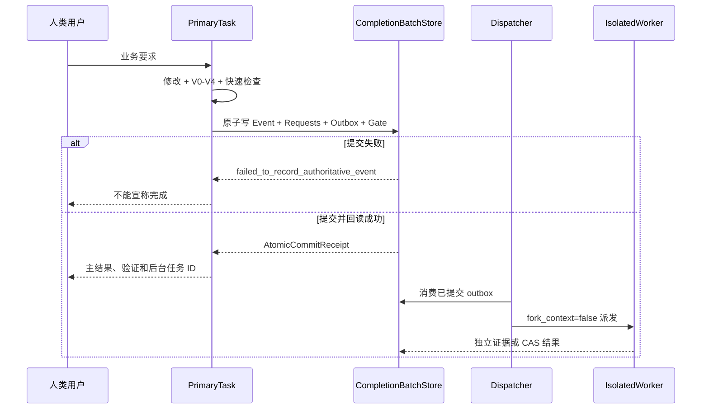

# 会话、任务与工作流执行设计

## 文档控制

| 项目 | 内容 |
|---|---|
| 文档 ID | `PROC-TASK-EXECUTION-001` |
| 正式版本 | `v1.0.0` |
| 来源候选 | `TASK-DESIGN-001-R019` |
| 发布事务 | `DESIGN-RELEASE-TX-R019-G001` |
| 负责人 | `HUMAN_PROJECT_OWNER` |
| 修改 / 审核 / 批准 | `uroborus` / `uroborus` / `uroborus` |
| 状态 | 已批准并生效 |
| 上游 | `PRD`、`正式设计`、`Catalog` |
| 下游 | `所有 WorkItem、会话和执行器` |

## 文档职责

- 允许保存：会话分类；Workflow；Action；方法；工具；回复；Gate；任务状态；发布事务。
- 禁止保存：单个任务状态；证据全文；未批准流程补丁；项目跟踪副本。
- 主要读者：项目协调者、AI 执行器、Reviewer、批准人。

## 正式内容

**最后更新：** 2026-04-15

## 1. 目标

定义记忆系统的一手事实源。

## 2. 核心对象

- `SessionEvent`
- `SessionArtifact`
- `EvidenceRecord`

## 3. 设计结论

- event / artifact 必须先落 ledger，再进入蒸馏
- ledger 条目必须有稳定 `id`
- ledger 条目必须支持 replay 与 source refs
- 蒸馏层不得覆盖 ledger 原文

## 4. 首版落点

- 扩展 `domain.session.models`
- 补充 event / artifact 的 `id` 与时间戳
- 由记忆蒸馏主链把 ledger 投影为 `EvidenceRecord`

## 5. 当前实现状态

- `SessionEvent` / `SessionArtifact` 已带稳定 `id` 与 `created_at`
- 当前 `DefaultMemoryDomainService -> EvidenceRepositoryPort` 投影 evidence 时已使用稳定 ID
- 同一 session 的 repeated distill 不再重复写入同一 evidence record

---

本目录记录项目推进方法，而不是产品设计本身。旧流程集成方案、旧项目管理控制面方案和专项过渡计划已经从正式结构中移除；当前只保留实施基线和任务执行契约。

## 1. 适用范围

- 任务拆解、计划和交接
- 需求变更后的过程回写
- 阶段切换和评审门禁
- 平台任务实施与验证收口

## 2. 推荐阅读顺序

1. 实施计划（已融合到当前正式文档）
2. [任务执行契约](./workflow-execution-design.md)

## 3. 验证入口

- [测试计划](../06-delivery/test-plan.md)
- [测试报告](../06-delivery/test-plan.md)

---

| 项目 | 内容 |
|---|---|
| 文档编号 | `PROC-TASK-EXECUTION-001` |
| 文档类型 | 开发过程契约 |
| 当前版本 | `0.2.0` |
| 当前状态 | 评审中 |
| 最近更新 | 2026-07-09 |


| 版本 | 修改内容 | 日期 | 修改人 | 审核 | 批准 |
|---|---|---|---|---|---|
| `0.1.0` | 初版，固化六类任务执行方式、输出包和 `.factory` 落盘边界 | 2026-07-08 | 项目负责人 | 待审核 | 待批准 |
| `0.2.0` | 增加完整软件项目会话归因模型、工作流分类、节点控制和静默修改定义 | 2026-07-09 | 用户授权代执行 | 待审核 | 待批准 |

## 背景

- 上游输入：用户要求按任务分解、系统总设计、模块设计、UI 设计、开发和测试六类任务重构 `04-project-development` 与 `.factory`。
- 关联 work item：`DOC-FACTORY-RESTRUCTURE-001`
- 事实源：`skills/using-shanforge/SKILL.md`、`skills/document-templates/SKILL.md`、`skills/writing-plans/SKILL.md`、`skills/executing-plans/SKILL.md`、`skills/subagent-driven-development/SKILL.md`、`skills/tdd-workflow/SKILL.md`、`skills/ui-ux-pro-max/SKILL.md`

## 目标

本文档固定 Shanforge 中不同任务类型的执行方式、输出内容、落盘位置和 gate。它不替代具体 skill；具体执行仍由 `using-shanforge` 路由到对应工作 skill。

## 完整软件项目会话归因模型

所有完整软件项目会话必须先归因，再执行。归因链固定为：

```text
当前消息 -> 会话行为 -> 工作流 -> 节点 -> 允许动作 -> 状态包
```

未归因前不得写文件、创建孤立方案、执行任务、提交或关闭 work item。影响源代码、skill、测试、正式文档或流程状态的会话必须绑定 WorkItem / TaskCard；无法绑定时只能返回 `needs_user_input` 或 `blocked`。

完整软件项目模式的入口规则：

- 先判断当前消息是否只需要解释，还是会改变项目事实。
- 只解释、不改变事实时，走 `direct-answer-workflow`，当前会话返回路由结果和答案，默认不落盘。
- 影响需求、设计、计划、代码、skill、测试、正式文档、ledger、memory、review、verification、commit 或 gate 时，必须进入项目化工作流。
- 讨论结论如果影响项目事实，必须落到需求、设计、计划、任务或 ledger 中的一种，不能只新增孤立方案文件。
- 任何工作流节点都不能越权替代后续节点；需求不能直接执行，计划不能直接提交，执行不能自批完成，review 不能替代 verification，verification 不能替代 human confirmation。

## 会话行为清单

| 会话行为 | 典型输入 | 默认工作流 | 是否默认落盘 |
|---|---|---|---|
| 解释问答 | “这是什么意思”“该怎么理解” | `direct-answer-workflow` | 否 |
| 需求澄清 | “我想做一个系统，但还不清楚边界” | `requirements-workflow` 或 `brainstorming` | 项目化时是 |
| 需求新增 | “增加导出功能” | `requirements-workflow` | 是 |
| 需求变更 | “把原来的规则改成...” | `change-control-workflow` | 是 |
| 方案设计 | “重塑整体方案”“设计模块边界” | `design-workflow` | 是 |
| 计划分解 | “拆任务”“写实施计划” | `planning-workflow` | 是 |
| 执行开发 | “执行这个任务”“改代码” | `execution-workflow` | 是 |
| Bug 调查 | “测试失败了”“线上异常” | `debugging-workflow` | 是 |
| Review 请求 | “帮我 review”“进入评审” | `review-workflow` | 是 |
| Review 处理 | “按 reviewer 意见修改” | `review-workflow` | 是 |
| 验证收口 | “确认是否完成”“跑测试” | `verification-workflow` | 是 |
| 提交发布 | “提交”“push”“开 PR”“发布” | `commit-workflow` | 是 |
| 状态恢复 | “现在到哪了”“恢复上下文” | `status-memory-workflow` | 按需 |
| 暂停废弃 | “暂停”“废弃这个任务” | `change-control-workflow` | 是 |

## 工作流契约

| 工作流 | 触发 | 必须输入 | 允许动作 | 禁止动作 | 输出与 gate |
|---|---|---|---|---|---|
| `direct-answer-workflow` | 只要解释、建议、临时分析 | 当前消息和必要最小上下文 | 当前会话回答，说明不落盘原因 | 写项目文件、创建任务卡、改状态 | 答案；`needs: none` |
| `requirements-workflow` | 新增需求、需求澄清、需求结构化 | 用户意图、已有需求或 brief | 写需求草案、AC、NFR、baseline 影响 | 直接改代码或 skill | `requirements_ready` / `ready_for_review` |
| `change-control-workflow` | 修改已存在需求、方案、任务、gate 或暂停废弃 | 原事实源、变更原因、影响范围 | 追加版本历史、写影响分析、创建/更新 TaskCard | 覆盖旧事实、无 ledger 变更项目状态 | `ready_for_review` / `needs_user_input` |
| `design-workflow` | 总体方案、模块方案、UI 方案、流程契约方案 | 已批准需求或明确变更任务 | 写正式设计或过程契约，列边界、接口、风险 | 只写孤立方案文件、不进索引 | `ready_for_review` |
| `planning-workflow` | 拆实施计划或任务 | 已批准需求/设计/brief | 写 plan、task brief、依赖、验证命令 | 执行任务、修改源码 | `plan_ready_for_review` |
| `execution-workflow` | 用户确认执行已授权任务 | 已批准 task brief、允许范围、测试设计 | Red、最小实现、Green、evidence、report、review checkpoint | 跳号、越权改文件、自批 approved | `ready_for_review` |
| `debugging-workflow` | bug、失败测试、异常行为 | 复现信息、失败输出、相关调用链 | 复现、根因、修复方案、回归测试 | 猜测式补丁、无根因直接修 | `root_cause_found` / `blocked` |
| `review-workflow` | 请求 review 或处理 review feedback | review 输入包或 reviewer 反馈 | 独立评审、triage、修复响应 | 作者自批 approved、忽略 Important | `approved` / `changes_requested` |
| `verification-workflow` | 完成声明、收口检查、回归验证 | 新鲜命令、exit code、evidence 路径 | 跑验证、记录失败/跳过/风险 | 用旧输出宣称通过 | `verification_passed` / `verification_failed` |
| `commit-workflow` | 本地提交、push、PR、merge、发布 | 人工确认、review、verification、提交范围 | 按范围提交或远端 handoff | 用提交替代 review 或确认 | `commit_done` / `remote_handoff_blocked` |
| `status-memory-workflow` | 恢复、查看状态、同步记忆 | memory summary、ledger、必要单文件事实源 | 输出会话卡、同步索引摘要 | 散读 docs、把正文复制进 memory | `session_ready` / `blocked` |

## 节点控制

每个工作流必须显式声明当前节点。节点名称可以按任务细化，但行为边界必须保持一致：

| 节点 | 进入条件 | 可做 | 不可做 | 下一 gate |
|---|---|---|---|---|
| `intake` | 收到用户消息 | 做会话行为归因，输出路由包 | 写文件 | `routed` |
| `routed` | 已确定工作流 | 读取最小上下文，确认 WorkItem / TaskCard | 执行实现 | `scoped` |
| `scoped` | 范围、输入、允许修改清楚 | 写需求、方案或计划，或准备执行 | 越过允许范围 | `ready_for_review` 或 `needs_user_input` |
| `executing` | 已授权执行任务 | 修改允许范围内文件并记录 evidence | 自批完成、跳过验证 | `ready_for_review` |
| `reviewing` | 有 review 输入包 | 独立评审或处理反馈 | 用自检代替 review | `approved` 或 `changes_requested` |
| `verifying` | 有待收口产物 | 跑新鲜验证命令 | 用计划或旧输出当结果 | `verification_passed` 或 `verification_failed` |
| `human_confirmation` | reviewer approved 或风险需接受 | 请求用户确认 | 自动进入下一阶段 | `human_approved` 或 `human_changes_requested` |
| `committing` | 人工确认且有可提交改动 | 按范围提交 | 混入无关改动 | `commit_done` |

## 路由包

进入项目化工作流前，当前会话必须先展示路由包。最小格式：

```text
路由结果：
- 处理模式：direct_answer | lightweight_analysis | project_workitem | tracked_task | gate | event
- 会话行为：<解释问答 / 需求变更 / 方案设计 / ...>
- 工作流：<workflow-id>
- 当前节点：<node-id>
- 所属 WorkItem / TaskCard：<ID 或待创建>
- 允许修改范围：<path list 或 none>
- 禁止动作：<list>
- 当前 gate：<none / review / human_confirmation / blocked>
- 本轮是否落盘：yes | no
```

如果路由包缺少处理模式、所属 WorkItem / TaskCard、允许修改范围或当前 gate，且本轮会影响项目事实，则不得写文件。

## 静默修改和非静默修改

静默修改指：未先在当前会话展示路由包，就修改源代码、skill、测试、正式文档、ledger、memory、work item 状态或流程 gate。事后说明“已更新某文件”不能补救静默修改。

非静默修改必须满足：

- 修改前展示路由包。
- 影响源代码、skill、测试、正式文档或流程状态时，绑定 WorkItem / TaskCard。
- 说明允许修改范围和禁止动作。
- 写入后有 ledger、evidence、report 或 memory summary 中至少一种可追踪记录。
- 当前会话返回 outputs、evidence、ledger event、gate 和 next_required_action。

讨论结论如果影响项目事实，必须进入对应工作流：

- 改变预期行为：`change-control-workflow`。
- 新增能力：`requirements-workflow`。
- 补方案漏洞：`design-workflow`，并反向关联需求或任务。
- 修复已观察失败：`debugging-workflow`。
- 拆执行步骤：`planning-workflow`。

禁止把方案讨论结果只写成未登记的临时文件；正式方案写入 `docs/` 登记路径，执行事实写入 `.factory/workitems/<WORKITEM-ID>/`，恢复摘要写入 `.factory/memory/`。

## 统一任务包

轻量分析只在当前会话返回结构化答案，不写 `.factory`。项目化任务必须写入 work item，并使用同一身份与证据骨架；`status/needs` 保留执行 Skill 的本地枚举：

```text
工作结果：
- work_item: <WORKITEM-ID>
- task_id: <TASK-ID or none>
- task_type: decomposition | system_design | module_design | ui_design | development | testing
- status: <该 Skill 的既有本地状态>
- outputs:
  - <path>
- evidence:
  - <path>
- ledger_event: <event id or path>
- needs: <该 Skill 的既有本地 needs>
```

统一任务包中的 `task_id/task_type` 表示正式任务身份，`skill` 只表示执行者身份。工作 Skill 返回自身专业结果与执行事实，不重复计算 `project_position`、`completion_level`、`stop_reason` 或 `scope_remaining`；流程总控 `using-shanforge` 结合 ledger、授权范围和真实 Gate 生成项目状态信封及 `next_required_action`。共享合同只收敛交接边界，不统一或改写各工作 Skill 的专业输出、状态枚举、失败语义与人工决策边界。

常见跨流程状态含义（非封闭枚举）：

- `ready_for_review`：作者完成输出和证据，等待独立评审。
- `passed`：验证类任务的新鲜证据支持通过结论。
- `partial`：部分检查通过，但仍有未运行项或残余风险。
- `failed`：验证或检查失败。
- `blocked`：缺少关键事实、依赖、权限或工具，无法安全推进。
- `needs_user_input`：必须由用户作产品、范围、风险或视觉决策。

## 六类任务

| 任务类型 | 执行方式 | 必须输出 | `.factory` 证据 |
|---|---|---|---|
| 任务分解 | 从已批准 brief、需求或设计拆成可验收任务，不按 2-5 分钟动作拆卡 | `plan.md`、`task-briefs/`、依赖、允许修改范围、验证命令、review gate | work item ledger、plan review 输入 |
| 系统总设计 | 定义系统目标、非目标、分层边界、数据流、NFR 和 baseline 影响 | 系统设计页、接口 owner、错误处理、测试策略、风险 | 设计依据、变更影响说明 |
| 模块设计 | 针对单个领域或模块定义职责、接口、数据模型、业务规则和不变量 | 模块设计、port/接口契约、禁止耦合、测试矩阵 | 模块边界核查记录 |
| UI 设计 | 先定用户流程和信息层级，再定组件状态、响应式和可访问性 | 页面/组件清单、状态矩阵、交互说明、截图或原型、可访问性检查 | 截图、浏览器检查、设计评审记录 |
| 开发 | 只消费已授权 task brief；先 Red，再最小实现，再 Green | 改动文件、测试变更、实现报告、review input package | red/green 证据、implementer report、review checkpoint |
| 测试 | 按风险选最小测试层级；bug 必须先复现和根因确认 | 测试报告、失败/错误/跳过统计、未运行项、残余风险 | 新鲜命令输出、exit code、回归结果 |

## 任务分解要求

- 一个任务卡对应一个可验收交付物。
- 任务卡必须能独立验证、独立评审。
- 读文件、运行命令、写失败测试和记录 evidence 是任务内部 checklist，不单独拆卡。
- 每张任务 brief 必须写：目标、输入、允许修改、禁止修改、实施步骤、失败断言、验证命令、期望输出和输出报告路径。
- 缺测试设计、UI 写 `N/A` 但无原因、出现占位语，任务分解失败。

## 设计任务要求

系统总设计和模块设计必须先写边界，再写实现细节：

- 所属层和领域。
- 接口 owner。
- 下游依赖。
- 禁止耦合。
- 数据流。
- 错误处理。
- 测试策略。
- baseline 影响。

涉及代码结构时必须遵守 `access -> application -> domain -> runtime -> settings`。接口由调用下层的一方定义；`settings` 只实现上层 port；跨层装配只在 `src/settings/composition/`。

## UI 任务要求

UI 设计或实现必须覆盖：

- 用户流程和主要任务。
- 信息层级。
- 页面、区域和组件边界。
- `loading`、`empty`、`error`、`disabled`、`permission`、`mobile` 状态。
- 键盘路径、焦点、语义、文本溢出、色彩对比。
- 桌面和移动视口检查。

如果本轮任务没有 UI，必须在 task brief 中写 `UI: N/A` 并说明原因。

## 开发任务要求

- 执行前必须确认 task brief 已授权。
- 不跳过 dependencies，不提前进入后续任务。
- 不修改允许范围外文件。
- 先写最小失败检查；已有测试能覆盖时先运行并记录失败或基线。
- 写最小实现，只改根因或目标路径。
- 完成后必须有 verification evidence、implementer report、review input package 和 ledger event。
- 作者只能推进到 `ready_for_review`，不得自批 `approved`。

## 测试任务要求

- 新功能优先 TDD。
- Bug 修复必须先有复现、直接原因、根源原因和修复方案确认。
- 低风险跑定向单测或静态检查；中风险补集成或契约验证；高风险补目标 E2E 或关键人工验收。
- 完成声明前必须运行新鲜验证命令，读取完整输出和 exit code。
- 证据必须写清失败数、错误数、跳过数、未运行项、偏离原因和残余风险。

## 落盘规则

正式事实写入 `docs/` 登记路径；项目化执行事实写入 `.factory/workitems/<WORKITEM-ID>/`：

```text
.factory/workitems/<WORKITEM-ID>/
  brief.md
  plan.md
  task-briefs/
  evidence/
  reports/
  reviews/
  ledger.jsonl
```

`.factory/memory/` 只写恢复所需摘要、索引和路径，不复制正式文档正文。`.factory/pm/generated/` 只是展示层，不作为事实源。

## 评审和人工确认

- Review 不能替代 verification。
- Verification 不能替代 human confirmation。
- Reviewer `approved` 后仍必须进入人工确认门，状态进入 `pending_human_confirmation`。
- 有 Critical 必须 `changes_requested`。
- 有 Important 默认 `changes_requested`，除非用户明确接受风险。
- 缺 evidence、implementer report、review input package 或 ledger event 时，不得声明完成。

---

## 16. WP-03 确定性路由、运行状态机和 Gate

### 16.1 生命周期阶段登记

Catalog 以 `LC-00` 至 `LC-13` 的 14 条 `lifecycle_stage` 记录保存阶段事实。每条记录都具有进入条件、必做工作、阶段输出、退出 Gate、允许回退目标、负责人和来源需求。阶段不是只能向前的瀑布：新事实必须通过变更 Workflow 回到有事实所有权的上游阶段，并把受影响下游标为待复核或失效。

| 阶段组 | 阶段 | 确定性边界 |
|---|---|---|
| 会话与基线 | `LC-00`、`LC-01` | 所有项目消息先经过治理；缺项目 Baseline 时不能直接进入需求、设计或实现 |
| 发现与产品 | `LC-02`、`LC-03` | 调研事实和正式需求分离；需求只有发布后才能作为设计权威输入 |
| 体验与设计 | `LC-04` 至 `LC-08` | UX、UI、架构、数据和 API 各有独立输入输出与 review Gate，不互相隐式替代 |
| 计划与交付 | `LC-09` 至 `LC-12` | 计划、实现、测试、独立 review、人工确认和高风险交付逐节点推进 |
| 运行演进 | `LC-13` | 运行事实、事件、变更、迁移和退役受生产权限与人工 Gate 约束 |

阶段完成必须同时满足：必需 Artifact 存在且 schema 合法、追踪闭合、新鲜验证通过、独立 review 关闭阻断项、适用人工决定有效、状态与版本同步。文件存在、模型声明或旧证据不能完成阶段。

### 16.2 RouteInput 与候选信号

`RouteInput` 是规则系统的唯一入参，至少包含：

| 字段组 | 必填字段 | 规则 |
|---|---|---|
| 身份与版本 | `route_request_id`、`session_id`、`project_id`、`catalog_revision`、`catalog_sha256`、`evaluated_at` | Catalog 版本/hash 不一致时拒绝裁决 |
| 当前执行位置 | `current_stage_id`、`current_workflow_run_id`、`current_node_run_id`、`work_item_id`、`task_card_id` | 不存在时显式为 `null`，不能靠聊天记忆补齐 |
| 当前 Gate | `pending_gate`、`pending_gate.subject_ref/hash`、`resume_target` | Gate 绑定对象变化后旧决定失效 |
| 模型候选 | `candidate_signals`、`target_artifact_class`、`target_scope`、`change_kind`、`message_relation` | 模型只提取候选，不得写最终 rule/workflow/node |
| 项目影响 | `project_effect`、`risk_level`、`requested_action_kind` | 枚举分别约束无影响、候选事实、正式事实、运行事实及风险级别 |
| 权限与事实 | `authorization_refs`、`role_assignment_ref`、`fact_snapshot_refs`、`fact_conflict` | 调用方自称“已授权/最新”不产生资格 |

候选信号保留提取器 ID、来源片段 hash、值和置信信息，供审计和澄清使用；置信度不参与最终优先级。`model_selected_rule_id`、`model_selected_workflow_id` 等字段即使出现也必须被忽略并记录为越界候选。

### 16.3 RouteDecision 与固定裁决算法

`RouteDecision` 必须保存输入 hash、规则集版本/hash、裁决结果、命中 rule、Workflow/Node、允许 ActionSpec、WorkItem/TaskCard 策略、拒绝候选及原因、允许读写集、Gate、幂等键和规则系统主体。结果枚举为 `selected`、`needs_user_input`、`blocked`、`needs_human_decision`；不存在模型自由文本结果。

固定优先级如下：

| 优先级 | RouteRule | 命中条件 | 目标解析 |
|---:|---|---|---|
| 700 | `RR-PENDING-HUMAN-GATE-001` | 存在待决人工 Gate；批准、退回、暂停或新请求都先做 Gate 响应分类 | 只恢复 Gate 指定 Workflow/Node |
| 600 | `RR-CURRENT-TASK-NODE-001` | 当前 TaskCard 有未完成 Node，消息是继续、反馈或状态控制 | 只恢复 TaskCard 登记位置 |
| 500 | `RR-BUG-FAILURE-001` | 报告失败、异常、测试失败或运行事故 | 由 Catalog 的 bug/failure trigger 唯一选择 |
| 400 | `RR-EXPLICIT-CHANGE-001` | 明确新增、变更、删除、迁移、弃用或退役 | 按变更类型和事实 owner 唯一选择 |
| 300 | `RR-TARGET-ARTIFACT-001` | 目标产物明确且无更高优先级命中 | 按 Artifact Class、目标范围和项目影响选择 |
| 200 | `RR-LIFECYCLE-STAGE-001` | 目标阶段明确 | 只选择该阶段允许进入的 Workflow |
| 100 | `RR-DIRECT-ANSWER-001` | 项目影响为 `none` 且只需解释/建议 | 固定 `WF-CTL-002`，不建任务、不写项目事实 |
| 0 | `RR-UNCLASSIFIED-GUARD-001` | 前七层没有唯一结果 | 缺字段进入 `WF-CTL-003`；无登记动作进入 `WF-CTL-008` |

规则系统按以下顺序执行，不允许模型改序：

1. 校验 RouteInput schema、Catalog hash、当前状态和事实快照；事实冲突立即 `blocked_by_fact_conflict`。
2. 按优先级从高到低计算普通规则；同层恰好一个命中才成为候选，高层唯一候中后低层只记录为 rejected candidate。
3. 同层多命中返回 `blocked/route_conflict`；零命中根据缺失字段进入澄清，已知动作不在 Catalog 则进入扩展阻断。
4. 解析目标 Workflow/Node 后核对 WorkItem/TaskCard 归属、ActionSpec 登记、Role Assignment、允许读写集和 Gate。
5. 高风险、远端、PR、merge、生产、不可逆和正式批准缺精确人工授权时返回 `needs_human_decision`，写入次数为 0。
6. 生成不可变 RouteDecision；只有 `selected` 且所有进入条件通过时才能创建 WorkflowRun。

### 16.4 WorkItem、TaskCard 和执行归属

| 项目影响 | WorkItem | TaskCard | Ledger/文件 |
|---|---|---|---|
| `none` | 不创建 | 不创建 | 不写项目事实 |
| 影响后续项目事实 | 创建或复用唯一 owner | 仅在跨会话、依赖、验收或 review 时创建/复用 | 只写当前 WorkItem 的允许位置 |
| 当前 TaskCard 内部工作包/步骤 | 复用 | 复用，不建“落档/版本/复审”孤岛任务 | 写 NodeRun、ActionRun、evidence、draft/report/review |
| 找到多个 owner 或没有 owner | 不猜测 | 不创建 | 阻断并列候选与恢复条件 |

TaskCard 目标覆盖候选、验证、review、人工批准、正式发布、版本同步和草案处置的完整生命周期。Session、工作包、方法步骤、工具调用、Gate 和文件编辑是 Node/ActionRun/Event，不因“也是工作”自动升级为 TaskCard。

### 16.5 四级运行状态机

运行状态只由 `SYSTEM_RULE_ENGINE` 根据合法输入、当前状态和证据推进；人类、AI 和 Reviewer 产生决定或执行证据，但不能直接改状态字段。

| 状态机 | 初态/终态 | 关键主链 | 主要异常分支 |
|---|---|---|---|
| `SM-SESSION-001` | `received` / `stopped|waiting_user|waiting_review|blocked|failed|cancelled` | classifying → restoring_if_projectized → routing → scoping → announcing → executing → validating → persisting → handoff | `classifying` 只使用当前消息和当前对话；direct/lightweight 从 classifying 直接到 handoff，不进入 restoring/routing；项目化请求恢复后才完成路由；所有失败也先进入 handoff 再停止，保证用户可见 |
| `SM-WORKFLOW-RUN-001` | `received` / `closed|cancelled` | routed → scoped → prepared → executing → validating → reviewing → pending_human_confirmation → formalizing_or_delivering → closed | needs_user_input、blocked、failed、changes_requested、paused 均有显式恢复或取消边 |
| `SM-NODE-RUN-001` | `pending` / `completed|cancelled` | ready → executing → validating → output_ready → completed | waiting_review、waiting_human、changes_requested、needs_user_input、blocked、failed、paused、compensating |
| `SM-ACTION-RUN-001` | `prepared` / `committed|duplicate_noop|conflict_blocked|compensated|cancelled` | authorized → executing → succeeded → committed | failed、uncertain、compensating；未知副作用不得直接重试 |

每条转换具有唯一 transition ID、from/to、触发事件、所需证据、guard 和结果原因码。Validator 对每个运行状态机验证：初态存在、所有状态可达、非终态可到终态、终态无出边、引用无孤立、转换 ID 唯一。

`restoring_if_projectized` 是条件节点：`classifying` 初判为项目状态查询、任务延续、项目事实变更或仓内持久化后，才允许读取 `.factory/memory/` 和当前 work item ledger，再用恢复后的事实完成 routing。`direct_answer` / `lightweight_analysis` 且 `project_effect=none` 时必须跳过恢复与完整路由，也不得写项目文件或项目状态。

### 16.6 GateDecision、ReviewDecision 和 HumanDecision

三种决定不能复用同一状态词或互相推导：

| 对象 | 合法主体 | 结果 | 能做什么 | 不能做什么 |
|---|---|---|---|---|
| `GateDecision` | `SYSTEM_RULE_ENGINE` | `pass|deny|blocked|needs_user_input|needs_human_decision` | 根据 schema、权限、证据和状态确定能否前进 | 生成业务批准或风险接受 |
| `ReviewDecision` | `HUMAN_REVIEWER` 或 `AI_INDEPENDENT_REVIEWER` | `approved|changes_requested` | 对绑定变更包给出发现和评审结论 | 修改对象、正式批准、创建 PR、生产授权 |
| `HumanDecision` | 具有对应专有权利的 `human` 实例 | `approved|changes_requested|paused|risk_accepted|authorized|rejected` | 对精确对象/hash、范围和下一动作作最终决定 | 覆写已发生 ActionRun、测试或生产观测 |

固定 Gate 类型为：`entry`、`output_contract`、`verification`、`independent_review`、`human_decision`、`explicit_authorization`、`formalization_release`。每个决定都绑定 subject ID/hash、WorkflowRun/NodeRun、角色/主体实例、证据、时间、有效期、幂等键和 supersedes/corrects 关系。

`ReviewDecision=approved` 只能把 WorkflowRun 推到 `pending_human_confirmation`；不能产生 `HumanDecision`。Critical/Important 未关闭时，除非人类以绑定对象的 `risk_accepted` 明确接受，人工批准 Gate 必须拒绝。人工退回后旧 review 只保留历史资格，任何对象 hash 变化都要求重新验证和 review。

PR 授权必须明确包含 `action_kind=create_pull_request`、仓库、源/目标分支、草稿状态、授权人、绑定提交/evidence、有效期和单次/重复策略。“继续”“任务完成”“已提交”“review approved”均不能推导 PR 授权；push、PR、merge 各自是独立授权对象。

### 16.7 幂等、恢复和补偿

Action 幂等键由 `project/work_item/task_card/workflow/node/action_spec/normalized_input_hash/target_identity` 规范化生成，不使用 Session ID 作为唯一键。重复执行按追加式 ActionRun 决定：

| 已有记录 | 新请求 | 决定 |
|---|---|---|
| 无 | schema、权限和 Gate 通过 | `execute` |
| 同键、同 payload，原结果已 committed | 任意 Session 重放 | `duplicate_noop`，返回原 ActionRun，不重复写 |
| 同键、不同 payload | 任意 | `conflict_blocked`，要求新键或人工纠正 |
| 原状态 `uncertain` | 重试 | `reconcile_required`，先读取目标副作用和幂等回执 |
| 原状态 failed 且明确可重试 | 重试预算未耗尽 | 创建带 `retry_of` 的新 ActionRun |
| 补偿失败或不可逆副作用未知 | 任意 | `blocked`，进入人工恢复 |

Session 恢复只读取会话卡、当前 TaskCard、ledger 中最新有效 RouteDecision/ActionRun/GateDecision 及其直接证据。恢复点是最后一个 `committed` ActionRun；`executing`、`uncertain`、半行、hash 冲突或目标读回不唯一时不能自动重放。

失败处理固定为：缺输入不写项目事实并等待用户；路由冲突/事实冲突/越权阻断；验证失败保留候选和新鲜证据但正式写入为 0；执行前失败按重试策略处理；执行后未知先 reconcile；可逆副作用按 ActionSpec 逆序补偿；不可逆或补偿失败由人工决定。用户新消息改变方向时，只取消尚未开始的后续 Action，已完成事实和证据保留，正在执行动作先到安全停止点并记录状态。

### 16.8 WP-03 可执行验证

WP-03 使用持久 validator 的 `cp02 --phase wp03` 阶段校验；该命令只证明 WP-03 完整，不声称 CP-02 已到达。至少执行以下真实求值：

- 路由：唯一命中、零命中、同层多命中、缺字段、当前 Gate 优先、当前 Task 优先、Bug 优先、直接咨询不落盘、事实冲突、模型越界候选和 PR 未授权。
- Gate：review approved 只能进入人工确认、作者不能独立 review、AI 不能产生 HumanDecision、对象 hash 漂移使决定失效、显式 PR 授权通过。
- 幂等：首次执行、同 payload 重放 no-op、同键不同 payload 冲突、uncertain 必须 reconcile、可重试失败和补偿失败阻断。
- 状态机：4/4 运行状态机图闭合，所有 transition ID 唯一，所有停止与继续分支有原因码和恢复条件。
- 回归：`cp01@0.5.0` 的 56 条共享规则 hash、17 类 Artifact、96 条转换正例及既有负例保持通过。

WP-03 的 UI 适用性为 `N/A`：它不交付图形控制台。替代验收机制是机器状态转换表、RouteDecision/GateDecision 记录和会话可见性要求；具体中文回复模板由 WP-06 交付。P002 已接受该 N/A，WP-03 未改变其原因、影响或替代机制。

### 16.9 需求覆盖与下一停止点

WP-03 结算 `REQ-AI-WORKFLOW-001`、`002`、`015`、`033`、`046` 和 `NFR-AI-WORKFLOW-006`、`007`、`009` 共 8 条覆盖记录。它们分别落到 `TOP-SPEC-WORK-SESSION-001`、`SM-WORKFLOW-RUN-001` 及同组路由/运行对象，并绑定 `TASK-DESIGN-001-verification.md#wp-03`。

WP-03 完成后的唯一下一工作包是 WP-04：生成 123 条 Workflow 与 597 个 ActionSpec，并解析 1359 个待设计槽。只有 WP-04 完成、`cp02` 完整 profile 通过并冻结当前设计/Catalog/validator hash 后，才到 CP-02 独立只读评审；本节不能提前产生 CP-02 approved、人工批准或正式发布资格。

## 17. WP-04 123 条工作流程与原子动作规范设计

### 17.1 转换边界和机器事实源

WP-04 不人工重抄 123 份流程正文。生成器只读取已冻结的 R006 工作流程映射，以 `workflow_id` 选择一条 JSONL 记录，再按该记录内的 RFC 6901 JSON Pointer 读取字段。机器目录是完整定义；本中文候选只解释公共规则和代表性流程。

| 上游库存 | 数量 | WP-04 目标 |
|---|---:|---|
| 工作流程身份 | 123 | 123 条 `workflow`，标题、阶段、目标和触发语义不变 |
| 动作位置 | 597 | 每个源位置唯一解析到一条源 `action_spec`；复合高风险动作还必须拆为独立 operation ActionSpec |
| 黑盒场景身份 | 369 | 每条流程各有正常、缺输入、越权或冲突三类 `test_case` |
| 方法引用 | 123 | 解析到稳定 Method ID，定义责任人为 WP-05 |
| 工具策略引用 | 384 | 解析到 4 个稳定 ToolPolicy ID，定义责任人为 WP-06 |
| 输出契约 | 209 组 | 每组 schema、路径、验证和保留四类引用均解析 |
| 元数据待设计槽 | 16 | 14 个 Artifact 路径、ActionSpec Registry 和精确路径 Registry 均解析 |

源值只允许保留在 `source_binding` 或迁移记录的 `source_value` 中作为审计证据。任何运行字段、目标字段或解析后的引用仍含 `design_required`、为空或指向不存在对象，都视为未完成。

### 17.2 工作流程图契约

每条 `Workflow` 至少保存：稳定 ID/版本、生命周期阶段、目标、触发、受控意图码、规范绑定、角色、输入、输出、节点、边、ActionSpec 引用、RouteRule、Method/ToolPolicy 绑定、失败分支、Gate、停止与恢复规则、回复模板和场景 ID。

`WorkflowNode` 只描述图位置、顺序、主体选择器和 `ActionRef`；动作如何执行由 `ActionSpec` 单独定义。相邻源动作转为显式有向边，只有当前动作已提交且节点输出门通过时才能前进。失败分支优先于正常边，最终节点完成后仍需计算工作流程级 Gate，不能因“最后一个动作已运行”直接完成。

流程图属于机器目录的生成投影：Mermaid 或其他可视化必须从节点和边生成并绑定当前 Catalog SHA-256；手工流程图不是事实源。这样既能查看全图，也避免维护 123 份会漂移的 Markdown。

### 17.3 原子动作规范

597 条源 `ActionSpec` 与源工作流程节点一一对应。复合高风险源节点可以引用多个 operation ActionSpec，但父动作本身不得直接产生副作用；每个 operation 只对应一种动作和一个可观察结果。公共字段如下：

| 契约 | 规则 |
|---|---|
| 主体 | 固定人类、固定 AI、固定规则系统，或确定性独立 Reviewer 选择器；必须先通过 Role Assignment |
| 输入 | 当前 Workflow 声明输入、前一动作输出和直接权威证据；禁止隐式扩大读取范围 |
| 输出 | 中间动作只产生本任务证据；末动作产生工作流程声明输出；Reviewer 和人工决定写入各自专用 Artifact |
| 方法与工具 | 引用稳定 ID 和要求版本；未到定义工作包时必须登记 owner 和 `deferred_until_wp`，不得留空 |
| 原子性 | 一条 ActionSpec 只能产生一个可观察结果，不能捆绑无关工作，空结果不能算成功 |
| 验证 | 核对主体、输入绑定、输出 schema、路径范围、hash 回读和 Gate 结果 |
| 幂等 | 键由项目、WorkItem、TaskCard、Workflow、Node、ActionSpec、规范化输入 hash 和目标身份组成 |
| 补偿 | 读取/决定类动作追加纠正记录；可逆写入按前像逆序恢复；副作用不确定时停止并核对，禁止盲重试 |
| 继续 | 成功进入唯一下一节点或工作流程 Gate；失败选择显式失败分支；不确定进入人工恢复 |

每条工作流程固定包含五类失败分支：缺输入、路由或事实冲突、权限或角色拒绝、工具或验证失败、评审退回。每个分支都声明允许写入数、结果状态和恢复位置。

### 17.4 确定性路由和主体选择

123 条工作流程级 RouteRule 在全局八层路由规则完成分类后参与目标解析。候选提取器可以提出受控 `INTENT-<WORKFLOW-ID>`，但 `WORKFLOW-TARGET-EVALUATOR-001` 必须同时验证精确意图、生命周期阶段、工作流程存在性和同层唯一性。零匹配要求澄清，多匹配阻断；模型直接写入的 workflow ID 没有最终权威。

R006 中 30 个 `one_of` Reviewer 动作统一转换为 `REVIEWER-INDEPENDENCE-001`：候选只能是人类 Reviewer 或独立 AI Reviewer，当前作者实例必须排除，角色绑定必须有效，一次评审不能混用两类主体。读取评审输入、执行评审、给出发现和输出结论均受同一 Reviewer assignment 约束；作者不能自批。

### 17.5 输出契约注册表

17 类 Artifact 各登记四种稳定引用，共 68 个引用：

1. `schema_ref`：要求 Artifact ID、主类别、事实域、状态、内容 hash 和来源引用。
2. `path_mapping_ref`：复用 Artifact Registry 的唯一 resolver、位置键和无法解析时的阻断结果。
3. `validation_ref`：校验 schema、主类别、事实域、状态、路径、内容 hash 和事实资格；文件存在或空内容不足以通过。
4. `retention_ref`：复用该 Artifact 的保留、归档、删除和 legal hold 契约。

209 组输出必须逐字段引用该注册表。源输出的标签、主类别、事实域和成功状态保持不变；路径和 schema 等设计字段必须替换为可解析目标。

### 17.6 逐指针迁移与防伪完成

每条迁移记录保存源 Catalog/修订、源记录 ID、源 JSON Pointer、源值及其 SHA-256、目标记录/字段、迁移类别、解析状态、后续 owner 和验证证据。唯一键是 `source_record_id + source_json_pointer`。

| 迁移类别 | 数量 | 验收 |
|---|---:|---|
| 身份迁移 | 1089 | 123 工作流程 + 597 ActionSpec + 369 test_case；目标值必须与源身份完全相同 |
| 待设计槽迁移 | 1359 | 123 Method + 384 ToolPolicy + 836 输出引用 + 16 元数据槽；目标不得为空或仍含待设计标记 |
| 总计 | 2448 | 每个源指针恰好一条记录，每个目标可读取，无多余、遗漏或孤立记录 |

验证器内置删除工作流程、删除迁移记录、只重命名源待设计标记、把目标引用置空四类反例。四类都必须失败，防止通过删字段或改字符串制造“已完成”。

### 17.7 高风险、评审和代表性语义检查

高风险工作流程由源 Gate 判定，共 15 条。每条必须同时存在：固定 `HUMAN_APPROVER` 人类节点、`GATE-HUMAN-DECISION-001`、`GATE-EXPLICIT-AUTHORIZATION-001`，以及绑定动作种类、目标、范围、有效期和重复策略的决定。分支、Push、PR、Merge、部署、回滚、数据修正和退役之间不能复用授权；PR 仍须每次由人类明确确认。

CP-02 语义抽查覆盖 14 个生命周期阶段，并固定检查：`WF-CTL-002` 只读咨询、`WF-CTL-008` Catalog 扩展治理、`WF-CTL-009` 正式文档治理、`WF-DEL-002` 独立评审，以及全部 15 条高风险流程。旧测试中不存在的 `WF-TEST-009` 已纠正为真实目录目标 `WF-QA-009`；路由目标不在当前 Catalog 时必须阻断。

### 17.8 受控后续定义和检查点

WP-04 为后续 owner 建立的是稳定身份，不是完成声明：14 个生命周期 Method 由 WP-05 扩展成 17 个封闭方法域并绑定 Skill；4 个 ToolPolicy 和 7 个 ResponseTemplate 由 WP-06 完整定义；369 个源场景由 WP-08 增加可执行 fixture 和完整负例。除这三类已登记延期外，WP-01 至 WP-04 的字段不得延期。

R001 的 `cp02` 作者验证曾通过 123/123 工作流程、597/597 源 ActionSpec、369/369 源 test_case 和 2448/2448 迁移，但独立对抗评审发现路由和高风险授权存在假阳性，因此 R001 已失效。R002 必须同时验证 597 条源 ActionSpec、29 条高风险 operation ActionSpec、15 条高风险流程和 30 个独立 Reviewer 节点，才能重新冻结复审。

## 18. CP-02 首轮反馈修正

### 18.1 路由目标由规则系统推导

非固定全局路由规则不再读取调用方的 `resolved_target` 作为目标。`WORKFLOW-TARGET-EVALUATOR-001` 从 123 条工作流程目标注册表按以下顺序推导：

1. 读取受控 `workflow_intent` 候选；Bug/failure 普通信号固定进入 `WF-QA-012`，安全、隐私或漏洞信号进入 `WF-QA-009`。
2. 要求意图唯一，并核对目标生命周期阶段。
3. 从注册表取得 Workflow、入口 Node、Node 对应 ActionSpec、Gate 和高风险动作种类；调用方提供的 Workflow/Node/ActionSpec 只进入审计列表。
4. 目标 Workflow、Node、ActionSpec 或 Gate 任一不存在即阻断；不能用一个存在的低风险意图携带生产 Workflow 或未知 ActionSpec。
5. 高风险从目标注册表中的 operation ActionSpec 推导，不采信调用方上报的 `risk_level` 或 `requested_action_kind`。

待决人工 Gate 和当前任务恢复点可以读取持久状态中的 Workflow/Node，但仍须重新核对当前 Catalog；不存在的恢复 Node 必须阻断。通用 Bug、错误现存目标、未知 Node/ActionSpec、阶段冲突和低风险自报访问高风险目标均进入固定负例。

### 18.2 高风险副作用逐项拆分与核销

15 条高风险 Workflow 保留 597 个源动作身份，并新增 29 条 `action_level=high_risk_operation` 的 ActionSpec。典型拆分如下：

| 工作流程 | 独立副作用动作 |
|---|---|
| 分支、Push 和 PR | `create_branch`、`push`、`create_pull_request` |
| 数据迁移和批处理 | `data_batch_execute`、`data_cutover`、`data_rollback` |
| 版本和制品 | `release_version_write`、`build_artifact`、`sign_artifact` |
| 生产发布 | `production_deploy`、`production_data_migration`、`progressive_traffic_ramp` |
| API/数据弃用 | `api_deprecation_cutover`、`data_migration_cutover`、`legacy_path_cleanup` |
| 服务退役 | `decommission`、`data_disposition`、`resource_reclaim` |

每条 operation ActionSpec 必须消费一条 `SCHEMA-HUMAN-DECISION-001`，且绑定 `authorization_id`、动作种类、目标身份、范围、subject/hash、有效期、重复策略、人类主体和 assignment 来源。目标只能来自 HumanDecision；调用方参数不能覆盖。授权在副作用前以稳定消费键追加、持久化和回读，默认单次使用；动作不匹配、目标缺失、过期、重复消费或 hash 漂移均拒绝。

复合源动作改为调度器：它只按顺序调用已获独立授权的 operation ActionSpec，本身不能直接产生副作用。29 条 operation 都有前像、执行回执、目标回读、后像 hash、不确定停止和操作级补偿契约。

### 18.3 Reviewer、人工决定和业务输出分离

Reviewer ActionSpec 只输出 `ReviewDecision`，人类节点只输出 `HumanDecision`；二者都不得直接改业务 Artifact。工作流程的业务输出通过 `output_production_bindings` 绑定作者或执行动作的类型化结果，并由后续 Review/Human Gate 激活。纯评审工作流程的 `ART-REVIEW` 输出允许由 `ReviewDecision` 做受控投影，但 Reviewer 仍不修改被评对象。

一个工作流程中的评审段只选择一次 Reviewer。选择结果保存到 `WorkflowRun.review_assignments.<segment>`，包含 assignment ID、review run、Reviewer/作者实例、subject ref/hash 和 assignment 来源；同一评审段所有节点必须复用。换人、换 assignment 或 subject hash 变化都要求新 review run，不能在中途悄悄重选。

### 18.4 类型化中间结果

626 条 ActionSpec 都具有 `result_contract`。结果 envelope 至少包含 ActionRun、ActionSpec、outcome、产物引用、证据、验证结果和 canonical result hash，并按动作类型增加分析结果、候选变更、ReviewDecision、HumanDecision 或副作用回执字段。

474 条源图边不再消费不存在的 `prior_action_output`，而是精确引用前一动作的 `SCHEMA-ACTION-RESULT-<ID>`。成功必须满足结果 schema、成功谓词和结果 hash；无结果必须以声明条件和证据表示为受控跳过，不能把空值当成功。

### 18.5 真实变异与溯源边界

负例不再用长度表达式冒充执行。Validator 会在内存中分别删除 Workflow、删除迁移、改写源待设计标记、清空迁移目标和剥离高风险授权契约，然后对完整变异 Catalog 重新运行 WP-04 核心校验，并要求命中特定错误类别。

活动 Method/ToolPolicy binding 和元数据解析记录不再复制 `design_required` 源值。完整源值只保存在 1359 条迁移记录的 `source_value`；其他对象只保存源记录 ID 和 JSON Pointer。因此运行消费者不会把溯源信息误判成未完成目标。

## 19. CP-02 第二轮反馈修正

### 19.1 授权逐值绑定与稳定核销

每条高风险 operation 的 HumanDecision 不仅要求字段存在，还必须把动作种类、目标身份、规范化 scope、subject ref/hash、人类 assignment 来源和重复策略与本次 operation request 逐值比较。`valid_until` 必须是有效且尚未到期的 ISO 8601 时间，重复策略只允许 `single_use`。

授权消费键固定为 `authorization_id + action_kind + target_identity + subject_sha256`，禁止包含每次执行都变化的 `action_run_id`；`max_uses=1`，且必须在副作用前完成追加、持久化和回读。改变 scope、subject hash、assignment、重复策略，或再次消费同一授权，都会在副作用前阻断。

### 19.2 人类与 Reviewer 的唯一写域

`human_decision` 和 `human_input` 两类 ActionSpec 的唯一写域都是 `current_task_human_decision_event`；它们只能形成 HumanDecision，不能写动作证据或业务 Artifact。独立 Reviewer 的唯一写域是 `current_task_review_artifact`，只能形成 ReviewDecision。Validator 对全部 597 条源 ActionSpec 逐条核对，不再只抽查动作类型。

### 19.3 外部可信 Catalog 绑定

Catalog 文件不能在自身被哈希的字节中可靠嵌入自己的完整 SHA-256，因此工作候选不再用 Catalog 内字段自证。确定性目录加载器一次读取精确字节并计算 `loaded_catalog_sha256`，再从当前 checkpoint snapshot 或已激活 release manifest 取得 `expected_catalog_sha256`；二者不一致立即阻断。

RouteInput 只携带本次会话观察到的目录修订和 hash，不能提供或覆盖可信 expected hash。路由求值器通过独立参数接收 `TrustedCatalogContext`，核对 loader 身份、外部绑定记录、加载修订、加载 hash 和外部 expected hash。缺上下文、外部 hash 不匹配、加载修订不匹配，或调用方伪造自己的修订/hash，项目写入都为 0。

R003 冻结时先追加 validator profile registry revision，再用该版设计、Catalog 和 validator 的 hash 创建 CP-02 snapshot；完整 `cp02@0.4.0` 验证只信任这个 snapshot 中的 Catalog hash。该顺序消除“调用方同时填写实际值和期望值即可通过”的自认证路径。

## 20. WP-05 全生命周期方法卡与 Skill 映射

### 20.1 十七个封闭方法域

方法域固定为：项目基线、发现/调研/Spike、需求、UX、UI、架构/领域/模块、数据/数据库、API/集成、计划/任务、实现/多端交付、测试/调试/根因、安全/隐私/合规、性能/可靠性/可观察性、Review/Verification/人工确认、Git/PR/发布/部署/回滚、运维/事件/问题/备份恢复、变更/迁移/弃用/退役。每个 Method 都有版本、适用 Workflow、权威输入、五步执行法、输出契约、Review Rubric、SkillBinding、PromptTemplate、失败回退和能力缺口。

123 条 Workflow 按业务语义绑定主方法，不只按生命周期阶段机械归类。例如安全架构、数据隐私和安全测试进入安全方法；性能架构、查询容量和负载测试进入可靠性方法；数据迁移、依赖升级和 API 弃用进入变更方法；本地提交到生产回滚进入 Git/发布方法。17 个方法均至少被一条 Workflow 使用，未绑定 Workflow 为 0。

### 20.2 本地 Skill 绑定与缺口

系统扫描仓内 37 个 `skills/*/SKILL.md`，保存名称、描述、路径和文件 SHA-256。命中生命周期职责的 30 个 Skill 深读其触发、边界、输入输出、验证和失败语义后形成 58 条 SkillBinding；每条绑定保存与源 Skill hash 一起冻结的 `source_contract`，逐 Skill 写明真实触发、拥有能力、禁止能力、允许 Workflow、状态输出和失败回退。Workflow 只引用明确适用于自身的绑定，不再把同一 Method 的全部 Skill 无差别复制给每条流程。

`gitcommitzh` 只绑定本地提交工作流程 `WF-DEL-004`，只产出本地 commit SHA、中文提交说明和提交范围验证；分支、Push、PR、Merge、发布和部署均在其禁止范围内。`requesting-code-review` 只组织评审，`verification-before-completion` 只产生新鲜验证证据；二者即使服务发布流程也不能执行远端或生产副作用。Skill 只执行方法内动作，不能替代确定性路由、角色授权、独立 Review 或 HumanDecision。

数据库、安全/SRE、远程 PR/部署和生产运维缺少可独立承担专业裁决的本地 Skill，分别登记到 `HUMAN_DATABASE_LEAD`、`HUMAN_QUALITY_SECURITY_LEAD` 和 `HUMAN_RELEASE_OPERATIONS_LEAD`。这些缺口允许 AI 准备材料和运行已授权工具，但禁止 AI 假装已完成专业审核或生产授权。

### 20.3 项目资料交互方法

项目资料收集先回读 `.factory/project.json` 和已确认事实，已知字段不重复询问；缺失字段按每批最多三个问题交互。必须覆盖真实人员与角色、产品表面、服务、环境、质量、安全、合规和确认记录。人员姓名、审核人、批准人取不到时必须询问，不能写 AI 产品名或模型名代替。每轮回复列出已确认、仍缺失、阻断项和保存位置。

### 20.4 UX、UI、数据库和 API 专门方法

- UX：从 Persona/Jobs、真实场景和内容形成旅程、服务蓝图、信息架构、任务流、线框/原型及可用性/A11y 验收。
- UI：输出设计系统/Token、页面和组件清单、完整状态矩阵、响应式/A11y、真实视觉资产、桌面/移动截图验证和开发交接；实现提示必须沿用项目框架与组件库，不能用营销页面代替实际工作界面。
- 数据库：从 BusinessField、领域规则、查询和事务推导 ERD、字段字典、主外键/唯一/检查约束、查询-索引矩阵、容量、迁移/回填/校验/回滚和数据库 Review Rubric。
- API：先列消费者、用例、资源/操作和权限边界，再定义 endpoint/event、请求响应 schema、稳定错误 code、分页/过滤/幂等/限流、兼容/弃用、OpenAPI 和 Contract Test。

数据库列、API 字段和 UI 控件仍必须引用同一 BusinessField ID；具体跨层字段结构和断链验证由 WP-07 完成，WP-05 不提前伪造追踪结果。

### 20.5 PromptTemplate 与执行规则

WP-05 定义项目资料收集、通用方法执行、UX、UI 生成、数据库、API 和独立评审七类中文 PromptTemplate。每个模板都有独立的版本化变量和机器产物 schema：UI 必须产出页面/组件、Token、状态矩阵、响应式/A11y、资产和截图证据；数据库必须产出 ERD、字段字典、约束、查询索引和迁移回滚；API 必须产出 endpoint/event、OpenAPI、错误、权限、幂等兼容和契约测试。八字段会话回复由 ResponseTemplate 负责，不再冒充 Prompt 的专业输出契约。

PromptTemplate 只组织方法输入、动作和专业产物，不授予文件、网络、Git、PR 或生产权限；具体 ToolPolicy 由 WP-06 负责。任何方法遇到关键输入缺失、事实冲突、无 owner 缺口、验证失败、Review 退回或人工 Gate 时，停在当前步骤并返回可恢复状态。

## 21. WP-06 工具策略、会话回复与人机交接

### 21.1 工具分类与默认拒绝

工具注册表包含 13 类：文件读取、文件写入、命令与进程、浏览器、网络、图像、文档与表格、外部连接器、独立子代理、本地 Git、远端 Git/PR、构建发布部署、生产操作。工具是否安装、当前是否可调用、AI 是否知道调用方法，都不等于已获授权。

`TOOL-PERMISSION-EVALUATOR-001` 固定按以下顺序求值：工具类别已知、可信 RouteDecision、可信 RoleAssignmentEvaluation、ActionSpec 引用该 ToolPolicy、可信 ScopeEvaluation 与路径规范化、可信 Artifact Gate、可信 OperationRequest、需要时的可信人类授权和可信消费回执、证据与补偿已准备。可信事实只能由 `TRUSTED-RUNTIME-FACT-LOADER-001` 从追加 ledger 或 hash 绑定快照加载；工具请求只提交事实 ID，不能提交 `route_and_action_current=true` 等布尔值自证权限。

Route、角色、scope、Artifact、操作请求、授权和消费记录都必须校验自身 canonical SHA-256，并绑定同一 ActionSpec、actor、subject/hash、目标和求值时间。仓库路径必须是相对路径，规范化后仍位于 ScopeEvaluation 的允许前缀；`..` 逃逸、损坏 hash、缺 owner 或缺可信记录一律拒绝。任一步失败立即返回具名原因码；模型推荐的工具只能是候选，不能覆盖规则决定。

单条事实的自哈希只证明该对象内部一致，不能证明它来自已登记来源。来源登记由 `settings` 装配的只读快照端口从追加 ledger 头或冻结快照加载；动作求值函数只接收事实 ID 和来源登记 ID，不接收可由调用方构造的登记对象。求值器加载登记后，再验证 `LoaderAttestation`、逐事实唯一 `FactSourceBinding`、独立来源记录 hash 和当前事实 hash；来源记录 hash 必须由来源记录封套计算且不能等于事实自哈希。登记不存在、ID 不匹配、同一事实零条或多条绑定、来源记录未纳入快照时全部拒绝。普通权限和 29 个高风险 ActionSpec 都执行同一规则。

### 21.2 四个 ToolPolicy

| ToolPolicy | 用途 | 关键允许条件 | 典型拒绝 |
|---|---|---|---|
| 最小必要读取 | 文件、命令、浏览器、网络、文档、连接器和只读子代理 | 目标属于 ActionSpec 读集，来源有效，敏感信息已脱敏 | 默认读归档、原始秘密、模型扩大读集、只读名义下委派写入 |
| 受控 Artifact 写入 | 候选文件、生成资产、命令写入、浏览器/连接器变更和有写集的子代理 | 输出契约、路径 resolver、精确写集、前像/追加规则和当前 Gate 同时通过 | 讨论直接写 `docs/`、未登记路径、无发布门改正式文档、隐式 commit |
| 输出验证与回读 | 测试、构建检查、hash 回读、浏览器验收、外部状态回读 | 当前输出 hash 与验证目标一致，命令和期望退出码已声明，验证无未声明副作用 | 只凭文件存在宣称完成、无新鲜退出码宣称测试通过、隐藏截断输出、作者自审冒充独立评审 |
| 高风险逐项人工授权 | 本地 commit、分支、Push、PR、Merge、发布、部署、数据和生产操作 | 固定 human 授权逐值匹配 ActionSpec、action/tool/operation kind、参数 hash、目标、scope、subject/hash、assignment、有效期和 ActionRun；单次消费回执先于副作用 | AI 生成授权、跨工具/动作复用、空 scope、缺参数、缺消费回执、未确认即开 PR、未知副作用盲重试 |

四个策略都产生追加式 `ToolEvent`，记录 ActionRun、策略、工具类别、操作、目标、参数 hash、权限决定、开始/结束时间、结果码、输出引用/hash、副作用、脱敏和补偿引用。原始 secret 不得进入 ToolEvent；缺输出、截断输出或不确定副作用不能写成成功。

### 21.3 PR、提交和生产动作

`local_commit`、`create_branch`、`push`、`create_pull_request`、`merge`、签名、版本写入、部署、回滚、数据变更和生产操作均是独立高风险 ActionSpec。每个 ActionSpec 固定唯一 ToolKind、OperationKind 和参数 schema。创建 PR 每一次都必须由人类明确授权，并绑定 ActionSpec、OperationRequest、ActionRun、远端 Git ToolKind、`create_pull_request` OperationKind、repository、head/base branch、draft、commit、参数 hash 和 subject hash；空 scope、跨生产工具复用或缺任一字段均拒绝。

授权在副作用前以稳定键 append/fsync/readback，形成绑定当前 ActionRun 的 `AuthorizationConsumptionReceipt`；只有 append 已提交、fsync 成功、readback 精确匹配、消费次数为 1 且副作用尚未开始时才允许执行。重复策略只允许 `single_use`。目标、scope、subject、assignment、工具、操作、参数或动作种类不一致时拒绝；授权过期时重新请求人类决定；执行结果不确定时先回读远端或生产状态，禁止盲重试。

### 21.4 会话中间更新

项目化会话在任务开始、Workflow/工作包切换、文件编辑前、关键命令前后、子代理派发或返回、自动整改轮次变化、阻断或范围变化时必须给用户短更新。持续执行期间最长静默时间为 30 秒；更新至少说明当前目的、正在做什么、观察到的进度和下一动作。

中间更新不是最终回复，不能宣称任务完成，也不能只把结果写入文件后让会话无回执。子代理或自动 loop 返回后，主 AI 必须把评审结论、当前状态和下一步带回当前会话。

### 21.5 七类中文最终回复

所有项目化会话最终回复固定按八个字段组织：本轮目的、已经完成、产物与路径、验证结果、当前状态、用户需要做什么、明确未做、下一步。字段不得省略；确实没有内容时必须写“无（原因）”。机器 ID、WP/CP 编号和状态码首次出现时必须同时给出中文名称或用途，禁止只返回一串编号和链接。

`RESPONSE-CONTENT-EVALUATOR-001` 还必须绑定当前 subject/hash、真实状态、已登记 Artifact refs、验证 evidence refs 和正式发布状态。`artifacts=有`、`verification=已通过`、无证据的 `done`，以及“候选已获人工批准并正式生效”等同义假报均拒绝；验证必须给出命令/证据引用和退出码/结果，未运行时必须写原因。

“引用格式像路径”不等于引用已登记。回复求值器按 `reference_registry_id` 从 `settings` 只读快照端口加载 `ReferenceRegistry`，调用方不能直接传入登记对象；上下文 ID 必须与加载结果完全一致。每个 Artifact/Verification 记录必须恰有一条独立来源绑定，来源记录 hash 不能等于记录自哈希。Verification 还必须保存 `expected_exit_code` 并执行结果矩阵：退出码 0 才能是 `passed`；非零且期望为 0 才能是 `failed`；非零退出码与已登记预期值相同才能是 `expected_red`。ID、subject/hash、来源绑定、命令、退出码、结果或 evidence 任一不一致均拒绝。

| 模板 | 使用场景 | 附加内容 |
|---|---|---|
| 直接咨询与解释 | 无项目副作用的回答 | 答案、依据/假设、无项目写入、可选后续 |
| 缺少输入 | 关键输入缺失或无效 | 已知事实、每批最多三个问题、阻断原因、恢复节点 |
| 阶段或动作完成 | 节点、工作包或任务完成并在本轮停止 | 中文工作流名称、完成范围、新鲜验证、继续或停止位置 |
| 独立评审交接 | 等待评审或评审退回 | 对象/目的、修订/hash、Reviewer 和只读范围、发现与待处理项 |
| 人工确认 | 人工决定或显式授权 Gate | 待确认对象/hash、允许决定、影响/风险、未决定前禁止动作 |
| 阻断/失败/取消 | 权限、事实、验证、范围、未知副作用或取消 | 第一失败条件、已尝试动作、副作用/未写入、恢复条件 |
| 高风险动作结果 | 高风险动作已执行、被拒绝或状态不确定 | 授权绑定、真实工具结果、目标回读、副作用、补偿/回滚 |

`RESPONSE-TEMPLATE-SELECTOR-001` 按高风险结果、人工确认、评审、缺输入、阻断、直接回答、普通完成的优先级唯一选模板；零匹配进入阻断模板，模型不能自行改选。Session 的 `stopped/waiting_user/waiting_review/blocked/failed/cancelled` 和 Workflow 的人工确认、缺输入、评审、退回、暂停、阻断、失败状态均有确定模板。

### 21.6 继续、停止与 HandoffPackage

当前 Action 已提交、下一动作已在既有授权内、没有人工/评审 Gate、没有关键输入缺失、事实或范围冲突、验证失败或不确定副作用时，AI 应在同一会话继续，不能仅因“刚创建计划”“刚创建任务卡”“完成一个内部工作包”或“一个工具调用返回”随意停下。

缺输入、独立评审 Gate、人工决定 Gate、显式高风险授权 Gate、范围变化、事实冲突、权限拒绝、验证失败、不确定副作用、loop 上限或用户暂停/取消时必须停止。停止前生成 `HandoffPackage`：绑定项目、WorkItem、TaskCard、WorkflowRun、当前 Workflow/Node、封闭 Session/Workflow 状态、八项回复内容、待决 Gate、第一失败条件、subject/hash、`reference_registry_id` 和恢复点。Artifact/verification 必须通过该 ID 从只读快照端口加载并解析为当前 subject/hash 的登记记录，调用方传入的登记对象无效；`current_status` 必须等于 Workflow 状态，`subject_sha256` 和创建时间必须合法，最后以 canonical payload 计算 `handoff_sha256`。Memory 只保存该包的精简投影和引用，不复制正式文档正文或秘密；直接咨询且 `project_effect=none` 时只在会话返回，不写项目状态。

### 21.7 WP-06 适用性与下一步

WP-06 的图形 UI 适用性为 `N/A`，因为交付的是会话文字和结构化交接契约。替代验收是中文字段顺序、模板确定性选择、全部停止状态覆盖、工具权限真实求值以及未授权文件写入、网络、子代理、Git、PR、部署和生产动作负例。

CP-03 R004 已把来源登记移出动作求值输入，并要求唯一来源绑定和独立来源记录 hash；同一 Reviewer Russell 对 CP-03 R004 给出 `approved / 100`，对 CP-02 R008 当前候选影响给出 `approved`。用户已确认关闭 CP-03 并进入 WP-08；该确认仍不授权正式落档、提交、PR、Merge 或部署。

## 22. WP-07 交付拓扑、纵向切片与 BusinessField 追踪

### 22.1 树负责归属，边负责矩阵关系

目录和导航必须是一棵树，否则人和 AI 都难以确定唯一 owner；软件关系本身是矩阵，不能靠复制目录表达。`TOPOLOGY-DELIVERABLE-001` 因此同时定义：

1. 每个 DeliverableNode 只有一个 `canonical_parent_node_id`，用于导航、owner、路径和版本归属。
2. 产品表面消费服务、服务实现领域、模块实现领域、模块参与切片等多对多关系使用类型化 DependencyEdge，不复制节点或文档。
3. Project → Product Surface → Service → Domain → Module → Vertical Slice → Task 是端到端业务路径的类型链，不强制把同一服务复制到每个前端目录下。

Project 可直接拥有产品表面、服务、领域、纵向切片和横向基线；产品表面拥有前端模块，服务拥有后端模块，领域可拥有纯领域模块，纵向切片拥有 TaskCard。所有跨树关系通过 `consumes/realizes/implements/contributes_to/decomposes_to/depends_on/shares_baseline/publishes_contract/owns_data/verifies` 等边表达。

DeliverableNode 只保存所有节点共有字段，不能代替类型详情。`typed_detail_binding_contract` 要求每个 ProductSurface、Service、Module、VerticalSlice、Task 和 HorizontalBaseline 节点恰好解析到一个同 ID、同类型的 detail 记录；反向也要求每个 detail 恰好对应一个现存节点。缺 detail 只允许一个绑定该 node ID、含原因、影响、替代方案、owner 和 ReviewerDecision 的结构化 N/A。每个 `na_id` 必须唯一，每条 N/A 必须被恰好一个适用节点消费，且该节点不能同时存在 detail；整体省略、重复、孤立、ID/类型错配、未被节点消费或与 detail 并存都拒绝。

### 22.2 领域和模块不是固定上下级

Domain 是业务语义、术语、不变量和所有权边界，不等于代码目录、微服务或前端工程。Module 是某个产品表面、服务或领域中的实现单元，必须引用一个主领域，可通过受控引用关联次领域。

- 后端模块说明所属服务、主领域、职责、不变量、应用用例、接口 owner、依赖、数据所有权、错误和测试边界。
- 前端模块说明所属产品表面、主领域、业务能力、页面/路由、组件边界、状态来源、API 契约、共享策略和测试边界。
- 共享模块使用结构化创建契约，必须已有至少两个登记消费者、稳定契约引用、owner assignment 和版本策略引用；“以后可能复用”不足以创建共享层。
- 跨模块调用必须使用受控接口；共享数据库列或隐式全局状态不能充当接口。

因此后端和前端都分模块，但分法不同：后端围绕领域、用例、服务和适配器；前端先按产品表面，再按业务能力/领域组织页面、状态和组件。

### 22.3 产品表面和服务分别登记

Web、移动 App、小程序、每个管理后台和 CLI 都是独立 ProductSurface；多个管理后台必须使用不同稳定 ID、受众、权限、页面能力、构建和验收。后端服务、API 服务、网关、worker、定时任务和集成适配器都是独立 Service，分别登记职责、领域、模块、数据 owner、接口、依赖、部署、监控、恢复和发布状态。五类产品表面、六类服务和第二个管理后台都必须有可执行登记正例；未知 subtype 必须拒绝。

每个产品表面和服务可以独立设计、计划、实现、测试和发布，同时通过 BusinessField、API、权限、设计系统和纵向切片保持共同需求一致。最终交付报告必须按这些节点分别列完成、未完成、验证、版本和发布状态。

### 22.4 任务以纵向业务切片为主

VerticalSlice 从用户或业务结果开始，贯通 Requirement、UX、UI、ProductSurface、API、Application、Domain、Database、Permission、Test 和 Release。先创建可独立验收的切片，再在同一 TaskCard 的 ActionSpec 中安排数据库、接口、前端、多端、测试、文档和发布动作。

禁止先建立“全部数据库任务”“全部 API 任务”“全部 UI 任务”三棵互不验收的树。读文件、运行命令、写测试和记录 evidence 是 Action，不单独创建 TaskCard。P0/P1 切片的适用层必须完整；N/A 需保存层、原因、替代验证、Reviewer 决定和当前 subject hash。

任务目录按 `WorkItem → VerticalSlice/TaskCard → drafts/evidence/reviews/reports` 归属，不按数据库/API/UI 建业务任务目录。产品源码仍可按真实前端表面和后端服务建立模块目录，但每个模块必须反向引用 `module_id/domain_id/slice_id`。

### 22.5 横向基线与全局文档关系

横向基线包含项目、领域、架构、数据、API、UI 设计系统、质量、安全隐私和发布运维。它们服务多个纵向切片，不被复制进每个模块目录。基线变更可以有独立 TaskCard，但必须生成 BaselineImpact，列出受影响产品表面、服务、领域、模块、切片、BusinessField、失效 Artifact 和必需任务。

正式 `docs/` 只保留登记 owner 的最小文档；全局文档通过 Catalog ID、Requirement ID、Domain/Module ID、Slice ID 和 BusinessField ID 与具体模块设计关联。讨论不能为了表达一个矩阵关系就新增 Markdown；完整拓扑和关系矩阵以机器 Catalog 为唯一事实源，Markdown 只解释阅读方式和关键取舍。

### 22.6 BusinessField 唯一规范定义

`FIELD-TRACE-BUSINESS-001` 要求每个 BusinessField 保存稳定 ID、业务名称和含义、owner、需求、规范类型、格式/单位/精度、枚举、可空、默认、来源、敏感级别、生命周期、校验、权限、各层映射、变更历史和证据。技术名称可以不同，但必须引用同一 BusinessField ID。

必需追踪层为：Requirement、Domain、Database、API/Event、UI、Validation、Permission、Log/Audit、Test。兼容校验必须从每层真实 `technical_type`、必填/可空值、owner Artifact、默认、约束、权限和 validation refs 推导规范值，再和 BusinessField 比较；`normalized_contract` 只是非权威派生摘要，不能掩盖实际字段漂移。数据库结构不能反向定义公共 API 语义，UI 标签也不能代替业务含义。

### 22.7 字段变更和 TraceBreak

字段新增、删除、改名、改类型、改枚举、改权限或改敏感级别时生成 BusinessFieldImpact。七类 change kind 分别使用封闭影响集合，ImpactList 强制绑定旧/新 contract hash、受影响映射和 Artifact、失效批准、任务、迁移/兼容、Review 和验证；删除任一必填字段都必须失败。稳定 BusinessField ID 在技术改名时不变。

缺映射、含义漂移、类型/可空/默认/枚举不一致、校验变弱、权限扩大、敏感级别丢失、日志脱敏缺失、测试缺失或未经评审的 N/A 都形成 TraceBreak。P0/P1 进入实现前，未解释或无 owner TraceBreak 必须为 0。

### 22.8 完整字段链参考

CP-03 使用 `BF-HIGH-RISK-AUTH-VALID-UNTIL-001` 作为完整参考链：

| 层 | 映射 | 必须保持的语义 |
|---|---|---|
| Requirement | 高风险/PR 授权有效期 | 每次人类明确授权，严格晚于求值时刻 |
| Domain | `HumanAuthorization.validUntil` / `OffsetDateTime` | 必填、明确时区、不能由 AI 生成 |
| Database | `human_authorization.valid_until` / 带时区时间戳 | NOT NULL，晚于授权时间，支持活动未消费授权查询 |
| API | `valid_until` / `string date-time` | 必填，拒绝无时区和可解析但非 ISO 值 |
| UI | “授权有效期”时区感知输入/只读显示 | 人类批准前可编辑，授权后只读，显示时区和过期状态 |
| Validation | `parseStrictTimezoneIso8601` | 合法日历、偏移不超过 14:00、精确解析、未来比较 |
| Permission | `HUMAN_APPROVER.write_valid_until` | 只有有效人类批准人可写，AI 只能读取候选决定 |
| Log/Audit | 授权过期求值事件 | 追加授权 ID、求值时刻、结果和 hash，不记录 secret |
| Test | high-risk authorization 边界矩阵 | 未来 ISO 允许；过期等待；非 ISO、无时区、非法日期/偏移拒绝 |

该参考链是运行时实现的设计契约，不冒充当前已经存在数据库或 UI；它证明同一字段如何在未来实现中保持一致，并直接复用 CP-02 R005 的严格时间对抗测试。

### 22.9 覆盖闭合与 CP-03

WP-07 同步核对前序覆盖，发现 WP-04 至 WP-06 的需求覆盖仍保留占位或 deferred 状态。43 条 WP-04 至 WP-07 覆盖现已逐项指向真实 metadata、Method、ToolPolicy、ResponseTemplate、Topology 或 FieldTrace 对象；能力缺口保留“已登记人工 owner”语义，不伪称专业 Skill 已实现。

CP-03 R001 独立评审发现 3 Critical、6 Important、1 Minor，结论为 `changes_requested / 30`。第 1 轮整改要求：裸布尔权限自证、跨工具 PR 授权、伪造 normalized 字段、通用 Skill/Prompt、回复假报、拓扑/影响 schema 清空和 stdout 截断都必须有真实负例。完整 `cp03@0.3.0`、受影响 `cp02`、WP-05/WP-06 阶段和输出管道验证全部通过后，才能冻结 R002 并由同一 Reviewer Russell 只读复审。作者 Green 不等于 CP-03 或 CP-02 恢复通过，当前也没有人工设计批准或正式发布资格。

R002 复审关闭了 6 项，仍以 `changes_requested / 58` 保留 `CP03-C-001`、`CP03-I-003`、`CP03-I-004`、`CP03-M-001`，CP-02 R006 当前候选影响也因同一来源根问题退回。第 2 轮整改增加外部 TrustAnchorRegistry 和来源根 attestation、真实 Artifact/Verification ReferenceRegistry、拓扑节点与 typed-detail 双向一一绑定，并把状态证据更新到当前轮次。R003 是本检查点最后一个自动复审候选；若同一 Reviewer 再次退回，必须停止交人工决定。作者 Green、R003 冻结或 CP-02 R007 影响快照都不等于 Reviewer approved、人工设计批准或正式发布。

R003 最终自动复审为 `changes_requested / 64`，关闭 `CP03-M-001`，仍开放来源登记同调用边界、引用登记/退出码结果不一致和孤立 Reviewer N/A 三项。R004 定向整改把三项全部关闭，同一 Reviewer Russell 给出 `approved / 100`，CP-02 R008 当前候选影响也通过；用户随后确认关闭 CP-03 并授权执行 WP-08 到下一人工确认门。

## 23. WP-08 验证器和黑盒测试设计

### 23.1 五个验证接口

WP-08 在 Catalog 的 `wp08_scope.interface_contracts` 中定义五个结构化接口，Markdown 不复制第二套字段定义：

| 接口 | 用途 | 核心字段 |
|---|---|---|
| `ValidationResult` | 一次 profile 求值的完整结果 | profile、阶段、状态、是否有效、检查点资格、Finding、覆盖、兼容结果和输入/验证器 hash |
| `Finding` | 可定位的验证问题 | 稳定 ID、严重度、原因码、消息、对象引用和证据引用 |
| `CoverageMetric` | 分子/分母可重算的覆盖结果 | 指标 ID、分子、分母、状态和来源 |
| `NegativeCase` | 真实内存变异负例 | 负例 ID、变异类型、目标指针、期望决定、原因模式和 runner |
| `CompatibilityResult` | 正式输入只读兼容检查 | 来源路径、预期/实际 hash、兼容决定和变化类别 |

`cp04` 和 `final` 的命令输出保留原有 `errors/metrics`，同时输出符合 `ValidationResult` 的结构化 envelope。Finding 由实际错误确定性生成，不能预填“通过”；CoverageMetric 和 CompatibilityResult 来自本次真实运行。

### 23.2 369 个流程级可执行夹具

123 个 Workflow 各有三个固定场景，共 369 个：

1. `happy_path`：唯一 RouteRule 命中，权威输入、角色绑定、事实和权限有效；实际求值必须完成声明动作引用并进入 `closed`。
2. `missing_input`：删除必需权威输入；必须在入口节点进入 `needs_user_input`，项目写入为 0，并保留恢复节点。
3. `unauthorized_or_conflict`：高风险流程删除人工授权时进入 `pending_human_confirmation`；普通流程注入事实冲突时进入 `blocked`；项目写入均为 0。

实际结果分布必须固定为：123 个 `complete`、123 个 `needs_user_input`、15 个高风险 `needs_human_decision` 和 108 个普通冲突 `blocked`。只核对场景总数而不核对分支结果，不能通过 CP-04。

每个 test_case 保存输入夹具、独立 oracle、oracle hash、证据字段、正式输入兼容引用和负例引用。test_case、fixture 和 oracle 必须逐行绑定同一组 `test_case_id / workflow_id / scenario_kind / source_binding_sha256`；fixture 的路由信号、生命周期阶段、角色分配、权威输入、缺失键、冲突标志、事实状态和权限状态必须与该 Workflow 和场景类型完全一致。求值器只接收 fixture，不接收 test_case 或 oracle；它先从 Catalog 的 RouteRule、Workflow、ActionSpec、Method、ToolPolicy 和 ResponseTemplate 推导实际结果，再读取 oracle 比较。全部运行在内存副本中，产品和项目事实写入为 0。

### 23.3 Catalog 完整性与真实负例

`TEST-CATALOG-INTEGRITY-001` 负责 Catalog 级完整性。它登记并实际运行 16 类变异：

- 删除 test_case、恢复延期状态、复制 fixture ID。
- 删除路由信号、把缺输入伪写成功、让未授权场景产生项目写入。
- 指向未知 Workflow、删除证据字段、使用非法初始状态。
- 破坏源场景指针、删除负例登记、把已完成 WP-08 coverage 恢复为延期。
- 在同一 Workflow 内交换正常场景与缺输入场景的 fixture/oracle。
- 跨 Workflow 交换高风险缺授权场景与普通事实冲突场景的 fixture/oracle。
- 伪造正式输入兼容路径、篡改负例的变异类型/目标指针/预期原因。

验证器内只有一份封闭的负例注册表。Catalog 登记必须逐字段与它一致；执行器按同一登记的 `mutation_kind` 选择处理器，并按同一登记的 `expected_reason_pattern` 判断结果。每个变异都在内存副本上重新调用同一 `validateWp08`，只有命中预期错误模式才算负例通过。删除数据、篡改登记或直接写一个 `rejected=true` 布尔值都不能满足验收。

### 23.4 覆盖与兼容边界

- 77 条需求覆盖和 2448 条源指针迁移合计 2525 条；原覆盖与新增 `REQ-CHANGE-WF-CTL-010-001` 均绑定可执行测试。
- WP-08 完成后只允许 WP-09 的 3 条发布事务覆盖保持延期；WP-01 至 WP-08 的延期数必须为 0。
- PRD、需求矩阵、文档索引和 R006 Workflow 映射按四个冻结 SHA-256 做只读兼容检查。`source_key / source_path / expected_sha256` 必须同时与验证器内可信来源和 Catalog metadata 绑定完全一致；CompatibilityResult 只输出可信路径，不回显未经核对的路径。实际 hash 或来源绑定任一漂移都使 `cp04` 失败。
- WP-08 只新增此前明确归属 WP-08 的 test_case、`cp04` 和 `final` 路径，不改变 CP-01 至 CP-03 共享规则；仍必须重跑三个 profile，并由 CP-04 Reviewer 核对影响集合为空。

### 23.5 R017 对旧 final/WP-09 合同的继承资格

R006 至 R016 中关于 68→43、107/158 个发布目标、仓外对象存储、逐文件归档 payload 和四层存储的 final/WP-09 合同均已被正式 PRD v3.3.0 取代，执行资格为 false。可继承内容只限于 123 条 Workflow、方法、角色、字段追踪、会话回复和验证思想；任何机器消费者不得从历史计数恢复发布动作。

### 23.6 当前 final 验证边界

当前 final 只接受 68/17 基线、37/7 正式后像、38 个发布内容目标、三层存储、外部持久存储受控 N/A、55 项 SourcePreimageDisposition/v2、ReleaseTransaction/v1、完整 Catalog 临时重建和五字段 Gate CAS。37 个 docs 目标中包含正式紧凑源 `docs/05-design/ai-sdlc-catalog.source.json`；第 38 个目标是稳定 Builder。旧合同可在 Git 历史中审计，但不进入当前设计正文、IA machine_assertions、Catalog 或发布清单。

## 26. R010 项目进度快查完整设计

### 26.1 需求绑定、影响范围和唯一 owner

`REQ-CHANGE-WF-CTL-010-001` 不创建新工作流，唯一 owner 仍是 `WF-CTL-010`。正式 PRD v3.3.0 负责说明用户需要什么，R014 机器需求合同负责冻结详细字段、枚举、算法、布局和验收输入，本设计和机器 Catalog 负责说明系统如何满足这些要求。三者冲突时必须停止，不能由 AI 选择一个看起来合理的值。

R007 的历史评审只对旧四哈希和 PRD `v3.0.0` 有效。R014 生效后，R007 发布清单、评审结论和人工批准资格全部失效，但历史文件和 ledger 事件保持不变。R008 首次完成需求影响设计；R009 已关闭计划绑定、需求指针、SQLite 组合外键、完整验证结果等问题。R009 同一 Reviewer 复审随后用两个最小反例证明：数据流摘要绑定和接口必填字段可以被破坏而仍通过，56/69 的所谓逐条执行仍由少量分组逻辑代替。R010 只修复这两个确认成立的问题；其余 122 条工作流的语义与记录字节不得无理由变化。

### 26.2 唯一九步纵向执行链

| 步骤 | 执行主体 | 输入 | 固定输出 | 失败结果 |
|---:|---|---|---|---|
| 1 | AI 执行者 | 用户消息、当前项目、允许的会话上下文 | `IntentCandidate` | 无法形成封闭候选时返回最小歧义说明 |
| 2 | 确定性策略系统 | `IntentCandidate`、认证主体、工具注册表和默认值 | 带计划摘要、调用顺序和输出 schema 的 `ToolCallPlan/v1`，或零调用加一个最小问题 | 未知意图、组合、范围、工具、顺序或次数一律零调用 |
| 3 | 投影器 | `ToolCallPlan`、合格全局日志、旧 checkpoint | 高水位 `H` 和带完整验证摘要的 `ProjectionTransaction/v1` | 日志缺口、哈希断链、来源历史改写或事务失败时阻断 |
| 4 | 注册工具派发器与 SQLite 查询层 | `ToolCallPlan`、已提交投影事务和 `H` | `ProjectProgressSnapshot/v2`，以及每次真实调用一份 `ToolExecutionReceipt/v1` | 未登记工具、回执缺失、只读事务失败或快照不完整时不得返回旧业务值 |
| 5 | 权限过滤器 | 完整快照、全部工具回执、认证 principal 和字段权限 | 绑定来源快照、回执摘要和权限摘要的 `AuthorizedProgressSnapshot/v1` | 权限未知时默认隐藏，禁止把越权明文交给 AI 或渲染器 |
| 6 | 固定代码渲染器 | 同一获授权快照 | 精确事实区块字节、事实摘要、会话 HTML、独立 HTML、按需 Excel 与 `RenderManifest/v2` | 不得重新读取事实；字段或布局不合法时失败关闭 |
| 7 | 输出核对器 | `RenderManifest/v2` 和获授权快照摘要 | 绑定事实摘要、权限摘要及全部格式摘要的 `ReconciliationResult/v2` | 任一区、行、字段或来源摘要不一致时所有业务输出均不交付 |
| 8 | AI 执行者 | 同一获授权快照摘要、渲染清单和已通过核对结果 | 绑定事实摘要、权限摘要和核对摘要的 `AIInspectionResult/v1` | 不得重算完成率、改变事实、补写未知值、重新读事实或扩大权限 |
| 9 | 会话适配器 | 原始事实区块字节、渲染摘要、核对摘要和 AI 检查摘要 | `SessionResponseAssembly/v1` | 任一摘要、事实字节或区块顺序错误时返回专用错误，不输出被改写的看板 |

这九步就是 Workflow 图的唯一主链。图上的前进边保持线性，但每个 ActionSpec 还必须显式消费声明的全部上游类型化结果：第 4 步消费第 2、3 步，第 8 步消费第 5、6、7 步，第 9 步消费第 6、7、8 步；每一步也必须消费紧邻前一步。十三条数据依赖必须按 `from_step`、`to_step`、`output_type`、`binding` 四字段逐条精确相等；每个 ActionSpec 的上游输入必须按 `kind`、`step`、`action_spec_id`、`result_schema_ref`、`output_type`、`integrity_field` 六字段精确相等，禁止只核对起止步骤。失败分支优先于前进边。步骤 3 可以更新可重建投影和 checkpoint，但用户查询、渲染、导出和 AI 检查都不得改变项目业务状态。

### 26.3 事实注册、全局日志和 SQLite 投影

事实来源封闭为六类：已确认项目资料、正式文档地图、WorkItem ledger、项目管理事件、任务验证证据和部署事件。每类来源必须在版本化 `SourceRegistry` 中登记 schema、owner、资格谓词和撤销规则；未知来源直接拒绝。合格事件统一写入 `FactEventEnvelope`，至少包含全局序号、来源序号、项目、时间、主体、确认状态、payload hash、前序全局 hash 和事件 hash。撤销只能追加事件，不能删除或覆盖历史。

SQLite 只是日志的可重建查询投影，不是事实源。物理设计固定如下：

| 表 | 主键和关键约束 | 用途与索引 |
|---|---|---|
| `projection_meta` | `schema_version` 主键；只允许一个 active 版本 | 数据库迁移和兼容门 |
| `source_registry` | `source_id + registry_version` 复合主键；source ID、schema 和 owner 非空 | 按活动版本和来源类型查询 |
| `fact_event` | `global_sequence` 主键；`event_uid` 唯一；`source_id + registry_version + source_sequence` 唯一；`source_id + registry_version` 组合外键完整引用 `source_registry` 复合主键 | 按项目、来源版本、effective time 和确认状态索引；禁止只引用非唯一 `source_id` |
| `projection_checkpoint` | `project_id` 主键；`high_water_sequence`、根 hash、日志前缀 hash、提交时间非空 | 单项目单 checkpoint；用于增量消费和历史改写检查 |
| `snapshot` | `snapshot_id` 主键；`project_id + high_water_sequence + authorization_scope_hash` 唯一；保存 `validation_status`、完整六字段 `validation_result_json` 和规范化内容 SHA-256 | 按项目和生成时间倒序查询；JSON 状态必须与独立状态列一致 |
| `snapshot_section` | `snapshot_id + section_id` 复合主键，外键到 snapshot | 固定十个数据区，缺一区即不完整 |
| `snapshot_row` | `snapshot_id + section_id + row_id` 复合主键 | 区内稳定排序和逐行摘要 |
| `snapshot_field` | `snapshot_id + section_id + row_id + field_id` 复合主键 | 137 个输出字段、类型、空值、权限分类和来源摘要 |
| `source_summary` | `snapshot_id + source_id` 复合主键 | 快照来源计数、范围和根 hash 对账 |

投影事务先在写事务中读取并校验旧 checkpoint，再捕获不可变高水位 `H`，按全局序号增量消费到 `H`，构造所有表，生成包含 `validation_status`、`affected_paths`、`render_disposition`、`rule_results`、`validated_at`、`validator_version` 的完整验证结果及其 SHA-256，最后原子提交 snapshot 与新 checkpoint。并发追加只属于下一轮；崩溃只能留下完整旧快照或完整新快照。数据库删除或损坏时可从合格日志重建；来源截断、历史改写、序号缺口或 hash 断链一律阻断，不能静默回退。R010 validator 必须实际调用内存 SQLite 完成建表、合法组合外键写入、事务提交、事务回滚、九表重建和非法组合外键拒绝，不能只检查 JSON 表定义。

### 26.4 快照、状态、派生规则和准确性

`ProjectProgressSnapshot/v2` 由身份、截止高水位、项目时区、完整六字段验证结果、十个数据区、行摘要、字段摘要、来源摘要和工具执行回执摘要构成。只保存 `validation_status` 不能证明受影响路径、渲染处置、逐规则结果、验证时间和校验器版本，属于不合格快照。任务原始状态封闭为 planned、ready、in_progress、blocked、pending_review、pending_human_approval、completed、cancelled；交付状态封闭为 not_applicable、not_released、release_pending、deployed、rolled_back。状态转换只接受机器 Catalog 明列的 26 条边及其 guard，未列边或缺 guard 直接拒绝。

看板分桶按 completed、pending_human_approval、pending_review、blocked、stalled、active、ready、planned 的固定优先级选且只能选一个。完成率分母、阻塞三态、依赖三态和新鲜活动三态都由机器规则计算；216 个状态组合必须形成无遗漏、无重叠的总分区。逾期、新鲜活动、里程碑偏差、近期完成、审批等待、未来七天、健康度和完成率只使用 R014 中登记的算法、时区、工作日历和毫秒精度，不能由渲染器或 AI 重算。

验证状态按 failed、conflict、stale、incomplete、verified 的优先级归一。conflict、stale 和 failed 默认只输出专用错误、受影响路径和恢复建议，不泄露旧业务值；incomplete 只输出已明确允许的字段并标记缺口；只有 verified 才能进入正常渲染。

### 26.5 AI 意图、确定性计划和九个只读工具

AI 只生成 `IntentCandidate`，字段限定为候选意图、项目、范围、时间、格式、深度和歧义，不得写入认证 principal、权限结论或最终工具计划。确定性系统把候选与字面参数、当前项目、九个单意图计划、六个精确组合计划及 guard 注册表匹配，输出唯一 `ToolCallPlan`。

九个工具分别是项目进度报告、任务诊断、风险状态、变更状态、审批队列、部署状态、进度一致性审计、固定报表导出和字段来源追踪。每项都在 `tool_runtime_registry` 中登记输入 schema、输出 schema、派发 ActionSpec、认证门、只读边界、稳定错误码和 `ToolExecutionReceipt/v1`。第 4 步必须严格按 `ToolCallPlan/v1` 调用，每个已派发调用恰好产生一份回执，回执绑定计划、调用序号、工具、输入输出摘要、快照、高水位、权限摘要、起止时间和结果。普通总览一次主调用；只有主结果出现登记异常时才允许一次补充审计，最多两次。未知工具、未知组合、错误范围、错误 guard、错误顺序、超次数、缺回执或回执 schema 不符都失败关闭。

“查询项目进度”且当前项目唯一时直接进入 overall_progress，不追问。只有项目不唯一、任务或阶段范围缺失、格式参数冲突等会改变唯一计划的歧义，才返回一个最小问题；会话不得为了补充无关偏好而停止。

### 26.6 同快照渲染、HTML、Excel 和权限

文本、会话 HTML、独立 HTML 和 Excel 只能消费同一个 `AuthorizedProgressSnapshot/v1`，不得各自查询 ledger、文档或数据库。获授权快照绑定来源快照摘要、高水位、全部工具回执摘要、权限摘要和自身摘要。`RenderManifest/v2` 除逐格式摘要外，还保存最终事实区块的精确字节和 `fact_dashboard_digest`；`ReconciliationResult/v2` 同时绑定获授权快照、权限、渲染清单和事实区块摘要，再逐区、逐行、逐字段和逐来源比较，任何差异都关闭全部业务输出。Catalog 中 11 个项目进度接口的接口名、schema ID 和必填字段集合均由封闭接口注册表逐项精确校验，删除 `fact_dashboard_block_bytes` 或任一其他必填字段必须失败。

HTML 固定为第一页总览加十个管理页。第一页首屏必须直接显示项目身份、阶段、截止时间、验证状态、有效任务总数、完成数、完成率、真正进行中、待审批、阻塞或逾期、已上线和下一里程碑，并给出互斥状态分布及六类一行摘要。后续十页与 Excel 十个业务表一一对应。会话宿主和无网络独立页面必须在 1440、1024、768、390、320 五类视口下无横向滚动、重叠、裁切或空白画布。

Excel 固定为 `00目录` 加十个业务表，137 个字段由 R014 机器合同中的稳定 field ID、快照路径、类型、空值、权限分类、目标 sheet/slot 和 `LayoutExpression/v1` 唯一确定。动态行、RACI 动态列、会议和状态报告重复块、变更历史子表都由 AST 解释，禁止执行字符串公式或接受调用方提供的成员数量。目标单元格必须唯一、不重叠、不越界；工作簿中的隐藏单元格、元数据、公式和嵌入内容也不得出现越权明文。

权限过滤在渲染前执行。认证 principal 只能来自受信会话，不接受 AI 或请求参数自称。internal、联系人、财务、风险、变更和审批六类字段分别按登记权限保留、隐藏或脱敏；授权摘要绑定 principal、角色、权限集合、策略版本和快照 hash。AI 只接收过滤后的数据，不能看到随后被页面隐藏的原值。

### 26.7 会话回复装配契约

`SessionResponseAssembly/v1` 必须包含十个字段：`snapshot_id`、`authorized_snapshot_sha256`、`authorization_digest`、`fact_dashboard_block`、`fact_dashboard_digest`、`reconciliation_sha256`、`ai_inspection_block`、`ai_inspection_sha256`、`block_order`、`assembly_validation`。`block_order` 必须精确等于 `["fact_dashboard", "ai_inspection"]`。会话适配器必须同时核对获授权快照摘要、权限摘要、事实区块 SHA-256、核对结果摘要和 AI 检查摘要，然后逐字节原样放置事实区块；禁止清洗、总结、改字、重排或补写。

第二段 AI 专业检查只能引用第一段已经核对的证据，说明风险、异常、数据缺口和建议检查项，必须明确其不是项目事实。事实区块 digest 不一致返回 `FACT_DASHBOARD_DIGEST_MISMATCH`，区块顺序或数量错误返回 `SESSION_BLOCK_ORDER_INVALID`；两类错误都不得输出一个看似正常但已被改写的看板。

### 26.8 验收、性能和变异防护

R014 的 56 个验收夹具逐个形成机器 `test_case`，但 Catalog 不复制整个 fixture 或 `expected` 文本。R010 保存一个封闭的 56 项 evaluator 注册表，每项都有唯一 evaluator 定义、fixture-specific 的需求合同/设计/运行时输入指针和独立断言；当前共 183 条语义断言。执行器先解析并摘要每项输入，只根据 evaluator 定义计算 `actual_result`，之后才读取外部 `expected_decision` 形成 `oracle_match`。来源 `expected` 只用于核对 oracle 摘要，绝不能成为 actual 的计算输入。56 份结果还必须分别保存输入摘要、定义摘要、断言结果、来源绑定状态和结果摘要；少一项、交换 evaluator、复制 expected 或复用同一 evaluator 定义都失败。原 369 个通用 Workflow 黑盒场景继续验证全部 123 条工作流；两组测试用途不同，不能互相替代。

69 个 mutation ID 以已冻结 R014 validator 中的 69 条实际语义探针为上游源：R010 对每条保存源行号、完整检测表达式、表达式摘要、源 validator 摘要和已发布验证/评审摘要，形成封闭的逐 ID 注册表。每个 ID 另有唯一 operator 定义和唯一目标指针，目标是该 ID 自己的设计绑定摘要；执行时必须记录目标前后摘要并证明 `target_changed=true`，再对完整设计副本运行同一个校验器并命中声明的错误 ID。69 个 operator 定义摘要、目标指针和上游表达式摘要都必须分别保持 69 个唯一值。R010 不读取已归档的人类候选，也不谎称重跑归档输入：上游 69 条领域语义执行资格由 R014 已发布验证和独立评审证明，R010 的 69 次执行证明这些语义探针到当前设计绑定没有缺项、错配或漂移。少量通用操作组、只核对数量、目标未改变或任一同步篡改都不能通过。

性能基准完全复用 R014 冻结的数据规模、种子、环境、冷/热、增量、并发、预热和 100 次测量协议。热快照、冷进程、0/1/100/1000 事件增量、会话 HTML、独立 HTML、十一表 Excel、首屏和完整看板的 p95 必须分别满足登记上限；未保存原始时长、环境清单、数据集 hash、退出码和语义 hash 的测量没有证据资格。

### 26.9 文档信息架构和候选发布绑定

R010 不增加正式页面。信息架构当前唯一执行合同为 36 个目标文件、7 个目录、68 个现存文件处置和 37 个发布内容目标；R010 的 158 目标只属失效历史前像。当前机器候选和生成器分别使用 `docs-information-architecture.R010.json` 与 `TASK-DESIGN-001-docs-information-architecture-R010.mjs`，支持文件哈希变化必须进入新的发布清单。

人工批准的四个顶层 hash 仍按“中文设计、机器 Catalog、R010 validator、R010 发布清单”固定顺序绑定。发布清单还必须传递绑定 R010 信息架构候选和生成器的路径及 SHA-256，因此支持文件变化会改变发布清单 hash，不能绕过人工批准。候选冻结、作者验证和独立 AI 评审都不增加正式文档版本。

### 26.10 R009 同一 Reviewer 复审问题的关闭条件

| 评审问题 | R010 关闭条件 |
|---|---|
| `R009-IMP-002` / `I-003` 类型化数据流和事实字节闭包可被破坏 | 13 条边四字段精确相等；9 个 ActionSpec 上游输入六字段精确相等；11 个接口的 schema 和全部必填字段精确相等；边绑定、ActionSpec 摘要绑定和接口字段三个负例均被拒绝 |
| `R009-IMP-001` / `I-006` 56/69 逐条执行是假通过 | 56 个唯一 evaluator、fixture-specific 输入、183 条独立断言及 actual-before-oracle 结果全部通过；69 个唯一上游表达式、operator 和目标逐条证明目标改变并被拒绝 |

### 26.11 当前停止点

R010 候选和作者验证只证明整改产物已经形成。依据用户已给出的同任务、同范围、无外部副作用自动循环授权，下一步由同一 Reviewer Arendt 只读复审；复审不通过时只在上述两个问题范围内继续整改，复审通过后必须停在“人工批准 R010 四个精确 hash”门。当前没有正式落档、产品实现、真实业务数据库创建、HTML 或 Excel 产品生成、提交、Push、PR、Merge 或部署授权，其中 PR 必须由人类再次明确确认。

## 27. R015 主任务、系统侧派生任务与风险分级验证完整设计

### 27.1 输入、目标和继承关系

R015 章节保留主任务、系统侧派生任务和风险分级验证的有效设计语义；其旧输入版本和归档候选只属历史前像。R017 当前权威输入统一取第 2.1 节冻结的 PRD v3.3.0、需求矩阵 v3.3.0、文档索引 v1.3.0、P017 R004 和 WP-RB-01 基线闭包，任何旧发布资格不得恢复。

本节在同一完整设计中补齐 `GAP-AI-013`，不创建同义 Workflow。Workflow 总数保持 123；为 `WF-CTL-001`、`WF-CTL-010`、`WF-PLAN-003`、`WF-QA-001..013`、`WF-DEL-001`、`WF-DEL-008` 共 18 条现有 Workflow 增加异步执行合同。机器 Catalog 必须展开 18 个实际 ID，不允许只保存范围字符串。机器定义位于 `TOP-SPEC-WORK-SESSION-001/primary_task_async_boundary_contract`。

### 27.2 同步主任务边界

主任务同步链只有四段：业务动作、V 等级要求的快速前置检查、构造完成批次、原子提交并回读。`PrimaryTaskCompletionBatch/v1` 在同一事务中写入：

1. 一条不可变 `AuthoritativeEvent/v1`；
2. 零到多条预生成 task ID 的 `DurableTaskRequest/v1`；
3. 与每个请求一一对应的 `DispatchOutbox/v1`；
4. 当前父任务的 `VerificationGate/v1`。

事务隔离至少达到串行化或单写者等价语义。提交前外部观察不到任何对象；提交后四类对象全部可见。提交回读必须逐项核对 batch ID、task ID、artifact hash、Gate generation 和幂等键。失败时返回 `failed_to_record_authoritative_event`，不得宣称主结果已登记，不得返回虚假后台 task ID，也不得留下只有事件或只有 Gate 的半状态。事务成功后主会话立即组装回复，不等待 dispatcher 或 worker。



### 27.3 数据对象、约束和幂等

| 对象 | 主键/唯一键 | 关键字段 | 不变量 |
|---|---|---|---|
| `AuthoritativeEvent/v1` | `event_id`；项目内 `sequence` 唯一 | project、parent task、artifact refs/hash、verification summary、occurred_at | 只追加，不被投影覆盖 |
| `DurableTaskRequest/v1` | `task_id`；`idempotency_key` 唯一 | kind、parent IDs、source range/head、read/write set、target Gate | 必须与 event 同批提交 |
| `DispatchOutbox/v1` | `outbox_id`；request 一一对应 | request ID、attempt、next_at、dispatch status | 只有已提交记录可派发 |
| `VerificationGate/v1` | parent task + gate ID | artifact hash、test plan hash、generation、state | CAS 全匹配才转换 |
| `SystemSideTask/v1` | `task_id` | requested/current head、aliases、retry、evidence | 不继承聊天和高风险授权，不计产品进度 |

同一项目、同一投影类型且尚未开始的任务可以按 `coalesce_key` 合并。`requested_head` 保留首次值，`current_target_head` 只允许单调增加；旧幂等键成为 alias 并解析到同一个存续 task ID。被合并请求进入不可执行终态 `merged_into_survivor`，必须保存 `merged_into_task_id`，不能重新进入 queued；只有存续任务继续执行。任务开始后不得就地扩大读写集，只能创建后继任务。重试只追加 attempt；超过阈值进入 `dead_letter` 并在系统维护队列可见，不能退回主会话同步执行。

### 27.4 上下文、权限和完成率隔离

系统侧任务固定 `fork_context=false`，父聊天消息数为 0。交接信封不超过 8 KiB，只包含 project/task ID、artifact hash、source event range、最小 read/write set、策略版本和引用；不得复制父聊天、原始事件正文、无关文件或父工具日志。投影 worker 只能写登记的投影路径/表，回归 worker 默认只读代码并写验证证据。两者都不得继承 Commit、Push、PR、Merge、部署或数据破坏授权。

系统侧任务是可追踪任务，但 `product_progress_denominator_contribution=0`、`product_progress_completed_contribution=0`。记忆/进度失败不改变主任务业务状态；RegressionTask 只可改变验证 Gate。看板把它们放入独立“系统维护/验证队列”，不污染 WBS、里程碑、燃尽或产品完成率。

### 27.5 进度快查的 H/P 算法

查询开始原子捕获项目和权威头 `H`，随后读取投影头 `P`。基础快照必须完整绑定项目、事件 hash 链、来源注册表、事件 schema、reducer、投影 schema、基础内容 hash 和可逆贡献谱系。

```text
if P == H and project/hash-chain/registry/schema/reducer/content/lineage bindings all validate:
    return validated persisted snapshot
if P < H and bindings compatible:
    freeze events (P, H]
    if count <= 1000 and encoded_bytes <= 8 MiB and reducer_time <= 3000 ms:
        apply the same pure versioned reducer read-only
        verify result hashes; return ProjectProgressSnapshot/v2(persisted=false, as_of_H=H)
    return projection_lag_exceeds_query_budget
if registry/schema/reducer version or hash drifted:
    enqueue isolated rebuild task; return projection_rebuild_required
if correction targets contribution <= P and reversible lineage is absent:
    enqueue isolated rebuild task; return projection_rebuild_required
if P > H or project mismatches or hash-chain is corrupt or snapshot/increment is incomplete:
    return data_not_ready_or_fact_conflict
```

捕获 `H` 后到达的 `H+1` 不进入本次结果。`P > H`、项目不符、hash 链损坏、快照缺失或增量不完整返回 `data_not_ready_or_fact_conflict`；registry/schema/reducer 漂移或无法撤销的旧贡献返回 `projection_rebuild_required` 并入队独立重建任务。两类原因码不得互换。查询可以入队追平任务，但不能等待它，也不能在查询会话持久化临时叠加。

### 27.6 会话恢复的 H/M 算法

恢复时原子捕获记忆头 `M` 和权威头 `H`，并验证与持久化记忆投影相同的纯函数 reducer 及全部兼容字段。`M=H` 验证通过后产生紧凑上下文且无需因滞后创建任务；只要 `M<H`，无论是否在快速预算内，都先新建或合并独立 `MemoryProjectionTask`，并在回复中返回已持久化 task ID。预算只决定本轮能否同时返回临时上下文：最多 200 条、1 MiB、1,000 ms 且输出不超过 8 KiB 时返回 `MemoryRecoveryContext/v1`；201 条、超过 1 MiB、超过 1,000 ms 或输出超过 8 KiB 时返回 `memory_recovery_not_ready/tail_budget_exceeded`。该投影任务不阻塞回复。`M>H`、hash 损坏或兼容漂移返回 `incompatible_or_corrupt_base`。

恢复会话从不重写记忆、不无界读取尾部、不把旧摘要伪装成当前事实。捕获 `H` 后的事件留给下次恢复。

### 27.7 V0-V4 确定性分类

`ImpactClassificationDecision/v1` 输入是语义 diff、公共契约、依赖闭包、持久化/迁移/事务/并发、安全边界、构建/启动/DI/发布全局影响及可逆性。版本化规则取所有命中项的最高级；代码行数和预计耗时都不是等级输入。

| 等级 | 最低语义边界 | 发布前范围 | 全仓 |
|---|---|---|---|
| V0 | 无行为变化 | 格式、解析、链接和范围检查 | 禁止自动执行 |
| V1 | 私有局部、契约/数据/安全不变 | 定向 + 最近模块 | 禁止自动执行 |
| V2 | 可界定受影响域 | 依赖闭包 + 集成/冒烟 | 不执行 |
| V3 | 公共契约、数据、安全或跨边界但子系统可界定 | 全部受影响子系统及跨边界路径 | 不执行 |
| V4 | 系统级、不可界定、根工具链/启动/发布基础设施、不可逆数据或全局安全边界 | 全仓 + 适用 E2E/安全/迁移/发布检查 | 必须 |

主会话快速预算默认 60 秒。超过预算只把必需测试转成 RegressionTask，不改变 V 等级。人类可提高等级；降低最低等级必须形成有主体、理由、范围、有效期和残余风险的人工风险接受，AI 无权自行降低。

### 27.8 RegressionTask 与 Gate CAS

RegressionTask 输入只含变更包、artifact hash、影响图、VerificationPlan hash 和环境引用。结果枚举固定为 `passed | test_failed | infra_failed | timed_out | cancelled | superseded | incomplete_required_tests`，派发结果与测试结果分开保存。

Gate 更新必须比较 `parent_task_id + gate_id + artifact_hash + test_plan_hash + gate_generation`。只有五项全部匹配、结果为 `passed`、必需测试完整且 skipped/not-run 都为 0，才能从 `verification_pending` 直接推进为 verified。五项匹配且真实测试失败时从 pending 进入 `verification_failed`；基础设施失败、超时、取消或必需测试不完整执行 pending 自保持。任何五元组不匹配的晚到结果只追加 `superseded` 结果证据，当前 Gate 不发生任何转换，状态和 generation 都保持不变。

### 27.9 证据复用与严格失效

`EvidenceReuseKey/v1` 必须逐项绑定：`gate_id`、`artifact_or_candidate_root_sha256`、`impact_policy_version`、`test_selection_plan_sha256`、`required_test_set_sha256`、`test_source_sha256`、`fixture_sha256`、`config_sha256`、`runner_name`、`runner_version`、`runner_sha256`、`dependency_lock_sha256`、`normalized_command`、`environment_attestation_sha256`、`external_dependency_fingerprint`、`passed_count`、`failed_count`、`skipped_count`、`not_run_count`、`evidence_time`。前 15 项也是执行前 `EvidenceExecutionIdentity/v1` 的精确字段集合和固定顺序，按 compact canonical JSON 加 domain separator `shanforge:EvidenceExecutionIdentity/v1\n` 计算 identity hash。任一字段缺失、不可验证、改变或超过 Gate 新鲜度都强制失效，不存在“兼容即可”的第二放行路径。进入发布不自动重跑全仓，只核对制品、必需证据、环境前置和发布专属检查；失效后只重跑对应风险范围，除非当前等级为 V4。

### 27.10 十八条既有 Workflow 的职责变化

| Workflow | R015 新职责 | 不允许发生 |
|---|---|---|
| `WF-CTL-001` | H/M 恢复；任何 M<H 都入队或合并记忆投影，预算内同时返回临时上下文 | 同步重写记忆、无界读尾部或只在超预算时才入队 |
| `WF-CTL-010` | H/P 准确查询、预算内只读叠加、显式滞后状态 | 把 P<H 旧快照标为最新 |
| `WF-PLAN-003` | TaskCard、依赖和并行图；登记 ProjectionTask/RegressionTask、blocking scope、合并和背压 | 抢占 QA-001 的 V0-V4 owner |
| `WF-QA-001` | 测试设计和风险分级；生成 V0-V4、前置检查、发布必需测试和复用决定 | 用行数/耗时降级 |
| `WF-QA-002` | 按计划执行单元测试、边界和不变量 | 无依据扩大到全仓 |
| `WF-QA-003` | 按计划执行模块/数据库/外部边界和失败恢复集成测试 | 跳过已识别事务边界 |
| `WF-QA-004` | 按计划执行请求响应、事件、schema 和版本兼容测试 | 契约变化仍按局部私有变更处理 |
| `WF-QA-005` | 按计划执行组件和前端交互测试 | 忽略状态、权限、语义或焦点 |
| `WF-QA-006` | 按计划执行 E2E 和关键用户旅程 | V0-V3 无依据全量 E2E |
| `WF-QA-007` | 按计划执行可访问性、视觉和响应式测试 | 跳过适用视口或视觉回归 |
| `WF-QA-008` | 按冻结协议执行性能、负载和可靠性测试 | 丢弃失败样本或错误计算 P95 |
| `WF-QA-009` | 按威胁模型执行安全和隐私测试 | 安全边界变化仍无安全验证 |
| `WF-QA-010` | 执行数据、迁移、回滚和恢复测试 | 未 dry-run 或未对账即放行 |
| `WF-QA-011` | 固定场景/模型/工具/沙盒执行 AI 回归和流程黑盒测试 | 让 evaluator 读取预期自证 |
| `WF-QA-012` | 失败分流、Bug 调查和根因确认 | 把 infra/timeout 误报为产品 Bug |
| `WF-QA-013` | UAT 和完成前验证；昂贵必需测试隔离并 CAS 回写 Gate | 晚到或非通过结果推进当前 Gate |
| `WF-DEL-001` | 作者自检和变更包；同步验证、登记异步回归并生成 review input | 把投影待处理当作产品失败 |
| `WF-DEL-008` | 版本、构建、制品和发布说明；复用完全匹配证据或等待 RegressionTask | 无条件全仓或用旧证据放行 |

### 27.11 会话回复装配

回复固定按九段中文顺序输出：本轮做了什么、完成了什么、验证情况、没有运行什么、后台任务、当前状态、是否影响下一项工作、需要你做什么、下一步。机器状态必须同时显示中文标签，内部编号和 hash 只能放在中文名称之后。后台任务没有时也写“无”；下一步恰好一个。

`main_output_ready` 显示“主产出已完成”；`verification_pending` 显示“主产出已完成，等待必需验证”；`failed_to_record_authoritative_event` 显示“主结果登记失败，不能宣称完成”。模糊 `failed` 必须附错误码。该合同保证用户能直接判断这一轮做了什么、现在到哪里、是否需要操作。

### 27.12 接口、模块与依赖方向

`application` 编排 `CompletePrimaryTask`、`QueryProjectProgress` 和 `RecoverSessionContext`；`domain` 拥有影响分类、Gate 和证据复用规则；`runtime` 提供事务、outbox、reducer 和任务运行通用能力；`access` 提供会话和 worker 入站适配；`settings` 只实现上层 port，并在 `src/settings/composition/` 装配。依赖保持 `access -> application -> domain -> runtime -> settings`，接口由调用下层的一方定义。

主任务完成只有一个写端口：由 `application` 定义 `CompletionBatchPort.commit(PrimaryTaskCompletionBatch/v1)`，一次传入 event、全部 request、与 request 一一对应的 outbox 和 Gate；`settings` 以单事务实现。禁止向 application 暴露可分别提交四类对象的 port。其他只读或派生端口为 `ChangeGraphPort`、`PolicyRegistryPort`、`ProjectionPort`、`ReducerPort` 和 `ResponseAssemblyPort`。业务事务不直接调用具体 SQLite 或子代理实现。

### 27.13 可观测性、性能和故障语义

每个完成批次记录 batch ID、提交耗时、对象数和回读 hash；dispatcher 记录 oldest age、attempt、next retry 和 dead-letter reason；投影记录 P/M/H、预算使用、兼容元组和 reducer hash；分类记录策略版本、命中规则、未选测试及理由；回归记录 artifact/plan/generation 和 CAS 结果。日志不得包含父聊天正文或秘密。

原子持久化 P95 不高于 500 ms；最多 1,000 条增量的后台投影在基准负载和 worker 可用时追平 P95 不高于 60 秒；查询和恢复按 27.5/27.6 的硬预算快速准确失败。性能使用 10,000 个任务和 100,000 条事件的冻结数据，并发固定为 1 和 8；每个场景预热 10 次、实测 100 次，以 `ceil(0.95*N)` 最近秩计算 P95，原始和失败样本都保留。

### 27.14 验收和负例闭环

Catalog 新增 29 条 requirement/NFR/Gap 映射和 52 条 `TC-AC-ASYNC-*` 可执行设计夹具。每个夹具绑定正式 PRD hash、独立 fixture、期望机器状态、禁止结果和 mutation。进度边界固定覆盖 0/1/100/1,000/1,001 条，记忆边界固定覆盖 0/1/50/200/201 条，并逐项覆盖字节、耗时和并发 `H+1`。validator 必须独立拒绝：原子批次缺对象、投影或记忆边界放宽一位、V0-V3 被扩大为全仓、耗时改变等级、非 passed 推进 Gate、CAS 缺字段、证据键缺字段、后台任务计入产品完成率、高风险授权继承以及回复缺中文标签。

UI 适用性为 N/A：本变更没有新的产品页面，只定义后台编排和会话回复合同。R010 已有项目看板继续使用，但数据新鲜度和系统侧任务统计必须遵守本节。

### 27.15 当前资格和下一正式门

R015 设计、Catalog、validator 和候选清单通过作者验证后由同一独立 AI Reviewer 只读复审。独立复审通过只表示“设计完成”，不会自动修改正式 `docs/`、分配正式版本、提交、Push、创建 PR、Merge 或部署。正式设计落档和版本生效需要人类对最终冻结哈希另行明确授权；PR 仍只能由人类明确确认后创建。

### 27.16 R011 评审问题的机器闭环

R012 对 R011 的 2 个 Critical 和 7 个 Important 采用以下不可绕过设计：

1. 18 条受影响 Workflow 的 35 个补充动作全部成为 `graph.nodes[].operation_action_refs`。`mandatory_action_spec_ids` 和全路径验证器共同证明：从 entry 到任一 terminal 的每条正常路径都包含全部必需动作；异步动作在回复前只登记持久化请求，worker 完成不进入同步等待。
2. `SM-VERIFICATION-GATE-001` 只允许严格五元组匹配的 pending 到 verified/failed 转换；infra/timeout/cancel/incomplete 自保持 pending；晚到结果没有 Gate transition，只追加 superseded 证据。
3. `PrimaryTaskCompletionBatch/v1` 对 request/outbox 建立双射、无孤儿和无重复约束，并在 event、每条 request、每条 outbox、Gate 的每个写点和回读点前后注入故障，任何失败都必须全批不可见。
4. 无法界定影响的唯一结果为 V4。人工降低等级必须通过 `RiskAcceptance/v1`，五个字段是 human actor、reason、scope、valid_until 和 residual risk。
5. 29 条覆盖记录不再按序号取模，而是显式保存 source -> design object -> test_case_ids -> oracle_refs；validator 冻结并逐项比较完整映射。
6. 52 条验收夹具都绑定已注册的 `ASYNC-EXECUTION-AC-EVALUATOR-001`，runner 只能从场景输入求值，不能读取 oracle；validator 必须真实执行全部夹具和逐字段 mutation。性能夹具固定并发 1/8、预热 10 次、实测 100 次。
7. 18 条 Workflow 统一绑定 `RESP-NODE-COMPLETE-001@2.0.0`，模板机器化九段顺序、八状态中文标签、后台任务“无”、唯一下一步和 `failed.error_code`。
8. 被合并请求进入不可执行终态 `merged_into_survivor`；存续任务以 queued 自转换单调提升目标高水位，被合并请求没有回到 queued 的边。
9. `RUNTIME-GUARD-REGISTRY-001` 为验收 runner、设计 evaluator、影响分级 evaluator 和系统侧任务 guard 提供版本化定义、输入输出 schema、实现引用及 fail-closed 注册；所有新增引用必须闭合。

### 27.17 R012 复审问题的机器闭环

R013 对 R012 的 1 个 Critical 和 2 个 Important 进行了第一轮收敛；独立复审确认响应合同已关闭，但运行时引用闭包和 持久回执 可达性仍不完整：

1. `RESP-NODE-COMPLETE-001@2.0.0` 删除旧 `required_final_fields` 和 `field_order`，唯一规范源为九项 `ordered_sections/required_fields`；`applicable_workflow_ids` 必须包含全部 18 条受影响 Workflow。任何旧字段恢复、顺序变化或范围缺失都由 validator 拒绝。
2. R013 注册了 25 个通过固定键白名单发现的引用，但遗漏 `compatibility_refs` 和 `response_contract_ref`，且实现定位只检查非空，因此该项在 R014 继续整改。
3. 四个主流程 ActionSpec 与四个 detached worker ActionSpec 已物理拆分，worker 隔离成立；但 16 条 descriptor-producing Workflow 尚未把原子提交动作放入正常路径，因此该项在 R014 继续整改。

### 27.18 R013 复审问题的机器闭环

R014 只整改 R013 未关闭的 1 个 Critical 和 1 个 Important：

1. 运行时引用收集器新增 `compatibility_refs` 与 `response_contract_ref` 的语义识别，实际引用集合固定为 27 个。`BUSINESS-FIELD-TYPE-COMPATIBILITY-EVALUATOR-001` 和 `RESPONSE-TEMPLATE-SELECTOR-001` 纳入 `RUNTIME-GUARD-REGISTRY-001@1.2.0-candidate`。每个条目的输入 schema、输出 schema 和 decision implementation 都由可解析的 `catalog://record#/json-pointer` 定位；validator 必须解析三类引用、校验标准 JSON Schema 子集，并实际执行 allow、deny、ambiguous、missing 四个 probe。未知兼容性引用、未知响应 selector、无效 implementation locator 或不可执行 operator 都会失败。
2. `WF-CTL-001`、`WF-CTL-010`、`WF-PLAN-003`、`WF-QA-002..013`、`WF-DEL-008` 共 16 条 descriptor-producing Workflow 的每条正常路径都依次包含 descriptor ActionSpec 和 `AS-PRIMARY-COMPLETION-ATOMIC-COMMIT-001`。descriptor 统一输出 `CompletionBatchFragment/v1`，原子提交动作消费 `CompletionBatchFragment/v1[]` 并输出 `AtomicCommitReceipt/v1`，回复必须消费有效 receipt。Catalog 同时精确核对图引用与 ActionSpec `workflow_ids`，任何 receipt owner 缺失、typed edge 缺失、顺序反转或作用域漏登记都会失败。

### 27.19 R014 复审问题的机器闭环

R015 只整改 R014 唯一未关闭的 Critical `N-C-R012-001`，不改变已批准需求、工作流数量、ActionSpec、状态机、接口边界或正式发布门：

1. `RUNTIME-GUARD-REGISTRY-001@1.3.0-candidate` 的 27 个条目不再接受调用方给出的 `registered_rule_result`。每个条目都有独立的必填 `subject` 字段、`semantic_rule_id`、版本化 `allow_when` 规则和正例、反例、歧义例、缺字段例、伪造放行例；decision 只能由 subject 求值。
2. 规则执行顺序固定为：递归校验输入 JSON Schema -> 拒绝缺字段、额外字段和类型错误 -> 检查 `ambiguity_detected` -> 执行确定性语义规则 -> 生成固定 reason code。输入不合法、规则无法解释、结果歧义或版本不匹配都 fail closed。
3. 规则 DSL 只允许 `all/any/not/eq/field_eq/nonempty/in/array_length_eq/array_includes_field/level_gte`。validator 递归核对对象、数组、必填字段、枚举、常量、长度和整数下界，同时验证规则引用的字段路径和比较值类型；未知 operator 或非法嵌套 schema 必须失败。
4. `VERIFICATION-GATE-CAS-001` 必须逐字段比较 parent task、Gate、制品、测试计划和 generation 五元组，并要求 passed、必需测试完整、skipped=0、not_run=0；`ROLE-ASSIGNMENT-EVALUATOR-001` 必须同时验证主体类型、授权权利和职责分离；`RESPONSE-TEMPLATE-SELECTOR-001` 与 `WORKFLOW-TARGET-EVALUATOR-001` 必须只有一个候选。
5. 作者提供的 test vectors 不能作为唯一 oracle。R015 validator 内置与 Catalog 分离的 27 组语义 probe，并增加伪造 allow、CAS 不匹配、角色越权、selector 非唯一和递归 schema 破坏攻击；任何一项错误放行都会使候选失败。

## 28. R017 存储、保留与 Catalog 重建设计闭环

### 28.1 当前基线和完整性

WP-RB-01 已冻结 baseline commit 8539c7cdc9cdd19bb2e5c196eb99ec4b3266ab96、10,700 个 Git 对象、68 个 docs 文件和 17 个目录。R017 不删除任何当前文件；本阶段只生成候选、临时 Catalog、验证证据和 Review Decision。

55 个未来退役路径均有 SourcePreimageDisposition/v2：42 项 baseline_reachable，0 项 byte_move，13 项 human_discard_after_semantic_merge，0 项 retain_blocking。当前发布依赖活动引用总数为 39；冻结 P017 计划中的 3 个旧路径引用单独分类为 immutable_historical_nonblocking，保留审计但不进入活动发布依赖。13 项不可由冻结提交恢复的前像必须在同文件系统 ReleaseTransaction/v1 rollback 区先保存精确字节，再允许正式写入，并由 uroborus 在 GATE-R017-HUMAN 逐项批准。

### 28.2 SourcePreimageDisposition/v2

每项固定绑定 source path/hash/bytes、Artifact Class、事实资格、policy ID/version/generation、baseline blob OID/可达性、mode、目标路径、active reference snapshot hash/generation/count、legal hold ref/state/generation、处置主体、人工批准状态、到期条件、回滚策略和幂等键。

baseline_reachable 只有在冻结提交可达 blob 与当前精确字节一致时成立；byte_move 必须有正式目标相同 SHA-256；human_discard_after_semantic_merge 必须证明不是唯一权威字节、有效事实全部进入新 owner，并取得精确人工计划；其他情况进入 retain_blocking。任何 ref/hold/policy generation 漂移都会使先前决定失效。

### 28.3 CatalogInputClosure/v1 与 RuntimeImage/v1

应用可读闭包恰好两个文件：ai-sdlc-catalog.R017.source.json 和 TASK-DESIGN-001-R017-builder.mjs。四个 schema/profile/registry/parameter 合同是 source 子对象，不能成为第三个输入文件。外层 manifest 绑定两文件 path/hash/bytes、四个 JSON Pointer 子对象的 JCS canonical hash/bytes、Builder AST policy 和输出 oracle。

五产物集合根使用 CandidateArtifactSetRoot/v1：对完整设计、紧凑源、IA、Builder、Validator 五个实际文件逐项投影 bytes/path/sha256 三字段，禁止附加字段；按 canonical POSIX 仓库相对 path 的 Unicode code point 升序排列；对象键按 JCS-RFC8785 规范化，编码为无 BOM、无末尾 LF 的 UTF-8；根前像严格为 UTF8("shanforge.r017.artifact-set.v1") + 单字节 0x00 + JCS(排序成员数组)，最后计算 SHA-256。Validator 和独立 runner 必须从五个实际文件重算，错误顺序、漏字段、错误 bytes 或错误 hash 都要形成不同根并被拒绝。

RuntimeImage/v1 逐文件登记 Node binary 与 macOS loader 依赖的 logical path、host path、SHA-256、bytes、mode 和依赖边。OS loader 可读 runtime image；Node 应用权限只允许 closure-root 和 output-root，不能把 runtime image 加入应用读取白名单。任何 runtime 文件新增、替换、mode、symlink、hardlink、mount 或祖先身份变化均 fail closed。

### 28.4 IsolatedRebuildRunner/v1

Runner 建立三个相互独立且父目录不含仓库的临时根。每个根只复制内容寻址的 source 和 Builder，输出目录独立；拒绝仓库父目录、旧 Catalog、旧 delta/Builder、网络、外部存储和 child process。第三次执行前删除前两次输出。三次 canonical SHA-256、bytes、4,102 条记录和 123 条 Workflow 必须一致。

读取审计分别记录 closure 成功读取、OS loader runtime 读取和拒绝读取。Builder 对 runtime image 文件、仓库 sentinel、闭包外相对/绝对路径和网络的应用读取必须被拒绝；不能证明 loader 与应用读取边界时返回 blocked_isolation_runner_unavailable。

### 28.5 变异与预算

Validator 攻击 ascii85、超大 Unicode 编码、数字 byte array、JSON 转义、压缩 seed 和自由 codec 六类 opaque 载荷；同时攻击 source-record plain leaf、profile enum/default、fixed parameter、Builder literal、runtime payload/依赖/link/mount、闭包外读取、网络和 child process。任一接受即失败。

验证报告必须给出 source bytes/leaves、四子对象 bytes/leaves、Builder literal count/bytes、unique source fact、constant/direct leaves、derived leaves、各 class cardinality、完整输出 hash/bytes/leaves、记录类型计数和三次重建 receipt。

## 30. ReleaseTransaction/v1 和失败恢复

正式写入前创建 ReleaseTransaction/v1，绑定 transaction_id/generation、候选 manifest、Review Decision、Human Decision、两个 Gate 五字段、68/17 baseline、37/7 after-image、38 个登记发布目标、rollback inventory、逐路径 operation/restore、attempt 和 idempotency key。拟移除前像先 atomic move 到同文件系统 rollback 区；每步按 path/preimage hash CAS。

released 前失败依次进入 release_failed_rollback_pending、release_failed_rollback_reconciling、release_failed_rolled_back 或 manual_recovery_required。unknown 结果先 reconcile 当前路径、after-image 和 rollback hash，禁止盲重放。只有当前树完整等于冻结 68/17 才算回滚完成；混合字节或三次恢复失败必须人工接管。

released 只有在事务 release_validated、逐路径无 pending/unknown/conflict、37/7 后像及 38 个发布目标回读、隔离重建、Git 对象 Gate、链接和版本全部通过时追加一次。released 后清理失败进入 cleanup_pending，发布事实保持有效；released 前回滚状态不得映射为 cleanup_pending。

## 31. V4 验证和五字段 Gate CAS

候选冻结后按版本化风险策略计算，本轮因稳定 Catalog 工具、Git 对象 Gate 和正式发布基础设施变化，最低 V4。RegressionTask 使用独立上下文，必需测试必须 passed 且 failed/skipped/not_run 都为 0。

VerificationGateCAS/v1 的五字段固定为 parent_task_id + gate_id + artifact_hash + test_plan_hash + gate_generation。RegressionTask 只能把 GATE-R017-VERIFY 从 verification_pending 推进到 verification_ready；wrong parent/gate/hash/generation、infra_failed 或晚到结果只保留证据。verification_ready 不等于 release_ready。

独立 Review Decision 必须绑定同一 artifact_hash；人工计划必须绑定 GATE-R017-HUMAN 当前五字段、验证 generation、Review Decision hash 和候选 manifest hash。只有 verification_ready、review approved、human approved 且无漂移，权威原子批次才进入 release_ready。

## 32. AC-RET-001 至 AC-RET-015 设计追踪

| 验收 ID | 设计结论 | 机器证明 |
|---|---|---|
| AC-RET-001 | 受控 N/A 八字段完整率 100%，缺项不能发布 | 精确字段集合、缺字段和替代字段负例 |
| AC-RET-002 | worktree、untracked、index/staged 和 commit range 禁止新增 Git blob 均为 0 | 五范围对象扫描 |
| AC-RET-003 | 重命名、压缩、改扩展名、先添加后删除均被阻断 | 四类绕过和 dangling object 扩展攻击 |
| AC-RET-004 | 两个干净目录及删除 payload 后第三次重建均等于期望 hash | 三个隔离根、前两次输出删除和同一 oracle |
| AC-RET-005 | 有有效评审、整改、正式化或发布重试活动引用时删除次数为 0 | active reference 与历史非阻断引用分类测试 |
| AC-RET-006 | released、正式后像 hash、manifest 三项有效后立即删除，清理前 TaskCard 不关闭 | 发布收尾真值表和任务状态断言 |
| AC-RET-007 | 发布后清理失败保持 released 并进入 cleanup_pending，幂等恢复只成功一次 | 持久 journal、重启和幂等键测试 |
| AC-RET-008 | 拒绝、放弃、取消和明确终止失败发布在 ref/hold 清零后残留为 0 | 四终态处置测试 |
| AC-RET-009 | expires_at 等于唯一有效终态 UTC occurred_at + PT168H | 严格 ISO 8601、无效/纠正事件和边界测试 |
| AC-RET-010 | 到期前重开使旧计时失效并按下一有效终态重算 | 重开和新 generation 测试 |
| AC-RET-011 | legal hold 不改变期限；解除时若已到期则下一清理立即处置 | hold 跨期和解除测试 |
| AC-RET-012 | 到期原始证据和 Review 过程材料残留为 0，同幂等键成功处置为 1 | TTL worker 持久事件测试 |
| AC-RET-013 | 原始材料删除后最终 Review/Human Decision、对象 hash、Release、纠正链和最小权威事件零丢失 | 类型隔离和删除后回读 |
| AC-RET-014 | 每个受控对象在活跃工作区恰有一份当前最终审计摘要 | 当前摘要唯一性测试 |
| AC-RET-015 | P016 执行次数为 0，同一设计 TaskCard 使用 P017 新计划和新候选 | TaskCard、ledger、计划和候选绑定 |

## 34. R019：项目执行位置与停止可见性统一设计

### 34.1 单一快照事实链（REQ-VIS-002、REQ-VIS-004、NFR-VIS-002）

R019 新增且只允许一条位置事实链：

```text
EventLog(H) -> ProjectProgressReducer/v2 -> validated/authorized ProjectProgressSnapshot/v2
            -> PositionViewPort -> PositionViewAdapter/v1 -> ProjectExecutionPosition/v1
            -> ResponseAssemblyPort -> REQ-ASYNC-016 v4.0.0 renderer
```

`application` 是端口调用方和合同 owner；`runtime` 只提供纯 reducer、canonical hash 和资格求值；`settings` 实现读取/渲染适配器并只在 `src/settings/composition/` 装配。依赖方向仍是 `access -> application -> domain -> runtime -> settings`。`access` 不得越过 application 读取 projection store，`settings` 不得重新定义上层 port，仓内不得重建 DI resolver、loader、registry、factory 或 manifest 内核。

三个入口——会话首轮恢复、用户主动查询项目状态、任务节点完成后的主动回复——都必须先捕获同一固定高水位 `H`。本轮计算期间出现的 H+1 只进入下一快照，不能改变本轮 N/M、当前节点、Gate 或回复。若某字段来自 P<H、P>H 或未授权 projection，整个位置绑定失败关闭。

`ProjectExecutionPosition/v1` 必须逐字节绑定 validated/authorized `ProjectProgressSnapshot/v2` 的九个字段：`project_id`、`snapshot_id`、`snapshot_sha256`、`as_of_H`、`registry_sha256`、`event_schema_sha256`、`reducer_sha256`、`snapshot_schema_sha256`、`authorization_digest`。任一字段 missing 或 drift 均返回专用失败码 `project_progress_binding_conflict`，不能折叠为 lifecycle 失败。失败路径上 `PositionViewAdapter/v1` 的 event-log read / event reduce / Gate advance 调用计数必须严格为 `0/0/0`。因此 adapter 只能投影已验证快照，不能偷偷成为第二 reducer，也没有推进 Gate 的能力。

快照通过 `SnapshotQualification/v2` 校验 schema/hash、registry generation、reducer generation、授权摘要和 fixed H。校验顺序为 schema → 九字段完整性 → hash → authorization → H → adapter；任何一步失败都不继续。`NFR-VIS-002` 的一致性因此由同一快照和禁止第二 reducer 的能力边界保证，而不是靠文字约定。

### 34.2 生命周期 N/M 绑定（REQ-VIS-001）

整体路线来自恰好一个 active `LifecyclePlanBinding/v1`，AI 不能从当前目录或局部任务计划自行挑选分母。绑定必填十字段为：`artifact_id`、`artifact_version`、`artifact_sha256`、`binding_status`、`effective_scope`、`authorization_digest`、`stage_map_id`、`stage_map_version`、`stage_map_sha256`、`as_of_H`。

`LifecycleBindingPort` 在 H 上读取只读注册表；`domain` 的 binding evaluator 要求 active cardinality 恰好为 1。零个、多个、inactive、hash drift、stage map 冲突和权限拒绝分别返回：`lifecycle_binding_missing`、`multiple_active_lifecycle_bindings`、`lifecycle_binding_inactive`、`lifecycle_hash_mismatch`、`stage_map_conflict`、`lifecycle_permission_denied`。失败时整体 N/M 不得从当前 WorkItem 或最后一次回复猜测，而是进入 `blocked/fact_conflict`。

N/M 的分母是 active binding 的全局 stage map；支线、回退、review loop 和局部 WorkItem plan 只显示为当前 stage 内的节点或分支，不能增减 M。阶段完成仅由 stage completion policy 与正式事件决定；“文件已写”“作者自报完成”或“子任务已返回”都不能直接推进 N。这样当前的整体坐标始终类似“3/8 设计重基线”，不会被“T02 2/6”替代。

### 34.3 四维状态与七种互斥处置（REQ-VIS-003）

系统分开保存 `workflow_run_state`、`completion_state`、`reply_state` 和派生 `execution_disposition`。前面三维是输入事实，`execution_disposition` 是纯函数结果，不能反向覆盖输入。处置规则使用七个 mutually-exclusive selector；每个 selector 对其他 selector 都有 forbids：

| disposition | required selector | 必须禁止的其他 selector | 责任含义 |
|---|---|---|---|
| `running` | `run_active=true` | 其余六个为 false | 当前执行器正在运行 |
| `auto_continuing` | `auto_authorized=true` | 其余六个为 false | 当前节点完成后授权范围内自动进入下一节点 |
| `waiting_ai_execution` | `ai_ready=true` | 其余六个为 false | AI 已具备执行条件但尚未取得运行槽 |
| `waiting_independent_review` | `review_dispatched=true` | 其余六个为 false | 已有真实 dispatch/submission/task ID，责任人为独立 Reviewer |
| `waiting_human` | `human_gate_pending=true` | 其余六个为 false | 恰好一个人工计划 Gate 真正需要用户动作 |
| `blocked` | `terminal_or_fact_conflict=true` | 其余六个为 false | 缺工具、事实冲突或不可自动恢复失败 |
| `completed` | `task_complete=true` | 其余六个为 false | 当前任务或当前 stage 已满足其完成定义 |

零条或多条命中都返回 `blocked/fact_conflict`，不能用优先级掩盖事实冲突。`waiting_independent_review` 只有在 dispatch/outbox 持久化并回读成功后成立；“准备派发”仍是 `auto_continuing` 或 `waiting_ai_execution`。`waiting_human` 也只能来自未满足的人工 Gate，不得用它表达 AI 正在做事、等待测试或一般不确定性。

### 34.4 固定 H、会话恢复和节点绑定（REQ-VIS-004）

每次 projection request 生成 `ProjectionReadContext/v1`，冻结 `project_id + as_of_H + authorization_digest + request_id`。会话恢复、状态查询和节点完成回复把该 context 传给 snapshot、lifecycle、task、review 和 authorization readers；reader 不能自行刷新 H。若任一依赖只能提供 H+1，当前请求返回一致性阻断并建议下一轮重试，不把两代事实拼在同一回复里。

节点绑定包含全局 stage、当前 WorkItem、TaskCard、task node、gate generation 和 responsible actor。局部任务状态只能补充“当前任务/当前节点”，不能覆盖“项目总路线/当前坐标”。恢复时 Memory 只提供定位线索，正式坐标必须由 event ledger 与 snapshot 重算；Memory 中的旧 N/M、旧 stop reason 或旧 next action 一律不具备事实资格。

### 34.5 Evidence observation、执行身份和正式 CAS（REQ-VIS-005）

`EvidenceObservationPort` 的顺序固定为 canonical payload → authorization/Gate/generation 校验 → append-only observation → fsync/readback → 五字段 CAS。未经登记的文件、旧 generation、错误 actor、错误 artifact root、错误 test plan 或晚到 attempt 只保留审计，不推进 Gate。

执行前 `EvidenceExecutionIdentity/v1` 只含 15 个可事先知道的字段，顺序固定为：`gate_id`、`artifact_or_candidate_root_sha256`、`impact_policy_version`、`test_selection_plan_sha256`、`required_test_set_sha256`、`test_source_sha256`、`fixture_sha256`、`config_sha256`、`runner_name`、`runner_version`、`runner_sha256`、`dependency_lock_sha256`、`normalized_command`、`environment_attestation_sha256`、`external_dependency_fingerprint`。按该顺序编码 compact canonical JSON，并以 domain separator `shanforge:EvidenceExecutionIdentity/v1\n` 计算 `evidence_execution_identity_sha256`。request 只冻结这 15 项及其 hash，禁止预测测试 outcome。

Worker 结束后才追加五个真实结果字段：`passed_count`、`failed_count`、`skipped_count`、`not_run_count`、`evidence_time`，形成 20 字段 `EvidenceReuseKey/v1`。只有 execution status 为 passed、全部 required tests 实际运行且 failed/skipped/not_run 都为 0，20 字段逐一可复算时才能复用。`artifact_or_candidate_root_sha256` 必须等于 `CandidateArtifactSetRoot/R019`；`test_selection_plan_sha256` 必须等于 request 的 `test_plan_hash`。

正式 Gate CAS 仍是 `parent_task_id + gate_id + artifact_hash + test_plan_hash + gate_generation` 五字段。`artifact_hash` 必须字节等于当前 candidate root。CAS 只从当前合法前态推进一次；wrong parent/gate/hash/plan/generation、retry superseded、迟到 result、未登记 observation 全部失败关闭。

### 34.6 权限视图与侧信道控制（REQ-VIS-006、NFR-VIS-003）

`AuthorizationViewPort` 不改变真实全局分母，但会把无权查看的节点内容替换为固定 label。默认拒绝字段为 `task_title`、`task_path`、`risk_text`、`approval_text`、`adjacent_stage_name`。受限用户只能看到固定长度类别、当前位置是否可执行及允许动作；不能从字符串长度、hash、子项计数、排序、错误差异或响应时延推断秘密文本。

权限过滤在 renderer 前完成，renderer 只消费 `AuthorizedPositionView/v1`。禁止先渲染秘密文本再遮罩，也禁止用无权字段参与摘要 hash、分母、branch count 或“是否影响下一项工作”的文案。权限不足返回稳定 `lifecycle_permission_denied` 或 position authorization failure，不能回显目标路径和隐藏 stage 名称。

### 34.7 唯一十五行响应合同（REQ-VIS-007、REQ-ASYNC-016、NFR-VIS-001）

`ResponseAssemblyPort` 的唯一 producer/owner 是 `REQ-ASYNC-016` v4.0.0。renderer 必须按下列精确顺序输出恰好十五个 label，每个 label 只出现一次：

1. `项目总路线`
2. `当前坐标`
3. `当前任务`
4. `当前节点`
5. `本轮做了什么`
6. `完成了什么`
7. `验证情况`
8. `没有运行什么`
9. `后台任务`
10. `当前状态`
11. `为什么停下`
12. `是否影响下一项工作`
13. `下一责任人`
14. `需要你做什么`
15. `下一步`

行值来自同一 H 的 position/lifecycle/task/review/authorization view。未停止时“为什么停下”必须明确为“未停止，授权范围内继续”；不需要用户动作时“需要你做什么”必须明确为“无需操作”。后台任务只有真实 durable task ID 才能写“已派发”。这样用户不必从零散的工具日志推断状态，也不会把每个 AI 内部步骤误认为人工确认门。

v3.x 九行 consumer 属于 MAJOR 迁移：当前会话 renderer、项目状态查询、Memory 恢复回复、Review/人工 Gate 确认包、测试夹具和文档 owner 都必须登记 parser 从 `v3.x-nine-line` 到 `v4.0.0-fifteen-line` 的迁移、负例、rollback condition 和 generation。任一 strict nine-line parser 仍在活动路径时阻断 release_ready；系统不提供双 renderer 或兼容别名。

### 34.8 人工 Gate 与旧资格拒绝（REQ-VIS-008）

人工 Gate 仅有六类：`business_decision`、`risk_acceptance`、`candidate_approval`、`formal_action_authorization`、`credential_or_permission_grant`、`irreversible_action_confirmation`。普通编制、作者验证、已授权范围内复审整改、只读检查和可逆本地步骤不是人工 Gate。每个 `waiting_human` 必须给出 gate type、精确对象/hash、未满足原因、责任人和批准后下一动作。

R019 generation 中以下十类资格固定为 false：`P017_plan_author_validation`、`P017_independent_review`、`P017_human_plan_approval`、`P017_execution_authorization`、`R017_design_author_validation`、`R017_independent_review`、`R017_human_candidate_approval`、`R017_formalization_eligibility`、`R017_release_eligibility`、`R017_commit_or_remote_authorization`。它们即使拥有完整旧 evidence 也不能迁移。资格求值器必须比较正式 requirements hash、P022 plan hash、candidate root 和 `TASK-DESIGN-001-R019-G001`；任一不等即拒绝。

当前授权允许 R019 候选编制、作者验证、独立只读复审及同范围必要整改循环；唯一人工停止点是 R019 精确 candidate root 批准。正式发布、Git index/commit 和远端操作仍无授权。

### 34.9 Candidate root、写集和控制平面证明（REQ-VIS-009）

`CandidateArtifactSetRoot/R019` 的成员和顺序固定为：design、catalog_source、information_architecture、builder、validator、verification_runner。每个成员编码为只含 `artifact_id`、`path`、`sha256`、`bytes` 的 JSON object，键顺序即此顺序；路径是仓根相对 POSIX，UTF-8、LF、无 BOM、无额外空白。六对象按上述顺序组成 compact JSON array。domain separator 精确为 `shanforge:CandidateArtifactSetRoot/R019:v1\n`；root 为 `SHA-256(separator bytes || canonical array bytes)`。

manifest 排除在六成员之外，避免自引用。任一 schema 如保留 `candidate_sha256`，它必须与 `candidate_set_root` 字节相等，否则返回 `candidate_identity_conflict`。单文件 hash、manifest hash 或旧五成员 root 都不得称为 candidate hash。

27 条 canonical registry 由 P022 scope anchor 冻结。`HygienePhaseManifest/v2` 只能由 registry、Owner/Gate 和 `async_branch` 派生有序且不相交的 present/absent partition：transfer pre-T06 24/3、final 27/0；no_transfer pre-T06 21/6、final 24/3。两数组并集必须严格等于 27 条。实际 R019 选择 no_transfer，因此 regression request/outbox/result 三路径在 final 仍必须 absent。

每个文件写完后，控制平面向 work ledger 追加 `ArtifactWriteAttestation/v1`。schema 精确包含 `schema_version`、`event_id`、`actor_id`、`actor_type`、`execution_or_review_task_id`、`dispatch_receipt_id`、`authorization_event_id`、`authorized_write_set_sha256`、`target_path`、`expected_owner`、`gate_id`、`gate_generation`、`artifact_sha256`、`artifact_bytes`、`written_at`、`tool_receipt_sha256`、`ledger_prefix_sha256`。候选文件内自报的 actor/reviewer 不具备证明力；validator 必须从 authorization event 与 review ledger 的真实 dispatch 回读 actor/task/dispatch/write-set/owner/Gate，按 attestation 所在字节位置重算 ledger prefix，核对 tool receipt 与当前 hash/bytes，并拒绝 wrong actor、wrong task、fake reviewer、缺失或过期 dispatch、伪 prefix、未 readback 和过期 attestation。

`FinalHygieneReceipt/v2` 位于 27 路径集合外，只能在 final hygiene 后向 work ledger 追加一次。它精确包含 `schema_version`、`receipt_id`、`async_branch`、`canonical_registry_sha256`、`phase_manifest_sha256`、`validator_sha256`、`normalized_command`、顶层 `execution_id`、`gate_generation`、`present_entries[{path,sha256,bytes,attestation_event_id}]`、`expected_present_set_root`、`absent_proofs[{path,checked_at,absence_code,validator_execution_id}]`、`expected_absent_proof_root`、计数、`failed=0` 和 `finished_at`。phase manifest、validator、command、execution、generation 必须与每个 present/absence proof 同一执行绑定；旧 proof、跨 branch/generation replay 或 receipt 后 expected-present 漂移/expected-absent 出现都会立即撤销 Gate 资格。

其中集合和计数字段名固定为 `present_entries`、`absent_proofs`、`present_count`、`absent_count`、`passed_count`、`failed`；每个 absence proof 的四个字段名固定为 `path`、`checked_at`、`absence_code`、`validator_execution_id`。不得用 `present_artifacts`、`command`、`observed_at` 或不带 execution binding 的 `{path,exists}` 兼容别名。

### 34.10 Session-level V4 验证与性能（REQ-ASYNC-015、NFR-VIS-004）

`QuickVerificationSession/v1` 使用 monotonic clock，单一 session deadline 为 60,000ms，dispatch reserve 为 5,000ms，inline cutoff 为 start+55,000ms，策略版本为 `R019-quick-session-v1`。每个 L1–L4 required test 启动前用 remaining budget 做 admission，不能按测试或 retry 重置。预计时间超过 remaining window 时直接 transfer；已运行 attempt 到 cutoff 必须取消并在 reserve 内原子提交 durable request/outbox/parent Gate 与 readback。

`no_transfer` 要求全部 required tests 在 cutoff 前真实完成，四计数中 failed/skipped/not_run 都为 0，Worker 完全不运行，三份 async 文件不存在。`transfer` 至少有一项因预计超预算或实际到 cutoff 转移，才允许 `RegressionTaskRequest/v3`、outbox、`RegressionTaskResult/v3` 存在；request 固定 `fork_context=false`，只绑定执行前 identity，不预测 outcome。

预算边界必须覆盖 54s/55s/56s、59s/60s/61s、59s+59s、30s+31s，以及取消、事务、readback、回复时间和 clock drift。54 秒可以在完全空白窗口内启动，55 秒及以上必须 transfer；组合测试始终按累计 remaining budget 判断。事务失败也必须在绝对 deadline 前回复 `blocked/durable_dispatch_not_committed`，不能延长时钟。

性能基线使用 10,000 tasks、100,000 events；投影读取 hard cap 为 1,000 rows、8MiB、3,000ms。测试需证明新增九字段 binding、lifecycle lookup、permission filtering 和十五行 renderer 没有额外全库扫描，且 adapter 禁止直接读 event log。

### 34.11 R019 接口与 owner 总表

| 合同 | 定义方 | 实现方 | 关键限制 |
|---|---|---|---|
| `ProjectProgressSnapshot/v2` / `ProjectProgressPort` | `application` | `settings` projection adapter | validated/authorized、固定 H、九字段完整 |
| `PositionViewPort` | `application` | `settings` 的 `PositionViewAdapter/v1` | 只能消费 snapshot；禁止 read/reduce/Gate advance |
| `LifecycleBindingPort` | `application` | `settings` readonly registry adapter | H 上恰好一个 active binding |
| `DispositionEvaluator` | `domain` | `runtime` pure evaluator | 七条互斥；零/多命中失败关闭 |
| `ResponseAssemblyPort` | `application` | `settings` renderer | `REQ-ASYNC-016` 唯一 owner，严格十五行 |
| `EvidenceObservationPort` | `application` | `settings` append-only store | 先验证后 observation，再正式五字段 CAS |
| `QualificationEvaluator` | `domain` | `runtime` pure evaluator | 比较 requirements/plan/root/generation，旧资格拒绝 |
| `AuthorizationViewPort` | `application` | `settings` authorization adapter | 保留真实分母、固定受限标签、禁止侧信道 |
| `CandidateArtifactSetRoot/R019` | `application` 调用侧 | `runtime` canonical hash | 六成员固定顺序；manifest 排除 |
| `EvidenceExecutionIdentity/v1` | `application` 调用侧 | `runtime` canonical hash | 15 个执行前字段，不含预测 outcome |
| `EvidenceReuseKey/v1` | `application` 调用侧 | `runtime` equality evaluator | 15+5 全字段相等且全测试真实通过 |
| `QuickVerificationSession/v1` | `application` 调用侧 | `runtime` budget evaluator | 单 session 60s、5s reserve、monotonic |
| `RegressionTaskRequest/v3` / `RegressionTaskResult/v3` | `application` 调用侧 | `settings` durable queue/worker | 仅 transfer；两维状态与正式 CAS |
| `ArtifactWriteAttestation/v1` | control plane | `settings` work ledger | 真实 writer receipt，artifact 自报无效 |
| `HygienePhaseManifest/v2` / `FinalHygieneReceipt/v2` | `application` 调用侧 | `runtime` + `settings` ledger | branch-aware，receipt 在 registry 外 |

### 34.12 需求追踪与攻击矩阵

| 需求 | 设计 owner | 必需攻击 |
|---|---|---|
| `REQ-VIS-001` | §34.2 lifecycle binding | 零/多个 active、inactive、hash/stage map/权限漂移、支线改变分母 |
| `REQ-VIS-002` | §34.1 snapshot/position | 九字段逐一 missing/drift、第二 reducer、adapter `0/0/0` |
| `REQ-VIS-003` | §34.3 disposition | selector 全组合、零命中、多命中、伪 waiting 状态 |
| `REQ-VIS-004` | §34.4 fixed H | H+1、P<H、P>H、三个入口不同 H |
| `REQ-VIS-005` | §34.5 evidence/CAS | 未登记 observation、旧 generation、actor/hash/plan/CAS/late attempt |
| `REQ-VIS-006` | §34.6 authorization | secret text、长度/hash/计数/排序/错误/时延侧信道 |
| `REQ-VIS-007` | §34.7 renderer | 行数、行序、重复 label、缺字段、strict nine-line parser |
| `REQ-VIS-008` | §34.8 qualification | 十类旧 evidence 逐项注入、旧 root/plan/generation |
| `REQ-VIS-009` | §34.9 write/provenance | 27 路径、owner、branch partition、假 writer、receipt 后漂移 |
| `NFR-VIS-001` | §34.7 | 十五行可理解性与无需用户动作明确性 |
| `NFR-VIS-002` | §34.1 | 快照一致性与禁止第二 reducer |
| `NFR-VIS-003` | §34.5–§34.9 | 权限、证据、资格、writer 和 Gate 安全负例 |
| `NFR-VIS-004` | §34.10 | 10k/100k、1000 rows/8MiB/3000ms、无全库扫描 |

受影响的既有治理需求 `REQ-AI-WORKFLOW-008`、`REQ-AI-WORKFLOW-042`、`REQ-AI-WORKFLOW-045`、`REQ-AI-WORKFLOW-046`、`REQ-AI-WORKFLOW-047`、`REQ-AI-WORKFLOW-054`、`REQ-ASYNC-015`、`REQ-ASYNC-016` 均由上述合同吸收，不新增同义 Workflow。原 123 Workflow 身份保持不变；主要 owner 仍是 `WF-CTL-001` 和 `WF-CTL-010`。

### 34.13 当前候选 Gate 与停止规则

R019 作者只能把 T01–T06 产物标记为 `ready_for_review`。完整 profile 要求 assertions 至少 120，required tests 的 failed/skipped/not_run 均为 0，no_transfer 分支的 async 三路径保持 absent，pre-T06 hygiene 为 21/6。独立 Reviewer 必须未参与编制，只写唯一 Decision；Critical/Important 都为 0 才能进入人工候选批准。

独立评审出现同范围 Finding 时，作者依据 Finding 整改、重新生成受影响 root/manifest/evidence、重新派发同一 Reviewer 复审，期间不停止向用户索要确认。只有复审通过、final hygiene 24/3、Decision provenance 和 final receipt 都有效后，状态才变为 `waiting_human/candidate_approval`，并向 uroborus 展示精确 `CandidateArtifactSetRoot/R019`、manifest hash、Decision hash、正式 requirements hash、P022 hash 与 generation。

该人工批准只授权进入后续正式需求设计发布事务的资格判断；本次执行不包含正式发布、Git index/commit、远端操作或部署。未得到新的明确授权前，上述动作的执行次数必须保持 0。

### 34.14 R018 正式发布预检三项 Critical 的 R019 闭包

`R018-RELEASE-C-001` 由唯一登记写集闭合：IA 的 `target.documents` 必须包含 `docs/05-design/ai-sdlc-catalog.source.json`，`migration_contract.release_content_target_paths` 必须严格等于 37 个 docs 路径再加 `tools/ai-sdlc-catalog/build.mjs`，总数 38；缺失、重复或额外路径均按 `unregistered_write_result=blocked` 失败关闭。

`R018-RELEASE-C-002` 由 Builder 输入合同闭合：稳定 Builder 默认读取正式路径 `docs/05-design/ai-sdlc-catalog.source.json`，同时只为隔离候选重建接受 basename `ai-sdlc-catalog.R019.source.json`；其他 basename 一律返回 `R019_SOURCE_CONTRACT_INVALID`。正式路径和候选路径必须产生同一确定性 Catalog hash、bytes 和 123 个 Workflow。

`R018-RELEASE-C-003` 由当前正式前像闭合：IA baseline、三项 disposition、55 项 `source_preimage_disposition_refs` 中对应的活动记录和 target source-preimage binding 必须分别绑定 PRD `v4.0.0 / 648db794…`、需求矩阵 `v4.0.0 / 375ed02f…`、文档索引 `v2.0.0 / 2bc0cb84…` 的真实 hash/bytes。55 项 disposition ref 必须通过 disposition ID、source path 与 source hash 一一绑定，不允许活动表保留另一组前像。三份 target 的 current/candidate version 保持相等且 `change_level=NONE`；任何旧 `v3.1.0/v1.1.0` 或旧 hash 进入任一 CAS / disposition ref 都必须阻断，并由 required seed 的旧 hash mutation 明确证明拒绝。

## 正式版本历史（仅已发布）

| 版本 | 日期 | 变更 | 修改人 | 审核 | 批准 |
|---|---|---|---|---|---|
| `v1.0.0` | 2026-07-18 | 基于 `TASK-DESIGN-001-R019` 正式落档 | `uroborus` | `uroborus` | `uroborus` |
