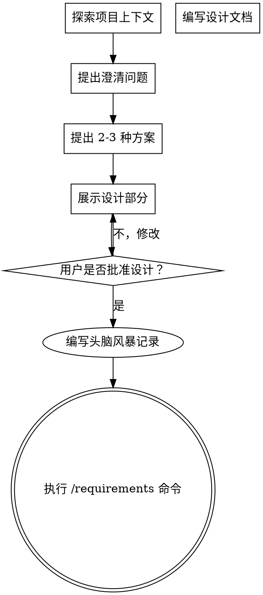

# 头脑风暴：将想法转化为设计

## 概览 (Overview)

通过自然的协作对话，帮助将想法转化为完全成型的设计和规范。

首先了解当前项目上下文，然后一次问一个问题来完善想法。一旦你明白要构建什么，就展示设计并获得用户批准。

<HARD-GATE>
在展示设计并获得用户批准之前，不要调用任何实施技能、编写任何代码、搭建任何项目框架或采取任何实施行动。这适用于每个项目，无论其看起来多么简单。
</HARD-GATE>

## 反模式：“这太简单了，不需要设计”

每个项目都要经过这个过程。代办事项列表、单功能实用程序、配置更改——所有这些项目都是如此。“简单”的项目往往因为未经验证的假设而导致最多无用的工作负荷。设计可以很简短（对于真正简单的项目可能只有几句话），但你必须展示它并获得批准。

## 检查清单 (Checklist)

对于这些项目，你必须为每一项创建一个任务并按顺序完成：

1. **探索项目上下文** — 检查文件、文档、最近的提交记录
2. **提出澄清问题** — 每次一个，了解目的/约束条件/成功标准
3. **提出 2-3 种方案** — 附带权衡分析和你的建议
4. **展示设计** — 根据复杂性分阶段展示，在每一部分之后获取用户批准
5. **编写头脑风暴记录** — 保存到 `docs/04-project-development/02-discovery/brainstorm-record.md` 并提交
6. **过渡到需求阶段** — 执行 `/requirements` 命令来生成 PRD

## 流程图 (Process Flow)

**终点状态是执行 `/requirements`。** 不要调用 frontend-design、mcp-builder 或任何其他实施技能。头脑风暴之后执行的唯一命令就是 `/requirements`。

## 过程 (The Process)

**理解想法：**
- 首先检查当前的项目状态（文件、文档、最近提交等）
- 一次提一个问题来完善想法
- 只要可能，优先使用选择题，但开放式问题也可以
- 每条消息只问一个问题 - 如果需要进一步探索某个主题，请将其拆分为多个问题
- 专注于弄清楚：项目目标、约束条件、成功判断标准

**探索多种方案：**
- 提出 2-3 种具有不同权衡情况的替代方案
- 以对话式的口吻展示各个选项，并附带您的推荐理由
- 重点介绍你所推荐的方案并解释原因

**展示设计：**
- 当你确信自己理解了要构建的内容后，请展示设计方案
- 视复杂程度调整各部分的篇幅：如果直截了当，则只需几句话；如果有细微差别，则可能需要 200-300 字
- 在每个部分之后询问这看起来是否合适
- 需要涵盖：架构、组件、数据流、错误处理机制、测试方案
- 如果有讲不通的地方，做好返回去进行澄清的准备

## 设计之后 (After the Design)

**初始化项目文档目录：**
- 在当前项目下创建 `docs/` 目录结构
- 参考 `document-templates` 技能获取完整目录结构
- 如果目录已存在则跳过

**编写头脑风暴记录：**
- 将探索过程和结论写入 `docs/04-project-development/02-discovery/brainstorm-record.md`
- 使用 `document-templates` 技能中的"头脑风暴记录"模板
- 记录内容包含：项目背景、用户意图、探索过程、方案比较、最终决定、约束条件
- 将记录提交到 Git

**过渡到需求阶段：**
- 调用 `/requirements` 命令以生成正式的 PRD（产品需求文档）
- `/requirements` 会自动读取头脑风暴记录作为输入
- 请勿直接调用实施技能。`/requirements` 就是下一步要做的。

## 关键原则 (Key Principles)

- **一次提一个问题** - 不要用多个问题让用户感到应接不暇
- **优先考虑选择题** - 在可能的情况下，比开放式问题更容易回答
- **无情贯彻 YAGNI (你不需要它)** - 从所有设计中移除不必要的功能
- **探索替代方案** - 必须在定案之前提出 2-3 种不同的方案
- **增量式验证** - 展示设计方案，在继续之前获得用户批准
- **保持灵活性** - 遇到讲不通的地方时，回过头去进行澄清

