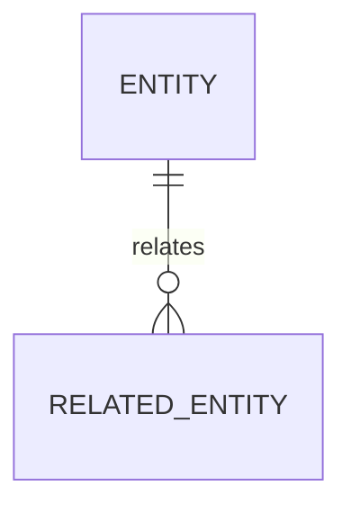

# 数据库设计模板

用于数据库基线、实体关系和迁移策略设计。

## 版本信息

| 项目 | 内容 |
|---|---|
| 文档编号 |  |
| 文档类型 |  |
| 当前版本 | `0.1.0` |
| 当前状态 | 草稿 |
| 最近更新 |  |

## 版本历史

| 版本 | 修改内容 | 日期 | 修改人 | 审核 | 批准 |
|---|---|---|---|---|---|
| `0.1.0` | 初版 |  |  | 待审核 | 待批准 |

## 范围

- 数据库：
- Schema：
- 关联领域：
- 关联 work item：

## ERD

## 实体

| 实体 | 职责 | 主键 | 关键字段 | 约束 |
|---|---|---|---|---|
|  |  |  |  |  |

## 索引和约束

- 唯一约束：
- 外键约束：
- 查询索引：
- 数据保留：

## 迁移策略

- 向前迁移：
- 回滚策略：
- 兼容窗口：
- 数据校验：
