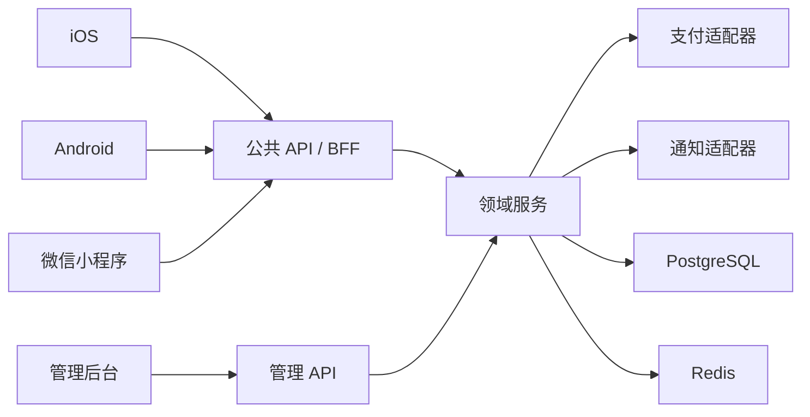

# 方案总览

## 版本信息

| 文档编号 | 版本 | 状态 | 负责人 | 更新日期 |
|---|---|---|---|---|
| `DOC-SOLUTION-001` | `0.1.0` | 样例 | 技术负责人、设计负责人 | 2026-07-24 |

## 版本历史

| 版本 | 修改内容 | 日期 | 修改人 | 审核 | 批准 |
|---|---|---|---|---|---|
| `0.1.0` | 建立全渠道方案 | 2026-07-24 | AI 示例作者 | 待审核 | 待批准 |

## 方案

四端共享产品语义、API、业务状态、内容模型、设计语义 Token 和验收标准；导航、输入、权限、支付、通知和系统控件按平台实现。

## 关键决定

1. 订单保存成交价和政策快照，后续服务价格变化不回写历史。
2. 支付回调是最终支付事实，客户端 SDK 结果只改变展示状态。
3. 管理后台详情使用独立页面和返回按钮，筛选状态通过 URL 保存。
4. 小程序不复制原生 App 的全部能力，优先完成低摩擦预约和微信支付。
5. Penpot 维护视觉事实；文档维护目的、状态、平台差异和验收规则。

## 失败与恢复

| 失败 | 恢复 |
|---|---|
| 时段被抢占 | 返回冲突和替代时段，不创建无效订单 |
| 支付回跳失败 | 通过订单号查询服务端状态 |
| 回调重复/乱序 | 事件幂等、状态机拒绝倒退、定时对账 |
| 通知失败 | 订单事实不回滚，应用内可查询，异步重试 |
| 管理端越权 | 服务端 403、审计拒绝事件，不只依赖前端隐藏 |
