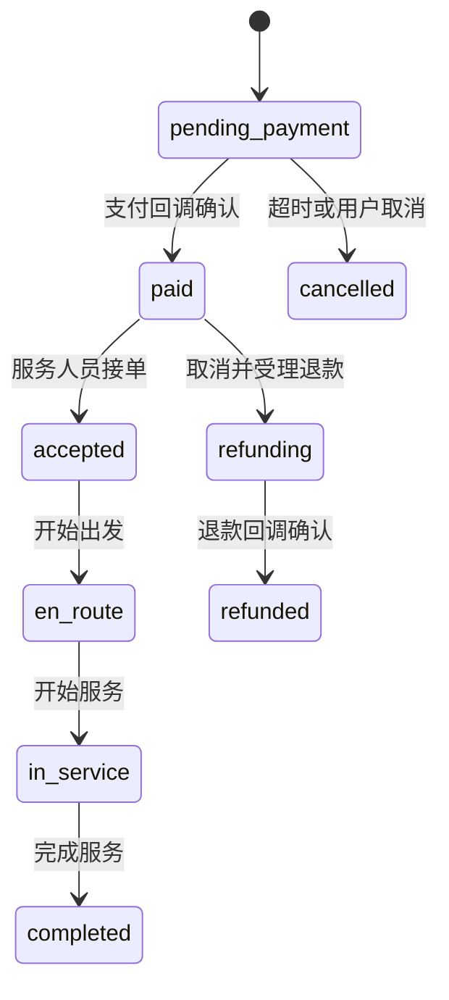

# 系统架构与模块边界

## 版本信息

| 文档编号 | 版本 | 状态 | 负责人 | 更新日期 |
|---|---|---|---|---|
| `DOC-ARCH-001` | `0.1.0` | 样例 | 技术负责人 | 2026-07-24 |

## 版本历史

| 版本 | 修改内容 | 日期 | 修改人 | 审核 | 批准 |
|---|---|---|---|---|---|
| `0.1.0` | 定义领域和依赖边界 | 2026-07-24 | AI 示例作者 | 待审核 | 待批准 |

## 架构项

| ID | 模块 | Owner | 职责 | 不负责 |
|---|---|---|---|---|
| `MOD-IDENTITY-001` | Identity | 身份团队 | 会话、消费者身份、员工身份映射 | 业务授权规则 |
| `MOD-CATALOG-001` | Catalog | 商品团队 | 服务、分类、服务说明、未来价格 | 订单成交价 |
| `MOD-BOOKING-001` | Booking | 履约团队 | 人员日程、时段库存、短期锁定 | 支付 |
| `MOD-ORDER-001` | Order | 交易团队 | 订单状态、成交快照、业务编排 | 第三方支付协议 |
| `MOD-PAYMENT-001` | Payment | 交易团队 | 支付意图、回调、退款、对账 | 取消政策 |
| `MOD-FULFILL-001` | Fulfillment | 履约团队 | 接单、出发、服务和完成事件 | 服务目录 |
| `MOD-AFTER-001` | AfterSales | 客服团队 | 取消规则、退款申请、售后 | 支付渠道实现 |
| `MOD-NOTIFY-001` | Notification | 平台团队 | Push、短信、订阅消息发送 | 订单事实 |
| `MOD-ADMIN-001` | Admin | 平台团队 | RBAC、数据范围、运营查询、审计 | 消费者身份认证 |

## 依赖方向

- 客户端只调用公共 API，不直连数据库、支付或内部服务。
- Order 可调用 Catalog、Booking、Payment、Fulfillment 的公开端口。
- Payment 通过适配器调用微信或聚合支付；领域层不依赖 SDK 类型。
- Admin 的查询模型可聚合数据，但写操作仍调用对应领域命令。
- Notification 消费领域事件，发送失败不回滚订单事务。

## 订单状态机

状态不能倒退；异常修复通过补偿事件和审计记录完成，不能直接改库隐藏历史。

## 安全边界

- 身份认证与资源授权分离。
- 地址和手机号按角色、订单状态和用途动态脱敏。
- 管理写操作携带操作者身份、业务原因和 traceId。
- Webhook 验签、重放保护、金额核对和商户号核对必须在信任边界完成。
