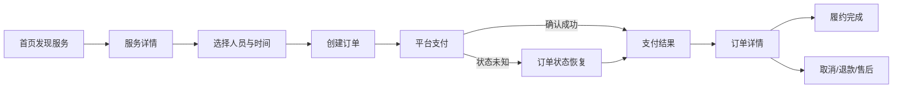

# UX/UI 设计

## 版本信息

| 文档编号 | 版本 | 状态 | 负责人 | 更新日期 |
|---|---|---|---|---|
| `DOC-UXUI-001` | `0.1.1` | 样例 | UX/UI 负责人 | 2026-07-24 |

## 版本历史

| 版本 | 修改内容 | 日期 | 修改人 | 审核 | 批准 |
|---|---|---|---|---|---|
| `0.1.1` | 明确管理后台 shadcn/ui 实现映射 | 2026-07-24 | AI 示例作者 | 待审核 | 待批准 |
| `0.1.0` | 建立四端关键流程与页面 | 2026-07-24 | AI 示例作者 | 待审核 | 待批准 |

## 设计目标

- 用户在任一消费者端能理解“服务是什么、多少钱、何时可约、失败后怎么办”。
- 跨端结果一致，过程尊重平台习惯。
- 运营后台优先可读业务标题、独立详情页、筛选保留和审计可见。

## 用户流

## Penpot 页面

| 页面 | 用途 | 画板 |
|---|---|---|
| `00-说明` | 范围、P0 闭环和交付物 | `YUEXIANG-OMNICHANNEL-DESIGN` |
| `01-设计系统` | Token、组件、状态和映射 | `DS-001-共享设计系统` |
| `02-iOS` | iOS 关键路径 | `UI-IOS-001` 至 `UI-IOS-005` |
| `03-Android` | Android 关键路径 | `UI-AND-001` 至 `UI-AND-005` |
| `04-微信小程序` | 低摩擦预约与微信支付 | `UI-WX-001` 至 `UI-WX-004` |
| `05-管理后台` | 总览、订单、服务、权限与审计 | `UI-ADM-001` 至 `UI-ADM-005` |

## 界面清单

| UI ID | 中文标题 | 目的 | 主操作 | 对应需求 |
|---|---|---|---|---|
| `UI-*-001` | 首页 | 发现和搜索可售服务 | 打开服务 | `REQ-CATALOG-001` |
| `UI-*-002` | 服务详情 | 理解服务、价格和政策 | 选择时间 | `REQ-CATALOG-002` |
| `UI-*-003` | 确认预约 | 选择人员、时间和地址 | 创建订单并支付 | `REQ-BOOKING-001`、`REQ-ORDER-001` |
| `UI-*-004` | 支付结果 | 确认结果或恢复查询 | 查看订单 | `REQ-PAY-001` |
| `UI-IOS/AND-005` | 订单详情 | 查看履约和售后 | 联系、取消或售后 | `REQ-FULFILL-001`、`REQ-AFTER-001` |
| `UI-ADM-001` | 运营总览 | 发现需要处理的经营问题 | 打开指标或订单 | `REQ-ADMIN-001` |
| `UI-ADM-002` | 订单列表 | 定向筛选订单 | 打开独立详情 | `REQ-ADMIN-001` |
| `UI-ADM-003` | 订单详情 | 理解订单全貌并处理 | 联系、取消、退款 | `REQ-ADMIN-001`、`REQ-AFTER-001` |
| `UI-ADM-004` | 服务管理 | 维护服务和未来价格 | 保存修改 | `REQ-ADMIN-002` |
| `UI-ADM-005` | 权限与审计 | 控制高风险操作并追踪变更 | 保存角色权限 | `REQ-ADMIN-003` |

## 管理后台实现约束

- 使用 shadcn/ui 组合后台外壳、数据表格、表单、状态、空态、反馈和确认流程，具体映射见 [设计系统](design-system.md)。
- 订单、服务和权限详情使用独立 URL 页面与“返回列表”按钮；筛选条件保存在 URL。
- 组件必须覆盖默认、加载、空、错误、禁用和无权限状态，并保留键盘操作、可见焦点和可读标题。

## 必须覆盖的状态

| 状态 | 表达和恢复 |
|---|---|
| 首次加载 | 保留真实结构占位，短请求不闪骨架 |
| 空结果 | 解释筛选/区域原因，提供清除或切换 |
| 网络失败 | 保留输入和筛选，提供明确重试 |
| 时段冲突 | 标记已不可用并返回替代时间 |
| 支付未知 | 显示“正在确认”，进入订单查询；禁止重复支付 |
| 权限拒绝 | 解释价值，允许手动地址或应用内查询 |
| 部分成功 | 订单已创建但通知失败时，订单仍可查看 |
| 超长文本/大字体 | 容器增高，不截断价格、错误和主操作 |

## 无障碍

- iOS 触控目标至少 44pt，Android 通常至少 48dp。
- 管理后台支持键盘全流程、焦点可见、错误摘要和 200% 文本缩放。
- 状态不只靠颜色；图标、标题和正文共同表达。
- `Reduce Motion`/`移除动画` 下用短淡入或即时状态替代大幅位移。
