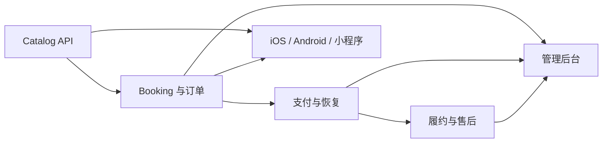

# 悦享服务实施计划

## 版本信息

| 文档编号 | 版本 | 状态 | 负责人 | 更新日期 |
|---|---|---|---|---|
| `DOC-PLAN-001` | `0.1.1` | 样例计划 | 交付负责人 | 2026-07-24 |

## 版本历史

| 版本 | 修改内容 | 日期 | 修改人 | 审核 | 批准 |
|---|---|---|---|---|---|
| `0.1.1` | 指定管理后台使用 shadcn/ui 实施 | 2026-07-24 | AI 示例作者 | 待审核 | 待批准 |
| `0.1.0` | 建立四端交付顺序和完成定义 | 2026-07-24 | AI 示例作者 | 待审核 | 待批准 |

## 实施原则

1. 先交付共享领域与 API，再并行接入各端。
2. 订单、支付、退款按幂等和可恢复路径优先实现。
3. 每个增量同时包含业务逻辑、界面状态、日志、测试和文档。
4. 需求、设计或接口变化在原文档增补版本历史，不为同一事实新建平行文档。

## 增量计划

| 增量 | 交付目标 | 需求范围 | 主要产物 | 进入条件 | 完成定义 |
|---|---|---|---|---|---|
| `INC-01` | 可浏览服务 | `REQ-CATALOG-001/002` | Catalog API、四端列表/详情、后台服务只读页 | PRD 与 API 已评审 | 正常/空/错误态通过；P95 指标可观测 |
| `INC-02` | 可创建预约 | `REQ-BOOKING-001`、`REQ-ORDER-001` | 库存查询、订单创建、价格快照、四端预约流程 | `INC-01` 完成 | 并发冲突和幂等测试通过 |
| `INC-03` | 可支付并恢复 | `REQ-PAY-001` | 支付意图、回调、对账、恢复页 | 沙箱商户可用 | 重复/乱序回调不重复入账 |
| `INC-04` | 可履约与售后 | `REQ-FULFILL-001`、`REQ-AFTER-001` | 履约事件、取消、退款、通知 | 订单状态机稳定 | 用户与后台状态一致；退款可追踪 |
| `INC-05` | 可运营与审计 | `REQ-ADMIN-001/002/003`、`REQ-REVIEW-001` | 后台列表/详情、服务管理、RBAC、审计、评价 | 权限模型评审通过 | 高风险操作有授权、原因和审计记录 |

## 工作包

| ID | 工作说明 | 目的 | 输入 | 输出 | 验证 |
|---|---|---|---|---|---|
| `TASK-BE-001` | 实现 Catalog、Booking、Order 模块及数据库迁移 | 建立可预约的最小业务闭环 | PRD、架构、数据设计、OpenAPI | 服务代码、迁移、单元/集成测试 | `TC-CATALOG-001`、`TC-ORDER-001/002` |
| `TASK-BE-002` | 实现支付回调、对账与退款流程 | 防止重复扣款并支持异常恢复 | 支付设计、状态机、安全要求 | Payment/AfterSales 服务、任务与告警 | `TC-PAY-001/002`、`TC-AFTER-001` |
| `TASK-IOS-001` | 用 SwiftUI 实现 iOS P0 流程 | 提供符合 iOS 习惯的消费者体验 | `UI-IOS-*`、OpenAPI | iOS 页面、状态和自动化测试 | `TC-CATALOG-001`、`TC-ORDER-002`、`TC-PAY-002`、`TC-AFTER-001` |
| `TASK-AND-001` | 用 Compose 实现 Android P0 流程 | 提供符合 Android 习惯的消费者体验 | `UI-AND-*`、OpenAPI | Android 页面、状态和自动化测试 | `TC-CATALOG-001`、`TC-ORDER-002`、`TC-PAY-002`、`TC-AFTER-001` |
| `TASK-WX-001` | 实现微信小程序轻量预约流程 | 利用微信登录和支付完成低门槛转化 | `UI-WX-*`、OpenAPI | 小程序页面、宿主能力适配、自动化测试 | `TC-CATALOG-001`、`TC-ORDER-002`、`TC-PAY-002` |
| `TASK-ADM-001` | 使用 React + shadcn/ui 实现后台订单、服务和权限页面 | 让运营安全处理订单与配置 | `UI-ADM-*`、Admin API、设计系统组件映射 | `Sidebar` 后台外壳、Data Table 列表、独立详情路由、`Field` 表单、`Badge` 状态、`AlertDialog` 高风险确认、权限与审计 | `TC-ADMIN-001/002`；键盘、加载、空、错误和无权限状态 |

## 依赖与并行

四端可以在 OpenAPI 和设计画板稳定后并行，但订单状态、错误码和支付恢复语义由后端契约统一，不在客户端各自发明。

## 完成定义

- 对应需求和验收标准有稳定 ID，并在追踪矩阵中形成闭环。
- 代码评审、静态检查、单元/集成测试和适用的端到端测试通过。
- API 契约、数据库迁移、回滚和观测项同步交付。
- 正常、加载、空、错误、无权限、离线或中断恢复状态按适用范围实现。
- 没有未解释的测试跳过；发布决策能追溯到测试结果。
